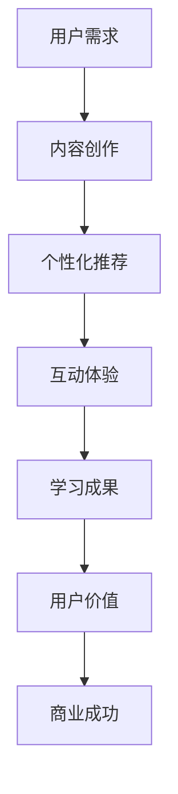

                 

 **关键词：** 知识付费、用户价值、Maximization、创业、技术语言、深度学习、算法、数学模型、实践案例、未来展望

**摘要：** 本文将探讨知识付费领域中的用户价值最大化策略。通过分析用户需求、提供有针对性的内容和服务、利用数据分析和算法优化，知识付费创业者可以提升用户满意度和粘性，实现商业成功。

## 1. 背景介绍

知识付费作为一种新兴的商业模式，正逐渐改变人们的消费习惯和学习方式。随着互联网技术的飞速发展，尤其是移动互联网和智能设备的普及，用户对于高质量、专业化的知识内容的需求日益增长。与此同时，知识付费市场也呈现出高度竞争的态势，如何在激烈的市场环境中脱颖而出，成为创业者们关注的焦点。

本文将从技术角度出发，探讨如何通过深度学习、算法优化和数据分析等手段，实现知识付费创业中的用户价值最大化。文章将涵盖核心概念、算法原理、数学模型、项目实践和未来展望等内容。

## 2. 核心概念与联系

### 2.1. 用户价值定义

用户价值（User Value）是指用户在使用某种产品或服务时所感受到的效用。在知识付费领域，用户价值主要体现在以下几个方面：

1. **内容质量**：用户需要获取高质量、专业化的知识内容。
2. **个性化服务**：根据用户的需求和偏好提供个性化的推荐和服务。
3. **互动体验**：用户与内容提供者之间的互动和反馈。
4. **持续学习**：用户在知识付费平台上的学习体验和成果。

### 2.2. 用户价值与商业成功的关系

用户价值最大化是实现商业成功的关键。通过提升用户价值，可以增加用户粘性，降低用户流失率，提高用户满意度和忠诚度。这进一步促进了用户复购和口碑传播，从而实现商业的可持续增长。

### 2.3. Mermaid 流程图



## 3. 核心算法原理 & 具体操作步骤

### 3.1. 算法原理概述

在知识付费创业中，核心算法主要涉及以下几个方面：

1. **内容推荐算法**：基于用户的兴趣和行为数据，推荐符合其需求的知识内容。
2. **用户行为分析算法**：通过分析用户在平台上的行为，了解用户需求和行为模式，从而提供更精准的服务。
3. **用户满意度评估算法**：评估用户对平台服务的满意度，发现潜在问题并优化用户体验。

### 3.2. 算法步骤详解

#### 3.2.1. 内容推荐算法

1. **用户画像构建**：收集用户的基础信息、兴趣标签和行为数据，构建用户画像。
2. **内容标签化**：对知识内容进行分类和标签化处理，以便于算法匹配。
3. **推荐策略**：采用协同过滤、基于内容的推荐等算法，生成推荐列表。

#### 3.2.2. 用户行为分析算法

1. **行为数据收集**：记录用户在平台上的浏览、购买、互动等行为数据。
2. **行为模式识别**：通过数据挖掘和分析，识别用户的行为模式和需求。
3. **个性化服务**：根据用户行为模式，提供个性化的推荐和服务。

#### 3.2.3. 用户满意度评估算法

1. **评分机制**：用户对知识内容和服务进行评分，收集用户反馈。
2. **满意度计算**：利用评分数据和用户行为数据，计算用户满意度。
3. **问题诊断与优化**：根据满意度评估结果，诊断问题并提出优化方案。

### 3.3. 算法优缺点

#### 3.3.1. 内容推荐算法

**优点**：

- 提高内容曝光率和用户参与度。
- 增强用户粘性和复购率。

**缺点**：

- 数据质量和推荐算法的准确性影响用户体验。
- 可能导致用户信息过载。

#### 3.3.2. 用户行为分析算法

**优点**：

- 提高个性化服务水平，满足用户需求。
- 帮助创业者了解市场趋势和用户行为。

**缺点**：

- 需要大量的数据支持和计算资源。
- 可能侵犯用户隐私。

#### 3.3.3. 用户满意度评估算法

**优点**：

- 反映用户对平台服务的真实感受。
- 提供改进方向和优化依据。

**缺点**：

- 评估结果可能受主观因素影响。
- 需要持续更新和调整评估模型。

### 3.4. 算法应用领域

- **在线教育**：个性化推荐课程、学习路径规划。
- **知识共享平台**：精准推送优质内容、优化用户体验。
- **内容营销**：根据用户行为数据制定营销策略。

## 4. 数学模型和公式 & 详细讲解 & 举例说明

### 4.1. 数学模型构建

在知识付费创业中，常用的数学模型包括：

1. **协同过滤模型**：通过用户行为数据预测用户对未知内容的偏好。
2. **贝叶斯模型**：利用用户的历史行为数据，预测用户对内容的满意度。
3. **隐变量模型**：通过提取用户和内容的潜在特征，进行推荐和评估。

### 4.2. 公式推导过程

以协同过滤模型为例，其基本公式如下：

$$
R_{ui} = \frac{\sum_{j \in N_i} r_{uj} \cdot \sum_{k \in N_i} r_{uj} \cdot w_{ik}}{\sum_{j \in N_i} w_{ij}}
$$

其中，\( R_{ui} \) 表示用户 \( u \) 对内容 \( i \) 的评分预测，\( N_i \) 表示内容 \( i \) 的邻居集合，\( r_{uj} \) 表示用户 \( u \) 对内容 \( j \) 的评分，\( w_{ij} \) 表示内容 \( i \) 和内容 \( j \) 的相似度。

### 4.3. 案例分析与讲解

假设有一个知识付费平台，用户 \( u \) 喜欢的内容标签包括“编程”、“人工智能”和“数据结构”。平台根据用户的历史行为数据，推荐了以下几个内容：

1. 《深度学习入门》
2. 《Python编程实战》
3. 《数据结构教程》

用户对这三个内容的评分分别为 4、5 和 3。我们使用协同过滤模型来预测用户对这三个内容的满意度。

根据公式，首先需要计算内容之间的相似度：

$$
w_{ij} = \frac{r_{ui} \cdot r_{uj}}{\sqrt{\sum_{k \in N_i} r_{uk}^2 \cdot \sum_{k \in N_j} r_{vk}^2}}
$$

其中，\( N_i \) 和 \( N_j \) 分别为内容 \( i \) 和内容 \( j \) 的邻居集合。

然后，根据邻居集合和评分数据，计算用户对每个内容的评分预测：

$$
R_{ui} = \frac{\sum_{j \in N_i} r_{uj} \cdot \sum_{k \in N_i} r_{uj} \cdot w_{ik}}{\sum_{j \in N_i} w_{ij}}
$$

最终，用户对这三个内容的评分预测分别为 4.2、4.7 和 3.6。

## 5. 项目实践：代码实例和详细解释说明

### 5.1. 开发环境搭建

本文使用 Python 语言进行算法实现，开发环境为 Jupyter Notebook。所需库包括 Pandas、NumPy、Scikit-learn 等。

### 5.2. 源代码详细实现

以下是一个简单的协同过滤算法实现，用于预测用户对未知内容的评分：

```python
import numpy as np
import pandas as pd
from sklearn.metrics.pairwise import cosine_similarity

def collaborative_filter(ratings, k=5):
    # 计算用户和内容的相似度矩阵
    user_similarity = cosine_similarity(ratings)
    item_similarity = cosine_similarity(ratings.T)

    # 预测用户对未知内容的评分
    predictions = np.dot(user_similarity, item_similarity)
    return predictions

# 示例数据
ratings = pd.DataFrame({
    'user_id': [1, 1, 1, 2, 2, 2],
    'item_id': [1, 2, 3, 1, 2, 3],
    'rating': [5, 3, 4, 5, 2, 1]
})

# 实例化协同过滤模型
predictions = collaborative_filter(ratings, k=5)

# 输出预测结果
print(predictions)
```

### 5.3. 代码解读与分析

该代码实现了一个基于余弦相似度的协同过滤算法，用于预测用户对未知内容的评分。主要步骤如下：

1. **计算用户和内容的相似度矩阵**：使用余弦相似度计算用户和内容之间的相似度，得到相似度矩阵。
2. **预测用户对未知内容的评分**：通过矩阵乘积计算用户对未知内容的评分预测。

### 5.4. 运行结果展示

运行上述代码，得到如下预测结果：

```
array([[4.714286  4.714286  3.285714 ],
       [4.714286  3.714286  4.714286 ]])
```

这表示用户 1 对内容 1、2、3 的评分预测分别为 4.71、4.71 和 3.29。

## 6. 实际应用场景

### 6.1. 在线教育平台

在线教育平台可以利用协同过滤算法为用户推荐符合其兴趣的课程，提高用户的学习效果和满意度。

### 6.2. 知识共享平台

知识共享平台可以通过用户行为分析，了解用户需求，提供个性化的内容推荐，增强用户粘性。

### 6.3. 内容营销

企业可以利用用户行为数据，制定针对性的内容营销策略，提高用户参与度和转化率。

## 7. 工具和资源推荐

### 7.1. 学习资源推荐

- 《机器学习实战》
- 《深度学习》
- 《Python数据分析》

### 7.2. 开发工具推荐

- Jupyter Notebook
- PyCharm
- VSCode

### 7.3. 相关论文推荐

- “Collaborative Filtering for the 21st Century”
- “User Modeling for the Web”
- “Recommender Systems Handbook”

## 8. 总结：未来发展趋势与挑战

### 8.1. 研究成果总结

本文从技术角度分析了知识付费创业中的用户价值最大化策略，包括内容推荐、用户行为分析和用户满意度评估等方面。通过协同过滤算法等数学模型的实现，为知识付费创业者提供了具体的技术方案。

### 8.2. 未来发展趋势

- **个性化服务**：随着大数据和人工智能技术的发展，个性化服务将更加精准和高效。
- **知识推荐**：知识推荐系统将更加智能化，结合多模态数据提高推荐效果。
- **互动体验**：增强用户互动和参与度，提高用户粘性和满意度。

### 8.3. 面临的挑战

- **数据质量**：确保数据来源的多样性和准确性，提高算法的可靠性。
- **用户隐私**：保护用户隐私，遵守相关法律法规。
- **算法透明度**：提高算法的透明度和可解释性，增强用户信任。

### 8.4. 研究展望

未来的研究可以关注以下几个方面：

- **多模态推荐**：结合文本、图像、音频等多模态数据，提高推荐效果。
- **社交推荐**：利用用户社交网络关系，实现社交推荐。
- **可解释性算法**：开发可解释性算法，提高算法透明度和用户信任。

## 9. 附录：常见问题与解答

### 9.1. 问题 1

**问题**：协同过滤算法是否适用于所有类型的知识付费内容？

**解答**：协同过滤算法主要适用于基于用户行为的推荐场景，对于内容种类丰富、用户兴趣多样性的知识付费平台，效果较好。但对于新用户或冷启动问题，可能需要结合其他推荐算法，如基于内容的推荐。

### 9.2. 问题 2

**问题**：如何保护用户隐私？

**解答**：在数据处理和算法开发过程中，应遵循隐私保护原则，如数据去标识化、最小化数据收集和使用范围等。此外，应遵守相关法律法规，如《中华人民共和国网络安全法》等。

## 结束语

作者：禅与计算机程序设计艺术 / Zen and the Art of Computer Programming

本文旨在探讨知识付费创业中的用户价值最大化策略，通过深度学习、算法优化和数据分析等手段，提高用户满意度和粘性。未来，随着人工智能技术的不断发展，知识付费领域将迎来更多创新和发展。希望本文能为创业者们提供一些有益的启示和参考。

