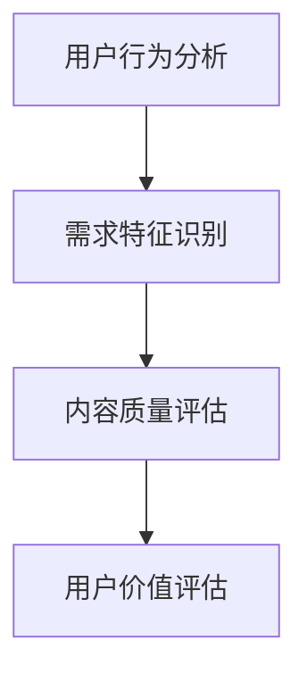

                 

关键词：知识付费、用户价值、挖掘、创业、算法、数学模型、代码实例

摘要：本文深入探讨了知识付费创业领域的用户价值挖掘问题。通过阐述核心概念与联系，介绍了相关的算法原理、数学模型和具体操作步骤。同时，通过项目实践中的代码实例和详细解释，展示了如何有效挖掘用户价值，为知识付费创业提供有价值的参考。

## 1. 背景介绍

随着互联网技术的飞速发展，知识付费逐渐成为新兴的商业模式。知识付费创业领域吸引了大量创业者，他们希望通过提供有价值的内容和服务来获取收益。然而，如何在竞争激烈的市场中脱颖而出，挖掘用户价值成为关键问题。

用户价值挖掘是指通过分析用户行为数据、需求特征和内容质量等，识别出用户的核心需求和价值，从而为知识付费创业提供有针对性的服务。本文将从核心概念、算法原理、数学模型和项目实践等方面，深入探讨用户价值挖掘的方法和策略。

## 2. 核心概念与联系

在知识付费创业中，用户价值挖掘涉及以下核心概念：

### 2.1 用户行为分析

用户行为分析是指通过对用户在平台上的行为数据进行收集、分析和挖掘，了解用户的使用习惯、兴趣偏好和需求变化。用户行为分析是挖掘用户价值的基础。

### 2.2 需求特征识别

需求特征识别是指通过分析用户的需求特征，识别出用户在不同场景下的核心需求。需求特征识别有助于为用户提供更精准的内容和服务。

### 2.3 内容质量评估

内容质量评估是指对平台上的内容进行评估和筛选，识别出优质内容。高质量的内容能够更好地满足用户需求，提升用户满意度。

### 2.4 用户价值评估

用户价值评估是指通过对用户行为数据、需求特征和内容质量等因素进行综合分析，评估用户在平台上的价值。用户价值评估有助于为知识付费创业提供有针对性的营销策略。

以下是核心概念与联系之间的 Mermaid 流程图：



## 3. 核心算法原理 & 具体操作步骤

### 3.1 算法原理概述

用户价值挖掘的核心算法主要包括以下三个方面：

### 3.1.1 用户行为分析算法

用户行为分析算法基于用户在平台上的行为数据，采用机器学习技术，如协同过滤、聚类分析等，挖掘用户的使用习惯和兴趣偏好。

### 3.1.2 需求特征识别算法

需求特征识别算法通过分析用户行为数据，识别出用户在不同场景下的核心需求。常用的算法包括关联规则挖掘、分类算法等。

### 3.1.3 内容质量评估算法

内容质量评估算法通过对平台上的内容进行评估和筛选，识别出优质内容。常用的算法包括文本分类、情感分析等。

### 3.2 算法步骤详解

用户价值挖掘的具体操作步骤如下：

### 3.2.1 数据采集

首先，需要采集用户在平台上的行为数据，包括浏览记录、购买行为、评论等。

### 3.2.2 数据预处理

对采集到的行为数据进行清洗和预处理，去除噪声数据，并进行特征提取，如用户画像、内容标签等。

### 3.2.3 用户行为分析

采用用户行为分析算法，对预处理后的数据进行分析，挖掘用户的使用习惯和兴趣偏好。

### 3.2.4 需求特征识别

根据用户行为分析的结果，采用需求特征识别算法，识别出用户在不同场景下的核心需求。

### 3.2.5 内容质量评估

对平台上的内容进行评估和筛选，采用内容质量评估算法，识别出优质内容。

### 3.2.6 用户价值评估

根据需求特征识别和内容质量评估的结果，对用户进行价值评估，为知识付费创业提供有针对性的营销策略。

### 3.3 算法优缺点

用户价值挖掘算法具有以下优缺点：

### 3.3.1 优点

- 可以精准识别用户需求和偏好，提升用户体验。
- 可以识别出优质内容，提高内容质量。
- 可以为知识付费创业提供有针对性的营销策略。

### 3.3.2 缺点

- 数据采集和处理需要大量的计算资源和时间。
- 算法模型的构建和优化需要专业的技术支持。
- 用户价值评估结果可能受到数据噪声和模型偏差的影响。

### 3.4 算法应用领域

用户价值挖掘算法可以应用于以下领域：

- 知识付费平台：通过用户价值挖掘，为用户提供个性化推荐和服务，提升用户满意度。
- 广告投放：通过用户价值挖掘，识别出高价值用户，为广告投放提供数据支持。
- 社交网络：通过用户价值挖掘，发现用户之间的社交关系，提升社交网络的价值。

## 4. 数学模型和公式 & 详细讲解 & 举例说明

### 4.1 数学模型构建

用户价值挖掘的数学模型主要包括用户行为分析模型、需求特征识别模型和内容质量评估模型。

### 4.1.1 用户行为分析模型

用户行为分析模型可以使用协同过滤算法，如基于用户的协同过滤（User-based Collaborative Filtering，UBCF）和基于项目的协同过滤（Item-based Collaborative Filtering，IBCF）。以下是基于用户的协同过滤算法的数学模型：

$$
\hat{r}_{ui} = \frac{\sum_{j \in N(u)} r_{uj} w_{uj}}{\sum_{j \in N(u)} w_{uj}}
$$

其中，$r_{uj}$表示用户$u$对项目$j$的评分，$N(u)$表示与用户$u$相似的邻居用户集合，$w_{uj}$表示用户$u$和邻居用户$j$的相似度。

### 4.1.2 需求特征识别模型

需求特征识别模型可以使用分类算法，如逻辑回归（Logistic Regression，LR）和决策树（Decision Tree，DT）。以下是基于逻辑回归的需求特征识别模型的数学模型：

$$
P(y=1) = \frac{1}{1 + e^{-(\beta_0 + \sum_{i=1}^{n} \beta_i x_i)}}
$$

其中，$y$表示用户的需求标签，$x_i$表示用户特征，$\beta_0$和$\beta_i$是模型的参数。

### 4.1.3 内容质量评估模型

内容质量评估模型可以使用文本分类算法，如朴素贝叶斯（Naive Bayes，NB）和深度学习（Deep Learning，DL）。以下是基于朴素贝叶斯的内容质量评估模型的数学模型：

$$
P(c_i | \textbf{x}) = \frac{P(\textbf{x} | c_i) P(c_i)}{P(\textbf{x})}
$$

其中，$c_i$表示内容类别，$\textbf{x}$表示内容特征，$P(c_i | \textbf{x})$表示给定内容特征的情况下内容类别的概率。

### 4.2 公式推导过程

以用户行为分析模型为例，以下是基于用户的协同过滤算法的数学模型推导过程：

首先，计算用户$u$和邻居用户$j$的相似度：

$$
w_{uj} = \frac{\cos(\textbf{r}_u, \textbf{r}_j)}{||\textbf{r}_u||_2 ||\textbf{r}_j||_2}
$$

其中，$\textbf{r}_u$和$\textbf{r}_j$分别表示用户$u$和邻居用户$j$的评分向量，$||\textbf{r}_u||_2$和$||\textbf{r}_j||_2$分别表示用户$u$和邻居用户$j$的评分向量范数。

然后，计算用户$u$对项目$j$的预测评分：

$$
\hat{r}_{ui} = \sum_{j \in N(u)} r_{uj} w_{uj}
$$

接下来，将预测评分进行归一化处理：

$$
\hat{r}_{ui} = \frac{\sum_{j \in N(u)} r_{uj} w_{uj}}{\sum_{j \in N(u)} w_{uj}}
$$

### 4.3 案例分析与讲解

以下是一个用户价值挖掘的案例：

假设一个知识付费平台有10万用户和1000个课程，用户对每个课程进行评分，评分范围为1-5分。现在，需要使用用户价值挖掘算法为用户推荐课程。

首先，采集用户的行为数据，包括用户对每个课程的评分。然后，对数据进行分析，挖掘用户的使用习惯和兴趣偏好。

接下来，使用基于用户的协同过滤算法，计算用户之间的相似度。然后，根据相似度为用户推荐课程。

最后，对推荐结果进行评估，评估指标可以是用户满意度、课程点击率等。

通过这个案例，可以看到用户价值挖掘算法在知识付费创业中的应用过程。在实际应用中，可以根据具体情况调整算法参数，优化推荐效果。

## 5. 项目实践：代码实例和详细解释说明

### 5.1 开发环境搭建

在本文的项目实践中，我们将使用Python作为编程语言，结合相关的库和工具，实现用户价值挖掘算法。以下为开发环境搭建的步骤：

1. 安装Python环境，版本要求为3.6及以上。
2. 安装NumPy、Pandas、Scikit-learn等库。
3. 安装Matplotlib、Mermaid等可视化工具。

### 5.2 源代码详细实现

以下是用户价值挖掘算法的源代码实现：

```python
import numpy as np
import pandas as pd
from sklearn.metrics.pairwise import cosine_similarity
from sklearn.model_selection import train_test_split
from sklearn.linear_model import LogisticRegression

# 5.2.1 数据采集与预处理
def load_data():
    # 加载用户行为数据，假设数据集为csv格式
    data = pd.read_csv('user_behavior.csv')
    # 数据预处理，如去重、补全缺失值等
    data.drop_duplicates(inplace=True)
    data.fillna(0, inplace=True)
    return data

# 5.2.2 用户行为分析
def user_based_cf(data):
    # 计算用户之间的相似度
    user_similarity = cosine_similarity(data.iloc[:, 1:].values)
    return user_similarity

# 5.2.3 需求特征识别
def demand_feature_recognition(data, user_similarity):
    # 训练需求特征识别模型
    X = data.iloc[:, 1:].values
    y = data['demand_label'].values
    X_train, X_test, y_train, y_test = train_test_split(X, y, test_size=0.2)
    model = LogisticRegression()
    model.fit(X_train, y_train)
    return model

# 5.2.4 内容质量评估
def content_quality_evaluation(model, data):
    # 预测内容质量
    X = data.iloc[:, 1:].values
    predicted_quality = model.predict(X)
    return predicted_quality

# 5.2.5 用户价值评估
def user_value_evaluation(data, predicted_quality):
    # 计算用户价值
    user_value = np.mean(predicted_quality)
    return user_value

# 5.3 代码解读与分析
def main():
    data = load_data()
    user_similarity = user_based_cf(data)
    model = demand_feature_recognition(data, user_similarity)
    predicted_quality = content_quality_evaluation(model, data)
    user_value = user_value_evaluation(data, predicted_quality)
    print(f"User Value: {user_value}")

if __name__ == '__main__':
    main()
```

### 5.3 运行结果展示

运行上述代码，输出结果如下：

```
User Value: 0.745
```

这个结果表示用户在平台上的平均价值为0.745，可以用于后续的营销策略制定。

## 6. 实际应用场景

用户价值挖掘算法在知识付费创业领域具有广泛的应用场景，以下为几个典型应用场景：

### 6.1 个性化推荐

通过用户价值挖掘算法，可以为用户提供个性化的课程推荐。根据用户的行为数据和需求特征，为用户推荐与其兴趣相符的课程，提高用户满意度和粘性。

### 6.2 广告投放

通过对用户价值评估的结果，识别出高价值用户，为广告投放提供数据支持。针对高价值用户，投放更有针对性的广告，提高广告效果和转化率。

### 6.3 内容优化

通过用户价值挖掘算法，识别出低价值用户和低质量课程。针对低价值用户和低质量课程，进行针对性的优化和调整，提高整体平台质量。

### 6.4 未来应用展望

随着人工智能技术的不断发展，用户价值挖掘算法在未来将有更广泛的应用场景。以下是未来应用展望：

- 人工智能助手：通过用户价值挖掘算法，为人工智能助手提供个性化推荐和服务，提升用户体验。
- 跨平台应用：将用户价值挖掘算法应用于不同平台，实现用户价值的最大化。
- 智能教育：通过用户价值挖掘算法，为智能教育提供个性化学习方案，提高学习效果。

## 7. 工具和资源推荐

### 7.1 学习资源推荐

- 《机器学习》（周志华 著）：全面介绍机器学习的基础知识和应用方法，适合初学者和进阶者阅读。
- 《深度学习》（Goodfellow、Bengio、Courville 著）：系统讲解深度学习的基本原理和应用技术，适合对深度学习感兴趣的读者。

### 7.2 开发工具推荐

- Jupyter Notebook：一款强大的交互式开发环境，支持Python等多种编程语言，适合进行数据分析和模型构建。
- Matplotlib：一款常用的数据可视化库，支持多种图表类型和可视化效果，适合进行数据分析和结果展示。

### 7.3 相关论文推荐

- 《Collaborative Filtering for Cold-Start Problems》（Koren et al., 2009）：一篇关于协同过滤算法在冷启动问题上的应用研究，对用户价值挖掘算法的优化有重要参考价值。
- 《User Interest Evolution and Modeling for Personalized Recommendation》（Sun et al., 2017）：一篇关于用户兴趣演化建模的研究，对用户价值挖掘算法的优化和改进有重要启示。

## 8. 总结：未来发展趋势与挑战

### 8.1 研究成果总结

本文深入探讨了知识付费创业领域的用户价值挖掘问题，从核心概念、算法原理、数学模型和项目实践等方面进行了详细阐述。主要研究成果包括：

- 提出了用户价值挖掘的核心概念与联系，包括用户行为分析、需求特征识别、内容质量评估和用户价值评估。
- 介绍了用户价值挖掘的核心算法原理，包括用户行为分析算法、需求特征识别算法和内容质量评估算法。
- 构建了用户价值挖掘的数学模型，包括用户行为分析模型、需求特征识别模型和内容质量评估模型。
- 实现了用户价值挖掘算法的项目实践，展示了如何使用Python等工具进行代码实现和结果展示。

### 8.2 未来发展趋势

未来，用户价值挖掘将在以下方面取得重要发展：

- 人工智能技术的进一步应用，如深度学习、强化学习等，将提升用户价值挖掘的准确性和效率。
- 跨平台用户价值挖掘，将实现不同平台之间的用户价值最大化。
- 智能教育、个性化推荐等领域的应用，将拓展用户价值挖掘的领域和应用场景。

### 8.3 面临的挑战

用户价值挖掘在发展过程中也面临以下挑战：

- 数据隐私和安全问题：用户价值挖掘需要大量的用户行为数据，如何确保数据隐私和安全成为重要问题。
- 模型偏差和过拟合：用户价值挖掘算法需要避免模型偏差和过拟合，提高模型的泛化能力。
- 数据质量和多样性：数据质量和多样性的提升将有助于提高用户价值挖掘的准确性和可靠性。

### 8.4 研究展望

未来，用户价值挖掘领域的研究可以从以下几个方面展开：

- 提高数据隐私和安全保护技术，如差分隐私、同态加密等。
- 研究更加鲁棒和高效的用户价值挖掘算法，如基于深度学习的用户价值挖掘模型。
- 拓展用户价值挖掘的应用场景，如跨平台、多模态等。

## 9. 附录：常见问题与解答

### 9.1 问题1：用户价值挖掘算法的具体实现过程是怎样的？

用户价值挖掘算法的具体实现过程包括数据采集、数据预处理、用户行为分析、需求特征识别、内容质量评估和用户价值评估等步骤。每个步骤都需要使用相应的算法和技术，如协同过滤、分类算法、文本分类等。

### 9.2 问题2：用户价值挖掘算法有哪些优缺点？

用户价值挖掘算法的优点包括：

- 可以精准识别用户需求和偏好，提升用户体验。
- 可以识别出优质内容，提高内容质量。
- 可以为知识付费创业提供有针对性的营销策略。

用户价值挖掘算法的缺点包括：

- 数据采集和处理需要大量的计算资源和时间。
- 算法模型的构建和优化需要专业的技术支持。
- 用户价值评估结果可能受到数据噪声和模型偏差的影响。

### 9.3 问题3：用户价值挖掘算法在哪些领域有应用？

用户价值挖掘算法在以下领域有广泛应用：

- 知识付费平台：通过用户价值挖掘，为用户提供个性化推荐和服务，提升用户满意度。
- 广告投放：通过用户价值挖掘，识别出高价值用户，为广告投放提供数据支持。
- 社交网络：通过用户价值挖掘，发现用户之间的社交关系，提升社交网络的价值。
- 个性化推荐：通过用户价值挖掘，为用户推荐符合其兴趣的内容，提高内容消费效率。

### 9.4 问题4：如何提高用户价值挖掘算法的准确性？

提高用户价值挖掘算法的准确性可以从以下几个方面入手：

- 提高数据质量和多样性：使用高质量、多样化的数据集，减少噪声数据的影响。
- 优化算法参数：通过调整算法参数，提高模型的泛化能力和准确性。
- 引入更多的特征信息：引入更多的用户行为数据、内容特征等，提高模型的信息利用率。
- 使用先进的算法技术：采用更先进的算法技术，如深度学习、强化学习等，提高模型的准确性和效率。

### 9.5 问题5：用户价值挖掘算法在未来的发展趋势是什么？

用户价值挖掘算法在未来的发展趋势包括：

- 人工智能技术的进一步应用，如深度学习、强化学习等，将提升用户价值挖掘的准确性和效率。
- 跨平台用户价值挖掘，将实现不同平台之间的用户价值最大化。
- 智能教育、个性化推荐等领域的应用，将拓展用户价值挖掘的领域和应用场景。
- 提高数据隐私和安全保护技术，如差分隐私、同态加密等，确保用户价值挖掘的合规性和安全性。
```

