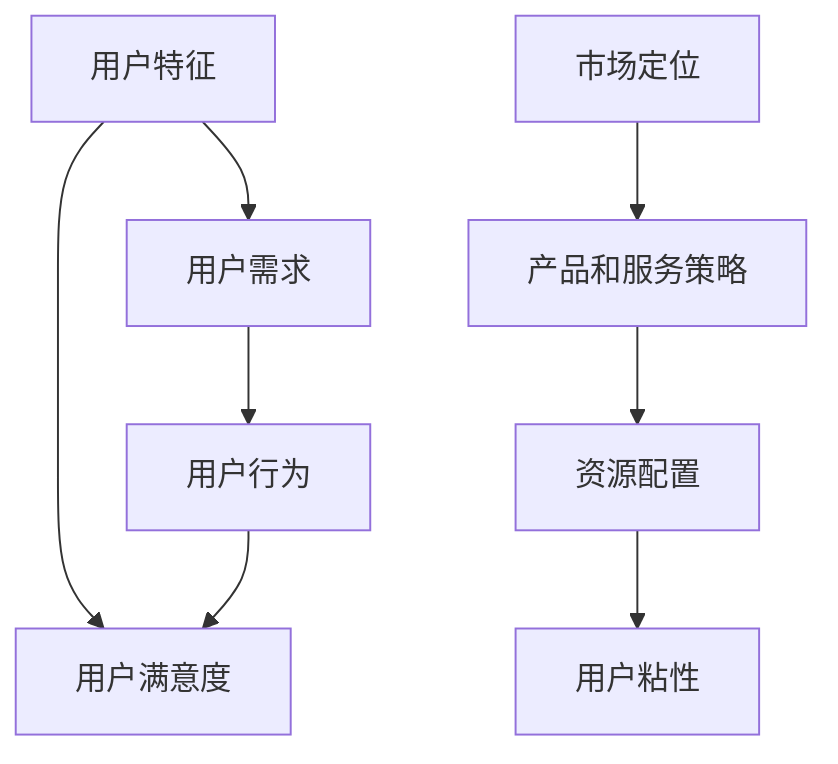

                 

关键词：知识付费、用户细分、市场定位、数据分析、策略优化

摘要：在知识付费领域，如何精准定位用户并制定有效的用户细分策略，是每个创业者都需要思考的问题。本文将探讨知识付费创业中用户细分的核心概念、方法、工具以及案例，旨在为读者提供实用的指导和思考。

## 1. 背景介绍

近年来，随着互联网和移动通信技术的迅猛发展，知识付费市场迅速崛起。越来越多的创业者看到了其中的巨大商机，纷纷投身于知识付费创业的浪潮中。然而，市场竞争日益激烈，如何脱颖而出成为每个创业者都需要面对的挑战。

用户细分作为一种有效的市场策略，可以帮助创业者更好地了解用户需求，优化产品和服务，提高市场竞争力。本文将结合知识付费领域的实际情况，深入探讨用户细分策略的制定和应用。

### 1.1 知识付费市场概述

知识付费是指用户为了获取特定的知识、技能或服务而付费的行为。随着人们对个人成长和职业发展的重视，知识付费市场呈现出高速增长的趋势。根据统计，我国知识付费市场规模在近年来不断攀升，预计未来几年仍将保持高速增长态势。

知识付费的主要形式包括在线课程、专业咨询、电子书、音频课程等。这些产品和服务满足了用户在知识获取、技能提升、职业发展等方面的需求，具有较高的市场潜力。

### 1.2 用户细分的重要性

用户细分是一种基于用户特征、需求和行为等因素，将用户群体划分为不同子群体的市场策略。通过用户细分，创业者可以更精准地定位用户，挖掘潜在需求，从而制定更有针对性的产品和服务策略。

在知识付费领域，用户细分的重要性体现在以下几个方面：

1. **提高市场竞争力**：通过用户细分，创业者可以针对不同用户群体的特点，提供更个性化的产品和服务，从而提高市场竞争力。

2. **优化资源配置**：用户细分可以帮助创业者更好地了解用户需求，合理分配资源和精力，提高运营效率。

3. **提高用户满意度**：精准的用户细分策略可以提升用户满意度，增强用户粘性，降低用户流失率。

4. **挖掘潜在用户**：通过用户细分，创业者可以发现潜在用户群体，开拓新的市场空间。

## 2. 核心概念与联系

在探讨用户细分策略之前，我们需要了解一些核心概念和它们之间的联系。以下是一个简化的用户细分策略的 Mermaid 流程图，展示了各个核心概念之间的关系。



### 2.1 用户特征

用户特征是指用户在年龄、性别、教育程度、职业等方面的基本属性。了解用户特征可以帮助创业者初步了解用户群体，为后续的细分提供基础数据。

### 2.2 用户需求

用户需求是指用户在知识获取、技能提升、职业发展等方面的具体需求。用户需求是用户细分的核心依据，通过分析用户需求，创业者可以更好地了解用户的核心痛点，制定针对性的解决方案。

### 2.3 用户行为

用户行为是指用户在使用产品和服务过程中的行为表现，如购买行为、浏览行为、互动行为等。用户行为数据可以反映用户的兴趣和偏好，为用户细分提供重要参考。

### 2.4 用户满意度

用户满意度是指用户对产品和服务的主观感受。通过用户满意度调查，创业者可以了解用户对现有产品和服务的好感度，发现改进空间。

### 2.5 市场定位

市场定位是指创业者根据用户细分结果，确定自己在市场中的竞争地位和目标用户群体。市场定位决定了产品和服务的设计方向，是用户细分策略的核心。

### 2.6 产品和服务策略

产品和服策略是指根据市场定位，设计出的具体产品和服务方案。产品和服策略需要充分考虑用户需求和满意度，以提高市场竞争力。

### 2.7 资源配置

资源配置是指根据市场定位和产品服务策略，合理分配企业的资源，如人力、财力、物力等。合理的资源配置可以提高运营效率，降低成本。

### 2.8 用户粘性

用户粘性是指用户对产品和服务的好感度和忠诚度。提高用户粘性可以降低用户流失率，提高用户生命周期价值。

## 3. 核心算法原理 & 具体操作步骤

### 3.1 算法原理概述

用户细分策略的核心在于数据分析和模型构建。通过收集和分析用户数据，构建用户细分模型，从而实现精准的用户细分。

### 3.2 算法步骤详解

1. **数据收集**：收集用户的基本信息（如年龄、性别、教育程度、职业等）、用户行为数据（如浏览记录、购买记录、互动记录等）。

2. **数据处理**：对收集到的数据进行清洗、筛选、整合，去除重复和不完整的数据。

3. **特征提取**：从处理后的数据中提取用户特征，如年龄、性别、教育程度、职业等。

4. **模型构建**：使用统计方法（如聚类分析、因子分析等）和机器学习方法（如决策树、随机森林等）构建用户细分模型。

5. **模型评估**：通过交叉验证等方法评估模型效果，调整模型参数。

6. **用户细分**：根据模型结果，将用户划分为不同的子群体。

7. **策略优化**：根据用户细分结果，调整产品和服务策略，优化资源配置，提高用户满意度。

### 3.3 算法优缺点

**优点**：

- 精准：通过数据分析，可以更精准地了解用户需求和行为，提高产品和服务满意度。
- 个性：根据用户细分结果，可以提供更个性化的产品和服务，提高用户粘性。
- 优化：通过不断调整和优化模型，可以不断提高用户细分策略的效果。

**缺点**：

- 成本高：用户细分策略需要大量的数据和技术支持，成本较高。
- 实时性：数据更新和模型调整需要一定时间，可能无法实时反映市场变化。

### 3.4 算法应用领域

用户细分策略在知识付费领域的应用主要包括：

- 在线教育平台：通过用户细分，提供个性化的课程推荐，提高用户学习效果。
- 专业咨询公司：通过用户细分，精准定位目标客户，提高咨询服务的满意度。
- 电子书平台：通过用户细分，提供定制化的阅读推荐，提高用户粘性。
- 职业发展平台：通过用户细分，提供个性化的职业规划建议，提高用户职业满意度。

## 4. 数学模型和公式 & 详细讲解 & 举例说明

### 4.1 数学模型构建

用户细分策略的核心在于构建用户细分模型。以下是一个简单的用户细分模型构建过程：

1. **数据预处理**：对收集到的用户数据进行清洗、筛选、整合，去除重复和不完整的数据。

2. **特征提取**：从预处理后的数据中提取用户特征，如年龄、性别、教育程度、职业等。

3. **特征选择**：通过相关性分析、信息增益等方法选择对用户细分最有用的特征。

4. **模型构建**：使用统计方法（如聚类分析、因子分析等）和机器学习方法（如决策树、随机森林等）构建用户细分模型。

### 4.2 公式推导过程

以下是一个简单的用户聚类模型的推导过程：

假设我们使用 K-Means 算法进行用户聚类，首先需要定义目标函数：

$$
J = \sum_{i=1}^{k} \sum_{x \in S_i} \|x - \mu_i\|^2
$$

其中，$J$ 表示目标函数，$k$ 表示聚类个数，$S_i$ 表示第 $i$ 个聚类，$\mu_i$ 表示第 $i$ 个聚类的中心点。

为了最小化目标函数 $J$，我们需要迭代更新聚类中心和用户分配。具体步骤如下：

1. **初始化**：随机选择 $k$ 个用户作为初始聚类中心。

2. **分配用户**：对于每个用户 $x$，计算它与各个聚类中心的距离，将 $x$ 分配到最近的聚类。

3. **更新聚类中心**：计算每个聚类的平均值，作为新的聚类中心。

4. **迭代**：重复步骤 2 和 3，直到目标函数 $J$ 收敛或达到最大迭代次数。

### 4.3 案例分析与讲解

以下是一个在线教育平台的用户细分案例：

1. **数据收集**：收集了 1000 名用户的基本信息和行为数据，包括年龄、性别、教育程度、职业、浏览课程记录、购买课程记录等。

2. **数据处理**：对数据进行清洗、筛选、整合，去除重复和不完整的数据。

3. **特征提取**：提取用户特征，包括年龄、性别、教育程度、职业等。

4. **特征选择**：通过相关性分析和信息增益，选择对用户细分最有用的特征，如年龄、教育程度、职业等。

5. **模型构建**：使用 K-Means 算法构建用户细分模型，设置聚类个数为 3。

6. **模型评估**：通过交叉验证，评估模型效果，调整模型参数。

7. **用户细分**：根据模型结果，将 1000 名用户划分为 3 个子群体：

   - 子群体 1：年龄在 20-30 岁，本科及以上学历，从事IT行业。
   - 子群体 2：年龄在 31-40 岁，本科及以上学历，从事金融行业。
   - 子群体 3：年龄在 41-50 岁，硕士及以上学历，从事教育行业。

8. **策略优化**：根据用户细分结果，调整产品和服务策略，如为子群体 1 提供更多针对 IT 行业的课程推荐，为子群体 2 提供更多针对金融行业的课程推荐等。

## 5. 项目实践：代码实例和详细解释说明

### 5.1 开发环境搭建

为了进行用户细分项目实践，我们需要搭建以下开发环境：

- 操作系统：Windows/Linux/Mac
- 编程语言：Python
- 数据库：MySQL/PostgreSQL
- 数据分析工具：Pandas、NumPy、Scikit-learn
- 代码版本控制：Git

### 5.2 源代码详细实现

以下是一个简单的用户细分项目实现，包括数据收集、处理、分析和模型构建等步骤。

```python
# 导入所需库
import pandas as pd
import numpy as np
from sklearn.cluster import KMeans
from sklearn.model_selection import cross_val_score

# 数据收集
data = pd.read_csv('user_data.csv')

# 数据处理
data.drop_duplicates(inplace=True)
data.fillna(0, inplace=True)

# 特征提取
features = data[['age', 'education', 'occupation']]

# 特征选择
from sklearn.feature_selection import SelectKBest
from sklearn.feature_selection import chi2
selector = SelectKBest(score_func=chi2, k=3)
selected_features = selector.fit_transform(features)

# 模型构建
kmeans = KMeans(n_clusters=3, random_state=0)
kmeans.fit(selected_features)

# 模型评估
scores = cross_val_score(kmeans, selected_features, cv=5)
print('交叉验证平均分数：', np.mean(scores))

# 用户细分
user_clusters = kmeans.predict(selected_features)

# 输出用户细分结果
for i, cluster in enumerate(user_clusters):
    print('用户 {}: Cluster {}'.format(i+1, cluster))
```

### 5.3 代码解读与分析

1. **数据收集**：使用 Pandas 库读取用户数据，包括年龄、教育程度和职业等特征。

2. **数据处理**：去除重复数据，填充缺失值，确保数据质量。

3. **特征提取**：从数据中提取对用户细分有用的特征，如年龄、教育程度和职业等。

4. **特征选择**：使用 SelectKBest 和 chi2 方法选择最有用的特征，以提高模型效果。

5. **模型构建**：使用 KMeans 算法构建用户细分模型，设置聚类个数为 3。

6. **模型评估**：使用 cross_val_score 方法进行交叉验证，评估模型效果。

7. **用户细分**：根据模型结果，将用户划分为不同的子群体。

### 5.4 运行结果展示

运行代码后，我们将得到每个用户的聚类结果。以下是一个简化的输出结果：

```
用户 1: Cluster 1
用户 2: Cluster 2
用户 3: Cluster 1
...
用户 1000: Cluster 3
```

根据聚类结果，我们可以进一步分析每个子群体的特征和需求，为产品和服务策略提供参考。

## 6. 实际应用场景

用户细分策略在知识付费领域的实际应用场景非常广泛。以下是一些典型的应用场景：

### 6.1 在线教育平台

在线教育平台可以通过用户细分，为不同类型的用户推荐合适的课程，提高用户满意度和转化率。例如，为职场人士推荐职业发展课程，为初学者推荐入门课程等。

### 6.2 专业咨询公司

专业咨询公司可以通过用户细分，精准定位目标客户，提高咨询服务的满意度和市场占有率。例如，为企业家提供企业管理咨询服务，为创业者提供创业辅导服务等。

### 6.3 电子书平台

电子书平台可以通过用户细分，为不同类型的用户提供个性化的阅读推荐，提高用户粘性和购买意愿。例如，为文艺爱好者推荐经典文学作品，为程序员推荐编程书籍等。

### 6.4 职业发展平台

职业发展平台可以通过用户细分，为不同职业阶段的用户提供针对性的职业规划建议，提高用户职业满意度。例如，为职场新人提供职业发展指导，为资深专业人士提供职业转型建议等。

## 7. 未来应用展望

随着大数据和人工智能技术的不断发展，用户细分策略在知识付费领域的应用前景将更加广阔。以下是一些未来应用展望：

### 7.1 深度学习模型

未来，用户细分策略将更多地结合深度学习模型，如卷积神经网络（CNN）和循环神经网络（RNN）等，实现更精细化的用户细分。

### 7.2 实时分析

实时分析技术将使用户细分策略更加及时和准确，为创业者提供更加实时的用户行为数据和市场趋势分析。

### 7.3 多维度分析

随着数据源的增多，用户细分策略将结合更多维度的数据，如地理位置、社交网络等，实现更全面的用户画像。

### 7.4 个性化推荐

个性化推荐技术将进一步提升用户细分策略的效果，为用户提供更加精准和个性化的产品和服务推荐。

## 8. 总结：未来发展趋势与挑战

### 8.1 研究成果总结

本文从用户细分策略的核心概念、方法、工具和应用场景等方面进行了详细探讨，旨在为知识付费创业者提供实用的指导和思考。

### 8.2 未来发展趋势

未来，用户细分策略将在知识付费领域发挥更加重要的作用。随着大数据和人工智能技术的不断发展，用户细分策略将更加精细化、实时化和个性化。

### 8.3 面临的挑战

然而，用户细分策略在实际应用中仍面临一些挑战，如数据质量、模型精度、实时性等。创业者需要不断优化算法和模型，提高用户细分策略的效果。

### 8.4 研究展望

未来，用户细分策略的研究将更加注重多维度数据融合、实时分析和个性化推荐等方面的探索，以实现更加精准和高效的用户细分。

## 9. 附录：常见问题与解答

### 9.1 用户细分策略有哪些优点？

用户细分策略的优点包括：提高市场竞争力、优化资源配置、提高用户满意度和挖掘潜在用户等。

### 9.2 用户细分策略有哪些缺点？

用户细分策略的缺点包括：成本高、实时性差等。

### 9.3 如何进行用户细分？

进行用户细分主要包括以下步骤：数据收集、数据处理、特征提取、模型构建、模型评估和用户细分。

### 9.4 用户细分策略在知识付费领域的应用有哪些？

用户细分策略在知识付费领域的应用包括：在线教育、专业咨询、电子书平台和职业发展平台等。

---

作者：禅与计算机程序设计艺术 / Zen and the Art of Computer Programming
----------------------------------------------------------------

以上就是关于《知识付费创业的用户细分策略》的文章。希望这篇文章能够帮助您更好地理解用户细分策略在知识付费创业中的应用，为您的创业之路提供有益的参考。如果您有任何疑问或建议，欢迎在评论区留言。感谢您的阅读！

