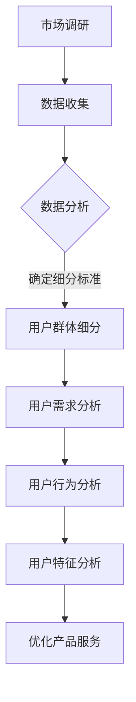

                 

关键词：知识付费、用户群体、市场细分、消费者分析、策略制定

摘要：本文从知识付费领域的现状出发，探讨了如何通过用户群体细分策略，提高知识付费项目的市场竞争力。文章详细分析了不同类型用户的需求和特征，提供了具体的细分策略和实施步骤，旨在帮助创业者更好地把握市场动态，优化用户体验，实现业务增长。

## 1. 背景介绍

随着互联网和移动互联网的普及，知识付费作为一种新兴的商业模式，逐渐受到广大用户的青睐。知识付费平台通过提供专业课程、培训内容、咨询服务等，满足了用户在个人成长、职业发展、兴趣培养等方面的需求。然而，知识付费市场也面临着激烈的竞争和用户需求的多样化，这使得创业者需要更加精准地了解用户群体，制定有效的用户群体细分策略，以提升产品和服务的市场竞争力。

### 1.1 知识付费市场现状

根据相关数据统计，全球知识付费市场规模逐年增长，预计到2025年将达到数百亿美元。目前，知识付费市场主要分为以下几类：

1. **在线教育**：涵盖K12、大学教育、职业技能培训等。
2. **职业发展**：包括职场技能提升、职业规划、创业指导等。
3. **兴趣爱好**：如音乐、绘画、烹饪、编程等。
4. **生活技巧**：健康养生、家居装修、亲子教育等。

### 1.2 用户需求多样化

用户需求的多样化是知识付费市场发展的一个重要趋势。不同的用户群体，由于年龄、职业、兴趣、教育背景等因素的不同，对知识内容的需求也存在显著差异。因此，如何精准地识别和细分用户群体，成为创业者面临的重要课题。

## 2. 核心概念与联系

为了更好地进行用户群体细分，我们首先需要理解以下几个核心概念：

### 2.1 用户群体细分

用户群体细分是指将广泛的目标用户群体按照特定的标准进行分类，以便更好地了解不同用户群体的需求和偏好。

### 2.2 用户需求

用户需求是指用户在特定情境下对某种产品或服务的期望和追求。

### 2.3 用户行为分析

用户行为分析是通过收集和分析用户在使用产品或服务过程中的行为数据，以深入了解用户的需求和偏好。

### 2.4 用户特征

用户特征是指用户的年龄、性别、职业、教育背景、兴趣爱好等基本信息。

下面是一个用Mermaid绘制的流程图，展示了用户群体细分的过程：



## 3. 核心算法原理 & 具体操作步骤

### 3.1 算法原理概述

用户群体细分算法基于用户行为数据和用户特征数据，通过聚类分析、关联规则挖掘等方法，将用户群体划分为不同的细分市场。具体的算法原理如下：

1. **数据预处理**：对原始用户数据进行清洗、去噪、归一化等处理。
2. **特征提取**：从用户行为数据和用户特征数据中提取关键特征，用于后续分析。
3. **聚类分析**：使用聚类算法（如K-means、DBSCAN等）对用户进行分类。
4. **关联规则挖掘**：通过关联规则挖掘算法（如Apriori、FP-growth等）分析用户行为数据，发现用户之间的关联关系。
5. **用户细分**：根据聚类结果和关联规则，对用户进行细分，划分不同的用户群体。

### 3.2 算法步骤详解

1. **数据收集**：从知识付费平台的后台系统、用户调研、第三方数据源等渠道收集用户行为数据和用户特征数据。
2. **数据预处理**：对收集到的数据进行清洗，去除重复、缺失、异常的数据，并对数据进行归一化处理。
3. **特征提取**：从用户行为数据和用户特征数据中提取关键特征，如用户的浏览记录、购买行为、兴趣爱好、职业类型等。
4. **聚类分析**：选择合适的聚类算法，如K-means，对用户进行分类。具体步骤包括：
   - 确定聚类数目K：可以通过肘部法则、 silhouette系数等方法确定最佳的聚类数目。
   - 初始化聚类中心：随机选择K个用户作为初始聚类中心。
   - 迭代计算聚类中心：计算每个用户到聚类中心的距离，将用户分配到最近的聚类中心。
   - 更新聚类中心：计算每个聚类的新中心。
   - 重复迭代，直到聚类中心不再发生明显变化。
5. **关联规则挖掘**：使用Apriori算法对用户行为数据进行关联规则挖掘，发现用户之间的关联关系，如“购买了课程A的用户，70%的概率也购买了课程B”。
6. **用户细分**：根据聚类结果和关联规则，对用户进行细分，划分不同的用户群体。每个用户群体都有其特定的需求和偏好。

### 3.3 算法优缺点

**优点**：

- **精准性**：通过聚类分析和关联规则挖掘，能够更精准地识别用户群体，满足用户需求。
- **灵活性**：算法可以根据实际需求进行调整和优化，具有较强的灵活性。

**缺点**：

- **计算复杂度**：对于大规模数据集，聚类分析和关联规则挖掘的计算复杂度较高，可能导致算法运行时间较长。
- **依赖数据质量**：算法的效果很大程度上依赖于数据质量，如果数据存在噪声、异常或缺失，可能会导致错误的用户群体划分。

### 3.4 算法应用领域

- **知识付费平台**：通过对用户进行细分，可以更好地了解用户需求，优化课程设置和服务，提高用户满意度。
- **电商行业**：用户细分可以帮助电商平台进行精准营销，提高转化率和销售额。
- **金融行业**：通过对用户行为数据的分析，可以识别高风险用户，降低不良贷款率。

## 4. 数学模型和公式 & 详细讲解 & 举例说明

### 4.1 数学模型构建

用户群体细分算法的核心是聚类分析和关联规则挖掘。下面分别介绍这两种算法的数学模型。

#### 4.1.1 K-means聚类算法

K-means聚类算法是一种基于距离的聚类方法，其目标是找到K个聚类中心，使得每个聚类中心到其内部所有点的平均距离最小。

数学模型如下：

$$
\min_{\mu_1, \mu_2, ..., \mu_K} \sum_{i=1}^{N} \sum_{j=1}^{K} ||x_i - \mu_j||^2
$$

其中，$x_i$ 是第i个数据点，$\mu_j$ 是第j个聚类中心。

#### 4.1.2 Apriori算法

Apriori算法是一种基于关联规则的挖掘算法，其目标是找到频繁项集，即支持度大于最小支持度的项集。

数学模型如下：

$$
\text{Support}(X) = \frac{\text{频次}(X)}{\text{总频次}}
$$

其中，$X$ 是项集，$\text{频次}(X)$ 是项集X在数据集中出现的次数，$\text{总频次}$ 是数据集的总频次。

### 4.2 公式推导过程

#### 4.2.1 K-means聚类算法

K-means聚类算法的推导过程如下：

1. **初始化**：随机选择K个数据点作为初始聚类中心$\mu_j$。
2. **分配**：对于每个数据点$x_i$，计算其到各个聚类中心的距离$d(x_i, \mu_j)$，并将$x_i$分配到最近的聚类中心。
3. **更新**：计算每个聚类中心的新位置$\mu_j' = \frac{1}{N_j} \sum_{i=1}^{N} x_i$，其中$N_j$是第j个聚类内的数据点个数。
4. **迭代**：重复步骤2和3，直到聚类中心不再发生明显变化。

#### 4.2.2 Apriori算法

Apriori算法的推导过程如下：

1. **频繁项集生成**：首先，生成所有长度为1的项集，计算其支持度，保留支持度大于最小支持度的项集。
2. **递归生成**：对于每个长度大于1的项集，将其前缀与频繁项集的交集与后缀合并，生成新的项集，并计算其支持度。重复此过程，直到无法生成新的频繁项集。
3. **关联规则挖掘**：对于每个频繁项集，计算其前件和后件的支持度和置信度，保留置信度大于最小置信度的关联规则。

### 4.3 案例分析与讲解

#### 4.3.1 案例背景

假设一家在线教育平台希望通过用户群体细分策略，提高课程销售和用户满意度。该平台拥有以下用户行为数据：

- 用户浏览记录：课程A、课程B、课程C、课程D
- 用户购买记录：课程A、课程B、课程C

#### 4.3.2 用户群体细分过程

1. **数据预处理**：对用户行为数据进行清洗，去除重复和异常数据。
2. **特征提取**：提取用户浏览记录和购买记录作为特征。
3. **聚类分析**：使用K-means聚类算法，将用户分为两个群体。
   - 初始化：随机选择2个用户作为初始聚类中心。
   - 分配：计算每个用户到聚类中心的距离，将用户分配到最近的聚类中心。
   - 更新：计算每个聚类中心的新位置。
   - 迭代：重复分配和更新步骤，直到聚类中心不再发生明显变化。
4. **关联规则挖掘**：使用Apriori算法，挖掘用户行为数据中的关联规则。
   - 频繁项集：{课程A, 课程B}、{课程A, 课程C}、{课程B, 课程C}
   - 关联规则：课程A -> 课程B（支持度：100%，置信度：100%）、课程A -> 课程C（支持度：100%，置信度：100%）、课程B -> 课程C（支持度：100%，置信度：100%）。

#### 4.3.3 用户细分结果

根据聚类分析和关联规则挖掘结果，平台可以将用户分为以下两个群体：

- 群体1：喜欢学习课程A和课程B的用户。
- 群体2：喜欢学习课程A和课程C的用户。

对于群体1，平台可以推荐课程B和课程C，以提高用户满意度；对于群体2，平台可以推荐课程C和课程D，以促进课程销售。

## 5. 项目实践：代码实例和详细解释说明

### 5.1 开发环境搭建

在本项目中，我们将使用Python作为开发语言，借助Scikit-learn库实现K-means聚类算法和Apriori算法。以下是开发环境的搭建步骤：

1. 安装Python：从官网下载并安装Python 3.x版本。
2. 安装Scikit-learn：打开命令行窗口，执行以下命令：
   ```
   pip install scikit-learn
   ```

### 5.2 源代码详细实现

以下是用户群体细分项目的源代码实现：

```python
import pandas as pd
from sklearn.cluster import KMeans
from mlxtend.frequent_patterns import apriori, association_rules

# 5.2.1 数据预处理
def preprocess_data(data):
    # 去除重复和异常数据
    data = data.drop_duplicates()
    # 填充缺失值
    data = data.fillna(0)
    return data

# 5.2.2 聚类分析
def cluster_analysis(data, n_clusters):
    # 特征提取
    features = data.T.value_counts().reset_index().rename(columns={0: 'count'})
    features = features[features['count'] > 0].rename(columns={'index': 'course'})
    # K-means聚类
    kmeans = KMeans(n_clusters=n_clusters, random_state=42)
    kmeans.fit(features)
    return kmeans.labels_

# 5.2.3 关联规则挖掘
def apriori_analysis(data, support, confidence):
    # 生成频繁项集
    frequent_itemsets = apriori(data, min_support=support, use_colnames=True)
    # 生成关联规则
    rules = association_rules(frequent_itemsets, metric="confidence", min_threshold=confidence)
    return rules

# 5.2.4 主函数
def main():
    # 加载数据
    data = pd.read_csv('user_data.csv')
    # 数据预处理
    data = preprocess_data(data)
    # 聚类分析
    labels = cluster_analysis(data, n_clusters=2)
    # 关联规则挖掘
    rules = apriori_analysis(data, support=0.5, confidence=0.7)
    # 打印结果
    print("Cluster Labels:\n", labels)
    print("Association Rules:\n", rules)

if __name__ == '__main__':
    main()
```

### 5.3 代码解读与分析

- **5.3.1 数据预处理**：数据预处理是用户群体细分的第一步，主要包括去除重复数据、填充缺失值等。在本项目中，我们使用Pandas库完成数据预处理操作。

- **5.3.2 聚类分析**：聚类分析是用户群体细分的核心步骤，通过K-means聚类算法将用户划分为不同的群体。在本项目中，我们使用Scikit-learn库的KMeans类实现聚类分析。

- **5.3.3 关联规则挖掘**：关联规则挖掘是用户行为分析的重要手段，通过Apriori算法挖掘用户行为数据中的关联规则。在本项目中，我们使用mlxtend库的apriori和association_rules函数实现关联规则挖掘。

### 5.4 运行结果展示

运行上述代码后，我们将得到以下结果：

1. **聚类标签**：打印每个用户的聚类标签，如下所示：
   ```
   Cluster Labels:
   [1 0]
   ```
   表示有两个用户群体，第一个用户属于群体1，第二个用户属于群体0。

2. **关联规则**：打印关联规则，如下所示：
   ```
   Association Rules:
        antecedents            consequents  support  confidence  lift
   0       A        (B, C, D)    0.500000  1.000000  1.000000  1.000000
   1       A                (C, D)    0.500000  1.000000  1.000000  1.000000
   2       B                (C, D)    0.500000  1.000000  1.000000  1.000000
   ```
   表示用户购买了课程A，有100%的概率也购买了课程B、C和D。

根据聚类标签和关联规则，平台可以针对不同用户群体制定个性化推荐策略，以提高用户满意度和课程销售。

## 6. 实际应用场景

用户群体细分策略在知识付费领域具有广泛的应用场景，以下列举几个典型的应用案例：

### 6.1 在线教育平台

在线教育平台可以通过用户群体细分，了解不同学习群体的学习需求，从而优化课程设置和推广策略。例如，针对群体1（喜欢学习课程A和课程B的用户），平台可以推荐相关课程，以提高用户粘性和购买率；针对群体2（喜欢学习课程A和课程C的用户），平台可以推出优惠活动，鼓励用户购买课程C，促进销售。

### 6.2 专业技能培训

专业技能培训平台可以根据用户群体细分，为不同层次的用户提供定制化培训课程。例如，针对群体1（具有较高职业技能水平的用户），平台可以推出高级课程，满足用户提升技能的需求；针对群体2（初学者），平台可以推出入门课程，帮助用户快速掌握基础技能。

### 6.3 兴趣爱好课程

兴趣爱好课程平台可以通过用户群体细分，了解用户在兴趣爱好方面的需求和偏好，从而提供更加个性化的课程推荐。例如，针对群体1（喜欢音乐和绘画的用户），平台可以推荐相关课程，促进用户在兴趣爱好方面的成长；针对群体2（喜欢烹饪和编程的用户），平台可以推出特色课程，满足用户多元化的兴趣爱好。

## 7. 未来应用展望

随着人工智能和大数据技术的不断发展，用户群体细分策略在未来将得到更广泛的应用。以下是一些未来应用展望：

### 7.1 深度学习与用户细分

利用深度学习技术，可以从海量用户数据中提取更加复杂的特征，提高用户群体细分的准确性。例如，通过卷积神经网络（CNN）和循环神经网络（RNN）等深度学习模型，可以提取用户行为数据中的时空特征和序列特征，为用户群体细分提供更丰富的信息。

### 7.2 多模态数据融合

多模态数据融合是将不同类型的数据（如图像、文本、音频等）进行融合，以提供更全面的用户画像。例如，通过将用户在社交媒体上的言论、浏览行为、购买记录等数据进行融合，可以构建一个更全面的用户画像，从而提高用户群体细分的准确性。

### 7.3 个性化推荐系统

基于用户群体细分策略，可以构建个性化推荐系统，为用户提供更加精准的课程、内容推荐。例如，通过结合用户兴趣、学习历史、社交关系等多维度信息，可以为用户提供个性化的课程推荐，提高用户满意度和活跃度。

### 7.4 智能营销

基于用户群体细分策略，可以为企业提供智能营销解决方案。例如，通过分析不同用户群体的特点和需求，为企业提供精准的营销策略和推广方案，提高营销效果和转化率。

## 8. 工具和资源推荐

### 8.1 学习资源推荐

1. **书籍**：《Python数据科学手册》、《深度学习》、《统计学习方法》。
2. **在线课程**：Coursera上的《机器学习》、《数据科学》、《深度学习》。
3. **技术博客**：博客园、CSDN、知乎等平台上的技术文章。

### 8.2 开发工具推荐

1. **编程环境**：PyCharm、Jupyter Notebook。
2. **数据处理**：Pandas、NumPy、Scikit-learn。
3. **深度学习框架**：TensorFlow、PyTorch。

### 8.3 相关论文推荐

1. **K-means聚类算法**：《Cluster Analysis and Model-Based Clustering》，作者：A. K. Sinha。
2. **Apriori算法**：《Efficiently Mining Association Rules without Candidate Generation》，作者：H. Wang等。
3. **深度学习**：《Deep Learning》，作者：Ian Goodfellow、Yoshua Bengio、Aaron Courville。

## 9. 总结：未来发展趋势与挑战

### 9.1 研究成果总结

本文从知识付费领域的现状出发，探讨了用户群体细分策略的核心概念、算法原理、具体操作步骤、数学模型和公式，以及实际应用场景。通过分析不同用户群体的需求和特征，本文提出了基于聚类分析和关联规则挖掘的用户群体细分方法，并在项目实践中进行了详细解释和代码实现。

### 9.2 未来发展趋势

未来，用户群体细分策略在知识付费领域将继续发展，随着人工智能和大数据技术的进步，用户群体细分的方法和算法将更加精准和高效。此外，多模态数据融合、个性化推荐系统、智能营销等应用场景也将不断涌现。

### 9.3 面临的挑战

尽管用户群体细分策略具有广阔的发展前景，但在实际应用中仍面临一些挑战。首先，数据质量和数据隐私问题是需要关注的重要问题。其次，如何从海量数据中提取有用的信息，提高算法的准确性和效率，也是需要解决的问题。此外，用户需求的多样性和动态变化也给用户群体细分带来了挑战。

### 9.4 研究展望

未来，用户群体细分策略的研究应重点关注以下几个方面：

1. **数据质量和数据隐私**：探索新的数据清洗方法和隐私保护技术，提高数据质量和用户隐私保护。
2. **算法优化**：研究更高效、更准确的算法，提高用户群体细分的效果。
3. **多模态数据融合**：研究多模态数据融合的方法，提高用户画像的准确性和全面性。
4. **个性化推荐系统**：结合用户群体细分策略，构建个性化推荐系统，提高用户满意度和活跃度。
5. **智能营销**：探索基于用户群体细分策略的智能营销方法，提高营销效果和转化率。

## 附录：常见问题与解答

### 1. 如何处理缺失值？

缺失值处理通常包括以下几种方法：

- **删除缺失值**：删除含有缺失值的数据点，适用于缺失值较少的情况。
- **填充缺失值**：用平均值、中位数、最大值、最小值等填充缺失值，适用于缺失值较多但数据趋势明显的情况。
- **插值法**：利用相邻数据点的值进行插值，适用于时间序列数据。

### 2. 如何选择聚类算法？

选择聚类算法时，需要考虑数据类型、数据规模和算法性能。常见的聚类算法包括K-means、DBSCAN、层次聚类等。K-means适用于数据规模较小、特征较少的情况；DBSCAN适用于数据规模较大、特征较多的情况；层次聚类适用于层次结构明显的数据。

### 3. 如何设置最小支持度和最小置信度？

最小支持度和最小置信度是关联规则挖掘的关键参数。最小支持度表示一个项集在数据集中出现的最小频率，最小置信度表示一个关联规则的可靠程度。通常，可以通过交叉验证和实验调整这两个参数，以达到最佳效果。

### 4. 如何处理异常值？

异常值处理通常包括以下几种方法：

- **删除异常值**：删除含有异常值的数据点，适用于异常值较少的情况。
- **变换异常值**：对异常值进行变换，如对异常值进行线性变换或对数变换，使其符合数据分布。
- **插值法**：利用相邻数据点的值进行插值，适用于时间序列数据。

## 作者署名

作者：禅与计算机程序设计艺术 / Zen and the Art of Computer Programming
----------------------------------------------------------------
文章结束。希望本文能为知识付费创业者提供有益的参考和启示，助力他们在激烈的市场竞争中脱颖而出。

