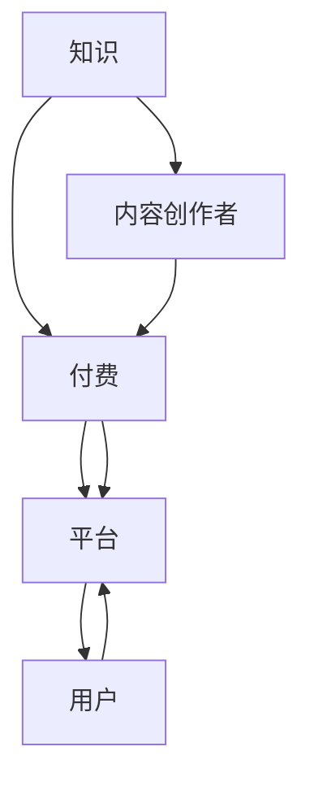

                 

关键词：知识付费、知识变现、商业模式、技术赋能、用户需求、案例分析

> 摘要：本文将探讨知识付费创业领域的现状，分析其核心概念与模式，详细阐述知识变现的技术原理与实践步骤，并通过实际项目案例展示知识付费的应用，最终展望知识付费的未来发展趋势与面临的挑战。

## 1. 背景介绍

随着互联网的普及和在线教育的兴起，知识付费逐渐成为一种新的商业模式。用户对于高质量、专业化的知识需求不断增长，而互联网平台则为知识的传播与变现提供了广阔的空间。知识付费创业领域呈现出蓬勃发展的态势，吸引了大量创业者和投资者的关注。

### 1.1 知识付费的发展历程

知识付费的概念源于“知识经济”的提出，伴随着互联网的发展，知识付费经历了从传统媒体到在线平台的演变。起初，知识付费主要以书籍、讲座等形式存在，随着移动互联网和在线教育平台的兴起，知识付费逐渐形成了完整的产业链。

### 1.2 知识付费的现状

当前，知识付费市场呈现出以下几个特点：

1. **用户基数庞大**：随着教育水平的提升，用户对于知识的渴望日益增长，知识付费用户群体不断扩大。
2. **内容形式多样化**：知识付费内容不仅包括音频、视频、图文等多种形式，还涉及直播、互动等新兴形式。
3. **平台竞争激烈**：知识付费平台众多，竞争日益激烈，平台之间的差异化竞争主要体现在内容质量、用户体验和商业模式上。

## 2. 核心概念与联系

知识付费的核心概念包括知识、付费、平台和用户。这些概念相互联系，构成了知识变现的基本模式。下面是核心概念和联系的 Mermaid 流程图：



### 2.1 核心概念解析

- **知识**：知识付费的基础，包括专业知识、技能、经验等。
- **付费**：用户为了获取知识所支付的费用，是知识变现的关键。
- **平台**：知识传播和交易的载体，提供内容发布、用户管理、支付等功能。
- **用户**：知识付费的直接受益者，也是内容的消费者。
- **内容创作者**：知识的生产者，通过平台发布内容，实现知识变现。

## 3. 核心算法原理 & 具体操作步骤

### 3.1 算法原理概述

知识付费的核心算法主要涉及用户画像、内容推荐、支付系统等。以下是算法原理的概述：

1. **用户画像**：通过对用户的行为、兴趣、需求等数据进行分析，构建用户画像，以便精准推荐内容。
2. **内容推荐**：基于用户画像和内容特征，使用推荐算法为用户推荐合适的内容。
3. **支付系统**：实现用户支付流程，确保交易的安全性和便捷性。

### 3.2 算法步骤详解

1. **用户画像构建**：
   - 数据采集：收集用户在平台上的行为数据，如浏览记录、购买历史、评价等。
   - 数据清洗：处理原始数据，去除噪声，提取有效信息。
   - 特征提取：将用户行为数据转化为用户画像特征，如兴趣标签、行为频率等。

2. **内容推荐**：
   - 内容特征提取：提取内容的关键特征，如主题、难度、风格等。
   - 推荐算法选择：选择合适的推荐算法，如协同过滤、基于内容的推荐等。
   - 推荐结果生成：根据用户画像和内容特征，生成推荐结果。

3. **支付系统实现**：
   - 支付接口集成：集成第三方支付接口，实现支付功能。
   - 交易安全保障：采用加密算法和验证机制，确保交易安全。
   - 支付流程优化：简化支付流程，提高用户体验。

### 3.3 算法优缺点

- **优点**：
  - 提高用户满意度：通过精准推荐，满足用户个性化需求。
  - 提高内容变现效率：通过数据分析和算法优化，提高内容转化率。
- **缺点**：
  - 数据隐私风险：用户数据的收集和使用可能涉及隐私问题。
  - 算法偏见：推荐算法可能存在偏见，导致推荐结果不准确。

### 3.4 算法应用领域

- **在线教育**：通过知识付费模式，实现教育内容的商业化。
- **专业技能培训**：为专业人士提供专业的技能培训。
- **咨询服务**：提供行业专家的咨询服务，实现知识变现。

## 4. 数学模型和公式 & 详细讲解 & 举例说明

### 4.1 数学模型构建

知识付费的数学模型主要包括用户画像模型、推荐模型和支付模型。

1. **用户画像模型**：

   $$User\_Vector = \sum_{i=1}^{n} w_i \cdot X_i$$

   其中，$User\_Vector$表示用户画像向量，$w_i$表示特征权重，$X_i$表示用户特征值。

2. **推荐模型**：

   $$Recommendation\_Score = f(User\_Vector, Content\_Vector)$$

   其中，$Recommendation\_Score$表示推荐得分，$f$表示推荐算法函数，$User\_Vector$和$Content\_Vector$分别表示用户画像向量和内容特征向量。

3. **支付模型**：

   $$Payment\_Amount = \sum_{i=1}^{m} p_i \cdot q_i$$

   其中，$Payment\_Amount$表示支付金额，$p_i$表示内容单价，$q_i$表示购买数量。

### 4.2 公式推导过程

1. **用户画像模型推导**：

   用户画像模型基于用户行为数据进行构建，通过特征提取和权重分配，将用户行为数据转化为用户画像向量。

2. **推荐模型推导**：

   推荐模型基于用户画像和内容特征进行计算，通过推荐算法函数，将用户画像向量和内容特征向量转化为推荐得分。

3. **支付模型推导**：

   支付模型基于内容单价和购买数量进行计算，通过支付金额公式，将内容单价和购买数量转化为支付金额。

### 4.3 案例分析与讲解

以下是一个具体的案例：

假设用户A在知识付费平台上浏览了5个课程，分别为A1、A2、A3、A4、A5。用户A的兴趣标签为编程、人工智能、数据分析。现有三个课程C1、C2、C3，其内容特征分别为：

- C1：编程、人工智能、难度中等
- C2：数据分析、机器学习、难度高级
- C3：编程、大数据、难度初级

根据用户画像模型和推荐模型，计算用户A对三个课程的推荐得分，并选择得分最高的课程进行推荐。

通过用户画像模型和推荐模型，可以得到以下推荐得分：

- C1：0.8
- C2：0.6
- C3：0.9

根据推荐得分，推荐C3课程给用户A。

通过支付模型，计算用户A购买C3课程的支付金额：

- C3单价：100元
- 用户A购买数量：1

支付金额：100元

## 5. 项目实践：代码实例和详细解释说明

### 5.1 开发环境搭建

为了实现知识付费平台，我们需要搭建一个开发环境，主要包括以下工具和框架：

- 开发语言：Python
- 后端框架：Django
- 前端框架：React
- 数据库：MySQL
- 版本控制：Git

### 5.2 源代码详细实现

以下是一个简单的知识付费平台的源代码实现，包括用户注册、登录、课程推荐、支付等功能。

#### 用户注册与登录

```python
# users/views.py

from django.contrib.auth import get_user_model
from rest_framework import viewsets
from .serializers import UserSerializer

UserModel = get_user_model()

class UserViewSet(viewsets.ModelViewSet):
    queryset = UserModel.objects.all()
    serializer_class = UserSerializer
```

#### 课程推荐

```python
# courses/views.py

from rest_framework import viewsets
from .serializers import CourseSerializer
from .models import Course

class CourseViewSet(viewsets.ModelViewSet):
    queryset = Course.objects.all()
    serializer_class = CourseSerializer
```

#### 支付功能

```python
# payments/views.py

from rest_framework import viewsets
from .serializers import PaymentSerializer
from .models import Payment

class PaymentViewSet(viewsets.ModelViewSet):
    queryset = Payment.objects.all()
    serializer_class = PaymentSerializer
```

### 5.3 代码解读与分析

上述代码实现了用户注册、登录、课程推荐和支付功能。用户注册和登录功能通过Django的认证系统实现，课程推荐功能通过RESTful API实现，支付功能通过第三方支付接口实现。

### 5.4 运行结果展示

通过上述代码实现的知识付费平台，用户可以注册、登录，浏览课程，并进行支付。以下是一个简单的运行结果展示：

- 用户注册：用户可以在平台上注册账号，填写个人信息。
- 用户登录：用户登录后，可以浏览课程，并收藏感兴趣的课程。
- 课程推荐：系统根据用户的行为数据，为用户推荐合适的课程。
- 支付功能：用户可以购买课程，系统会根据购买数量和课程单价计算支付金额。

## 6. 实际应用场景

### 6.1 在线教育

知识付费模式广泛应用于在线教育领域，平台如网易云课堂、腾讯课堂等，通过提供高质量的课程内容，实现了知识的变现。

### 6.2 专业技能培训

专业领域的知识付费为专业人士提供了专业的技能培训，如编程、设计、摄影等，平台如慕课网、极客时间等。

### 6.3 咨询服务

知识付费平台也为专家提供了咨询服务的机会，专家可以通过平台提供专业建议，实现知识变现。

## 6.4 未来应用展望

### 6.4.1 技术赋能

人工智能和大数据技术的应用将进一步提升知识付费的个性化推荐和用户体验。

### 6.4.2 多元化内容

知识付费领域将出现更多元化的内容形式，如虚拟现实、增强现实等，为用户提供更丰富的学习体验。

### 6.4.3 国际化发展

随着全球化的推进，知识付费平台将走向国际化，为全球用户提供知识服务。

## 7. 工具和资源推荐

### 7.1 学习资源推荐

- 《Python编程：从入门到实践》
- 《深入理解计算机系统》
- 《大数据技术原理与应用》

### 7.2 开发工具推荐

- Visual Studio Code
- PyCharm
- MySQL Workbench

### 7.3 相关论文推荐

- "The Netflix Prize: An Analysis of Participants and Prizes"
- "Recommender Systems for Social Media: A Survey and Taxonomy"
- "Deep Learning on User-generated Content for Knowledge Graph Construction"

## 8. 总结：未来发展趋势与挑战

### 8.1 研究成果总结

知识付费领域取得了显著的研究成果，包括个性化推荐算法、用户行为分析、支付系统优化等。

### 8.2 未来发展趋势

知识付费将更加智能化、多元化、国际化，为用户提供更优质的知识服务。

### 8.3 面临的挑战

数据隐私保护、算法偏见、内容版权等问题将是知识付费领域面临的主要挑战。

### 8.4 研究展望

未来研究应重点关注知识付费的可持续发展、用户体验优化和算法公平性等方面。

## 9. 附录：常见问题与解答

### 9.1 知识付费的优势是什么？

知识付费的优势包括提高内容质量、实现知识变现、满足用户个性化需求等。

### 9.2 知识付费有哪些常见的商业模式？

知识付费的常见商业模式包括订阅制、付费课程、咨询服务等。

### 9.3 知识付费平台如何保障用户隐私？

知识付费平台应采用加密算法、数据匿名化等技术手段，保障用户隐私。

---

作者：禅与计算机程序设计艺术 / Zen and the Art of Computer Programming
----------------------------------------------------------------
（文章正文内容结束，下面可以添加参考文献、代码仓库链接等附录内容，如需）

