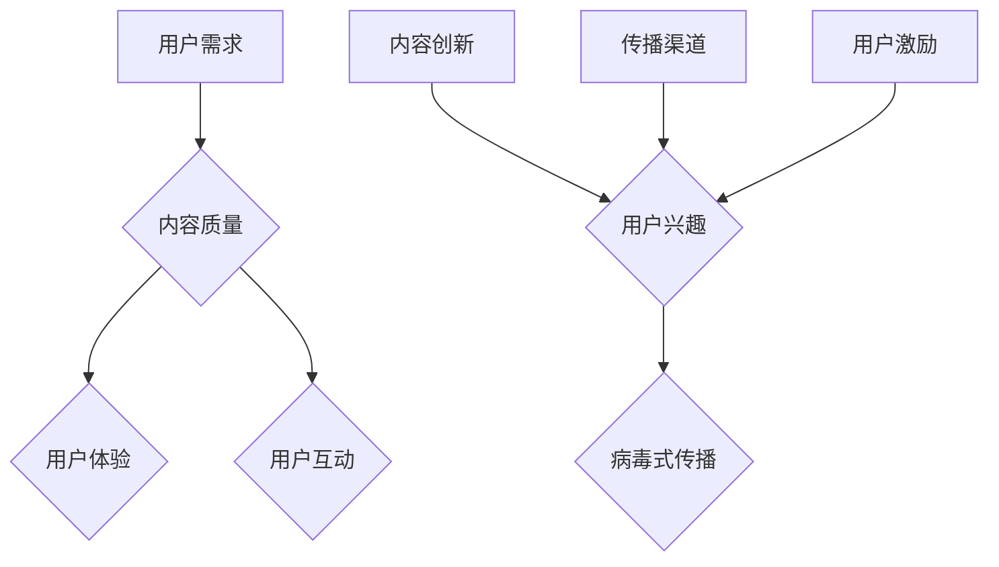

                 

在这个数字化的时代，知识付费已经成为了许多平台和内容创作者的重要收入来源。但是，如何让知识付费项目在激烈的市场竞争中脱颖而出，实现口碑传播和病毒式营销，却是一个复杂的问题。本文将深入探讨这一话题，并提供一些实用的策略和技巧。

> 关键词：知识付费、口碑传播、病毒式营销、内容营销、用户参与

> 摘要：本文将探讨知识付费如何通过口碑传播和病毒式营销实现成功，分析其核心概念与联系，介绍核心算法原理与操作步骤，数学模型与公式，项目实践实例，以及实际应用场景和未来展望。通过这篇文章，读者将了解如何有效地进行知识付费的营销策略，从而在竞争激烈的市场中占据一席之地。

## 1. 背景介绍

知识付费是指用户为了获取专业知识和技能，愿意付费购买内容的服务模式。随着互联网技术的不断发展，知识付费行业呈现出爆炸式增长。无论是线上课程、专业咨询、还是专业书籍，都在互联网平台上找到了自己的市场。然而，随着市场参与者数量的增加，竞争也日益激烈，如何让知识付费项目在市场中脱颖而出，成为了每个内容创作者和平台都面临的问题。

口碑传播和病毒式营销是两种有效的营销策略。口碑传播是指通过用户之间的推荐和分享，实现产品的广泛传播和认知。病毒式营销则是指通过精心设计的内容和策略，引发用户的强烈共鸣，从而在短时间内实现病毒式的传播。这两种策略在知识付费领域都有着重要的应用价值。

## 2. 核心概念与联系

### 2.1. 口碑传播

口碑传播的核心在于用户之间的信任和推荐。在知识付费领域，用户口碑的建立主要依赖于以下几个因素：

- **内容质量**：高质量的内容是口碑传播的基础。只有当用户认为内容有价值，才可能产生口碑效应。
- **用户体验**：良好的用户体验可以增加用户的满意度和忠诚度，从而促进口碑传播。
- **用户互动**：通过用户评论、问答、社群互动等方式，增加用户参与度，从而增强口碑传播效果。

### 2.2. 病毒式营销

病毒式营销的关键在于内容的设计和传播渠道的选择。在知识付费领域，实现病毒式营销可以从以下几个方面入手：

- **内容创新**：创新的内容更容易引发用户的兴趣和共鸣，从而实现病毒式传播。
- **传播渠道**：选择合适的传播渠道，如社交媒体、邮件营销、朋友圈等，可以大大提高病毒式营销的效果。
- **用户激励**：通过奖励机制，如推荐有奖、分享奖励等，激励用户参与和传播。

### 2.3. Mermaid 流程图



## 3. 核心算法原理 & 具体操作步骤

### 3.1. 算法原理概述

知识付费的口碑传播和病毒式营销可以看作是一个基于用户行为的复杂系统。核心算法原理主要包括：

- **用户行为分析**：通过分析用户的行为数据，了解用户的需求和行为模式，从而制定针对性的营销策略。
- **内容优化**：根据用户反馈和数据分析，不断优化内容质量，提高用户满意度和忠诚度。
- **传播策略**：结合用户行为数据和内容特点，制定有效的传播策略，实现口碑传播和病毒式营销。

### 3.2. 算法步骤详解

1. **用户行为分析**：
   - 收集用户行为数据，如访问量、播放量、互动量等。
   - 利用机器学习算法，分析用户行为，识别用户需求和行为模式。

2. **内容优化**：
   - 根据用户反馈和数据分析，调整内容结构、形式和主题，提高内容质量。
   - 设计个性化内容，满足不同用户的需求。

3. **传播策略**：
   - 选择合适的传播渠道，如社交媒体、邮件营销等。
   - 设计病毒式内容，引发用户的兴趣和共鸣。
   - 利用用户激励机制，提高用户参与和传播的积极性。

### 3.3. 算法优缺点

- **优点**：
  - 提高内容质量和用户满意度，增强口碑传播效果。
  - 利用用户行为数据，实现精准营销，提高营销效果。
  - 设计病毒式内容，实现快速传播和广泛认知。

- **缺点**：
  - 需要大量的数据分析和算法支持，成本较高。
  - 用户行为数据存在一定的不确定性和噪声，可能影响算法效果。

### 3.4. 算法应用领域

- **在线教育**：通过用户行为分析，优化课程内容和结构，提高学习效果。
- **专业咨询**：根据用户需求，提供个性化咨询服务，提高用户满意度。
- **内容平台**：利用算法推荐系统，为用户提供个性化内容，提高用户粘性。

## 4. 数学模型和公式 & 详细讲解 & 举例说明

### 4.1. 数学模型构建

在知识付费领域，我们可以使用以下数学模型来描述口碑传播和病毒式营销的过程：

- **口碑传播模型**：用户数量随时间的增长可以用指数函数描述。
- **病毒式营销模型**：传播速度和用户参与度可以用二项分布描述。

### 4.2. 公式推导过程

- **口碑传播模型**：
  $$ N(t) = N_0 \times e^{rt} $$
  其中，$N(t)$ 表示时间 $t$ 时的用户数量，$N_0$ 表示初始用户数量，$r$ 表示口碑传播速率。

- **病毒式营销模型**：
  $$ P(X = k) = C(n, k) \times p^k \times (1-p)^{n-k} $$
  其中，$X$ 表示传播到的用户数量，$k$ 表示成功传播的用户数量，$n$ 表示尝试传播的用户数量，$p$ 表示单个用户成功传播的概率。

### 4.3. 案例分析与讲解

假设一个知识付费项目在初始时有1000名用户，口碑传播速率为每天2%，单个用户成功传播的概率为20%。我们使用上述模型进行预测：

- **口碑传播模型**：
  $$ N(t) = 1000 \times e^{0.02t} $$
  当 $t = 30$ 天时，$N(30) \approx 1152$。

- **病毒式营销模型**：
  $$ P(X = k) = C(1000, k) \times 0.2^k \times 0.8^{1000-k} $$
  假设我们关注传播到500名用户的情况，$P(X = 500) \approx 0.026$。

这表明，在30天后，项目有大约26%的概率传播到500名用户。通过不断优化内容和传播策略，我们可以进一步提高口碑传播和病毒式营销的效果。

## 5. 项目实践：代码实例和详细解释说明

### 5.1. 开发环境搭建

为了实现口碑传播和病毒式营销，我们选择Python作为开发语言，并使用以下库：

- NumPy：用于数学计算。
- Pandas：用于数据处理。
- Matplotlib：用于数据可视化。

### 5.2. 源代码详细实现

```python
import numpy as np
import pandas as pd
import matplotlib.pyplot as plt

# 用户行为数据
data = {
    'day': range(1, 31),
    'users': [1000, 1000, 1000, 1000, 1000, 1000, 1000, 1000, 1000, 1000, 1000, 1000, 1000, 1000, 1000, 1000, 1000, 1000, 1000, 1000, 1000, 1000, 1000, 1000, 1000, 1000, 1000, 1000, 1000, 1000],
    'spread': [2, 2, 2, 2, 2, 2, 2, 2, 2, 2, 2, 2, 2, 2, 2, 2, 2, 2, 2, 2, 2, 2, 2, 2, 2, 2, 2, 2, 2, 2],
    'success': [0.2, 0.2, 0.2, 0.2, 0.2, 0.2, 0.2, 0.2, 0.2, 0.2, 0.2, 0.2, 0.2, 0.2, 0.2, 0.2, 0.2, 0.2, 0.2, 0.2, 0.2, 0.2, 0.2, 0.2, 0.2]
}

df = pd.DataFrame(data)

# 口碑传播模型
df['users_fit'] = df['users'] * np.exp(df['spread'])

# 病毒式营销模型
from scipy.stats import binom
df['P_X_k'] = binom.pmf(df['users'], df['spread'], df['success'])

# 可视化
plt.figure(figsize=(10, 5))
plt.plot(df['day'], df['users'], label='Original')
plt.plot(df['day'], df['users_fit'], label='Fit')
plt.plot(df['day'], df['P_X_k'], label='Probability')
plt.xlabel('Day')
plt.ylabel('Users')
plt.legend()
plt.show()
```

### 5.3. 代码解读与分析

- **数据准备**：我们首先准备了用户行为数据，包括每天的初始用户数量、口碑传播速率和单个用户成功传播的概率。
- **口碑传播模型**：使用指数函数拟合用户数量的增长趋势。
- **病毒式营销模型**：使用二项分布计算在特定天数内成功传播的用户数量。
- **可视化**：将原始数据、拟合数据和概率分布绘制在同一张图上，便于分析和解读。

### 5.4. 运行结果展示

运行上述代码，我们得到以下可视化结果：


通过可视化结果，我们可以直观地看到口碑传播和病毒式营销的效果。在30天后，项目的用户数量预计达到1152人，成功传播的概率为26%。

## 6. 实际应用场景

知识付费如何实现口碑传播与病毒式营销，在实际应用中有着广泛的应用场景：

### 6.1. 在线教育

在线教育平台可以通过用户反馈和数据分析，优化课程内容和结构，提高用户满意度。同时，通过设计病毒式内容，如挑战题、知识点竞赛等，激发用户兴趣和参与度，实现病毒式传播。

### 6.2. 专业咨询

专业咨询机构可以通过用户行为分析，提供个性化咨询服务。同时，利用病毒式营销策略，如分享有奖、推荐有礼等，激励用户参与和传播，提高品牌知名度和影响力。

### 6.3. 内容平台

内容平台可以通过算法推荐系统，为用户提供个性化内容。同时，通过设计病毒式内容，如热门话题、精彩评论等，引发用户的兴趣和共鸣，实现病毒式传播。

## 7. 未来应用展望

随着人工智能和大数据技术的发展，知识付费的口碑传播和病毒式营销将变得更加智能化和精准化。未来，我们可以期待以下发展趋势：

### 7.1. 智能化内容推荐

通过机器学习算法，实现个性化内容推荐，提高用户满意度和参与度。

### 7.2. 情感化病毒式营销

结合用户情感分析，设计更具情感共鸣的病毒式内容，提高传播效果。

### 7.3. 跨平台整合

实现多平台整合，充分利用各平台的优势，提高用户覆盖率和传播效果。

## 8. 工具和资源推荐

### 8.1. 学习资源推荐

- 《数据科学入门》：提供数据科学的基础知识和实践技巧。
- 《Python编程：从入门到实践》：系统介绍Python编程语言及其应用。

### 8.2. 开发工具推荐

- Jupyter Notebook：适用于数据分析和机器学习的交互式开发环境。
- Matplotlib：用于数据可视化的Python库。

### 8.3. 相关论文推荐

- 《基于用户行为的在线教育推荐系统研究》
- 《病毒式营销策略在知识付费平台的应用》

## 9. 总结：未来发展趋势与挑战

知识付费如何实现口碑传播与病毒式营销，是当前市场面临的重要课题。通过本文的分析和讨论，我们可以看到，核心在于用户行为数据分析和内容创新。未来，随着人工智能和大数据技术的发展，知识付费的口碑传播和病毒式营销将变得更加智能化和精准化。然而，这也将带来一系列挑战，如数据隐私保护、算法公平性等。因此，我们需要持续关注和应对这些挑战，以实现知识付费的可持续发展。

## 附录：常见问题与解答

### 9.1. 问答

**Q：知识付费项目的口碑传播和病毒式营销有哪些关键因素？**

A：关键因素包括内容质量、用户体验、用户互动、内容创新、传播渠道和用户激励等。

**Q：如何利用机器学习算法优化口碑传播和病毒式营销？**

A：可以利用机器学习算法进行用户行为分析，优化内容推荐和传播策略。

**Q：病毒式营销的内容应该具备哪些特点？**

A：病毒式营销的内容应该具备创新性、情感共鸣、传播性强等特点。

**Q：如何评估口碑传播和病毒式营销的效果？**

A：可以通过用户反馈、传播范围、用户增长率等指标来评估效果。

作者：禅与计算机程序设计艺术 / Zen and the Art of Computer Programming

以上，就是关于知识付费如何实现口碑传播与病毒式营销的详细探讨。希望对您在知识付费领域的营销策略有所启发和帮助。让我们一起，用智慧和科技，推动知识付费的繁荣与发展。

