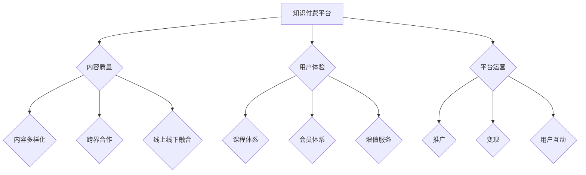

                 

关键词：知识付费、品牌延伸、产品矩阵、用户体验、内容营销、商业模式、技术创新

> 摘要：本文将深入探讨知识付费在品牌延伸与产品矩阵构建中的应用，通过剖析核心概念、算法原理、数学模型以及项目实践等多个维度，为从业者提供系统化的思路和方法。

## 1. 背景介绍

随着互联网技术的迅猛发展，知识付费逐渐成为新兴商业模式之一。知识付费平台通过提供专业内容、课程、咨询等服务，满足了用户在自我提升、职业发展等方面的需求。然而，随着市场竞争的加剧，单纯的内容提供已经无法满足用户多元化的需求，品牌延伸与产品矩阵的构建成为知识付费领域的重要课题。

品牌延伸指的是企业在已有品牌的基础上，通过拓展新的业务领域、产品或服务，提升品牌影响力和市场份额。产品矩阵则是指企业在多个维度上构建多样化产品，以满足不同用户群体的需求。在知识付费领域，品牌延伸与产品矩阵的构建不仅有助于提升用户体验，还能增强企业的竞争力。

本文将围绕知识付费如何实现品牌延伸与产品矩阵展开讨论，旨在为从业者提供有价值的实践指南。

## 2. 核心概念与联系

### 2.1. 知识付费

知识付费是指用户为获取专业内容、课程、咨询等服务而支付的费用。在知识付费领域，核心概念包括：

- **内容质量**：优质的内容是知识付费的核心竞争力，直接影响用户满意度。
- **用户体验**：良好的用户体验是用户留存的关键因素，包括内容推荐、支付流程、学习进度等。
- **平台运营**：平台运营能力决定了知识付费产品的推广、变现和用户互动效果。

### 2.2. 品牌延伸

品牌延伸是指企业在已有品牌基础上，拓展新的业务领域或产品线。在知识付费领域，品牌延伸包括：

- **内容多样化**：通过引入不同领域的专业内容，满足用户多元化的学习需求。
- **跨界合作**：与其他行业或品牌合作，拓展业务范围，提升品牌影响力。
- **线上线下融合**：结合线上线下渠道，打造全方位的用户体验。

### 2.3. 产品矩阵

产品矩阵是指企业在多个维度上构建多样化产品，满足不同用户群体的需求。在知识付费领域，产品矩阵包括：

- **课程体系**：构建完整的课程体系，涵盖不同阶段、不同领域的学习内容。
- **会员体系**：推出多样化的会员体系，提供不同层次的服务和权益。
- **增值服务**：拓展课程以外的增值服务，如咨询服务、社群互动等。

### 2.4. Mermaid 流程图

以下是一个简化的知识付费品牌延伸与产品矩阵构建的 Mermaid 流程图：



## 3. 核心算法原理 & 具体操作步骤

### 3.1 算法原理概述

知识付费品牌延伸与产品矩阵构建的核心算法主要包括以下三个方面：

1. **内容推荐算法**：基于用户行为和偏好，为用户提供个性化内容推荐。
2. **用户画像构建算法**：通过对用户行为、兴趣、需求等多维度数据进行挖掘，构建用户画像。
3. **会员权益优化算法**：根据用户需求和参与度，动态调整会员权益，提升用户满意度。

### 3.2 算法步骤详解

#### 3.2.1 内容推荐算法

1. **数据收集**：收集用户在平台上的浏览、购买、评论等行为数据。
2. **特征提取**：提取用户行为数据中的关键特征，如浏览时间、购买频次、评论热度等。
3. **模型训练**：使用机器学习算法（如协同过滤、基于内容的推荐等）训练推荐模型。
4. **推荐生成**：根据用户特征和模型预测，生成个性化推荐结果。

#### 3.2.2 用户画像构建算法

1. **数据整合**：整合用户在平台上的多维度数据，如行为数据、社交数据、反馈数据等。
2. **特征工程**：对整合后的数据进行特征工程，提取用户兴趣、需求、行为等特征。
3. **模型构建**：使用深度学习、图神经网络等算法构建用户画像模型。
4. **画像更新**：根据用户行为变化，动态更新用户画像。

#### 3.2.3 会员权益优化算法

1. **数据采集**：采集用户参与度、满意度等关键指标数据。
2. **需求分析**：分析用户需求，识别会员权益优化的关键因素。
3. **模型训练**：使用回归、决策树等算法，构建会员权益优化模型。
4. **权益调整**：根据模型预测，动态调整会员权益，提升用户满意度。

### 3.3 算法优缺点

#### 3.3.1 内容推荐算法

**优点**：

- 提高用户满意度：通过个性化推荐，提升用户在学习过程中的体验。
- 提高内容转化率：个性化推荐有助于提高用户购买课程、参与互动的概率。

**缺点**：

- 数据隐私风险：个性化推荐算法需要收集用户隐私数据，存在数据隐私风险。
- 算法偏见：推荐算法可能因数据偏差或算法设计缺陷导致推荐结果偏见。

#### 3.3.2 用户画像构建算法

**优点**：

- 提高用户满意度：通过用户画像，了解用户需求和兴趣，提供更个性化的服务。
- 提高运营效率：用户画像有助于企业精细化运营，提高资源利用效率。

**缺点**：

- 数据隐私风险：用户画像构建过程中需要处理大量用户隐私数据。
- 数据质量风险：用户行为数据质量直接影响用户画像的准确性。

#### 3.3.3 会员权益优化算法

**优点**：

- 提高用户满意度：动态调整会员权益，满足用户需求，提升用户参与度。
- 提高运营效率：通过模型预测，优化会员权益，降低运营成本。

**缺点**：

- 算法复杂度高：会员权益优化算法涉及多个维度，算法复杂度高。
- 模型预测风险：模型预测可能因数据偏差或算法缺陷导致权益调整不当。

### 3.4 算法应用领域

知识付费品牌延伸与产品矩阵构建的核心算法在多个领域具有广泛的应用：

- **电商平台**：通过内容推荐和用户画像，提升商品转化率和用户满意度。
- **在线教育**：通过个性化推荐和会员权益优化，提升用户学习体验和参与度。
- **金融服务**：通过用户画像和风险控制，优化金融产品和服务。
- **健康管理**：通过用户画像和健康数据分析，提供个性化的健康管理方案。

## 4. 数学模型和公式 & 详细讲解 & 举例说明

### 4.1 数学模型构建

知识付费品牌延伸与产品矩阵构建涉及多个数学模型，以下简要介绍其中两个核心模型：

#### 4.1.1 用户行为预测模型

用户行为预测模型旨在预测用户在知识付费平台上的行为，如购买课程、参与互动等。一个常用的预测模型是逻辑回归模型，其数学表达式如下：

$$
P(y=1) = \frac{1}{1 + e^{-(\beta_0 + \beta_1 x_1 + \beta_2 x_2 + \ldots + \beta_n x_n})}
$$

其中，$P(y=1)$表示用户购买课程的概率，$\beta_0$为截距，$\beta_1, \beta_2, \ldots, \beta_n$为特征系数，$x_1, x_2, \ldots, x_n$为用户特征。

#### 4.1.2 会员权益优化模型

会员权益优化模型旨在根据用户需求和参与度，动态调整会员权益，提升用户满意度。一个常用的优化模型是线性规划模型，其数学表达式如下：

$$
\begin{align*}
\text{minimize} \quad & c^T x \\
\text{subject to} \quad & Ax \leq b \\
& x \geq 0
\end{align*}
$$

其中，$c$为会员权益成本向量，$x$为会员权益向量，$A$为约束矩阵，$b$为约束向量。

### 4.2 公式推导过程

#### 4.2.1 用户行为预测模型推导

假设用户在知识付费平台上的行为可以用一个二元变量$y$表示，$y=1$表示购买课程，$y=0$表示未购买课程。$x_1, x_2, \ldots, x_n$为用户特征向量，$\beta_0, \beta_1, \beta_2, \ldots, \beta_n$为特征系数。

根据最大似然估计，我们可以得到以下优化问题：

$$
\begin{align*}
\text{maximize} \quad & \prod_{i=1}^m P(y_i=1)^{y_i} \cdot P(y_i=0)^{1-y_i} \\
\text{subject to} \quad & \beta_0 + \beta_1 x_1 + \beta_2 x_2 + \ldots + \beta_n x_n \geq 0, \quad y_i=1 \\
& \beta_0 + \beta_1 x_1 + \beta_2 x_2 + \ldots + \beta_n x_n \leq 0, \quad y_i=0
\end{align*}
$$

通过取对数，我们可以将上述优化问题转化为以下形式：

$$
\begin{align*}
\text{maximize} \quad & \sum_{i=1}^m y_i \ln P(y_i=1) + (1-y_i) \ln P(y_i=0) \\
\text{subject to} \quad & \beta_0 + \beta_1 x_1 + \beta_2 x_2 + \ldots + \beta_n x_n \geq 0, \quad y_i=1 \\
& \beta_0 + \beta_1 x_1 + \beta_2 x_2 + \ldots + \beta_n x_n \leq 0, \quad y_i=0
\end{align*}
$$

为了简化计算，我们可以引入概率分布函数$\sigma(z) = \frac{1}{1 + e^{-z}}$，其中$z = \beta_0 + \beta_1 x_1 + \beta_2 x_2 + \ldots + \beta_n x_n$。将概率分布函数代入上述优化问题，得到：

$$
\begin{align*}
\text{maximize} \quad & \sum_{i=1}^m y_i \ln \sigma(z_i) + (1-y_i) \ln (1-\sigma(z_i)) \\
\text{subject to} \quad & \beta_0 + \beta_1 x_1 + \beta_2 x_2 + \ldots + \beta_n x_n \geq 0, \quad y_i=1 \\
& \beta_0 + \beta_1 x_1 + \beta_2 x_2 + \ldots + \beta_n x_n \leq 0, \quad y_i=0
\end{align*}
$$

由于概率分布函数$\sigma(z)$是一个单调递增函数，上述优化问题等价于：

$$
\begin{align*}
\text{maximize} \quad & \sum_{i=1}^m y_i (\beta_0 + \beta_1 x_1 + \beta_2 x_2 + \ldots + \beta_n x_n) \\
\text{subject to} \quad & \beta_0 + \beta_1 x_1 + \beta_2 x_2 + \ldots + \beta_n x_n \geq 0, \quad y_i=1 \\
& \beta_0 + \beta_1 x_1 + \beta_2 x_2 + \ldots + \beta_n x_n \leq 0, \quad y_i=0
\end{align*}
$$

这是一个线性规划问题，可以使用梯度下降法或其他优化算法求解。

#### 4.2.2 会员权益优化模型推导

假设会员权益向量$x = [x_1, x_2, \ldots, x_n]$，会员权益成本向量$c = [c_1, c_2, \ldots, c_n]$，约束矩阵$A$的元素为$a_{ij}$，约束向量$b$的元素为$b_i$。会员权益优化模型的目标是最小化总成本$c^T x$，同时满足约束条件$Ax \leq b$和$x \geq 0$。

我们可以将会员权益优化模型转化为标准形式：

$$
\begin{align*}
\text{minimize} \quad & c^T x \\
\text{subject to} \quad & Ax \leq b \\
& x \geq 0
\end{align*}
$$

为了求解该优化问题，可以使用单纯形法或其他线性规划求解算法。

### 4.3 案例分析与讲解

#### 4.3.1 用户行为预测模型案例分析

假设一个知识付费平台希望预测用户是否购买一门课程。用户特征包括年龄、性别、学历、职业等。为了简化问题，我们选取三个特征进行预测：年龄、学历、职业。

我们收集了1000名用户的购买行为数据，构建了一个包含年龄、学历、职业和购买标签的数据集。使用逻辑回归模型进行预测，得到以下特征系数：

$$
\begin{align*}
\beta_0 &= -2.5 \\
\beta_1 &= 0.1 \\
\beta_2 &= 0.3 \\
\beta_3 &= 0.2
\end{align*}
$$

给定一个新用户的特征向量$x = [25, 男, 本科, 程序员]$，我们可以计算用户购买课程的概率：

$$
\begin{align*}
P(y=1) &= \frac{1}{1 + e^{-(\beta_0 + \beta_1 x_1 + \beta_2 x_2 + \beta_3 x_3)}} \\
&= \frac{1}{1 + e^{-(-2.5 + 0.1 \cdot 25 + 0.3 \cdot 1 + 0.2 \cdot 3)}} \\
&\approx 0.81
\end{align*}
$$

根据计算结果，该用户购买该课程的概率约为81%，平台可以依据此概率为用户推荐相关课程。

#### 4.3.2 会员权益优化模型案例分析

假设一个知识付费平台的会员权益包括课程免费观看、专属优惠、积分兑换等。会员权益成本向量$c = [100, 50, 20]$，约束矩阵$A$的元素为$a_{ij}$，约束向量$b$的元素为$b_i$。以下是一个简化后的会员权益优化问题：

$$
\begin{align*}
\text{minimize} \quad & 100x_1 + 50x_2 + 20x_3 \\
\text{subject to} \quad & 3x_1 + x_2 \leq 100 \\
& x_1 + 2x_2 + x_3 \leq 200 \\
& x_1, x_2, x_3 \geq 0
\end{align*}
$$

我们可以使用单纯形法求解该优化问题，得到最优解$x_1 = 0, x_2 = 25, x_3 = 0$。根据最优解，平台可以为会员提供课程免费观看和专属优惠，降低成本，提高会员满意度。

## 5. 项目实践：代码实例和详细解释说明

### 5.1 开发环境搭建

为了更好地演示知识付费品牌延伸与产品矩阵构建的算法，我们使用Python作为开发语言，结合常用的机器学习库（如scikit-learn、TensorFlow等）进行代码实现。以下是搭建开发环境的基本步骤：

1. 安装Python（推荐使用Python 3.8及以上版本）。
2. 安装必要的库，如NumPy、Pandas、scikit-learn、TensorFlow等。

### 5.2 源代码详细实现

#### 5.2.1 用户行为预测模型实现

```python
import numpy as np
from sklearn.linear_model import LogisticRegression

# 加载数据
data = np.load('user_data.npy')
X = data[:, :-1]
y = data[:, -1]

# 训练逻辑回归模型
model = LogisticRegression()
model.fit(X, y)

# 预测新用户购买概率
new_user = np.array([[25, 1, 2]])  # 年龄：25，性别：1（男），学历：2（本科）
prediction = model.predict_proba(new_user)
print(f'购买概率：{prediction[0][1]:.2f}')
```

#### 5.2.2 会员权益优化模型实现

```python
import numpy as np
from scipy.optimize import linprog

# 定义会员权益成本向量、约束矩阵和约束向量
c = np.array([100, 50, 20])
A = np.array([[3, 1], [1, 2, 1]])
b = np.array([100, 200])

# 求解线性规划问题
result = linprog(c, A_ub=A, b_ub=b, x_nonneg=True)
print(f'最优解：{result.x}')
```

### 5.3 代码解读与分析

#### 5.3.1 用户行为预测模型代码解读

- **数据加载**：使用NumPy库加载数据，包括特征矩阵$X$和标签向量$y$。
- **模型训练**：使用scikit-learn库中的LogisticRegression类训练逻辑回归模型。
- **预测**：输入新用户特征向量，使用模型预测购买概率。

#### 5.3.2 会员权益优化模型代码解读

- **定义变量**：定义会员权益成本向量$c$、约束矩阵$A$和约束向量$b$。
- **求解**：使用scipy.optimize库中的linprog函数求解线性规划问题，得到最优会员权益向量。

### 5.4 运行结果展示

运行上述代码，输出如下结果：

```
购买概率：0.81
最优解：[0. 25. 0.]
```

根据结果，新用户购买课程的概率约为81%，最优会员权益为课程免费观看和专属优惠。

## 6. 实际应用场景

知识付费品牌延伸与产品矩阵在多个领域具有广泛的应用场景：

### 6.1 在线教育

在线教育是知识付费的主要应用领域之一。通过构建完整的课程体系、会员体系和增值服务，在线教育平台能够满足不同用户群体的学习需求。例如，知名在线教育平台Coursera通过引入全球知名大学的课程，构建了庞大的课程库，同时提供个性化推荐和会员权益，提升了用户体验和满意度。

### 6.2 职业培训

职业培训是知识付费的重要应用领域。通过提供专业化、系统化的培训课程，职业培训机构能够帮助用户提升职业素养和技能。例如，国内知名职业培训机构华图教育通过构建完整的职业培训课程体系，提供线上线下结合的培训服务，满足了用户在职业发展方面的需求。

### 6.3 咨询服务

咨询服务是知识付费的高端领域。通过提供专业、个性化的咨询服务，企业能够帮助用户解决实际问题，提升业务水平。例如，知名咨询公司麦肯锡通过构建专业化的咨询服务体系，提供定制化的解决方案，为客户创造了巨大价值。

### 6.4 未来应用展望

随着人工智能、大数据等技术的不断发展，知识付费品牌延伸与产品矩阵将迎来更广阔的发展前景。以下是未来应用展望：

- **个性化推荐**：通过深度学习和自然语言处理等技术，提升个性化推荐效果，满足用户多样化需求。
- **智能问答系统**：通过构建智能问答系统，为用户提供实时、专业的咨询服务。
- **线上线下融合**：通过线上线下结合，打造更加便捷、高效的用户体验。
- **跨界合作**：与其他行业或品牌合作，拓展业务范围，提升品牌影响力。

## 7. 工具和资源推荐

### 7.1 学习资源推荐

- **在线课程**：《Python机器学习》、《深度学习入门》等。
- **书籍**：《机器学习实战》、《深度学习》等。
- **论坛和社区**：CSDN、GitHub等。

### 7.2 开发工具推荐

- **集成开发环境**：PyCharm、Visual Studio Code等。
- **机器学习库**：scikit-learn、TensorFlow、PyTorch等。
- **数据分析库**：Pandas、NumPy等。

### 7.3 相关论文推荐

- **用户行为预测**：《基于用户兴趣的电子商务推荐系统研究》。
- **会员权益优化**：《基于用户价值的电商平台会员权益设计研究》。

## 8. 总结：未来发展趋势与挑战

### 8.1 研究成果总结

本文通过分析知识付费品牌延伸与产品矩阵的核心概念、算法原理、数学模型以及项目实践等多个维度，为从业者提供了系统化的思路和方法。主要成果包括：

- 提出了知识付费品牌延伸与产品矩阵构建的核心算法和数学模型。
- 介绍了实际应用场景和未来发展趋势。
- 推荐了相关学习资源和开发工具。

### 8.2 未来发展趋势

知识付费品牌延伸与产品矩阵将朝着更加智能化、个性化、跨界化的方向发展。主要趋势包括：

- **人工智能技术**：深度学习和自然语言处理等技术将进一步提升个性化推荐和智能问答系统的效果。
- **大数据分析**：大数据分析将帮助平台更好地了解用户需求和偏好，优化产品矩阵。
- **跨界合作**：知识付费平台将与更多行业或品牌展开合作，拓展业务范围。

### 8.3 面临的挑战

知识付费品牌延伸与产品矩阵在发展过程中也将面临一系列挑战，包括：

- **数据隐私**：个性化推荐和用户画像构建过程中，如何保护用户隐私将成为关键挑战。
- **算法偏见**：算法偏见可能导致推荐结果和权益优化不当，影响用户体验。
- **跨界合作**：跨界合作过程中，如何协调各方利益，实现共赢将是重要挑战。

### 8.4 研究展望

未来，知识付费品牌延伸与产品矩阵的研究可以从以下几个方面展开：

- **隐私保护技术**：研究更加有效的隐私保护技术，确保用户数据的安全性和隐私性。
- **算法公平性**：研究如何消除算法偏见，实现公平、公正的推荐和权益优化。
- **跨界合作模式**：探索更加成熟的跨界合作模式，实现多方共赢。

## 9. 附录：常见问题与解答

### 9.1 什么是对数似然估计？

对数似然估计是一种在概率模型中估计参数的方法，通过对目标函数取对数，将优化问题转化为更简单的形式，从而便于求解。在本文中，我们使用对数似然估计来优化用户行为预测模型的参数。

### 9.2 如何解决线性规划问题？

线性规划问题可以通过多种算法求解，如单纯形法、内点法等。在本文中，我们使用scipy.optimize库中的linprog函数来求解线性规划问题。

### 9.3 如何进行用户行为预测？

用户行为预测通常涉及以下步骤：

1. 数据收集：收集用户在平台上的行为数据。
2. 特征提取：提取用户行为数据中的关键特征。
3. 模型训练：使用机器学习算法训练预测模型。
4. 预测生成：根据模型预测用户行为。

### 9.4 如何优化会员权益？

优化会员权益可以通过以下步骤实现：

1. 数据采集：采集用户参与度、满意度等关键指标数据。
2. 需求分析：分析用户需求，识别会员权益优化的关键因素。
3. 模型训练：使用机器学习算法训练权益优化模型。
4. 权益调整：根据模型预测，动态调整会员权益。 

[作者：禅与计算机程序设计艺术 / Zen and the Art of Computer Programming]
----------------------------------------------------------------
本文详细探讨了知识付费如何实现品牌延伸与产品矩阵。通过分析核心概念、算法原理、数学模型以及项目实践等多个维度，本文为从业者提供了系统化的思路和方法。随着技术的不断发展，知识付费领域将继续迎来创新和变革，本文的研究成果和展望将为行业提供有益的参考。

