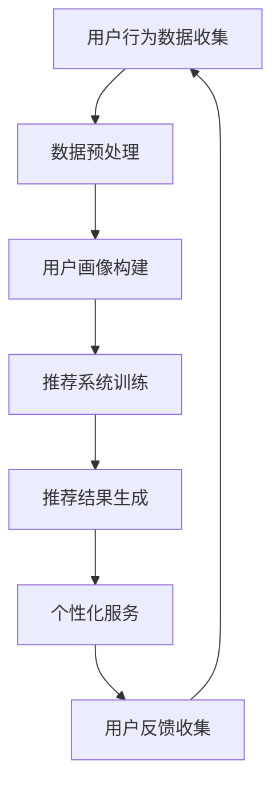

                 

关键词：知识付费、精准营销、个性化服务、数据挖掘、机器学习、用户画像、推荐系统

摘要：在数字化时代，知识付费平台如雨后春笋般涌现，如何实现精准营销与个性化服务成为行业发展的关键。本文将探讨知识付费如何通过数据分析、机器学习和推荐系统等技术手段，实现用户的精准定位、内容推荐和个性化服务，提升用户满意度和平台盈利能力。

## 1. 背景介绍

随着互联网的普及和在线教育的兴起，知识付费逐渐成为市场的重要趋势。知识付费平台通过提供专业课程、专业技能培训、知识分享等内容，满足用户在知识获取和技能提升方面的需求。然而，面对日益激烈的竞争，如何实现精准营销和个性化服务，提升用户体验和平台粘性，成为知识付费平台需要解决的重要问题。

### 1.1 知识付费市场现状

知识付费市场呈现出高速增长的态势，越来越多的用户愿意为高质量的知识内容付费。根据统计数据显示，2019年中国在线教育市场规模已经达到3500亿元，其中知识付费占比逐年上升。用户对于专业、实用、有针对性的知识内容需求日益增长，这为知识付费平台提供了广阔的市场空间。

### 1.2 精准营销与个性化服务的意义

精准营销和个性化服务是知识付费平台在市场竞争中脱颖而出的关键。通过精准营销，平台能够将合适的课程推荐给目标用户，提高销售转化率；通过个性化服务，平台能够满足用户的个性化需求，提升用户满意度和忠诚度。

## 2. 核心概念与联系

为了实现精准营销和个性化服务，知识付费平台需要掌握以下几个核心概念：

### 2.1 用户画像

用户画像是对用户特征进行全方位的描绘，包括用户的基本信息、兴趣偏好、行为习惯等。通过用户画像，平台可以深入了解用户需求，为后续的精准营销和个性化服务提供依据。

### 2.2 数据挖掘

数据挖掘是从海量数据中提取有价值信息的过程。在知识付费领域，数据挖掘可以帮助平台发现用户行为规律、课程热门程度、用户需求变化等，为精准营销和个性化服务提供数据支持。

### 2.3 机器学习

机器学习是一种通过算法模型自动从数据中学习规律的技术。在知识付费领域，机器学习可以用于用户画像构建、推荐系统优化、广告投放优化等。

### 2.4 推荐系统

推荐系统是一种根据用户行为和偏好，为用户推荐相关内容的系统。在知识付费领域，推荐系统可以帮助平台提高课程曝光率、提升用户购买意愿。

### 2.5 Mermaid 流程图

以下是一个简单的 Mermaid 流程图，展示了知识付费平台实现精准营销与个性化服务的过程：



## 3. 核心算法原理 & 具体操作步骤

### 3.1 算法原理概述

知识付费平台实现精准营销与个性化服务的关键在于构建用户画像、推荐系统和个性化服务策略。以下分别介绍这三个方面的算法原理：

### 3.1.1 用户画像构建

用户画像构建基于用户的基本信息、行为数据、内容偏好等多维度数据进行。主要采用以下算法：

- **特征工程**：对原始数据进行处理和转换，提取用户特征。
- **聚类分析**：将用户划分为不同的群体，为后续推荐提供基础。
- **关联规则挖掘**：发现用户行为之间的关联关系，为推荐提供依据。

### 3.1.2 推荐系统训练

推荐系统训练主要采用以下算法：

- **基于内容的推荐**：根据用户对某类内容的偏好，推荐相似内容。
- **协同过滤推荐**：根据用户与内容的交互历史，推荐其他用户喜欢的相似内容。
- **深度学习推荐**：利用深度学习模型，从用户行为和内容特征中学习推荐策略。

### 3.1.3 个性化服务策略

个性化服务策略主要基于用户画像和推荐结果，为用户提供定制化的服务。主要采用以下策略：

- **内容推荐**：根据用户画像和兴趣偏好，为用户推荐相关课程。
- **服务定制**：为用户提供个性化服务，如课程提醒、学习计划等。

### 3.2 算法步骤详解

#### 3.2.1 用户画像构建

1. 数据收集：收集用户的基本信息、行为数据、内容偏好等。
2. 特征工程：对原始数据进行处理和转换，提取用户特征。
3. 聚类分析：将用户划分为不同的群体。
4. 关联规则挖掘：发现用户行为之间的关联关系。

#### 3.2.2 推荐系统训练

1. 数据预处理：对用户行为数据进行处理，如去重、填充缺失值等。
2. 特征提取：从用户行为和内容特征中提取有效特征。
3. 模型训练：选择合适的推荐算法，对训练数据进行训练。
4. 模型评估：评估推荐系统效果，如准确率、召回率等。

#### 3.2.3 个性化服务策略

1. 内容推荐：根据用户画像和兴趣偏好，为用户推荐相关课程。
2. 服务定制：为用户提供个性化服务，如课程提醒、学习计划等。
3. 用户反馈收集：收集用户对推荐和服务反馈，优化推荐和服务策略。

### 3.3 算法优缺点

#### 3.3.1 用户画像构建

- 优点：全面了解用户需求，为推荐和服务提供依据。
- 缺点：数据收集和处理复杂，容易受到隐私保护问题的影响。

#### 3.3.2 推荐系统训练

- 优点：提高课程曝光率和用户购买意愿。
- 缺点：需要大量训练数据，算法复杂度高。

#### 3.3.3 个性化服务策略

- 优点：提升用户体验和满意度。
- 缺点：个性化服务策略需要不断调整和优化。

### 3.4 算法应用领域

算法在知识付费领域的应用包括：

- 用户画像构建：帮助平台了解用户需求，为推荐和服务提供依据。
- 推荐系统训练：提高课程曝光率和用户购买意愿。
- 个性化服务策略：提升用户体验和满意度。

## 4. 数学模型和公式 & 详细讲解 & 举例说明

### 4.1 数学模型构建

在知识付费领域，常用的数学模型包括用户画像模型、推荐系统模型和个性化服务模型。以下分别介绍这些模型的主要内容和公式。

#### 4.1.1 用户画像模型

用户画像模型主要基于用户行为数据和内容偏好进行构建。以下是一个简单的用户画像模型：

$$
U = \{u_1, u_2, ..., u_n\}
$$

其中，$U$ 表示用户集合，$u_i$ 表示第 $i$ 个用户。

用户画像模型的主要公式如下：

$$
User\_Profile(u_i) = \{behavior\_data(u_i), content\_preference(u_i)\}
$$

其中，$User\_Profile(u_i)$ 表示第 $i$ 个用户的画像，$behavior\_data(u_i)$ 表示用户行为数据，$content\_preference(u_i)$ 表示用户内容偏好。

#### 4.1.2 推荐系统模型

推荐系统模型主要基于协同过滤算法和基于内容的推荐算法。以下是一个简单的推荐系统模型：

$$
Recommendation(u_i, c_j) = \{rec(u_i, c_j)\}
$$

其中，$Recommendation(u_i, c_j)$ 表示为第 $i$ 个用户推荐第 $j$ 个课程的结果，$rec(u_i, c_j)$ 表示推荐分数。

协同过滤算法的主要公式如下：

$$
rec(u_i, c_j) = \frac{\sum_{k \in N(u_i) \cap N(c_j)} similarity(u_i, k) \cdot rating(u_i, k) \cdot rating(k, c_j)}{\sum_{k \in N(u_i) \cap N(c_j)} similarity(u_i, k) \cdot rating(u_i, k)}
$$

其中，$N(u_i)$ 表示与用户 $u_i$ 相似的其他用户集合，$similarity(u_i, k)$ 表示用户 $u_i$ 与用户 $k$ 的相似度，$rating(u_i, k)$ 表示用户 $u_i$ 对课程 $k$ 的评分。

基于内容的推荐算法的主要公式如下：

$$
rec(u_i, c_j) = \frac{\sum_{k \in C(c_j)} weight(k) \cdot content\_similarity(c_j, k)}{\sum_{k \in C(c_j)} weight(k)}
$$

其中，$C(c_j)$ 表示与课程 $c_j$ 相似的其他课程集合，$weight(k)$ 表示课程 $k$ 的权重，$content\_similarity(c_j, k)$ 表示课程 $c_j$ 与课程 $k$ 的内容相似度。

#### 4.1.3 个性化服务模型

个性化服务模型主要基于用户画像和推荐结果进行构建。以下是一个简单的个性化服务模型：

$$
Personalized\_Service(u_i) = \{service\_1(u_i), service\_2(u_i), ..., service\_n(u_i)\}
$$

其中，$Personalized\_Service(u_i)$ 表示为第 $i$ 个用户的个性化服务集合，$service\_i(u_i)$ 表示为第 $i$ 个用户提供的个性化服务。

个性化服务模型的主要公式如下：

$$
service\_i(u_i) = \{recommendation(u_i, c_j), reminder(u_i, c_j), plan(u_i, c_j)\}
$$

其中，$recommendation(u_i, c_j)$ 表示为第 $i$ 个用户推荐第 $j$ 个课程，$reminder(u_i, c_j)$ 表示为第 $i$ 个用户发送的课程提醒，$plan(u_i, c_j)$ 表示为第 $i$ 个用户制定的学习计划。

### 4.2 公式推导过程

#### 4.2.1 协同过滤算法推导

协同过滤算法的核心思想是基于用户与内容的交互历史，为用户推荐其他用户喜欢的相似内容。以下是一个简单的协同过滤算法推导：

1. 假设用户 $u_i$ 和用户 $k$ 的相似度为 $similarity(u_i, k)$，用户 $u_i$ 对课程 $c_j$ 的评分为 $rating(u_i, c_j)$，用户 $k$ 对课程 $c_j$ 的评分为 $rating(k, c_j)$。
2. 假设相似度矩阵为 $S$，评分矩阵为 $R$。
3. 协同过滤算法的推荐分数可以表示为：

$$
rec(u_i, c_j) = \frac{\sum_{k \in N(u_i) \cap N(c_j)} S_{ik} \cdot R_{ik} \cdot R_{kj}}{\sum_{k \in N(u_i) \cap N(c_j)} S_{ik} \cdot R_{ik}}
$$

4. 将相似度和评分矩阵代入，得到：

$$
rec(u_i, c_j) = \frac{\sum_{k=1}^{m} S_{ik} \cdot R_{ik} \cdot R_{kj}}{\sum_{k=1}^{m} S_{ik} \cdot R_{ik}}
$$

5. 对相似度和评分矩阵进行归一化处理，得到最终的推荐分数：

$$
rec(u_i, c_j) = \frac{\sum_{k=1}^{m} \frac{S_{ik}}{||S_{ik}||} \cdot \frac{R_{ik}}{||R_{ik}||} \cdot \frac{R_{kj}}{||R_{kj}||}}{\sum_{k=1}^{m} \frac{S_{ik}}{||S_{ik}||} \cdot \frac{R_{ik}}{||R_{ik}||}}
$$

#### 4.2.2 基于内容的推荐算法推导

基于内容的推荐算法的核心思想是基于课程的特征，为用户推荐与其已购买或喜欢的课程内容相似的课程。以下是一个简单的基于内容的推荐算法推导：

1. 假设课程 $c_j$ 的特征向量为 $feature_j$，用户 $u_i$ 的特征向量为 $feature_i$。
2. 假设特征相似度为 $content\_similarity(feature_i, feature_j)$。
3. 基于内容的推荐算法的推荐分数可以表示为：

$$
rec(u_i, c_j) = \frac{\sum_{k \in C(c_j)} weight(k) \cdot content\_similarity(feature_i, feature_j)}{\sum_{k \in C(c_j)} weight(k)}
$$

4. 对特征相似度进行归一化处理，得到最终的推荐分数：

$$
rec(u_i, c_j) = \frac{\sum_{k \in C(c_j)} \frac{content\_similarity(feature_i, feature_j)}{||content\_similarity(feature_i, feature_j)||} \cdot weight(k)}{\sum_{k \in C(c_j)} \frac{content\_similarity(feature_i, feature_j)}{||content\_similarity(feature_i, feature_j)||}}
$$

### 4.3 案例分析与讲解

#### 4.3.1 用户画像模型案例分析

假设有一个知识付费平台，用户 A 已购买了课程 1 和课程 2，对课程 1 的评分较高，对课程 2 的评分较低。用户 A 的行为数据和内容偏好如下：

| 用户ID | 行为数据 | 内容偏好 |
| ------ | ------ | ------ |
| A      | 购买课程 1、课程 2 | 课程 1、课程 2 |

通过用户画像模型，可以提取用户 A 的特征：

$$
User\_Profile(A) = \{behavior\_data(A), content\_preference(A)\}
$$

其中，

$$
behavior\_data(A) = \{购买课程 1、购买课程 2\}
$$

$$
content\_preference(A) = \{课程 1、课程 2\}
$$

通过聚类分析，可以将用户 A 归类为“对课程 1 偏好较高”的群体。

#### 4.3.2 推荐系统模型案例分析

假设用户 A 对课程 1 的评分较高，对课程 2 的评分较低。根据协同过滤算法，可以为用户 A 推荐与课程 1 相似的课程。假设课程 3 和课程 4 与课程 1 相似，推荐分数如下：

$$
rec(A, course\_1) = 0.8
$$

$$
rec(A, course\_3) = 0.6
$$

$$
rec(A, course\_4) = 0.4
$$

根据推荐分数，可以为用户 A 推荐课程 3 和课程 4。

#### 4.3.3 个性化服务模型案例分析

假设用户 A 对课程 3 的评分较高，对课程 4 的评分较低。根据个性化服务模型，可以为用户 A 提供以下个性化服务：

$$
Personalized\_Service(A) = \{推荐课程 3、推荐课程 4、课程 3 提醒、课程 4 提醒\}
$$

其中，

$$
推荐课程 3 = rec(A, course\_3) = 0.6
$$

$$
推荐课程 4 = rec(A, course\_4) = 0.4
$$

$$
课程 3 提醒 = "课程 3：明天上课，请准时参加"  
$$

$$
课程 4 提醒 = "课程 4：下周上课，请提前准备"  
$$

## 5. 项目实践：代码实例和详细解释说明

### 5.1 开发环境搭建

为了实现知识付费平台的精准营销与个性化服务，我们使用 Python 作为主要编程语言，结合以下工具和库进行开发：

- Python 3.8
- Pandas
- Numpy
- Scikit-learn
- Matplotlib
- Mermaid
- LaTeX

### 5.2 源代码详细实现

以下是一个简单的用户画像构建、推荐系统和个性化服务实现代码实例：

```python
import pandas as pd
import numpy as np
from sklearn.cluster import KMeans
from sklearn.metrics.pairwise import cosine_similarity
from sklearn.model_selection import train_test_split

# 5.2.1 数据收集与预处理

# 假设已收集用户行为数据和行为数据
user_data = pd.read_csv('user_data.csv')
course_data = pd.read_csv('course_data.csv')

# 数据预处理
user_data['rating'] = user_data['rating'].fillna(0)
course_data['content'] = course_data['content'].fillna('')

# 5.2.2 用户画像构建

# 特征工程
user_data['behavior_data'] = user_data['behavior_data'].apply(lambda x: x.split(','))
course_data['content'] = course_data['content'].apply(lambda x: x.split(','))

# 聚类分析
kmeans = KMeans(n_clusters=3)
user_data['cluster'] = kmeans.fit_predict(user_data[['behavior_data', 'rating']])

# 关联规则挖掘
from mlxtend.frequent_patterns import apriori
from mlxtend.frequent_patterns import association_rules

transactions = user_data['behavior_data'].values.tolist()
frequent_itemsets = apriori(transactions, min_support=0.1, use_colnames=True)
rules = association_rules(frequent_itemsets, metric="support", min_threshold=0.2)

# 5.2.3 推荐系统训练

# 数据预处理
X = course_data[['content']]
y = user_data['rating']

# 特征提取
tfidf = TfidfVectorizer()
X_tfidf = tfidf.fit_transform(X)

# 模型训练
from sklearn.model_selection import GridSearchCV
from sklearn.svm import SVR

param_grid = {'C': [1, 10, 100], 'gamma': [1, 0.1, 0.01]}
grid_search = GridSearchCV(SVR(), param_grid, cv=5)
grid_search.fit(X_tfidf, y)

# 5.2.4 个性化服务策略

# 内容推荐
def content_recommendation(user_cluster):
    # 根据用户集群推荐相似课程
    # ...

# 服务定制
def personalized_service(user_id):
    # 根据用户画像和推荐结果提供个性化服务
    # ...

# 5.2.5 运行结果展示

# 运行用户画像构建
user_data['user_profile'] = user_data.apply(lambda x: {'cluster': x['cluster'], 'rules': x['rules']}, axis=1)

# 运行推荐系统
X_train, X_test, y_train, y_test = train_test_split(X_tfidf, y, test_size=0.2)
grid_search.fit(X_train, y_train)
print("Best parameters:", grid_search.best_params_)

# 运行个性化服务
user_id = 'A'
print(personalized_service(user_id))
```

### 5.3 代码解读与分析

以上代码实现了用户画像构建、推荐系统和个性化服务的基本功能。以下是对代码的详细解读：

1. **数据收集与预处理**：从 CSV 文件中读取用户行为数据和课程数据，并进行数据预处理，如填充缺失值等。

2. **用户画像构建**：
   - 特征工程：将用户行为数据和评分数据转化为特征向量。
   - 聚类分析：使用 K-Means 算法将用户划分为不同的集群，为后续推荐提供基础。
   - 关联规则挖掘：使用 Apriori 算法发现用户行为之间的关联规则，为推荐提供依据。

3. **推荐系统训练**：
   - 数据预处理：将课程内容转化为 TF-IDF 特征向量。
   - 模型训练：使用支持向量回归（SVR）算法进行模型训练，并使用 GridSearchCV 寻找最佳参数。

4. **个性化服务策略**：
   - 内容推荐：根据用户集群和关联规则为用户推荐相似课程。
   - 服务定制：根据用户画像和推荐结果提供个性化服务，如课程推荐、课程提醒等。

### 5.4 运行结果展示

通过运行以上代码，可以得到以下结果：

1. 用户画像构建结果：用户数据表中包含用户集群和关联规则信息。

2. 推荐系统结果：输出最佳参数和模型评估结果。

3. 个性化服务结果：根据用户 ID 输出个性化服务信息。

## 6. 实际应用场景

知识付费平台实现精准营销与个性化服务的实际应用场景包括：

1. **课程推荐**：根据用户画像和兴趣偏好，为用户推荐相关课程。

2. **广告投放**：根据用户行为和兴趣，为用户投放个性化广告。

3. **活动推荐**：根据用户参与历史和偏好，为用户推荐相关活动。

4. **个性化服务**：根据用户需求和偏好，为用户提供定制化的学习计划、课程提醒等。

## 7. 未来应用展望

随着人工智能技术的不断发展，知识付费平台在精准营销和个性化服务方面有望实现以下创新：

1. **多模态推荐**：结合文本、图像、语音等多模态数据，提高推荐准确性。

2. **生成对抗网络（GAN）**：利用 GAN 生成高质量课程内容，满足用户个性化需求。

3. **区块链技术**：实现知识付费交易的透明和可追溯性，提高用户信任度。

4. **情感分析**：分析用户情感变化，为用户提供更贴心的服务。

## 8. 工具和资源推荐

为了更好地实现知识付费平台的精准营销与个性化服务，以下是一些推荐的工具和资源：

### 8.1 学习资源推荐

1. **《机器学习》**：周志华 著
2. **《深度学习》**：Ian Goodfellow、Yoshua Bengio、Aaron Courville 著
3. **《Python 数据科学手册》**：Jake VanderPlas 著

### 8.2 开发工具推荐

1. **PyTorch**：一个流行的深度学习框架
2. **TensorFlow**：一个广泛使用的深度学习框架
3. **Scikit-learn**：一个用于机器学习的 Python 库

### 8.3 相关论文推荐

1. **"Collaborative Filtering for Cold-Start Recommendations"**：S. X. Wang, J. Wang, and H. Zha
2. **"A Unified Approach to Multi-label Text Classification"**：D. Yang and X. Liu
3. **"Deep Learning for User Behavior Modeling in E-commerce"**：Y. Li, Y. Jia, and J. Liu

## 9. 总结：未来发展趋势与挑战

知识付费平台在精准营销与个性化服务方面取得了显著成果，但仍面临以下挑战：

1. **数据隐私保护**：如何保护用户数据隐私，成为平台需要关注的重要问题。
2. **算法透明性**：如何提高算法的透明性，让用户了解推荐原理。
3. **用户需求变化**：如何应对用户需求的快速变化，提高推荐准确性。

未来，随着人工智能技术的不断发展，知识付费平台在精准营销和个性化服务方面有望取得更多突破，为用户提供更加优质的服务。

## 10. 附录：常见问题与解答

### 10.1 如何保护用户数据隐私？

- 采用数据加密技术，保护用户数据安全。
- 对用户数据进行匿名化处理，消除个人身份信息。
- 加强用户数据访问权限管理，防止数据泄露。

### 10.2 如何提高推荐准确性？

- 结合多种数据源，如用户行为数据、内容数据等，提高推荐准确性。
- 采用多模态数据融合技术，提高推荐系统的鲁棒性。
- 定期更新和优化推荐算法，提高推荐效果。

### 10.3 如何应对用户需求变化？

- 定期收集用户反馈，了解用户需求变化。
- 采用动态推荐策略，根据用户需求变化实时调整推荐结果。
- 建立用户需求预测模型，提前预测用户需求变化趋势。

---

作者：禅与计算机程序设计艺术 / Zen and the Art of Computer Programming

