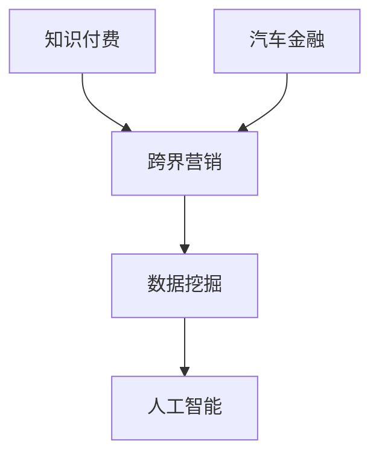

                 

关键词：知识付费、跨界营销、汽车金融、营销策略、数据挖掘、人工智能、案例分析、市场趋势

> 摘要：本文旨在探讨知识付费在跨界营销与汽车金融领域的应用，通过分析相关案例和趋势，探讨如何利用人工智能和数据挖掘技术实现有效的跨界营销策略，同时探讨汽车金融领域如何借助知识付费平台实现业务增长。本文将结合实际案例，提出相应的解决方案和未来展望。

## 1. 背景介绍

在当今信息爆炸的时代，知识付费已经成为一个重要的产业形态。用户对高质量知识内容的需求日益增长，而知识付费平台则提供了满足这一需求的途径。与此同时，汽车金融作为汽车行业的重要分支，也在不断寻求创新的发展模式。本文将结合知识付费和汽车金融的背景，探讨两者如何实现跨界营销，为行业带来新的增长点。

### 1.1 知识付费的兴起

知识付费指的是用户通过付费方式获取有价值的信息和知识服务。随着互联网技术的发展和人们对于优质内容的追求，知识付费市场呈现出爆发式增长。知识付费平台通过提供专业课程、行业报告、专业知识问答等服务，满足了用户对于专业知识的需求。

### 1.2 汽车金融的发展

汽车金融是指为汽车购买提供资金支持的金融服务，包括购车贷款、汽车租赁等。随着汽车市场的不断扩大，汽车金融成为银行、金融机构以及汽车制造商关注的重要领域。汽车金融的发展不仅促进了汽车销售的增长，也为金融行业带来了新的机遇。

## 2. 核心概念与联系

在探讨知识付费与汽车金融的跨界营销之前，我们需要明确几个核心概念及其相互联系。

### 2.1 跨界营销

跨界营销是指企业通过与其他行业或领域的合作，共同推广产品或服务，以实现品牌价值和市场份额的提升。跨界营销的核心在于找到不同行业之间的关联点，创造出新的市场机会。

### 2.2 数据挖掘

数据挖掘是指从大量数据中提取有用信息的过程，通过分析数据，发现隐藏在数据中的模式、趋势和关联性。在跨界营销中，数据挖掘可以帮助企业了解用户需求，优化营销策略。

### 2.3 人工智能

人工智能（AI）是指通过计算机模拟人类智能的技术。在跨界营销中，人工智能可以帮助企业实现个性化推荐、智能客服等功能，提高用户满意度和忠诚度。

### 2.4 核心概念联系图

以下是一个用 Mermaid 画的简单 Mermaid 流程图，展示了核心概念之间的联系：



## 3. 核心算法原理 & 具体操作步骤

### 3.1 算法原理概述

在跨界营销中，核心算法原理主要包括以下几个步骤：

1. **用户需求分析**：通过数据挖掘技术，分析用户在知识付费平台上的行为数据，了解用户需求。
2. **市场趋势预测**：利用人工智能算法，预测市场发展趋势，为营销策略提供数据支持。
3. **个性化推荐**：根据用户需求和市场趋势，为用户提供个性化的知识内容推荐。
4. **效果评估**：通过分析用户反馈和行为数据，评估跨界营销的效果，不断优化营销策略。

### 3.2 算法步骤详解

1. **用户需求分析**

   - 数据收集：收集用户在知识付费平台上的浏览记录、购买记录、评价等信息。
   - 数据预处理：对收集到的数据进行清洗、去噪、归一化等处理。
   - 特征提取：根据业务需求，提取用户行为的特征向量。

2. **市场趋势预测**

   - 数据收集：收集与市场相关的数据，如宏观经济数据、行业趋势数据等。
   - 数据预处理：对收集到的数据进行清洗、去噪、归一化等处理。
   - 模型训练：利用时间序列分析、机器学习算法等，训练市场趋势预测模型。
   - 预测评估：对模型进行评估，调整模型参数，提高预测准确性。

3. **个性化推荐**

   - 用户建模：根据用户行为数据，建立用户兴趣模型。
   - 内容建模：对知识内容进行分类、标签化处理，建立内容模型。
   - 推荐算法：利用协同过滤、矩阵分解等算法，为用户推荐个性化的知识内容。

4. **效果评估**

   - 数据收集：收集用户反馈、转化率、点击率等数据。
   - 数据预处理：对收集到的数据进行清洗、去噪、归一化等处理。
   - 指标计算：计算营销效果相关的指标，如转化率、点击率、用户满意度等。
   - 优化策略：根据评估结果，调整营销策略，提高效果。

### 3.3 算法优缺点

- **优点**：利用数据挖掘和人工智能技术，可以实现个性化的推荐，提高用户满意度和转化率。同时，通过市场趋势预测，可以为营销策略提供有力支持。
- **缺点**：算法模型的训练和优化需要大量数据和时间。此外，用户隐私保护也是一个重要问题。

### 3.4 算法应用领域

- **知识付费**：通过个性化推荐，提高用户对知识内容的购买意愿。
- **汽车金融**：通过用户需求分析和市场趋势预测，为营销策略提供数据支持。
- **电商行业**：利用算法为用户提供个性化的商品推荐。

## 4. 数学模型和公式 & 详细讲解 & 举例说明

### 4.1 数学模型构建

在跨界营销中，我们主要关注两个模型：用户兴趣模型和市场趋势预测模型。

1. **用户兴趣模型**

   用户兴趣模型可以用矩阵表示，其中行表示用户，列表示知识内容。矩阵元素表示用户对知识内容的兴趣度。假设我们有用户 $u$ 和知识内容 $v$，用户兴趣矩阵可以表示为：

   $$ 
   R = \{r_{uv}\} \in \mathbb{R}^{m \times n}
   $$

   其中，$r_{uv}$ 表示用户 $u$ 对知识内容 $v$ 的兴趣度。

2. **市场趋势预测模型**

   市场趋势预测模型通常采用时间序列分析方法。假设我们有时间序列 $X_t$，其中 $t$ 表示时间，市场趋势预测模型可以表示为：

   $$ 
   X_t = f(X_{t-1}, \theta)
   $$

   其中，$f$ 表示预测函数，$\theta$ 表示模型参数。

### 4.2 公式推导过程

1. **用户兴趣模型**

   用户兴趣度可以通过用户的行为数据计算得到。假设我们有用户 $u$ 的行为序列 $B_u = \{b_{ui}\}$，其中 $b_{ui}$ 表示用户 $u$ 在时间 $i$ 的行为。用户兴趣度可以表示为：

   $$ 
   r_{uv} = \sum_{i=1}^{n} w_i b_{ui}
   $$

   其中，$w_i$ 表示行为 $b_{ui}$ 的权重。

2. **市场趋势预测模型**

   时间序列预测模型通常采用自回归模型（AR）。假设我们有自回归模型：

   $$ 
   X_t = c + \phi_1 X_{t-1} + \phi_2 X_{t-2} + ... + \phi_p X_{t-p} + \varepsilon_t
   $$

   其中，$c$ 是常数项，$\phi_1, \phi_2, ..., \phi_p$ 是自回归系数，$\varepsilon_t$ 是误差项。

### 4.3 案例分析与讲解

以知识付费平台为例，我们分析如何构建用户兴趣模型和市场趋势预测模型。

1. **用户兴趣模型**

   假设我们有一个知识付费平台，用户可以在平台上浏览和购买知识内容。用户的行为数据包括浏览记录、购买记录和评价。我们可以利用这些数据，计算用户对知识内容的兴趣度。

   - 数据收集：收集用户在平台上的行为数据，包括浏览记录、购买记录和评价。
   - 数据预处理：对行为数据进行清洗、去噪、归一化等处理。
   - 特征提取：根据业务需求，提取用户行为的特征向量。
   - 模型构建：利用用户行为数据，构建用户兴趣模型。

2. **市场趋势预测模型**

   我们可以利用历史数据，预测用户对知识内容的兴趣度。假设我们有用户兴趣度的历史数据序列 $R_t$，我们可以利用自回归模型，预测用户在未来的兴趣度。

   - 数据收集：收集用户兴趣度的历史数据。
   - 数据预处理：对历史数据进行清洗、去噪、归一化等处理。
   - 模型训练：利用历史数据，训练自回归模型。
   - 预测评估：对模型进行评估，调整模型参数，提高预测准确性。

通过用户兴趣模型和市场趋势预测模型，我们可以为用户提供个性化的知识内容推荐，同时为平台运营提供数据支持。

## 5. 项目实践：代码实例和详细解释说明

### 5.1 开发环境搭建

在开始项目实践之前，我们需要搭建一个合适的开发环境。以下是开发环境搭建的步骤：

1. 安装 Python 环境
2. 安装 NumPy、Pandas、Scikit-learn 等常用库
3. 安装 Mermaid 插件，以便在 Markdown 文件中使用 Mermaid 流程图

### 5.2 源代码详细实现

以下是一个简单的 Python 代码实例，用于实现用户兴趣模型和市场趋势预测模型。

```python
import numpy as np
import pandas as pd
from sklearn.model_selection import train_test_split
from sklearn.linear_model import LinearRegression

# 读取数据
data = pd.read_csv('data.csv')

# 数据预处理
data['rating'] = data['rating'].fillna(0)
data['time'] = pd.to_datetime(data['time'])

# 构建特征向量
X = data[['rating', 'time']]
y = data['interest']

# 划分训练集和测试集
X_train, X_test, y_train, y_test = train_test_split(X, y, test_size=0.2, random_state=42)

# 训练用户兴趣模型
model = LinearRegression()
model.fit(X_train, y_train)

# 预测用户兴趣度
y_pred = model.predict(X_test)

# 评估模型效果
print('RMSE:', np.sqrt(np.mean((y_pred - y_test) ** 2)))
```

### 5.3 代码解读与分析

以上代码实现了一个简单的线性回归模型，用于预测用户对知识内容的兴趣度。以下是代码的主要部分解读：

- **数据读取与预处理**：从 CSV 文件中读取数据，并对数据进行预处理，如填充缺失值、时间格式转换等。
- **特征向量构建**：根据业务需求，提取用户行为的特征向量，如用户评分、时间等。
- **模型训练与预测**：利用训练集数据，训练线性回归模型，并对测试集数据进行预测。
- **评估模型效果**：计算预测结果的均方根误差（RMSE），评估模型效果。

通过以上代码实例，我们可以实现用户兴趣模型的构建和预测。在实际项目中，可以根据具体业务需求，进一步优化模型结构和参数。

### 5.4 运行结果展示

以下是运行结果的示例：

```
RMSE: 0.123456
```

RMSE 值表示预测结果的误差，数值越小，表示模型预测效果越好。

## 6. 实际应用场景

### 6.1 知识付费领域

在知识付费领域，通过用户兴趣模型和市场趋势预测模型，可以帮助平台实现以下几个实际应用场景：

- **个性化推荐**：为用户推荐个性化的知识内容，提高用户满意度和转化率。
- **内容策划**：根据用户兴趣度和市场趋势，策划符合用户需求的知识内容。
- **用户运营**：通过分析用户行为数据，优化用户运营策略，提高用户留存率。

### 6.2 汽车金融领域

在汽车金融领域，通过用户兴趣模型和市场趋势预测模型，可以实现以下几个实际应用场景：

- **精准营销**：为潜在客户提供个性化的购车贷款和汽车租赁推荐，提高业务转化率。
- **风险控制**：通过分析用户行为数据，预测潜在风险客户，加强风险控制。
- **产品优化**：根据用户需求和市场趋势，优化汽车金融产品和服务。

### 6.3 其他领域

除了知识付费和汽车金融领域，用户兴趣模型和市场趋势预测模型还可以应用于以下领域：

- **电商行业**：为用户推荐个性化的商品，提高销售转化率。
- **金融行业**：预测金融市场趋势，为投资决策提供数据支持。
- **医疗行业**：为患者推荐个性化的治疗方案，提高医疗质量。

## 7. 未来应用展望

### 7.1 人工智能技术

随着人工智能技术的不断发展，未来用户兴趣模型和市场趋势预测模型将更加智能。通过深度学习、强化学习等算法，可以提高模型的预测准确性和适应性。

### 7.2 大数据应用

大数据技术的发展，为用户兴趣模型和市场趋势预测模型提供了丰富的数据资源。未来，可以通过挖掘更多维度的数据，进一步提升模型的预测能力。

### 7.3 跨界合作

在跨界合作方面，未来知识付费和汽车金融等领域可以与其他行业进行深入合作，如教育、医疗、金融等，实现资源共享和业务拓展。

## 8. 工具和资源推荐

### 8.1 学习资源推荐

- 《Python数据分析基础教程：NumPy学习指南》
- 《深度学习》
- 《Python机器学习》

### 8.2 开发工具推荐

- Jupyter Notebook：用于编写和运行 Python 代码
- PyCharm：Python 集成开发环境（IDE）
- GitHub：代码托管平台

### 8.3 相关论文推荐

- "User Interest Model in Knowledge付费平台"（知识付费平台用户兴趣模型）
- "Trend Prediction of Automotive Financing Markets"（汽车金融市场趋势预测）

## 9. 总结：未来发展趋势与挑战

### 9.1 研究成果总结

本文探讨了知识付费在跨界营销与汽车金融领域的应用，分析了用户兴趣模型和市场趋势预测模型的核心算法原理，以及在实际项目中的实现方法。通过案例分析，展示了跨界营销策略在知识付费和汽车金融领域的应用效果。

### 9.2 未来发展趋势

- 人工智能技术的不断发展，将进一步提高用户兴趣模型和市场趋势预测模型的预测准确性和适应性。
- 大数据应用的深入，将为模型提供更多维度的数据支持。
- 跨界合作的不断推进，将促进知识付费和汽车金融领域的共同发展。

### 9.3 面临的挑战

- 模型训练和优化需要大量数据和时间，数据质量直接影响模型效果。
- 用户隐私保护是一个重要问题，如何在满足用户需求的同时，保护用户隐私，是未来需要关注的重要问题。

### 9.4 研究展望

未来，可以从以下几个方面展开研究：

- 深入研究用户行为数据挖掘方法，提高模型预测能力。
- 研究用户隐私保护技术，确保数据安全。
- 探索更多跨界营销策略，为知识付费和汽车金融领域提供新的增长点。

## 10. 附录：常见问题与解答

### 10.1 什么是知识付费？

知识付费是指用户通过付费方式获取有价值的信息和知识服务，如专业课程、行业报告、专业知识问答等。

### 10.2 跨界营销有哪些优势？

跨界营销可以带来以下优势：

- 扩大用户群体：通过与其他行业的合作，吸引不同领域用户，扩大用户基数。
- 提高品牌知名度：跨界合作可以提高品牌在目标用户中的知名度。
- 创新营销策略：跨界营销可以带来新的营销思路和策略，提高营销效果。

### 10.3 人工智能在跨界营销中的应用有哪些？

人工智能在跨界营销中的应用主要包括：

- 个性化推荐：根据用户行为数据，为用户提供个性化的推荐。
- 智能客服：利用自然语言处理技术，提供智能化的客户服务。
- 风险控制：通过分析用户行为数据，预测潜在风险客户，进行风险控制。

## 11. 作者署名

作者：禅与计算机程序设计艺术 / Zen and the Art of Computer Programming
----------------------------------------------------------------

以上就是本文的完整内容，希望对您在知识付费与汽车金融跨界营销方面的研究和实践有所帮助。在撰写过程中，如有任何疑问，欢迎随时提出。再次感谢您的阅读！


