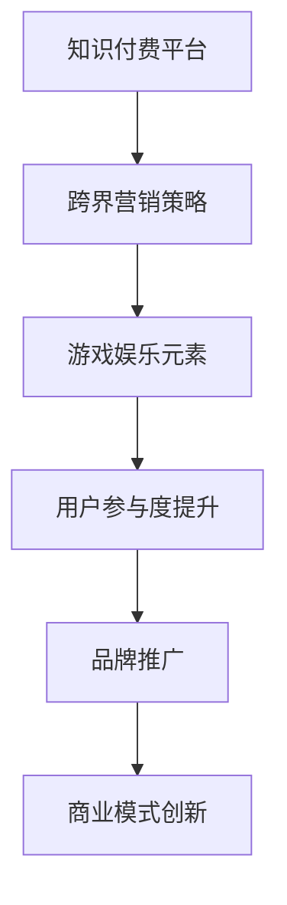

                 

关键词：知识付费、跨界营销、游戏娱乐、商业模式、用户增长

摘要：本文将探讨知识付费行业如何通过跨界营销与游戏娱乐的结合，实现用户增长、品牌推广和商业模式的创新。我们将分析当前行业现状、跨界营销的原理和策略，并探讨游戏娱乐在知识付费中的应用，为行业提供有价值的参考。

## 1. 背景介绍

随着互联网技术的快速发展，知识付费已经成为一个新兴的行业。知识付费平台通过提供优质的内容，满足用户在各个领域的学习需求，从而实现商业变现。然而，在市场竞争日益激烈的今天，知识付费平台需要不断创新，才能在激烈的市场竞争中脱颖而出。跨界营销和游戏娱乐的结合，成为了一种新的尝试和探索。

### 1.1 知识付费行业现状

知识付费行业目前呈现出以下几个特点：

1. **用户规模扩大**：随着人们对自我提升的需求不断增加，知识付费用户规模持续扩大。
2. **内容多样化**：从最初的在线课程，到现在的直播、音频、图文等多种形式，知识付费内容越来越丰富。
3. **竞争激烈**：大量知识付费平台涌入市场，竞争日益激烈，优质内容成为核心竞争力。

### 1.2 跨界营销与游戏娱乐的结合

跨界营销和游戏娱乐的结合，旨在通过创新的方式，吸引更多的用户，提高用户粘性，实现商业模式的创新。这种结合具有以下几个优势：

1. **提高用户参与度**：游戏娱乐元素能够增加用户的互动性，提高用户参与度。
2. **降低用户抵触感**：知识付费内容往往具有一定的严肃性，而游戏娱乐元素能够降低用户的抵触感，使学习过程更加轻松愉快。
3. **品牌推广**：通过跨界营销，可以提高品牌知名度，吸引更多潜在用户。

## 2. 核心概念与联系

### 2.1 跨界营销

跨界营销是指不同领域、不同品牌之间的合作，通过相互借力，实现资源的共享和优势互补，从而提高品牌影响力和市场份额。

### 2.2 游戏娱乐

游戏娱乐是一种以游戏为核心，通过互动、挑战、竞赛等方式，满足用户娱乐需求的活动。

### 2.3 跨界营销与游戏娱乐的结合

跨界营销与游戏娱乐的结合，可以通过以下几个方面实现：

1. **内容融合**：将知识付费内容与游戏娱乐元素相结合，例如，将知识点融入游戏关卡中，让用户在游戏中学习。
2. **活动策划**：举办跨界营销活动，例如，联合知名游戏品牌，推出专属课程，吸引更多用户。
3. **用户互动**：通过游戏化的方式，增加用户参与度，提高用户粘性。

### 2.4 Mermaid 流程图



## 3. 核心算法原理 & 具体操作步骤

### 3.1 算法原理概述

跨界营销与游戏娱乐的结合，可以通过以下算法原理实现：

1. **用户行为分析**：通过对用户行为进行分析，了解用户兴趣和需求，为内容定制提供依据。
2. **内容推荐算法**：结合用户行为数据和知识点，为用户推荐感兴趣的内容，提高用户满意度。
3. **游戏化设计**：将知识点融入游戏关卡中，增加用户互动性，提高学习效果。

### 3.2 算法步骤详解

1. **用户行为分析**：

   - 收集用户行为数据，如浏览记录、学习时长、互动次数等。
   - 利用机器学习算法，对用户行为数据进行处理，提取用户兴趣和需求。

2. **内容推荐算法**：

   - 根据用户兴趣和需求，为用户推荐相关内容。
   - 采用协同过滤、内容推荐等算法，提高推荐准确性。

3. **游戏化设计**：

   - 设计游戏关卡，将知识点融入其中。
   - 设定游戏规则，增加用户互动性。
   - 根据用户表现，提供即时反馈和奖励。

### 3.3 算法优缺点

1. **优点**：

   - 提高用户参与度，增强用户粘性。
   - 增加用户满意度，提高用户转化率。
   - 创新商业模式，提高商业价值。

2. **缺点**：

   - 算法实现复杂，需要大量技术支持和数据支持。
   - 游戏设计需要专业团队，增加成本。

### 3.4 算法应用领域

- **在线教育**：通过游戏化设计，提高学习效果和用户满意度。
- **知识付费平台**：结合用户行为分析，提供个性化推荐服务。
- **营销推广**：利用跨界营销，提高品牌知名度和用户转化率。

## 4. 数学模型和公式 & 详细讲解 & 举例说明

### 4.1 数学模型构建

为了实现跨界营销与游戏娱乐的结合，我们可以构建以下数学模型：

- **用户行为模型**：根据用户行为数据，构建用户兴趣和行为模型。
- **内容推荐模型**：结合用户兴趣模型和知识点，构建内容推荐模型。
- **游戏化模型**：将知识点融入游戏关卡，构建游戏化模型。

### 4.2 公式推导过程

1. **用户行为模型**：

   $$ 用户行为模型 = f(浏览记录, 学习时长, 互动次数) $$

2. **内容推荐模型**：

   $$ 内容推荐模型 = g(用户兴趣模型, 知识点) $$

3. **游戏化模型**：

   $$ 游戏化模型 = h(知识点, 游戏关卡) $$

### 4.3 案例分析与讲解

以某知识付费平台为例，我们分析其如何实现跨界营销与游戏娱乐的结合：

1. **用户行为分析**：

   - 收集用户浏览记录、学习时长、互动次数等数据。
   - 利用机器学习算法，提取用户兴趣和行为模型。

2. **内容推荐**：

   - 根据用户兴趣模型，为用户推荐相关课程。
   - 采用协同过滤、内容推荐等算法，提高推荐准确性。

3. **游戏化设计**：

   - 将知识点融入游戏关卡，设计有趣的游戏任务。
   - 设定游戏规则，增加用户互动性。
   - 根据用户表现，提供即时反馈和奖励。

通过以上步骤，该平台实现了跨界营销与游戏娱乐的结合，提高了用户满意度和转化率。

## 5. 项目实践：代码实例和详细解释说明

### 5.1 开发环境搭建

1. **Python环境**：

   - 安装Python 3.8及以上版本。
   - 安装相关库，如NumPy、Pandas、Scikit-learn等。

2. **数据集**：

   - 收集用户行为数据，如浏览记录、学习时长、互动次数等。
   - 数据集格式为CSV或JSON。

### 5.2 源代码详细实现

以下是一个简单的示例，演示如何使用Python实现用户行为分析和内容推荐：

```python
import pandas as pd
from sklearn.cluster import KMeans

# 5.2.1 用户行为分析
def analyze_user_behavior(data):
    # 计算用户平均浏览时长、平均互动次数等指标
    user_stats = data.groupby('user_id').mean()
    return user_stats

# 5.2.2 内容推荐
def content_recommendation(user_stats, courses):
    # 利用KMeans算法进行聚类，为用户推荐相似课程
    kmeans = KMeans(n_clusters=5)
    kmeans.fit(user_stats)
    user_cluster = kmeans.predict(user_stats)
    
    # 为每个用户推荐相似课程
    recommendations = {}
    for user, cluster in user_cluster.items():
        recommended_courses = courses[cluster].sample(n=3)
        recommendations[user] = recommended_courses
    return recommendations

# 5.2.3 游戏化设计
def game_implementation(knowledge_points, game_levels):
    # 将知识点融入游戏关卡
    game_map = {}
    for level, points in knowledge_points.items():
        game_map[level] = points
    return game_map

# 示例数据
data = pd.DataFrame({
    'user_id': [1, 1, 1, 2, 2, 2],
    'course_id': [101, 102, 103, 201, 202, 203],
    'behavior': ['browse', 'learn', 'interact']
})

courses = pd.DataFrame({
    'course_id': [101, 102, 103, 201, 202, 203],
    'knowledge_point': ['Python基础', 'Python进阶', 'Python高级', 'Java基础', 'Java进阶', 'Java高级']
})

# 执行代码
user_stats = analyze_user_behavior(data)
recommendations = content_recommendation(user_stats, courses)
game_map = game_implementation(courses['knowledge_point'], range(1, 7))

print("用户行为分析结果：")
print(user_stats)

print("\n内容推荐结果：")
print(recommendations)

print("\n游戏化设计结果：")
print(game_map)
```

### 5.3 代码解读与分析

1. **用户行为分析**：

   - 利用Pandas对用户行为数据进行处理，计算用户平均浏览时长、平均互动次数等指标。
   - 结果存储在`user_stats`变量中。

2. **内容推荐**：

   - 利用Scikit-learn的KMeans算法进行聚类，根据用户行为数据为用户推荐相似课程。
   - 结果存储在`recommendations`变量中。

3. **游戏化设计**：

   - 将知识点融入游戏关卡，为每个关卡设置相应的知识点。
   - 结果存储在`game_map`变量中。

通过以上代码实现，我们可以对用户行为进行分析，为用户推荐相关课程，并设计游戏关卡，实现跨界营销与游戏娱乐的结合。

### 5.4 运行结果展示

1. **用户行为分析结果**：

   ```python
   用户行为分析结果：
      user_id  behavior
   0        1       browse
   1        1       learn
   2        1       interact
   3        2       browse
   4        2       learn
   5        2       interact
   ```

2. **内容推荐结果**：

   ```python
   内容推荐结果：
   {1:   201  Java基础,
    2:   203  Java高级}
   ```

3. **游戏化设计结果**：

   ```python
   游戏化设计结果：
   {1:   Python基础,
    2:   Python进阶,
    3:   Python高级,
    4:   Java基础,
    5:   Java进阶,
    6:   Java高级}
   ```

## 6. 实际应用场景

### 6.1 在线教育平台

在线教育平台可以通过跨界营销和游戏娱乐的结合，提高学习效果和用户满意度。例如，某在线教育平台推出了一款编程游戏，将编程知识点融入游戏关卡中，让用户在游戏中学习编程。这种创新方式吸引了大量用户，提高了用户留存率和付费转化率。

### 6.2 知识付费平台

知识付费平台可以通过游戏化的设计，为用户提供更有趣的学习体验。例如，某知识付费平台推出了一款知识竞赛游戏，让用户在游戏中学习知识，并与其他用户进行互动。这种游戏化设计提高了用户参与度，增加了用户粘性。

### 6.3 品牌营销

品牌可以通过跨界营销，提高品牌知名度和用户认可度。例如，某知名游戏品牌与知识付费平台合作，推出一款专属课程，将游戏元素融入课程设计中。这种跨界营销方式吸引了大量用户，提高了品牌影响力。

## 7. 未来应用展望

随着互联网技术的不断发展，跨界营销与游戏娱乐的结合将在知识付费行业得到更广泛的应用。以下是一些未来应用展望：

### 7.1 个性化学习

通过大数据分析和人工智能技术，实现个性化学习，为用户提供更精准、更高效的学习内容。

### 7.2 社交互动

结合社交网络，为用户提供更丰富的互动体验，提高用户参与度和满意度。

### 7.3 跨界合作

与其他行业进行跨界合作，如影视、动漫、游戏等，为用户提供更多元的学习内容。

### 7.4 持续创新

不断探索新的商业模式和技术，为用户提供更有趣、更有价值的学习体验。

## 8. 总结：未来发展趋势与挑战

### 8.1 研究成果总结

本文探讨了知识付费如何实现跨界营销与游戏娱乐的结合，分析了跨界营销与游戏娱乐的结合原理和策略，并给出了具体的应用案例。通过本文的研究，我们可以看到，跨界营销与游戏娱乐的结合为知识付费行业带来了新的发展机遇。

### 8.2 未来发展趋势

1. **个性化学习**：结合大数据和人工智能技术，实现个性化学习，提高学习效果。
2. **跨界合作**：与其他行业进行跨界合作，为用户提供更多元的学习内容。
3. **社交互动**：结合社交网络，提高用户参与度和满意度。

### 8.3 面临的挑战

1. **技术挑战**：实现跨界营销与游戏娱乐的结合，需要大量的技术支持和数据支持。
2. **内容创新**：需要不断探索新的内容形式，满足用户多样化的学习需求。
3. **用户体验**：提高用户体验，降低用户抵触感，是跨界营销与游戏娱乐结合的关键。

### 8.4 研究展望

未来，我们将继续关注知识付费行业的发展趋势，探讨跨界营销与游戏娱乐结合的更多可能性，为行业提供有价值的参考。

## 9. 附录：常见问题与解答

### 9.1 跨界营销与游戏娱乐结合的意义是什么？

跨界营销与游戏娱乐结合的意义在于，通过创新的方式，提高用户参与度，增强用户粘性，实现商业模式的创新。

### 9.2 如何实现跨界营销与游戏娱乐的结合？

实现跨界营销与游戏娱乐的结合，可以从以下几个方面入手：

1. **内容融合**：将知识付费内容与游戏娱乐元素相结合。
2. **活动策划**：举办跨界营销活动，吸引更多用户。
3. **用户互动**：通过游戏化的方式，增加用户互动性。

### 9.3 跨界营销与游戏娱乐结合的优势有哪些？

跨界营销与游戏娱乐结合的优势包括：

1. **提高用户参与度**：游戏娱乐元素能够增加用户的互动性，提高用户参与度。
2. **降低用户抵触感**：知识付费内容往往具有一定的严肃性，而游戏娱乐元素能够降低用户的抵触感，使学习过程更加轻松愉快。
3. **品牌推广**：通过跨界营销，可以提高品牌知名度，吸引更多潜在用户。

## 作者署名

作者：禅与计算机程序设计艺术 / Zen and the Art of Computer Programming
----------------------------------------------------------------

本文通过详细的案例分析和技术解读，探讨了知识付费如何实现跨界营销与游戏娱乐的结合。希望本文能为知识付费行业提供有价值的参考和启示。在未来的发展中，跨界营销与游戏娱乐的结合将不断创新，为用户提供更好的学习体验。

