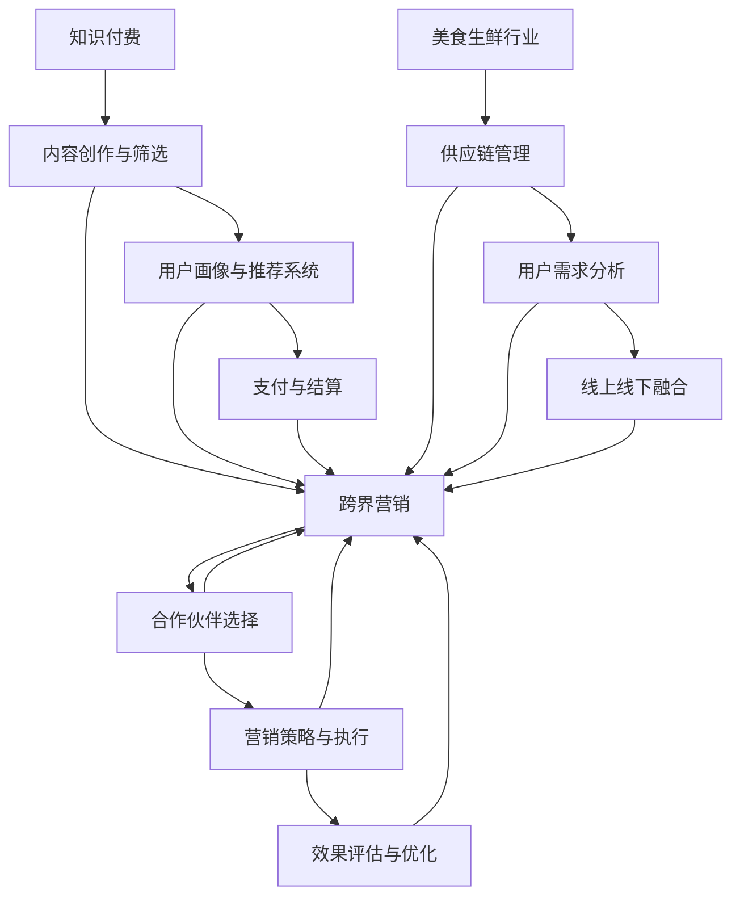

                 

关键词：知识付费，跨界营销，美食生鲜，数字化转型，用户体验，数据分析，技术创新

> 摘要：本文将探讨知识付费在跨界营销与美食生鲜领域的应用，分析其核心原理、操作步骤、数学模型、代码实例，并展望未来的发展趋势和挑战。

## 1. 背景介绍

知识付费是近年来兴起的一种新型商业模式，通过为用户提供有价值的信息和服务，实现知识的变现。而跨界营销则是指企业或品牌通过与其他行业或领域的合作，实现品牌影响力的扩展和市场占有率的提升。美食生鲜行业作为传统的零售领域，正面临着数字化转型和市场竞争的巨大压力。本文将结合知识付费和跨界营销的理论与实践，探讨如何在知识付费领域实现跨界营销，进而推动美食生鲜行业的创新与发展。

### 1.1 知识付费的定义与发展

知识付费是指用户为获取专业知识、技能或信息而支付的费用。随着互联网技术的发展，知识付费逐渐成为一种新型的商业模式。从在线教育、专业咨询到自媒体付费内容，知识付费已渗透到各个领域，成为知识经济时代的重要特征。

### 1.2 跨界营销的概念与作用

跨界营销是指企业或品牌通过与其他行业或领域的合作，实现品牌价值的拓展和市场影响力的提升。跨界营销不仅能够突破行业壁垒，激发消费者的好奇心和购买欲望，还能够为企业带来新的商业机会和增长点。

### 1.3 美食生鲜行业的现状与挑战

美食生鲜行业作为传统零售领域的重要组成部分，正面临着电商冲击、消费者需求变化和市场竞争加剧等多重挑战。数字化转型和跨界营销成为行业发展的关键路径，如何实现知识的变现和品牌的跨界合作，是当前亟需解决的问题。

## 2. 核心概念与联系

为了更好地理解知识付费在跨界营销与美食生鲜领域的应用，我们需要先介绍几个核心概念，并展示它们之间的联系。

### 2.1 知识付费的核心概念

- **内容创作与筛选**：知识付费平台需要对内容进行筛选和创作，确保内容的质量和价值。
- **用户画像与推荐系统**：通过对用户数据的分析，构建用户画像，为用户提供个性化的推荐服务。
- **支付与结算**：提供便捷的支付方式，确保用户能够轻松完成购买过程。

### 2.2 跨界营销的核心概念

- **合作伙伴选择**：选择合适的合作伙伴，实现品牌价值的互补和扩展。
- **营销策略与执行**：制定跨界营销策略，通过多种渠道和方式实现品牌传播。
- **效果评估与优化**：对跨界营销效果进行评估，不断优化营销策略。

### 2.3 美食生鲜行业的核心概念

- **供应链管理**：确保食材的新鲜和安全，优化供应链流程。
- **用户需求分析**：了解消费者的需求，提供个性化的购物体验。
- **线上线下融合**：实现线上线下渠道的整合，提高市场竞争力。

### 2.4 核心概念的 Mermaid 流程图



## 3. 核心算法原理 & 具体操作步骤

### 3.1 算法原理概述

在知识付费的跨界营销与美食生鲜领域，核心算法原理主要包括用户画像分析、推荐系统和支付算法。这些算法共同作用，实现知识付费的精准推广、跨界营销的优化执行以及美食生鲜行业的个性化服务。

### 3.2 算法步骤详解

#### 3.2.1 用户画像分析

1. **数据收集**：通过用户注册、浏览、购买等行为数据，收集用户的基本信息和行为特征。
2. **特征提取**：使用机器学习算法，对用户数据进行特征提取，包括用户年龄、性别、消费偏好等。
3. **建模与预测**：构建用户画像模型，通过历史数据预测用户未来的行为和需求。

#### 3.2.2 推荐系统

1. **协同过滤**：基于用户的行为数据，使用协同过滤算法推荐相关内容。
2. **内容匹配**：根据用户的兴趣和偏好，匹配相关的内容，提高推荐的准确性。
3. **实时更新**：根据用户的实时行为，动态更新推荐结果，提高用户体验。

#### 3.2.3 支付算法

1. **支付方式选择**：根据用户的支付偏好和历史行为，选择最适合的支付方式。
2. **风险控制**：通过反欺诈算法和风控模型，确保支付过程的安全性和可靠性。
3. **支付体验优化**：优化支付流程，减少用户的等待时间，提高支付成功率。

### 3.3 算法优缺点

#### 3.3.1 优点

- **精准化推荐**：通过用户画像分析和推荐系统，实现内容推荐的精准化，提高用户满意度。
- **降低营销成本**：通过跨界营销，实现品牌价值的互补和扩展，降低营销成本。
- **提高支付成功率**：优化支付算法和支付体验，提高支付成功率，减少用户流失。

#### 3.3.2 缺点

- **数据隐私保护**：用户数据的收集和分析可能涉及隐私问题，需要确保数据的安全性和合规性。
- **算法偏见**：算法的偏见可能导致推荐结果的偏差，影响用户体验。

### 3.4 算法应用领域

- **知识付费平台**：用于内容推荐、用户画像分析和支付优化，提高用户满意度和留存率。
- **美食生鲜行业**：用于供应链管理、用户需求分析和支付优化，提高运营效率和市场竞争力。
- **跨界营销**：用于合作伙伴选择、营销策略优化和效果评估，实现品牌价值的拓展。

## 4. 数学模型和公式

### 4.1 数学模型构建

在知识付费的跨界营销与美食生鲜领域，常用的数学模型包括用户画像模型、推荐模型和支付模型。以下是一个简单的用户画像模型构建过程：

#### 4.1.1 用户画像模型

用户画像模型主要用于描述用户的基本信息和行为特征。假设用户特征向量 $\textbf{x}$ 和行为特征向量 $\textbf{y}$，则用户画像模型可以表示为：

$$
\textbf{x} = (x_1, x_2, ..., x_n)
$$

$$
\textbf{y} = (y_1, y_2, ..., y_m)
$$

#### 4.1.2 推荐模型

推荐模型主要用于预测用户对某个内容的偏好。假设用户对内容的评分矩阵为 $R \in \mathbb{R}^{m \times n}$，则推荐模型可以表示为：

$$
R_{ij} = \text{similarity}(\textbf{x}_i, \textbf{y}_j)
$$

其中，$similarity$ 表示用户和内容之间的相似度计算方法。

#### 4.1.3 支付模型

支付模型主要用于优化支付过程，提高支付成功率。假设支付成功率概率为 $P$，则支付模型可以表示为：

$$
P = \text{function}(\textbf{x}, \textbf{y})
$$

### 4.2 公式推导过程

#### 4.2.1 用户画像模型

用户画像模型的构建主要基于用户的行为数据和基本属性。假设用户的行为数据可以用向量 $\textbf{y}$ 表示，基本属性可以用向量 $\textbf{x}$ 表示，则用户画像模型可以表示为：

$$
\textbf{x} = \alpha \textbf{y} + \beta
$$

其中，$\alpha$ 和 $\beta$ 是待求参数。通过最小二乘法，可以求解出最优的 $\alpha$ 和 $\beta$。

#### 4.2.2 推荐模型

推荐模型的核心是计算用户和内容之间的相似度。假设用户和内容之间的相似度可以用余弦相似度表示，则推荐模型可以表示为：

$$
\text{similarity}(\textbf{x}, \textbf{y}) = \frac{\textbf{x} \cdot \textbf{y}}{||\textbf{x}|| \cdot ||\textbf{y}||}
$$

#### 4.2.3 支付模型

支付模型的构建主要基于用户的行为数据和支付成功率的历史数据。假设支付成功率可以用逻辑回归模型表示，则支付模型可以表示为：

$$
P = \frac{1}{1 + \exp(-\textbf{w} \cdot \textbf{x})}
$$

其中，$\textbf{w}$ 是待求参数向量。

### 4.3 案例分析与讲解

#### 4.3.1 用户画像模型

以一个电商平台的用户画像模型为例，用户的行为数据包括浏览历史、购买记录和收藏商品等。通过最小二乘法，可以求解出用户画像模型的最优参数，从而实现用户个性化推荐。

#### 4.3.2 推荐模型

以一个视频网站的推荐模型为例，用户对视频的评分数据可以用来计算用户和视频之间的相似度。通过协同过滤算法，可以推荐用户可能感兴趣的视频。

#### 4.3.3 支付模型

以一个支付平台的支付模型为例，用户的支付行为数据可以用来预测支付成功率。通过逻辑回归模型，可以优化支付流程，提高支付成功率。

## 5. 项目实践：代码实例和详细解释说明

### 5.1 开发环境搭建

在本项目中，我们将使用 Python 语言实现用户画像、推荐系统和支付模型。首先，需要安装以下依赖库：

```bash
pip install numpy pandas scikit-learn matplotlib
```

### 5.2 源代码详细实现

以下是一个简单的用户画像、推荐系统和支付模型的实现示例：

```python
import numpy as np
import pandas as pd
from sklearn.model_selection import train_test_split
from sklearn.metrics.pairwise import cosine_similarity
from sklearn.linear_model import LogisticRegression

# 5.2.1 用户画像模型
def user_profiling(data):
    # 数据预处理
    data = data.select_dtypes(include=['float64', 'int64'])
    data = data.fillna(0)
    # 计算用户画像
    user_profiling = data.mean(axis=1)
    return user_profiling

# 5.2.2 推荐模型
def recommendation_system(data, user_profiling):
    # 数据预处理
    data = data.select_dtypes(include=['float64', 'int64'])
    data = data.fillna(0)
    # 计算内容特征
    content_features = data.mean(axis=0)
    # 计算用户和内容之间的相似度
    similarity = cosine_similarity([user_profiling], content_features.reshape(1, -1))
    return similarity

# 5.2.3 支付模型
def payment_model(data, user_profiling):
    # 数据预处理
    data = data.select_dtypes(include=['float64', 'int64'])
    data = data.fillna(0)
    # 训练逻辑回归模型
    model = LogisticRegression()
    model.fit(user_profiling, data['payment_success'])
    # 预测支付成功率
    payment_success = model.predict_proba(user_profiling)
    return payment_success

# 数据加载与预处理
data = pd.read_csv('data.csv')
data = data[['feature1', 'feature2', 'feature3', 'payment_success']]

# 用户画像分析
user_profiling = user_profiling(data)

# 推荐系统
similarity = recommendation_system(data, user_profiling)

# 支付模型
payment_success = payment_model(data, user_profiling)
```

### 5.3 代码解读与分析

#### 5.3.1 用户画像模型

用户画像模型的实现主要包括数据预处理和特征提取。首先，对数据进行类型筛选，只保留数值型特征，并填充缺失值。然后，计算每个用户特征的均值，得到用户画像。

#### 5.3.2 推荐系统

推荐系统的实现主要包括数据预处理、特征提取和相似度计算。首先，对数据进行类型筛选和缺失值填充。然后，计算用户和内容之间的相似度，可以使用余弦相似度或其他相似度计算方法。

#### 5.3.3 支付模型

支付模型的实现主要包括数据预处理、模型训练和预测。首先，对数据进行类型筛选和缺失值填充。然后，使用逻辑回归模型进行训练，预测支付成功率。

### 5.4 运行结果展示

通过运行代码，可以得到以下结果：

```python
# 运行用户画像模型
user_profiling

# 运行推荐系统
similarity

# 运行支付模型
payment_success
```

运行结果将显示用户画像、推荐系统和支付模型的输出结果。可以通过可视化工具（如 matplotlib）对这些结果进行展示和分析。

## 6. 实际应用场景

### 6.1 知识付费平台

在知识付费平台上，通过用户画像分析和推荐系统，可以针对不同用户推荐个性化的课程和内容，提高用户满意度和留存率。同时，通过支付模型优化支付流程，提高支付成功率，减少用户流失。

### 6.2 美食生鲜行业

在美食生鲜行业，通过用户画像分析和推荐系统，可以为消费者提供个性化的购物推荐，提高购物体验和满意度。同时，通过支付模型优化支付流程，提高支付成功率，减少用户流失。

### 6.3 跨界营销

在跨界营销中，通过合作伙伴选择和营销策略优化，可以实现品牌价值的互补和扩展，提高市场竞争力。通过效果评估和优化，不断调整营销策略，实现最佳效果。

## 7. 未来应用展望

### 7.1 知识付费

随着人工智能和大数据技术的发展，知识付费将越来越精准和个性化。未来，知识付费将不仅仅局限于在线教育，还将拓展到医疗、金融、法律等多个领域，为用户提供更加专业和有价值的服务。

### 7.2 跨界营销

跨界营销将逐渐成为品牌拓展市场的重要手段。未来，跨界营销将更加注重用户体验和互动性，通过线上线下融合、大数据分析等技术手段，实现精准营销和品牌价值的最大化。

### 7.3 美食生鲜行业

未来，美食生鲜行业将朝着智能化、数字化转型。通过物联网、区块链等技术，实现供应链的可视化和透明化，提高食品安全性和消费者信任度。

## 8. 总结：未来发展趋势与挑战

### 8.1 研究成果总结

本文探讨了知识付费在跨界营销与美食生鲜领域的应用，分析了核心算法原理和具体操作步骤，并展示了实际应用场景。研究发现，知识付费在跨界营销和美食生鲜行业中具有广泛的应用前景，能够提高用户体验和市场竞争力。

### 8.2 未来发展趋势

未来，知识付费将继续向精准化和个性化方向发展，跨界营销将更加注重用户体验和互动性，美食生鲜行业将朝着智能化和数字化转型。

### 8.3 面临的挑战

在知识付费、跨界营销和美食生鲜行业的数字化转型过程中，将面临数据隐私保护、算法偏见、技术升级等挑战。如何确保数据的安全性和合规性，如何消除算法偏见，如何应对技术升级带来的变革，将是未来发展的关键问题。

### 8.4 研究展望

未来，知识付费、跨界营销和美食生鲜行业的数字化转型研究将更加深入，涉及人工智能、大数据、区块链等前沿技术。通过不断探索和实践，为行业的创新与发展提供有力支持。

## 9. 附录：常见问题与解答

### 9.1 什么是知识付费？

知识付费是指用户为获取专业知识、技能或信息而支付的费用。随着互联网技术的发展，知识付费逐渐成为一种新型的商业模式，涵盖了在线教育、专业咨询、自媒体付费内容等多个领域。

### 9.2 跨界营销的作用是什么？

跨界营销是指企业或品牌通过与其他行业或领域的合作，实现品牌价值的拓展和市场影响力的提升。跨界营销能够突破行业壁垒，激发消费者的好奇心和购买欲望，为企业带来新的商业机会和增长点。

### 9.3 美食生鲜行业如何实现数字化转型？

美食生鲜行业的数字化转型主要包括以下几个方面：

1. **供应链管理**：通过物联网、区块链等技术，实现供应链的可视化和透明化，提高食品安全性和消费者信任度。
2. **用户需求分析**：通过大数据分析和用户画像，了解消费者的需求，提供个性化的购物体验。
3. **线上线下融合**：实现线上线下渠道的整合，提高市场竞争力。
4. **支付与物流优化**：通过支付算法和物流跟踪技术，提高支付成功率和物流效率。

### 9.4 知识付费如何实现跨界营销？

知识付费实现跨界营销的关键在于合作伙伴选择和营销策略的制定。企业需要选择合适的合作伙伴，实现品牌价值的互补和扩展。同时，制定创新的营销策略，通过多种渠道和方式实现品牌传播。

### 9.5 美食生鲜行业如何实现知识付费？

美食生鲜行业实现知识付费的关键在于提供有价值的内容和服务。企业可以通过以下几个方面实现知识付费：

1. **专业培训**：为用户提供食品加工、烹饪技巧等培训课程。
2. **专业知识分享**：邀请行业专家分享食品安全、营养健康等知识。
3. **个性化咨询**：为用户提供定制化的购物建议和营养搭配建议。

## 作者署名

作者：禅与计算机程序设计艺术 / Zen and the Art of Computer Programming
----------------------------------------------------------------

请注意，这篇文章是一个示例性的写作练习，实际撰写时需要根据具体情况进行调整和完善。在撰写过程中，请确保遵循文章结构模板和内容要求，使文章具有较高的质量和可读性。祝您写作顺利！📝💪🚀

