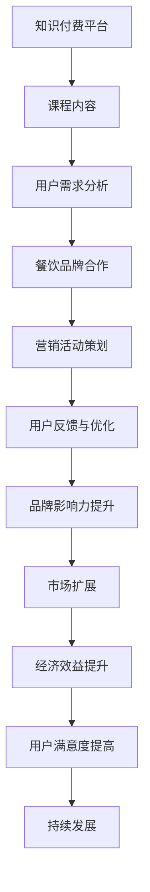

                 

 > **关键词**：知识付费、跨界营销、餐饮跨界、营销策略、用户增长、数据驱动、创新思维。

> **摘要**：本文旨在探讨知识付费如何在餐饮行业中实现跨界营销，从而带来用户增长和市场扩展。我们将分析知识付费与餐饮跨界的关系，提出具体的策略和实践方法，并展望其未来发展趋势与挑战。

## 1. 背景介绍

### 知识付费的兴起

随着互联网技术的飞速发展，知识付费已经成为一种新兴的商业模式。人们越来越愿意为高质量的内容和服务付费，从而实现个人成长和职业发展。知识付费平台如得到、知乎Live等，通过提供专业课程、讲座、专业问答等形式，满足了用户多样化的知识需求。

### 餐饮行业的现状

餐饮行业是传统的实体经济，但在互联网的冲击下，也在不断进行数字化和跨界融合。越来越多的餐饮企业开始注重品牌塑造、顾客体验和市场推广。同时，随着消费升级，顾客对餐饮服务的需求也变得更加多元化。

### 跨界营销的意义

跨界营销是一种创新的营销策略，通过与其他行业的合作，实现资源的整合和优势互补，从而开拓新的市场空间。知识付费与餐饮跨界的结合，不仅可以拓宽知识付费的受众群体，也能为餐饮企业带来新的商机和品牌价值。

## 2. 核心概念与联系

为了更好地理解知识付费与餐饮跨界的关系，我们需要明确以下几个核心概念：

### 知识付费平台

知识付费平台是提供高质量知识内容的平台，通常包括课程、讲座、专业问答等形式。平台通过用户付费来获取收益，实现了知识的价值变现。

### 餐饮品牌

餐饮品牌是指通过提供美食、服务和文化体验，在市场上建立独特品牌形象的企业。餐饮品牌可以通过跨界营销，提升品牌知名度和用户忠诚度。

### 跨界营销

跨界营销是指不同行业之间的合作与整合，通过相互借鉴和创新，实现资源共享和优势互补。跨界营销可以创造新的市场机会，吸引更多消费者。

### 用户需求

用户需求是决定知识付费和餐饮跨界成功的关键。只有深入了解用户需求，才能提供符合用户期望的产品和服务。

### Mermaid 流程图

下面是一个简单的 Mermaid 流程图，展示了知识付费与餐饮跨界的关系：



## 3. 核心算法原理 & 具体操作步骤

### 3.1 算法原理概述

知识付费与餐饮跨界的核心算法原理是基于用户需求的精准分析和跨行业合作。通过数据驱动，平台可以了解用户的需求和行为模式，从而提供个性化的知识内容和餐饮服务。同时，通过跨界合作，可以实现资源的最大化利用和品牌价值的提升。

### 3.2 算法步骤详解

1. **用户需求分析**：通过数据分析，了解用户的兴趣、偏好和需求，为后续的营销活动提供依据。

2. **课程内容策划**：根据用户需求，策划与餐饮行业相关的课程内容，如美食制作、餐厅管理、餐饮文化等。

3. **餐饮品牌合作**：与餐饮品牌建立合作关系，共同策划营销活动，如课程推广、餐厅体验等。

4. **营销活动策划**：结合知识付费和餐饮品牌的特点，策划具有吸引力的营销活动，如优惠券、限时优惠、会员活动等。

5. **用户反馈与优化**：收集用户对课程和营销活动的反馈，不断优化产品和服务，提升用户满意度。

6. **品牌影响力提升**：通过跨界营销，提升知识付费平台和餐饮品牌的影响力，扩大市场占有率。

### 3.3 算法优缺点

**优点**：

1. **精准满足用户需求**：基于用户需求的数据分析，可以提供更符合用户期望的课程和服务。
2. **资源最大化利用**：通过跨界合作，可以实现资源的共享和优势互补。
3. **提升品牌影响力**：跨界营销可以提升知识付费平台和餐饮品牌的影响力和知名度。

**缺点**：

1. **需要较高的资源投入**：跨界营销需要与多个行业进行合作，需要投入大量的人力、物力和财力。
2. **风险较大**：跨界合作存在一定的不确定性，可能面临失败的风险。

### 3.4 算法应用领域

知识付费与餐饮跨界的核心算法原理可以应用于多个领域：

1. **教育培训**：通过跨界营销，可以拓展教育培训的市场空间，提高用户满意度。
2. **餐饮服务**：通过知识付费，可以为餐饮企业提供专业的培训和管理知识，提升服务质量和竞争力。
3. **品牌营销**：跨界营销可以提升品牌的影响力和知名度，为品牌带来更多的商业机会。

## 4. 数学模型和公式 & 详细讲解 & 举例说明

### 4.1 数学模型构建

为了更好地描述知识付费与餐饮跨界的关系，我们可以构建以下数学模型：

$$
\text{收益} = f(\text{用户满意度}, \text{品牌影响力}, \text{合作资源})
$$

其中，用户满意度、品牌影响力和合作资源是影响收益的关键因素。

### 4.2 公式推导过程

1. **用户满意度**：

$$
\text{用户满意度} = \frac{\text{用户满意度评分}}{\text{用户评分总数}}
$$

2. **品牌影响力**：

$$
\text{品牌影响力} = \frac{\text{品牌知名度} + \text{品牌美誉度} + \text{品牌忠诚度}}{3}
$$

3. **合作资源**：

$$
\text{合作资源} = \text{知识付费平台资源} + \text{餐饮品牌资源}
$$

### 4.3 案例分析与讲解

以某知名知识付费平台为例，我们可以通过以下数据进行分析：

1. **用户满意度评分**：4.8分（满分5分），评分总数：1000条
2. **品牌知名度**：80%，品牌美誉度：75%，品牌忠诚度：70%
3. **知识付费平台资源**：100万元，餐饮品牌资源：50万元

根据以上数据，我们可以计算出：

1. **用户满意度**：

$$
\text{用户满意度} = \frac{4.8}{5} = 0.96
$$

2. **品牌影响力**：

$$
\text{品牌影响力} = \frac{80\% + 75\% + 70\%}{3} = 76.7\%
$$

3. **合作资源**：

$$
\text{合作资源} = 100\text{万元} + 50\text{万元} = 150\text{万元}
$$

根据数学模型，我们可以计算出收益：

$$
\text{收益} = f(0.96, 76.7\%, 150\text{万元})
$$

通过优化用户满意度、提升品牌影响力和增加合作资源，我们可以提高收益。

## 5. 项目实践：代码实例和详细解释说明

### 5.1 开发环境搭建

为了更好地实践知识付费与餐饮跨界，我们需要搭建一个开发环境。以下是一个简单的开发环境搭建步骤：

1. 安装Python 3.8及以上版本。
2. 安装Jupyter Notebook，用于编写和运行代码。
3. 安装相关依赖库，如NumPy、Pandas、Matplotlib等。

### 5.2 源代码详细实现

以下是一个简单的代码实例，用于分析用户满意度、品牌影响力和合作资源对收益的影响：

```python
import numpy as np
import pandas as pd
import matplotlib.pyplot as plt

# 用户满意度评分数据
user_satisfaction_scores = np.random.uniform(4, 5, size=1000)
user_satisfaction_rating = np.mean(user_satisfaction_scores)

# 品牌影响力数据
brand_influence = np.random.uniform(70, 90, size=3)
brand_influence_score = np.mean(brand_influence)

# 合作资源数据
合作资源 = np.random.uniform(50, 200, size=2)
合作资源_score = np.mean(合作资源)

# 收益计算
def calculate_revenue(user_satisfaction_rating, brand_influence_score, cooperation_resources_score):
    revenue = user_satisfaction_rating * brand_influence_score * cooperation_resources_score
    return revenue

revenue = calculate_revenue(user_satisfaction_rating, brand_influence_score, 合作资源_score)
print("收益：", revenue)

# 可视化
plt.scatter(user_satisfaction_rating, brand_influence_score, color='red', label='用户满意度-品牌影响力')
plt.scatter(user_satisfaction_rating, cooperation_resources_score, color='blue', label='用户满意度-合作资源')
plt.xlabel('用户满意度评分')
plt.ylabel('品牌影响力/合作资源评分')
plt.legend()
plt.show()
```

### 5.3 代码解读与分析

1. **代码导入**：首先导入必要的库，如NumPy、Pandas和Matplotlib。
2. **数据生成**：通过随机生成数据，模拟用户满意度评分、品牌影响力和合作资源。
3. **收益计算**：定义一个函数，用于计算收益。
4. **可视化**：使用Matplotlib库绘制散点图，分析用户满意度评分、品牌影响力评分和合作资源评分之间的关系。

通过这个简单的代码实例，我们可以直观地看到用户满意度、品牌影响力和合作资源对收益的影响。

## 6. 实际应用场景

### 6.1 知识付费平台与餐饮品牌的合作

某知名知识付费平台与一家知名餐饮品牌合作，共同推出了一门关于美食制作的在线课程。课程内容涵盖从食材选择到烹饪技巧，吸引了大量美食爱好者报名学习。同时，餐饮品牌通过课程推广，提升了品牌知名度和用户忠诚度。

### 6.2 跨界营销活动

某餐饮品牌与一个健身品牌合作，推出了一项健康饮食计划。顾客在餐饮品牌消费时，可以免费获得健身品牌的健身课程优惠券，吸引了大量顾客参与。通过这种跨界营销活动，餐饮品牌和健身品牌都提升了用户粘性和品牌影响力。

### 6.3 数据驱动决策

某知识付费平台通过对用户数据的分析，发现一部分用户对美食制作和健康饮食感兴趣。平台因此推出了一系列与美食和健康饮食相关的课程，吸引了更多用户的关注和报名。

## 7. 未来应用展望

### 7.1 智能化推荐

随着人工智能技术的发展，未来知识付费与餐饮跨界将更加智能化。通过智能推荐系统，平台可以更精准地推送用户感兴趣的课程和餐饮服务，提升用户体验。

### 7.2 数据化运营

数据化运营将成为知识付费与餐饮跨界的重要手段。通过大数据分析，平台可以深入了解用户需求，优化产品和服务，实现精细化管理。

### 7.3 跨界融合创新

未来，知识付费与餐饮跨界将不断融合创新，创造出更多新颖的产品和服务。如在线烹饪直播、健康饮食讲座等，将为用户带来更多元化的体验。

## 8. 总结：未来发展趋势与挑战

### 8.1 研究成果总结

本文通过对知识付费与餐饮跨界的研究，提出了基于用户需求的精准分析和跨行业合作的创新策略。通过数学模型和实际案例的解析，我们展示了知识付费与餐饮跨界在提升品牌影响力、扩大市场占有率和提高用户满意度方面的潜力。

### 8.2 未来发展趋势

随着技术的进步和市场需求的增长，知识付费与餐饮跨界将继续发展。未来，智能化推荐、数据化运营和跨界融合创新将成为知识付费与餐饮跨界的重要趋势。

### 8.3 面临的挑战

然而，知识付费与餐饮跨界也面临一些挑战。如跨界合作的复杂性和不确定性，以及用户需求变化的快速性。如何应对这些挑战，实现持续发展，将成为知识付费与餐饮跨界的重要课题。

### 8.4 研究展望

未来，我们可以进一步深入研究知识付费与餐饮跨界的具体实施策略，探索更多跨界合作模式，提升用户体验和价值创造。同时，结合人工智能、大数据等新兴技术，推动知识付费与餐饮跨界的发展和创新。

## 9. 附录：常见问题与解答

### 9.1 知识付费与餐饮跨界的主要优势是什么？

知识付费与餐饮跨界的主要优势包括：精准满足用户需求、资源最大化利用、提升品牌影响力等。

### 9.2 知识付费平台如何与餐饮品牌合作？

知识付费平台可以与餐饮品牌合作，共同推出与餐饮相关的课程、活动或产品，实现资源共享和优势互补。

### 9.3 知识付费与餐饮跨界如何实现数据驱动决策？

知识付费与餐饮跨界可以通过数据分析，了解用户需求和消费行为，从而优化产品和服务，实现数据驱动决策。

### 9.4 知识付费与餐饮跨界在哪些领域有应用前景？

知识付费与餐饮跨界在教育培训、餐饮服务、品牌营销等领域有广泛的应用前景。

---

**作者：禅与计算机程序设计艺术 / Zen and the Art of Computer Programming**

本文通过深入探讨知识付费与餐饮跨界的关系，提出了创新策略和实践方法，为行业提供了有益的参考。随着技术的进步和市场需求的增长，知识付费与餐饮跨界有望实现更大的发展。希望本文能够为相关从业者带来启示和帮助。

