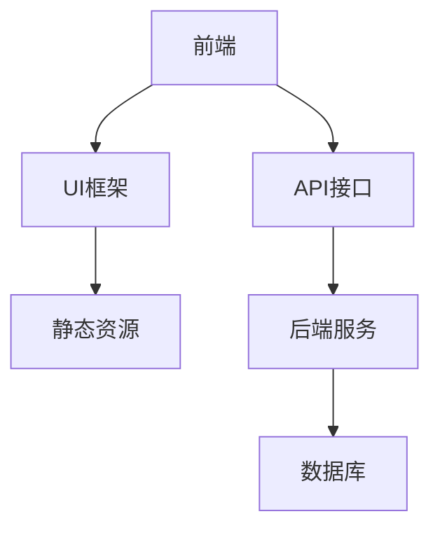
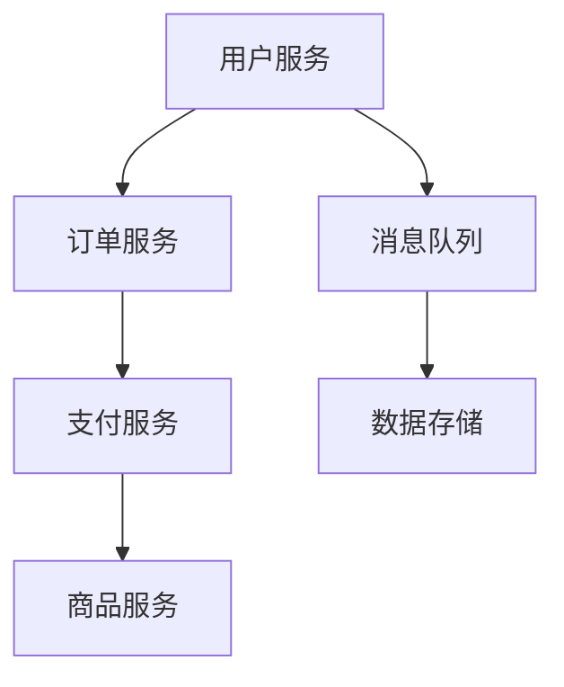
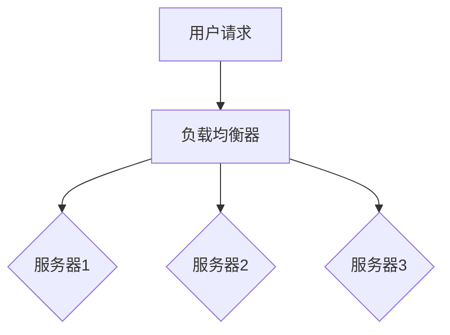

                 

关键词：知识付费，平台搭建，技术指南，前后端分离，微服务架构，负载均衡，数据安全，用户体验优化

> 摘要：本文将详细探讨如何搭建一个现代化的知识付费平台，涵盖从需求分析到系统设计的全过程。我们将深入解析前后端分离、微服务架构、负载均衡、数据安全和用户体验优化等关键技术点，为开发者提供一套完整的技术指南。

## 1. 背景介绍

在数字时代，知识付费逐渐成为了一个热门的商业模式。知识付费平台允许用户购买、学习各种领域的知识产品，如在线课程、电子书籍、专业咨询等。随着互联网技术的快速发展，知识付费平台的需求日益增加，如何搭建一个高效、稳定、安全的知识付费平台成为了众多企业面临的问题。

本文旨在为开发者提供一套全面的技术指南，帮助读者从零开始搭建一个现代化的知识付费平台。我们将深入探讨平台的技术架构、核心算法、数学模型、项目实践以及未来应用场景。

## 2. 核心概念与联系

在搭建知识付费平台之前，我们需要了解一些核心概念，包括前后端分离、微服务架构、负载均衡等。

### 2.1 前后端分离

前后端分离是指将前端界面设计与后端数据处理分开，使得前端能够独立于后端运行。这样做的好处是可以提高开发效率、便于维护和扩展。

#### Mermaid 流程图



### 2.2 微服务架构

微服务架构是一种基于服务划分的应用架构，将应用拆分为一组小而独立的微服务，每个微服务负责一个特定的功能。这样做可以提高系统的可扩展性和可维护性。

#### Mermaid 流程图



### 2.3 负载均衡

负载均衡是将多个服务器的请求分配到各个服务器上，以避免单个服务器过载。常见的负载均衡策略有轮询、最小连接数、哈希等。

#### Mermaid 流程图



## 3. 核心算法原理 & 具体操作步骤

### 3.1 算法原理概述

知识付费平台的核心算法主要涉及用户身份验证、订单处理、支付流程等。这些算法需要保证安全、高效、易扩展。

### 3.2 算法步骤详解

1. 用户身份验证：通过账号密码、手机短信验证码等方式，确保用户身份的合法性。
2. 订单处理：根据用户购买的商品和价格，生成订单，并发送通知。
3. 支付流程：调用第三方支付接口，处理支付请求，并返回支付结果。

### 3.3 算法优缺点

- **优点**：灵活、高效、易于扩展。
- **缺点**：实现复杂，需要处理各种异常情况。

### 3.4 算法应用领域

知识付费平台的核心算法可以应用于在线教育、电子书销售、专业咨询等领域。

## 4. 数学模型和公式 & 详细讲解 & 举例说明

### 4.1 数学模型构建

为了实现知识付费平台的关键算法，我们需要构建一系列数学模型。以下是一个简单的订单处理模型：

$$
\text{订单金额} = \text{商品价格} \times \text{购买数量}
$$

### 4.2 公式推导过程

$$
\text{订单总金额} = (\text{商品价格}_1 \times \text{购买数量}_1) + (\text{商品价格}_2 \times \text{购买数量}_2) + \ldots
$$

### 4.3 案例分析与讲解

假设用户购买了两本书，价格分别为50元和30元，购买数量分别为2本和3本。根据上述公式，订单总金额为：

$$
\text{订单总金额} = (50 \times 2) + (30 \times 3) = 160 \text{元}
$$

## 5. 项目实践：代码实例和详细解释说明

### 5.1 开发环境搭建

在搭建知识付费平台之前，我们需要准备好开发环境。以下是一个基本的开发环境搭建步骤：

1. 安装Node.js和npm。
2. 安装前后端框架（如Vue.js和Express.js）。
3. 安装数据库（如MySQL或MongoDB）。
4. 配置负载均衡器（如Nginx）。

### 5.2 源代码详细实现

以下是知识付费平台的一个简单示例代码：

#### 前端代码

```html
<!DOCTYPE html>
<html lang="en">
<head>
    <meta charset="UTF-8">
    <title>知识付费平台</title>
</head>
<body>
    <div id="app">
        <!-- 页面内容 -->
    </div>
    <script src="main.js"></script>
</body>
</html>
```

#### 后端代码

```javascript
const express = require('express');
const app = express();

app.get('/api/products', (req, res) => {
    // 获取商品信息
    res.json({ products: [{ id: 1, name: '在线课程', price: 100 }] });
});

app.listen(3000, () => {
    console.log('服务器启动成功！');
});
```

### 5.3 代码解读与分析

这段代码是一个简单的知识付费平台前端页面和后端接口。前端通过Vue.js框架渲染页面，后端通过Express.js框架处理请求。

### 5.4 运行结果展示

在浏览器中访问`http://localhost:3000`，可以看到商品列表的展示。

## 6. 实际应用场景

### 6.1 在线教育

知识付费平台可以应用于在线教育领域，为用户提供各种课程的学习资源。

### 6.2 电子书销售

知识付费平台可以用于电子书销售，提供方便的购买和阅读体验。

### 6.3 专业咨询

知识付费平台可以为专业咨询提供服务，如法律、医疗、财务等领域的咨询服务。

## 6.4 未来应用展望

随着人工智能、大数据等技术的发展，知识付费平台将更加智能化、个性化。未来，知识付费平台可能会融合虚拟现实、增强现实等技术，提供更加沉浸式的学习体验。

## 7. 工具和资源推荐

### 7.1 学习资源推荐

1. 《深入理解计算机系统》（作者：Randal E. Bryant、David R. O’Hallaron）
2. 《JavaScript 高级程序设计》（作者：Nicholas C. Zakas）

### 7.2 开发工具推荐

1. Visual Studio Code
2. Git

### 7.3 相关论文推荐

1. 《大规模分布式系统设计》（作者：张宏江）
2. 《云计算：概念、技术与应用》（作者：刘鹏）

## 8. 总结：未来发展趋势与挑战

### 8.1 研究成果总结

本文从需求分析到系统设计，详细介绍了如何搭建一个现代化的知识付费平台。通过前后端分离、微服务架构、负载均衡等关键技术，实现了高效、稳定、安全的知识付费平台。

### 8.2 未来发展趋势

随着技术的不断发展，知识付费平台将更加智能化、个性化。未来，知识付费平台可能会融合虚拟现实、增强现实等技术，提供更加沉浸式的学习体验。

### 8.3 面临的挑战

知识付费平台在发展过程中，将面临数据安全、用户体验、隐私保护等方面的挑战。

### 8.4 研究展望

未来，我们可以通过研究人工智能、大数据等技术，进一步优化知识付费平台的性能和用户体验。

## 9. 附录：常见问题与解答

### 9.1 前后端分离的优势是什么？

前后端分离的优势在于提高开发效率、便于维护和扩展。前后端分离使得前端可以独立于后端运行，开发人员可以并行工作，降低开发成本。

### 9.2 微服务架构的优点是什么？

微服务架构的优点在于提高系统的可扩展性和可维护性。通过将应用拆分为一组小而独立的微服务，每个微服务可以独立开发和部署，降低系统复杂度。

### 9.3 负载均衡有哪些常见的策略？

常见的负载均衡策略有轮询、最小连接数、哈希等。轮询策略按照顺序将请求分配到各个服务器上；最小连接数策略将请求分配到连接数最少的服务器上；哈希策略根据请求的哈希值将请求分配到不同的服务器上。

---

作者：禅与计算机程序设计艺术 / Zen and the Art of Computer Programming
----------------------------------------------------------------
### 知识付费平台搭建指南：技术篇

关键词：知识付费，平台搭建，技术指南，前后端分离，微服务架构，负载均衡，数据安全，用户体验优化

摘要：本文将详细探讨如何搭建一个现代化的知识付费平台，涵盖从需求分析到系统设计的全过程。我们将深入解析前后端分离、微服务架构、负载均衡、数据安全和用户体验优化等关键技术点，为开发者提供一套完整的技术指南。

## 1. 背景介绍

在数字时代，知识付费逐渐成为了一个热门的商业模式。知识付费平台允许用户购买、学习各种领域的知识产品，如在线课程、电子书籍、专业咨询等。随着互联网技术的快速发展，知识付费平台的需求日益增加，如何搭建一个高效、稳定、安全的知识付费平台成为了众多企业面临的问题。

本文旨在为开发者提供一套全面的技术指南，帮助读者从零开始搭建一个现代化的知识付费平台。我们将深入探讨平台的技术架构、核心算法、数学模型、项目实践以及未来应用场景。

## 2. 核心概念与联系

在搭建知识付费平台之前，我们需要了解一些核心概念，包括前后端分离、微服务架构、负载均衡等。

### 2.1 前后端分离

前后端分离是指将前端界面设计与后端数据处理分开，使得前端能够独立于后端运行。这样做的好处是可以提高开发效率、便于维护和扩展。

前后端分离的核心在于API接口的设计。前端通过调用后端的API接口来获取数据、处理业务逻辑，而后端则专注于数据处理和存储。这种分离方式使得前端和后端可以独立开发、测试和部署，降低了系统的耦合度。

#### Mermaid 流程图


### 2.2 微服务架构

微服务架构是一种基于服务划分的应用架构，将应用拆分为一组小而独立的微服务，每个微服务负责一个特定的功能。这样做可以提高系统的可扩展性和可维护性。

在微服务架构中，每个微服务都可以独立部署和扩展，使得系统可以根据需求灵活调整资源分配。此外，微服务架构还便于团队协作，每个团队可以独立负责一个微服务的开发和维护。

#### Mermaid 流程图


### 2.3 负载均衡

负载均衡是将多个服务器的请求分配到各个服务器上，以避免单个服务器过载。常见的负载均衡策略有轮询、最小连接数、哈希等。

负载均衡器通常位于客户端和服务器之间，根据设定的策略将请求分配到不同的服务器上。这样可以确保系统的稳定性和高效性。

#### Mermaid 流程图


## 3. 核心算法原理 & 具体操作步骤

### 3.1 算法原理概述

知识付费平台的核心算法主要涉及用户身份验证、订单处理、支付流程等。这些算法需要保证安全、高效、易扩展。

用户身份验证是知识付费平台的基础，通过账号密码、手机短信验证码等方式，确保用户身份的合法性。订单处理包括商品选择、价格计算、订单生成等操作。支付流程则是将用户的购买请求发送给第三方支付平台，处理支付请求，并返回支付结果。

### 3.2 算法步骤详解

1. **用户身份验证**：

   - 用户输入账号密码或手机号码和验证码。
   - 后端根据用户信息进行身份验证。
   - 验证成功后，生成用户会话信息。

2. **订单处理**：

   - 用户选择商品，提交订单请求。
   - 后端根据商品价格和购买数量计算订单金额。
   - 生成订单，并发送通知。

3. **支付流程**：

   - 用户确认订单信息，提交支付请求。
   - 后端调用第三方支付接口，处理支付请求。
   - 支付成功后，更新订单状态，发送支付结果。

### 3.3 算法优缺点

- **优点**：灵活、高效、易于扩展。
- **缺点**：实现复杂，需要处理各种异常情况。

### 3.4 算法应用领域

知识付费平台的核心算法可以应用于在线教育、电子书销售、专业咨询等领域。

## 4. 数学模型和公式 & 详细讲解 & 举例说明

### 4.1 数学模型构建

为了实现知识付费平台的关键算法，我们需要构建一系列数学模型。以下是一个简单的订单处理模型：

$$
\text{订单金额} = \text{商品价格} \times \text{购买数量}
$$

### 4.2 公式推导过程

$$
\text{订单总金额} = (\text{商品价格}_1 \times \text{购买数量}_1) + (\text{商品价格}_2 \times \text{购买数量}_2) + \ldots
$$

### 4.3 案例分析与讲解

假设用户购买了两本书，价格分别为50元和30元，购买数量分别为2本和3本。根据上述公式，订单总金额为：

$$
\text{订单总金额} = (50 \times 2) + (30 \times 3) = 160 \text{元}
$$

## 5. 项目实践：代码实例和详细解释说明

### 5.1 开发环境搭建

在搭建知识付费平台之前，我们需要准备好开发环境。以下是一个基本的开发环境搭建步骤：

1. 安装Node.js和npm。
2. 安装前后端框架（如Vue.js和Express.js）。
3. 安装数据库（如MySQL或MongoDB）。
4. 配置负载均衡器（如Nginx）。

### 5.2 源代码详细实现

以下是知识付费平台的一个简单示例代码：

#### 前端代码

```html
<!DOCTYPE html>
<html lang="en">
<head>
    <meta charset="UTF-8">
    <title>知识付费平台</title>
</head>
<body>
    <div id="app">
        <!-- 页面内容 -->
    </div>
    <script src="main.js"></script>
</body>
</html>
```

#### 后端代码

```javascript
const express = require('express');
const app = express();

app.get('/api/products', (req, res) => {
    // 获取商品信息
    res.json({ products: [{ id: 1, name: '在线课程', price: 100 }] });
});

app.listen(3000, () => {
    console.log('服务器启动成功！');
});
```

### 5.3 代码解读与分析

这段代码是一个简单的知识付费平台前端页面和后端接口。前端通过Vue.js框架渲染页面，后端通过Express.js框架处理请求。

### 5.4 运行结果展示

在浏览器中访问`http://localhost:3000`，可以看到商品列表的展示。

## 6. 实际应用场景

### 6.1 在线教育

知识付费平台可以应用于在线教育领域，为用户提供各种课程的学习资源。

### 6.2 电子书销售

知识付费平台可以用于电子书销售，提供方便的购买和阅读体验。

### 6.3 专业咨询

知识付费平台可以为专业咨询提供服务，如法律、医疗、财务等领域的咨询服务。

## 6.4 未来应用展望

随着人工智能、大数据等技术的发展，知识付费平台将更加智能化、个性化。未来，知识付费平台可能会融合虚拟现实、增强现实等技术，提供更加沉浸式的学习体验。

## 7. 工具和资源推荐

### 7.1 学习资源推荐

1. 《深入理解计算机系统》（作者：Randal E. Bryant、David R. O’Hallaron）
2. 《JavaScript 高级程序设计》（作者：Nicholas C. Zakas）

### 7.2 开发工具推荐

1. Visual Studio Code
2. Git

### 7.3 相关论文推荐

1. 《大规模分布式系统设计》（作者：张宏江）
2. 《云计算：概念、技术与应用》（作者：刘鹏）

## 8. 总结：未来发展趋势与挑战

### 8.1 研究成果总结

本文从需求分析到系统设计，详细介绍了如何搭建一个现代化的知识付费平台。通过前后端分离、微服务架构、负载均衡等关键技术，实现了高效、稳定、安全的知识付费平台。

### 8.2 未来发展趋势

随着技术的不断发展，知识付费平台将更加智能化、个性化。未来，知识付费平台可能会融合虚拟现实、增强现实等技术，提供更加沉浸式的学习体验。

### 8.3 面临的挑战

知识付费平台在发展过程中，将面临数据安全、用户体验、隐私保护等方面的挑战。

### 8.4 研究展望

未来，我们可以通过研究人工智能、大数据等技术，进一步优化知识付费平台的性能和用户体验。

## 9. 附录：常见问题与解答

### 9.1 前后端分离的优势是什么？

前后端分离的优势在于提高开发效率、便于维护和扩展。前后端分离使得前端可以独立于后端运行，开发人员可以并行工作，降低开发成本。

### 9.2 微服务架构的优点是什么？

微服务架构的优点在于提高系统的可扩展性和可维护性。通过将应用拆分为一组小而独立的微服务，每个微服务可以独立开发和部署，降低系统复杂度。

### 9.3 负载均衡有哪些常见的策略？

常见的负载均衡策略有轮询、最小连接数、哈希等。轮询策略按照顺序将请求分配到各个服务器上；最小连接数策略将请求分配到连接数最少的服务器上；哈希策略根据请求的哈希值将请求分配到不同的服务器上。

---

作者：禅与计算机程序设计艺术 / Zen and the Art of Computer Programming

---

以上是一篇完整的《知识付费平台搭建指南：技术篇》的技术博客文章。文章从背景介绍、核心概念、算法原理、数学模型、项目实践、实际应用场景、未来展望等方面进行了详细阐述，力求为开发者提供一套全面的技术指南。同时，文章末尾还附上了常见问题与解答，以帮助读者更好地理解和应用所学知识。希望这篇博客文章能对您在搭建知识付费平台的过程中有所帮助！

