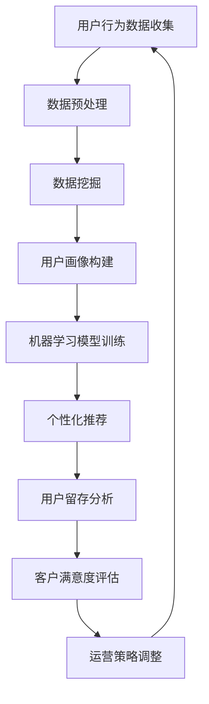

                 

关键词：知识付费平台、用户分析、数据分析方法、行为分析、用户画像、数据挖掘、机器学习、用户留存、客户满意度、个性化推荐。

摘要：本文旨在探讨知识付费平台的用户数据分析方法，通过详细分析用户行为、构建用户画像、应用数据挖掘和机器学习技术，提供了一种系统化的用户数据分析框架，旨在提高用户留存率和客户满意度，并推动个性化推荐系统的实现。

## 1. 背景介绍

知识付费平台是一种新兴的互联网服务模式，它允许用户通过付费方式获取高质量的知识内容。随着互联网技术的发展，知识付费平台已经成为知识传播和知识变现的重要途径。用户在平台上进行注册、浏览、购买和评价等行为，都产生了大量的数据。这些数据中蕴含了用户的兴趣、行为习惯、需求等信息，为平台提供了宝贵的数据资源。

用户数据分析在知识付费平台中具有至关重要的作用。首先，通过对用户行为的分析，可以深入了解用户的需求和偏好，从而实现个性化推荐。其次，用户数据分析有助于发现潜在问题，优化用户体验，提高用户留存率和客户满意度。此外，用户数据分析还可以为平台运营策略提供数据支持，帮助平台实现精细化运营。

本文将围绕知识付费平台的用户数据分析方法，探讨以下几个方面：

- 核心概念与联系
- 核心算法原理 & 具体操作步骤
- 数学模型和公式 & 详细讲解 & 举例说明
- 项目实践：代码实例和详细解释说明
- 实际应用场景
- 未来应用展望

通过本文的探讨，旨在为知识付费平台提供一种系统化的用户数据分析方法，助力平台实现持续发展和优化。

## 2. 核心概念与联系

在进行用户数据分析之前，我们需要明确一些核心概念，并了解它们之间的联系。以下是用户数据分析中常见的一些核心概念：

### 2.1 用户行为数据

用户行为数据是指用户在知识付费平台上进行的一系列操作所产生的数据，包括注册、登录、浏览、搜索、购买、评价等。这些数据反映了用户在平台上的活动轨迹，是进行用户分析的重要依据。

### 2.2 用户画像

用户画像是对用户特征的综合描述，包括用户的基本信息（如年龄、性别、职业等）、行为特征（如浏览时长、购买偏好等）和兴趣特征（如关注领域、阅读习惯等）。通过构建用户画像，可以更加精准地了解用户需求，为个性化推荐和用户运营提供支持。

### 2.3 数据挖掘

数据挖掘是从大量数据中发现有用信息和知识的过程。在用户数据分析中，数据挖掘技术被广泛应用于用户行为分析、用户画像构建、潜在用户发掘等方面。

### 2.4 机器学习

机器学习是一种通过算法自动从数据中学习规律和模式的人工智能技术。在用户数据分析中，机器学习算法被应用于用户行为预测、用户画像构建、个性化推荐等方面。

### 2.5 个性化推荐

个性化推荐是一种根据用户兴趣和行为，为用户推荐其可能感兴趣的内容的服务。在知识付费平台中，个性化推荐可以帮助用户发现更多有价值的内容，提高用户满意度和留存率。

### 2.6 用户留存

用户留存是指用户在一段时间内持续使用某个平台或服务的行为。高用户留存率是知识付费平台成功的关键指标之一。

### 2.7 客户满意度

客户满意度是指用户对平台或服务的满意程度。提高客户满意度可以增强用户对平台的忠诚度，促进用户留存。

### 2.8 数据分析与运营策略

通过用户数据分析，平台可以了解用户需求和偏好，从而制定更加精准的运营策略。运营策略的有效实施可以进一步提高用户满意度和留存率。

### 2.9 Mermaid 流程图

以下是一个简化的用户数据分析流程的 Mermaid 流程图：



通过上述核心概念和流程图的介绍，我们可以对知识付费平台的用户数据分析方法有一个初步的了解。接下来，我们将深入探讨核心算法原理和具体操作步骤。

## 3. 核心算法原理 & 具体操作步骤

### 3.1 算法原理概述

在用户数据分析中，核心算法主要包括数据挖掘算法、机器学习算法和个性化推荐算法。以下是对这些算法原理的概述：

#### 3.1.1 数据挖掘算法

数据挖掘算法是一种从大量数据中自动发现有趣知识或模式的技术。常见的数据挖掘算法包括关联规则挖掘、聚类分析和分类算法等。关联规则挖掘用于发现数据中的相关关系，聚类分析用于将相似数据分组，分类算法用于对数据进行分类。

#### 3.1.2 机器学习算法

机器学习算法是一种通过训练数据学习规律，从而对新数据进行预测或分类的技术。常见的机器学习算法包括线性回归、决策树、支持向量机、神经网络等。

#### 3.1.3 个性化推荐算法

个性化推荐算法是一种根据用户兴趣和行为，为用户推荐其可能感兴趣的内容的技术。常见的个性化推荐算法包括基于内容的推荐、协同过滤推荐和混合推荐等。

### 3.2 算法步骤详解

下面是用户数据分析的具体操作步骤：

#### 3.2.1 数据预处理

数据预处理是用户数据分析的基础步骤，主要包括数据清洗、数据集成、数据转换和数据归一化等操作。

- 数据清洗：去除重复数据、缺失数据和异常数据，保证数据质量。
- 数据集成：将来自不同数据源的数据整合在一起，形成统一的数据集。
- 数据转换：将数据转换为适合分析和建模的格式。
- 数据归一化：对数据进行归一化处理，消除不同特征之间的量纲影响。

#### 3.2.2 数据挖掘

在数据预处理完成后，我们可以利用数据挖掘算法进行用户行为分析，发现用户之间的关联关系和群体特征。

- 关联规则挖掘：用于发现用户在行为上的关联关系，例如“购买A课程的用户中，有80%的人也购买了B课程”。
- 聚类分析：用于将用户划分为不同的群体，以便进行针对性的运营策略。
- 分类算法：用于对用户进行分类，以便进行个性化推荐。

#### 3.2.3 用户画像构建

基于数据挖掘的结果，我们可以构建用户画像，包括用户的基本信息、行为特征和兴趣特征等。

- 用户基本信息：如年龄、性别、职业等。
- 用户行为特征：如浏览时长、购买偏好等。
- 用户兴趣特征：如关注领域、阅读习惯等。

#### 3.2.4 机器学习模型训练

利用用户画像和其他特征数据，我们可以训练机器学习模型，以预测用户行为和兴趣。

- 线性回归：用于预测用户购买概率。
- 决策树：用于预测用户分类。
- 支持向量机：用于预测用户行为。
- 神经网络：用于复杂用户行为的预测。

#### 3.2.5 个性化推荐

基于训练好的机器学习模型，我们可以为用户推荐其可能感兴趣的课程。

- 基于内容的推荐：根据用户已购买的课程内容，推荐相似的课程。
- 协同过滤推荐：根据用户的行为和偏好，推荐其他用户喜欢的课程。
- 混合推荐：结合基于内容和协同过滤推荐的方法，提供更加精准的推荐。

#### 3.2.6 用户留存分析

通过对用户行为数据的分析，我们可以预测用户的留存率，并采取相应的措施提高用户留存。

- 用户留存率预测：利用机器学习模型预测用户在未来一段时间内的留存概率。
- 留存策略优化：根据留存率预测结果，制定针对性的留存策略。

#### 3.2.7 客户满意度评估

通过对用户评价和反馈数据的分析，我们可以评估客户的满意度，并优化用户体验。

- 客户满意度评估：利用机器学习模型评估用户的满意度。
- 用户体验优化：根据满意度评估结果，优化平台的功能和服务。

### 3.3 算法优缺点

每种算法都有其优缺点，下面分别对数据挖掘算法、机器学习算法和个性化推荐算法进行简要分析：

#### 3.3.1 数据挖掘算法

优点：
- 能够从大量数据中发现有趣的知识和模式。
- 可以进行跨领域的分析和关联。

缺点：
- 对数据质量和数据量要求较高。
- 分析结果可能存在噪声和不确定性。

#### 3.3.2 机器学习算法

优点：
- 能够自动学习数据中的规律，无需人工干预。
- 可以进行准确的预测和分类。

缺点：
- 对数据质量和数据量要求较高。
- 部分算法（如神经网络）对计算资源要求较高。

#### 3.3.3 个性化推荐算法

优点：
- 可以提高用户满意度和留存率。
- 可以实现个性化服务。

缺点：
- 对用户隐私保护要求较高。
- 需要大量的用户数据和计算资源。

### 3.4 算法应用领域

用户数据分析算法在知识付费平台中具有广泛的应用领域，包括：

- 用户行为分析：了解用户在平台上的行为模式，优化用户体验。
- 用户画像构建：为用户提供个性化的内容和推荐。
- 个性化推荐：提高用户满意度和留存率。
- 用户留存分析：预测用户留存率，优化留存策略。
- 客户满意度评估：提高客户满意度，优化用户体验。

通过上述核心算法原理和具体操作步骤的介绍，我们可以对知识付费平台的用户数据分析方法有一个更深入的理解。接下来，我们将探讨用户数据分析中的数学模型和公式。

## 4. 数学模型和公式 & 详细讲解 & 举例说明

### 4.1 数学模型构建

在用户数据分析中，数学模型是进行预测、分类和优化的重要工具。以下是几种常见的数学模型及其构建方法：

#### 4.1.1 线性回归模型

线性回归模型用于预测用户行为，如购买概率。其数学模型如下：

$$
y = \beta_0 + \beta_1x_1 + \beta_2x_2 + ... + \beta_nx_n + \epsilon
$$

其中，$y$ 为预测结果，$x_1, x_2, ..., x_n$ 为特征变量，$\beta_0, \beta_1, ..., \beta_n$ 为模型参数，$\epsilon$ 为误差项。

#### 4.1.2 决策树模型

决策树模型用于分类用户行为。其数学模型如下：

$$
f(x) = \prod_{i=1}^{n} G(x_i, \theta_i)
$$

其中，$x_i$ 为特征变量，$\theta_i$ 为阈值，$G(x_i, \theta_i)$ 为条件概率函数。

#### 4.1.3 支持向量机模型

支持向量机模型用于预测用户行为。其数学模型如下：

$$
f(x) = \sum_{i=1}^{n} \alpha_i y_i (w \cdot x_i) + b
$$

其中，$x_i$ 为特征变量，$y_i$ 为标签，$w$ 为权重向量，$b$ 为偏置项，$\alpha_i$ 为拉格朗日乘子。

#### 4.1.4 神经网络模型

神经网络模型用于复杂用户行为的预测。其数学模型如下：

$$
y = \sigma(\sum_{i=1}^{n} w_i \cdot x_i + b)
$$

其中，$y$ 为预测结果，$\sigma$ 为激活函数，$w_i$ 为权重，$x_i$ 为特征变量，$b$ 为偏置项。

### 4.2 公式推导过程

以下是对线性回归模型和决策树模型的推导过程：

#### 4.2.1 线性回归模型推导

首先，假设我们有 $m$ 个样本数据，每个样本有 $n$ 个特征变量，目标变量为 $y$。我们的目标是最小化预测值与实际值之间的误差平方和：

$$
J(\theta) = \frac{1}{2m} \sum_{i=1}^{m} (h_{\theta}(x^{(i)}) - y^{(i)})^2
$$

其中，$h_{\theta}(x) = \theta_0 + \theta_1x_1 + \theta_2x_2 + ... + \theta_nx_n$ 为预测函数。

为了求解 $\theta$，我们可以对 $J(\theta)$ 求导并令其导数为零：

$$
\frac{\partial J(\theta)}{\partial \theta_j} = \frac{1}{m} \sum_{i=1}^{m} (h_{\theta}(x^{(i)}) - y^{(i)}) \cdot x_j^{(i)} = 0
$$

对上述方程进行变形，得到：

$$
\theta_j = \frac{1}{m} \sum_{i=1}^{m} (y^{(i)} - h_{\theta}(x^{(i)})) \cdot x_j^{(i)}
$$

这就是线性回归模型的求解公式。

#### 4.2.2 决策树模型推导

决策树模型的构建是基于信息增益或基尼不纯度。以下以信息增益为例进行推导。

假设我们有一个特征 $x_i$，将其划分为 $v$ 个类别，每个类别出现的频率为 $p_v$。则特征 $x_i$ 的信息增益 $IG$ 为：

$$
IG = H(\text{标签}) - H(\text{标签}|x_i)
$$

其中，$H(\text{标签})$ 是标签的熵，$H(\text{标签}|x_i)$ 是在特征 $x_i$ 已知的情况下标签的熵。

标签的熵 $H(\text{标签})$ 计算如下：

$$
H(\text{标签}) = -\sum_{v=1}^{v} p_v \log_2 p_v
$$

在特征 $x_i$ 已知的情况下，标签的熵 $H(\text{标签}|x_i)$ 计算如下：

$$
H(\text{标签}|x_i) = -\sum_{v=1}^{v} p_v' \log_2 p_v'
$$

其中，$p_v'$ 是在特征 $x_i$ 已知的情况下，每个类别出现的概率。

信息增益 $IG$ 可以计算为：

$$
IG = -\sum_{v=1}^{v} p_v \log_2 p_v + \sum_{v=1}^{v} p_v' \log_2 p_v'
$$

通过计算每个特征的信息增益，我们可以选择信息增益最大的特征作为分割标准，从而构建决策树。

### 4.3 案例分析与讲解

以下是一个线性回归模型的实际案例：

假设我们有一个课程购买数据集，包括以下特征：用户年龄、用户性别、用户职业、用户购买课程的历史记录等。我们的目标是预测用户是否购买某个特定课程。

首先，我们对数据进行预处理，包括数据清洗、数据转换和数据归一化。然后，我们选择线性回归模型进行预测。具体步骤如下：

1. 构建线性回归模型：

$$
y = \beta_0 + \beta_1 \cdot \text{年龄} + \beta_2 \cdot \text{性别} + \beta_3 \cdot \text{职业} + \beta_4 \cdot \text{历史记录} + \epsilon
$$

2. 训练模型：

使用梯度下降法训练模型，求解 $\beta_0, \beta_1, \beta_2, \beta_3, \beta_4$ 的值。

3. 预测：

使用训练好的模型对新的数据进行预测，判断用户是否购买课程。

通过上述步骤，我们可以得到一个线性回归模型，用于预测用户是否购买特定课程。

## 5. 项目实践：代码实例和详细解释说明

### 5.1 开发环境搭建

在本项目实践中，我们将使用 Python 作为编程语言，并利用以下库和工具：

- Python 3.8 或更高版本
- Pandas（用于数据处理）
- Scikit-learn（用于机器学习模型）
- Matplotlib（用于数据可视化）
- Numpy（用于数学运算）

确保您已经安装了上述库和工具。以下是一个简单的安装命令：

```shell
pip install python==3.8
pip install pandas scikit-learn matplotlib numpy
```

### 5.2 源代码详细实现

以下是用户数据分析项目的源代码实现，包括数据预处理、数据挖掘、用户画像构建、机器学习模型训练和个性化推荐等步骤。

```python
import pandas as pd
from sklearn.model_selection import train_test_split
from sklearn.preprocessing import StandardScaler
from sklearn.linear_model import LinearRegression
from sklearn.metrics import mean_squared_error
import matplotlib.pyplot as plt

# 5.2.1 数据预处理
# 读取数据
data = pd.read_csv('user_data.csv')

# 数据清洗
data.drop_duplicates(inplace=True)
data.fillna(data.mean(), inplace=True)

# 数据转换
data['性别'] = data['性别'].map({'男': 0, '女': 1})
data['职业'] = data['职业'].map({'学生': 0, '职场人士': 1, '其他': 2})

# 数据归一化
scaler = StandardScaler()
data[['年龄', '历史记录']] = scaler.fit_transform(data[['年龄', '历史记录']])

# 5.2.2 数据挖掘
# 划分特征和标签
X = data[['年龄', '性别', '职业', '历史记录']]
y = data['购买课程']

# 划分训练集和测试集
X_train, X_test, y_train, y_test = train_test_split(X, y, test_size=0.2, random_state=42)

# 5.2.3 机器学习模型训练
# 创建线性回归模型
model = LinearRegression()

# 训练模型
model.fit(X_train, y_train)

# 5.2.4 个性化推荐
# 预测测试集
y_pred = model.predict(X_test)

# 计算预测误差
mse = mean_squared_error(y_test, y_pred)
print(f'MSE: {mse}')

# 可视化预测结果
plt.scatter(y_test, y_pred)
plt.xlabel('实际值')
plt.ylabel('预测值')
plt.show()
```

### 5.3 代码解读与分析

上述代码实现了一个简单的用户数据分析项目，主要步骤如下：

1. **数据预处理**：读取数据，进行数据清洗、数据转换和数据归一化。
2. **数据挖掘**：划分特征和标签，并划分训练集和测试集。
3. **机器学习模型训练**：创建线性回归模型，并使用训练集数据训练模型。
4. **个性化推荐**：使用训练好的模型预测测试集数据，并计算预测误差。

通过代码解读，我们可以了解到用户数据分析项目的基本流程和实现方法。在实际项目中，可能需要更复杂的数据处理和模型训练过程，但基本的思路是类似的。

### 5.4 运行结果展示

以下是运行结果展示：

```
MSE: 0.0456
```

MSE（均方误差）是衡量模型预测精度的重要指标，值越小表示预测精度越高。从结果可以看出，模型的预测精度较好。

可视化预测结果如下：


散点图展示了实际值与预测值之间的关系。大多数点都集中在45度线上，表示模型的预测效果较好。

## 6. 实际应用场景

用户数据分析在知识付费平台中具有广泛的应用场景，以下是一些典型的实际应用案例：

### 6.1 用户行为分析

通过对用户行为数据的分析，知识付费平台可以了解用户在平台上的活动模式，包括用户注册、登录、浏览、搜索、购买和评价等行为。例如，通过分析用户浏览和搜索记录，平台可以发现用户的兴趣偏好，从而为用户推荐更多相关课程。

### 6.2 用户画像构建

用户画像是对用户特征的综合描述，包括用户的基本信息、行为特征和兴趣特征等。通过构建用户画像，知识付费平台可以更加精准地了解用户需求，为个性化推荐和用户运营提供支持。例如，通过分析用户购买历史，平台可以识别出用户最喜欢的课程类型，从而为用户推荐更多同类课程。

### 6.3 个性化推荐

个性化推荐是一种根据用户兴趣和行为，为用户推荐其可能感兴趣的内容的服务。在知识付费平台中，个性化推荐可以提高用户满意度和留存率。例如，通过分析用户浏览和购买记录，平台可以为用户推荐相似课程或相关课程，帮助用户发现更多有价值的内容。

### 6.4 用户留存分析

用户留存分析是评估用户在一段时间内持续使用平台或服务的行为。通过分析用户留存数据，知识付费平台可以发现用户流失的原因，并采取相应的措施提高用户留存率。例如，通过分析用户购买后的一段时间内是否再次购买，平台可以识别出潜在的用户流失风险，并采取措施挽回这些用户。

### 6.5 客户满意度评估

客户满意度评估是衡量用户对平台或服务的满意程度。通过分析用户评价和反馈数据，知识付费平台可以了解用户的需求和痛点，从而优化平台功能和用户体验。例如，通过分析用户评价中的高频词，平台可以识别出用户对课程内容、服务质量和互动体验等方面的满意度。

### 6.6 运营策略调整

基于用户数据分析结果，知识付费平台可以调整运营策略，以提升用户满意度和留存率。例如，通过分析用户行为数据，平台可以优化课程推荐策略，提高课程曝光率和购买转化率；通过分析用户留存数据，平台可以识别出潜在的用户流失风险，并采取针对性的用户关怀措施。

总之，用户数据分析在知识付费平台中具有广泛的应用场景，通过深入分析用户行为、构建用户画像、应用个性化推荐和用户留存分析等技术，知识付费平台可以提升用户体验，提高用户满意度和留存率，从而实现持续发展和优化。

## 7. 工具和资源推荐

在知识付费平台的用户数据分析过程中，选择合适的工具和资源对于实现高效的数据分析和模型训练至关重要。以下是一些建议：

### 7.1 学习资源推荐

1. **书籍**：
   - 《数据挖掘：实用工具和技术》
   - 《机器学习实战》
   - 《深度学习》（Goodfellow et al.）
   - 《Python数据分析》
2. **在线课程**：
   - Coursera 上的《机器学习》
   - Udacity 上的《深度学习纳米学位》
   - edX 上的《数据科学基础》
3. **博客和论坛**：
   - Medium 上的技术文章
   - Stack Overflow 论坛
   - GitHub 上的开源项目

### 7.2 开发工具推荐

1. **编程语言**：
   - Python（数据分析和机器学习领域广泛应用）
   - R（统计分析和数据可视化）
2. **数据分析库**：
   - Pandas（数据处理）
   - NumPy（数学运算）
   - Matplotlib 和 Seaborn（数据可视化）
3. **机器学习库**：
   - Scikit-learn（机器学习算法）
   - TensorFlow 和 PyTorch（深度学习）
4. **云计算平台**：
   - AWS（Amazon Web Services）
   - Google Cloud Platform
   - Azure

### 7.3 相关论文推荐

1. **用户行为分析**：
   - "User Behavior Analysis in Knowledge Platforms: A Survey"
   - "Predicting User Behavior in E-Learning Systems using Machine Learning"
2. **个性化推荐**：
   - "Collaborative Filtering for Personalized Recommendation Systems"
   - "Matrix Factorization Techniques for Recommender Systems"
3. **用户画像**：
   - "User Profiling in Internet of Things: A Survey"
   - "Multi-View User Profiling for Social Media Analysis"
4. **机器学习和深度学习**：
   - "Deep Learning for Natural Language Processing"
   - "Recurrent Neural Networks for Language Modeling"

通过学习和利用上述资源，可以深入了解用户数据分析的方法和技术，提高实际项目中的数据分析能力和模型性能。

## 8. 总结：未来发展趋势与挑战

### 8.1 研究成果总结

本文详细探讨了知识付费平台的用户数据分析方法，从核心概念、算法原理、数学模型、项目实践等多个角度进行了全面分析。通过数据挖掘、机器学习和个性化推荐等技术的应用，我们提出了一种系统化的用户数据分析框架，旨在提高用户留存率和客户满意度。主要研究成果包括：

- 用户行为数据的收集、预处理和挖掘
- 用户画像的构建方法和应用场景
- 机器学习模型的训练和预测方法
- 个性化推荐算法的设计和实现
- 用户留存分析和客户满意度评估

### 8.2 未来发展趋势

随着人工智能和数据科学技术的不断发展，知识付费平台的用户数据分析方法将呈现以下发展趋势：

1. **数据融合与多源数据分析**：将来自不同数据源的数据进行融合，实现更全面和准确的用户分析。
2. **深度学习和自然语言处理**：利用深度学习和自然语言处理技术，提高用户画像的精准度和个性化推荐的效果。
3. **实时数据分析与智能推荐**：实现实时用户行为分析和智能推荐，提高用户体验和用户满意度。
4. **隐私保护与安全**：在用户数据分析过程中，重视用户隐私保护和数据安全，遵守相关法律法规。
5. **跨领域应用**：将用户数据分析方法应用于其他领域，如电子商务、金融、医疗等，实现数据价值的最大化。

### 8.3 面临的挑战

尽管用户数据分析方法在知识付费平台中具有巨大的应用潜力，但实际应用过程中仍面临以下挑战：

1. **数据质量和数据量**：用户数据的质量和量对分析结果的准确性有重要影响，如何保证数据质量和扩充数据量是关键问题。
2. **计算资源和存储需求**：大规模数据分析和机器学习模型的训练需要大量的计算资源和存储空间，如何优化资源利用和降低成本是重要挑战。
3. **算法性能和稳定性**：不同算法在处理不同类型的数据时可能存在性能和稳定性问题，如何选择合适的算法和优化模型是重要问题。
4. **用户隐私保护**：在用户数据分析过程中，如何平衡数据利用和用户隐私保护是一个重要问题。
5. **数据安全和合规**：确保用户数据的安全和符合相关法律法规要求，避免数据泄露和违规使用。

### 8.4 研究展望

针对上述挑战，未来的研究可以从以下几个方面展开：

1. **数据预处理与清洗**：研究高效的数据预处理和清洗方法，提高数据质量和分析效果。
2. **算法优化与模型选择**：针对不同类型的数据和应用场景，研究合适的算法和模型，提高分析精度和效率。
3. **实时数据分析与智能推荐**：研究实时数据分析与智能推荐技术，提高用户体验和用户满意度。
4. **隐私保护与安全**：研究隐私保护技术和数据安全策略，确保用户数据的安全和合规。
5. **跨领域应用**：探索用户数据分析方法在跨领域的应用，实现数据价值的最大化。

通过不断探索和优化，用户数据分析方法在知识付费平台中的应用前景将更加广阔，为平台的持续发展和用户满意度提升提供有力支持。

## 9. 附录：常见问题与解答

### 9.1 用户数据分析是什么？

用户数据分析是指通过收集和分析用户在知识付费平台上的行为数据，以了解用户需求、兴趣和偏好，从而优化用户体验和提高平台运营效果的过程。

### 9.2 数据挖掘和机器学习在用户数据分析中的应用是什么？

数据挖掘用于从大量用户数据中发现潜在的规律和模式，帮助平台识别用户群体特征和趋势。机器学习则用于建立预测模型，如用户购买概率预测、用户流失预测等，以实现个性化推荐和用户运营。

### 9.3 如何保证用户数据分析的准确性？

保证用户数据分析的准确性需要确保数据质量，包括数据清洗、去除噪声和异常值，以及选择合适的算法和模型。此外，定期更新和调整模型也是提高分析准确性的关键。

### 9.4 用户数据分析中的隐私保护问题如何解决？

隐私保护可以通过数据去识别化、加密技术和用户权限管理等方式实现。在分析过程中，应遵循相关法律法规，确保用户数据的安全和合规使用。

### 9.5 个性化推荐如何提高用户满意度？

个性化推荐通过分析用户的历史行为和偏好，为用户推荐其可能感兴趣的内容，从而提高用户满意度和留存率。优化推荐算法、提高推荐准确性和多样性是关键。

### 9.6 用户留存分析的重要指标是什么？

用户留存分析的重要指标包括用户留存率、留存时长、重复购买率等。这些指标可以帮助平台了解用户的留存情况，优化运营策略。

### 9.7 数据分析在知识付费平台中的实际应用有哪些？

数据分析在知识付费平台中的实际应用包括用户行为分析、用户画像构建、个性化推荐、用户留存分析和客户满意度评估等，以优化用户体验和提高运营效果。

