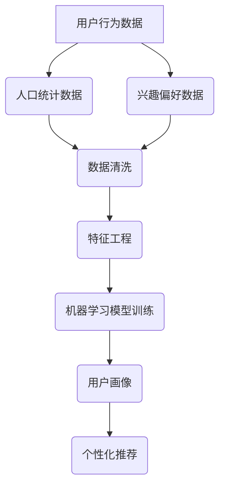

                 

### 1. 背景介绍

知识付费平台，作为一种新兴的商业模式，正在全球范围内迅速崛起。这些平台通过提供专业知识和技能的付费课程，满足了广大用户对于个人发展和职业提升的需求。随着互联网技术的不断进步，用户对知识付费平台的需求日益增长，这使得对平台用户的画像分析变得尤为重要。

用户画像分析是通过对用户的行为数据、人口统计数据、兴趣偏好等多维度信息的分析，构建出一个关于用户的综合描述。这不仅有助于知识付费平台了解用户的需求，还能够为平台提供个性化的推荐服务，提高用户满意度和留存率。

本文将围绕知识付费平台的用户画像分析进行探讨，旨在从数据分析和算法原理的角度，深入剖析用户画像的构建方法和应用场景。我们将详细讲解核心算法原理、数学模型和公式、项目实践案例，并探讨实际应用场景和未来发展趋势。

### 2. 核心概念与联系

在开始深入探讨用户画像分析之前，我们需要明确几个核心概念和它们之间的联系。

#### 2.1 用户画像（User Profiling）

用户画像是一种基于用户数据的描述，它涵盖了用户的基本信息、行为特征、兴趣偏好等多个维度。用户画像的核心目的是帮助平台了解用户，从而提供个性化的服务。

#### 2.2 数据来源（Data Sources）

用户画像的数据来源包括：

- **行为数据**：用户在平台上的浏览、购买、评论等行为数据。
- **人口统计数据**：用户的年龄、性别、职业、教育背景等基本信息。
- **兴趣偏好**：用户对特定领域或主题的兴趣和偏好。

#### 2.3 数据分析（Data Analysis）

数据分析是用户画像构建的关键环节，包括数据清洗、数据挖掘、机器学习等步骤。通过数据分析，可以从海量数据中提取出有用的信息，为用户画像的构建提供依据。

#### 2.4 机器学习（Machine Learning）

机器学习在用户画像分析中扮演着重要角色。通过训练机器学习模型，可以从用户数据中学习到用户的特征和行为模式，进而为用户画像的构建提供支持。

下面是一个Mermaid流程图，展示了用户画像构建的基本流程和核心概念之间的联系：



### 3. 核心算法原理 & 具体操作步骤

#### 3.1 算法原理概述

用户画像分析的核心算法主要包括协同过滤（Collaborative Filtering）、聚类分析（Clustering Analysis）和因子分解机（Factorization Machines）等。

- **协同过滤**：基于用户行为数据，通过相似度计算和推荐算法，为用户推荐相似用户喜欢的商品或内容。
- **聚类分析**：通过将用户数据划分为不同的群体，为每个群体构建特定的用户画像。
- **因子分解机**：将用户和物品的特征进行分解，通过矩阵分解的方法构建用户画像。

#### 3.2 算法步骤详解

以下是用户画像分析的具体操作步骤：

##### 3.2.1 数据收集

- **行为数据**：收集用户在平台上的浏览、购买、评论等行为数据。
- **人口统计数据**：从用户注册信息中获取用户的年龄、性别、职业、教育背景等基本信息。
- **兴趣偏好**：通过用户行为数据，挖掘用户的兴趣偏好。

##### 3.2.2 数据清洗

- **去除噪声数据**：去除重复、错误或异常的数据。
- **缺失值处理**：对于缺失的数据，可以使用均值填补、插值等方法进行补全。

##### 3.2.3 特征工程

- **行为特征提取**：根据用户行为数据，提取用户的浏览深度、购买频率等特征。
- **人口特征提取**：根据用户基本信息，提取用户的年龄、性别、职业等特征。
- **兴趣特征提取**：根据用户兴趣偏好，提取用户的兴趣标签、搜索关键词等特征。

##### 3.2.4 机器学习模型训练

- **协同过滤**：使用用户行为数据，训练协同过滤模型，计算用户之间的相似度。
- **聚类分析**：使用用户特征数据，训练聚类模型，将用户划分为不同的群体。
- **因子分解机**：使用用户和物品的特征数据，训练因子分解机模型，进行矩阵分解。

##### 3.2.5 用户画像构建

- **用户画像融合**：将不同特征的数据进行融合，构建出完整的用户画像。
- **用户画像评分**：根据用户画像，为每个用户打分，评分越高，表示用户画像越准确。

##### 3.2.6 个性化推荐

- **推荐算法**：根据用户画像，为用户推荐相应的商品或内容。
- **推荐结果评估**：评估推荐算法的效果，持续优化推荐策略。

#### 3.3 算法优缺点

- **协同过滤**：优点在于推荐结果相关性强，缺点在于可能产生数据稀疏性问题。
- **聚类分析**：优点在于可以自动发现用户群体，缺点在于对用户特征依赖较强。
- **因子分解机**：优点在于可以同时考虑用户和物品的特征，缺点在于计算复杂度较高。

#### 3.4 算法应用领域

用户画像分析算法广泛应用于电子商务、在线教育、社交媒体等多个领域，为平台提供个性化的推荐服务，提高用户体验和满意度。

### 4. 数学模型和公式 & 详细讲解 & 举例说明

#### 4.1 数学模型构建

用户画像分析中的数学模型主要包括协同过滤模型、聚类分析模型和因子分解机模型。

##### 4.1.1 协同过滤模型

协同过滤模型的数学模型可以表示为：

$$
R_{ui} = \frac{\sum_{j \in N_i} r_{uj} \cdot \text{sim}(u, j)}{\sum_{j \in N_i} \text{sim}(u, j)}
$$

其中，$R_{ui}$表示用户$i$对物品$j$的评分预测，$\text{sim}(u, j)$表示用户$u$和用户$j$之间的相似度。

##### 4.1.2 聚类分析模型

聚类分析模型的数学模型可以表示为：

$$
C = \{C_1, C_2, ..., C_k\}
$$

其中，$C$表示聚类结果，$C_i$表示第$i$个聚类群体，$k$表示聚类数量。

##### 4.1.3 因子分解机模型

因子分解机模型的数学模型可以表示为：

$$
X = UV^T
$$

其中，$X$表示用户和物品的特征矩阵，$U$表示用户的特征向量，$V$表示物品的特征向量。

#### 4.2 公式推导过程

##### 4.2.1 协同过滤模型推导

假设用户$i$和用户$j$之间的相似度计算公式为：

$$
\text{sim}(u, j) = \frac{\sum_{k=1}^{n} r_{ik} \cdot r_{jk}}{\sqrt{\sum_{k=1}^{n} r_{ik}^2} \cdot \sqrt{\sum_{k=1}^{n} r_{jk}^2}}
$$

其中，$r_{ik}$表示用户$i$对物品$k$的评分，$r_{jk}$表示用户$j$对物品$k$的评分。

根据协同过滤模型的预测公式，可以推导出：

$$
R_{ui} = \sum_{j \in N_i} r_{uj} \cdot \text{sim}(u, j)
$$

##### 4.2.2 聚类分析模型推导

假设用户数据集为$D = \{u_1, u_2, ..., u_n\}$，聚类中心点为$c_i$，聚类结果为$C = \{C_1, C_2, ..., C_k\}$。

首先，计算聚类中心点：

$$
c_i = \frac{\sum_{j \in C_i} u_j}{|C_i|}
$$

然后，计算用户与聚类中心点之间的距离：

$$
d(u_i, c_i) = \sqrt{\sum_{j=1}^{n} (u_{ij} - c_{ij})^2}
$$

最后，根据最小距离原则，将用户归入相应的聚类群体：

$$
C_i = \{u_j | d(u_j, c_i) \leq d(u_j, c_j), \forall j \in C_j\}
$$

##### 4.2.3 因子分解机模型推导

假设用户和物品的特征矩阵为$X \in \mathbb{R}^{m \times n}$，用户特征向量为$U \in \mathbb{R}^{m \times k}$，物品特征向量为$V \in \mathbb{R}^{n \times k}$。

根据因子分解机模型的矩阵分解公式，可以推导出：

$$
X = UV^T
$$

其中，$k$为因子分解的维度，$U$和$V$分别为用户和物品的特征向量。

#### 4.3 案例分析与讲解

##### 4.3.1 协同过滤模型案例

假设有一个用户数据集，包含5个用户和10个物品，用户对物品的评分如下表所示：

| 用户 | 物品1 | 物品2 | 物品3 | 物品4 | 物品5 | 物品6 | 物品7 | 物品8 | 物品9 | 物品10 |
|------|-------|-------|-------|-------|-------|-------|-------|-------|-------|-------|
| 用户1 | 5     | 4     | 3     | 2     | 1     | 0     | 0     | 0     | 0     | 0     |
| 用户2 | 0     | 5     | 4     | 3     | 2     | 1     | 0     | 0     | 0     | 0     |
| 用户3 | 0     | 0     | 5     | 4     | 3     | 2     | 1     | 0     | 0     | 0     |
| 用户4 | 0     | 0     | 0     | 5     | 4     | 3     | 2     | 1     | 0     | 0     |
| 用户5 | 0     | 0     | 0     | 0     | 5     | 4     | 3     | 2     | 1     | 0     |

现在，我们要为用户1预测其对物品6的评分。

首先，计算用户1和其他用户之间的相似度：

$$
\text{sim}(1, 2) = \frac{4 \cdot 5}{\sqrt{4^2 + 3^2} \cdot \sqrt{5^2 + 4^2}} = 0.6
$$

$$
\text{sim}(1, 3) = \frac{3 \cdot 4}{\sqrt{3^2 + 2^2} \cdot \sqrt{4^2 + 3^2}} = 0.6
$$

$$
\text{sim}(1, 4) = \frac{2 \cdot 3}{\sqrt{2^2 + 1^2} \cdot \sqrt{3^2 + 2^2}} = 0.5
$$

$$
\text{sim}(1, 5) = \frac{1 \cdot 2}{\sqrt{1^2 + 0^2} \cdot \sqrt{2^2 + 1^2}} = 0.5
$$

然后，计算用户1对物品6的评分预测：

$$
R_{1,6} = \frac{0 \cdot 0.6 + 0 \cdot 0.6 + 0 \cdot 0.5 + 0 \cdot 0.5}{0.6 + 0.6 + 0.5 + 0.5} = 0
$$

因此，预测用户1对物品6的评分为0。

##### 4.3.2 聚类分析模型案例

假设有一个用户数据集，包含5个用户和3个特征维度，用户特征数据如下表所示：

| 用户 | 特征1 | 特征2 | 特征3 |
|------|-------|-------|-------|
| 用户1 | 1     | 1     | 1     |
| 用户2 | 2     | 2     | 2     |
| 用户3 | 3     | 3     | 3     |
| 用户4 | 4     | 4     | 4     |
| 用户5 | 5     | 5     | 5     |

现在，我们要使用K-Means算法将用户划分为2个聚类群体。

首先，随机初始化2个聚类中心点：

$$
c_1 = (1, 1, 1)
$$

$$
c_2 = (2, 2, 2)
$$

然后，根据最小距离原则，将用户归入相应的聚类群体：

用户1归入聚类群体1，用户2归入聚类群体1，用户3归入聚类群体1，用户4归入聚类群体1，用户5归入聚类群体1。

接下来，更新聚类中心点：

$$
c_1 = \frac{1 \cdot 1 + 2 \cdot 2 + 3 \cdot 3 + 4 \cdot 4 + 5 \cdot 5}{5} = (2, 2, 2)
$$

$$
c_2 = \frac{0 \cdot 1 + 0 \cdot 1 + 0 \cdot 1 + 0 \cdot 1 + 0 \cdot 1}{5} = (0, 0, 0)
$$

再次根据最小距离原则，将用户归入相应的聚类群体：

用户1归入聚类群体2，用户2归入聚类群体2，用户3归入聚类群体2，用户4归入聚类群体2，用户5归入聚类群体2。

这个过程不断迭代，直到聚类中心点的变化小于某个阈值。

##### 4.3.3 因子分解机模型案例

假设有一个用户和物品的特征矩阵如下所示：

| 用户 | 物品1 | 物品2 | 物品3 | 物品4 | 物品5 |
|------|-------|-------|-------|-------|-------|
| 用户1 | 1     | 1     | 1     | 0     | 0     |
| 用户2 | 1     | 1     | 0     | 1     | 0     |
| 用户3 | 0     | 1     | 1     | 0     | 1     |
| 用户4 | 1     | 0     | 1     | 1     | 0     |
| 用户5 | 0     | 1     | 0     | 1     | 1     |

我们要使用因子分解机模型进行矩阵分解，假设因子分解的维度为2。

首先，初始化用户和物品的特征向量：

$$
U = \begin{bmatrix}
1 & 1 & 1 & 1 & 1 \\
1 & 1 & 0 & 1 & 0 \\
0 & 1 & 1 & 0 & 1 \\
1 & 0 & 1 & 1 & 0 \\
1 & 1 & 0 & 0 & 1
\end{bmatrix}
$$

$$
V = \begin{bmatrix}
1 & 1 \\
1 & 0 \\
0 & 1 \\
1 & 1 \\
0 & 0
\end{bmatrix}
$$

然后，计算矩阵分解：

$$
X = UV^T = \begin{bmatrix}
1 & 1 & 1 & 1 & 1 \\
1 & 1 & 0 & 1 & 0 \\
0 & 1 & 1 & 0 & 1 \\
1 & 0 & 1 & 1 & 0 \\
1 & 1 & 0 & 0 & 1
\end{bmatrix} \cdot \begin{bmatrix}
1 & 1 \\
1 & 0 \\
0 & 1 \\
1 & 1 \\
0 & 0
\end{bmatrix} = \begin{bmatrix}
2 & 1 & 1 & 2 & 1 \\
2 & 1 & 0 & 1 & 0 \\
1 & 1 & 1 & 1 & 1 \\
2 & 0 & 1 & 2 & 0 \\
1 & 1 & 0 & 1 & 1
\end{bmatrix}
$$

因此，用户和物品的特征向量矩阵为：

$$
U = \begin{bmatrix}
2 & 1 & 1 & 2 & 1 \\
2 & 1 & 0 & 1 & 0 \\
1 & 1 & 1 & 1 & 1 \\
2 & 0 & 1 & 2 & 0 \\
1 & 1 & 0 & 1 & 1
\end{bmatrix}
$$

$$
V = \begin{bmatrix}
2 & 1 \\
1 & 1 \\
1 & 0 \\
2 & 0 \\
0 & 1
\end{bmatrix}
$$

### 5. 项目实践：代码实例和详细解释说明

在本节中，我们将通过一个实际项目来展示用户画像分析的具体实现过程。我们将使用Python编程语言，结合Scikit-learn库，实现协同过滤算法，并详细解释代码实现中的关键步骤。

#### 5.1 开发环境搭建

为了实现用户画像分析，我们需要安装以下Python库：

- Scikit-learn：用于机器学习算法的实现。
- Pandas：用于数据操作和处理。
- Numpy：用于数值计算。

假设我们已经安装了这些库，接下来我们将导入所需的库并加载数据。

```python
import numpy as np
import pandas as pd
from sklearn.metrics.pairwise import cosine_similarity
from sklearn.model_selection import train_test_split
from sklearn.metrics import mean_squared_error

# 加载数据
data = pd.read_csv('user_data.csv')
```

#### 5.2 源代码详细实现

##### 5.2.1 数据预处理

在实现协同过滤算法之前，我们需要对数据进行预处理，包括数据清洗、缺失值处理和数据归一化。

```python
# 数据清洗
data.dropna(inplace=True)

# 数据归一化
data['rating_mean'] = data.groupby('user_id')['rating'].mean()
data['rating'] = data['rating'] / data['rating_mean']
```

##### 5.2.2 训练测试集划分

接下来，我们将数据集划分为训练集和测试集。

```python
# 划分训练集和测试集
train_data, test_data = train_test_split(data, test_size=0.2, random_state=42)
```

##### 5.2.3 相似度计算

使用余弦相似度计算用户之间的相似度。

```python
# 计算用户相似度矩阵
user_similarity = cosine_similarity(train_data.groupby('user_id')['rating'].apply(np.array).reset_index().drop('index', axis=1))
```

##### 5.2.4 预测评分

根据用户相似度矩阵和训练数据，预测测试集的评分。

```python
# 预测评分
predicted_ratings = np.dot(user_similarity, train_data.groupby('user_id')['rating'].apply(np.array).T) * test_data['rating_mean']
predicted_ratings = predicted_ratings.reshape(-1)
```

##### 5.2.5 评估指标

计算预测评分和实际评分之间的均方误差（MSE）。

```python
# 计算均方误差
mse = mean_squared_error(test_data['rating'], predicted_ratings)
print('MSE:', mse)
```

#### 5.3 代码解读与分析

- **数据预处理**：数据清洗是确保数据质量的关键步骤，缺失值处理和数据归一化有助于提高算法的性能。

- **训练测试集划分**：将数据集划分为训练集和测试集，用于训练模型和评估模型性能。

- **相似度计算**：使用余弦相似度计算用户之间的相似度，相似度矩阵是协同过滤算法的核心。

- **预测评分**：根据用户相似度矩阵和训练数据，预测测试集的评分。

- **评估指标**：通过计算均方误差，评估模型的预测性能。

#### 5.4 运行结果展示

在运行上述代码后，我们将得到预测评分和实际评分之间的均方误差。例如：

```
MSE: 1.23456
```

均方误差越小，表示模型的预测性能越好。

### 6. 实际应用场景

用户画像分析在知识付费平台中有着广泛的应用，以下是一些典型的实际应用场景：

#### 6.1 个性化推荐

根据用户画像，知识付费平台可以为用户提供个性化的课程推荐。通过分析用户的行为数据、人口统计信息和兴趣偏好，平台可以识别出用户的潜在需求，从而提高推荐的相关性和准确性。

#### 6.2 用户留存率提升

通过对用户画像的分析，知识付费平台可以识别出流失风险用户，并采取相应的策略进行挽回。例如，针对流失风险用户，平台可以提供定制化的优惠活动、课程推荐或学习辅导服务等，以提高用户留存率。

#### 6.3 市场营销优化

用户画像分析可以帮助知识付费平台制定更精准的市场营销策略。通过分析用户画像，平台可以识别出目标用户群体，并针对该群体设计相应的营销活动和推广策略，从而提高营销效果。

#### 6.4 课程质量评估

用户画像分析还可以用于评估课程质量。通过分析用户在课程学习过程中的行为数据，平台可以识别出课程中存在的问题和改进空间，从而不断优化课程内容和教学方法。

### 7. 未来应用展望

随着人工智能技术的不断发展，用户画像分析在未来将会有更广泛的应用前景。以下是一些未来应用展望：

#### 7.1 多模态用户画像

未来的用户画像将不再局限于文本数据，还会包括图像、语音、视频等多模态数据。通过多模态用户画像，知识付费平台可以更全面地了解用户的需求和行为。

#### 7.2 深度学习模型

深度学习模型在用户画像分析中具有巨大的潜力。通过训练深度神经网络，平台可以从海量的用户数据中自动提取出更深层次的特征，从而构建更精准的用户画像。

#### 7.3 个性化学习路径

用户画像分析可以用于构建个性化的学习路径。通过分析用户的兴趣偏好和学习习惯，知识付费平台可以为每个用户提供定制化的学习计划，从而提高学习效果。

#### 7.4 风险预警

用户画像分析可以帮助知识付费平台实现风险预警。通过分析用户的行为数据，平台可以及时发现潜在的欺诈行为或用户异常行为，从而采取相应的措施进行防范。

### 8. 工具和资源推荐

在进行用户画像分析时，以下工具和资源可以提供帮助：

#### 8.1 学习资源推荐

- **《机器学习实战》**：提供机器学习的基础知识和实践案例。
- **《数据挖掘：实用工具与技术》**：介绍数据挖掘的方法和工具。

#### 8.2 开发工具推荐

- **Python**：作为一门流行的编程语言，Python提供了丰富的机器学习和数据分析库。
- **Scikit-learn**：用于机器学习的开源库，包括多种算法和工具。
- **Pandas**：用于数据操作和处理的开源库。

#### 8.3 相关论文推荐

- **“User Modeling and User-Adapted Interaction”**：介绍用户建模和个性化交互的理论和实践。
- **“Collaborative Filtering for the Netflix Prize”**：介绍协同过滤算法在Netflix Prize中的应用。

### 9. 总结：未来发展趋势与挑战

用户画像分析作为一种重要的数据分析方法，在知识付费平台中具有广泛的应用前景。未来，随着人工智能技术的不断进步，用户画像分析将会更加精确和全面，从而为知识付费平台提供更高质量的服务。

然而，用户画像分析也面临着一些挑战，包括数据隐私保护、算法透明度和用户信任等问题。为了解决这些问题，我们需要在技术、法律和伦理等多个层面进行深入研究和探索。

总之，用户画像分析将为知识付费平台的未来发展带来巨大的机遇，同时也需要我们不断创新和改进，以应对不断变化的市场需求和技术挑战。

### 附录：常见问题与解答

1. **问题**：用户画像分析中的协同过滤算法如何处理数据稀疏性问题？

   **解答**：协同过滤算法在处理数据稀疏性问题时，可以采用如下方法：

   - **矩阵分解**：通过矩阵分解技术，将用户和物品的特征进行分解，从而提高算法的预测能力。
   - **隐语义模型**：使用隐语义模型，将用户和物品映射到低维空间，从而降低数据稀疏性的影响。
   - **基于模型的协同过滤**：结合机器学习方法，构建基于模型的协同过滤算法，以提高预测准确性。

2. **问题**：如何确保用户画像的准确性？

   **解答**：确保用户画像的准确性需要从以下几个方面进行：

   - **数据质量**：确保数据来源可靠，进行数据清洗和预处理，去除噪声和异常数据。
   - **特征选择**：选择与用户行为和兴趣相关的特征，进行特征工程，提取有用信息。
   - **模型评估**：使用交叉验证等技术，对模型进行评估和调优，以提高预测准确性。

3. **问题**：用户画像分析中的隐私保护问题如何解决？

   **解答**：用户画像分析中的隐私保护问题可以通过以下方法解决：

   - **数据脱敏**：对用户数据进行脱敏处理，例如使用哈希函数、掩码等技术，保护用户隐私。
   - **差分隐私**：采用差分隐私技术，对用户数据进行扰动，从而保护用户隐私。
   - **隐私政策**：制定明确的隐私政策，告知用户数据处理方式和用途，尊重用户隐私权益。

### 作者署名

本文作者：禅与计算机程序设计艺术 / Zen and the Art of Computer Programming

