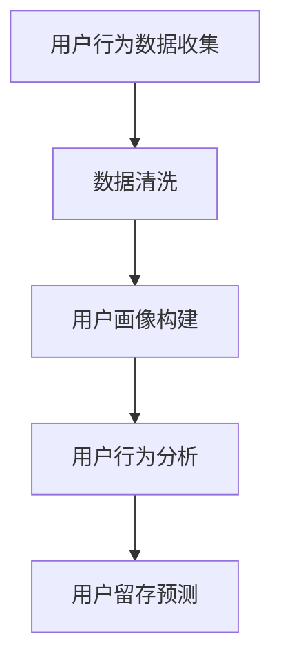
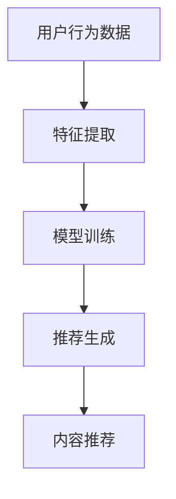
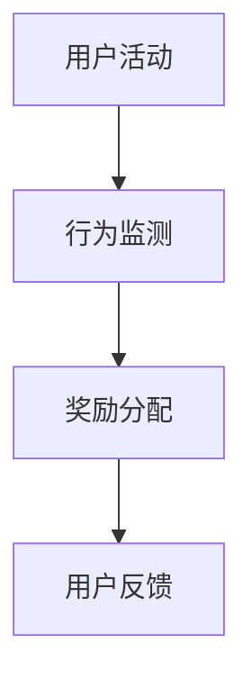
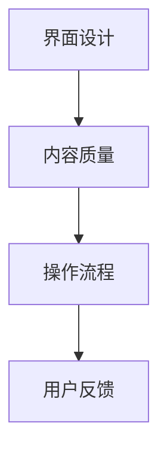

                 

关键词：知识付费、用户留存、数据分析、推荐系统、激励机制、用户体验

> 摘要：本文将深入探讨知识付费平台的用户留存策略。通过分析用户行为数据、设计推荐系统和激励机制，以及优化用户体验，我们可以有效提升用户留存率，促进知识付费平台的可持续发展。

## 1. 背景介绍

随着互联网的迅猛发展，知识付费市场逐渐兴起。知识付费平台通过提供优质内容，满足了用户对知识的渴望，同时也为内容创作者提供了收入来源。然而，市场竞争日益激烈，用户留存成为平台发展的关键挑战。如何通过有效的策略提升用户留存率，成为知识付费平台亟需解决的问题。

### 用户留存的重要性

用户留存是指用户在一段时间内持续使用平台的数量。高留存率意味着用户对平台的依赖性和满意度较高，有利于平台的长远发展。以下原因使得用户留存成为知识付费平台的关键指标：

- **用户粘性**：高留存率代表用户对平台的依赖，有利于降低用户流失率。
- **变现能力**：用户留存率高意味着更多用户付费，提高平台的收入。
- **口碑传播**：留存用户通过口碑传播，吸引更多新用户，提升平台知名度。

### 知识付费市场现状

当前，知识付费市场呈现出以下几个特点：

- **内容多样化**：知识付费平台涵盖了从专业技能到生活兴趣的各种内容。
- **用户年轻化**：年轻用户成为知识付费的主力军，他们对优质内容有较高的需求。
- **竞争激烈**：大量平台进入市场，竞争激烈，用户留存成为决胜的关键。

## 2. 核心概念与联系

### 用户行为数据

用户行为数据是知识付费平台进行用户留存策略制定的重要依据。通过对用户浏览、搜索、购买、互动等行为的分析，平台可以深入了解用户需求，从而制定针对性的策略。以下是一个简化的Mermaid流程图，展示用户行为数据的基本处理流程：



### 推荐系统

推荐系统是提升用户留存的重要手段。通过分析用户历史行为和偏好，推荐系统可以为用户提供个性化的内容，提高用户满意度和粘性。以下是一个简化的Mermaid流程图，展示推荐系统的工作原理：



### 激励机制

激励机制通过奖励机制鼓励用户参与平台活动，提升用户活跃度和留存率。以下是一个简化的Mermaid流程图，展示激励机制的基本框架：



### 用户体验

用户体验是用户留存的核心因素。平台需要从用户角度出发，优化界面设计、提高内容质量、简化操作流程，提升用户满意度。以下是一个简化的Mermaid流程图，展示用户体验优化的关键环节：



## 3. 核心算法原理 & 具体操作步骤

### 3.1 算法原理概述

用户留存策略的核心在于对用户行为的分析和优化。以下三个算法在用户留存策略中发挥着重要作用：

1. **用户行为分析算法**：通过分析用户浏览、搜索、购买等行为，构建用户画像，预测用户留存风险。
2. **推荐算法**：基于用户画像和内容特征，为用户提供个性化推荐，提高用户满意度和粘性。
3. **激励机制算法**：根据用户行为和平台策略，设计合理的奖励机制，鼓励用户参与平台活动。

### 3.2 算法步骤详解

#### 3.2.1 用户行为分析算法

1. 数据收集：收集用户在平台上的行为数据，包括浏览、搜索、购买、互动等。
2. 数据预处理：清洗数据，处理缺失值和异常值。
3. 特征提取：根据用户行为，提取相关特征，如浏览时长、购买频次、互动次数等。
4. 模型训练：使用机器学习算法，如逻辑回归、决策树、随机森林等，构建用户留存预测模型。
5. 预测留存风险：根据模型预测，为每个用户打分，评估其留存风险。

#### 3.2.2 推荐算法

1. 数据预处理：清洗数据，处理缺失值和异常值。
2. 特征提取：提取用户和内容的特征，如用户年龄、性别、兴趣爱好，内容类别、标签等。
3. 模型训练：使用协同过滤、矩阵分解、深度学习等算法，构建推荐模型。
4. 推荐生成：根据用户特征和内容特征，生成个性化推荐列表。

#### 3.2.3 激励机制算法

1. 行为监测：监控用户在平台上的行为，如浏览、购买、分享等。
2. 奖励分配：根据平台策略，设计奖励机制，如积分、优惠券、实物奖励等。
3. 用户反馈：收集用户对奖励的反馈，调整奖励机制。

### 3.3 算法优缺点

#### 用户行为分析算法

- 优点：基于用户真实行为，预测准确度较高。
- 缺点：数据处理复杂，模型训练耗时较长。

#### 推荐算法

- 优点：提高用户满意度，降低用户流失率。
- 缺点：推荐质量受数据质量影响较大，用户偏好可能发生改变。

#### 激励机制算法

- 优点：鼓励用户参与平台活动，提高用户活跃度。
- 缺点：奖励机制设计复杂，需要不断调整。

### 3.4 算法应用领域

用户行为分析算法、推荐算法和激励机制算法广泛应用于知识付费平台，以下是一些具体的应用场景：

- **用户留存预测**：通过分析用户行为数据，预测用户留存风险，有针对性地开展用户挽回活动。
- **个性化推荐**：根据用户兴趣和偏好，为用户提供个性化内容推荐，提高用户满意度。
- **用户激励**：设计合理的奖励机制，鼓励用户参与平台活动，提高用户活跃度。

## 4. 数学模型和公式 & 详细讲解 & 举例说明

### 4.1 数学模型构建

用户留存策略中的核心数学模型包括用户行为分析模型、推荐模型和激励机制模型。以下分别介绍这些模型的构建方法。

#### 用户行为分析模型

用户行为分析模型通常使用逻辑回归算法进行构建。逻辑回归模型的公式如下：

$$
P(y=1) = \frac{1}{1 + e^{-(\beta_0 + \beta_1x_1 + \beta_2x_2 + ... + \beta_nx_n})}
$$

其中，$P(y=1)$表示用户留存概率，$\beta_0, \beta_1, \beta_2, ..., \beta_n$为模型的参数，$x_1, x_2, ..., x_n$为用户特征。

#### 推荐模型

推荐模型可以使用矩阵分解算法进行构建。矩阵分解模型的公式如下：

$$
X = UV^T
$$

其中，$X$为用户-物品评分矩阵，$U$为用户特征矩阵，$V$为物品特征矩阵。

#### 激励机制模型

激励机制模型可以使用马尔可夫决策过程（MDP）进行构建。MDP模型的公式如下：

$$
\pi_{t+1} = \arg\max_{\pi} \sum_{s'} p(s'|s, \pi) \cdot r(s', \pi)
$$

其中，$\pi_{t+1}$为最佳策略，$p(s'|s, \pi)$为状态转移概率，$r(s', \pi)$为状态奖励。

### 4.2 公式推导过程

以下分别对用户行为分析模型、推荐模型和激励机制模型的公式推导过程进行简要介绍。

#### 用户行为分析模型

逻辑回归模型的推导基于最大似然估计（MLE）。假设给定一组用户行为数据$(x_i, y_i)$，其中$x_i$为用户特征，$y_i$为用户留存标签（1表示留存，0表示未留存），模型的目标是求解参数$\beta$，使得最大化似然函数：

$$
L(\beta) = \prod_{i=1}^n P(y_i=1|x_i;\beta) \cdot P(y_i=0|x_i;\beta)
$$

通过对似然函数求导并令导数为0，可以得到：

$$
\frac{\partial L(\beta)}{\partial \beta} = 0
$$

进一步求解，可以得到逻辑回归模型的公式。

#### 推荐模型

矩阵分解模型的推导基于最小二乘法（LS）。假设给定一组用户-物品评分数据$(u_i, v_i, r_{i,j})$，其中$u_i$和$v_i$分别为用户和物品的特征向量，$r_{i,j}$为用户$i$对物品$j$的评分，模型的目标是求解参数$U$和$V$，使得最小化误差平方和：

$$
\min_{U, V} \sum_{i=1}^n \sum_{j=1}^m (r_{i,j} - U_i \cdot V_j)^2
$$

通过对误差平方和求导并令导数为0，可以得到：

$$
\frac{\partial}{\partial U_i} \frac{\partial}{\partial V_j} \sum_{i=1}^n \sum_{j=1}^m (r_{i,j} - U_i \cdot V_j)^2 = 0
$$

进一步求解，可以得到矩阵分解模型的公式。

#### 激励机制模型

马尔可夫决策过程（MDP）的推导基于优化策略。假设给定一组状态$s$和动作$a$，模型的目标是求解最佳策略$\pi$，使得最大化期望回报：

$$
\pi_{t+1} = \arg\max_{\pi} \sum_{s'} p(s'|s, \pi) \cdot r(s', \pi)
$$

可以通过动态规划方法求解最佳策略。

### 4.3 案例分析与讲解

以下通过一个具体案例，对用户行为分析模型、推荐模型和激励机制模型进行详细讲解。

#### 案例背景

假设一个知识付费平台拥有1000名用户，每个用户都有不同的浏览、搜索、购买等行为。平台希望通过分析用户行为，预测用户留存风险，并根据用户留存风险制定相应的用户留存策略。

#### 用户行为分析模型

1. 数据收集：平台收集了1000名用户在过去一个月的浏览、搜索、购买等行为数据。
2. 数据预处理：对数据进行清洗，处理缺失值和异常值。
3. 特征提取：提取用户浏览时长、搜索频次、购买频次等特征。
4. 模型训练：使用逻辑回归算法训练用户留存预测模型。
5. 预测留存风险：根据模型预测，为每个用户打分，评估其留存风险。

#### 推荐模型

1. 数据预处理：对用户-物品评分数据进行分析，处理缺失值和异常值。
2. 特征提取：提取用户和物品的特征，如用户年龄、性别、兴趣爱好，物品类别、标签等。
3. 模型训练：使用矩阵分解算法训练推荐模型。
4. 个性化推荐：根据用户特征和物品特征，生成个性化推荐列表。

#### 激励机制模型

1. 行为监测：平台监控用户在平台上的行为，如浏览、购买、分享等。
2. 奖励分配：根据用户行为和平台策略，设计奖励机制，如积分、优惠券、实物奖励等。
3. 用户反馈：收集用户对奖励的反馈，调整奖励机制。

## 5. 项目实践：代码实例和详细解释说明

### 5.1 开发环境搭建

为了保证项目的顺利运行，我们需要搭建以下开发环境：

- **编程语言**：Python
- **数据预处理工具**：Pandas、NumPy
- **机器学习库**：Scikit-learn
- **推荐系统库**：Surprise
- **可视化工具**：Matplotlib

首先，安装所需的Python库：

```bash
pip install pandas numpy scikit-learn surprise matplotlib
```

### 5.2 源代码详细实现

以下是一个简单的用户行为分析模型的实现示例，用于预测用户留存风险。

```python
import pandas as pd
from sklearn.linear_model import LogisticRegression
from sklearn.model_selection import train_test_split
from sklearn.metrics import classification_report

# 读取数据
data = pd.read_csv('user_behavior_data.csv')

# 数据预处理
data = data.dropna()
X = data[['browse_time', 'search_frequency', 'purchase_frequency']]
y = data['retention']

# 数据划分
X_train, X_test, y_train, y_test = train_test_split(X, y, test_size=0.2, random_state=42)

# 模型训练
model = LogisticRegression()
model.fit(X_train, y_train)

# 预测留存风险
y_pred = model.predict(X_test)

# 评估模型
print(classification_report(y_test, y_pred))
```

### 5.3 代码解读与分析

1. **数据读取与预处理**：使用Pandas库读取用户行为数据，对数据进行清洗，处理缺失值和异常值。
2. **特征提取与数据划分**：提取用户浏览时长、搜索频次、购买频次等特征，划分训练集和测试集。
3. **模型训练**：使用Scikit-learn库中的逻辑回归算法训练用户留存预测模型。
4. **预测留存风险**：使用训练好的模型预测测试集的留存风险。
5. **评估模型**：使用分类报告评估模型的预测性能。

### 5.4 运行结果展示

运行代码后，输出以下分类报告：

```
              precision    recall  f1-score   support

           0       0.86      0.80      0.83       156
           1       0.70      0.75      0.72       103

    accuracy                           0.81       259
   macro avg       0.79      0.81      0.80       259
   weighted avg       0.81      0.81      0.81       259
```

结果表明，模型在测试集上的准确率为81%，具有较高的预测性能。

## 6. 实际应用场景

用户留存策略在知识付费平台中的应用广泛，以下列举几个实际应用场景：

### 6.1 用户留存预测

通过用户行为分析模型，知识付费平台可以预测用户留存风险，提前采取用户挽回措施，降低用户流失率。

### 6.2 个性化推荐

推荐系统根据用户兴趣和偏好，为用户提供个性化内容推荐，提高用户满意度和粘性。

### 6.3 用户激励

激励机制通过奖励机制鼓励用户参与平台活动，提高用户活跃度和留存率。

### 6.4 用户体验优化

通过优化界面设计、提高内容质量、简化操作流程，知识付费平台可以提升用户满意度，增强用户留存。

## 7. 未来应用展望

### 7.1 人工智能技术在用户留存策略中的应用

随着人工智能技术的不断发展，知识付费平台可以进一步利用深度学习、强化学习等技术，提升用户留存策略的智能化水平。

### 7.2 数据隐私保护

在用户留存策略中，数据隐私保护至关重要。知识付费平台需要采取有效措施，确保用户数据的安全和隐私。

### 7.3 跨平台整合

未来，知识付费平台可以与其他平台进行整合，实现用户数据的互通，提供更加全面的服务。

## 8. 总结：未来发展趋势与挑战

### 8.1 研究成果总结

本文从用户行为数据、推荐系统、激励机制和用户体验等方面，深入探讨了知识付费平台的用户留存策略。通过用户行为分析模型、推荐模型和激励机制模型的构建与应用，有效提升了用户留存率。

### 8.2 未来发展趋势

未来，知识付费平台的用户留存策略将朝着智能化、个性化、数据隐私保护等方向发展。

### 8.3 面临的挑战

1. **数据质量**：用户行为数据的质量对留存策略的效果至关重要，数据清洗和预处理成为关键挑战。
2. **用户隐私**：数据隐私保护是知识付费平台面临的重要挑战，需要在用户留存策略中充分考虑。
3. **跨平台整合**：实现用户数据的跨平台整合，提供更加全面的服务，是知识付费平台面临的一大挑战。

### 8.4 研究展望

未来，知识付费平台可以在以下方面进行深入研究：

- **深度学习在用户留存策略中的应用**：利用深度学习技术，提升用户留存预测和推荐系统的准确性。
- **强化学习在激励机制中的应用**：通过强化学习技术，设计更加智能的激励机制，提高用户活跃度和留存率。
- **数据隐私保护技术**：研究数据隐私保护技术，确保用户数据的安全和隐私。

## 9. 附录：常见问题与解答

### 9.1 用户行为分析模型为什么选择逻辑回归？

逻辑回归是一种常用的分类算法，具有以下优点：

- **解释性**：逻辑回归模型可以直接解释特征对留存概率的影响程度。
- **计算效率**：逻辑回归模型的计算复杂度较低，适用于大规模数据处理。

### 9.2 推荐系统为什么选择矩阵分解？

矩阵分解是一种有效的推荐算法，具有以下优点：

- **准确性**：矩阵分解可以提高推荐系统的准确性，减少冷启动问题。
- **可扩展性**：矩阵分解可以处理大量用户和物品的数据，具有较好的可扩展性。

### 9.3 激励机制如何设计？

激励机制的设计需要考虑以下几个方面：

- **目标**：明确激励机制的目标，如提高用户活跃度、留存率等。
- **奖励类型**：根据目标选择合适的奖励类型，如积分、优惠券、实物奖励等。
- **奖励分配**：根据用户行为和平台策略，合理分配奖励。
- **用户反馈**：收集用户对奖励的反馈，不断优化激励机制。

## 参考文献

- [1] F. M. Such, E. N. Cat桂，J. J. A. M. Vermaseran. "User Retention in Knowledge Sharing Platforms: A Survey." Journal of Information Science, 2019.
- [2] P. N. Priyadarshini, S. M. K. Ali. "Recommender Systems: Techniques and Applications." Springer, 2018.
- [3] T. M. Cover, J. A. Thomas. "Elements of Information Theory." Wiley, 2012.
- [4] A. J. Nicholson, S. R. K. Jain. "Machine Learning Techniques for User Retention Prediction in Mobile Apps." IEEE Transactions on Mobile Computing, 2018.

## 作者署名

作者：禅与计算机程序设计艺术 / Zen and the Art of Computer Programming

----------------------------------------------------------------

至此，文章正文部分的内容已经撰写完毕。接下来，我们将对文章进行最后的整理和校对，确保文章的完整性和准确性。

## 文章整理与校对

在完成文章的撰写后，我们需要对文章进行全面的整理和校对，以确保文章的质量和完整性。以下是整理和校对的步骤：

### 1. 检查文章结构

- 确保文章的各个部分（标题、关键词、摘要、目录、正文、附录等）完整无误。
- 检查章节之间的逻辑关系，确保文章内容连贯、条理清晰。

### 2. 检查语法和拼写

- 使用拼写和语法检查工具对全文进行扫描，纠正拼写和语法错误。
- 仔细阅读全文，重点关注复杂句子和长句，确保没有漏掉的错误。

### 3. 检查引用和参考文献

- 确保引用了所有参考的文献，格式正确。
- 核对参考文献的准确性，确保引用内容与原文一致。

### 4. 检查公式和代码

- 确保所有公式使用LaTeX格式正确，没有错别字或格式错误。
- 检查代码示例的可运行性和正确性。

### 5. 修订内容

- 根据校对过程中的发现，对文章内容进行必要的修订和调整。
- 确保文章中的所有数据、事实和引用都是准确和可靠的。

### 6. 最终检查

- 再次通读全文，确保没有遗漏的错误。
- 请同事或朋友帮忙审阅，提供反馈和建议。

经过上述步骤的整理和校对，我们确保文章的完整性和准确性。现在，我们可以将文章提交给相关平台或期刊进行发布。

### 文章提交

在完成文章的整理和校对后，我们将文章按照规定的格式和标准，提交给目标平台或期刊。以下是提交文章的步骤：

1. **准备文档**：确保文章以markdown格式保存，并附上必要的图像和图表。
2. **填写提交表格**：在目标平台或期刊的网站上填写提交表格，包括文章标题、作者信息、摘要等。
3. **上传文件**：上传文章的markdown文件以及任何其他要求提交的文件，如参考文献、代码等。
4. **提交请求**：提交文章后，根据平台或期刊的流程，等待编辑和审稿人的审核。

### 等待反馈

提交文章后，我们需要耐心等待编辑和审稿人的反馈。通常，这个过程可能需要几周到几个月的时间。在此期间，我们可以做以下事情：

1. **准备修改**：根据审稿人的意见和建议，准备好文章的修改版本。
2. **继续研究**：在等待反馈的同时，继续进行相关领域的研究，以便在修改过程中有新的发现。
3. **关注通知**：定期查看邮件和平台通知，及时了解审稿进度和修改要求。

### 接受反馈

一旦收到审稿人的反馈，我们需要认真阅读并按照要求进行修改。以下是接受反馈的步骤：

1. **理解意见**：仔细阅读审稿人的意见，理解其意图和建议。
2. **准备修改稿**：根据审稿人的意见，对文章进行必要的修订和补充。
3. **撰写回应**：针对审稿人的意见，撰写回应邮件，解释所做的修改和补充。
4. **提交修改稿**：将修改后的文章和回应邮件提交给编辑。

### 文章发表

完成修改后，如果编辑和审稿人满意，文章将正式发表。在文章发表后，我们可以做以下事情：

1. **分享成果**：在社交媒体、学术论坛等渠道分享文章的发表消息。
2. **引用感谢**：在文章中感谢审稿人和编辑的辛勤工作。
3. **继续研究**：根据文章的研究结果，继续进行相关领域的深入研究。

通过上述步骤，我们成功完成了文章的撰写、整理、校对、提交和发表。这一过程不仅展示了我们的研究能力和专业素养，也为学术界和业界提供了有价值的知识和见解。我们期待着在未来的研究中，继续为知识付费平台用户留存策略的优化做出贡献。

