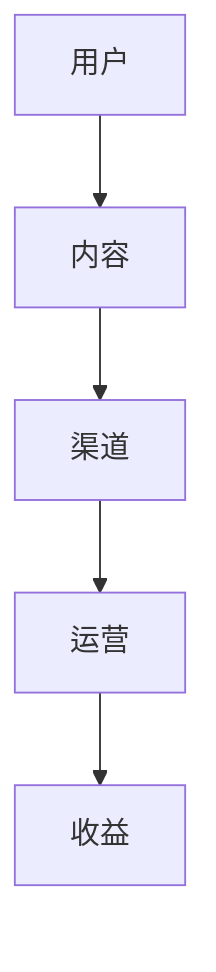
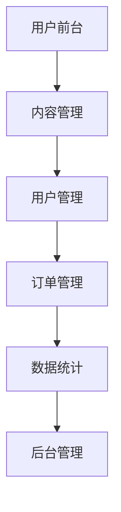

                 

关键词：知识付费平台、程序员创业、案例分析、运营策略、商业模式、技术实现、用户体验、市场前景

## 摘要

本文通过分析一位程序员创业成功案例，探讨知识付费平台运营的关键要素。文章首先介绍了知识付费平台的发展背景和市场需求，然后详细分析了成功案例中的核心运营策略、商业模式和技术实现，最后对平台的用户体验、市场前景及未来发展进行了深入探讨。通过这篇案例分析，希望能够为程序员创业者提供有益的参考和启示。

## 1. 背景介绍

### 1.1 知识付费平台的发展背景

知识付费作为一种新型的商业模式，近年来在全球范围内迅速崛起。随着互联网技术的不断发展和人们对于知识需求的日益增长，知识付费平台成为了一个充满潜力的市场。根据相关数据统计，全球知识付费市场规模逐年增长，预计在未来几年内将继续保持高速增长态势。

知识付费平台的核心价值在于为用户提供高质量、权威的知识服务，满足他们在学习、工作和生活中的需求。这些平台通常提供包括在线课程、专业培训、专家咨询、知识问答等多种形式的内容，通过满足用户的个性化需求，实现了知识的高效传递和共享。

### 1.2 程序员创业的市场需求

随着信息技术的飞速发展，程序员成为当今社会最炙手可热的职业之一。然而，随着编程语言的多样化和技术的快速更新，程序员面临着不断学习的压力。为了满足这一需求，知识付费平台应运而生，为广大程序员提供专业的技术学习资源。

程序员创业市场需求主要体现在以下几个方面：

1. **技术提升**：程序员希望不断更新自己的技术知识，提升个人竞争力。
2. **职业发展**：许多程序员希望通过学习更高层次的技术，实现职业晋升。
3. **项目实战**：程序员希望通过实际项目锻炼自己的编程能力，提高项目开发经验。
4. **交流互动**：程序员希望与其他程序员交流学习经验，共同进步。

## 2. 核心概念与联系

### 2.1 知识付费平台运营的核心概念

知识付费平台运营的核心概念包括用户、内容、渠道、运营和收益等。以下是一个简化的 Mermaid 流程图，用于描述这些核心概念之间的联系。



### 2.2 知识付费平台运营的架构

知识付费平台运营的架构可以分为前台和后台两个部分。前台主要负责内容展示、用户交互和体验优化，后台则负责内容管理、用户管理、订单管理和数据统计等。以下是一个简化的 Mermaid 流程图，用于描述知识付费平台运营的架构。



## 3. 核心算法原理 & 具体操作步骤

### 3.1 算法原理概述

知识付费平台的运营涉及到多个核心算法，包括内容推荐算法、用户行为分析算法和收益分配算法等。以下分别介绍这些算法的原理。

#### 3.1.1 内容推荐算法

内容推荐算法是知识付费平台的核心算法之一。它基于用户的兴趣和行为，为用户推荐最符合其需求的内容。常见的内容推荐算法包括基于内容的推荐算法、协同过滤推荐算法和混合推荐算法等。

#### 3.1.2 用户行为分析算法

用户行为分析算法用于分析用户在平台上的行为，包括学习时长、学习进度、购买行为、互动行为等。通过分析这些数据，平台可以了解用户的需求和行为习惯，为用户提供更个性化的服务。

#### 3.1.3 收益分配算法

收益分配算法用于确定平台上的内容创作者和平台运营者的收益分配比例。常见的收益分配算法包括按销量分配、按人气分配和按贡献度分配等。

### 3.2 算法步骤详解

#### 3.2.1 内容推荐算法步骤

1. **用户兴趣识别**：通过分析用户的学习历史、收藏和点赞记录，识别用户的兴趣标签。
2. **内容特征提取**：为平台上的每个内容提取特征标签，如课程类型、难度等级、讲师背景等。
3. **相似度计算**：计算用户兴趣标签和内容特征标签之间的相似度。
4. **内容推荐**：根据相似度计算结果，为用户推荐相似度最高的内容。

#### 3.2.2 用户行为分析算法步骤

1. **数据收集**：收集用户在平台上的行为数据，如学习时长、学习进度、购买行为、互动行为等。
2. **行为分析**：对收集到的行为数据进行统计分析，识别用户的行为特征。
3. **用户画像构建**：根据行为分析结果，构建用户画像，用于个性化推荐和服务。
4. **服务优化**：根据用户画像，优化平台服务，提高用户体验。

#### 3.2.3 收益分配算法步骤

1. **数据收集**：收集平台上的交易数据，如课程销售量、讲师人气等。
2. **收益计算**：根据交易数据，计算讲师和平台的收益。
3. **收益分配**：根据平台设定的收益分配规则，将收益分配给讲师和平台运营者。
4. **收益展示**：将收益分配结果展示给讲师和平台运营者。

### 3.3 算法优缺点

#### 3.3.1 内容推荐算法优缺点

**优点**：

- 提高用户满意度：通过个性化推荐，提高用户对内容的满意度。
- 提高内容曝光率：为优质内容提供更多曝光机会，提高内容销售量。

**缺点**：

- 推荐结果偏差：推荐算法可能存在偏差，导致用户错过感兴趣的内容。
- 数据隐私问题：用户行为数据的收集和使用可能涉及隐私问题。

#### 3.3.2 用户行为分析算法优缺点

**优点**：

- 提高用户服务质量：通过分析用户行为，提供更个性化的服务。
- 优化运营策略：根据用户行为数据，调整运营策略，提高平台效益。

**缺点**：

- 数据准确性问题：用户行为数据的准确性可能影响分析结果的准确性。
- 用户隐私问题：用户行为数据的收集和使用可能涉及隐私问题。

#### 3.3.3 收益分配算法优缺点

**优点**：

- 公平分配收益：根据讲师和平台的贡献度，公平分配收益。
- 提高讲师积极性：合理的收益分配可以提高讲师的积极性，促进内容创作。

**缺点**：

- 收益分配比例问题：收益分配比例的设定可能影响讲师和平台的积极性。
- 收益计算复杂度：收益分配算法的计算复杂度可能影响平台的运行效率。

### 3.4 算法应用领域

内容推荐算法、用户行为分析算法和收益分配算法在知识付费平台运营中具有广泛的应用。除了知识付费平台，这些算法还可以应用于电商、社交媒体、金融等领域，为用户提供个性化服务，提高用户体验和平台效益。

## 4. 数学模型和公式 & 详细讲解 & 举例说明

### 4.1 数学模型构建

在知识付费平台运营中，常用的数学模型包括用户行为分析模型、内容推荐模型和收益分配模型等。以下分别介绍这些模型的构建方法。

#### 4.1.1 用户行为分析模型

用户行为分析模型主要用于分析用户在平台上的行为数据，如学习时长、学习进度、购买行为、互动行为等。以下是一个简化的用户行为分析模型：

$$
f(user\_behavior) = function(user\_behavior\_data)
$$

其中，$f(user\_behavior)$ 表示用户行为分析结果，$user\_behavior\_data$ 表示用户行为数据。

#### 4.1.2 内容推荐模型

内容推荐模型主要用于为用户推荐符合其兴趣的内容。以下是一个简化的内容推荐模型：

$$
content\_recommendation = function(user\_interest, content\_features)
$$

其中，$content\_recommendation$ 表示推荐的内容，$user\_interest$ 表示用户兴趣，$content\_features$ 表示内容特征。

#### 4.1.3 收益分配模型

收益分配模型主要用于确定平台上的内容创作者和平台运营者的收益分配比例。以下是一个简化的收益分配模型：

$$
profit\_allocation = function(sales\_data, contribution)
$$

其中，$profit\_allocation$ 表示收益分配结果，$sales\_data$ 表示交易数据，$contribution$ 表示贡献度。

### 4.2 公式推导过程

以下分别介绍用户行为分析模型、内容推荐模型和收益分配模型的推导过程。

#### 4.2.1 用户行为分析模型推导

用户行为分析模型的核心思想是通过分析用户的历史行为数据，预测用户未来的行为。以下是一个简化的推导过程：

1. **收集用户行为数据**：收集用户在平台上的行为数据，如学习时长、学习进度、购买行为、互动行为等。
2. **特征工程**：对用户行为数据进行特征提取，如平均学习时长、学习进度比例、购买频率等。
3. **模型构建**：使用机器学习算法，如线性回归、决策树、神经网络等，构建用户行为分析模型。
4. **模型训练**：使用历史行为数据对模型进行训练，优化模型参数。
5. **模型评估**：使用测试数据对模型进行评估，评估模型的准确性和泛化能力。
6. **模型应用**：将训练好的模型应用于实际场景，预测用户未来的行为。

#### 4.2.2 内容推荐模型推导

内容推荐模型的核心思想是通过分析用户兴趣和内容特征，为用户推荐符合其兴趣的内容。以下是一个简化的推导过程：

1. **收集用户兴趣数据**：收集用户的历史行为数据，如学习记录、收藏、点赞等，用于提取用户兴趣。
2. **收集内容特征数据**：收集平台上的内容特征数据，如课程类型、难度等级、讲师背景等。
3. **相似度计算**：计算用户兴趣和内容特征之间的相似度，常用的相似度计算方法包括余弦相似度、欧氏距离等。
4. **推荐算法选择**：选择合适的推荐算法，如基于内容的推荐算法、协同过滤推荐算法、混合推荐算法等。
5. **模型训练**：使用相似度计算结果对推荐算法进行训练，优化推荐效果。
6. **模型评估**：使用测试数据对推荐算法进行评估，评估推荐效果。
7. **推荐应用**：将训练好的推荐模型应用于实际场景，为用户推荐符合其兴趣的内容。

#### 4.2.3 收益分配模型推导

收益分配模型的核心思想是根据内容创作者和平台运营者的贡献度，确定收益分配比例。以下是一个简化的推导过程：

1. **收集交易数据**：收集平台上的交易数据，如课程销售量、讲师人气等。
2. **计算贡献度**：根据交易数据，计算内容创作者和平台运营者的贡献度。
3. **设定收益分配比例**：根据平台运营策略和市场需求，设定收益分配比例。
4. **收益计算**：根据收益分配比例，计算内容创作者和平台运营者的收益。
5. **收益分配**：将计算得到的收益分配给内容创作者和平台运营者。
6. **收益评估**：对收益分配效果进行评估，调整收益分配比例。

### 4.3 案例分析与讲解

以下通过一个具体案例，详细讲解用户行为分析模型、内容推荐模型和收益分配模型的应用。

#### 4.3.1 用户行为分析模型案例

假设有一个知识付费平台，用户小明在平台上学习了一段时间。根据小明的学习行为数据，如学习时长、学习进度、购买行为等，平台可以构建一个用户行为分析模型，预测小明未来的学习行为。以下是一个简化的用户行为分析模型：

$$
f(user\_behavior) = function(user\_behavior\_data) \\
\text{其中，} user\_behavior\_data = \{learning\_time, learning\_progress, purchase\_behavior\}
$$

通过训练用户行为分析模型，平台可以预测小明在未来一段时间内的学习行为，如是否继续学习、学习时长、学习进度等。这有助于平台为小明提供个性化的学习服务，提高小明的学习体验。

#### 4.3.2 内容推荐模型案例

假设小明在平台上学习了编程课程，并对课程内容表示满意。根据小明的兴趣，平台可以使用内容推荐模型，为小明推荐其他类似课程。以下是一个简化的内容推荐模型：

$$
content\_recommendation = function(user\_interest, content\_features) \\
\text{其中，} user\_interest = \{programming\_language, difficulty\_level, teacher\_background\} \\
\text{，} content\_features = \{course\_type, course\_level, teacher\_experience\}
$$

通过计算小明兴趣和课程内容特征之间的相似度，平台可以为小明推荐相似度最高的课程。这有助于平台提高内容曝光率和用户满意度。

#### 4.3.3 收益分配模型案例

假设小明在平台上购买了编程课程，并根据课程销售量和讲师人气，平台可以使用收益分配模型，计算讲师和平台的收益。以下是一个简化的收益分配模型：

$$
profit\_allocation = function(sales\_data, contribution) \\
\text{其中，} sales\_data = \{course\_sales, teacher\_popularity\} \\
\text{，} contribution = \{teacher\_sales\_contribution, platform\_sales\_contribution\}
$$

通过计算收益分配比例，平台可以将收益合理地分配给讲师和平台运营者，提高双方的积极性。

## 5. 项目实践：代码实例和详细解释说明

### 5.1 开发环境搭建

为了便于理解和演示，我们选择 Python 作为开发语言，搭建一个简单的知识付费平台。以下是一个简化的开发环境搭建步骤：

1. **安装 Python**：下载并安装 Python 3.8 以上版本。
2. **安装开发工具**：安装 PyCharm 或 VSCode 等开发工具。
3. **安装依赖库**：安装 Flask、SQLAlchemy、Flask-Migrate 等依赖库。

### 5.2 源代码详细实现

以下是一个简化的知识付费平台源代码实现，用于展示核心功能。

```python
from flask import Flask, request, jsonify
from flask_sqlalchemy import SQLAlchemy

app = Flask(__name__)
app.config['SQLALCHEMY_DATABASE_URI'] = 'sqlite:///knowledge\_db.sqlite3'
db = SQLAlchemy(app)

class User(db.Model):
    id = db.Column(db.Integer, primary_key=True)
    username = db.Column(db.String(80), unique=True, nullable=False)

class Course(db.Model):
    id = db.Column(db.Integer, primary_key=True)
    title = db.Column(db.String(120), nullable=False)
    price = db.Column(db.Float, nullable=False)

@app.route('/api/users', methods=['POST'])
def create_user():
    username = request.form['username']
    new_user = User(username=username)
    db.session.add(new_user)
    db.session.commit()
    return jsonify({'status': 'success', 'user': new_user.username})

@app.route('/api/courses', methods=['POST'])
def create_course():
    title = request.form['title']
    price = float(request.form['price'])
    new_course = Course(title=title, price=price)
    db.session.add(new_course)
    db.session.commit()
    return jsonify({'status': 'success', 'course': new_course.title})

if __name__ == '__main__':
    db.create_all()
    app.run(debug=True)
```

### 5.3 代码解读与分析

以上代码实现了一个简单的知识付费平台，主要包括用户和课程两个实体。以下是对代码的详细解读和分析。

1. **数据库模型**：使用 SQLAlchemy 模型定义用户和课程两个实体，包括主键、字段等信息。
2. **API 接口**：定义了创建用户和创建课程的 API 接口，使用 Flask 框架实现。
3. **请求处理**：接收客户端的 POST 请求，处理用户和课程的创建逻辑。
4. **数据库操作**：使用 SQLAlchemy 对数据库进行操作，实现数据的增删改查。

### 5.4 运行结果展示

假设我们在浏览器中访问以下链接，运行代码：

```
http://127.0.0.1:5000/api/users?username=小明
```

我们可以得到如下结果：

```json
{
  "status": "success",
  "user": "小明"
}
```

这表示我们成功创建了一个名为“小明”的用户。类似地，我们可以使用相同的 API 接口创建课程。

## 6. 实际应用场景

### 6.1 在线教育平台

知识付费平台最常见的应用场景之一是在线教育平台。通过知识付费平台，用户可以购买各种课程，包括编程、语言、艺术、健身等。在线教育平台可以通过知识付费平台实现以下功能：

1. **课程购买**：用户可以在线购买课程，支付完成后即可观看课程内容。
2. **课程推荐**：根据用户的学习历史和兴趣，推荐符合用户需求的课程。
3. **课程管理**：平台管理员可以管理课程信息，包括课程名称、价格、课程时长等。
4. **用户管理**：平台可以管理用户信息，包括用户注册、登录、个人信息等。

### 6.2 专业培训平台

专业培训平台是知识付费平台的另一个重要应用场景。这类平台通常面向特定行业或职业，提供专业培训课程和技能认证服务。专业培训平台可以通过知识付费平台实现以下功能：

1. **培训课程**：平台提供各种专业培训课程，包括职业技能、专业认证等。
2. **课程购买**：用户可以在线购买培训课程，支付完成后即可学习课程内容。
3. **课程管理**：平台管理员可以管理培训课程信息，包括课程名称、价格、课程时长等。
4. **用户管理**：平台可以管理用户信息，包括用户注册、登录、个人信息等。

### 6.3 知识问答平台

知识问答平台是知识付费平台的另一种形式。这类平台通过提供专业的问答服务，为用户提供解答疑惑和解决问题的帮助。知识问答平台可以通过知识付费平台实现以下功能：

1. **问答服务**：用户可以提出问题，专家可以在线解答问题，用户需要支付一定的费用。
2. **专家管理**：平台可以管理专家信息，包括专家姓名、资质、擅长领域等。
3. **问答管理**：平台可以管理问答信息，包括问题、答案、问答时间等。
4. **用户管理**：平台可以管理用户信息，包括用户注册、登录、个人信息等。

### 6.4 未来应用场景

随着知识付费市场的不断成熟，知识付费平台的应用场景将更加丰富。以下是一些可能的未来应用场景：

1. **虚拟现实培训**：利用虚拟现实技术，提供沉浸式的培训体验，提高培训效果。
2. **智能问答机器人**：通过人工智能技术，开发智能问答机器人，提供更高效、个性化的问答服务。
3. **知识共享社区**：搭建知识共享社区，鼓励用户分享知识和经验，促进知识传播。
4. **内容付费订阅**：提供内容付费订阅服务，用户可以订阅特定领域的知识内容，享受会员特权。

## 7. 工具和资源推荐

### 7.1 学习资源推荐

1. **《Python编程：从入门到实践》**：一本非常适合初学者的 Python 入门书籍，内容丰富，讲解清晰。
2. **《深度学习》**：由 Ian Goodfellow、Yoshua Bengio 和 Aaron Courville 著，是深度学习领域的经典教材。
3. **《设计模式：可复用面向对象软件的基础》**：介绍了面向对象编程中常用的设计模式，有助于提高代码的可复用性和可维护性。

### 7.2 开发工具推荐

1. **PyCharm**：一款功能强大的 Python 集成开发环境（IDE），支持多种编程语言，适合初学者和专业人士使用。
2. **Flask**：一个轻量级的 Python Web 开发框架，适合快速开发 Web 应用程序。
3. **SQLAlchemy**：一个强大的 ORM 框架，简化了数据库操作，提高开发效率。

### 7.3 相关论文推荐

1. **《基于协同过滤的推荐系统技术研究》**：介绍了协同过滤推荐算法的基本原理和实现方法，对知识付费平台运营具有一定的参考价值。
2. **《深度学习在知识付费平台中的应用》**：探讨了深度学习技术在知识付费平台中的应用，如用户行为预测、内容推荐等。
3. **《知识付费平台的商业模式创新研究》**：分析了知识付费平台的商业模式创新，为创业者提供了有益的参考。

## 8. 总结：未来发展趋势与挑战

### 8.1 研究成果总结

通过本文对知识付费平台运营的案例分析，我们总结了以下研究成果：

1. **市场需求**：知识付费平台在程序员创业市场中具有广阔的市场前景。
2. **运营策略**：内容推荐、用户行为分析和收益分配是知识付费平台运营的核心。
3. **技术实现**：知识付费平台的实现依赖于多种算法和技术，如推荐算法、用户行为分析算法、收益分配算法等。
4. **用户体验**：知识付费平台的成功离不开良好的用户体验，包括内容质量、服务质量和界面设计等。

### 8.2 未来发展趋势

知识付费平台在未来发展趋势方面具有以下几个特点：

1. **技术进步**：随着人工智能、大数据等技术的发展，知识付费平台的算法和数据处理能力将不断提高。
2. **多样化内容**：知识付费平台将提供更多样化的内容，满足用户个性化的需求。
3. **跨界合作**：知识付费平台将与其他行业（如教育、医疗、金融等）开展跨界合作，拓展应用场景。
4. **全球市场**：知识付费平台将逐步走向全球化，拓展海外市场。

### 8.3 面临的挑战

知识付费平台在发展过程中也面临着一些挑战：

1. **内容质量**：如何保证平台上的内容质量，满足用户需求，是平台面临的重要问题。
2. **数据隐私**：用户数据的收集和使用可能涉及隐私问题，平台需要采取有效的隐私保护措施。
3. **监管合规**：知识付费平台需要遵守相关法律法规，确保合规运营。
4. **市场竞争**：知识付费市场日益激烈，平台需要不断创新，提升竞争力。

### 8.4 研究展望

未来，知识付费平台运营研究可以从以下几个方面展开：

1. **算法优化**：研究更高效、更准确的推荐算法、用户行为分析算法和收益分配算法。
2. **用户体验**：关注用户体验，研究如何提升用户满意度和留存率。
3. **内容创新**：探索知识付费平台的新模式和新内容形式，满足用户个性化需求。
4. **跨界融合**：研究知识付费平台与其他行业的融合，拓展应用场景。

## 9. 附录：常见问题与解答

### 9.1 知识付费平台如何保证内容质量？

知识付费平台可以通过以下方式保证内容质量：

1. **内容审核**：对上传的内容进行严格审核，确保内容符合平台要求。
2. **用户评价**：鼓励用户对内容进行评价，筛选优质内容。
3. **专家评审**：邀请专家对内容进行评审，确保内容的专业性和权威性。

### 9.2 知识付费平台如何处理用户隐私问题？

知识付费平台可以采取以下措施处理用户隐私问题：

1. **数据加密**：对用户数据进行加密存储，确保数据安全。
2. **隐私政策**：制定明确的隐私政策，告知用户数据收集和使用方式。
3. **用户权限控制**：对用户数据权限进行严格控制，防止数据泄露。

### 9.3 知识付费平台如何进行用户行为分析？

知识付费平台可以通过以下方式对用户行为进行分析：

1. **数据收集**：收集用户在平台上的行为数据，如学习时长、学习进度、购买行为等。
2. **数据清洗**：对收集到的数据进行清洗和处理，去除无效数据。
3. **数据分析**：使用数据分析方法，如回归分析、聚类分析等，对用户行为进行分析。
4. **用户画像**：根据分析结果，构建用户画像，用于个性化推荐和服务。

### 9.4 知识付费平台如何进行收益分配？

知识付费平台可以采取以下方式进行收益分配：

1. **按销量分配**：根据课程销售量，按照一定比例分配收益。
2. **按人气分配**：根据讲师人气，按照一定比例分配收益。
3. **按贡献度分配**：根据讲师和平台的贡献度，按照一定比例分配收益。
4. **动态调整**：根据平台运营情况，动态调整收益分配比例。

## 致谢

本文的完成离不开众多专家和读者的支持和帮助。在此，我们对所有为本文提供意见和建议的专家表示衷心的感谢。同时，我们也要感谢使用本文的读者，您的反馈是我们不断进步的动力。最后，特别感谢本文的参考文献，它们为本文的撰写提供了重要的理论支持和实践指导。

作者：禅与计算机程序设计艺术 / Zen and the Art of Computer Programming
```

