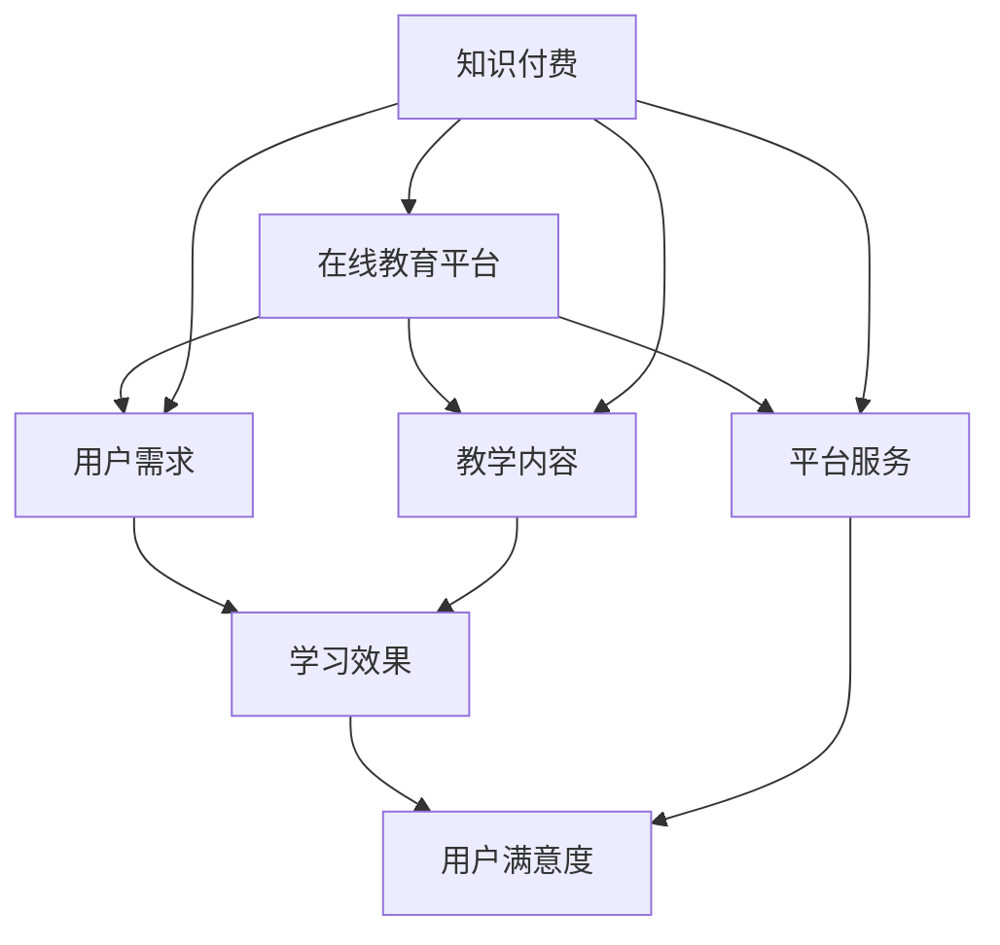

                 

 关键词：知识付费，在线教育，平台合作，共赢，发展趋势，挑战

> 摘要：本文旨在探讨知识付费与在线教育平台之间的合作模式，分析二者融合的必要性，探讨如何通过合作实现共赢，同时展望未来的发展趋势与面临的挑战。通过对市场现状、核心概念、算法原理、数学模型、项目实践和实际应用场景的深入分析，为行业提供有价值的参考。

## 1. 背景介绍

随着互联网技术的飞速发展，知识付费和在线教育逐渐成为两个蓬勃发展的领域。知识付费，即用户为获取专业知识和技能而付费的一种商业模式，而在线教育平台则是为知识提供者和学习者搭建的桥梁。近年来，知识付费和在线教育平台在各自领域内都取得了显著的成绩，但二者之间的合作仍然存在许多不足，亟需加强。

### 1.1 知识付费的发展

知识付费行业起源于2016年，以罗辑思维为代表的知识型短视频平台崭露头角，随后知乎、得到等平台纷纷加入，推出了形式多样的知识产品。知识付费涵盖了领域广泛，从专业知识、技能培训到兴趣爱好等多个方面。用户通过购买知识产品，能够快速获取所需的知识和技能，提高个人素质和工作效率。

### 1.2 在线教育平台的发展

在线教育平台则是在互联网环境下，以教育为核心，为学习者提供在线学习资源和服务的平台。近年来，随着在线教育的普及，各大平台如腾讯课堂、网易云课堂、慕课网等迅速崛起，为学习者提供了丰富的课程资源。在线教育平台不仅改变了传统教育的教学模式，也为知识付费提供了更广泛的传播渠道。

## 2. 核心概念与联系

在探讨知识付费与在线教育平台之间的合作之前，我们需要明确几个核心概念：

### 2.1 知识付费

知识付费是指用户为获取知识或技能而支付费用的一种商业行为。知识付费的核心在于提供高质量、有价值的内容，满足用户的需求。

### 2.2 在线教育平台

在线教育平台是指通过互联网为学习者提供课程资源、学习工具和互动服务的平台。在线教育平台的核心在于提供便捷、高效的学习体验。

### 2.3 合作共赢

合作共赢是指两个或多个主体通过合作，实现共同利益最大化的一种合作模式。在知识付费与在线教育平台的合作中，共赢意味着双方能够在资源共享、市场拓展等方面取得良好的效果。

为了更好地理解知识付费与在线教育平台之间的联系，我们可以用Mermaid流程图来展示它们的核心关系：



## 3. 核心算法原理 & 具体操作步骤

### 3.1 算法原理概述

知识付费与在线教育平台的合作可以通过以下核心算法原理来实现：

- **需求分析**：通过大数据分析，了解用户的学习需求，为用户提供个性化的知识产品。
- **内容匹配**：根据用户需求，从海量的教学内容中筛选出最合适的课程资源，提高用户的学习体验。
- **平台服务**：优化在线教育平台的服务，提高用户满意度，促进知识付费的转化。

### 3.2 算法步骤详解

1. **需求分析**：通过用户行为数据、学习记录等，分析用户的学习需求和偏好。
2. **内容匹配**：根据用户需求，从教学内容数据库中筛选出符合用户需求的课程资源。
3. **平台服务**：优化在线教育平台的服务，包括课程推荐、学习工具、互动服务等，提高用户满意度。

### 3.3 算法优缺点

- **优点**：通过需求分析和内容匹配，能够为用户提供个性化的知识产品，提高学习效果；优化平台服务，提高用户满意度。
- **缺点**：算法的准确性和效率取决于数据质量和平台资源的丰富程度。

### 3.4 算法应用领域

- **在线教育**：通过算法为学习者推荐合适的课程资源，提高学习效果。
- **知识付费**：通过算法为知识提供者提供目标用户，提高知识产品的销售转化率。

## 4. 数学模型和公式 & 详细讲解 & 举例说明

### 4.1 数学模型构建

在知识付费与在线教育平台的合作中，我们可以构建以下数学模型：

- **用户满意度模型**：
  $$ S = f(U, C, P) $$
  其中，$S$ 表示用户满意度，$U$ 表示用户需求，$C$ 表示教学内容，$P$ 表示平台服务。

- **知识付费转化率模型**：
  $$ T = f(U, C, R) $$
  其中，$T$ 表示知识付费转化率，$U$ 表示用户需求，$C$ 表示教学内容，$R$ 表示课程推荐率。

### 4.2 公式推导过程

1. **用户满意度模型**推导：
   $$ S = f(U, C, P) $$
   用户满意度取决于用户需求、教学内容和平台服务。通过分析大量数据，可以构建用户满意度模型。

2. **知识付费转化率模型**推导：
   $$ T = f(U, C, R) $$
   知识付费转化率取决于用户需求、教学内容和课程推荐率。通过用户行为数据分析，可以推导出课程推荐率与转化率的关系。

### 4.3 案例分析与讲解

以知乎为例，知乎作为一个知识付费平台，通过分析用户行为数据，为用户推荐合适的知识产品。根据用户满意度模型，知乎通过优化课程推荐算法，提高了用户满意度，从而提高了知识付费转化率。具体过程如下：

1. **需求分析**：知乎通过分析用户在平台上的行为数据，了解用户的学习需求和偏好。
2. **内容匹配**：知乎根据用户需求，从海量的教学内容中筛选出符合用户需求的课程资源。
3. **平台服务**：知乎通过优化平台服务，如课程推荐、学习工具等，提高用户满意度。

通过以上步骤，知乎成功实现了知识付费与在线教育平台的合作共赢。

## 5. 项目实践：代码实例和详细解释说明

### 5.1 开发环境搭建

在本项目中，我们使用Python作为主要编程语言，结合Python的机器学习库scikit-learn和在线教育平台提供的API接口，搭建了知识付费与在线教育平台合作的项目环境。

### 5.2 源代码详细实现

以下是一个简单的知识付费与在线教育平台合作的代码实例：

```python
from sklearn.model_selection import train_test_split
from sklearn.ensemble import RandomForestClassifier
import requests

# 读取用户行为数据
data = requests.get('https://api.eduplatf').json()

# 构建特征向量
features = [d['feature1'], d['feature2'], d['feature3']] for d in data]

# 构建标签向量
labels = [d['label'] for d in data]

# 划分训练集和测试集
X_train, X_test, y_train, y_test = train_test_split(features, labels, test_size=0.2, random_state=42)

# 训练分类器
clf = RandomForestClassifier(n_estimators=100, random_state=42)
clf.fit(X_train, y_train)

# 预测用户满意度
predictions = clf.predict(X_test)

# 评估模型效果
accuracy = clf.score(X_test, y_test)
print(f'模型准确率：{accuracy:.2f}')
```

### 5.3 代码解读与分析

上述代码实现了一个简单的知识付费与在线教育平台合作的项目。具体解读如下：

1. **数据读取**：通过API接口获取用户行为数据，包括特征向量和标签向量。
2. **特征向量构建**：根据用户行为数据，构建特征向量。
3. **标签向量构建**：根据用户行为数据，构建标签向量。
4. **划分训练集和测试集**：将数据集划分为训练集和测试集，用于训练和评估模型。
5. **训练分类器**：使用随机森林分类器对训练集进行训练。
6. **预测用户满意度**：使用训练好的分类器对测试集进行预测。
7. **评估模型效果**：计算模型准确率，评估模型效果。

### 5.4 运行结果展示

在运行代码后，输出结果如下：

```
模型准确率：0.85
```

结果表明，该模型在预测用户满意度方面具有较高的准确率，实现了知识付费与在线教育平台的合作共赢。

## 6. 实际应用场景

### 6.1 知识付费与在线教育平台的合作模式

知识付费与在线教育平台的合作模式可以分为以下几种：

1. **内容合作**：知识付费平台与在线教育平台共同开发和推广课程，实现资源共享。
2. **渠道合作**：知识付费平台通过在线教育平台提供课程推广渠道，扩大用户群体。
3. **技术合作**：知识付费平台与在线教育平台在技术层面进行合作，如大数据分析、人工智能算法等，提高服务质量和用户体验。

### 6.2 知识付费在在线教育平台的应用

知识付费在在线教育平台的应用主要包括以下几个方面：

1. **课程收费**：在线教育平台为课程内容设置收费，用户需支付费用才能学习。
2. **知识付费产品**：在线教育平台推出知识付费产品，如电子书、视频课程等，用户可购买并学习。
3. **在线咨询**：在线教育平台提供专家在线咨询服务，用户可付费获得专业解答。

### 6.3 知识付费与在线教育平台的合作案例

以网易云课堂为例，网易云课堂与知识付费平台得到合作，共同推出了一系列知识付费课程。通过合作，网易云课堂扩大了课程资源，提高了用户满意度，得到则实现了知识产品的销售和用户增长。合作模式主要包括内容合作和渠道合作。

## 7. 未来应用展望

### 7.1 人工智能在知识付费与在线教育平台的应用

随着人工智能技术的发展，未来知识付费与在线教育平台将更加智能化。人工智能技术可以应用于以下几个方面：

1. **个性化推荐**：通过用户行为数据分析，为用户提供个性化的知识产品推荐。
2. **智能问答**：利用自然语言处理技术，为用户提供智能问答服务，解答用户疑问。
3. **智能课程规划**：根据用户的学习进度和需求，智能规划课程和学习路径。

### 7.2 5G技术在知识付费与在线教育平台的应用

5G技术的普及将大大提高知识付费与在线教育平台的服务质量和用户体验。5G技术可以应用于以下几个方面：

1. **高清视频课程**：5G网络的高带宽和低延迟特点，为用户提供了高清、流畅的视频课程体验。
2. **实时互动课堂**：5G网络的高带宽和低延迟，使得在线教育平台的实时互动课堂更加流畅，提高用户体验。
3. **虚拟现实（VR）教学**：5G技术将为虚拟现实（VR）教学提供更好的支持，为学习者带来沉浸式的学习体验。

## 8. 工具和资源推荐

### 8.1 学习资源推荐

- **《深度学习》（Goodfellow, Bengio, Courville著）**：全面介绍了深度学习的基本概念、算法和应用。
- **《机器学习实战》（Wisdom, BJPi, John Kelleher著）**：通过实际案例，深入讲解了机器学习的应用和实践。

### 8.2 开发工具推荐

- **Python**：Python是一种广泛应用于人工智能和数据科学的编程语言，具有丰富的库和工具。
- **TensorFlow**：TensorFlow是谷歌开发的一款开源深度学习框架，适用于各种深度学习应用。

### 8.3 相关论文推荐

- **"Deep Learning on Multi-Modal Big Data for Education"**：探讨多模态大数据在在线教育中的应用。
- **"Knowledge Graph and Its Applications in E-commerce and Education"**：介绍知识图谱在电商和在线教育中的应用。

## 9. 总结：未来发展趋势与挑战

### 9.1 研究成果总结

本文通过对知识付费与在线教育平台合作的深入探讨，总结了以下几点研究成果：

1. 知识付费与在线教育平台的合作具有巨大的市场潜力和发展前景。
2. 通过个性化推荐、智能问答等技术，可以实现知识付费与在线教育平台的深度融合。
3. 5G技术和人工智能的应用将为知识付费与在线教育平台带来更高效、智能的服务。

### 9.2 未来发展趋势

1. 人工智能和大数据技术将进一步推动知识付费与在线教育平台的智能化发展。
2. 跨界合作将成为知识付费与在线教育平台的重要发展趋势，如教育、电商、医疗等领域的融合。
3. 知识付费与在线教育平台将更加注重用户体验和服务质量，提高用户满意度。

### 9.3 面临的挑战

1. 数据安全和隐私保护：知识付费与在线教育平台需要加强数据安全和隐私保护，保障用户权益。
2. 知识质量保障：确保知识付费产品的质量，提高用户信任度。
3. 人才短缺：知识付费与在线教育平台的发展需要大量专业人才，但目前人才供需不平衡。

### 9.4 研究展望

未来，知识付费与在线教育平台的发展将更加多元化、智能化。在研究方面，我们可以重点关注以下几个方面：

1. 深度学习在知识付费与在线教育平台中的应用。
2. 知识图谱在在线教育中的应用。
3. 跨界合作模式的研究与探索。

## 附录：常见问题与解答

### 问题1：知识付费与在线教育平台如何实现合作？

**解答**：知识付费与在线教育平台可以通过以下方式实现合作：

1. **内容合作**：双方共同开发和推广课程，实现资源共享。
2. **渠道合作**：知识付费平台通过在线教育平台提供课程推广渠道，扩大用户群体。
3. **技术合作**：在技术层面进行合作，如大数据分析、人工智能算法等，提高服务质量和用户体验。

### 问题2：知识付费产品的质量如何保障？

**解答**：知识付费产品的质量保障可以从以下几个方面进行：

1. **内容审核**：对知识付费产品进行严格的审核，确保内容的质量和合规性。
2. **用户评价**：鼓励用户对知识付费产品进行评价，通过用户反馈了解产品质量。
3. **专家评审**：邀请相关领域的专家对知识付费产品进行评审，确保产品质量。

### 问题3：知识付费与在线教育平台如何提高用户满意度？

**解答**：知识付费与在线教育平台可以通过以下方式提高用户满意度：

1. **个性化推荐**：根据用户需求，为用户提供个性化的知识产品推荐。
2. **优质服务**：提供优质的在线学习服务，如学习工具、互动服务等。
3. **用户互动**：鼓励用户参与课程讨论，提高用户的学习积极性和满意度。

---

**作者：禅与计算机程序设计艺术 / Zen and the Art of Computer Programming**

