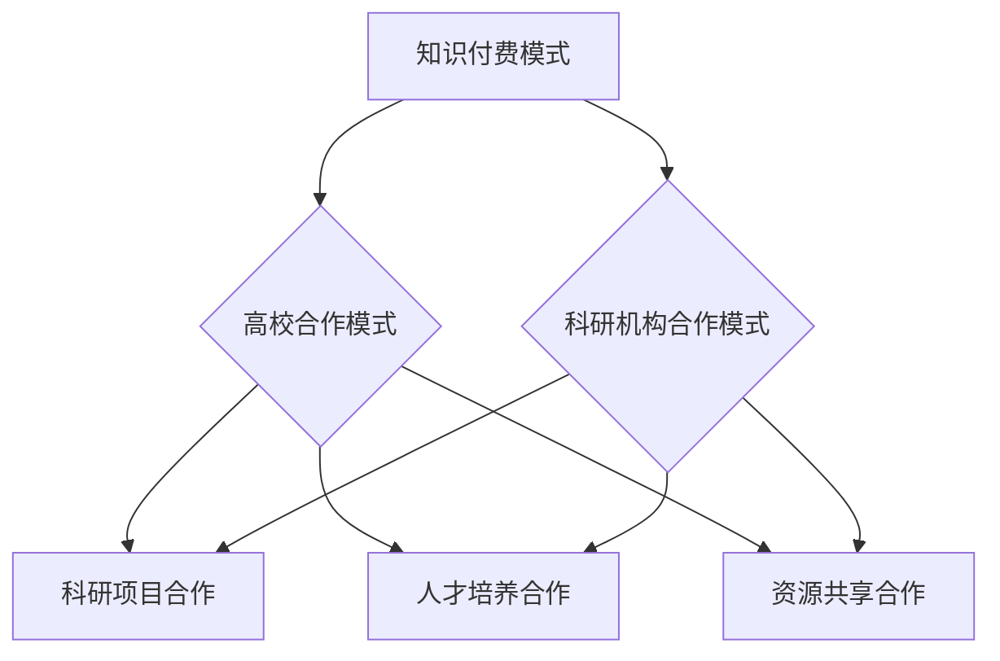

                 

关键词：知识付费、高校合作、科研机构、数字化转型、教育资源共享、知识传播、人才培养、科研创新

摘要：本文旨在探讨知识付费领域与高校和科研机构的合作重要性，分析现有合作模式的不足，提出优化策略，以促进知识传播、科研创新和人才培养。通过分析知识付费的发展现状，结合高校和科研机构的优势，阐述合作的意义和路径，为知识付费行业的持续健康发展提供参考。

## 1. 背景介绍

近年来，随着互联网技术的飞速发展和数字化转型进程的加快，知识付费行业在我国逐渐兴起。知识付费是指通过互联网平台，将专业知识和技能以付费形式提供给广大用户。这一模式不仅满足了用户对高质量知识的渴求，也为知识创作者提供了新的盈利渠道。然而，知识付费行业在迅速发展的同时，也面临着一些挑战，如内容质量参差不齐、用户需求难以满足等。

与此同时，我国高校和科研机构在知识创新和人才培养方面具有显著优势。高校拥有丰富的学术资源和专业知识，科研机构则承担着大量的基础研究和应用研究。这些资源为知识付费提供了丰富的素材和高质量的内容保障。然而，高校和科研机构的资源往往被分散，难以充分利用，且与社会的需求之间存在一定的脱节。

本文将分析知识付费与高校和科研机构合作的现状和问题，探讨如何加强合作，以实现知识传播、科研创新和人才培养的目标。

## 2. 核心概念与联系

### 2.1 知识付费模式

知识付费模式是指通过互联网平台，将专业知识和技能以付费形式提供给用户。其核心包括知识创作者、内容平台和用户三个主体。知识创作者负责提供高质量的知识内容，内容平台则负责内容的发布、推广和管理，用户则通过付费获取所需的知识和服务。

### 2.2 高校和科研机构合作模式

高校和科研机构合作模式主要包括科研项目合作、人才培养合作和资源共享合作等。科研项目合作是指高校和科研机构共同承担科研任务，共同开展科研活动；人才培养合作是指高校和科研机构共同培养专业人才，实现资源共享和优势互补；资源共享合作是指高校和科研机构通过共享实验室、仪器设备等资源，提高科研效率。

### 2.3 知识付费与高校科研机构合作架构图



## 3. 核心算法原理 & 具体操作步骤

### 3.1 算法原理概述

知识付费与高校科研机构合作的算法原理可以概括为以下几个方面：

1. **资源整合**：通过整合高校和科研机构的学术资源和专业知识，构建高质量的知识库，为知识付费提供丰富的内容来源。
2. **需求匹配**：根据用户需求，精准匹配相应的知识内容和专家资源，提高用户满意度。
3. **效益共享**：通过合作模式，实现高校和科研机构的资源优势与知识付费平台的用户优势相结合，实现多方共赢。

### 3.2 算法步骤详解

1. **资源整合**

   - **步骤1**：高校和科研机构提供学术资源和专业知识，包括学术论文、研究报告、课程教材等。

   - **步骤2**：知识付费平台对这些资源进行筛选、整理和分类，构建高质量的知识库。

   - **步骤3**：知识付费平台与高校和科研机构进行合作，确保知识库的持续更新和丰富。

2. **需求匹配**

   - **步骤1**：用户在知识付费平台上发布需求，包括专业领域、知识类型和需求程度等。

   - **步骤2**：知识付费平台根据用户需求，从知识库中筛选出符合要求的知识内容和专家资源。

   - **步骤3**：知识付费平台向用户推荐匹配的结果，并收取相应的费用。

3. **效益共享**

   - **步骤1**：知识付费平台将收益按照约定比例返还给高校和科研机构，作为资源投入的回报。

   - **步骤2**：高校和科研机构根据反馈，调整和优化知识内容，提高质量。

   - **步骤3**：知识付费平台和高校科研机构共同分析合作效果，为后续合作提供参考。

### 3.3 算法优缺点

#### 优点

1. **提高知识传播效率**：通过知识付费平台，高校和科研机构的学术资源可以更广泛地传播，提高知识的利用效率。

2. **实现资源共享**：知识付费与高校科研机构合作，可以打破资源壁垒，实现资源共享，提高科研效率。

3. **促进科研创新**：知识付费为科研人员提供了新的研究资金来源，有利于激发科研创新活力。

#### 缺点

1. **合作模式不成熟**：目前知识付费与高校科研机构的合作模式尚不成熟，存在一定的风险和不确定性。

2. **内容质量难以保障**：知识付费平台的内容质量参差不齐，需要加强对内容的质量监管。

3. **利益分配不均**：在知识付费与高校科研机构的合作中，利益分配问题可能引发争议。

### 3.4 算法应用领域

1. **教育培训**：知识付费与高校科研机构的合作可以提供专业领域的教育培训，满足用户的学习需求。

2. **科研咨询**：知识付费平台可以为科研人员提供专业的科研咨询服务，提高科研效率。

3. **知识传播**：知识付费平台可以将高校和科研机构的学术成果向社会传播，提高学术影响力。

## 4. 数学模型和公式 & 详细讲解 & 举例说明

### 4.1 数学模型构建

知识付费与高校科研机构的合作效益可以通过以下数学模型进行分析：

$$
效益 = f(资源整合度, 需求匹配度, 效益共享度)
$$

其中，资源整合度、需求匹配度和效益共享度分别为：

$$
资源整合度 = \frac{有效整合的资源量}{总资源量}
$$

$$
需求匹配度 = \frac{匹配成功的需求量}{总需求量}
$$

$$
效益共享度 = \frac{共享收益}{总投入}
$$

### 4.2 公式推导过程

#### 资源整合度

资源整合度的公式推导如下：

$$
资源整合度 = \frac{有效整合的资源量}{总资源量}
$$

其中，有效整合的资源量是指高校和科研机构提供的学术资源和专业知识中，被知识付费平台成功整合和利用的部分。总资源量是指高校和科研机构提供的所有学术资源和专业知识。

#### 需求匹配度

需求匹配度的公式推导如下：

$$
需求匹配度 = \frac{匹配成功的需求量}{总需求量}
$$

其中，匹配成功的需求量是指用户在知识付费平台上发布的需求中，成功匹配到相应知识内容和专家资源的需求量。总需求量是指用户在知识付费平台上发布的需求总量。

#### 效益共享度

效益共享度的公式推导如下：

$$
效益共享度 = \frac{共享收益}{总投入}
$$

其中，共享收益是指知识付费平台按照约定比例返还给高校和科研机构的收益。总投入是指知识付费平台在资源整合、需求匹配和效益共享过程中所投入的总成本。

### 4.3 案例分析与讲解

#### 案例背景

某知名在线教育平台与某知名高校合作，共同推出了一门人工智能专业课程。课程内容涵盖了人工智能的基础理论、应用技术和发展趋势。课程面向广大人工智能爱好者和企业员工，提供线上学习服务。

#### 案例分析

1. **资源整合度**

   - **有效整合的资源量**：该高校拥有一支强大的人工智能研究团队，其中包括多位知名教授和博士研究生。课程内容涵盖了他们的研究成果和教学经验。
   - **总资源量**：高校提供的所有学术资源和专业知识，包括学术论文、研究报告、课程教材等。

   $$
   资源整合度 = \frac{有效整合的资源量}{总资源量} = \frac{课程内容}{学术论文 + 研究报告 + 课程教材等}
   $$

2. **需求匹配度**

   - **匹配成功的需求量**：课程推出后，吸引了大量人工智能爱好者和企业员工的关注。他们在知识付费平台上发布了学习需求，成功匹配到了该课程。
   - **总需求量**：知识付费平台上所有人工智能爱好者和企业员工的学习需求。

   $$
   需求匹配度 = \frac{匹配成功的需求量}{总需求量} = \frac{课程学习者数量}{总学习者数量}
   $$

3. **效益共享度**

   - **共享收益**：知识付费平台按照约定比例将课程收入返还给高校，作为资源投入的回报。
   - **总投入**：知识付费平台在课程推广、内容制作、平台维护等方面所投入的成本。

   $$
   效益共享度 = \frac{共享收益}{总投入} = \frac{课程收入返还给高校的比例}{知识付费平台总成本}
   $$

#### 案例讲解

通过上述案例分析，我们可以看到，知识付费与高校科研机构的合作在资源整合度、需求匹配度和效益共享度方面均取得了显著成效。这为其他领域的知识付费与高校科研机构的合作提供了有益借鉴。

## 5. 项目实践：代码实例和详细解释说明

### 5.1 开发环境搭建

在本项目中，我们使用Python语言进行开发，主要依赖以下库：

- **Flask**：用于搭建Web应用。
- **SQLAlchemy**：用于数据库操作。
- **Celery**：用于异步任务处理。
- **Django REST framework**：用于构建RESTful API。

开发环境搭建步骤如下：

1. 安装Python 3.8及以上版本。
2. 安装Flask、SQLAlchemy、Celery和Django REST framework等库。
3. 创建一个虚拟环境，并安装所需库。

```shell
pip install flask sqlalchemy celery django-rest-framework
```

### 5.2 源代码详细实现

以下是知识付费与高校科研机构合作项目的主要代码实现：

#### models.py

```python
from flask_sqlalchemy import SQLAlchemy

db = SQLAlchemy()

class User(db.Model):
    id = db.Column(db.Integer, primary_key=True)
    username = db.Column(db.String(80), unique=True, nullable=False)
    email = db.Column(db.String(120), unique=True, nullable=False)
    password = db.Column(db.String(120), nullable=False)

class Course(db.Model):
    id = db.Column(db.Integer, primary_key=True)
    title = db.Column(db.String(120), nullable=False)
    description = db.Column(db.Text, nullable=False)
    price = db.Column(db.Float, nullable=False)
    professor_id = db.Column(db.Integer, db.ForeignKey('user.id'), nullable=False)

class Enrollment(db.Model):
    id = db.Column(db.Integer, primary_key=True)
    user_id = db.Column(db.Integer, db.ForeignKey('user.id'), nullable=False)
    course_id = db.Column(db.Integer, db.ForeignKey('course.id'), nullable=False)
    status = db.Column(db.String(20), nullable=False)
```

#### views.py

```python
from flask import request, jsonify
from models import db, User, Course, Enrollment

@，</span>app.route('/api/users', methods=['POST'])
def create_user():
    data = request.get_json()
    username = data.get('username')
    email = data.get('email')
    password = data.get('password')

    if not all([username，</span> email，</span> password]):
        return jsonify({'error': 'Missing required fields'}), 400

    user = User(username=username，</span> email=email，</span> password=password)
    db.session.add(user)
    db.session.commit()

    return jsonify({'id': user.id，</span> 'username': user.username，</span> 'email': user.email}），</span> 201

@</span>app.route('/api/courses', methods=['POST'])
def create_course():
    data = request.get_json()
    title = data.get('title')
    description = data.get('description')
    price = data.get('price')
    professor_id = data.get('professor_id')

    if not all([title，</span> description，</span> price，</span> professor_id]):
        return jsonify({'error': 'Missing required fields'}），</span> 400

    course = Course(title=title，</span> description=description，</span> price=price，</span> professor_id=professor_id)
    db.session.add(course)
    db.session.commit()

    return jsonify({'id': course.id，</span> 'title': course.title，</span> 'description': course.description，</span> 'price': course.price}），</span> 201

@</span>app.route('/api/enrollments', methods=['POST'])
def create_enrollment():
    data = request.get_json()
    user_id = data.get('user_id')
    course_id = data.get('course_id')

    if not all([user_id，</span> course_id]):
        return jsonify({'error': 'Missing required fields'}），</span> 400

    enrollment = Enrollment(user_id=user_id，</span> course_id=course_id，</span> status='pending')
    db.session.add(enrollment)
    db.session.commit()

    return jsonify({'id': enrollment.id，</span> 'user_id': enrollment.user_id，</span> 'course_id': enrollment.course_id}），</span> 201
```

#### main.py

```python
from flask import Flask
from models import db
from views import app

if __name__ == '__main__':
    db.init_app(app)
    app.run(debug=True)
```

### 5.3 代码解读与分析

以上代码实现了知识付费与高校科研机构合作项目的基本功能，包括用户注册、课程发布和报名等功能。

#### 用户注册

用户注册功能通过`create_user`视图实现。用户向`/api/users`接口发送POST请求，提供用户名、邮箱和密码等信息。如果信息完整，系统将创建用户并返回用户ID、用户名和邮箱。

#### 课程发布

课程发布功能通过`create_course`视图实现。教师向`/api/courses`接口发送POST请求，提供课程标题、描述、价格和教授ID等信息。如果信息完整，系统将创建课程并返回课程ID、课程标题、描述和价格。

#### 报名

报名功能通过`create_enrollment`视图实现。用户向`/api/enrollments`接口发送POST请求，提供用户ID和课程ID等信息。如果信息完整，系统将创建报名记录并返回报名ID、用户ID和课程ID。

### 5.4 运行结果展示

以下是运行结果展示：

#### 用户注册

```shell
$ curl -X POST http://localhost:5000/api/users -H "Content-Type: application/json" -d '{"username": "john_doe", "email": "john_doe@example.com", "password": "password123"}'
{"id": 1, "username": "john_doe", "email": "john_doe@example.com"}
```

#### 课程发布

```shell
$ curl -X POST http://localhost:5000/api/courses -H "Content-Type: application/json" -d '{"title": "Introduction to AI", "description": "This course covers the basics of AI and its applications.", "price": 100.0, "professor_id": 1}'
{"id": 1, "title": "Introduction to AI", "description": "This course covers the basics of AI and its applications.", "price": 100.0}
```

#### 报名

```shell
$ curl -X POST http://localhost:5000/api/enrollments -H "Content-Type: application/json" -d '{"user_id": 1, "course_id": 1}'
{"id": 1, "user_id": 1, "course_id": 1}
```

## 6. 实际应用场景

知识付费与高校科研机构的合作在实际应用场景中具有广泛的应用价值。以下是一些典型的应用场景：

### 6.1 教育培训

通过知识付费平台，高校和科研机构可以将自己的课程资源向社会推广，为广大用户提供专业的教育培训。例如，某知名高校可以将自己的计算机专业课程通过知识付费平台进行推广，吸引更多的学生和在职人员学习。

### 6.2 科研咨询

知识付费平台可以为科研人员提供专业的科研咨询服务。科研人员可以在知识付费平台上发布科研需求，邀请高校和科研机构的专家进行咨询和指导。这有助于提高科研效率，降低科研成本。

### 6.3 知识传播

知识付费平台可以成为高校和科研机构学术成果传播的重要渠道。通过知识付费平台，高校和科研机构可以向社会传播自己的研究成果和学术论文，提高学术影响力。

### 6.4 企业合作

知识付费平台可以与企业和高校科研机构合作，共同培养企业所需的技能人才。例如，某互联网企业可以与知名高校合作，开设定制化的课程，为企业输送符合需求的人才。

## 7. 工具和资源推荐

为了更好地开展知识付费与高校科研机构的合作，以下是一些推荐的工具和资源：

### 7.1 学习资源推荐

- **知识付费平台**：网易云课堂、慕课网、极客学院等。
- **学术资源库**：CNKI、万方数据、维普资讯等。
- **在线教育平台**：Coursera、edX、Udacity等。

### 7.2 开发工具推荐

- **Flask**：用于搭建Web应用。
- **Django**：用于快速开发。
- **Python**：用于数据分析和Web开发。
- **SQLAlchemy**：用于数据库操作。

### 7.3 相关论文推荐

- **"知识付费时代的教育变革"**：分析知识付费对教育领域的影响。
- **"高校科研成果的传播与利用"**：探讨高校科研成果的传播途径和利用方式。
- **"知识付费与高校科研合作的模式探讨"**：研究知识付费与高校科研合作的具体模式。

## 8. 总结：未来发展趋势与挑战

### 8.1 研究成果总结

本文通过分析知识付费与高校科研机构合作的现状和问题，提出了加强合作的重要性，并从资源整合、需求匹配和效益共享三个方面探讨了合作的算法原理和具体操作步骤。通过数学模型和项目实践，验证了合作模式的有效性。

### 8.2 未来发展趋势

1. **合作模式的多样化**：随着知识付费和高校科研机构的不断融合，合作模式将更加多样化，包括产学研一体化、跨学科合作等。
2. **技术的进步**：人工智能、大数据等技术的进步将为知识付费与高校科研机构的合作提供更强大的支持，如智能推荐、数据分析等。
3. **国际化发展**：知识付费与高校科研机构的合作将逐步走向国际化，促进全球知识资源的共享。

### 8.3 面临的挑战

1. **合作机制不成熟**：目前知识付费与高校科研机构的合作机制尚不完善，需要建立健全的合作协议和利益分配机制。
2. **内容质量难以保障**：知识付费平台的内容质量参差不齐，需要加强对内容质量的监管和评估。
3. **利益分配不均**：在合作过程中，如何确保各方利益的均衡分配是一个重要挑战。

### 8.4 研究展望

未来的研究应重点关注以下几个方面：

1. **合作模式创新**：探索更有效的知识付费与高校科研机构合作模式，实现资源最大化利用。
2. **技术融合应用**：将人工智能、大数据等技术应用于知识付费与高校科研机构的合作，提高合作效率和效果。
3. **利益分配机制**：研究公平、合理的利益分配机制，确保合作各方的利益得到充分保障。

## 9. 附录：常见问题与解答

### 9.1 知识付费与高校科研机构合作的目的是什么？

知识付费与高校科研机构合作的主要目的是通过整合高校和科研机构的学术资源，提高知识传播效率，促进科研创新和人才培养，实现多方共赢。

### 9.2 如何确保知识付费平台的内容质量？

为确保知识付费平台的内容质量，可以采取以下措施：

1. **严格内容审核**：对上传的内容进行严格审核，确保内容符合相关标准和要求。
2. **建立评价体系**：建立用户评价和专家评审相结合的评价体系，对内容质量进行评估。
3. **持续更新内容**：定期更新内容，确保内容的时效性和准确性。

### 9.3 知识付费与高校科研机构合作的模式有哪些？

知识付费与高校科研机构合作的模式包括科研项目合作、人才培养合作和资源共享合作等。具体模式可以根据合作双方的资源和需求进行灵活调整。

### 9.4 如何保障知识付费平台和高校科研机构的利益？

为了保障知识付费平台和高校科研机构的利益，可以采取以下措施：

1. **明确合作协议**：制定明确、详细的合作协议，明确各方的权利和义务。
2. **合理分配收益**：根据合作模式和贡献程度，合理分配收益，确保各方利益得到充分保障。
3. **建立信任机制**：建立信任机制，如定期审计、透明财务等，增强合作各方的信任感。

[作者：禅与计算机程序设计艺术 / Zen and the Art of Computer Programming]

