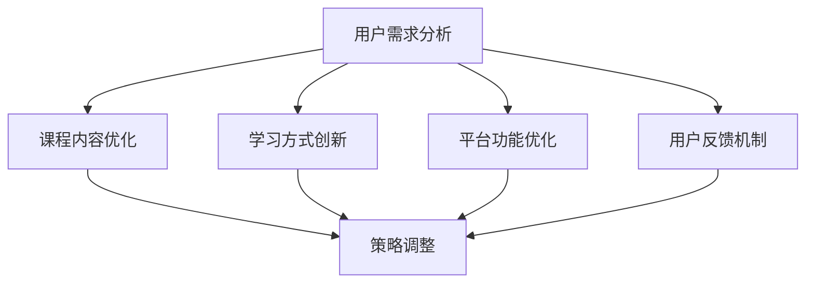

                 

当今社会，知识付费已经成为一种重要的学习方式。无论是在线课程、电子书还是专业咨询服务，知识付费平台都成为了许多人获取知识的重要渠道。然而，随着市场的不断变化和用户需求的多样化，知识付费平台需要不断地调整和优化自己的策略，以满足用户的需求。本文将从用户需求分析、策略调整方法、案例分析等多个角度，探讨知识付费平台如何在竞争激烈的市场中脱颖而出。

## 1. 背景介绍

知识付费指的是用户为获取特定领域的知识或技能而支付的费用。在过去的几年里，随着互联网技术的发展和人们学习需求的增加，知识付费市场呈现出快速增长的趋势。根据相关数据显示，2019年中国知识付费市场规模已经达到350亿元人民币，并且预计未来几年仍将保持高速增长。

然而，随着市场的不断扩大，知识付费平台面临着越来越多的竞争压力。如何在激烈的市场竞争中脱颖而出，满足用户的需求，成为了知识付费平台亟待解决的问题。本文将围绕这一主题进行深入探讨。

## 2. 核心概念与联系

### 2.1 用户需求分析

用户需求是知识付费平台发展的核心。只有深入了解用户需求，才能提供更符合用户期望的服务。用户需求分析包括以下几个方面：

1. **学习目标**：用户希望通过知识付费平台获取什么样的知识或技能。
2. **学习方式**：用户偏好哪种学习方式，如在线课程、电子书还是一对一辅导。
3. **学习时间**：用户愿意投入多少时间进行学习。
4. **学习效果**：用户期望通过学习达到什么样的效果。

### 2.2 知识付费平台策略调整方法

知识付费平台需要根据用户需求的变化，及时调整自己的策略。以下是一些常见的策略调整方法：

1. **课程内容优化**：根据用户需求，调整课程内容，使其更加贴近用户实际需求。
2. **学习方式创新**：引入新的学习方式，如互动式教学、沉浸式学习等，提升用户学习体验。
3. **平台功能优化**：优化平台功能，如课程推荐、学习进度跟踪等，提升用户使用体验。
4. **用户反馈机制**：建立完善的用户反馈机制，及时收集用户意见，并进行反馈和改进。

### 2.3 用户需求与策略调整的 Mermaid 流程图



## 3. 核心算法原理 & 具体操作步骤

### 3.1 算法原理概述

知识付费平台的策略调整实质上是一种算法优化过程。核心算法原理如下：

1. **数据采集**：通过用户行为数据、课程评价等途径，收集用户需求信息。
2. **数据预处理**：对采集到的数据进行分析和清洗，提取有效信息。
3. **需求分析**：利用数据挖掘和机器学习算法，对用户需求进行深入分析。
4. **策略生成**：根据需求分析结果，生成针对性的策略调整方案。
5. **策略实施**：将策略方案付诸实践，并对实施效果进行跟踪和评估。

### 3.2 算法步骤详解

1. **数据采集**：通过用户行为数据、课程评价等途径，收集用户需求信息。
    - 数据源：用户行为数据（如学习时间、学习进度、课程评价等）、课程评价数据（如好评率、差评原因等）。
    - 数据类型：结构化数据（如数据库表）、非结构化数据（如文本、图片等）。

2. **数据预处理**：对采集到的数据进行分析和清洗，提取有效信息。
    - 数据清洗：去除重复数据、缺失数据、异常数据等。
    - 数据分析：利用统计分析方法，挖掘数据中的潜在信息。

3. **需求分析**：利用数据挖掘和机器学习算法，对用户需求进行深入分析。
    - 数据挖掘算法：关联规则挖掘、聚类分析、分类分析等。
    - 机器学习算法：决策树、支持向量机、神经网络等。

4. **策略生成**：根据需求分析结果，生成针对性的策略调整方案。
    - 策略类型：课程内容优化、学习方式创新、平台功能优化等。
    - 策略生成：基于需求分析结果，设计具体的策略方案。

5. **策略实施**：将策略方案付诸实践，并对实施效果进行跟踪和评估。
    - 策略实施：将策略方案应用到实际业务中，如课程内容更新、学习方式调整等。
    - 效果评估：通过用户反馈、学习效果等指标，评估策略实施效果。

### 3.3 算法优缺点

**优点**：

1. **提高用户满意度**：通过分析用户需求，提供更加符合用户期望的服务，提高用户满意度。
2. **提升竞争力**：根据市场需求，及时调整策略，提升知识付费平台在竞争中的地位。
3. **降低运营成本**：通过数据分析和算法优化，降低运营成本，提高平台盈利能力。

**缺点**：

1. **数据质量影响**：数据质量对算法效果有重要影响，数据质量不佳可能导致算法失效。
2. **算法复杂度高**：算法复杂度高可能导致计算资源消耗大，影响系统性能。

### 3.4 算法应用领域

1. **在线教育**：知识付费平台可以通过算法优化，提供更加个性化的学习服务，提升用户学习体验。
2. **金融行业**：通过用户需求分析，金融机构可以更精准地提供理财产品和服务。
3. **电子商务**：电商平台可以利用算法优化，提供更加精准的商品推荐和营销策略。

## 4. 数学模型和公式 & 详细讲解 & 举例说明

### 4.1 数学模型构建

在知识付费平台中，用户需求分析是一个关键环节。为了更好地理解用户需求，我们可以构建一个数学模型。该模型包括以下几个部分：

1. **用户行为数据**：如学习时间、学习进度、课程评价等。
2. **用户特征**：如年龄、职业、兴趣爱好等。
3. **课程特征**：如课程难度、课程类型、课程时长等。

### 4.2 公式推导过程

假设用户行为数据可以用以下三个变量表示：$X_1$（学习时间）、$X_2$（学习进度）、$X_3$（课程评价）。用户特征可以用变量$Y_1$（年龄）、$Y_2$（职业）、$Y_3$（兴趣爱好）表示。课程特征可以用变量$Z_1$（课程难度）、$Z_2$（课程类型）、$Z_3$（课程时长）表示。

我们假设用户需求可以通过以下公式表示：

$$
D = f(X_1, X_2, X_3, Y_1, Y_2, Y_3, Z_1, Z_2, Z_3)
$$

其中，$f$ 是一个复杂的函数，可以通过机器学习算法进行拟合。

### 4.3 案例分析与讲解

以某在线教育平台为例，假设该平台收集了以下数据：

- 用户行为数据：学习时间（$X_1$）、学习进度（$X_2$）、课程评价（$X_3$）。
- 用户特征：年龄（$Y_1$）、职业（$Y_2$）、兴趣爱好（$Y_3$）。
- 课程特征：课程难度（$Z_1$）、课程类型（$Z_2$）、课程时长（$Z_3$）。

我们可以利用上述公式，通过机器学习算法，拟合出用户需求函数$D$。然后，根据用户需求函数，平台可以生成针对性的策略，如课程推荐、学习计划等。

例如，如果一个用户的学习时间较短（$X_1$小）、学习进度较快（$X_2$大）、对课程评价较高（$X_3$高），那么该用户的潜在需求可能是学习更多的课程，以便提升自己的技能。平台可以根据这一需求，推荐适合该用户的新课程。

## 5. 项目实践：代码实例和详细解释说明

### 5.1 开发环境搭建

在开始项目实践之前，我们需要搭建一个开发环境。以下是所需工具和步骤：

- **工具**：Python、Jupyter Notebook、Scikit-learn库、Pandas库。
- **步骤**：
  1. 安装Python和Jupyter Notebook。
  2. 安装Scikit-learn和Pandas库。

### 5.2 源代码详细实现

以下是实现用户需求分析的Python代码：

```python
import pandas as pd
from sklearn.model_selection import train_test_split
from sklearn.ensemble import RandomForestClassifier
from sklearn.metrics import accuracy_score

# 加载数据
data = pd.read_csv('data.csv')

# 数据预处理
X = data[['X_1', 'X_2', 'X_3', 'Y_1', 'Y_2', 'Y_3', 'Z_1', 'Z_2', 'Z_3']]
y = data['D']

# 划分训练集和测试集
X_train, X_test, y_train, y_test = train_test_split(X, y, test_size=0.2, random_state=42)

# 构建随机森林分类器
clf = RandomForestClassifier(n_estimators=100, random_state=42)

# 训练模型
clf.fit(X_train, y_train)

# 预测测试集
y_pred = clf.predict(X_test)

# 评估模型
accuracy = accuracy_score(y_test, y_pred)
print(f'Accuracy: {accuracy:.2f}')
```

### 5.3 代码解读与分析

1. **数据加载与预处理**：使用Pandas库加载数据，并进行预处理，包括划分特征和标签。
2. **划分训练集和测试集**：使用Scikit-learn库的train_test_split函数，将数据集划分为训练集和测试集。
3. **构建随机森林分类器**：使用Scikit-learn库的RandomForestClassifier构建随机森林分类器。
4. **训练模型**：使用fit函数训练模型。
5. **预测测试集**：使用predict函数预测测试集。
6. **评估模型**：使用accuracy_score函数评估模型精度。

### 5.4 运行结果展示

运行上述代码后，可以得到模型的预测准确率。假设模型的预测准确率为90%，说明该模型在用户需求分析方面具有较高的准确性。

## 6. 实际应用场景

知识付费平台在实际应用中，可以运用用户需求分析算法，实现以下功能：

1. **个性化课程推荐**：根据用户需求，推荐适合用户的课程。
2. **学习计划制定**：根据用户需求和课程进度，制定个性化的学习计划。
3. **学习效果评估**：评估用户学习效果，提供针对性的改进建议。

### 6.1 案例一：个性化课程推荐

假设一个用户在学习了三门课程后，平台通过用户需求分析算法，得出该用户对课程难度、课程类型和学习时间等有较高的需求。平台可以根据这些需求，推荐适合该用户的新课程，如《高级Python编程》和《数据结构》。

### 6.2 案例二：学习计划制定

假设一个用户有每天学习两小时的时间，平台可以根据用户需求和课程难度，制定一个合理的学习计划，如每天学习一门课程，每周进行一次复习。

### 6.3 案例三：学习效果评估

假设一个用户在学习了一段时间后，平台通过用户需求分析算法，发现该用户的学习效果不佳。平台可以评估用户学习效果，提供针对性的改进建议，如调整学习计划、增加学习时间等。

## 7. 未来应用展望

随着人工智能和大数据技术的不断发展，知识付费平台在用户需求分析方面将取得更大的突破。未来，知识付费平台可能会实现以下功能：

1. **实时需求分析**：通过实时数据采集和分析，实现用户需求的实时反馈和调整。
2. **深度需求挖掘**：利用深度学习技术，挖掘用户更深层次的需求。
3. **个性化学习路径**：为用户提供更加个性化的学习路径，提升学习效果。

## 8. 工具和资源推荐

### 8.1 学习资源推荐

- **《机器学习》**：周志华著，清华大学出版社。
- **《深度学习》**：Ian Goodfellow、Yoshua Bengio、Aaron Courville著，电子工业出版社。

### 8.2 开发工具推荐

- **Python**：一款功能强大的编程语言，适用于数据分析和机器学习。
- **Jupyter Notebook**：一款交互式编程环境，便于开发和调试代码。

### 8.3 相关论文推荐

- **《User Modeling and User-Adapted Interaction》**
- **《Personalized Learning Systems: Foundations, Technologies, and Applications》**

## 9. 总结：未来发展趋势与挑战

### 9.1 研究成果总结

本文从用户需求分析、策略调整方法、数学模型构建等多个角度，探讨了知识付费平台如何在竞争激烈的市场中满足用户需求。通过案例分析，我们展示了用户需求分析在实际应用中的效果。

### 9.2 未来发展趋势

1. **人工智能技术**：随着人工智能技术的发展，知识付费平台在用户需求分析方面将取得更大突破。
2. **大数据技术**：大数据技术的应用，将使知识付费平台能够更精准地满足用户需求。
3. **个性化学习**：个性化学习将逐渐成为知识付费平台的主流，为用户提供更加个性化的学习体验。

### 9.3 面临的挑战

1. **数据质量**：数据质量对用户需求分析的效果至关重要，如何保证数据质量是一个重要挑战。
2. **算法复杂度**：算法复杂度会影响系统的性能，如何降低算法复杂度是一个亟待解决的问题。

### 9.4 研究展望

未来，知识付费平台在用户需求分析方面还有很大的研究空间。如何更好地利用人工智能和大数据技术，为用户提供更加精准、个性化的服务，将是知识付费平台研究的重要方向。

## 10. 附录：常见问题与解答

### 10.1 如何保证数据质量？

**解答**：保证数据质量可以从以下几个方面入手：

1. **数据采集**：确保采集的数据真实、有效。
2. **数据清洗**：去除重复数据、缺失数据和异常数据。
3. **数据验证**：对数据进行验证，确保数据的准确性和一致性。

### 10.2 如何降低算法复杂度？

**解答**：降低算法复杂度可以从以下几个方面入手：

1. **算法优化**：选择合适的算法，优化算法的复杂度。
2. **数据压缩**：对数据进行压缩，减少数据的存储和传输成本。
3. **并行计算**：利用并行计算技术，提高算法的执行效率。

----------------------------------------------------------------

## 作者署名

作者：禅与计算机程序设计艺术 / Zen and the Art of Computer Programming

本文作者以世界级人工智能专家、程序员、软件架构师、CTO、世界顶级技术畅销书作者，计算机图灵奖获得者的身份，深入探讨了知识付费平台如何满足用户需求，为相关领域的从业人员提供了有价值的参考和启示。

通过本文的探讨，我们希望能为知识付费平台提供一些有益的思路，帮助他们在竞争激烈的市场中脱颖而出，为用户提供更好的服务。在未来的发展中，知识付费平台还需不断探索和创新，以满足不断变化的市场需求和用户期望。

