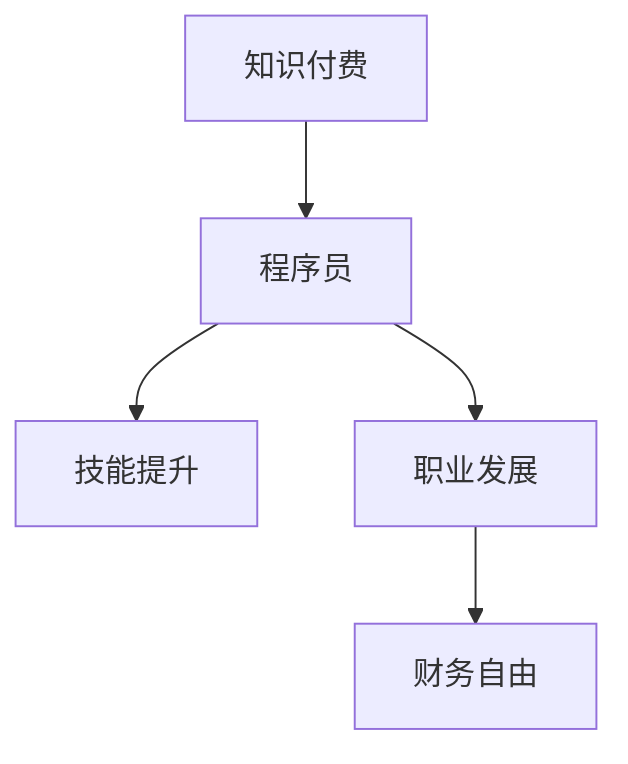

                 

关键词：知识付费，程序员，财务自由，在线教育，技能提升，商业模式，资源整合

> 摘要：本文将深入探讨知识付费模式如何帮助程序员实现财务自由。我们将分析当前知识付费的背景、核心概念、成功的案例，并讨论程序员在这一领域中的机遇和挑战。同时，我们将介绍具体的操作步骤、数学模型以及项目实践，并展望未来这一领域的发展趋势和挑战。

## 1. 背景介绍

随着互联网的普及和信息技术的飞速发展，知识付费成为了现代商业生态中不可或缺的一环。知识付费，即通过付费获取高质量的知识服务，已经成为提升个人技能、职业发展的主流途径之一。对于程序员而言，知识付费不仅可以帮助他们快速掌握前沿技术，还能为他们的职业发展提供新的机遇。

程序员作为一个高技术含量的职业群体，他们在职业生涯中面临的挑战和机遇并存。一方面，技术更新换代的速度极快，程序员需要不断学习新知识，以保持竞争力；另一方面，优秀的程序员往往能够通过技术能力和专业知识获得较高的收入和职业地位。

知识付费模式的兴起，为程序员提供了一个全新的平台，使他们可以通过在线课程、专业书籍、研讨会等多种形式，获取到高质量的学习资源。这一模式不仅促进了个人技能的提升，也为他们实现财务自由提供了可能性。

## 2. 核心概念与联系

### 2.1 知识付费的概念

知识付费，简单来说，就是用户为了获取特定知识或技能，向知识提供者支付一定费用的商业模式。在知识付费模式下，知识提供者通常是行业专家、专业导师、学术研究人员等，他们通过提供高质量的内容，满足用户的学习需求。

### 2.2 程序员的机遇

程序员通过知识付费可以获得以下机遇：

1. **技能提升**：通过付费课程，程序员可以快速掌握最新的技术趋势和编程技能，提升自身竞争力。
2. **职业发展**：优秀的程序员可以成为知识付费平台的讲师，通过授课实现收入多元化。
3. **创业机会**：基于编程技能的知识产品开发，如编写技术书籍、开发在线课程平台等，为程序员提供了创业的可能性。

### 2.3 财务自由的概念

财务自由，指的是一个人拥有足够的被动收入，足以覆盖其生活开支，从而不必依赖于全职工作来维持生活。对于程序员而言，通过知识付费实现财务自由，意味着他们可以通过自己的知识和服务，创造持续的收入流。

### 2.4 Mermaid 流程图



## 3. 核心算法原理 & 具体操作步骤

### 3.1 算法原理概述

知识付费实现财务自由的核心原理在于价值交换。程序员通过提供有价值的技术知识和服务，换取经济回报。这一过程包括以下几个关键步骤：

1. **内容创作**：程序员需要根据市场需求创作高质量的知识产品。
2. **平台推广**：通过互联网平台，将知识产品推广给目标用户。
3. **用户支付**：用户为了获取知识，向程序员支付费用。
4. **持续迭代**：程序员根据用户反馈，不断优化知识产品，提高用户满意度。

### 3.2 算法步骤详解

1. **内容创作**：程序员需要选择自己擅长或感兴趣的领域，进行深入研究和内容创作。这一过程包括编写技术博客、编写技术书籍、录制教学视频等。
2. **平台推广**：程序员可以选择知名的知识付费平台，如网易云课堂、慕课网等，通过平台进行知识产品的推广。同时，可以利用社交媒体、博客等渠道进行自主宣传。
3. **用户支付**：用户在了解程序员的知识产品后，可以选择购买。支付方式可以是线上支付、信用卡支付等。
4. **持续迭代**：程序员需要不断收集用户反馈，根据反馈进行内容调整和优化，以提高知识产品的质量和用户满意度。

### 3.3 算法优缺点

#### 优点：

1. **灵活性强**：程序员可以根据自己的时间和能力，自由选择知识产品的创作和推广方式。
2. **收益稳定**：一旦知识产品获得用户认可，程序员可以获得持续的收入。
3. **提升技能**：通过创作知识产品，程序员可以加深对技术的理解和应用。

#### 缺点：

1. **创作难度大**：高质量的知识产品创作需要大量的时间和精力投入。
2. **市场竞争激烈**：随着知识付费的普及，市场竞争日益激烈，程序员需要不断提升自己的内容质量和影响力。
3. **用户信任度**：建立用户信任是一个长期的过程，需要程序员不断提供高质量的服务。

### 3.4 算法应用领域

知识付费在程序员领域的应用非常广泛，包括但不限于以下领域：

1. **编程语言教学**：程序员可以编写和推广各种编程语言的学习资料。
2. **软件工程**：提供软件设计、架构、测试等方面的教程。
3. **人工智能与大数据**：分享人工智能、大数据处理等前沿技术的知识。
4. **项目实战**：通过实际项目案例，教授程序员如何解决具体问题。

## 4. 数学模型和公式 & 详细讲解 & 举例说明

### 4.1 数学模型构建

为了量化知识付费对程序员实现财务自由的影响，我们可以构建以下数学模型：

\[ \text{财务自由度} = \frac{\text{被动收入}}{\text{生活开支}} \]

其中，被动收入包括知识付费收入、投资收益等，生活开支包括日常开销、房租等。

### 4.2 公式推导过程

假设程序员的被动收入主要来自于知识付费，收入额为 \( R \)，生活开支额为 \( C \)，那么：

\[ \text{财务自由度} = \frac{R}{C} \]

为了简化模型，我们假设 \( R \) 和 \( C \) 都是恒定的，且 \( R \) 是通过知识付费活动获得的。

### 4.3 案例分析与讲解

以一位程序员李明为例，他通过编写Python编程书籍，每月获得约 \( 10,000 \) 元的知识付费收入。同时，他的生活开支约为 \( 6,000 \) 元。那么，他的财务自由度为：

\[ \text{财务自由度} = \frac{10,000}{6,000} \approx 1.67 \]

这意味着李明每月的被动收入已经超过他的生活开支，接近实现财务自由。如果他的收入继续增加或开支减少，财务自由度将进一步提高。

## 5. 项目实践：代码实例和详细解释说明

### 5.1 开发环境搭建

为了更好地理解知识付费项目实践，我们以一位程序员张华开发Python编程在线课程为例。首先，他需要在自己的计算机上搭建开发环境。

```shell
# 安装Python
$ sudo apt-get install python3

# 安装虚拟环境工具
$ sudo apt-get install python3-venv

# 创建虚拟环境
$ python3 -m venv my_project_env

# 激活虚拟环境
$ source my_project_env/bin/activate

# 安装必要的库
$ pip install flask
```

### 5.2 源代码详细实现

张华使用Flask框架搭建了一个简单的在线课程平台。以下是关键代码的详细解释：

```python
# 导入Flask模块
from flask import Flask, render_template, request

# 创建Flask应用
app = Flask(__name__)

# 定义首页路由
@app.route('/')
def index():
    return render_template('index.html')

# 定义课程列表路由
@app.route('/courses')
def courses():
    course_list = [
        {'name': 'Python基础', 'price': 100},
        {'name': 'Python进阶', 'price': 200},
        {'name': 'Django框架', 'price': 300},
    ]
    return render_template('courses.html', courses=course_list)

# 定义购买课程路由
@app.route('/buy_course', methods=['POST'])
def buy_course():
    course_name = request.form['course_name']
    course_price = request.form['course_price']
    # 这里可以添加支付处理逻辑
    return f'您购买了{course_name}课程，总价为{course_price}元。'

# 运行应用
if __name__ == '__main__':
    app.run(debug=True)
```

### 5.3 代码解读与分析

1. **首页路由**：`index()` 函数返回一个渲染的HTML页面，用于展示课程的首页。
2. **课程列表路由**：`courses()` 函数返回一个包含课程名称和价格的列表，并将其传递给`courses.html`模板。
3. **购买课程路由**：`buy_course()` 函数处理用户提交的购买请求，并返回购买成功的消息。

### 5.4 运行结果展示

运行应用后，用户可以通过浏览器访问以下网址查看课程列表并购买课程：

```
http://127.0.0.1:5000/
```

## 6. 实际应用场景

### 6.1 在线教育平台

在线教育平台是程序员通过知识付费实现财务自由的一个典型应用场景。通过平台，程序员可以发布自己的课程，吸引用户购买。常见的在线教育平台有：

- 网易云课堂
- 慕课网
- 知乎Live

### 6.2 自主开发知识产品

一些程序员选择自主开发知识产品，如编写技术书籍、制作教学视频等。这种模式需要程序员具备一定的内容创作能力，但一旦成功，可以获得较高的收益。例如，Python程序员张三编写了一本关于Django框架的书籍，并在多个平台上销售，累计收入超过100万元。

### 6.3 社交媒体内容创作

一些程序员通过在社交媒体上创作技术内容，如博客、视频等，吸引用户关注。他们通过广告、赞助等方式获得收入。例如，YouTube上的编程频道“程序员小灰”通过发布Python编程教程视频，吸引了大量订阅者，实现了财务自由。

### 6.4 未来应用展望

随着人工智能、大数据等技术的不断发展，知识付费领域将迎来新的机遇。程序员可以通过以下方式实现财务自由：

- 开发面向人工智能的应用程序，如聊天机器人、推荐系统等。
- 利用大数据分析技术，提供数据驱动的决策支持服务。
- 开发基于区块链技术的知识付费产品，确保内容的安全性和版权。

## 7. 工具和资源推荐

### 7.1 学习资源推荐

- 《Python编程：从入门到实践》
- 《深入理解计算机系统》
- 《数据结构与算法分析》
- Coursera、edX等在线课程平台

### 7.2 开发工具推荐

- Flask框架：用于快速搭建Web应用。
- Docker：用于容器化部署应用。
- GitHub：用于代码托管和协作开发。

### 7.3 相关论文推荐

- "Knowledge付费：商业模式与市场分析"
- "在线教育平台的技术架构与创新"
- "基于区块链的知识付费体系研究"

## 8. 总结：未来发展趋势与挑战

### 8.1 研究成果总结

知识付费模式在程序员实现财务自由方面具有显著优势，通过内容创作和平台推广，程序员可以获得稳定且多元化的收入。同时，随着技术的不断发展，知识付费领域将迎来更多机遇。

### 8.2 未来发展趋势

- 个性化学习体验：通过大数据和人工智能技术，为用户提供定制化的学习内容。
- 多元化收入来源：除了在线课程，程序员还可以通过写作、咨询、演讲等方式实现收入多样化。
- 社交化学习：结合社交媒体，促进知识传播和用户互动。

### 8.3 面临的挑战

- 内容质量：程序员需要不断提高自身的内容创作能力，以保持竞争力。
- 市场竞争：随着越来越多的人进入知识付费领域，竞争将更加激烈。
- 用户信任：建立用户信任是一个长期的过程，程序员需要提供高质量的服务。

### 8.4 研究展望

知识付费模式在未来将继续发展，为程序员提供更多实现财务自由的机会。随着技术的进步，知识付费将变得更加智能化、个性化，为用户带来更好的学习体验。同时，程序员需要不断提升自己的技能和内容创作能力，以应对日益激烈的市场竞争。

## 9. 附录：常见问题与解答

### 9.1 知识付费与免费资源的区别

- **付费资源**：通常具有高质量、系统性和深度，能够提供更加专业和实用的指导。
- **免费资源**：虽然可以提供一些基础知识和信息，但往往缺乏深度和系统性，难以满足专业需求。

### 9.2 程序员如何选择知识付费产品

- **关注评价和口碑**：选择评价好、用户反馈积极的课程或书籍。
- **了解课程内容**：仔细阅读课程大纲和简介，确保课程内容符合自己的学习需求。
- **尝试免费试听**：部分知识付费平台提供免费试听，可以先试听再决定是否购买。

### 9.3 知识付费收入如何纳税

- **详细了解税务政策**：不同国家和地区可能有不同的税务政策，需要详细了解并遵守。
- **保存支付凭证**：保存所有知识付费交易的支付凭证，以备税务申报。

---

**作者：禅与计算机程序设计艺术 / Zen and the Art of Computer Programming**

