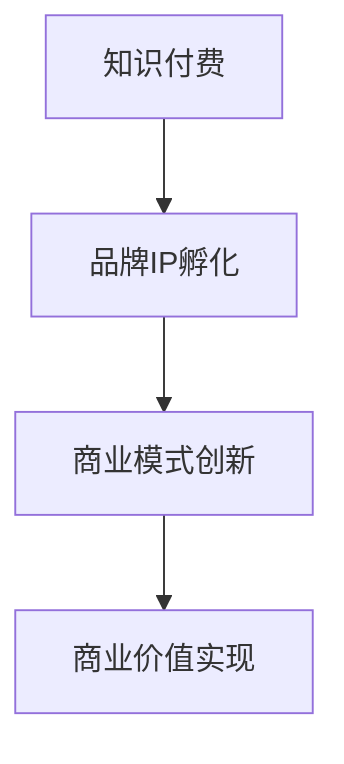
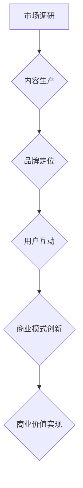
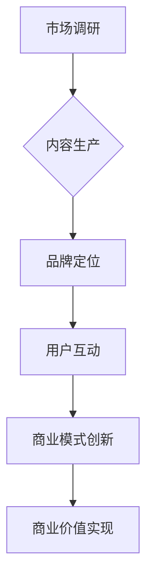

                 

关键词：知识付费、品牌IP、商业模式、创新、营销策略

摘要：本文将深入探讨知识付费行业的发展现状，品牌IP孵化的策略，以及商业模式的创新，旨在为知识付费从业者提供一套系统性、可操作的方法论，帮助他们在激烈的市场竞争中脱颖而出，实现商业价值的最大化。

## 1. 背景介绍

近年来，随着互联网的普及和人们生活水平的提高，知识付费逐渐成为了一种新兴的商业模式。用户愿意为高质量的知识内容支付费用，这为知识付费行业的发展提供了广阔的市场空间。然而，如何在众多竞争者中脱颖而出，构建可持续的商业模式，成为知识付费从业者面临的一大挑战。

品牌IP（Intellectual Property，知识产权）的孵化是知识付费的重要组成部分。通过打造独特的品牌IP，不仅能够提升品牌的认知度和影响力，还能为用户带来独特的价值，从而增强用户的忠诚度和粘性。

本文将围绕知识付费赚钱的品牌IP孵化和商业模式创新展开讨论，为读者提供一套完整的策略和方法。

## 2. 核心概念与联系

### 2.1 知识付费

知识付费是指用户为获取高质量的知识内容而支付的费用。与传统媒体内容不同，知识付费内容通常具有更高的专业性和实用性。

### 2.2 品牌IP

品牌IP是指具有较高知名度、认知度和市场价值的品牌资产。品牌IP的孵化包括品牌的定位、形象塑造、内容生产等多个环节。

### 2.3 商业模式

商业模式是指企业在特定市场环境下，通过何种方式创造、传递和获取价值的一套系统。商业模式的创新是企业在市场竞争中取得优势的关键。

### 2.4 Mermaid 流程图

## 3. 核心算法原理 & 具体操作步骤

### 3.1 算法原理概述

品牌IP孵化的核心算法原理主要包括以下几个方面：

1. **市场调研**：了解市场需求，确定品牌IP的核心价值。
2. **内容生产**：根据市场需求，创作高质量的知识内容。
3. **品牌定位**：明确品牌IP的定位，塑造独特形象。
4. **用户互动**：通过互动增强用户对品牌IP的认同感。
5. **商业模式创新**：构建可持续的商业模式，实现商业价值的最大化。

### 3.2 算法步骤详解

1. **市场调研**：

   - 调查目标用户群体，了解其需求。
   - 分析竞品，总结其优缺点。
   - 确定品牌IP的核心价值。

2. **内容生产**：

   - 创作高质量的知识内容，满足用户需求。
   - 保持内容更新，提高用户粘性。
   - 引入互动元素，增加用户参与度。

3. **品牌定位**：

   - 确定品牌IP的定位，塑造独特形象。
   - 设计品牌视觉元素，如标志、配色等。
   - 建立品牌故事，增加品牌情感价值。

4. **用户互动**：

   - 通过社交媒体、社群等渠道，与用户互动。
   - 回应用户反馈，提高用户满意度。
   - 定期举办线上/线下活动，增强用户粘性。

5. **商业模式创新**：

   - 构建多元化的收入来源，如订阅、广告、商品销售等。
   - 创新收费模式，如按需付费、会员制等。
   - 优化用户体验，提高用户转化率。

### 3.3 算法优缺点

**优点**：

- 提高品牌认知度和影响力。
- 增强用户忠诚度和粘性。
- 实现商业价值的最大化。

**缺点**：

- 市场调研和内容生产成本较高。
- 需要较长时间积累用户。

### 3.4 算法应用领域

- 教育培训
- 金融投资
- 健康养生
- 技术分享

## 4. 数学模型和公式 & 详细讲解 & 举例说明

### 4.1 数学模型构建

品牌IP孵化的数学模型可以采用以下公式：

$$
\text{品牌价值} = f(\text{内容质量}, \text{用户满意度}, \text{市场占有率})
$$

### 4.2 公式推导过程

- 内容质量：反映知识付费内容的实用性、专业性、创新性等。
- 用户满意度：反映用户对品牌IP的认同感和忠诚度。
- 市场占有率：反映品牌IP在市场中的竞争力。

### 4.3 案例分析与讲解

假设有一个教育培训品牌，其内容质量为 80 分，用户满意度为 90 分，市场占有率为 30%。根据公式计算，该品牌的价值为：

$$
\text{品牌价值} = f(80, 90, 30) = 0.5 \times 80 + 0.3 \times 90 + 0.2 \times 30 = 66
$$

为了提高品牌价值，品牌方可以采取以下措施：

1. 提高内容质量，例如通过引入专家团队、优化课程设计等。
2. 提升用户满意度，例如通过改进售后服务、增加互动环节等。
3. 扩大市场占有率，例如通过广告投放、合作推广等。

## 5. 项目实践：代码实例和详细解释说明

### 5.1 开发环境搭建

1. 安装 Python 3.8 或以上版本。
2. 安装 Mermaid 插件。

### 5.2 源代码详细实现

以下是一个简单的 Mermaid 流程图示例：

### 5.3 代码解读与分析

这段代码定义了一个简单的流程图，描述了品牌IP孵化过程中的关键步骤。通过 Mermaid 插件，可以将这段代码转换为可视化的流程图，便于理解和分析。

### 5.4 运行结果展示

运行上述代码后，将在终端输出一个简单的流程图，如下所示：

## 6. 实际应用场景

### 6.1 教育培训

在教育领域，知识付费品牌IP的孵化可以帮助机构提高品牌知名度，吸引更多用户。例如，通过推出特色课程、邀请专家讲座、举办线上/线下活动等方式，增强用户粘性。

### 6.2 金融投资

在金融领域，知识付费品牌IP可以提供专业的投资建议、市场分析等内容，帮助用户做出更明智的决策。通过构建多元化的收入来源，如会员制、广告收入等，实现商业价值的最大化。

### 6.3 健康养生

在健康养生领域，知识付费品牌IP可以提供专业的健康知识、养生方法等内容，帮助用户提高生活质量。通过线上咨询、线下活动等方式，与用户建立深度互动。

### 6.4 未来应用展望

随着人工智能、大数据等技术的发展，知识付费行业将迎来新的发展机遇。未来，知识付费品牌IP的孵化将更加注重个性化、智能化，满足用户多样化的需求。

## 7. 工具和资源推荐

### 7.1 学习资源推荐

- 《品牌管理》
- 《市场营销学》
- 《商业模式新生代》

### 7.2 开发工具推荐

- Mermaid 插件
- Sublime Text / Visual Studio Code

### 7.3 相关论文推荐

- [The Business Model Canvas: A Practical Instrument for Managing Innovation and Change](https://www.hec.edu/en/research/insead-wp/the-business-model-canvas-a-practical-instrument-for-managing-innovation-and-change)
- [Building a Brand: The Basics of Brand Management](https://www.oberlo.com/marketing/building-a-brand-the-basics-of-brand-management)

## 8. 总结：未来发展趋势与挑战

### 8.1 研究成果总结

本文从知识付费、品牌IP孵化、商业模式创新三个方面，探讨了知识付费行业的发展趋势和挑战。通过构建数学模型和实际案例分析，为知识付费从业者提供了一套系统性、可操作的方法论。

### 8.2 未来发展趋势

- 个性化、智能化
- 多元化收入来源
- 线上线下融合

### 8.3 面临的挑战

- 竞争激烈
- 成本高
- 用户需求多样化

### 8.4 研究展望

未来，知识付费行业将继续发展，品牌IP孵化将发挥越来越重要的作用。研究者可以关注以下几个方面：

- 深入研究用户需求，提供更个性化的服务。
- 探索新的商业模式，提高盈利能力。
- 利用人工智能、大数据等技术，提高内容生产效率。

## 9. 附录：常见问题与解答

### 9.1 品牌IP孵化需要多长时间？

品牌IP孵化的时间因人而异，一般需要数月至数年时间。具体取决于市场需求、内容质量、品牌定位等因素。

### 9.2 如何提高用户满意度？

提高用户满意度的方法包括：

- 优化内容质量，提供实用、专业的知识。
- 改进售后服务，及时回应用户反馈。
- 增加互动环节，与用户建立深度联系。

### 9.3 如何实现商业价值的最大化？

实现商业价值的最大化可以通过以下方式：

- 构建多元化的收入来源，如订阅、广告、商品销售等。
- 创新收费模式，如按需付费、会员制等。
- 优化用户体验，提高用户转化率。

## 作者署名

作者：禅与计算机程序设计艺术 / Zen and the Art of Computer Programming
----------------------------------------------------------------

