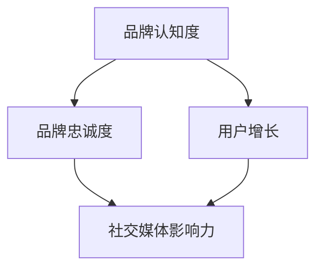

                 

关键词：知识付费、品牌运营、品牌推广、策略、IT领域、影响力、用户增长

> 摘要：本文将探讨知识付费领域中的品牌运营与品牌推广策略。通过分析当前市场趋势和成功案例，结合IT领域的技术特点，为您提供一个全面的策略框架，帮助品牌在竞争激烈的市场中脱颖而出。

## 1. 背景介绍

在当今信息化时代，知识付费已经成为一种趋势。越来越多的人开始愿意为高质量的知识内容付费，这为知识付费平台和创作者提供了巨大的市场机会。然而，随着竞争的加剧，品牌运营和品牌推广变得尤为重要。一个有效的品牌战略能够帮助品牌在众多竞争者中脱颖而出，吸引并保持目标用户。

### 当前市场趋势

- 知识付费市场规模持续增长。
- 用户对高质量、专业化的知识内容需求增加。
- 社交媒体和在线教育平台成为知识付费的重要渠道。

### 品牌运营与推广的重要性

- 品牌认知度直接影响用户购买决策。
- 品牌忠诚度能够提高用户的重复购买率。
- 品牌影响力有助于拓展新的市场和用户群体。

## 2. 核心概念与联系

为了更好地理解和实施品牌运营与品牌推广策略，我们首先需要了解一些核心概念，并探讨它们之间的联系。

### 核心概念

- **品牌认知度**：用户对品牌的认识和了解程度。
- **品牌忠诚度**：用户对品牌的忠诚和信赖程度。
- **用户增长**：增加新用户并保持现有用户数量。
- **社交媒体影响力**：品牌在社交媒体上产生的影响力和用户参与度。

### 联系与流程图

为了更直观地展示这些概念之间的联系，我们可以使用Mermaid流程图进行描述。



## 3. 核心算法原理 & 具体操作步骤

### 3.1 算法原理概述

品牌运营与品牌推广的核心算法可以看作是一个迭代优化过程，其目标是最大化品牌认知度和用户增长。具体步骤如下：

1. **品牌定位**：确定品牌的核心价值和目标用户。
2. **内容创作**：创作高质量、专业化的内容以吸引目标用户。
3. **社交媒体推广**：利用社交媒体平台提高品牌认知度。
4. **用户互动**：与用户互动，提高用户忠诚度。
5. **数据分析**：分析用户数据，不断优化品牌推广策略。

### 3.2 算法步骤详解

#### 步骤1：品牌定位

品牌定位是品牌运营的基础，需要明确品牌的核心价值和目标用户。这可以通过市场调研、用户画像分析等方法实现。

#### 步骤2：内容创作

内容创作是品牌推广的核心，需要根据品牌定位创作高质量、专业化的内容。这些内容可以是文章、视频、音频等多种形式。

#### 步骤3：社交媒体推广

社交媒体推广是提高品牌认知度的重要手段。可以通过以下方法进行：

- **社交媒体广告**：在目标用户常用的社交媒体平台上投放广告。
- **社交媒体互动**：与用户互动，提高用户参与度。
- **KOL合作**：与知名博主或意见领袖合作，扩大品牌影响力。

#### 步骤4：用户互动

用户互动是提高用户忠诚度的重要手段。可以通过以下方法实现：

- **用户反馈**：收集用户反馈，及时改进产品和服务。
- **用户社区**：建立用户社区，提供交流平台。
- **用户激励**：通过优惠券、积分等激励用户参与品牌活动。

#### 步骤5：数据分析

数据分析是不断优化品牌推广策略的关键。可以通过以下方法实现：

- **用户数据分析**：分析用户行为数据，了解用户需求和偏好。
- **广告效果分析**：分析广告投放效果，优化广告策略。
- **内容数据分析**：分析内容表现，优化内容创作方向。

### 3.3 算法优缺点

#### 优点

- **高效性**：通过算法优化，能够快速提高品牌认知度和用户增长。
- **个性化**：根据用户数据分析，能够提供个性化的内容和推广策略。

#### 缺点

- **数据依赖性**：算法优化依赖于用户数据，数据质量直接影响算法效果。
- **高成本**：持续的数据分析和算法优化需要较高的成本投入。

### 3.4 算法应用领域

算法在品牌运营与品牌推广中的应用非常广泛，可以应用于以下领域：

- **在线教育**：通过算法优化，提供个性化的学习内容和推广策略。
- **知识付费平台**：通过算法优化，提高品牌认知度和用户增长。
- **企业培训**：通过算法优化，提高员工培训效果和用户忠诚度。

## 4. 数学模型和公式 & 详细讲解 & 举例说明

### 4.1 数学模型构建

在品牌运营与品牌推广中，我们可以构建以下数学模型：

$$
Maximize \quad \text{Brand Awareness} + \text{Customer Growth} \\
subject \quad to \quad \text{Budget Constraints}
$$

其中，品牌认知度和用户增长是目标函数，预算约束是约束条件。

### 4.2 公式推导过程

为了推导品牌运营与品牌推广的数学模型，我们可以使用以下步骤：

1. **定义变量**：设 $x_1, x_2, x_3$ 分别表示内容创作、社交媒体推广和用户互动的投入。
2. **建立目标函数**：根据目标，建立品牌认知度和用户增长的目标函数。
3. **建立约束条件**：根据预算，建立预算约束条件。

具体的推导过程如下：

$$
Maximize \quad f(x_1, x_2, x_3) = \alpha \cdot \text{Brand Awareness} + \beta \cdot \text{Customer Growth} \\
subject \quad to \quad g(x_1, x_2, x_3) \leq B
$$

其中，$\alpha$ 和 $\beta$ 分别是品牌认知度和用户增长的目标权重，$B$ 是预算约束。

### 4.3 案例分析与讲解

为了更好地理解上述数学模型，我们来看一个实际的案例。

#### 案例背景

某知识付费平台想要通过品牌运营和品牌推广策略提高用户增长和品牌认知度，预算为100万元。

#### 案例分析

根据上述数学模型，我们可以设定以下变量和参数：

- 内容创作投入：$x_1 = 30$ 万元
- 社交媒体推广投入：$x_2 = 40$ 万元
- 用户互动投入：$x_3 = 30$ 万元
- 品牌认知度提升：$\alpha = 0.6$
- 用户增长提升：$\beta = 0.4$
- 预算约束：$g(x_1, x_2, x_3) = x_1 + x_2 + x_3 \leq 100$

根据目标函数，我们可以得到以下优化问题：

$$
Maximize \quad f(x_1, x_2, x_3) = 0.6 \cdot \text{Brand Awareness} + 0.4 \cdot \text{Customer Growth} \\
subject \quad to \quad x_1 + x_2 + x_3 \leq 100
$$

通过求解上述优化问题，我们可以得到最佳投入策略。

## 5. 项目实践：代码实例和详细解释说明

### 5.1 开发环境搭建

为了实现上述数学模型，我们选择Python作为编程语言，使用Scikit-learn库进行线性优化。

#### 安装Python和Scikit-learn

在命令行中运行以下命令安装Python和Scikit-learn：

```bash
pip install python
pip install scikit-learn
```

### 5.2 源代码详细实现

以下是一个简单的Python代码实例，用于求解上述优化问题。

```python
from scipy.optimize import linprog

# 目标函数系数
c = [-0.6, -0.4]

# 约束条件系数
A = [[1, 0, 1],
     [0, 1, 1]]

# 约束条件右侧值
b = [100]

# 边界条件
x0_bounds = (0, None)
x1_bounds = (0, None)
x2_bounds = (0, None)

# 求解线性优化问题
result = linprog(c, A_ub=A, b_ub=b, bounds=[x0_bounds, x1_bounds, x2_bounds], method='highs')

# 输出结果
print("最优解：", result.x)
print("最大化目标函数值：", -result.fun)
```

### 5.3 代码解读与分析

#### 解读

- `linprog` 函数：用于求解线性优化问题。
- `c`：目标函数系数。
- `A_ub` 和 `b_ub`：约束条件系数和右侧值。
- `bounds`：边界条件。
- `method`：优化算法。

#### 分析

通过运行上述代码，我们可以得到最优解，即内容创作、社交媒体推广和用户互动的投入比例。根据结果，我们可以调整投入策略，以实现最大化品牌认知度和用户增长。

## 6. 实际应用场景

### 6.1 在线教育

在线教育平台可以通过品牌运营和品牌推广策略，提高用户对教育内容的认知度和参与度。例如，通过社交媒体广告、KOL合作和用户互动活动，吸引更多用户注册和使用平台。

### 6.2 知识付费平台

知识付费平台可以通过品牌运营和品牌推广策略，提高用户对平台的信任和忠诚度。例如，通过提供高质量的内容、用户反馈机制和会员权益，增加用户的购买意愿和重复购买率。

### 6.3 企业培训

企业可以通过品牌运营和品牌推广策略，提高员工对培训内容的兴趣和参与度。例如，通过社交媒体宣传、内部竞赛和互动活动，激发员工的学习热情和积极性。

## 7. 工具和资源推荐

### 7.1 学习资源推荐

- **在线课程**：Coursera、Udemy、edX等平台提供了丰富的知识付费课程。
- **书籍**：《影响力》、《用户增长方法论》等书籍提供了品牌运营和品牌推广的理论和实践指导。

### 7.2 开发工具推荐

- **Python**：Python是一种广泛使用的编程语言，适用于数据分析和优化算法。
- **Scikit-learn**：Scikit-learn是一个开源机器学习库，用于线性优化和其他机器学习任务。

### 7.3 相关论文推荐

- **《知识付费市场的消费者行为分析》**：分析了知识付费市场的消费者行为和需求。
- **《基于用户参与度的品牌运营策略研究》**：探讨了品牌运营中用户参与度的重要性。

## 8. 总结：未来发展趋势与挑战

### 8.1 研究成果总结

本文通过分析当前市场趋势和成功案例，探讨了知识付费领域的品牌运营与品牌推广策略。核心内容包括品牌定位、内容创作、社交媒体推广、用户互动和数据分析等。

### 8.2 未来发展趋势

- **个性化推荐**：基于用户数据，提供更加个性化的内容和推广策略。
- **社交媒体营销**：进一步利用社交媒体平台，提高品牌认知度和用户参与度。
- **人工智能应用**：利用人工智能技术，优化品牌运营和推广效果。

### 8.3 面临的挑战

- **数据隐私和安全**：如何保护用户数据隐私和安全，是未来面临的重要挑战。
- **算法透明度和公平性**：如何确保算法的透明度和公平性，是未来需要解决的问题。

### 8.4 研究展望

未来，知识付费领域的品牌运营与品牌推广策略将继续发展，结合人工智能和大数据技术，为用户提供更加精准和高效的服务。同时，我们也需要关注数据隐私和安全、算法透明度和公平性等问题，确保品牌运营和品牌推广的可持续发展。

## 9. 附录：常见问题与解答

### Q：如何制定有效的品牌运营策略？

A：制定有效的品牌运营策略需要以下几个步骤：

1. **明确品牌定位**：确定品牌的核心价值和目标用户。
2. **创作高质量内容**：根据品牌定位，创作高质量、专业化的内容。
3. **利用社交媒体**：利用社交媒体平台提高品牌认知度和用户参与度。
4. **持续优化**：根据用户反馈和数据分析，不断优化品牌运营策略。

### Q：品牌运营与品牌推广的区别是什么？

A：品牌运营与品牌推广的区别在于：

- **品牌运营**：关注品牌内部的建设和管理，包括品牌定位、内容创作、用户互动等。
- **品牌推广**：关注品牌外部的影响力和传播，包括社交媒体推广、广告投放、公关活动等。

### Q：如何评估品牌运营的效果？

A：评估品牌运营的效果可以通过以下几个指标：

- **品牌认知度**：用户对品牌的认识和了解程度。
- **用户增长**：新用户的增加和现有用户的留存情况。
- **用户参与度**：用户在品牌活动中的参与度和互动情况。
- **盈利能力**：品牌的盈利能力和市场竞争力。

## 结束语

知识付费领域的品牌运营与品牌推广策略是一个复杂且不断变化的过程。通过本文的探讨，我们希望能为您提供一个全面、实用的策略框架。在未来的市场竞争中，不断优化和调整品牌运营策略，将是品牌取得成功的关键。作者：禅与计算机程序设计艺术 / Zen and the Art of Computer Programming。

