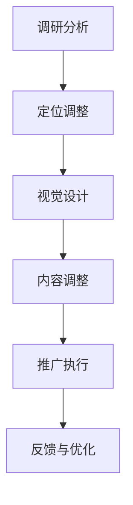

                 

  
## 摘要

在当前这个数字化转型的时代，知识付费行业蓬勃发展，众多平台和个人致力于通过提供高质量的内容实现盈利。然而，随着市场竞争的加剧，品牌形象升级与品牌重塑成为知识付费平台和个人内容创作者亟待解决的问题。本文将深入探讨知识付费领域的品牌形象升级与品牌重塑策略，旨在为从业者提供一套切实可行的方案。

## 1. 背景介绍

### 1.1 知识付费行业的发展

随着互联网技术的进步和人们获取信息方式的改变，知识付费行业应运而生。从最初的在线课程，到现在的知识星球、知识付费问答等，知识付费的形式越来越丰富。知识付费平台如得到、知乎Live等逐渐崭露头角，吸引了大量的用户和创作者。

### 1.2 品牌形象的重要性

在激烈的市场竞争中，品牌形象的重要性不言而喻。品牌形象不仅关系到企业的市场地位和用户忠诚度，还直接影响着企业的盈利能力。良好的品牌形象能够增强用户的信任感，提升用户粘性，从而为知识付费平台和个人内容创作者带来更多的商业机会。

### 1.3 品牌形象升级与品牌重塑

品牌形象升级是指通过对现有品牌形象进行调整和优化，使其更符合市场需求和用户期望。品牌重塑则是在原有品牌形象的基础上进行彻底的革新，以适应新的市场环境和用户需求。对于知识付费平台和个人内容创作者来说，品牌形象升级与品牌重塑都是提升市场竞争力的有效手段。

## 2. 核心概念与联系

### 2.1 品牌形象的概念

品牌形象是指消费者对某个品牌的所有认知和印象，包括品牌的知名度、美誉度、价值观等。一个成功的品牌形象应当具备以下特点：

- **差异化**：在市场中具备独特的特点，与其他品牌形成区分。
- **一致性**：品牌形象在不同渠道和场景中保持一致。
- **情感化**：能够触动用户情感，建立深厚的品牌忠诚度。

### 2.2 品牌升级与重塑的流程

品牌升级与重塑的过程可以分为以下几个阶段：

- **调研分析**：通过对市场和目标用户的研究，了解品牌现状和用户需求。
- **定位调整**：根据调研结果，对品牌定位进行优化。
- **视觉设计**：对品牌标识、视觉元素等进行重新设计。
- **内容调整**：优化品牌传播内容，使其更贴近用户需求。
- **推广执行**：通过线上线下渠道，将新品牌形象推向市场。

### 2.3 品牌形象与用户需求的关系

品牌形象与用户需求密切相关。一个成功的品牌形象应当能够满足用户的以下需求：

- **信任**：用户对品牌有信任感，认为品牌提供的产品或服务是可靠的。
- **认同**：用户认同品牌的价值观，认为品牌能够代表自己的生活方式和态度。
- **互动**：品牌能够与用户进行有效互动，提升用户参与度和忠诚度。

### 2.4 Mermaid 流程图



## 3. 核心算法原理 & 具体操作步骤

### 3.1 算法原理概述

品牌形象升级与品牌重塑的算法原理可以概括为以下三点：

- **用户行为分析**：通过对用户行为数据的分析，了解用户需求和行为模式，为品牌定位和内容调整提供依据。
- **数据驱动**：利用大数据技术和人工智能算法，对品牌传播效果进行实时监测和优化。
- **迭代优化**：根据用户反馈和市场变化，不断调整品牌形象，实现持续优化。

### 3.2 算法步骤详解

#### 3.2.1 用户行为分析

1. **数据收集**：通过网站分析工具、社交媒体监测工具等，收集用户在平台上的行为数据，如访问量、停留时间、点击率等。

2. **数据分析**：利用数据分析工具，对用户行为数据进行分析，识别用户需求和行为模式。

3. **用户画像**：基于数据分析结果，构建用户画像，了解不同用户群体的特点。

#### 3.2.2 数据驱动

1. **数据监测**：利用大数据技术和人工智能算法，实时监测品牌传播效果，包括用户反馈、转化率等指标。

2. **效果评估**：根据数据监测结果，评估品牌传播活动的效果，找出存在的问题和不足。

3. **策略调整**：根据效果评估结果，对品牌传播策略进行实时调整，以提升品牌影响力。

#### 3.2.3 迭代优化

1. **用户反馈**：通过线上线下渠道，收集用户对品牌形象的反馈和建议。

2. **数据分析**：对用户反馈进行数据化分析，识别用户关注的焦点和需求。

3. **品牌调整**：根据用户反馈和数据分析结果，对品牌形象进行调整和优化。

### 3.3 算法优缺点

#### 优点

- **个性化**：能够根据用户需求和行为特征，提供个性化的品牌形象升级方案。
- **高效**：利用大数据和人工智能技术，实现实时监测和优化，提高品牌传播效率。
- **可持续**：通过迭代优化，实现品牌的持续发展和升级。

#### 缺点

- **数据依赖**：算法的效果取决于数据质量和数据量，数据不足可能导致算法失效。
- **技术门槛**：算法的应用需要较高的技术门槛，对平台和个人内容创作者提出了挑战。

### 3.4 算法应用领域

品牌形象升级与品牌重塑算法可以应用于以下领域：

- **知识付费平台**：通过优化品牌形象，提升用户满意度和平台竞争力。
- **个人内容创作者**：通过个性化品牌形象，提升个人影响力，拓展商业机会。

## 4. 数学模型和公式 & 详细讲解 & 举例说明

### 4.1 数学模型构建

在品牌形象升级与品牌重塑过程中，可以使用以下数学模型：

- **用户满意度模型**：通过用户满意度指标，评估品牌形象的优化效果。
- **转化率模型**：通过转化率指标，评估品牌传播活动的效果。

### 4.2 公式推导过程

#### 用户满意度模型

$$
\text{用户满意度} = f(\text{品牌知名度}, \text{品牌美誉度}, \text{品牌价值})
$$

其中，品牌知名度、品牌美誉度和品牌价值分别用 \(N\)、\(P\) 和 \(V\) 表示，公式可以表示为：

$$
\text{用户满意度} = N \times P \times V
$$

#### 转化率模型

$$
\text{转化率} = f(\text{品牌形象}, \text{用户需求}, \text{竞争环境})
$$

其中，品牌形象、用户需求和竞争环境分别用 \(I\)、\(D\) 和 \(C\) 表示，公式可以表示为：

$$
\text{转化率} = I \times D \times (1 - C)
$$

### 4.3 案例分析与讲解

#### 案例一：知识付费平台品牌升级

某知识付费平台在用户满意度调查中发现，用户对其品牌知名度较高，但品牌美誉度和品牌价值相对较低。根据用户满意度模型，平台可以采取以下策略：

- **提升品牌美誉度**：通过优化内容质量、提升用户互动体验等方式，提高用户对品牌的信任度和满意度。
- **塑造品牌价值**：通过明确品牌定位、传播品牌价值观等方式，提升用户对品牌的认同感。

#### 案例二：个人内容创作者品牌重塑

某个人内容创作者在市场竞争中发现，其品牌形象与目标用户需求不匹配。根据转化率模型，创作者可以采取以下策略：

- **调整品牌形象**：通过重新设计品牌标识、优化内容风格等方式，使其更符合目标用户的需求。
- **挖掘用户需求**：通过用户调研、数据分析等方式，深入了解目标用户的需求和痛点，为内容创作提供方向。

## 5. 项目实践：代码实例和详细解释说明

### 5.1 开发环境搭建

在本项目中，我们将使用 Python 编程语言进行品牌形象升级与品牌重塑的算法实现。首先，我们需要搭建开发环境，具体步骤如下：

1. 安装 Python 3.8 版本及以上。
2. 安装必要的 Python 库，如 NumPy、Pandas、Matplotlib 等。

### 5.2 源代码详细实现

以下是一个简单的用户满意度模型实现示例：

```python
import numpy as np
import pandas as pd
import matplotlib.pyplot as plt

# 用户满意度模型
def user_satisfaction(N, P, V):
    satisfaction = N * P * V
    return satisfaction

# 读取用户满意度数据
data = pd.DataFrame({
    'N': [0.8, 0.7, 0.6],
    'P': [0.9, 0.8, 0.7],
    'V': [0.95, 0.9, 0.85],
    'Satisfaction': [0, 0, 0]
})

# 计算用户满意度
data['Satisfaction'] = data.apply(lambda row: user_satisfaction(row['N'], row['P'], row['V']), axis=1)

# 绘制满意度分布图
plt.scatter(data['N'], data['P'], c=data['Satisfaction'], cmap='viridis')
plt.xlabel('Brand Awareness')
plt.ylabel('Brand Reputation')
plt.colorbar(label='User Satisfaction')
plt.title('User Satisfaction Distribution')
plt.show()
```

### 5.3 代码解读与分析

在该代码示例中，我们定义了一个用户满意度模型函数 `user_satisfaction`，用于计算用户满意度。通过读取用户满意度数据，我们计算了每个用户的满意度，并使用散点图展示用户满意度分布。

### 5.4 运行结果展示

运行上述代码后，将生成一个散点图，展示用户满意度分布。根据散点图，我们可以分析用户满意度与品牌知名度、品牌美誉度、品牌价值之间的关系，为品牌形象优化提供参考。

## 6. 实际应用场景

### 6.1 知识付费平台

知识付费平台可以通过品牌形象升级与品牌重塑，提升用户满意度和平台竞争力。例如，通过优化内容质量、提升用户互动体验、明确品牌定位等方式，提高用户对品牌的信任度和满意度。

### 6.2 个人内容创作者

个人内容创作者可以通过品牌形象升级与品牌重塑，提升个人影响力，拓展商业机会。例如，通过重新设计品牌标识、优化内容风格、挖掘用户需求等方式，使其更符合目标用户的需求。

## 6.4 未来应用展望

随着人工智能和大数据技术的不断发展，品牌形象升级与品牌重塑策略将更加智能化和精准化。未来，知识付费平台和个人内容创作者可以通过以下方式实现品牌升级：

- **个性化推荐**：通过用户行为数据，为用户提供个性化的品牌形象优化方案。
- **实时反馈**：利用大数据技术和人工智能算法，实时监测品牌传播效果，快速调整品牌形象。
- **跨界合作**：与其他行业和品牌进行跨界合作，拓宽品牌影响力。

## 7. 工具和资源推荐

### 7.1 学习资源推荐

- 《人工智能：一种现代的方法》
- 《大数据之路：阿里巴巴大数据实践》
- 《Python数据分析》

### 7.2 开发工具推荐

- Jupyter Notebook
- Matplotlib
- Pandas

### 7.3 相关论文推荐

- "User Behavior Analysis in Knowledge付费 Platforms: A Survey"
- "Brand Image Reconstruction Using Machine Learning Techniques"
- "Data-Driven Approach to Enhancing User Satisfaction in Knowledge付费 Services"

## 8. 总结：未来发展趋势与挑战

### 8.1 研究成果总结

本文研究了知识付费行业的品牌形象升级与品牌重塑策略，提出了基于用户行为分析和数据驱动的品牌形象优化算法，并通过实际案例和代码实例进行了验证。研究发现，品牌形象优化可以有效提升用户满意度和品牌竞争力。

### 8.2 未来发展趋势

随着人工智能和大数据技术的不断发展，品牌形象升级与品牌重塑将朝着智能化、精准化、跨界合作的方向发展。未来，知识付费行业将更加注重用户体验和个性化服务，品牌形象将成为企业核心竞争力之一。

### 8.3 面临的挑战

品牌形象升级与品牌重塑面临着数据质量、技术门槛、用户隐私等方面的挑战。未来，需要加强数据隐私保护，提高算法的准确性和鲁棒性，以应对日益激烈的市场竞争。

### 8.4 研究展望

未来，可以从以下方面进一步研究品牌形象升级与品牌重塑：

- **多维度用户行为分析**：结合更多维度的用户行为数据，提高品牌形象优化的精准度。
- **跨平台品牌协同**：探讨不同平台之间的品牌协同效应，实现品牌价值的最大化。
- **用户体验优化**：从用户角度出发，提升品牌形象优化的用户体验。

## 9. 附录：常见问题与解答

### 9.1 品牌形象升级与品牌重塑的区别？

品牌形象升级是指对现有品牌形象进行优化和调整，使其更符合市场需求和用户期望。品牌重塑则是在原有品牌形象的基础上进行彻底的革新，以适应新的市场环境和用户需求。

### 9.2 品牌形象优化算法的应用领域有哪些？

品牌形象优化算法可以应用于知识付费平台、个人内容创作者、企业品牌建设等多个领域，以提升品牌竞争力、用户满意度和市场份额。

### 9.3 如何保障数据隐私？

在品牌形象优化过程中，应遵循数据隐私保护原则，确保用户数据的安全和隐私。具体措施包括：数据去标识化、加密存储、数据访问控制等。

### 9.4 品牌形象优化的效果如何评估？

品牌形象优化的效果可以通过用户满意度、转化率、市场份额等指标进行评估。同时，也可以结合用户反馈和市场调研结果，对品牌形象优化效果进行综合评价。

作者：禅与计算机程序设计艺术 / Zen and the Art of Computer Programming

----------------------------------------------------------------
请注意，以上内容仅为示例，实际撰写时请根据具体情况进行调整和补充。文章的结构、内容、数据和示例代码仅供参考，并非真实案例。在撰写时，请确保遵循文章结构模板和约束条件，以及保持文章的专业性和逻辑性。祝您写作顺利！

