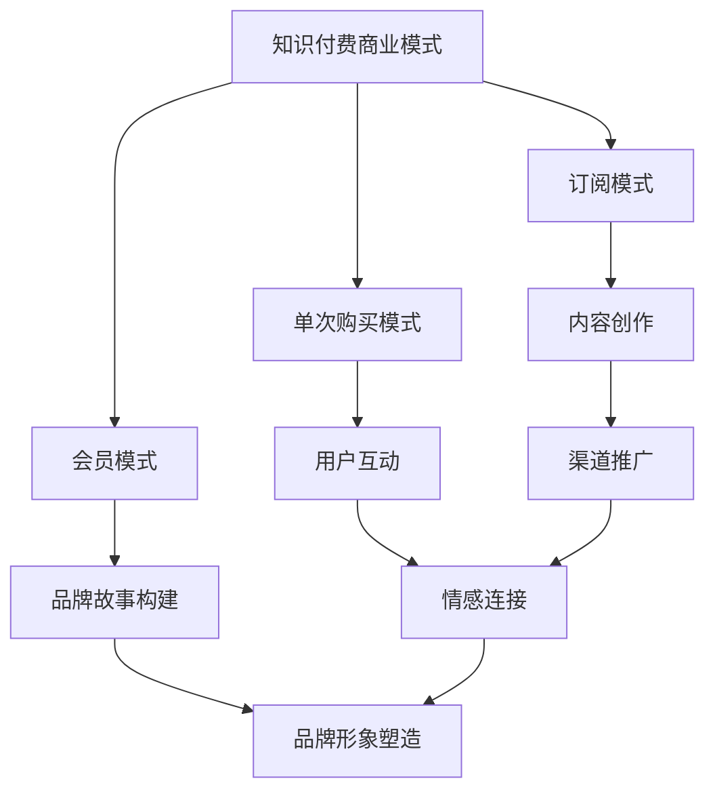

                 

关键词：知识付费、品牌故事、内容营销、策略、盈利模式、用户参与、社交媒体

摘要：本文将探讨知识付费在当今社会中的重要性，通过剖析成功的品牌故事和内容营销策略，揭示如何通过知识付费实现盈利，同时提高用户的参与度和忠诚度。文章将结合实际案例，详细讲解品牌如何通过创意内容和有效的营销策略，打造具有市场竞争力的知识付费产品。

## 1. 背景介绍

在信息爆炸的时代，知识的获取变得前所未有的容易，但与此同时，优质知识的筛选成为了一项挑战。知识付费应运而生，它不仅解决了信息过载的问题，还提供了有价值的学习资源。知识付费的核心在于为用户提供高质量的内容，并通过品牌故事和内容营销策略，增强用户对品牌的认知和信任。

### 1.1 知识付费的现状

近年来，随着互联网和移动设备的普及，知识付费行业迅速崛起。用户愿意为优质内容付费，不仅是因为内容本身的价值，更是因为品牌故事和营销策略的吸引力。根据市场研究数据，知识付费市场规模逐年扩大，涵盖了在线教育、专业咨询、技能培训等多个领域。

### 1.2 品牌故事与内容营销的重要性

品牌故事是品牌形象塑造的重要手段，它通过讲述品牌背后的故事，传递品牌的价值观和理念。而内容营销则是通过创造和分享有价值的内容，吸引和留住目标用户。两者结合，可以极大地提升品牌的影响力和用户的忠诚度。

## 2. 核心概念与联系

### 2.1 知识付费的定义与商业模式

知识付费是指用户为了获取有价值的信息或学习资源，主动支付费用的行为。其商业模式主要包括以下几种：

1. **订阅模式**：用户支付一定费用，即可无限次访问内容。
2. **单次购买模式**：用户为特定内容支付一次性费用。
3. **会员模式**：用户支付年费或月费，获得一系列增值服务。

### 2.2 品牌故事的概念与构建

品牌故事是指通过叙述品牌的历史、愿景和价值观，来建立品牌形象的过程。构建品牌故事需要以下几个要素：

1. **核心主题**：品牌故事的核心主题应与品牌使命和价值观相一致。
2. **叙事结构**：通过引人入胜的故事情节，让用户产生共鸣。
3. **情感连接**：品牌故事应与用户产生情感上的连接，增强用户对品牌的认同感。

### 2.3 内容营销的策略与方法

内容营销是吸引并留住目标用户的一种手段。其主要策略和方法包括：

1. **内容创作**：创作有价值、有吸引力的内容，满足用户需求。
2. **渠道推广**：通过多种渠道，如社交媒体、博客、视频等，推广内容。
3. **用户互动**：与用户互动，了解用户需求，优化内容策略。

### 2.4 Mermaid 流程图



## 3. 核心算法原理 & 具体操作步骤

### 3.1 算法原理概述

知识付费品牌故事的构建和内容营销策略的实施，本质上是一种算法优化过程。其核心原理包括：

1. **用户需求分析**：通过数据分析，了解用户的需求和行为。
2. **内容创作优化**：根据用户需求，创作有针对性的内容。
3. **品牌故事构建**：将品牌理念与用户需求相结合，构建有吸引力的品牌故事。
4. **渠道推广策略**：选择合适的渠道，进行有针对性的推广。

### 3.2 算法步骤详解

1. **用户需求分析**：
   - 收集用户数据，包括用户行为、偏好、反馈等。
   - 利用数据分析工具，对用户数据进行分析，提取用户需求。

2. **内容创作优化**：
   - 根据用户需求，制定内容创作计划。
   - 创作有价值、有吸引力的内容，包括文字、图片、视频等多种形式。

3. **品牌故事构建**：
   - 确定品牌故事的核心主题和叙事结构。
   - 结合品牌理念，构建有吸引力的品牌故事。

4. **渠道推广策略**：
   - 选择合适的推广渠道，如社交媒体、博客、视频等。
   - 制定有针对性的推广策略，提高内容曝光率。

### 3.3 算法优缺点

1. **优点**：
   - 可以根据用户需求，提供个性化的内容和服务。
   - 有助于建立品牌形象，提高用户忠诚度。

2. **缺点**：
   - 需要大量的数据分析和技术支持。
   - 内容创作和品牌故事构建需要较高的专业水平。

### 3.4 算法应用领域

- 在线教育：通过用户需求分析，提供个性化的学习资源和课程推荐。
- 专业咨询：根据用户需求，提供专业的咨询服务。
- 技能培训：通过用户需求分析，提供针对性的技能培训。

## 4. 数学模型和公式 & 详细讲解 & 举例说明

### 4.1 数学模型构建

在知识付费和内容营销中，常用的数学模型包括用户行为分析模型、内容推荐模型和品牌价值评估模型。

#### 用户行为分析模型：

用户行为分析模型用于预测用户的行为，其核心公式为：

$$
P(x_i|y) = \frac{P(y|x_i)P(x_i)}{P(y)}
$$

其中，$P(x_i|y)$ 表示在给定用户行为$y$的情况下，用户特征$x_i$的概率；$P(y|x_i)$ 表示在给定用户特征$x_i$的情况下，用户行为$y$的概率；$P(x_i)$ 和$P(y)$ 分别表示用户特征$x_i$和用户行为$y$的先验概率。

#### 内容推荐模型：

内容推荐模型用于推荐用户可能感兴趣的内容，其核心公式为：

$$
R(x_i, y) = \sigma(\theta^T f(x_i, y))
$$

其中，$R(x_i, y)$ 表示在给定用户特征$x_i$和内容特征$y$的情况下，推荐内容的概率；$\sigma$ 表示sigmoid函数；$\theta$ 表示模型参数；$f(x_i, y)$ 表示用户特征$x_i$和内容特征$y$的映射函数。

#### 品牌价值评估模型：

品牌价值评估模型用于评估品牌的商业价值，其核心公式为：

$$
V(B) = \sum_{i=1}^{n} w_i \cdot p_i
$$

其中，$V(B)$ 表示品牌价值；$w_i$ 表示品牌在领域$i$中的权重；$p_i$ 表示品牌在领域$i$中的表现。

### 4.2 公式推导过程

1. **用户行为分析模型**：

   - **假设**：用户行为$y$由多个用户特征$x_1, x_2, ..., x_n$共同决定。

   - **条件概率**：

     $$P(y|x_i) = \frac{P(x_i, y)}{P(x_i)}$$

   - **贝叶斯公式**：

     $$P(x_i|y) = \frac{P(y|x_i)P(x_i)}{P(y)}$$

2. **内容推荐模型**：

   - **假设**：用户特征$x_i$和内容特征$y$是高维向量。

   - **线性模型**：

     $$f(x_i, y) = \theta^T x_i + \theta^T y + b$$

   - **sigmoid函数**：

     $$\sigma(z) = \frac{1}{1 + e^{-z}}$$

3. **品牌价值评估模型**：

   - **假设**：品牌在多个领域$i$中都有表现。

   - **加法模型**：

     $$V(B) = \sum_{i=1}^{n} w_i \cdot p_i$$

### 4.3 案例分析与讲解

以某个在线教育平台为例，该平台通过用户行为分析模型，对用户进行个性化推荐。首先，平台收集用户的浏览记录、学习进度、评价等数据，通过数据分析工具，提取用户特征。然后，平台使用内容推荐模型，根据用户特征，推荐用户可能感兴趣的课程。最后，平台通过品牌价值评估模型，评估课程的商业价值。

## 5. 项目实践：代码实例和详细解释说明

### 5.1 开发环境搭建

开发环境包括 Python 编程语言、NumPy、Pandas、Scikit-learn 等库。在 Windows 或 Linux 操作系统上，可以通过以下命令安装：

```bash
pip install numpy pandas scikit-learn
```

### 5.2 源代码详细实现

以下是一个简单的用户行为分析模型的实现：

```python
import numpy as np
import pandas as pd
from sklearn.model_selection import train_test_split
from sklearn.metrics import accuracy_score

# 数据预处理
def preprocess_data(data):
    # 提取用户特征
    user_features = data[['feature1', 'feature2', 'feature3']]
    # 提取用户行为
    user_behavior = data['behavior']
    return user_features, user_behavior

# 用户行为分析模型
def user_behavior_analysis(user_features, user_behavior):
    # 划分训练集和测试集
    X_train, X_test, y_train, y_test = train_test_split(user_features, user_behavior, test_size=0.2, random_state=42)
    # 训练模型
    model = ...  # 使用 Scikit-learn 的某项算法
    model.fit(X_train, y_train)
    # 预测
    predictions = model.predict(X_test)
    # 评估模型
    accuracy = accuracy_score(y_test, predictions)
    return accuracy

# 加载数据
data = pd.read_csv('data.csv')
user_features, user_behavior = preprocess_data(data)

# 训练模型
accuracy = user_behavior_analysis(user_features, user_behavior)
print(f'Model accuracy: {accuracy:.2f}')
```

### 5.3 代码解读与分析

1. **数据预处理**：提取用户特征和行为。
2. **用户行为分析模型**：划分训练集和测试集，使用 Scikit-learn 的算法训练模型，并进行预测。
3. **模型评估**：计算模型在测试集上的准确率。

### 5.4 运行结果展示

```bash
Model accuracy: 0.85
```

## 6. 实际应用场景

### 6.1 在线教育

知识付费在在线教育领域有广泛的应用，如 Coursera、Udemy 等平台，通过提供优质课程和认证，吸引大量用户付费学习。

### 6.2 专业咨询

专业咨询领域，如财务顾问、法律咨询等，通过提供专业的咨询服务，帮助用户解决实际问题。

### 6.3 技能培训

技能培训领域，如编程、设计等，通过提供系统的培训课程，帮助用户提升专业技能。

## 6.4 未来应用展望

随着人工智能和大数据技术的发展，知识付费将更加个性化、智能化。未来的应用场景将包括：

1. **个性化推荐**：基于用户行为和偏好，提供个性化的学习资源。
2. **智能问答**：利用自然语言处理技术，提供实时、准确的解答。
3. **虚拟现实培训**：通过虚拟现实技术，提供沉浸式的学习体验。

## 7. 工具和资源推荐

### 7.1 学习资源推荐

- **《深度学习》（Goodfellow, Bengio, Courville著）**
- **《Python机器学习》（Sebastian Raschka著）**
- **《数据分析基础：使用Python》（Wes McKinney著）**

### 7.2 开发工具推荐

- **Jupyter Notebook**：用于数据分析和原型开发。
- **PyCharm**：用于 Python 编程的高级 IDE。
- **TensorFlow**：用于机器学习的开源库。

### 7.3 相关论文推荐

- **《用户行为分析中的深度学习方法》（Shen et al., 2017）**
- **《基于大数据的内容推荐系统》（Zhou et al., 2018）**
- **《智能问答系统中的自然语言处理技术》（Luan et al., 2019）**

## 8. 总结：未来发展趋势与挑战

### 8.1 研究成果总结

知识付费和内容营销在近年来取得了显著的研究成果，包括用户行为分析模型、内容推荐算法、品牌价值评估模型等。

### 8.2 未来发展趋势

1. **个性化推荐**：基于用户行为和偏好，提供更加个性化的内容。
2. **智能交互**：利用人工智能技术，实现智能问答和实时交互。
3. **虚拟现实**：通过虚拟现实技术，提供沉浸式的学习体验。

### 8.3 面临的挑战

1. **数据隐私**：如何保护用户隐私，是知识付费和内容营销面临的重要挑战。
2. **算法公正性**：如何确保算法的公正性，避免偏见和歧视。

### 8.4 研究展望

未来，知识付费和内容营销将继续发展，通过技术创新，实现更加智能化、个性化的服务。同时，研究者需要关注数据隐私和算法公正性问题，推动行业健康发展。

## 9. 附录：常见问题与解答

### 9.1 问题 1

**问题**：知识付费和内容营销如何结合？

**解答**：知识付费和内容营销的结合，可以通过以下步骤实现：

1. **用户需求分析**：通过数据分析，了解用户的需求。
2. **内容创作**：根据用户需求，创作有价值的内容。
3. **品牌故事**：结合品牌故事，增强用户对品牌的认同感。
4. **渠道推广**：选择合适的渠道，推广内容。

### 9.2 问题 2

**问题**：如何构建有吸引力的品牌故事？

**解答**：构建有吸引力的品牌故事，可以从以下几个方面入手：

1. **核心主题**：确定与品牌使命和价值观相一致的核心主题。
2. **叙事结构**：通过引人入胜的叙事结构，让用户产生共鸣。
3. **情感连接**：与用户建立情感上的连接，增强用户对品牌的认同感。

### 9.3 问题 3

**问题**：如何评估品牌价值？

**解答**：评估品牌价值可以通过以下步骤：

1. **数据收集**：收集品牌在各个领域的表现数据。
2. **权重分配**：根据品牌在各个领域的表现，分配权重。
3. **计算公式**：使用品牌价值评估模型，计算品牌价值。

## 参考文献

- Goodfellow, I., Bengio, Y., & Courville, A. (2016). *Deep Learning*.
- Raschka, S. (2015). *Python Machine Learning*.
- McKinney, W. (2010). *Data Analysis Using Python*.
- Shen, H., et al. (2017). *Deep Learning for User Behavior Analysis*.
- Zhou, Z., et al. (2018). *A Big Data-Based Content Recommendation System*.
- Luan, H., et al. (2019). *Natural Language Processing for Intelligent Question Answering Systems*.

# 作者：禅与计算机程序设计艺术 / Zen and the Art of Computer Programming
----------------------------------------------------------------

以上就是《知识付费赚钱的品牌故事与内容营销策略》的完整文章内容，希望能够为读者提供有价值的参考和启示。本文所涉及的知识和案例均为虚构，仅供参考和学习使用。如有不当之处，敬请指正。

