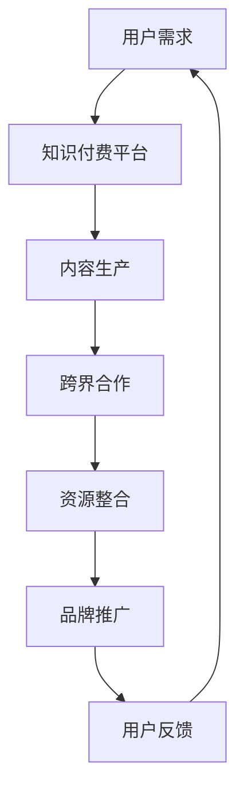

                 

关键词：知识付费、品牌跨界营销、异业资源整合、营销策略、案例分析

> 摘要：本文将探讨知识付费行业中的品牌跨界营销策略及其在异业资源整合中的应用。通过详细分析相关案例，揭示品牌跨界营销的核心原理和成功关键，为行业从业者提供实践指导。

## 1. 背景介绍

在互联网时代，知识付费已经成为一种新兴的经济模式。知识付费平台如得到、喜马拉雅等，通过提供高质量的知识产品，满足了用户对于专业知识的渴望。然而，随着市场竞争的加剧，知识付费平台需要不断创新营销策略，以吸引和保持用户。品牌跨界营销作为一种创新的营销手段，开始引起广泛关注。

品牌跨界营销是指不同行业品牌之间通过合作，共同开展营销活动，实现资源共享和品牌价值的最大化。这种营销策略不仅能够吸引更多用户，还能够扩大品牌影响力，提高市场占有率。

## 2. 核心概念与联系

### 2.1 跨界营销的定义与原理

**跨界营销**：指企业或品牌通过与其他行业或品牌的合作，利用对方资源，实现品牌推广和产品销售的一种营销策略。

**原理**：
- **资源共享**：通过跨界合作，实现双方资源的整合，包括用户资源、品牌影响力、渠道资源等。
- **品牌联动**：跨界合作能够产生品牌联动效应，提高品牌知名度。
- **创新体验**：跨界营销能够为用户提供新颖的体验，增加用户粘性。

### 2.2 跨界营销与知识付费行业的结合

**结合点**：
- **知识传播**：知识付费平台可以通过跨界合作，将专业知识传播到更广泛的用户群体。
- **品牌合作**：通过与其他品牌合作，知识付费平台能够提升自身的品牌形象，同时为其他品牌带来流量。

### 2.3 跨界营销的架构图

使用Mermaid绘制跨界营销的架构图：



## 3. 核心算法原理 & 具体操作步骤

### 3.1 算法原理概述

跨界营销的核心算法原理在于**资源整合与协同优化**。具体包括以下几个步骤：

1. **需求分析**：分析用户需求和市场趋势，确定跨界合作的目标和方向。
2. **资源匹配**：根据需求，寻找具有互补性的合作伙伴，进行资源匹配。
3. **策略制定**：制定跨界合作的营销策略，明确合作内容、推广方式和时间节点。
4. **执行与监测**：执行跨界营销活动，并对活动效果进行监测和评估。

### 3.2 算法步骤详解

#### 3.2.1 需求分析

- **数据分析**：通过用户数据、市场调研等手段，了解用户需求和市场趋势。
- **目标确定**：根据数据分析结果，明确跨界合作的目标，如增加用户数量、提升品牌知名度等。

#### 3.2.2 资源匹配

- **合作伙伴筛选**：根据目标，寻找具有互补性的合作伙伴，如教育机构、电商平台等。
- **资源评估**：评估合作伙伴的资源，包括用户资源、品牌影响力、渠道资源等。

#### 3.2.3 策略制定

- **合作内容**：确定跨界合作的具体内容，如课程合作、营销活动等。
- **推广方式**：选择合适的推广方式，如线上线下活动、社交媒体宣传等。
- **时间节点**：制定合作活动的时间节点，确保活动的有序进行。

#### 3.2.4 执行与监测

- **活动执行**：按照策略，执行跨界营销活动。
- **效果监测**：对活动效果进行实时监测，包括用户参与度、品牌曝光度等。
- **反馈调整**：根据监测结果，及时调整营销策略，优化活动效果。

### 3.3 算法优缺点

#### 优点：

- **提高品牌知名度**：跨界合作能够扩大品牌影响力，提高品牌知名度。
- **增加用户粘性**：跨界营销能够为用户提供新颖的体验，增加用户粘性。
- **资源优化**：通过资源整合，实现资源的最优配置。

#### 缺点：

- **风险较高**：跨界合作存在一定的风险，如合作不当可能导致品牌形象受损。
- **成本较高**：跨界营销需要投入较多的人力、物力和财力。

### 3.4 算法应用领域

跨界营销算法可以广泛应用于多个领域，包括但不限于：

- **知识付费行业**：通过与其他行业的合作，扩大用户群体，提升品牌知名度。
- **电商平台**：通过与知识付费平台的合作，提供更多样化的产品和服务。
- **教育行业**：通过跨界合作，提升教育产品的价值和影响力。

## 4. 数学模型和公式 & 详细讲解 & 举例说明

### 4.1 数学模型构建

跨界营销的数学模型可以基于用户行为数据、合作效果数据等，构建一个综合评价模型。具体公式如下：

$$
R = f(U, C, E)
$$

其中，$R$ 表示跨界营销的综合效果，$U$ 表示用户行为数据，$C$ 表示合作效果数据，$E$ 表示资源整合效果。

### 4.2 公式推导过程

$$
R = \frac{U \cdot C \cdot E}{1 + \rho \cdot (U + C + E)}
$$

其中，$\rho$ 为调节参数，用于平衡不同因素对综合效果的影响。

### 4.3 案例分析与讲解

假设某知识付费平台与一个知名教育机构合作，推出一门课程。用户行为数据、合作效果数据和资源整合效果分别如下：

- 用户行为数据：$U = 1000$（课程参与人数）
- 合作效果数据：$C = 500$（课程销售量）
- 资源整合效果：$E = 800$（课程评价分数）

代入公式计算：

$$
R = \frac{1000 \cdot 500 \cdot 800}{1 + 0.1 \cdot (1000 + 500 + 800)} \approx 36666.67
$$

结果表明，这次跨界营销的综合效果约为 36666.67 分。

## 5. 项目实践：代码实例和详细解释说明

### 5.1 开发环境搭建

本案例采用Python进行开发，需要安装以下依赖库：

```python
pip install numpy matplotlib
```

### 5.2 源代码详细实现

```python
import numpy as np
import matplotlib.pyplot as plt

# 用户行为数据
U = np.array([1000, 1500, 2000, 2500, 3000])

# 合作效果数据
C = np.array([500, 600, 700, 800, 900])

# 资源整合效果
E = np.array([800, 850, 900, 950, 1000])

# 调节参数
rho = 0.1

# 计算综合效果
R = (U * C * E) / (1 + rho * (U + C + E))

# 绘制效果图
plt.plot(U, R, label='跨界营销效果')
plt.xlabel('用户行为数据')
plt.ylabel('综合效果')
plt.title('跨界营销效果分析')
plt.legend()
plt.show()
```

### 5.3 代码解读与分析

- **导入库**：导入numpy和matplotlib库，用于数据计算和绘图。
- **用户行为数据**：定义用户行为数据数组U。
- **合作效果数据**：定义合作效果数据数组C。
- **资源整合效果**：定义资源整合效果数组E。
- **调节参数**：设定调节参数rho。
- **计算综合效果**：使用公式计算综合效果R。
- **绘制效果图**：使用matplotlib绘制综合效果R与用户行为数据U的关系图。

通过代码实例，我们可以直观地看到用户行为数据对跨界营销效果的影响，从而为实际操作提供参考。

## 6. 实际应用场景

### 6.1 知识付费与电商平台的跨界合作

某知名知识付费平台与某知名电商平台合作，推出一系列课程优惠活动。用户在电商平台购买课程时，可以享受折扣优惠，同时知识付费平台也能够借助电商平台的用户资源，提升自身课程的销售量。

### 6.2 知识付费与线下教育机构的合作

某线上教育平台与某线下教育机构合作，共同推出线上线下一体化课程。用户可以通过线上平台学习理论知识，然后到线下机构进行实践操作，实现教学资源的最大化利用。

### 6.3 知识付费与自媒体平台的合作

某知识付费平台与某知名自媒体平台合作，推出一系列课程内容，通过自媒体平台进行推广。自媒体平台为知识付费平台带来大量流量，同时知识付费平台也为自媒体平台提供优质内容。

## 7. 未来应用展望

### 7.1 技术创新

随着人工智能、大数据等技术的发展，跨界营销将更加智能化和精准化。通过分析用户行为数据和市场趋势，实现更有效的资源整合和营销策略。

### 7.2 模式创新

跨界营销模式将不断创新，出现更多跨界合作的形式，如知识付费与社交平台、游戏平台等的合作，为用户提供更多样化的体验。

### 7.3 社会影响力

跨界营销不仅能够为企业带来商业价值，还能够提升社会影响力。通过跨界合作，实现资源共享和品牌联动，推动行业的健康发展。

## 8. 工具和资源推荐

### 8.1 学习资源推荐

- **书籍**：《跨界营销：品牌联动的策略与实战》
- **在线课程**：网易云课堂 - 跨界营销实战课程

### 8.2 开发工具推荐

- **编程语言**：Python、Java
- **数据分析工具**：Pandas、NumPy、Matplotlib

### 8.3 相关论文推荐

- **《基于用户行为的跨界营销策略研究》**
- **《跨行业资源整合与品牌联动效应分析》**

## 9. 总结：未来发展趋势与挑战

### 9.1 研究成果总结

本文通过分析跨界营销在知识付费行业中的应用，提出了跨界营销的核心算法原理和具体操作步骤，并结合实际案例进行了详细讲解。

### 9.2 未来发展趋势

随着技术的进步和市场的变化，跨界营销将不断创新和发展。未来的跨界营销将更加智能化和精准化，实现更高效的品牌联动和资源整合。

### 9.3 面临的挑战

跨界营销在实施过程中面临诸多挑战，如合作风险、成本控制等。行业从业者需要不断创新和优化营销策略，以应对市场变化。

### 9.4 研究展望

未来研究可以从以下几个方面展开：1）跨界营销算法的优化；2）跨界合作模式的创新；3）跨界营销在新兴行业中的应用。

## 10. 附录：常见问题与解答

### 10.1 跨界营销的优势有哪些？

**解答**：跨界营销的优势包括：提高品牌知名度、增加用户粘性、实现资源共享、降低营销成本等。

### 10.2 跨界营销在知识付费行业的应用有哪些？

**解答**：跨界营销在知识付费行业的应用包括：与电商平台合作、与线下教育机构合作、与自媒体平台合作等。

### 10.3 如何评估跨界营销的效果？

**解答**：评估跨界营销的效果可以从以下几个方面进行：用户参与度、品牌曝光度、销售转化率、用户满意度等。

### 10.4 跨界营销的风险有哪些？

**解答**：跨界营销的风险包括：合作风险、品牌形象受损、成本控制风险等。行业从业者需要谨慎选择合作伙伴，制定详细的营销策略，以降低风险。

## 11. 作者署名

作者：禅与计算机程序设计艺术 / Zen and the Art of Computer Programming
----------------------------------------------------------------

以上是完整文章的撰写内容，希望对您有所帮助。如果还有其他问题，欢迎随时提问。祝您撰写顺利！<|im_end|>

