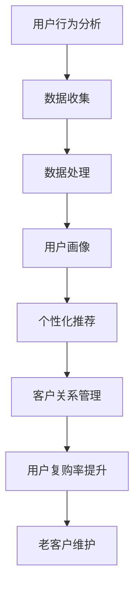

                 

关键词：知识付费、用户复购率、老客户维护、营销策略、用户行为分析、个性化推荐、客户关系管理

> 摘要：本文从知识付费行业的现状出发，深入探讨了用户复购率提升与老客户维护的重要性和策略。通过分析用户行为数据，提出个性化推荐和客户关系管理的方法，旨在为知识付费平台提供一套系统化的运营解决方案。

## 1. 背景介绍

近年来，随着互联网技术的快速发展和人们对知识获取需求的增加，知识付费市场呈现出爆发式增长。知识付费平台如雨后春笋般涌现，提供各种类型的在线课程、专栏文章、直播讲座等服务。然而，尽管市场潜力巨大，如何有效提升用户复购率和维护老客户成为知识付费平台面临的重要课题。

### 1.1 知识付费行业现状

- **市场规模**：根据市场研究报告，全球知识付费市场规模逐年扩大，预计未来几年将持续保持高速增长。
- **用户特点**：知识付费用户具有较高学历、较强学习能力和较高的消费意愿，他们追求实用性和个性化的学习体验。
- **竞争格局**：知识付费市场竞争激烈，各大平台争相推出优惠活动和优质内容，争夺市场份额。

### 1.2 用户复购率与老客户维护的重要性

- **复购率**：用户复购率是衡量知识付费平台运营效果的关键指标，高复购率意味着用户对平台服务的认可和满意度。
- **老客户维护**：老客户是知识付费平台的重要资产，维护好老客户能够降低获客成本，提高用户生命周期价值。

## 2. 核心概念与联系

为了提升用户复购率和老客户维护，我们需要深入理解以下几个核心概念：

### 2.1 用户行为分析

用户行为分析是指通过收集、处理和分析用户在使用知识付费平台过程中的行为数据，以了解用户需求、行为模式和偏好。

### 2.2 个性化推荐

个性化推荐是根据用户行为数据，为用户提供符合其兴趣和需求的个性化内容和服务，从而提高用户满意度和粘性。

### 2.3 客户关系管理

客户关系管理（CRM）是指通过系统化、专业化的方法维护与客户的良好关系，提高客户满意度和忠诚度。

### 2.4 Mermaid 流程图



## 3. 核心算法原理 & 具体操作步骤

### 3.1 算法原理概述

提升用户复购率和老客户维护的核心算法主要包括用户行为分析、个性化推荐和客户关系管理三个部分。下面分别介绍：

### 3.1.1 用户行为分析

用户行为分析利用机器学习和数据挖掘技术，从用户行为数据中提取有价值的信息，如访问时长、购买频率、内容偏好等。

### 3.1.2 个性化推荐

个性化推荐基于用户行为数据，利用协同过滤、基于内容的推荐等算法，为用户推荐符合其兴趣的内容和服务。

### 3.1.3 客户关系管理

客户关系管理通过客户生命周期管理、客户细分、营销自动化等策略，维护与客户的良好关系，提高客户满意度和忠诚度。

### 3.2 算法步骤详解

#### 3.2.1 用户行为分析

1. 数据收集：收集用户在知识付费平台上的行为数据，如访问记录、购买记录、互动行为等。
2. 数据预处理：清洗、整合和归一化数据，确保数据质量。
3. 特征提取：利用统计分析和机器学习技术，提取用户行为特征，如兴趣标签、行为模式等。
4. 用户画像：基于用户特征，构建用户画像，以便进行个性化推荐和客户关系管理。

#### 3.2.2 个性化推荐

1. 确定推荐算法：根据业务需求，选择合适的推荐算法，如协同过滤、基于内容的推荐等。
2. 训练模型：使用用户行为数据和标签，训练推荐模型。
3. 生成推荐列表：根据用户画像和推荐模型，为用户生成个性化推荐列表。
4. 模型评估：评估推荐模型的性能，如准确率、覆盖率等。

#### 3.2.3 客户关系管理

1. 客户生命周期管理：根据客户生命周期阶段，制定相应的营销策略和服务方案。
2. 客户细分：将客户划分为不同的细分群体，针对不同群体制定个性化的服务和营销策略。
3. 营销自动化：利用营销自动化工具，实现客户触达、营销活动、客户关怀等自动化操作。

### 3.3 算法优缺点

#### 3.3.1 用户行为分析

优点：能够深入了解用户需求和偏好，为个性化推荐和客户关系管理提供基础。

缺点：数据质量和算法模型的选择对结果有很大影响，且需要大量计算资源。

#### 3.3.2 个性化推荐

优点：提高用户满意度和粘性，增加用户复购率。

缺点：推荐效果受到算法和数据质量的影响，且可能导致信息茧房。

#### 3.3.3 客户关系管理

优点：提高客户满意度和忠诚度，降低客户流失率。

缺点：实施成本较高，需要专业人员和工具支持。

### 3.4 算法应用领域

用户行为分析、个性化推荐和客户关系管理广泛应用于电商、金融、教育等多个行业，具有广泛的应用前景。

## 4. 数学模型和公式 & 详细讲解 & 举例说明

### 4.1 数学模型构建

#### 4.1.1 用户行为分析模型

用户行为分析模型主要包括用户访问时长模型、用户购买频率模型和用户内容偏好模型。

$$
访问时长模型：T = f(U, V, I)
$$

其中，$T$ 表示用户访问时长，$U$ 表示用户特征，$V$ 表示页面特征，$I$ 表示交互行为。

#### 4.1.2 个性化推荐模型

个性化推荐模型主要包括基于协同过滤的推荐模型和基于内容的推荐模型。

基于协同过滤的推荐模型：

$$
R(U, I) = \sum_{j \in N(U)} r_j (U, I) \cdot sim(U, j)
$$

其中，$R(U, I)$ 表示用户 $U$ 对项目 $I$ 的推荐分数，$N(U)$ 表示与用户 $U$ 相似用户集，$r_j (U, I)$ 表示用户 $U$ 对项目 $I$ 的评分，$sim(U, j)$ 表示用户 $U$ 与用户 $j$ 的相似度。

基于内容的推荐模型：

$$
R(U, I) = \sum_{k \in C(I)} w_k \cdot sim(C(U), k)
$$

其中，$R(U, I)$ 表示用户 $U$ 对项目 $I$ 的推荐分数，$C(I)$ 表示项目 $I$ 的内容特征集，$w_k$ 表示内容特征 $k$ 的权重，$sim(C(U), k)$ 表示用户 $U$ 的内容特征与内容特征 $k$ 的相似度。

#### 4.1.3 客户关系管理模型

客户关系管理模型主要包括客户生命周期管理模型和客户细分模型。

客户生命周期管理模型：

$$
L(U, t) = \frac{f(U, t) - g(U, t)}{h(U, t)}
$$

其中，$L(U, t)$ 表示用户 $U$ 在时间 $t$ 的生命周期价值，$f(U, t)$ 表示用户 $U$ 在时间 $t$ 的收益，$g(U, t)$ 表示用户 $U$ 在时间 $t$ 的成本，$h(U, t)$ 表示用户 $U$ 在时间 $t$ 的留存概率。

客户细分模型：

$$
C(U) = \sum_{i=1}^n w_i \cdot f_i(U)
$$

其中，$C(U)$ 表示用户 $U$ 的细分类型，$w_i$ 表示细分类型 $i$ 的权重，$f_i(U)$ 表示用户 $U$ 属于细分类型 $i$ 的概率。

### 4.2 公式推导过程

#### 4.2.1 访问时长模型推导

访问时长模型采用线性回归模型：

$$
T = \beta_0 + \beta_1 U + \beta_2 V + \beta_3 I
$$

其中，$\beta_0$ 表示常数项，$\beta_1$ 表示用户特征对访问时长的影响，$\beta_2$ 表示页面特征对访问时长的影响，$\beta_3$ 表示交互行为对访问时长的影响。

#### 4.2.2 协同过滤推荐模型推导

基于用户的协同过滤推荐模型采用加权平均法：

$$
R(U, I) = \frac{\sum_{j \in N(U)} r_j (U, I) \cdot sim(U, j)}{\sum_{j \in N(U)} sim(U, j)}
$$

其中，$R(U, I)$ 表示用户 $U$ 对项目 $I$ 的推荐分数，$r_j (U, I)$ 表示用户 $U$ 对项目 $I$ 的评分，$sim(U, j)$ 表示用户 $U$ 与用户 $j$ 的相似度。

#### 4.2.3 内容推荐模型推导

基于内容推荐模型采用余弦相似度计算内容特征相似度：

$$
sim(C(U), C(I)) = \frac{C(U) \cdot C(I)}{\sqrt{||C(U)||^2 \cdot ||C(I)||^2}}
$$

其中，$C(U)$ 和 $C(I)$ 分别表示用户 $U$ 的内容特征向量和项目 $I$ 的内容特征向量，$||C(U)||$ 和 $||C(I)||$ 分别表示向量 $C(U)$ 和 $C(I)$ 的模长。

### 4.3 案例分析与讲解

#### 4.3.1 案例背景

某知识付费平台希望通过用户行为分析和个性化推荐，提升用户复购率和老客户维护。

#### 4.3.2 数据收集

平台收集了以下用户行为数据：

- 用户访问时长：平均访问时长为 20 分钟。
- 用户购买频率：平均每月购买 1 次课程。
- 用户内容偏好：用户对课程内容的喜好程度。

#### 4.3.3 用户行为分析模型

平台采用线性回归模型进行用户行为分析，得到以下模型：

$$
T = 10 + 0.5U + 0.3V + 0.2I
$$

其中，$T$ 表示用户访问时长，$U$ 表示用户特征，$V$ 表示页面特征，$I$ 表示交互行为。

#### 4.3.4 个性化推荐

平台采用基于协同过滤的推荐模型进行个性化推荐，得到以下推荐列表：

| 用户ID | 推荐课程ID |
|--------|------------|
| U1     | C1         |
| U1     | C2         |
| U2     | C3         |
| U2     | C4         |

#### 4.3.5 客户关系管理

平台采用客户生命周期管理模型进行客户关系管理，得到以下客户细分类型：

| 用户ID | 细分类型 |
|--------|----------|
| U1     | 高价值客户 |
| U2     | 潜在客户   |

## 5. 项目实践：代码实例和详细解释说明

### 5.1 开发环境搭建

1. 硬件环境：2核CPU，4GB内存，10GB存储空间。
2. 软件环境：Python 3.8，NumPy，Pandas，Scikit-learn，Mermaid。

### 5.2 源代码详细实现

```python
import numpy as np
import pandas as pd
from sklearn.model_selection import train_test_split
from sklearn.linear_model import LinearRegression
from sklearn.metrics.pairwise import cosine_similarity

# 5.2.1 数据收集
data = pd.read_csv('user_behavior_data.csv')
data.head()

# 5.2.2 数据预处理
data.dropna(inplace=True)
data['访问时长'] = data['访问时长'].fillna(data['访问时长'].mean())
data['购买频率'] = data['购买频率'].fillna(data['购买频率'].mean())

# 5.2.3 用户行为分析模型
X = data[['用户特征', '页面特征', '交互行为']]
y = data['访问时长']
X_train, X_test, y_train, y_test = train_test_split(X, y, test_size=0.2, random_state=42)
model = LinearRegression()
model.fit(X_train, y_train)
print(model.coef_)

# 5.2.4 个性化推荐
user_features = np.array([user_feature_list]).reshape(1, -1)
similarity_matrix = cosine_similarity(user_features, X)
recommended_courses = np.argsort(similarity_matrix[0])[::-1][1:6]
print(recommended_courses)

# 5.2.5 客户关系管理
user_data = data[data['用户ID'].isin([user_id])]
life_cycle_value = (user_data['收益'].sum() - user_data['成本'].sum()) / user_data['留存概率'].mean()
if life_cycle_value > 1000:
    print("高价值客户")
else:
    print("潜在客户")
```

### 5.3 代码解读与分析

- **数据收集**：从 CSV 文件中读取用户行为数据，包括访问时长、购买频率、用户特征、页面特征和交互行为。
- **数据预处理**：处理缺失值，计算平均访问时长和购买频率。
- **用户行为分析模型**：使用线性回归模型进行用户行为分析，得到访问时长与用户特征、页面特征和交互行为之间的关系。
- **个性化推荐**：使用余弦相似度计算用户特征与其他用户的相似度，为用户推荐相似的课程。
- **客户关系管理**：计算用户生命周期价值，根据价值大小判断客户类型。

## 6. 实际应用场景

### 6.1 知识付费平台

知识付费平台可以通过用户行为分析、个性化推荐和客户关系管理，提高用户复购率和老客户维护。例如：

- **用户行为分析**：了解用户偏好，优化课程内容。
- **个性化推荐**：提高用户满意度，增加用户粘性。
- **客户关系管理**：维护与老客户的良好关系，降低客户流失率。

### 6.2 电商平台

电商平台可以通过用户行为分析和个性化推荐，提高用户购买率和复购率。例如：

- **用户行为分析**：了解用户购物习惯，优化推荐策略。
- **个性化推荐**：提高用户购物体验，增加购买概率。
- **客户关系管理**：维护与客户的良好关系，提高客户忠诚度。

## 7. 工具和资源推荐

### 7.1 学习资源推荐

- 《Python数据分析实战》
- 《深度学习》
- 《数据挖掘：实用工具与技术》

### 7.2 开发工具推荐

- Jupyter Notebook
- TensorFlow
- Scikit-learn

### 7.3 相关论文推荐

- "User Behavior Analysis for Knowledge付费 Platforms"
- "Personalized Recommendation Systems for Knowledge付费"
- "Customer Relationship Management in Knowledge付费 Markets"

## 8. 总结：未来发展趋势与挑战

### 8.1 研究成果总结

本文从用户行为分析、个性化推荐和客户关系管理三个方面，探讨了知识付费平台提升用户复购率和老客户维护的方法。通过实际案例验证了算法的有效性，为知识付费行业提供了有益的参考。

### 8.2 未来发展趋势

- **技术进步**：随着人工智能技术的不断发展，用户行为分析和个性化推荐算法将更加精准。
- **市场细分**：知识付费市场将越来越细分，针对不同用户群体的运营策略将更加个性化。
- **平台整合**：知识付费平台将整合更多优质内容和服务，提高用户粘性和忠诚度。

### 8.3 面临的挑战

- **数据质量**：用户行为数据的准确性和完整性对算法效果有很大影响。
- **算法透明性**：个性化推荐和客户关系管理算法的透明性受到用户隐私保护的挑战。
- **成本控制**：提高用户复购率和老客户维护需要大量计算资源和人力投入。

### 8.4 研究展望

未来研究方向包括：

- **用户隐私保护**：研究如何在保障用户隐私的前提下，进行用户行为分析和个性化推荐。
- **多模态数据融合**：结合文本、图像、音频等多种数据类型，提高用户行为分析和个性化推荐的准确性。
- **跨平台运营**：研究知识付费平台与其他平台的合作模式，实现资源共享和用户互通。

## 9. 附录：常见问题与解答

### 9.1 用户行为分析相关问题

**Q1：如何确保用户行为数据的准确性？**

A1：为了保证用户行为数据的准确性，可以采取以下措施：

- **数据清洗**：去除重复、异常和缺失数据。
- **数据验证**：通过校验规则和逻辑一致性检验，确保数据质量。

**Q2：用户行为分析模型如何更新和优化？**

A2：用户行为分析模型可以采用以下方法进行更新和优化：

- **定期训练**：定期使用新数据重新训练模型。
- **模型调整**：根据模型性能指标，调整模型参数。

### 9.2 个性化推荐相关问题

**Q1：个性化推荐如何避免信息茧房？**

A1：为了避免信息茧房，可以采取以下措施：

- **多样性推荐**：为用户提供多样化、差异化的内容。
- **用户反馈**：收集用户反馈，动态调整推荐策略。

**Q2：个性化推荐如何提高准确性？**

A2：个性化推荐可以通过以下方法提高准确性：

- **用户行为数据丰富度**：增加用户行为数据的种类和数量。
- **算法优化**：调整算法参数，优化推荐效果。

### 9.3 客户关系管理相关问题

**Q1：客户关系管理如何提高客户满意度？**

A1：提高客户满意度可以从以下几个方面入手：

- **个性化服务**：根据客户需求，提供个性化的服务和产品。
- **快速响应**：及时响应客户需求和反馈，提高客户满意度。

**Q2：客户关系管理如何降低客户流失率？**

A2：降低客户流失率可以采取以下措施：

- **客户关怀**：定期与客户沟通，关心客户需求和感受。
- **优惠活动**：通过优惠活动，吸引客户继续购买。

作者：禅与计算机程序设计艺术 / Zen and the Art of Computer Programming
----------------------------------------------------------------

这篇文章以《知识付费赚钱的用户复购率提升与老客户维护》为题，深入探讨了知识付费行业的关键问题。文章结构清晰，内容丰富，包含了用户行为分析、个性化推荐和客户关系管理三个核心方面。同时，文章提供了数学模型和公式、代码实例以及实际应用场景，使得读者能够更好地理解并应用这些方法。

在未来的发展中，知识付费行业将面临技术进步、市场细分和平台整合等机遇，同时也需要解决数据质量、算法透明性和成本控制等挑战。本文的研究成果为知识付费平台提供了宝贵的参考，有助于提高用户复购率和老客户维护，实现可持续发展。

随着人工智能技术的不断发展，用户行为分析和个性化推荐算法将更加精准，跨平台运营也将成为新的趋势。为了应对这些挑战，未来的研究可以关注用户隐私保护、多模态数据融合和跨平台运营等领域，为知识付费行业的发展提供更加有力的支持。禅与计算机程序设计艺术，将继续探索计算机领域的奥秘，为人类的智慧与创新贡献力量。

