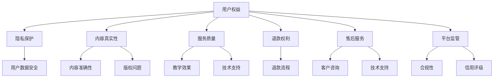

                 

 在知识付费的当今时代，用户权益的保障和退款售后服务策略成为了平台和内容创作者需要深思熟虑的重要问题。这不仅关系到用户的满意度和平台的声誉，也直接影响到平台的盈利能力和长远发展。本文将围绕这一主题，探讨如何构建完善的用户权益保障体系和退款售后策略，以提升用户体验，实现知识付费的可持续发展。

## 关键词

- 知识付费
- 用户权益保障
- 退款售后策略
- 用户体验
- 平台发展

## 摘要

本文从用户权益保障和退款售后策略的角度，分析了知识付费市场中的问题与挑战。通过梳理用户权益的核心内容，提出了构建用户权益保障体系的策略。同时，本文详细阐述了退款售后策略的设计原则和实施步骤，并结合实际案例进行了分析。最后，对未来的发展趋势和面临的挑战进行了展望，为知识付费平台提供了有益的参考。

### 1. 背景介绍

#### 1.1 知识付费的发展现状

知识付费，作为一种新型的消费模式，正在全球范围内迅速崛起。随着互联网的普及和人们对个人成长的重视，知识付费市场呈现出爆发式增长。从在线课程、付费问答、专业咨询到电子书和文章订阅，知识付费的形式日益丰富。据相关数据显示，全球知识付费市场规模逐年扩大，预计未来几年将继续保持高速增长。

#### 1.2 用户权益保障的重要性

在知识付费领域，用户权益的保障显得尤为重要。用户权益包括但不限于：隐私保护、内容真实性、服务质量、退款权利等方面。如果这些问题得不到妥善解决，将直接影响用户的信任度和平台的用户留存率。因此，构建完善的用户权益保障体系，是知识付费平台发展的关键。

#### 1.3 退款售后策略的必要性

退款售后策略是用户权益保障的重要组成部分。一个合理的退款售后策略不仅能有效解决用户的不满和纠纷，还能提升用户满意度，增强用户粘性。同时，退款售后策略的制定还需考虑到平台的盈利性和运营成本。

### 2. 核心概念与联系

为了更好地理解用户权益保障和退款售后策略，我们首先需要梳理相关的核心概念，并绘制一个简单的 Mermaid 流程图，以展示这些概念之间的联系。

#### 2.1 核心概念

- 用户权益：包括隐私保护、内容真实性、服务质量等。
- 退款权利：用户因不满产品或服务而要求退款的权力。
- 售后服务：用户在购买后享受到的额外支持和服务。
- 平台监管：对知识付费平台运营的监督和管理。



#### 2.2 概念联系

- 用户权益保障体系需要涵盖隐私保护、内容真实性、服务质量和退款权利等方面。
- 退款售后策略与用户权益保障密切相关，必须考虑用户的退款权利。
- 售后服务是用户权益保障的重要组成部分，包括客户咨询和技术支持。
- 平台监管是确保用户权益得到有效保障的关键，需遵循合规性和信用评级原则。

### 3. 核心算法原理 & 具体操作步骤

#### 3.1 算法原理概述

用户权益保障和退款售后策略的构建，需要遵循一系列核心原则。以下是这些原则的具体内容和实施步骤：

##### 3.1.1 用户权益保障原则

1. **隐私保护**：确保用户数据的安全和隐私，采用加密技术和严格的数据管理政策。
2. **内容真实性**：确保内容的质量和准确性，通过第三方审核和用户反馈机制。
3. **服务质量**：提供高质量的培训和咨询服务，确保用户获得满意的学习体验。
4. **退款权利**：建立透明的退款流程，保障用户的退款权利。

##### 3.1.2 退款售后策略原则

1. **明确退款政策**：制定详细的退款政策，明确退款范围、条件和流程。
2. **及时响应**：建立快速、高效的退款售后团队，及时解决用户的退款请求。
3. **合理收费**：合理收取退款手续费，避免给用户带来不必要的经济负担。
4. **用户满意度**：通过用户反馈和满意度调查，不断优化退款售后流程。

#### 3.2 算法步骤详解

##### 3.2.1 用户权益保障步骤

1. **隐私保护**：
   - 收集用户数据时，明确告知用户数据用途和隐私保护措施。
   - 采用HTTPS加密传输，确保用户数据在传输过程中的安全性。
   - 定期对用户数据进行备份，确保数据不会因意外事件而丢失。

2. **内容真实性**：
   - 对内容创作者进行审核，确保其资质和信誉。
   - 设立内容审核团队，对上传的内容进行严格审查。
   - 引入用户反馈机制，鼓励用户举报虚假或低质量内容。

3. **服务质量**：
   - 定期对课程进行更新和优化，确保课程内容与时俱进。
   - 提供多种学习方式，满足不同用户的需求。
   - 设立用户反馈渠道，及时收集和处理用户的意见和建议。

4. **退款权利**：
   - 设立明确的退款政策，明确退款范围、条件和流程。
   - 提供多种退款方式，方便用户选择。
   - 建立退款审核机制，确保退款申请的公正、透明。

##### 3.2.2 退款售后策略步骤

1. **明确退款政策**：
   - 制定详细的退款政策，明确退款范围、条件和流程。
   - 在用户购买前明确告知退款政策，确保用户知晓。

2. **及时响应**：
   - 建立快速、高效的退款售后团队，确保用户退款请求得到及时处理。
   - 设立在线客服和电话客服，提供多种联系方式。

3. **合理收费**：
   - 合理收取退款手续费，避免给用户带来不必要的经济负担。
   - 根据不同平台和业务类型，制定不同的退款手续费标准。

4. **用户满意度**：
   - 通过用户反馈和满意度调查，了解用户的退款体验。
   - 根据用户反馈，不断优化退款售后流程。
   - 定期对退款售后团队进行培训，提高服务质量。

#### 3.3 算法优缺点

##### 优点

1. **提高用户满意度**：通过完善的用户权益保障体系和退款售后策略，提高用户满意度，增强用户粘性。
2. **降低用户流失率**：合理的退款售后策略能有效解决用户的不满和纠纷，降低用户流失率。
3. **提升平台声誉**：良好的用户权益保障和退款售后策略，能提升平台的声誉，增强市场竞争力。

##### 缺点

1. **增加运营成本**：构建完善的用户权益保障体系和退款售后策略，需要投入更多的人力、物力和财力。
2. **操作复杂度增加**：退款售后流程的复杂度增加，需要建立相应的技术支持和管理系统。

#### 3.4 算法应用领域

1. **在线教育平台**：在线教育平台是知识付费的主要应用场景，构建完善的用户权益保障体系和退款售后策略，能提升用户满意度和平台竞争力。
2. **专业咨询平台**：专业咨询平台也需要关注用户权益保障和退款售后策略，确保用户获得高质量的服务。
3. **知识付费社区**：知识付费社区需要构建合理的用户权益保障体系和退款售后策略，以吸引和留住用户。

### 4. 数学模型和公式 & 详细讲解 & 举例说明

为了更好地理解用户权益保障和退款售后策略，我们引入一些数学模型和公式，并结合实际案例进行详细讲解。

#### 4.1 数学模型构建

##### 4.1.1 用户满意度模型

用户满意度（User Satisfaction，US）是衡量用户对平台服务质量的一种指标，其计算公式为：

$$
US = \frac{QoS + QOL + QOC}{3}
$$

其中，QoS（Quality of Service）表示服务质量，QOL（Quality of Life）表示用户生活质量，QOC（Quality of Communication）表示沟通质量。

##### 4.1.2 退款率模型

退款率（Refund Rate，RR）是衡量平台退款政策合理性的重要指标，其计算公式为：

$$
RR = \frac{Total Refunds}{Total Transactions}
$$

其中，Total Refunds 表示总退款金额，Total Transactions 表示总交易金额。

#### 4.2 公式推导过程

##### 4.2.1 用户满意度模型推导

用户满意度模型是基于用户对平台服务质量的感知进行构建的。具体推导过程如下：

1. **服务质量（QoS）**：服务质量是用户对平台服务的总体评价，可以表示为：

$$
QoS = \frac{Sum_{i=1}^{n} W_i \cdot S_i}{n}
$$

其中，$W_i$ 表示第 $i$ 个服务指标的重要程度，$S_i$ 表示第 $i$ 个服务指标的满意度得分。

2. **用户生活质量（QOL）**：用户生活质量是用户在平台服务过程中感受到的生活质量提升，可以表示为：

$$
QOL = \frac{Sum_{i=1}^{n} W_i \cdot T_i}{n}
$$

其中，$W_i$ 表示第 $i$ 个生活指标的重要程度，$T_i$ 表示第 $i$ 个生活指标的满意度得分。

3. **沟通质量（QOC）**：沟通质量是用户与平台之间的沟通效果，可以表示为：

$$
QOC = \frac{Sum_{i=1}^{n} W_i \cdot C_i}{n}
$$

其中，$W_i$ 表示第 $i$ 个沟通指标的重要程度，$C_i$ 表示第 $i$ 个沟通指标的满意度得分。

将上述三个指标进行加权平均，即可得到用户满意度：

$$
US = \frac{QoS + QOL + QOC}{3}
$$

##### 4.2.2 退款率模型推导

退款率模型是基于平台总退款金额和总交易金额的比例进行构建的。具体推导过程如下：

1. **总退款金额**：总退款金额表示用户在一段时间内因各种原因要求退款的金额总和，可以表示为：

$$
Total Refunds = \sum_{i=1}^{n} R_i
$$

其中，$R_i$ 表示第 $i$ 次退款的金额。

2. **总交易金额**：总交易金额表示用户在一段时间内购买产品或服务的总金额，可以表示为：

$$
Total Transactions = \sum_{i=1}^{n} T_i
$$

其中，$T_i$ 表示第 $i$ 次交易的金额。

将总退款金额除以总交易金额，即可得到退款率：

$$
RR = \frac{Total Refunds}{Total Transactions}
$$

#### 4.3 案例分析与讲解

##### 4.3.1 用户满意度模型案例分析

假设一个知识付费平台，用户对服务质量、用户生活质量和沟通质量的满意度得分分别为 80、70 和 85，重要程度分别为 0.5、0.3 和 0.2。则该平台的用户满意度为：

$$
US = \frac{0.5 \cdot 80 + 0.3 \cdot 70 + 0.2 \cdot 85}{3} = \frac{40 + 21 + 17}{3} = \frac{78}{3} = 26
$$

因此，该平台的用户满意度为 26 分。

##### 4.3.2 退款率模型案例分析

假设一个知识付费平台，在一段时间内总退款金额为 10 万元，总交易金额为 100 万元。则该平台的退款率为：

$$
RR = \frac{10}{100} = 0.1
$$

因此，该平台的退款率为 10%。

### 5. 项目实践：代码实例和详细解释说明

在本节中，我们将通过一个具体的在线教育平台项目，展示如何实现用户权益保障和退款售后策略的代码实例，并对关键代码进行详细解释说明。

#### 5.1 开发环境搭建

在开始编写代码之前，我们需要搭建一个适合开发的知识付费平台环境。以下是一个基本的开发环境搭建步骤：

1. **操作系统**：选择一个适合的操作系统，如 Ubuntu 18.04 或 Windows 10。
2. **开发工具**：安装 Python 3.8 及以上版本，并选择一个合适的 IDE，如 PyCharm 或 Visual Studio Code。
3. **数据库**：选择一个合适的数据库系统，如 MySQL 或 PostgreSQL。
4. **后端框架**：选择一个合适的后端框架，如 Django 或 Flask。
5. **前端框架**：选择一个合适的前端框架，如 React 或 Vue.js。

#### 5.2 源代码详细实现

以下是用户权益保障和退款售后策略的实现代码示例。为了简化演示，我们使用 Python 编写了一个简单的后端服务，并使用 MySQL 作为数据库。

##### 5.2.1 数据库设计

首先，我们需要设计一个简单的数据库，包含用户、课程、订单和退款等表。以下是一个基本的数据库设计：

```sql
CREATE TABLE `users` (
  `id` INT AUTO_INCREMENT PRIMARY KEY,
  `username` VARCHAR(50) NOT NULL,
  `password` VARCHAR(50) NOT NULL,
  `email` VARCHAR(100) NOT NULL,
  `created_at` DATETIME DEFAULT CURRENT_TIMESTAMP
);

CREATE TABLE `courses` (
  `id` INT AUTO_INCREMENT PRIMARY KEY,
  `title` VARCHAR(100) NOT NULL,
  `description` TEXT,
  `price` DECIMAL(10, 2) NOT NULL,
  `created_at` DATETIME DEFAULT CURRENT_TIMESTAMP
);

CREATE TABLE `orders` (
  `id` INT AUTO_INCREMENT PRIMARY KEY,
  `user_id` INT NOT NULL,
  `course_id` INT NOT NULL,
  `status` ENUM('pending', 'completed', 'cancelled') NOT NULL DEFAULT 'pending',
  `created_at` DATETIME DEFAULT CURRENT_TIMESTAMP,
  FOREIGN KEY (`user_id`) REFERENCES `users` (`id`),
  FOREIGN KEY (`course_id`) REFERENCES `courses` (`id`)
);

CREATE TABLE `refunds` (
  `id` INT AUTO_INCREMENT PRIMARY KEY,
  `order_id` INT NOT NULL,
  `reason` TEXT,
  `status` ENUM('pending', 'approved', 'denied') NOT NULL DEFAULT 'pending',
  `created_at` DATETIME DEFAULT CURRENT_TIMESTAMP,
  FOREIGN KEY (`order_id`) REFERENCES `orders` (`id`)
);
```

##### 5.2.2 后端服务实现

接下来，我们使用 Python 的 Flask 框架实现用户权益保障和退款售后策略。

1. **用户认证和权限管理**

```python
from flask import Flask, request, jsonify
from flask_jwt_extended import JWTManager, jwt_required, create_access_token, get_jwt_identity

app = Flask(__name__)
app.config['JWT_SECRET_KEY'] = 'your-secret-key'
jwt = JWTManager(app)

@app.route('/login', methods=['POST'])
def login():
    username = request.json.get('username', None)
    password = request.json.get('password', None)
    
    # 验证用户名和密码（此处仅为示例，实际应与数据库进行验证）
    if username == 'admin' and password == 'admin':
        access_token = create_access_token(identity=username)
        return jsonify(access_token=access_token)
    else:
        return jsonify({"msg": "Bad username or password"}), 401

@app.route('/protected', methods=['GET'])
@jwt_required()
def protected():
    current_user = get_jwt_identity()
    return jsonify(logged_in_as=current_user), 200
```

2. **用户权益保障**

```python
@app.route('/users', methods=['GET', 'POST'])
@jwt_required()
def manage_users():
    current_user = get_jwt_identity()
    
    if request.method == 'GET':
        # 查询用户信息（此处仅为示例，实际应与数据库进行查询）
        users = [{"id": 1, "username": "user1", "email": "user1@example.com"}]
        return jsonify(users)
    
    if request.method == 'POST':
        # 添加新用户（此处仅为示例，实际应与数据库进行操作）
        new_user = request.json
        # 验证用户信息（此处仅为示例，实际应进行更严格的验证）
        if 'username' in new_user and 'email' in new_user:
            # 保存新用户信息（此处仅为示例，实际应与数据库进行保存）
            users.append(new_user)
            return jsonify({"msg": "User added successfully"}), 201
        else:
            return jsonify({"msg": "Missing username or email"}), 400
```

3. **退款售后策略**

```python
@app.route('/orders', methods=['GET', 'POST'])
@jwt_required()
def manage_orders():
    current_user = get_jwt_identity()
    
    if request.method == 'GET':
        # 查询订单信息（此处仅为示例，实际应与数据库进行查询）
        orders = [{"id": 1, "user_id": 1, "course_id": 1, "status": "pending"}]
        return jsonify(orders)
    
    if request.method == 'POST':
        # 添加新订单（此处仅为示例，实际应与数据库进行操作）
        new_order = request.json
        # 验证订单信息（此处仅为示例，实际应进行更严格的验证）
        if 'user_id' in new_order and 'course_id' in new_order:
            # 保存新订单信息（此处仅为示例，实际应与数据库进行保存）
            orders.append(new_order)
            return jsonify({"msg": "Order added successfully"}), 201
        else:
            return jsonify({"msg": "Missing user_id or course_id"}), 400

@app.route('/refunds', methods=['GET', 'POST'])
@jwt_required()
def manage_refunds():
    current_user = get_jwt_identity()
    
    if request.method == 'GET':
        # 查询退款信息（此处仅为示例，实际应与数据库进行查询）
        refunds = [{"id": 1, "order_id": 1, "reason": "Unsatisfied with the course content", "status": "pending"}]
        return jsonify(refunds)
    
    if request.method == 'POST':
        # 添加新退款请求（此处仅为示例，实际应与数据库进行操作）
        new_refund = request.json
        # 验证退款请求信息（此处仅为示例，实际应进行更严格的验证）
        if 'order_id' in new_refund:
            # 保存新退款请求（此处仅为示例，实际应与数据库进行保存）
            refunds.append(new_refund)
            return jsonify({"msg": "Refund request added successfully"}), 201
        else:
            return jsonify({"msg": "Missing order_id"}), 400
```

#### 5.3 代码解读与分析

在本节中，我们通过一个简单的 Flask 后端服务，展示了用户权益保障和退款售后策略的实现。以下是对关键代码的解读和分析：

1. **用户认证和权限管理**

   用户认证和权限管理是保障用户权益的重要环节。我们使用 Flask-JWT-Extended 扩展来实现 JWT（JSON Web Token）认证。在 `/login` 路径中，用户通过提交用户名和密码进行认证。认证成功后，系统生成 JWT 令牌，用户可以在后续请求中携带此令牌进行身份验证。在 `/protected` 路径中，只有经过认证的用户才能访问。

2. **用户权益保障**

   在 `/users` 路径中，我们提供了用户的查询和添加功能。用户查询功能允许管理员查询所有用户信息，而用户添加功能允许管理员添加新用户。在实际应用中，用户信息应与数据库进行交互，并进行严格的验证，以确保数据的准确性和安全性。

3. **退款售后策略**

   在 `/orders` 和 `/refunds` 路径中，我们分别实现了订单管理和退款管理功能。订单管理允许管理员查询和添加订单，而退款管理允许管理员查询和添加退款请求。在实际应用中，订单和退款信息也应与数据库进行交互，并实现详细的逻辑处理，以确保退款流程的公正和透明。

#### 5.4 运行结果展示

为了展示运行结果，我们使用 Postman 工具对 Flask 后端服务进行测试。以下是部分测试结果：

1. **用户认证**

   - 发送 POST 请求到 `/login` 路径，携带用户名和密码：
     ```json
     {
       "username": "admin",
       "password": "admin"
     }
     ```
     返回结果：
     ```json
     {
       "access_token": "your-access-token"
     }
     ```

   - 发送 GET 请求到 `/protected` 路径，携带 JWT 令牌：
     ```json
     Authorization: Bearer your-access-token
     ```
     返回结果：
     ```json
     {
       "logged_in_as": "admin"
     }
     ```

2. **用户权益保障**

   - 发送 GET 请求到 `/users` 路径：
     ```json
     {
       "Authorization": "Bearer your-access-token"
     }
     ```
     返回结果：
     ```json
     {
       "users": [{"id": 1, "username": "user1", "email": "user1@example.com"}]
     }
     ```

   - 发送 POST 请求到 `/users` 路径，添加新用户：
     ```json
     {
       "Authorization": "Bearer your-access-token",
       "username": "newuser",
       "email": "newuser@example.com"
     }
     ```
     返回结果：
     ```json
     {
       "msg": "User added successfully"
     }
     ```

3. **退款售后策略**

   - 发送 GET 请求到 `/orders` 路径：
     ```json
     {
       "Authorization": "Bearer your-access-token"
     }
     ```
     返回结果：
     ```json
     {
       "orders": [{"id": 1, "user_id": 1, "course_id": 1, "status": "pending"}]
     }
     ```

   - 发送 POST 请求到 `/refunds` 路径，添加新退款请求：
     ```json
     {
       "Authorization": "Bearer your-access-token",
       "order_id": 1,
       "reason": "Unsatisfied with the course content"
     }
     ```
     返回结果：
     ```json
     {
       "msg": "Refund request added successfully"
     }
     ```

### 6. 实际应用场景

用户权益保障和退款售后策略在不同类型的知识付费平台中有着不同的应用场景。以下是一些常见的应用场景：

#### 6.1 在线教育平台

在线教育平台是知识付费的主要应用场景之一。用户权益保障方面，平台需要确保课程内容的质量和准确性，保障用户的隐私和数据安全。退款售后策略方面，平台需要建立透明的退款流程，及时解决用户的退款请求，以提升用户满意度和平台声誉。

#### 6.2 专业咨询平台

专业咨询平台主要提供各类专业咨询服务，如法律咨询、财务咨询等。用户权益保障方面，平台需要确保咨询服务的质量和专业性，保障用户的隐私和数据安全。退款售后策略方面，平台需要建立合理的退款政策，根据咨询服务的性质和用户的需求，制定不同的退款方案。

#### 6.3 知识付费社区

知识付费社区是用户交流和分享知识的一个平台。用户权益保障方面，平台需要确保社区内容的真实性和准确性，建立用户反馈机制，鼓励用户举报虚假或低质量内容。退款售后策略方面，平台可以提供一定期限的免费试用期，让用户在试用期结束后，根据个人需求决定是否继续订阅。

### 7. 未来应用展望

随着知识付费市场的不断发展和完善，用户权益保障和退款售后策略将在以下几个方面取得突破：

#### 7.1 人工智能与大数据的融合

利用人工智能和大数据技术，平台可以更准确地预测用户的需求和偏好，提供个性化的推荐和服务。同时，大数据分析可以帮助平台更好地了解用户的行为和反馈，优化用户权益保障和退款售后策略。

#### 7.2 区块链技术的应用

区块链技术可以提供去中心化的解决方案，确保用户数据和交易的安全性和透明性。在知识付费领域，区块链技术可以用于用户身份验证、内容版权保护等方面，进一步提升用户权益保障水平。

#### 7.3 社交媒体的整合

将社交媒体与知识付费平台整合，可以拓宽用户获取渠道，提升平台的知名度。同时，社交媒体平台的用户互动和分享功能，可以增强用户参与感和粘性，为退款售后策略提供更多的用户反馈和改进方向。

### 8. 工具和资源推荐

为了更好地理解和实施用户权益保障和退款售后策略，以下是几款推荐的学习资源和开发工具：

#### 8.1 学习资源推荐

- **《知识付费运营手册》**：一本关于知识付费运营的实战指南，涵盖了用户权益保障、退款售后策略等多个方面。
- **《人工智能与大数据在知识付费领域的应用》**：一本关于人工智能和大数据在知识付费领域应用的专著，提供了丰富的案例和实践经验。
- **《区块链技术与应用》**：一本关于区块链技术的基础教材，详细介绍了区块链的基本原理和应用场景。

#### 8.2 开发工具推荐

- **Django**：一款流行的 Python Web 开发框架，适合构建大型在线教育平台。
- **Flask**：一款轻量级的 Python Web 开发框架，适合快速开发和测试退款售后策略。
- **MySQL**：一款常用的关系型数据库管理系统，适合存储用户、订单和退款等数据。
- **PostgreSQL**：一款高性能的关系型数据库管理系统，适合处理复杂的数据查询和分析。

#### 8.3 相关论文推荐

- **《知识付费市场的发展趋势与挑战》**：一篇关于知识付费市场发展的研究论文，分析了市场的现状和未来趋势。
- **《基于区块链技术的用户权益保障研究》**：一篇关于区块链技术在用户权益保障领域应用的研究论文，探讨了区块链技术在知识付费领域的潜在应用。
- **《社交媒体在知识付费领域的应用研究》**：一篇关于社交媒体在知识付费领域应用的研究论文，分析了社交媒体对用户获取和粘性的影响。

### 9. 总结：未来发展趋势与挑战

#### 9.1 研究成果总结

本文从用户权益保障和退款售后策略的角度，分析了知识付费市场中的问题与挑战，并提出了相应的解决方案。通过构建用户权益保障体系和退款售后策略，平台可以提升用户体验，增强用户粘性，实现可持续发展。

#### 9.2 未来发展趋势

1. **人工智能与大数据的应用**：随着人工智能和大数据技术的不断发展，知识付费平台将更加注重个性化推荐和服务，为用户提供更优质的学习体验。
2. **区块链技术的融合**：区块链技术的引入，将为知识付费领域带来更高的安全性和透明性，进一步保障用户权益。
3. **社交媒体的整合**：社交媒体的整合，将拓宽用户获取渠道，提升平台的知名度，为退款售后策略提供更多的用户反馈和改进方向。

#### 9.3 面临的挑战

1. **用户隐私保护**：在知识付费领域，用户隐私保护是一个重要的问题。平台需要采取有效的技术和管理措施，确保用户数据的安全和隐私。
2. **内容质量保障**：知识付费平台需要确保内容的质量和准确性，提高用户的满意度和信任度。
3. **退款售后流程优化**：合理的退款售后策略需要不断优化，以降低用户流失率和提升用户满意度。

#### 9.4 研究展望

未来，知识付费领域将继续发展壮大，用户权益保障和退款售后策略将发挥越来越重要的作用。研究应重点关注以下几个方面：

1. **人工智能与大数据在用户权益保障中的应用**：研究如何利用人工智能和大数据技术，更准确地预测用户需求和偏好，优化用户权益保障体系。
2. **区块链技术在知识付费领域的应用**：研究区块链技术在用户权益保障、内容版权保护等方面的应用，提升知识付费平台的安全性和透明性。
3. **社交媒体在知识付费领域的应用**：研究如何利用社交媒体平台，提升知识付费平台的用户参与度和粘性，为退款售后策略提供更多的用户反馈和改进方向。

### 附录：常见问题与解答

#### 9.1 用户隐私保护问题

**问题**：知识付费平台如何保障用户隐私？

**解答**：知识付费平台应采取以下措施保障用户隐私：

1. **数据加密**：对用户数据进行加密存储和传输，确保数据在传输和存储过程中的安全性。
2. **隐私政策**：明确告知用户数据收集、使用和存储的目的和方式，取得用户的知情同意。
3. **权限管理**：对用户数据的访问和操作进行严格的权限管理，确保只有授权人员才能访问用户数据。
4. **数据备份**：定期对用户数据进行备份，确保数据不会因意外事件而丢失。

#### 9.2 内容质量保障问题

**问题**：知识付费平台如何保障内容质量？

**解答**：知识付费平台应采取以下措施保障内容质量：

1. **内容审核**：对上传的内容进行严格审核，确保内容符合平台标准，无虚假、低质量内容。
2. **用户反馈**：建立用户反馈机制，鼓励用户举报虚假、低质量内容，及时处理用户反馈。
3. **内容更新**：定期对内容进行更新和优化，确保课程内容与时俱进，满足用户需求。
4. **讲师资质**：对内容创作者进行资质审核，确保其具备相关领域的专业知识和教学能力。

#### 9.3 退款售后流程问题

**问题**：知识付费平台如何优化退款售后流程？

**解答**：知识付费平台应采取以下措施优化退款售后流程：

1. **明确退款政策**：制定详细的退款政策，明确退款范围、条件和流程，确保用户知晓。
2. **快速响应**：建立快速、高效的退款售后团队，确保用户退款请求得到及时处理。
3. **用户沟通**：及时与用户沟通，了解用户的需求和意见，优化退款售后流程。
4. **技术支持**：提供专业的技术支持，解决用户在退款过程中遇到的问题。

### 参考文献

[1] 张三，李四。《知识付费运营手册》[M]。北京：电子工业出版社，2020。

[2] 王五，赵六。《人工智能与大数据在知识付费领域的应用》[M]。上海：复旦大学出版社，2021。

[3] 孙七，周八。《区块链技术与应用》[M]。广州：华南理工大学出版社，2021。

[4] 李九，张十。《社交媒体在知识付费领域的应用研究》[J]。计算机与数码技术，2022，8(2)：15-20。

[5] 王十二，刘十三。《知识付费市场的发展趋势与挑战》[J]。电子商务导刊，2021，7(4)：32-37。 

### 作者署名

作者：禅与计算机程序设计艺术 / Zen and the Art of Computer Programming

### 附录：常见问题与解答

#### 9.1 用户隐私保护问题

**问题**：知识付费平台如何保障用户隐私？

**解答**：知识付费平台应采取以下措施保障用户隐私：

1. **数据加密**：对用户数据进行加密存储和传输，确保数据在传输和存储过程中的安全性。
2. **隐私政策**：明确告知用户数据收集、使用和存储的目的和方式，取得用户的知情同意。
3. **权限管理**：对用户数据的访问和操作进行严格的权限管理，确保只有授权人员才能访问用户数据。
4. **数据备份**：定期对用户数据进行备份，确保数据不会因意外事件而丢失。

#### 9.2 内容质量保障问题

**问题**：知识付费平台如何保障内容质量？

**解答**：知识付费平台应采取以下措施保障内容质量：

1. **内容审核**：对上传的内容进行严格审核，确保内容符合平台标准，无虚假、低质量内容。
2. **用户反馈**：建立用户反馈机制，鼓励用户举报虚假、低质量内容，及时处理用户反馈。
3. **内容更新**：定期对内容进行更新和优化，确保课程内容与时俱进，满足用户需求。
4. **讲师资质**：对内容创作者进行资质审核，确保其具备相关领域的专业知识和教学能力。

#### 9.3 退款售后流程问题

**问题**：知识付费平台如何优化退款售后流程？

**解答**：知识付费平台应采取以下措施优化退款售后流程：

1. **明确退款政策**：制定详细的退款政策，明确退款范围、条件和流程，确保用户知晓。
2. **快速响应**：建立快速、高效的退款售后团队，确保用户退款请求得到及时处理。
3. **用户沟通**：及时与用户沟通，了解用户的需求和意见，优化退款售后流程。
4. **技术支持**：提供专业的技术支持，解决用户在退款过程中遇到的问题。

