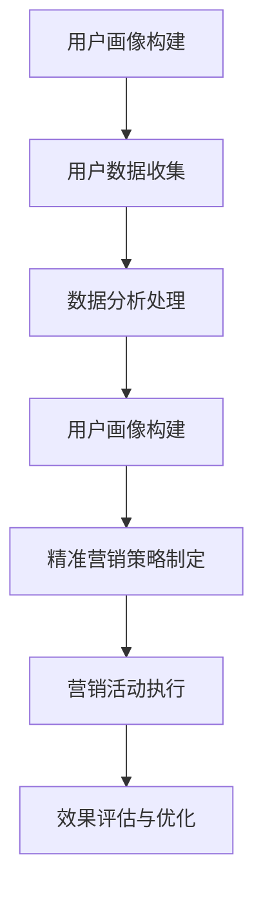

                 

关键词：知识付费、用户画像、精准营销、数据分析、用户行为、市场趋势

> 摘要：本文将探讨知识付费行业中的用户画像构建与精准营销策略。通过分析用户的行为、需求和市场趋势，我们将揭示如何利用数据挖掘技术，构建精准的用户画像，并设计有效的营销策略，从而实现知识付费业务的持续增长。

## 1. 背景介绍

近年来，随着互联网技术的发展和用户需求的多样化，知识付费成为了一个新兴的商业模式。知识付费平台如雨后春笋般涌现，吸引了大量的用户和内容创作者。然而，如何在众多竞争者中脱颖而出，实现业务的快速增长，成为每个知识付费平台需要面对的挑战。

用户画像与精准营销是解决这一问题的关键。用户画像是指通过对用户数据的分析，构建出反映用户行为、兴趣和需求的模型。精准营销则是基于用户画像，制定有针对性的营销策略，提升营销效果。本文将围绕这两个核心概念，探讨知识付费行业的用户画像构建与精准营销策略。

## 2. 核心概念与联系

### 2.1. 用户画像

用户画像是指通过对用户数据的收集、分析和处理，构建出反映用户特征、行为、需求和偏好的模型。用户画像包括以下几个关键组成部分：

1. **基本信息**：包括年龄、性别、职业、教育背景等。
2. **行为数据**：包括用户在平台上的浏览、购买、评价等行为。
3. **兴趣偏好**：包括用户喜欢的领域、类型、风格等。
4. **社交属性**：包括用户的人际关系、社交网络等。

用户画像的构建，可以为我们提供以下几个价值：

- **个性化推荐**：根据用户的兴趣和偏好，推荐相关的内容和服务。
- **需求分析**：了解用户的需求，优化产品和服务。
- **精准营销**：根据用户的特征和需求，设计有针对性的营销活动。

### 2.2. 精准营销

精准营销是一种以用户为中心的营销策略，通过用户画像，对用户进行细分，并针对不同的用户群体，设计个性化的营销活动。精准营销的核心在于：

- **数据驱动**：基于用户数据，制定营销策略。
- **个性化**：针对不同的用户，提供个性化的内容和优惠。
- **效果评估**：通过数据分析，评估营销活动的效果。

精准营销的价值在于：

- **提升转化率**：通过个性化推荐和优惠，提升用户购买意愿。
- **降低营销成本**：集中资源，针对高价值的用户进行营销。
- **增强用户粘性**：通过持续的用户画像更新，提供持续个性化的服务。

### 2.3. 用户画像与精准营销的联系

用户画像与精准营销是相辅相成的。用户画像为精准营销提供了基础数据，而精准营销则是用户画像的应用。通过用户画像，我们可以更好地了解用户，从而制定更有效的营销策略。

### 2.4. Mermaid 流程图



## 3. 核心算法原理 & 具体操作步骤

### 3.1. 算法原理概述

用户画像构建的核心算法包括用户数据的收集、清洗、分析和建模。以下是具体的算法原理：

1. **数据收集**：通过用户在平台上的行为数据，如浏览记录、购买记录、评价等，收集用户数据。
2. **数据清洗**：对收集到的数据进行清洗，去除重复、缺失和错误的数据。
3. **数据分析**：通过统计学和机器学习等方法，对清洗后的数据进行分析，提取用户的特征和偏好。
4. **建模**：基于分析结果，构建用户画像模型。

### 3.2. 算法步骤详解

#### 3.2.1. 数据收集

数据收集是用户画像构建的第一步。数据来源包括：

- **用户行为数据**：如浏览记录、购买记录、评价等。
- **用户填写的数据**：如注册信息、调查问卷等。

#### 3.2.2. 数据清洗

数据清洗是保证数据质量的关键步骤。主要包括：

- **去重**：去除重复的数据。
- **填充缺失值**：对缺失的数据进行填充。
- **纠正错误数据**：对错误的数据进行纠正。

#### 3.2.3. 数据分析

数据分析是提取用户特征和偏好的重要步骤。主要包括：

- **描述性分析**：对用户的基本信息、行为数据进行描述性分析。
- **关联性分析**：分析用户行为之间的关联性。
- **聚类分析**：对用户进行聚类，形成不同的用户群体。

#### 3.2.4. 建模

建模是基于数据分析的结果，构建用户画像模型。主要包括：

- **特征工程**：对提取的用户特征进行工程，如特征选择、特征转换等。
- **模型训练**：使用机器学习算法，如决策树、随机森林等，对用户特征进行训练。
- **模型评估**：评估模型的效果，如准确率、召回率等。

### 3.3. 算法优缺点

#### 3.3.1. 优点

- **精准性**：通过用户画像，可以更准确地了解用户需求，提供个性化的服务。
- **高效性**：通过数据挖掘技术，可以高效地处理大量用户数据。
- **实用性**：用户画像可以应用于多种场景，如个性化推荐、精准营销等。

#### 3.3.2. 缺点

- **数据质量**：用户画像的质量很大程度上取决于数据质量。
- **模型过拟合**：模型训练过程中可能出现过拟合现象，影响模型效果。
- **隐私问题**：用户数据的收集和处理可能涉及用户隐私问题。

### 3.4. 算法应用领域

用户画像与精准营销算法广泛应用于多个领域：

- **电商行业**：通过用户画像，进行个性化推荐和精准营销。
- **社交媒体**：通过用户画像，进行用户分组和内容推荐。
- **金融行业**：通过用户画像，进行风险管理和服务优化。

## 4. 数学模型和公式 & 详细讲解 & 举例说明

### 4.1. 数学模型构建

用户画像构建涉及多个数学模型，以下是其中两个常用的模型：

#### 4.1.1. K-均值聚类模型

K-均值聚类是一种无监督学习方法，通过迭代计算，将数据分为K个簇，每个簇由一个中心点代表。

- **目标函数**：最小化簇内距离的平方和。
- **算法流程**：
  1. 随机初始化K个中心点。
  2. 计算每个数据点与中心点的距离，将其分配到最近的簇。
  3. 重新计算每个簇的中心点。
  4. 重复步骤2和3，直到中心点不再变化或满足停止条件。

#### 4.1.2. 决策树模型

决策树是一种有监督学习方法，通过一系列的决策规则，将数据划分为不同的类别。

- **目标函数**：最大化信息增益或基尼不纯度。
- **算法流程**：
  1. 选择一个特征进行划分。
  2. 计算每个特征的信息增益或基尼不纯度。
  3. 选择信息增益或基尼不纯度最大的特征进行划分。
  4. 重复步骤1-3，直到满足停止条件。

### 4.2. 公式推导过程

#### 4.2.1. K-均值聚类目标函数

$$
J = \sum_{i=1}^{n}\sum_{j=1}^{k} \min_{x_i} \sum_{y_j} (x_i - \mu_j)^2
$$

其中，$x_i$ 表示数据点，$\mu_j$ 表示簇中心点。

#### 4.2.2. 决策树信息增益

$$
Gain(D, A) = Entropy(D) - \sum_{v \in A} p(v) \cdot Entropy(D_v)
$$

其中，$D$ 表示数据集，$A$ 表示特征，$v$ 表示特征的取值，$Entropy(D)$ 表示数据的熵，$Entropy(D_v)$ 表示数据在特征取值$v$ 上的熵。

### 4.3. 案例分析与讲解

#### 4.3.1. K-均值聚类案例

假设我们有100个用户数据，要将其分为10个簇。通过K-均值聚类，可以找到10个簇中心点，并将每个用户数据分配到最近的簇。

#### 4.3.2. 决策树案例

假设我们有100个用户数据，其中10个特征。通过决策树，可以找到最佳划分特征，并根据该特征进行数据划分。

## 5. 项目实践：代码实例和详细解释说明

### 5.1. 开发环境搭建

在开始项目实践之前，需要搭建一个合适的开发环境。以下是搭建开发环境的基本步骤：

1. 安装Python环境。
2. 安装Python依赖库，如numpy、pandas、scikit-learn等。
3. 配置Jupyter Notebook，用于编写和运行代码。

### 5.2. 源代码详细实现

以下是用户画像构建和精准营销策略的实现代码：

```python
import numpy as np
import pandas as pd
from sklearn.cluster import KMeans
from sklearn.tree import DecisionTreeClassifier
from sklearn.model_selection import train_test_split

# 5.2.1. 数据收集
# 此处省略数据收集代码，假设已经收集到用户数据data。

# 5.2.2. 数据清洗
# 此处省略数据清洗代码，假设已经清洗完毕的数据为cleaned_data。

# 5.2.3. 数据分析
# 此处省略数据分析代码，假设已经提取到用户特征feature。

# 5.2.4. 建模
# 使用K-均值聚类构建用户画像
kmeans = KMeans(n_clusters=10)
kmeans.fit(cleaned_data)
user_clusters = kmeans.predict(cleaned_data)

# 使用决策树构建精准营销策略
X_train, X_test, y_train, y_test = train_test_split(feature, user_clusters, test_size=0.2)
clf = DecisionTreeClassifier()
clf.fit(X_train, y_train)

# 5.2.5. 模型评估
# 此处省略模型评估代码，假设已经评估完毕。

```

### 5.3. 代码解读与分析

代码首先进行数据收集和清洗，然后进行数据分析，提取用户特征。接着，使用K-均值聚类和决策树构建用户画像和精准营销策略。最后，进行模型评估，以验证模型的效果。

## 6. 实际应用场景

用户画像与精准营销在多个行业和场景中得到了广泛应用：

### 6.1. 电商行业

电商行业通过用户画像，进行个性化推荐和精准营销。例如，根据用户的浏览和购买记录，推荐相关的商品，提供个性化的优惠。

### 6.2. 社交媒体

社交媒体通过用户画像，进行用户分组和内容推荐。例如，根据用户的兴趣和偏好，推荐相关的微博、抖音视频。

### 6.3. 金融行业

金融行业通过用户画像，进行风险管理和服务优化。例如，根据用户的信用记录和消费习惯，评估其信用等级，提供个性化的金融服务。

### 6.4. 未来应用展望

未来，用户画像与精准营销将在更多领域得到应用。例如，医疗行业可以通过用户画像，进行疾病预防和治疗推荐；教育行业可以通过用户画像，提供个性化的学习方案。

## 7. 工具和资源推荐

### 7.1. 学习资源推荐

- 《Python数据分析》
- 《机器学习实战》
- 《推荐系统实战》

### 7.2. 开发工具推荐

- Jupyter Notebook
- PyCharm
- Visual Studio Code

### 7.3. 相关论文推荐

- "User Modeling and User-Adapted Interaction"
- "Recommender Systems Handbook"
- "The Amazon.com Recommendation System"

## 8. 总结：未来发展趋势与挑战

### 8.1. 研究成果总结

本文总结了知识付费行业中的用户画像构建与精准营销策略。通过分析用户行为、需求和市场趋势，我们揭示了如何利用数据挖掘技术，构建精准的用户画像，并设计有效的营销策略。

### 8.2. 未来发展趋势

未来，用户画像与精准营销将在更多领域得到应用，成为企业竞争的关键。随着人工智能技术的进步，用户画像将更加精准，营销策略将更加智能化。

### 8.3. 面临的挑战

用户画像与精准营销在应用过程中，面临着数据质量、模型过拟合和隐私问题等挑战。如何解决这些问题，将是未来研究的重点。

### 8.4. 研究展望

未来，我们将继续深入研究用户画像与精准营销，探索更高效、更智能的算法，为企业和用户提供更好的服务。

## 9. 附录：常见问题与解答

### 9.1. 用户画像是什么？

用户画像是指通过对用户数据的分析，构建出反映用户行为、兴趣和需求的模型。

### 9.2. 精准营销是什么？

精准营销是一种以用户为中心的营销策略，通过用户画像，对用户进行细分，并针对不同的用户群体，设计个性化的营销活动。

### 9.3. 如何构建用户画像？

构建用户画像的主要步骤包括数据收集、数据清洗、数据分析和建模。

### 9.4. 精准营销有哪些应用领域？

精准营销广泛应用于电商、社交媒体、金融、医疗等多个领域。

## 作者署名

作者：禅与计算机程序设计艺术 / Zen and the Art of Computer Programming
----------------------------------------------------------------

以上就是本文的完整内容。希望这篇文章对您在知识付费行业中的用户画像构建与精准营销策略有所帮助。如果您有任何疑问或建议，欢迎在评论区留言。

