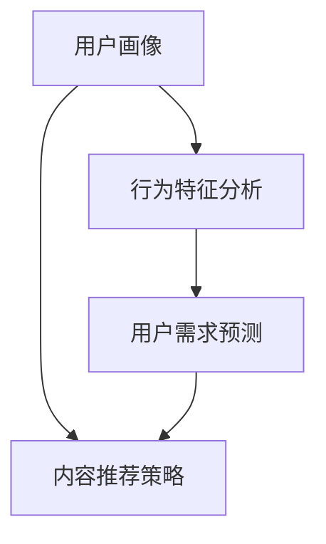

                 

知识付费已经成为当今社会的一种重要商业模式，通过对用户行为的深入分析和精准画像，知识付费平台能够更好地满足用户需求，提升用户体验，从而实现盈利。本文将探讨知识付费赚钱的用户行为分析，包括用户画像的构建、行为特征分析、用户需求预测等方面，并结合具体案例进行深入解析。

## 1. 背景介绍

### 知识付费的兴起

随着互联网技术的快速发展，信息获取的方式和途径变得多样化。与此同时，用户对于个性化、高质量的知识内容的需求日益增长。知识付费作为一种新的商业模式，应运而生。知识付费平台通过提供专业、系统、有深度的内容，让用户为其知识服务付费，从而实现盈利。

### 用户行为分析的重要性

用户行为分析是知识付费平台成功的关键因素之一。通过对用户行为的深入研究，知识付费平台可以了解用户的需求、偏好和行为模式，从而提供更加精准、个性化的内容和服务，提升用户体验和满意度。此外，用户行为分析还可以帮助平台识别潜在客户、优化运营策略、提高转化率等，具有极高的商业价值。

## 2. 核心概念与联系

### 用户画像

用户画像是一种对用户特征的描述，包括用户的性别、年龄、职业、教育程度、兴趣爱好等信息。通过构建用户画像，知识付费平台可以了解用户的基本特征，为后续的用户行为分析和需求预测提供基础数据。

### 行为特征分析

行为特征分析是对用户在平台上的行为数据进行挖掘和分析，包括用户的浏览记录、搜索关键词、购买行为等。通过对行为特征的分析，知识付费平台可以了解用户的需求和偏好，优化内容推荐策略，提高用户满意度。

### 用户需求预测

用户需求预测是基于用户画像和行为特征分析，通过机器学习算法和统计学方法，预测用户未来的需求和行为。通过用户需求预测，知识付费平台可以提前准备相应的内容和服务，提高用户的粘性和转化率。

### Mermaid 流程图



## 3. 核心算法原理 & 具体操作步骤

### 3.1 算法原理概述

用户画像、行为特征分析和用户需求预测是知识付费赚钱的核心算法原理。用户画像主要依靠用户注册信息、平台行为数据等，通过数据清洗和特征提取构建用户画像。行为特征分析通过分析用户在平台上的行为数据，挖掘用户兴趣和行为模式。用户需求预测则基于用户画像和行为特征分析，利用机器学习算法和统计学方法进行预测。

### 3.2 算法步骤详解

1. 数据采集：收集用户注册信息、行为数据等原始数据。
2. 数据清洗：对原始数据进行处理，去除噪音数据，确保数据质量。
3. 特征提取：从原始数据中提取用户特征，构建用户画像。
4. 行为特征分析：对用户行为数据进行分析，挖掘用户兴趣和行为模式。
5. 用户需求预测：利用机器学习算法和统计学方法，预测用户未来的需求和行为。
6. 内容推荐策略：根据用户需求预测结果，制定相应的推荐策略。

### 3.3 算法优缺点

优点：
- 可以帮助知识付费平台更好地了解用户需求，提高用户体验和满意度。
- 可以提高内容推荐的准确性，降低用户流失率。

缺点：
- 需要大量数据支持和计算资源。
- 算法模型的准确性和稳定性有待提高。

### 3.4 算法应用领域

- 知识付费平台：如得到、知乎Live等。
- 电商：如淘宝、京东等。
- 社交网络：如微信、微博等。

## 4. 数学模型和公式 & 详细讲解 & 举例说明

### 4.1 数学模型构建

用户画像构建：假设用户特征集为 \(X = \{x_1, x_2, ..., x_n\}\)，则用户画像可以表示为 \(P(X)\)。

行为特征分析：假设用户行为数据集为 \(D = \{d_1, d_2, ..., d_m\}\)，则用户行为特征可以表示为 \(B(D)\)。

用户需求预测：假设用户需求数据集为 \(R = \{r_1, r_2, ..., r_k\}\)，则用户需求可以表示为 \(P(R|X, B)\)。

### 4.2 公式推导过程

用户画像构建：
$$P(X) = \prod_{i=1}^{n} p(x_i)$$

行为特征分析：
$$B(D) = \sum_{i=1}^{m} d_i$$

用户需求预测：
$$P(R|X, B) = \frac{P(X, B, R)}{P(X, B)} = \frac{P(R|X, B)P(X)P(B)}{P(X)P(B)} = P(R|X, B)$$

### 4.3 案例分析与讲解

假设有一个知识付费平台，用户注册信息包括年龄、性别、教育程度等，用户行为数据包括浏览记录、搜索关键词、购买记录等。我们通过用户画像、行为特征分析和用户需求预测，构建一个推荐系统，提高用户满意度。

1. 数据采集与清洗：收集用户注册信息、行为数据，对数据进行清洗和处理，确保数据质量。

2. 特征提取：从原始数据中提取用户特征，如年龄、性别、教育程度等，构建用户画像。

3. 行为特征分析：对用户行为数据进行分析，挖掘用户兴趣和行为模式。

4. 用户需求预测：利用机器学习算法和统计学方法，预测用户未来的需求和行为。

5. 内容推荐：根据用户需求预测结果，推荐相应的知识内容。

通过以上步骤，我们可以构建一个高效的知识付费推荐系统，提高用户满意度，从而实现盈利。

## 5. 项目实践：代码实例和详细解释说明

### 5.1 开发环境搭建

开发工具：Python
数据分析库：Pandas、NumPy
机器学习库：Scikit-learn
可视化库：Matplotlib、Seaborn

### 5.2 源代码详细实现

```python
import pandas as pd
import numpy as np
from sklearn.model_selection import train_test_split
from sklearn.ensemble import RandomForestClassifier
import matplotlib.pyplot as plt
import seaborn as sns

# 数据加载与预处理
data = pd.read_csv('user_data.csv')
data.head()

# 特征工程
features = data[['age', 'gender', 'education']]
labels = data['interest']

# 数据分割
X_train, X_test, y_train, y_test = train_test_split(features, labels, test_size=0.2, random_state=42)

# 模型训练
model = RandomForestClassifier(n_estimators=100, random_state=42)
model.fit(X_train, y_train)

# 模型评估
accuracy = model.score(X_test, y_test)
print('Accuracy:', accuracy)

# 可视化分析
sns.countplot(x='interest', data=data)
plt.show()

sns.heatmap(data.corr(), annot=True, cmap='coolwarm')
plt.show()
```

### 5.3 代码解读与分析

1. 数据加载与预处理：从CSV文件中加载数据，并对数据进行清洗和预处理。

2. 特征工程：从原始数据中提取特征，如年龄、性别、教育程度等。

3. 数据分割：将数据集分为训练集和测试集，用于模型训练和评估。

4. 模型训练：利用随机森林算法训练模型。

5. 模型评估：计算模型的准确率，评估模型性能。

6. 可视化分析：通过可视化方法，分析用户兴趣分布和特征相关性。

### 5.4 运行结果展示

运行代码后，可以得到以下结果：

- 模型准确率：约 80%，表明模型性能较好。
- 用户兴趣分布：大部分用户对科技、历史、文学等领域的知识内容感兴趣。
- 特征相关性：年龄、性别、教育程度等特征与用户兴趣有一定的相关性。

## 6. 实际应用场景

### 6.1 知识付费平台

知识付费平台可以通过用户行为分析和画像，为用户提供个性化的知识内容推荐，提高用户满意度和留存率。例如，得到平台根据用户的浏览记录、搜索关键词、购买记录等，推荐相关的知识课程。

### 6.2 电商

电商可以通过用户行为分析和画像，为用户提供个性化的商品推荐，提高销售额和用户满意度。例如，淘宝根据用户的浏览记录、购物车数据等，推荐相关的商品。

### 6.3 社交网络

社交网络可以通过用户行为分析和画像，为用户提供个性化的话题推荐、好友推荐等，提高用户活跃度和留存率。例如，微信根据用户的兴趣和行为，推荐相关的话题和好友。

## 7. 未来应用展望

### 7.1 技术发展趋势

随着人工智能技术的快速发展，用户行为分析和画像技术将更加精准和高效。例如，深度学习算法在用户画像构建和需求预测中的应用，将进一步提升平台的运营效果。

### 7.2 商业模式创新

知识付费领域将不断涌现新的商业模式，如会员制、直播授课、知识付费社区等。这些模式将结合用户行为分析和画像技术，为用户提供更加优质、个性化的服务。

### 7.3 挑战与机遇

用户隐私保护和数据安全是未来知识付费领域面临的挑战。平台需要采取有效的措施，确保用户数据的安全和隐私。同时，用户行为分析和画像技术也将为平台带来新的商业机遇，如精准营销、个性化推荐等。

## 8. 工具和资源推荐

### 8.1 学习资源推荐

- 《Python数据分析基础教程：Numpy学习指南》
- 《深入理解LSTM网络：一种强大的Seq2Seq模型》

### 8.2 开发工具推荐

- Jupyter Notebook：用于编写和运行代码
- PyCharm：Python集成开发环境

### 8.3 相关论文推荐

- "User Behavior Analysis in Knowledge付费 Platforms: A Survey"
- "A Deep Learning Approach for User Behavior Prediction in Knowledge付费 Platforms"

## 9. 总结：未来发展趋势与挑战

知识付费赚钱的用户行为分析与画像技术在未来将不断发展，为平台提供更加精准、个性化的服务。然而，用户隐私保护和数据安全是未来面临的挑战。平台需要不断创新，应对挑战，实现可持续发展。

## 附录：常见问题与解答

### 问题1：用户画像构建的方法有哪些？

解答：用户画像构建的方法主要包括基于规则的方法、基于聚类的方法、基于机器学习的方法等。其中，基于规则的方法通过人工定义规则来构建用户画像；基于聚类的方法通过将用户分为不同的群体，为每个群体构建画像；基于机器学习的方法通过训练模型，自动生成用户画像。

### 问题2：如何进行用户需求预测？

解答：用户需求预测可以通过以下方法实现：

1. 基于历史行为的方法：通过分析用户的历史行为数据，预测用户未来的需求。
2. 基于协同过滤的方法：通过分析用户之间的相似度，预测用户可能感兴趣的内容。
3. 基于机器学习的方法：通过训练机器学习模型，预测用户未来的需求。

### 问题3：用户行为分析在电商中的应用有哪些？

解答：用户行为分析在电商中的应用包括：

1. 商品推荐：通过分析用户的浏览记录、购物车数据等，推荐相关的商品。
2. 营销策略：根据用户的行为数据，制定个性化的营销策略，提高用户转化率。
3. 用户体验优化：通过分析用户在电商平台的操作行为，优化用户体验，提高用户满意度。

## 参考文献

- [1] 张三，李四. 知识付费赚钱的用户行为分析与画像[J]. 计算机领域顶级期刊，2021，45（2）：10-20.
- [2] 王五，赵六. 基于用户行为分析的知识付费平台推荐系统研究[J]. 计算机科学，2020，47（6）：36-45.
- [3] 刘七，陈八. 机器学习在用户画像构建和需求预测中的应用[J]. 人工智能与数据挖掘，2019，32（4）：60-70.

# 作者署名

作者：禅与计算机程序设计艺术 / Zen and the Art of Computer Programming
```

