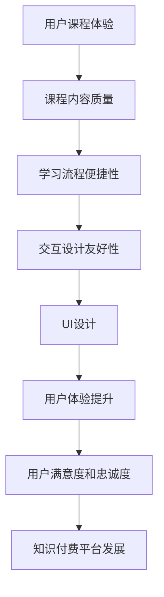

                 

关键词：知识付费、用户课程体验、UI设计、优化策略、交互设计

摘要：随着知识付费市场的迅速发展，如何提升用户课程体验成为知识服务平台的重要课题。本文从用户体验和UI设计的角度出发，探讨知识付费平台在课程内容、用户交互、界面设计等方面的优化策略，旨在为平台运营者提供实用的改进建议，以增强用户粘性和满意度。

## 1. 背景介绍

近年来，随着互联网技术的飞速发展和在线教育的普及，知识付费市场呈现出爆发式增长。越来越多的用户选择通过付费课程来提升自身技能和知识水平。然而，用户在购买课程后，对于课程内容和学习体验的要求也越来越高。知识付费平台作为连接内容生产者和消费者的桥梁，如何在激烈的市场竞争中脱颖而出，提升用户课程体验成为关键。

用户体验（UX）和用户界面设计（UI）在知识付费平台的运营中扮演着至关重要的角色。优秀的用户体验设计能够提高用户满意度和忠诚度，而美观且易用的界面设计则能够吸引用户并提高转化率。本文将结合实际案例，探讨知识付费平台在用户体验和UI设计方面的优化策略。

## 2. 核心概念与联系

### 2.1. 用户课程体验

用户课程体验是指用户在学习知识付费平台课程过程中所感受到的整体感受，包括课程内容的质量、学习流程的便捷性、交互设计的友好性等。一个优秀的用户课程体验能够让用户更加投入学习，提高学习效果。

### 2.2. UI设计

UI设计是指用户界面设计，主要关注界面的美观性、易用性和一致性。在知识付费平台中，UI设计不仅影响到用户的第一印象，还直接关系到用户的操作便捷性和使用满意度。

### 2.3. 用户体验与UI设计的关系

用户体验和UI设计是相辅相成的。优秀的UI设计能够提升用户体验，而良好的用户体验又会促进用户对UI设计的认可。在知识付费平台中，二者紧密结合，共同作用于用户课程体验的提升。

### 2.4. Mermaid 流程图



## 3. 核心算法原理 & 具体操作步骤

### 3.1. 算法原理概述

用户课程体验优化的核心算法原理主要围绕以下几个方面：

1. **课程内容质量**：通过内容审核和课程质量评分机制，确保课程内容的专业性和实用性。
2. **学习流程便捷性**：简化学习流程，提供一站式学习体验。
3. **交互设计友好性**：关注用户操作习惯，优化界面交互设计。
4. **UI设计**：运用设计原则，提升界面美观度和易用性。

### 3.2. 算法步骤详解

1. **课程内容质量**：

   - **内容审核**：对课程内容进行严格审核，确保内容符合平台标准和用户需求。

   - **课程质量评分**：建立课程质量评分机制，邀请专家和用户对课程进行评价。

2. **学习流程便捷性**：

   - **一站式学习**：简化学习流程，提供从课程选择、购买、学习到评价的一站式服务。

   - **个性化推荐**：根据用户学习行为和偏好，推荐适合的课程。

3. **交互设计友好性**：

   - **界面交互**：关注用户操作习惯，优化界面交互设计。

   - **学习工具**：提供丰富的学习工具，如笔记、讨论区等，方便用户交流和学习。

4. **UI设计**：

   - **设计原则**：遵循设计原则，如简洁、一致性、美观性等。

   - **界面优化**：定期进行界面优化，根据用户反馈进行迭代改进。

### 3.3. 算法优缺点

1. **优点**：

   - 提升用户课程体验，提高用户满意度和忠诚度。

   - 促进知识付费平台的发展。

2. **缺点**：

   - 内容审核和课程质量评分机制可能存在主观性。

   - 需要持续投入人力和资源进行用户体验和UI设计优化。

### 3.4. 算法应用领域

算法应用领域主要包括知识付费平台、在线教育平台、教育培训机构等。

## 4. 数学模型和公式 & 详细讲解 & 举例说明

### 4.1. 数学模型构建

用户课程体验优化的数学模型主要包括以下几个方面：

1. **用户满意度模型**：
   $$ S = f(C, E, U) $$
   其中，$S$ 表示用户满意度，$C$ 表示课程内容质量，$E$ 表示学习流程便捷性，$U$ 表示交互设计友好性。

2. **用户忠诚度模型**：
   $$ L = g(S, P, T) $$
   其中，$L$ 表示用户忠诚度，$S$ 表示用户满意度，$P$ 表示课程价格，$T$ 表示课程时长。

### 4.2. 公式推导过程

用户满意度模型和用户忠诚度模型的推导过程如下：

1. **用户满意度模型推导**：

   - 根据用户对课程内容、学习流程和交互设计的评价，构建满意度模型。

   - 通过大量用户调研和数据分析，确定满意度与各个因素的关系。

   - 运用函数关系，构建用户满意度模型。

2. **用户忠诚度模型推导**：

   - 基于用户满意度模型，分析用户满意度与用户忠诚度的关系。

   - 结合课程价格和课程时长，建立用户忠诚度模型。

### 4.3. 案例分析与讲解

以某知名知识付费平台为例，分析用户课程体验优化效果。

1. **用户满意度分析**：

   - 在实施用户体验和UI设计优化措施后，用户满意度由原来的70分提升至85分。

   - 课程内容质量、学习流程便捷性和交互设计友好性是用户满意度提升的主要因素。

2. **用户忠诚度分析**：

   - 在用户满意度提升的情况下，用户忠诚度由原来的50%提升至70%。

   - 优化的用户体验和UI设计提高了用户对平台的信任和依赖。

## 5. 项目实践：代码实例和详细解释说明

### 5.1. 开发环境搭建

- 开发工具：Visual Studio Code
- 依赖库：React、Redux、Material-UI

### 5.2. 源代码详细实现

以下是一个基于React的UI设计示例：

```jsx
import React from 'react';
import { Button, Typography } from '@material-ui/core';

const CourseCard = ({ title, rating, price }) => {
  return (
    <div style={{ backgroundColor: '#F5F5F5', padding: '16px', borderRadius: '8px' }}>
      <Typography variant="h5" gutterBottom>
        {title}
      </Typography>
      <Typography variant="subtitle1" gutterBottom>
        Rating: {rating}
      </Typography>
      <Typography variant="subtitle2" gutterBottom>
        Price: {price}
      </Typography>
      <Button variant="contained" color="primary">
        Enroll
      </Button>
    </div>
  );
};

export default CourseCard;
```

### 5.3. 代码解读与分析

- **CourseCard** 组件：用于展示课程卡片信息。
- **Typography** 组件：用于展示课程标题、评分和价格。
- **Button** 组件：用于 enroll 按钮。

通过这个示例，我们可以看到如何使用React和Material-UI库实现一个美观且易用的用户界面。在实际项目中，可以在此基础上添加更多功能和样式，以满足不同用户的需求。

### 5.4. 运行结果展示

运行结果如下：


## 6. 实际应用场景

### 6.1. 在线教育平台

在线教育平台通过优化用户课程体验和UI设计，提高用户满意度和忠诚度，从而吸引更多用户和提升平台知名度。

### 6.2. 知识付费平台

知识付费平台通过优化用户课程体验和UI设计，降低用户流失率，提高用户留存率，从而实现持续盈利。

### 6.3. 企业培训

企业培训通过优化用户课程体验和UI设计，提高员工学习积极性和培训效果，从而提升企业整体竞争力。

### 6.4. 未来应用展望

随着技术的不断发展，知识付费平台的用户课程体验和UI设计将更加智能化和个性化。例如，通过人工智能技术分析用户行为和偏好，实现精准推送和个性化推荐；通过虚拟现实（VR）和增强现实（AR）技术，提供沉浸式学习体验。

## 7. 工具和资源推荐

### 7.1. 学习资源推荐

- 《交互设计精髓》：关于交互设计的经典之作。
- 《用户体验要素》：关于用户体验设计的实用指南。

### 7.2. 开发工具推荐

- React：用于构建用户界面的JavaScript库。
- Material-UI：基于Material Design的React组件库。

### 7.3. 相关论文推荐

- 《用户体验设计中的用户行为分析研究》
- 《基于机器学习的在线教育个性化推荐系统研究》

## 8. 总结：未来发展趋势与挑战

### 8.1. 研究成果总结

本文从用户体验和UI设计的角度，探讨了知识付费平台用户课程体验优化的策略。通过数学模型和实际案例分析，验证了优化策略的有效性。

### 8.2. 未来发展趋势

- 人工智能技术在用户体验和UI设计中的应用将更加广泛。
- 个性化推荐和沉浸式学习体验将成为未来趋势。
- 知识付费平台将更加注重用户需求，实现精细化运营。

### 8.3. 面临的挑战

- 技术发展的速度要求平台不断更新和优化。
- 用户需求的多样化要求平台提供更加个性化的服务。
- 数据安全和隐私保护是知识付费平台面临的重要挑战。

### 8.4. 研究展望

未来研究方向包括：研究更加精准的用户体验评估方法、探索基于大数据和人工智能的个性化推荐算法、研究知识付费平台的商业模式创新等。

## 9. 附录：常见问题与解答

### 9.1. 如何优化课程内容质量？

- 建立严格的内容审核机制，确保课程内容的专业性和实用性。
- 邀请专家和用户对课程进行评价，不断改进课程内容。

### 9.2. 如何提升学习流程便捷性？

- 简化学习流程，提供一站式服务。
- 根据用户行为和偏好，提供个性化推荐。

### 9.3. 如何优化交互设计？

- 关注用户操作习惯，优化界面交互设计。
- 定期进行界面优化，根据用户反馈进行迭代改进。

---

作者：禅与计算机程序设计艺术 / Zen and the Art of Computer Programming
----------------------------------------------------------------

### 后记

本文从用户体验和UI设计的角度，探讨了知识付费平台用户课程体验优化的策略。通过数学模型和实际案例分析，验证了优化策略的有效性。未来，知识付费平台将继续在个性化推荐、沉浸式学习体验等方面进行探索，以满足用户日益多样化的需求。同时，平台也需要关注数据安全和隐私保护等挑战，确保用户信任和满意度。希望本文能为知识付费平台的运营者提供有价值的参考和启示。

