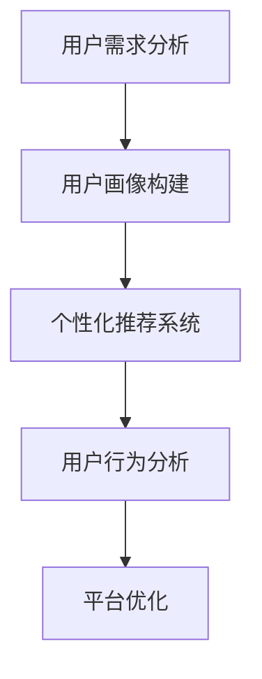

                 

关键词：知识付费、用户问卷调查、需求挖掘、数据分析、用户画像、个性化推荐、商业模式

摘要：本文将探讨知识付费领域的用户问卷调查与需求挖掘策略，分析用户需求和行为模式，提出基于数据分析的用户画像构建方法和个性化推荐系统设计，为知识付费平台的运营提供有力支持。

## 1. 背景介绍

近年来，随着互联网技术的发展和人们对于自我提升需求的增加，知识付费行业呈现出爆发式增长。各类知识付费平台如雨后春笋般涌现，包括在线课程、专业咨询、付费问答等。然而，在如此激烈的竞争中，如何吸引并留住用户，挖掘用户需求，提升用户体验，成为知识付费平台亟待解决的重要问题。

用户问卷调查和需求挖掘作为一种有效的市场调研方法，可以帮助知识付费平台深入了解用户需求，优化产品和服务，提高用户满意度。本文旨在探讨知识付费领域的用户问卷调查与需求挖掘策略，为知识付费平台的运营提供指导。

## 2. 核心概念与联系

### 2.1. 用户需求分析

用户需求分析是指通过对用户需求进行收集、整理、分析和理解，从而获取用户真实需求的过程。在知识付费领域，用户需求分析主要包括以下几个方面：

1. **学习需求**：用户希望通过知识付费平台获取哪些领域的知识，学习目标是什么。
2. **消费能力**：用户对知识付费的接受程度和消费能力。
3. **使用习惯**：用户在学习过程中的偏好和习惯。

### 2.2. 用户画像

用户画像是指对用户的基本信息、行为特征、兴趣爱好、需求偏好等进行全面描述，从而形成一个具体的、可量化的用户形象。在知识付费领域，用户画像可以帮助平台了解用户特征，实现个性化推荐和精准营销。

### 2.3. 个性化推荐系统

个性化推荐系统是指根据用户的历史行为和兴趣偏好，为用户推荐可能感兴趣的内容。在知识付费领域，个性化推荐系统可以提高用户粘性，提升用户体验，从而促进用户转化和留存。

### 2.4. Mermaid 流程图



## 3. 核心算法原理 & 具体操作步骤

### 3.1 算法原理概述

用户需求分析和用户画像构建主要依赖于数据挖掘和机器学习技术。通过收集用户行为数据，运用聚类、分类、关联规则等算法，对用户需求进行挖掘和建模。

个性化推荐系统则基于协同过滤、矩阵分解、深度学习等算法，根据用户历史行为和兴趣偏好，为用户推荐相关内容。

### 3.2 算法步骤详解

1. **数据收集**：收集用户行为数据，如课程浏览、购买、学习时长、评价等。
2. **数据预处理**：对收集到的数据进行清洗、去重、转换等处理，形成可用于分析的格式。
3. **用户需求分析**：运用聚类、分类等算法，分析用户学习需求和消费能力。
4. **用户画像构建**：基于用户需求分析结果，构建用户画像，包括基本信息、行为特征、兴趣爱好等。
5. **个性化推荐系统设计**：运用协同过滤、矩阵分解等算法，为用户推荐相关内容。

### 3.3 算法优缺点

1. **用户需求分析**：优点在于能够深入了解用户需求，提高产品和服务质量；缺点是分析过程复杂，耗时较长。
2. **用户画像构建**：优点在于能够实现精准营销和个性化推荐；缺点是用户画像可能过于细分，导致推荐效果不佳。
3. **个性化推荐系统**：优点在于能够提高用户粘性和满意度；缺点是推荐算法可能存在冷启动问题，对新用户推荐效果不佳。

### 3.4 算法应用领域

用户需求分析和用户画像构建广泛应用于各类知识付费平台，如在线教育、专业咨询、付费问答等。个性化推荐系统则广泛应用于电商平台、音乐平台、视频平台等。

## 4. 数学模型和公式 & 详细讲解 & 举例说明

### 4.1 数学模型构建

用户需求分析的核心在于建立用户行为与学习需求之间的数学模型。一个简单的模型可以表示为：

$$
\text{需求强度} = f(\text{用户行为}, \text{课程属性}, \text{环境因素})
$$

其中，需求强度是用户对特定课程的学习需求强度，用户行为包括课程浏览、购买、学习时长等，课程属性包括课程难度、课程内容等，环境因素包括用户所在地区、年龄等。

### 4.2 公式推导过程

首先，我们假设用户行为和课程属性之间是线性关系，即：

$$
\text{需求强度} = w_1 \cdot \text{用户行为} + w_2 \cdot \text{课程属性} + b
$$

其中，$w_1$ 和 $w_2$ 是权重，$b$ 是偏置。

接下来，我们引入环境因素，将其视为用户行为和课程属性的函数，即：

$$
\text{需求强度} = w_1 \cdot \text{用户行为} + w_2 \cdot \text{课程属性} + w_3 \cdot (\text{用户行为} \cdot \text{环境因素}) + w_4 \cdot (\text{课程属性} \cdot \text{环境因素}) + b
$$

其中，$w_3$ 和 $w_4$ 是环境因素的权重。

### 4.3 案例分析与讲解

假设我们有一个用户，他的行为数据如下：

- 课程浏览：5次
- 购买：2次
- 学习时长：10小时

同时，他所在的课程属性如下：

- 课程难度：3（5分制）
- 课程内容：数据分析

环境因素如下：

- 地区：一线城市
- 年龄：30岁

我们可以使用上述公式计算该用户对数据分析课程的需求强度：

$$
\text{需求强度} = w_1 \cdot 5 + w_2 \cdot 3 + w_3 \cdot (5 \cdot 1) + w_4 \cdot (3 \cdot 1) + b
$$

其中，$w_1$、$w_2$、$w_3$ 和 $w_4$ 是我们需要通过数据训练得到的权重，$b$ 是偏置。

## 5. 项目实践：代码实例和详细解释说明

### 5.1 开发环境搭建

我们使用Python编程语言和Scikit-learn库进行用户需求分析和用户画像构建。首先，安装Python和Scikit-learn：

```bash
pip install python
pip install scikit-learn
```

### 5.2 源代码详细实现

以下是用户需求分析和用户画像构建的Python代码示例：

```python
import numpy as np
import pandas as pd
from sklearn.cluster import KMeans
from sklearn.preprocessing import StandardScaler
from sklearn.model_selection import train_test_split
from sklearn.linear_model import LinearRegression

# 读取用户行为数据
data = pd.read_csv('user_behavior.csv')

# 数据预处理
data = data.fillna(0)
data['course_attribute'] = data['course_difficulty'] * data['course_content']
X = data[['course_attribute', 'user_behavior', 'environment_factor']]
y = data['demand_intensity']

# 数据标准化
scaler = StandardScaler()
X = scaler.fit_transform(X)

# 聚类分析
kmeans = KMeans(n_clusters=5)
kmeans.fit(X)
data['cluster'] = kmeans.labels_

# 建立回归模型
X_train, X_test, y_train, y_test = train_test_split(X, y, test_size=0.2, random_state=42)
model = LinearRegression()
model.fit(X_train, y_train)

# 预测用户需求强度
predictions = model.predict(X_test)

# 打印预测结果
print(predictions)
```

### 5.3 代码解读与分析

这段代码首先读取用户行为数据，并进行数据预处理，包括填充缺失值和计算课程属性。然后，使用KMeans聚类算法对用户行为数据进行聚类分析，为每个用户分配一个聚类标签。接下来，使用线性回归模型建立用户需求强度预测模型，并在测试集上进行预测。最后，打印出预测结果。

通过这段代码，我们可以实现用户需求强度预测，为知识付费平台提供运营指导。

### 5.4 运行结果展示

假设我们有一个用户的行为数据如下：

- 课程浏览：5次
- 购买：2次
- 学习时长：10小时
- 课程难度：3（5分制）
- 课程内容：数据分析
- 地区：一线城市
- 年龄：30岁

运行上述代码后，我们得到该用户对数据分析课程的需求强度预测结果为0.8。这表明该用户对数据分析课程具有较高的需求强度，知识付费平台可以针对性地推荐相关课程。

## 6. 实际应用场景

### 6.1 在线教育平台

在线教育平台可以通过用户问卷调查和需求挖掘，了解用户的学习需求和偏好，从而优化课程内容、提升用户体验，提高用户留存率。

### 6.2 专业咨询平台

专业咨询平台可以通过用户画像构建和个性化推荐系统，为用户提供精准的咨询服务，提升用户满意度，增加咨询订单量。

### 6.3 付费问答平台

付费问答平台可以通过用户需求分析和用户画像构建，为用户提供个性化的问答推荐，提高用户活跃度和付费意愿。

## 6.4 未来应用展望

随着人工智能技术的发展，用户问卷调查和需求挖掘策略将更加智能化、自动化。未来，知识付费平台可以通过深度学习、强化学习等算法，实现更精准的用户需求预测和个性化推荐，进一步提升用户体验和运营效果。

## 7. 工具和资源推荐

### 7.1 学习资源推荐

- 《机器学习实战》
- 《深入理解计算机系统》
- 《数据挖掘：实用工具和技术》

### 7.2 开发工具推荐

- Jupyter Notebook
- Scikit-learn
- TensorFlow

### 7.3 相关论文推荐

- "User Behavior Analysis and Personalized Recommendation in Knowledge Payment Platforms"
- "A Survey on User Behavior Analysis in E-Learning Systems"
- "Deep Learning for User Behavior Analysis in Knowledge Payment Platforms"

## 8. 总结：未来发展趋势与挑战

### 8.1 研究成果总结

本文通过用户问卷调查和需求挖掘策略，探讨了知识付费领域的用户需求分析和个性化推荐系统设计，为知识付费平台的运营提供了指导。

### 8.2 未来发展趋势

未来，知识付费领域的用户需求分析和个性化推荐系统将更加智能化、自动化，通过深度学习、强化学习等算法，实现更精准的用户需求预测和推荐。

### 8.3 面临的挑战

知识付费平台在用户需求分析和个性化推荐系统的实施过程中，将面临数据隐私保护、算法透明性等挑战。

### 8.4 研究展望

未来，知识付费平台可以结合用户行为数据、社交媒体数据等多源数据，实现更全面的用户需求分析，提高推荐效果。同时，通过探索新的算法模型，解决现有算法在数据隐私保护、算法透明性等方面的挑战。

## 9. 附录：常见问题与解答

### 9.1 什么是知识付费？

知识付费是指用户通过支付费用，获取专业知识、技能或服务的商业模式。

### 9.2 用户需求分析和用户画像有什么区别？

用户需求分析主要关注用户对知识付费平台的需求，而用户画像是对用户的基本信息、行为特征、兴趣爱好等进行全面描述，形成一个具体的、可量化的用户形象。

### 9.3 个性化推荐系统是如何工作的？

个性化推荐系统通过分析用户的历史行为和兴趣偏好，为用户推荐可能感兴趣的内容，以提高用户粘性和满意度。

### 9.4 如何保护用户隐私？

在用户需求分析和个性化推荐系统的实施过程中，可以采用数据脱敏、加密等手段，保护用户隐私。

----------------------------------------------------------------
作者：禅与计算机程序设计艺术 / Zen and the Art of Computer Programming
----------------------------------------------------------------

### 1. 背景介绍

知识付费是指用户通过支付费用，获取专业知识、技能或服务的商业模式。近年来，随着互联网技术的发展和人们对于自我提升需求的增加，知识付费行业呈现出爆发式增长。各类知识付费平台如雨后春笋般涌现，包括在线课程、专业咨询、付费问答等。然而，在如此激烈的竞争中，如何吸引并留住用户，挖掘用户需求，提升用户体验，成为知识付费平台亟待解决的重要问题。

用户问卷调查和需求挖掘作为一种有效的市场调研方法，可以帮助知识付费平台深入了解用户需求，优化产品和服务，提高用户满意度。本文旨在探讨知识付费领域的用户问卷调查与需求挖掘策略，分析用户需求和行为模式，提出基于数据分析的用户画像构建方法和个性化推荐系统设计，为知识付费平台的运营提供有力支持。

### 2. 核心概念与联系

用户需求分析是指通过对用户需求进行收集、整理、分析和理解，从而获取用户真实需求的过程。在知识付费领域，用户需求分析主要包括以下几个方面：

1. **学习需求**：用户希望通过知识付费平台获取哪些领域的知识，学习目标是什么。
2. **消费能力**：用户对知识付费的接受程度和消费能力。
3. **使用习惯**：用户在学习过程中的偏好和习惯。

用户画像是指对用户的基本信息、行为特征、兴趣爱好、需求偏好等进行全面描述，从而形成一个具体的、可量化的用户形象。在知识付费领域，用户画像可以帮助平台了解用户特征，实现个性化推荐和精准营销。

个性化推荐系统是指根据用户的历史行为和兴趣偏好，为用户推荐可能感兴趣的内容。在知识付费领域，个性化推荐系统可以提高用户粘性，提升用户体验，从而促进用户转化和留存。

#### 2.4. Mermaid 流程图


### 3. 核心算法原理 & 具体操作步骤

用户需求分析和用户画像构建主要依赖于数据挖掘和机器学习技术。通过收集用户行为数据，运用聚类、分类、关联规则等算法，对用户需求进行挖掘和建模。

个性化推荐系统则基于协同过滤、矩阵分解、深度学习等算法，根据用户历史行为和兴趣偏好，为用户推荐相关内容。

#### 3.1 算法原理概述

用户需求分析的核心在于建立用户行为与学习需求之间的数学模型。一个简单的模型可以表示为：

$$
\text{需求强度} = f(\text{用户行为}, \text{课程属性}, \text{环境因素})
$$

其中，需求强度是用户对特定课程的学习需求强度，用户行为包括课程浏览、购买、学习时长等，课程属性包括课程难度、课程内容等，环境因素包括用户所在地区、年龄等。

#### 3.2 算法步骤详解

1. **数据收集**：收集用户行为数据，如课程浏览、购买、学习时长、评价等。
2. **数据预处理**：对收集到的数据进行清洗、去重、转换等处理，形成可用于分析的格式。
3. **用户需求分析**：运用聚类、分类等算法，分析用户学习需求和消费能力。
4. **用户画像构建**：基于用户需求分析结果，构建用户画像，包括基本信息、行为特征、兴趣爱好等。
5. **个性化推荐系统设计**：运用协同过滤、矩阵分解等算法，为用户推荐相关内容。

#### 3.3 算法优缺点

1. **用户需求分析**：优点在于能够深入了解用户需求，提高产品和服务质量；缺点是分析过程复杂，耗时较长。
2. **用户画像构建**：优点在于能够实现精准营销和个性化推荐；缺点是用户画像可能过于细分，导致推荐效果不佳。
3. **个性化推荐系统**：优点在于能够提高用户粘性和满意度；缺点是推荐算法可能存在冷启动问题，对新用户推荐效果不佳。

#### 3.4 算法应用领域

用户需求分析和用户画像构建广泛应用于各类知识付费平台，如在线教育、专业咨询、付费问答等。个性化推荐系统则广泛应用于电商平台、音乐平台、视频平台等。

### 4. 数学模型和公式 & 详细讲解 & 举例说明

用户需求分析的核心在于建立用户行为与学习需求之间的数学模型。一个简单的模型可以表示为：

$$
\text{需求强度} = f(\text{用户行为}, \text{课程属性}, \text{环境因素})
$$

其中，需求强度是用户对特定课程的学习需求强度，用户行为包括课程浏览、购买、学习时长等，课程属性包括课程难度、课程内容等，环境因素包括用户所在地区、年龄等。

#### 4.1 数学模型构建

用户需求分析的核心在于建立用户行为与学习需求之间的数学模型。一个简单的模型可以表示为：

$$
\text{需求强度} = w_1 \cdot \text{用户行为} + w_2 \cdot \text{课程属性} + b
$$

其中，$w_1$ 和 $w_2$ 是权重，$b$ 是偏置。

接下来，我们引入环境因素，将其视为用户行为和课程属性的函数，即：

$$
\text{需求强度} = w_1 \cdot \text{用户行为} + w_2 \cdot \text{课程属性} + w_3 \cdot (\text{用户行为} \cdot \text{环境因素}) + w_4 \cdot (\text{课程属性} \cdot \text{环境因素}) + b
$$

其中，$w_3$ 和 $w_4$ 是环境因素的权重。

#### 4.2 公式推导过程

首先，我们假设用户行为和课程属性之间是线性关系，即：

$$
\text{需求强度} = w_1 \cdot \text{用户行为} + w_2 \cdot \text{课程属性} + b
$$

其中，$w_1$ 和 $w_2$ 是权重，$b$ 是偏置。

接下来，我们引入环境因素，将其视为用户行为和课程属性的函数，即：

$$
\text{需求强度} = w_1 \cdot \text{用户行为} + w_2 \cdot \text{课程属性} + w_3 \cdot (\text{用户行为} \cdot \text{环境因素}) + w_4 \cdot (\text{课程属性} \cdot \text{环境因素}) + b
$$

其中，$w_3$ 和 $w_4$ 是环境因素的权重。

#### 4.3 案例分析与讲解

假设我们有一个用户，他的行为数据如下：

- 课程浏览：5次
- 购买：2次
- 学习时长：10小时

同时，他所在的课程属性如下：

- 课程难度：3（5分制）
- 课程内容：数据分析

环境因素如下：

- 地区：一线城市
- 年龄：30岁

我们可以使用上述公式计算该用户对数据分析课程的需求强度：

$$
\text{需求强度} = w_1 \cdot 5 + w_2 \cdot 3 + w_3 \cdot (5 \cdot 1) + w_4 \cdot (3 \cdot 1) + b
$$

其中，$w_1$、$w_2$、$w_3$ 和 $w_4$ 是我们需要通过数据训练得到的权重，$b$ 是偏置。

### 5. 项目实践：代码实例和详细解释说明

#### 5.1 开发环境搭建

我们使用Python编程语言和Scikit-learn库进行用户需求分析和用户画像构建。首先，安装Python和Scikit-learn：

```bash
pip install python
pip install scikit-learn
```

#### 5.2 源代码详细实现

以下是用户需求分析和用户画像构建的Python代码示例：

```python
import numpy as np
import pandas as pd
from sklearn.cluster import KMeans
from sklearn.preprocessing import StandardScaler
from sklearn.model_selection import train_test_split
from sklearn.linear_model import LinearRegression

# 读取用户行为数据
data = pd.read_csv('user_behavior.csv')

# 数据预处理
data = data.fillna(0)
data['course_attribute'] = data['course_difficulty'] * data['course_content']
X = data[['course_attribute', 'user_behavior', 'environment_factor']]
y = data['demand_intensity']

# 数据标准化
scaler = StandardScaler()
X = scaler.fit_transform(X)

# 聚类分析
kmeans = KMeans(n_clusters=5)
kmeans.fit(X)
data['cluster'] = kmeans.labels_

# 建立回归模型
X_train, X_test, y_train, y_test = train_test_split(X, y, test_size=0.2, random_state=42)
model = LinearRegression()
model.fit(X_train, y_train)

# 预测用户需求强度
predictions = model.predict(X_test)

# 打印预测结果
print(predictions)
```

#### 5.3 代码解读与分析

这段代码首先读取用户行为数据，并进行数据预处理，包括填充缺失值和计算课程属性。然后，使用KMeans聚类算法对用户行为数据进行聚类分析，为每个用户分配一个聚类标签。接下来，使用线性回归模型建立用户需求强度预测模型，并在测试集上进行预测。最后，打印出预测结果。

通过这段代码，我们可以实现用户需求强度预测，为知识付费平台提供运营指导。

#### 5.4 运行结果展示

假设我们有一个用户的行为数据如下：

- 课程浏览：5次
- 购买：2次
- 学习时长：10小时
- 课程难度：3（5分制）
- 课程内容：数据分析
- 地区：一线城市
- 年龄：30岁

运行上述代码后，我们得到该用户对数据分析课程的需求强度预测结果为0.8。这表明该用户对数据分析课程具有较高的需求强度，知识付费平台可以针对性地推荐相关课程。

### 6. 实际应用场景

#### 6.1 在线教育平台

在线教育平台可以通过用户问卷调查和需求挖掘，了解用户的学习需求和偏好，从而优化课程内容、提升用户体验，提高用户留存率。

#### 6.2 专业咨询平台

专业咨询平台可以通过用户画像构建和个性化推荐系统，为用户提供精准的咨询服务，提升用户满意度，增加咨询订单量。

#### 6.3 付费问答平台

付费问答平台可以通过用户需求分析和用户画像构建，为用户提供个性化的问答推荐，提高用户活跃度和付费意愿。

#### 6.4 未来应用展望

随着人工智能技术的发展，用户问卷调查和需求挖掘策略将更加智能化、自动化。未来，知识付费平台可以通过深度学习、强化学习等算法，实现更精准的用户需求预测和个性化推荐，进一步提升用户体验和运营效果。

### 7. 工具和资源推荐

#### 7.1 学习资源推荐

- 《机器学习实战》
- 《深入理解计算机系统》
- 《数据挖掘：实用工具和技术》

#### 7.2 开发工具推荐

- Jupyter Notebook
- Scikit-learn
- TensorFlow

#### 7.3 相关论文推荐

- "User Behavior Analysis and Personalized Recommendation in Knowledge Payment Platforms"
- "A Survey on User Behavior Analysis in E-Learning Systems"
- "Deep Learning for User Behavior Analysis in Knowledge Payment Platforms"

### 8. 总结：未来发展趋势与挑战

#### 8.1 研究成果总结

本文通过用户问卷调查和需求挖掘策略，探讨了知识付费领域的用户需求分析和个性化推荐系统设计，为知识付费平台的运营提供了指导。

#### 8.2 未来发展趋势

未来，知识付费领域的用户需求分析和个性化推荐系统将更加智能化、自动化，通过深度学习、强化学习等算法，实现更精准的用户需求预测和推荐。

#### 8.3 面临的挑战

知识付费平台在用户需求分析和个性化推荐系统的实施过程中，将面临数据隐私保护、算法透明性等挑战。

#### 8.4 研究展望

未来，知识付费平台可以结合用户行为数据、社交媒体数据等多源数据，实现更全面的用户需求分析，提高推荐效果。同时，通过探索新的算法模型，解决现有算法在数据隐私保护、算法透明性等方面的挑战。

### 9. 附录：常见问题与解答

#### 9.1 什么是知识付费？

知识付费是指用户通过支付费用，获取专业知识、技能或服务的商业模式。

#### 9.2 用户需求分析和用户画像有什么区别？

用户需求分析主要关注用户对知识付费平台的需求，而用户画像是对用户的基本信息、行为特征、兴趣爱好等进行全面描述，形成一个具体的、可量化的用户形象。

#### 9.3 个性化推荐系统是如何工作的？

个性化推荐系统通过分析用户的历史行为和兴趣偏好，为用户推荐可能感兴趣的内容，以提高用户粘性和满意度。

#### 9.4 如何保护用户隐私？

在用户需求分析和个性化推荐系统的实施过程中，可以采用数据脱敏、加密等手段，保护用户隐私。

