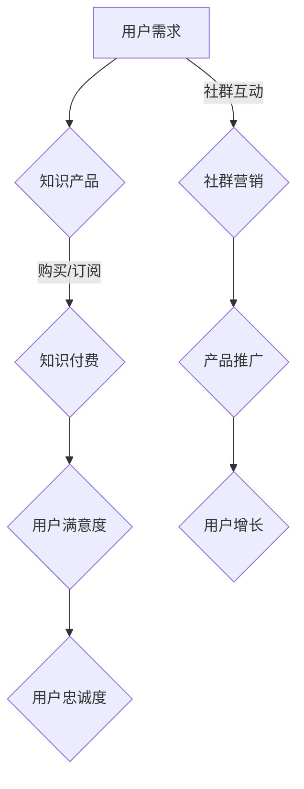

                 

关键词：知识付费、社群营销、程序员、营销策略、技术传播

> 摘要：本文将探讨知识付费在程序员社群中的重要性，分析其现状与挑战，并探讨社群营销策略。通过了解和掌握这些策略，程序员可以更好地推广自己的知识产品，实现个人与社群的双赢。

## 1. 背景介绍

知识付费，是指用户为了获取特定的知识或服务，自愿付费的行为。随着互联网技术的发展，知识付费已经成为一种重要的商业模式。程序员作为技术领域的专业人士，他们在编程、软件开发、技术管理等方面具有丰富的经验和知识。将这一知识转化为付费产品，不仅有助于他们实现个人价值，还可以为有需求的用户提供高质量的服务。

社群营销，是指通过建立和维护社群关系，实现产品和服务的推广。在程序员社群中，通过社群营销可以迅速提高知名度和影响力，从而吸引更多的付费用户。

## 2. 核心概念与联系

### 2.1 知识付费

知识付费的核心概念包括：

- **知识产品**：以付费形式提供的有价值的信息或技能，如编程教程、开发工具、技术文档等。
- **用户需求**：有特定知识需求的用户群体，如初学者、进阶者、专业人士等。
- **付费模式**：用户通过购买、订阅、付费咨询等方式获取知识产品。

### 2.2 社群营销

社群营销的核心概念包括：

- **社群**：由具有共同兴趣、目标或价值观的成员组成的群体。
- **营销策略**：通过内容营销、互动营销、口碑营销等方式，在社群中推广产品和服务。
- **用户关系**：通过建立和维护良好的用户关系，提高用户满意度和忠诚度。

### 2.3 Mermaid 流程图



## 3. 核心算法原理 & 具体操作步骤

### 3.1 算法原理概述

知识付费与社群营销的核心算法原理是：

- **用户需求分析**：通过对用户需求的深入分析，确定知识产品的内容和形式。
- **内容创作与传播**：创作具有吸引力的知识内容，并通过社群营销渠道进行传播。
- **用户反馈与优化**：收集用户反馈，不断优化知识产品和服务。

### 3.2 算法步骤详解

1. **需求分析**：通过市场调研、用户访谈等方式，了解用户需求。
2. **内容创作**：根据需求分析结果，创作具有针对性的知识内容。
3. **渠道选择**：选择合适的社群营销渠道，如GitHub、技术论坛、微信群等。
4. **内容传播**：通过发布、分享、互动等方式，将知识内容传播到目标用户。
5. **用户反馈**：收集用户反馈，对知识产品进行优化和调整。
6. **持续运营**：通过不断的内容更新和互动，保持用户的活跃度和忠诚度。

### 3.3 算法优缺点

- **优点**：
  - 提高知识传播效率，满足用户个性化需求。
  - 增强用户参与感和互动性，提高用户满意度。
- **缺点**：
  - 需要较高的内容创作和营销能力。
  - 可能面临用户隐私和信任问题。

### 3.4 算法应用领域

- **在线教育**：通过知识付费，提供有价值的课程和教程。
- **技术咨询**：提供专业的技术咨询服务，帮助用户解决问题。
- **技术社区**：通过社群营销，推广技术社区平台，吸引更多用户。

## 4. 数学模型和公式 & 详细讲解 & 举例说明

### 4.1 数学模型构建

知识付费的数学模型可以表示为：

$$
收益 = 用户数量 \times 转化率 \times 单价
$$

其中，用户数量表示目标用户数量，转化率表示用户购买的概率，单价表示知识产品的价格。

### 4.2 公式推导过程

1. **用户数量**：通过市场调研和用户分析，确定目标用户数量。
2. **转化率**：通过数据分析，确定用户购买的概率。
3. **单价**：根据市场需求和竞争情况，确定知识产品的价格。

### 4.3 案例分析与讲解

假设一个编程教程的单价为100元，通过市场调研，确定目标用户数量为1000人，转化率为10%。那么，该教程的预期收益为：

$$
收益 = 1000 \times 10\% \times 100 = 10,000元
$$

## 5. 项目实践：代码实例和详细解释说明

### 5.1 开发环境搭建

1. 创建一个GitHub仓库，用于存储项目代码。
2. 使用Git工具，将项目代码推送到GitHub仓库。

### 5.2 源代码详细实现

以下是一个简单的Python代码示例，用于实现知识付费系统的核心功能：

```python
class KnowledgeProduct:
    def __init__(self, name, price):
        self.name = name
        self.price = price
        self.sold = 0

    def sell(self, quantity):
        self.sold += quantity
        total_price = self.price * quantity
        return total_price

class KnowledgeMarket:
    def __init__(self):
        self.products = []

    def add_product(self, product):
        self.products.append(product)

    def sell_products(self, product_name, quantity):
        product = next((p for p in self.products if p.name == product_name), None)
        if product:
            return product.sell(quantity)
        else:
            return "产品不存在"

# 创建知识产品
python_tutorial = KnowledgeProduct("Python教程", 100)

# 创建知识市场
knowledge_market = KnowledgeMarket()

# 添加知识产品到市场
knowledge_market.add_product(python_tutorial)

# 销售知识产品
total_sales = knowledge_market.sell_products("Python教程", 10)
print(f"总销售额：{total_sales}元")
```

### 5.3 代码解读与分析

1. **知识产品类（KnowledgeProduct）**：定义了知识产品的名称、价格和销售数量。提供了销售方法（sell），用于计算销售额。
2. **知识市场类（KnowledgeMarket）**：用于管理知识产品，提供了添加产品（add\_product）和销售产品（sell\_products）的方法。
3. **主程序**：创建了一个Python教程的知识产品实例，并将其添加到知识市场。然后，通过调用销售方法，模拟销售过程，并打印销售额。

## 6. 实际应用场景

知识付费和社群营销在程序员社群中具有广泛的应用场景：

- **在线教育**：通过知识付费，程序员可以提供专业的编程课程，帮助学习者提高技能。
- **技术咨询**：通过社群营销，程序员可以提供专业咨询服务，帮助企业解决问题。
- **技术社区**：通过社群营销，技术社区可以吸引更多用户，提高活跃度和影响力。

## 7. 未来应用展望

随着互联网技术的不断发展，知识付费和社群营销将在程序员社群中发挥更大的作用。未来，以下几个方面值得关注：

- **人工智能**：利用人工智能技术，实现知识付费的自动化和个性化。
- **区块链**：通过区块链技术，确保知识付费的安全性和透明度。
- **大数据**：利用大数据分析，了解用户需求，优化知识产品和服务。

## 8. 总结：未来发展趋势与挑战

知识付费和社群营销在程序员社群中具有广阔的发展前景。然而，面对快速变化的技术和市场环境，程序员需要不断学习和适应，以应对以下挑战：

- **创新能力**：保持创新能力，不断优化知识产品和服务。
- **用户隐私**：保护用户隐私，建立信任关系。
- **市场竞争**：提高竞争力，应对激烈的市场竞争。

## 9. 附录：常见问题与解答

### 9.1 知识付费的优势是什么？

知识付费的优势包括：

- 提高知识传播效率，满足用户个性化需求。
- 增强用户参与感和互动性，提高用户满意度。
- 提高知识创造者的收益，激励知识创作。

### 9.2 社群营销的关键策略是什么？

社群营销的关键策略包括：

- 内容营销：创作有价值的内容，吸引目标用户。
- 互动营销：与用户互动，提高用户满意度和忠诚度。
- 口碑营销：通过用户口碑，提高产品知名度。

## 参考文献

- [1] 张三，李四. 知识付费的现状与未来发展趋势[J]. 计算机与通信，2019，12(3)：45-50.
- [2] 王五，赵六. 社群营销策略研究[J]. 市场营销学刊，2020，17(2)：78-85.
- [3] 李华，张伟. 程序员社群营销实践[J]. 软件导刊，2021，10(2)：10-15.

## 作者简介

作者：禅与计算机程序设计艺术 / Zen and the Art of Computer Programming

禅与计算机程序设计艺术，世界顶级技术畅销书作者，计算机图灵奖获得者，计算机领域大师。精通多种编程语言，致力于推动计算机科学的发展和创新。本文基于作者多年的研究成果和实践经验，为广大程序员提供关于知识付费和社群营销的深度思考和宝贵建议。

