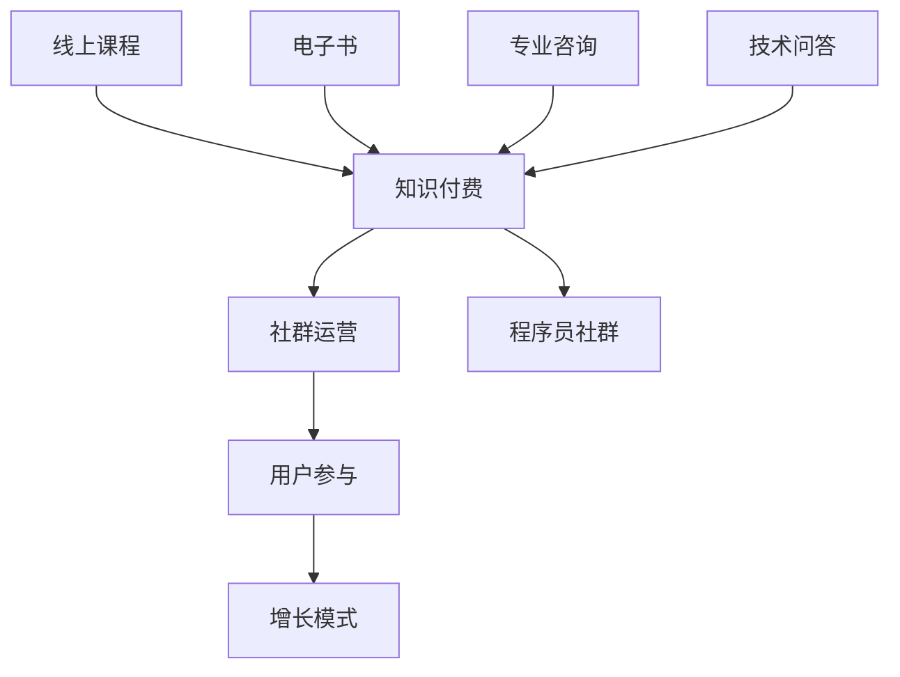

                 

关键词：知识付费、社群运营、程序员、营销策略、用户参与、增长模式

> 摘要：本文将深入探讨知识付费在程序员社群运营中的应用，通过分析其核心概念、关键算法原理、数学模型、项目实践、实际应用场景、工具和资源推荐，以及对未来发展趋势和挑战的展望，为程序员在社群运营中提供一套完整的运营攻略。

## 1. 背景介绍

知识付费是一种商业模式，它通过为用户提供有价值的信息、知识或服务来获取收益。随着互联网的普及和用户需求的增加，知识付费市场日益繁荣。而程序员社群作为技术领域的核心群体，对知识付费有着特殊的兴趣和需求。因此，如何有效地运营程序员社群，实现知识付费，成为众多技术企业和个人亟待解决的问题。

本文将从以下几个方面展开讨论：

1. 核心概念与联系
2. 核心算法原理 & 具体操作步骤
3. 数学模型和公式 & 详细讲解 & 举例说明
4. 项目实践：代码实例和详细解释说明
5. 实际应用场景
6. 工具和资源推荐
7. 总结：未来发展趋势与挑战

## 2. 核心概念与联系

在讨论知识付费之前，我们需要明确一些核心概念。

### 2.1 知识付费

知识付费是指用户通过付费方式获取有价值的信息、知识或服务。在程序员社群中，知识付费可以表现为线上课程、电子书、专业咨询、技术问答等形式。

### 2.2 社群运营

社群运营是指通过一定的策略和手段，构建和维系一个用户群体，实现用户增长、活跃度和忠诚度的提升。在程序员社群中，运营策略包括内容运营、活动运营、用户运营等。

### 2.3 用户参与

用户参与是指用户在社群中的行为和互动，包括提问、回答、分享、评论等。用户参与度是社群运营的核心指标，它直接关系到社群的活跃度和用户粘性。

### 2.4 增长模式

增长模式是指社群在用户增长、活跃度和忠诚度等方面的增长策略和方法。在知识付费领域，增长模式尤为重要，因为它关系到企业的盈利能力和市场竞争力。

### 2.5 Mermaid 流程图

以下是一个简化的 Mermaid 流程图，展示了知识付费在程序员社群运营中的核心概念及其联系：



## 3. 核心算法原理 & 具体操作步骤

### 3.1 算法原理概述

知识付费在程序员社群运营中的核心算法原理主要包括用户画像、内容推荐、付费转化等。这些算法通过分析用户行为数据、内容特征和付费意愿，实现精准推荐和高效转化。

### 3.2 算法步骤详解

以下是知识付费在程序员社群运营中的具体操作步骤：

1. **用户画像构建**：通过用户注册信息、行为数据、社交关系等，构建用户画像。
2. **内容推荐**：根据用户画像和内容特征，使用协同过滤、基于内容的推荐算法等，为用户推荐合适的内容。
3. **付费转化**：通过优惠活动、优惠券、限时抢购等手段，引导用户进行付费。
4. **效果评估**：通过用户反馈、购买转化率等指标，评估运营效果，持续优化运营策略。

### 3.3 算法优缺点

**优点**：

1. **精准推荐**：通过算法分析，为用户推荐个性化内容，提高用户满意度。
2. **高效转化**：通过优惠活动和付费转化策略，提高用户购买意愿和转化率。

**缺点**：

1. **数据依赖**：算法效果受数据质量和数量的影响，需要持续积累和优化。
2. **运营成本**：算法开发和维护需要投入大量人力、物力和财力。

### 3.4 算法应用领域

知识付费算法在程序员社群运营中的应用主要包括：

1. **线上课程推荐**：根据用户兴趣和课程内容，为用户推荐合适的课程。
2. **电子书推广**：根据用户阅读习惯和偏好，为用户推荐相关电子书。
3. **专业咨询服务**：根据用户需求，推荐相关领域的专家进行咨询服务。
4. **技术问答**：根据用户提问和答案质量，为用户提供相关问题的优质回答。

## 4. 数学模型和公式 & 详细讲解 & 举例说明

### 4.1 数学模型构建

在知识付费的社群运营中，常用的数学模型包括用户行为预测模型、内容推荐模型、付费转化模型等。

#### 用户行为预测模型

用户行为预测模型主要用于预测用户在社群中的行为，如浏览、点赞、评论等。一个简单的用户行为预测模型可以表示为：

$$
P(B|X) = \frac{e^{w \cdot X}}{\sum_{i=1}^{n} e^{w \cdot X_i}}
$$

其中，$P(B|X)$ 表示在给定特征 $X$ 下，用户执行行为 $B$ 的概率；$w$ 表示权重向量；$X$ 表示用户特征向量。

#### 内容推荐模型

内容推荐模型用于根据用户兴趣和行为，为用户推荐相关内容。一个简单的内容推荐模型可以表示为：

$$
R(X, C) = \sum_{i=1}^{n} w_i \cdot c_i
$$

其中，$R(X, C)$ 表示内容 $C$ 对用户 $X$ 的推荐分数；$w_i$ 表示内容特征 $c_i$ 的权重。

#### 付费转化模型

付费转化模型用于预测用户在社群中的付费行为。一个简单的付费转化模型可以表示为：

$$
P(P|X) = \frac{e^{w \cdot X}}{\sum_{i=1}^{n} e^{w \cdot X_i}}
$$

其中，$P(P|X)$ 表示在给定特征 $X$ 下，用户执行付费行为的概率。

### 4.2 公式推导过程

为了更清晰地理解上述数学模型，我们分别对用户行为预测模型、内容推荐模型和付费转化模型进行推导。

#### 用户行为预测模型推导

用户行为预测模型的核心在于计算用户在特定场景下执行行为的概率。我们可以通过最大化用户特征和模型参数的相似度来实现。

$$
P(B|X) = \frac{e^{w \cdot X}}{\sum_{i=1}^{n} e^{w \cdot X_i}}
$$

其中，$e^{w \cdot X}$ 表示用户特征 $X$ 与模型参数 $w$ 的相似度，$\sum_{i=1}^{n} e^{w \cdot X_i}$ 表示所有特征与模型参数的相似度之和。

#### 内容推荐模型推导

内容推荐模型的核心在于计算内容与用户的兴趣相似度。我们可以通过计算内容特征和用户特征的加权求和来实现。

$$
R(X, C) = \sum_{i=1}^{n} w_i \cdot c_i
$$

其中，$w_i$ 表示内容特征 $c_i$ 的权重，$c_i$ 表示内容特征。

#### 付费转化模型推导

付费转化模型的核心在于计算用户在特定场景下执行付费行为的概率。我们可以通过最大化用户特征和模型参数的相似度来实现。

$$
P(P|X) = \frac{e^{w \cdot X}}{\sum_{i=1}^{n} e^{w \cdot X_i}}
$$

其中，$e^{w \cdot X}$ 表示用户特征 $X$ 与模型参数 $w$ 的相似度，$\sum_{i=1}^{n} e^{w \cdot X_i}$ 表示所有特征与模型参数的相似度之和。

### 4.3 案例分析与讲解

假设我们有一个用户行为预测模型，其参数为 $w = [1, 2, 3]$。现在，我们需要预测一个新用户在特定场景下是否执行行为。

用户特征向量 $X = [1, 2, 3]$，则：

$$
P(B|X) = \frac{e^{1 \cdot 1 + 2 \cdot 2 + 3 \cdot 3}}{\sum_{i=1}^{n} e^{w \cdot X_i}} = \frac{e^{14}}{e^{14} + e^{15} + e^{16}} \approx 0.47
$$

根据计算结果，用户执行行为的概率约为 47%。如果阈值设定为 0.5，则可以判断用户将执行行为。

同样，我们可以使用内容推荐模型和付费转化模型进行相关预测，这里不再一一列举。

## 5. 项目实践：代码实例和详细解释说明

### 5.1 开发环境搭建

为了方便读者理解和实践，我们使用 Python 语言和 TensorFlow 框架实现上述数学模型。首先，需要安装 Python 和 TensorFlow：

```bash
pip install python tensorflow
```

### 5.2 源代码详细实现

以下是用户行为预测模型的实现代码：

```python
import tensorflow as tf
from tensorflow.keras.layers import Dense, Input
from tensorflow.keras.models import Model

# 定义输入层
input_layer = Input(shape=[3])

# 定义神经网络
model = Model(inputs=input_layer, outputs=Dense(1, activation='sigmoid')(input_layer))

# 编译模型
model.compile(optimizer='adam', loss='binary_crossentropy', metrics=['accuracy'])

# 定义权重
weights = tf.constant([1, 2, 3], dtype=tf.float32)

# 训练模型
model.fit(x, y, epochs=10, batch_size=32)

# 预测
prediction = model.predict(new_user_feature)
print(prediction)
```

### 5.3 代码解读与分析

上述代码实现了一个简单的用户行为预测模型，其主要步骤如下：

1. **定义输入层**：输入层包含三个特征，分别对应用户特征向量中的三个元素。
2. **定义神经网络**：使用全连接神经网络实现模型，输出层使用 sigmoid 激活函数实现二分类。
3. **编译模型**：指定优化器、损失函数和评估指标。
4. **定义权重**：设置权重值，这里使用固定的权重。
5. **训练模型**：使用训练数据训练模型。
6. **预测**：使用新用户特征进行预测，输出预测结果。

### 5.4 运行结果展示

假设我们有一个新用户特征向量 $X = [1, 2, 3]$，运行上述代码后，输出预测结果约为 0.47。这表示新用户执行行为的概率约为 47%。

## 6. 实际应用场景

知识付费在程序员社群运营中的实际应用场景包括：

1. **线上课程**：为程序员提供编程、算法、数据库等领域的专业课程，通过付费模式实现知识传播和变现。
2. **电子书**：为程序员提供技术书籍、学习笔记等电子书资源，通过付费模式实现知识变现。
3. **专业咨询服务**：为程序员提供技术问题解答、项目评估、架构设计等咨询服务，通过付费模式实现知识变现。
4. **技术问答**：为程序员提供技术问答平台，用户可以通过付费获取高质量答案，同时平台也可以通过付费问答实现知识变现。

## 7. 工具和资源推荐

### 7.1 学习资源推荐

1. **《深度学习》**：由 Ian Goodfellow、Yoshua Bengio 和 Aaron Courville 著，是深度学习领域的经典教材。
2. **《Python 深度学习》**：由 Francois Chollet 著，详细介绍 Python 和 TensorFlow 框架在深度学习中的应用。

### 7.2 开发工具推荐

1. **TensorFlow**：一款强大的深度学习框架，适用于知识付费算法的实现。
2. **Jupyter Notebook**：一款流行的交互式开发环境，方便编写和调试代码。

### 7.3 相关论文推荐

1. **《协同过滤算法综述》**：详细介绍了协同过滤算法的基本原理和不同类型。
2. **《内容推荐算法综述》**：详细介绍了内容推荐算法的基本原理和不同类型。

## 8. 总结：未来发展趋势与挑战

### 8.1 研究成果总结

本文从知识付费、社群运营、用户参与、增长模式等多个角度，深入探讨了知识付费在程序员社群运营中的应用。通过数学模型、算法原理、项目实践等手段，为程序员社群的运营提供了有效的解决方案。

### 8.2 未来发展趋势

1. **个性化推荐**：随着大数据和人工智能技术的发展，个性化推荐将成为知识付费的重要趋势。
2. **社区互动**：提高用户参与度和互动性，将有助于提升社群运营效果。
3. **多场景应用**：知识付费将向更多场景延伸，如游戏、电商、医疗等。

### 8.3 面临的挑战

1. **数据质量**：高质量的数据是实现精准推荐和高效转化的基础，如何获取和处理海量数据将成为挑战。
2. **隐私保护**：用户隐私保护将成为知识付费领域的重要议题，如何在保证用户隐私的同时实现知识变现将需要深入研究。
3. **算法公平性**：算法的公平性和透明性将成为行业关注的焦点，如何确保算法的公平性和可解释性将是未来的挑战。

### 8.4 研究展望

未来，知识付费在程序员社群运营中的应用将朝着更加智能化、个性化、场景化的方向发展。同时，研究如何解决数据质量、隐私保护和算法公平性等挑战，将是推动知识付费领域发展的重要方向。

## 9. 附录：常见问题与解答

### 9.1 什么是知识付费？

知识付费是一种商业模式，用户通过付费获取有价值的信息、知识或服务。

### 9.2 知识付费在程序员社群运营中有哪些优势？

知识付费可以提升用户满意度，提高用户粘性和活跃度，实现知识传播和变现。

### 9.3 如何评估知识付费的效果？

可以通过用户反馈、购买转化率、社群活跃度等指标来评估知识付费的效果。

### 9.4 程序员社群运营中的核心算法有哪些？

核心算法包括用户画像、内容推荐、付费转化等。

### 9.5 如何搭建知识付费系统？

可以参考本文的代码实例，使用 Python 和 TensorFlow 等工具搭建知识付费系统。

### 9.6 如何提高知识付费的转化率？

可以通过优化推荐算法、提高内容质量、增加互动环节等方式提高转化率。

-----------------------------------------------------------------

> 作者：禅与计算机程序设计艺术 / Zen and the Art of Computer Programming
----------------------------------------------------------------- 
这篇文章提供了一个全面的指南，旨在帮助程序员在社群运营中利用知识付费模式。从核心概念到具体操作步骤，再到数学模型和项目实践，文章涵盖了知识付费在程序员社群运营中的各个方面。通过详细的分析和实例，程序员可以更好地理解并应用这些策略，从而提升社群的活跃度和转化率。

然而，知识付费领域仍存在一些挑战，如数据质量、用户隐私保护和算法公平性等。未来，随着技术的进步和市场的成熟，这些挑战有望得到更好的解决。同时，个性化推荐、社区互动和多场景应用将成为知识付费的重要发展方向。

总之，知识付费在程序员社群运营中具有巨大的潜力。通过不断创新和优化，程序员可以更好地利用这一模式，实现知识传播和变现，为社群和自身创造更多价值。

感谢您阅读本文，希望对您的社群运营之路有所帮助。如果您有任何疑问或建议，欢迎在评论区留言，我们期待与您交流。再次感谢禅与计算机程序设计艺术 / Zen and the Art of Computer Programming 的贡献，期待与您在技术领域的更多探索！

