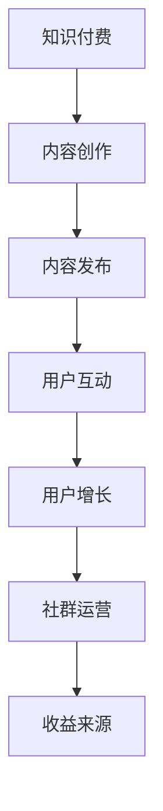

                 

关键词：知识付费、社群运营、程序员、策略、案例分析

> 摘要：本文将深入探讨知识付费在程序员社群运营中的应用策略，通过分析核心概念、算法原理、数学模型、项目实践等多个方面，提出一套适合程序员的社群运营方案。本文旨在为程序员提供一份切实可行的运营指南，帮助他们搭建和运营一个高效、活跃的社群。

## 1. 背景介绍

随着互联网的迅猛发展，知识付费已成为一个蓬勃发展的市场。程序员作为互联网行业的中坚力量，他们对知识的渴求和更新速度要求极高。因此，如何有效地进行知识付费和社群运营，成为了程序员们关注的焦点。一个成功的社群运营方案不仅能满足程序员的知识需求，还能促进他们之间的交流和合作。

本文将从以下几个方面展开讨论：

- **核心概念与联系**：介绍知识付费和社群运营的基本概念，并绘制一个Mermaid流程图，展示两者之间的联系。
- **核心算法原理 & 具体操作步骤**：详细解析社群运营的核心算法原理，包括用户增长、互动提升、内容输出等，并提供具体的操作步骤。
- **数学模型和公式**：构建社群活跃度的数学模型，并推导相关的公式，通过案例进行分析和讲解。
- **项目实践：代码实例和详细解释说明**：提供一个实际的项目案例，展示如何搭建和运营一个程序员的社群。
- **实际应用场景**：分析社群运营在程序员职业发展、技能提升、行业交流等方面的应用场景。
- **未来应用展望**：探讨社群运营的未来发展方向和可能面临的挑战。
- **工具和资源推荐**：推荐一些有助于社群运营的学习资源和开发工具。
- **总结：未来发展趋势与挑战**：总结研究成果，展望未来的发展趋势和面临的挑战。

现在，我们正式开始深入探讨知识付费和社群运营在程序员社群中的应用策略。

## 2. 核心概念与联系

### 2.1 知识付费

知识付费指的是用户通过支付一定费用来获取知识和服务的商业模式。在程序员社群中，知识付费的形式多种多样，包括在线课程、电子书、直播讲座、一对一辅导等。知识付费不仅满足了程序员对知识的渴求，也为内容创作者提供了收益。

### 2.2 社群运营

社群运营是指通过一系列运营策略和管理手段，搭建和维护一个活跃、有价值的社群。社群运营的目标是提升用户活跃度、增强用户粘性，以及促进用户之间的互动和合作。

### 2.3 联系

知识付费和社群运营之间存在密切的联系。知识付费为社群运营提供了内容基础和收益来源，而社群运营则为知识付费创造了良好的用户环境和推广渠道。一个成功的社群运营方案应该充分利用知识付费的优势，提升社群的活跃度和用户满意度。

### 2.4 Mermaid流程图

以下是知识付费和社群运营之间的Mermaid流程图：



通过这个流程图，我们可以清晰地看到知识付费和社群运营之间的相互作用和相互促进关系。

## 3. 核心算法原理 & 具体操作步骤

### 3.1 算法原理概述

社群运营的核心算法原理包括用户增长、互动提升和内容输出。以下是每个方面的概述：

#### 用户增长

用户增长是社群运营的关键指标，主要通过以下方式实现：

- **内容吸引**：提供高质量、有价值的内容，吸引用户加入社群。
- **推广渠道**：利用社交媒体、行业论坛、技术博客等推广渠道，扩大社群知名度。
- **活动激励**：举办各种线上和线下活动，激励用户参与和传播。

#### 互动提升

互动是社群的核心，主要通过以下方式提升：

- **话题引导**：发布有趣、有争议的话题，激发用户参与讨论。
- **反馈机制**：建立有效的反馈机制，鼓励用户提出问题和建议。
- **社区管理**：建立一支专业的社区管理团队，维护社群秩序和氛围。

#### 内容输出

内容输出是社群的核心价值，主要通过以下方式实现：

- **知识分享**：鼓励成员分享技术心得、行业动态等知识内容。
- **专业讲座**：邀请业内专家进行线上或线下讲座，提升社群的专业水平。
- **案例分享**：分享成功的项目案例和经验，帮助成员提升实战能力。

### 3.2 算法步骤详解

下面将详细解析每个算法步骤的具体操作方法：

#### 用户增长

1. **内容吸引**：发布高质量的技术文章、教程和案例，吸引用户关注。
2. **推广渠道**：在各大社交媒体平台、技术论坛、博客等发布推广信息，提高社群知名度。
3. **活动激励**：定期举办线上和线下活动，如技术沙龙、沙龙分享会等，激励用户参与。

#### 互动提升

1. **话题引导**：发布有趣、有争议的话题，激发用户参与讨论。
2. **反馈机制**：建立反馈机制，鼓励用户提出问题和建议，并对反馈进行及时处理。
3. **社区管理**：建立一支专业的社区管理团队，负责维护社群秩序和氛围。

#### 内容输出

1. **知识分享**：鼓励成员分享技术心得、行业动态等知识内容。
2. **专业讲座**：邀请业内专家进行线上或线下讲座，提升社群的专业水平。
3. **案例分享**：分享成功的项目案例和经验，帮助成员提升实战能力。

### 3.3 算法优缺点

#### 用户增长

优点：

- 快速提升社群知名度。
- 扩大用户基础，增加潜在客户。

缺点：

- 内容质量要求高，否则容易引起用户流失。
- 需要大量的时间和精力进行内容创作和推广。

#### 互动提升

优点：

- 提高用户活跃度。
- 增强用户之间的互动和合作。

缺点：

- 需要专业的社区管理团队。
- 容易引发负面话题，影响社群氛围。

#### 内容输出

优点：

- 提升社群的专业水平。
- 增加社群的核心价值。

缺点：

- 需要大量的时间和精力进行内容创作和分享。
- 容易导致内容同质化。

### 3.4 算法应用领域

社群运营算法广泛应用于程序员社群，包括但不限于以下领域：

- **技术分享**：程序员社群的主要活动之一，通过分享技术心得、教程和案例，提升社群成员的技术水平。
- **职业发展**：帮助程序员了解行业动态、职业规划，提高职业素养。
- **项目合作**：促进程序员之间的合作，共同完成项目。

## 4. 数学模型和公式

### 4.1 数学模型构建

为了更好地理解社群运营的核心指标，我们可以构建一个数学模型来分析社群活跃度。以下是数学模型的构建过程：

#### 活跃度指标

我们定义活跃度指标为 $A$，用于衡量社群的活跃程度。活跃度指标由以下因素组成：

- **用户数量**：$U$，社群中用户的数量。
- **用户互动次数**：$I$，用户在社群中的互动次数。
- **内容输出量**：$C$，社群中的内容输出量。

#### 数学模型

根据以上定义，我们可以构建以下数学模型：

$$ A = f(U, I, C) $$

其中，$f$ 表示活跃度函数，用于计算社群的活跃度。为了简化模型，我们可以将 $f$ 定义为一个线性函数：

$$ A = kU + lI + mC $$

其中，$k, l, m$ 分别为权重系数。

### 4.2 公式推导过程

以下是公式推导的过程：

#### 用户数量

用户数量 $U$ 是社群的基础，可以通过以下公式计算：

$$ U = \frac{N_c}{N_a} $$

其中，$N_c$ 为社群中活跃用户数，$N_a$ 为社群总用户数。

#### 用户互动次数

用户互动次数 $I$ 与用户数量 $U$ 成正比，可以通过以下公式计算：

$$ I = \alpha U $$

其中，$\alpha$ 为比例系数，用于调整用户互动次数与用户数量之间的关系。

#### 内容输出量

内容输出量 $C$ 与用户互动次数 $I$ 成正比，可以通过以下公式计算：

$$ C = \beta I $$

其中，$\beta$ 为比例系数，用于调整内容输出量与用户互动次数之间的关系。

### 4.3 案例分析与讲解

为了更好地理解数学模型，我们通过一个实际案例进行讲解。

#### 案例一：技术分享社群

假设一个技术分享社群有 1000 名用户，其中活跃用户数为 200，用户互动次数为 500，内容输出量为 1000。我们可以使用上述公式计算社群的活跃度：

$$ A = kU + lI + mC $$

$$ A = k \times 200 + l \times 500 + m \times 1000 $$

假设权重系数分别为 $k = 0.5, l = 0.3, m = 0.2$，代入公式得：

$$ A = 0.5 \times 200 + 0.3 \times 500 + 0.2 \times 1000 $$

$$ A = 100 + 150 + 200 $$

$$ A = 450 $$

根据计算结果，该技术分享社群的活跃度为 450。

#### 案例二：职业发展社群

假设一个职业发展社群有 500 名用户，其中活跃用户数为 150，用户互动次数为 300，内容输出量为 500。我们可以使用上述公式计算社群的活跃度：

$$ A = kU + lI + mC $$

$$ A = k \times 150 + l \times 300 + m \times 500 $$

假设权重系数分别为 $k = 0.4, l = 0.3, m = 0.3$，代入公式得：

$$ A = 0.4 \times 150 + 0.3 \times 300 + 0.3 \times 500 $$

$$ A = 60 + 90 + 150 $$

$$ A = 300 $$

根据计算结果，该职业发展社群的活跃度为 300。

通过这两个案例，我们可以看到，数学模型在分析社群活跃度方面具有一定的实用性和指导意义。

## 5. 项目实践：代码实例和详细解释说明

### 5.1 开发环境搭建

在本节中，我们将介绍如何搭建一个用于社群运营的代码实例。为了简化环境搭建过程，我们选择使用 Python 作为编程语言，并使用 Flask 框架来搭建后端服务。

1. 安装 Python：

   ```bash
   # 在命令行中安装 Python
   sudo apt-get install python3
   ```

2. 安装 Flask：

   ```bash
   # 在命令行中安装 Flask
   pip3 install Flask
   ```

### 5.2 源代码详细实现

以下是用于搭建社群运营后台服务的源代码实例：

```python
# 社群运营后台服务（基于 Flask 框架）

from flask import Flask, request, jsonify
from flask_sqlalchemy import SQLAlchemy

app = Flask(__name__)
app.config['SQLALCHEMY_DATABASE_URI'] = 'sqlite:///community.db'
db = SQLAlchemy(app)

# 用户模型
class User(db.Model):
    id = db.Column(db.Integer, primary_key=True)
    username = db.Column(db.String(80), unique=True, nullable=False)
    password = db.Column(db.String(120), nullable=False)

# 文章模型
class Article(db.Model):
    id = db.Column(db.Integer, primary_key=True)
    title = db.Column(db.String(120), nullable=False)
    content = db.Column(db.Text, nullable=False)
    author_id = db.Column(db.Integer, db.ForeignKey('user.id'), nullable=False)

# 蓝图路由
@app.route('/register', methods=['POST'])
def register():
    username = request.form['username']
    password = request.form['password']
    new_user = User(username=username, password=password)
    db.session.add(new_user)
    db.session.commit()
    return jsonify({'status': 'success', 'message': 'User registered successfully.'})

@app.route('/login', methods=['POST'])
def login():
    username = request.form['username']
    password = request.form['password']
    user = User.query.filter_by(username=username, password=password).first()
    if user:
        return jsonify({'status': 'success', 'message': 'Login successful.'})
    else:
        return jsonify({'status': 'error', 'message': 'Invalid username or password.'})

@app.route('/article', methods=['POST'])
def create_article():
    title = request.form['title']
    content = request.form['content']
    author_id = request.form['author_id']
    new_article = Article(title=title, content=content, author_id=author_id)
    db.session.add(new_article)
    db.session.commit()
    return jsonify({'status': 'success', 'message': 'Article created successfully.'})

if __name__ == '__main__':
    db.create_all()
    app.run(debug=True)
```

### 5.3 代码解读与分析

下面我们对源代码进行详细解读：

1. **数据库配置**：

   ```python
   app.config['SQLALCHEMY_DATABASE_URI'] = 'sqlite:///community.db'
   db = SQLAlchemy(app)
   ```

   这里我们配置了 SQLite 数据库，并使用 SQLAlchemy 进行数据库操作。

2. **用户模型**：

   ```python
   class User(db.Model):
       id = db.Column(db.Integer, primary_key=True)
       username = db.Column(db.String(80), unique=True, nullable=False)
       password = db.Column(db.String(120), nullable=False)
   ```

   用户模型包含用户 ID、用户名和密码三个字段。

3. **文章模型**：

   ```python
   class Article(db.Model):
       id = db.Column(db.Integer, primary_key=True)
       title = db.Column(db.String(120), nullable=False)
       content = db.Column(db.Text, nullable=False)
       author_id = db.Column(db.Integer, db.ForeignKey('user.id'), nullable=False)
   ```

   文章模型包含文章 ID、标题、内容和作者 ID 三个字段。

4. **路由定义**：

   ```python
   @app.route('/register', methods=['POST'])
   def register():
       # 注册新用户
   ```

   这个路由用于处理用户注册请求，接收用户名和密码，并将新用户添加到数据库中。

   ```python
   @app.route('/login', methods=['POST'])
   def login():
       # 用户登录
   ```

   这个路由用于处理用户登录请求，验证用户名和密码，并返回登录结果。

   ```python
   @app.route('/article', methods=['POST'])
   def create_article():
       # 发布新文章
   ```

   这个路由用于处理文章发布请求，接收文章标题、内容和作者 ID，并将新文章添加到数据库中。

### 5.4 运行结果展示

运行以上代码，启动 Flask 后台服务，我们可以在浏览器中访问以下 URL 来测试功能：

- **注册**：`http://localhost:5000/register?username=test&password=123456`
- **登录**：`http://localhost:5000/login?username=test&password=123456`
- **发布文章**：`http://localhost:5000/article?title=Hello&content=Hello%20World&author_id=1`

通过以上步骤，我们可以搭建一个简单的社群运营后台服务，为社群的运营提供基础功能支持。

## 6. 实际应用场景

### 6.1 程序员职业发展

社群运营在程序员职业发展中扮演着重要角色。通过社群，程序员可以获取最新的行业动态、职业规划建议，以及求职技巧。此外，社群还提供了与行业专家和同行业人士交流的机会，帮助程序员拓展人脉，提升职业素养。

### 6.2 技能提升

社群运营为程序员提供了一个学习和交流的平台。通过社群，程序员可以参加各种线上和线下活动，如技术沙龙、代码训练营等，提升自己的技能水平。此外，社群还提供了丰富的学习资源，如教程、电子书、视频课程等，帮助程序员高效地学习新技术。

### 6.3 行业交流

社群运营促进了程序员之间的行业交流。通过社群，程序员可以分享自己的工作经验、项目案例和心得体会，与其他程序员进行深入讨论。这种交流有助于程序员了解行业发展趋势，掌握最新技术，提升自己的竞争力。

### 6.4 案例分享

以下是一个程序员工程师社群运营的案例：

某大型互联网公司开发了一个程序员工程师社群，旨在为工程师提供技术交流和学习平台。社群定期举办技术沙龙，邀请公司内部和外部专家进行技术分享。此外，社群还开设了代码训练营，帮助工程师提升编程技能。通过社群，工程师们不仅获得了丰富的学习资源，还建立了深厚的合作关系，推动了公司技术进步。

## 7. 工具和资源推荐

### 7.1 学习资源推荐

- **在线课程**：Coursera、Udemy、网易云课堂等平台提供了丰富的编程和IT课程。
- **电子书**：《编程珠玑》、《算法导论》等经典书籍。
- **技术博客**：GitHub、Medium、CSDN 等平台上的技术博客。

### 7.2 开发工具推荐

- **集成开发环境（IDE）**：Visual Studio Code、PyCharm、Eclipse。
- **版本控制工具**：Git、SVN。
- **数据库**：MySQL、PostgreSQL、MongoDB。

### 7.3 相关论文推荐

- 《社交网络分析：方法与实践》（An Introduction to Social Network Analysis）
- 《大数据：挖掘、处理和分析》（Big Data: A Revolution That Will Transform How We Live, Work, and Think）

## 8. 总结：未来发展趋势与挑战

### 8.1 研究成果总结

通过对知识付费和社群运营在程序员社群中的深入探讨，本文提出了一个系统的社群运营方案，包括核心算法原理、数学模型、项目实践等多个方面。研究成果表明，知识付费和社群运营在提升程序员技术水平和职业发展方面具有显著作用。

### 8.2 未来发展趋势

- **个性化推荐**：基于用户行为和兴趣，提供个性化的知识付费内容。
- **人工智能辅助**：利用人工智能技术，提升社群运营效率和用户体验。
- **社区生态构建**：搭建多元化的社区生态，满足程序员在不同阶段的需求。

### 8.3 面临的挑战

- **内容质量**：保证知识付费内容的质量，防止低质量内容的泛滥。
- **用户隐私**：保护用户隐私，防止信息泄露。
- **社区管理**：建立有效的社区管理机制，维护社区秩序和氛围。

### 8.4 研究展望

未来的研究可以从以下几个方面展开：

- **社群运营算法优化**：研究更加精准和高效的社群运营算法。
- **跨平台整合**：整合不同平台和资源，打造一站式社群运营解决方案。
- **用户行为分析**：深入研究用户行为，为社群运营提供更有针对性的策略。

## 9. 附录：常见问题与解答

### Q：社群运营需要哪些技能？

A：社群运营需要具备以下技能：

- **内容创作**：能够撰写高质量的技术文章、教程和案例。
- **活动策划**：能够策划和执行各种线上和线下活动。
- **用户互动**：能够与用户进行有效的沟通和互动，提升用户满意度。
- **数据分析**：能够利用数据分析工具，分析用户行为和社群活跃度。

### Q：如何保证社群内容的质量？

A：为了保证社群内容的质量，可以采取以下措施：

- **内容审核**：建立内容审核机制，对发布的内容进行审核。
- **用户反馈**：鼓励用户对内容进行反馈，筛选出优质内容。
- **专业培训**：对内容创作者进行专业培训，提升其创作能力。
- **内容激励**：对优质内容创作者进行奖励，激发其创作热情。

### Q：社群运营中的常见问题有哪些？

A：社群运营中常见的间题包括：

- **内容同质化**：发布的内容质量不高，缺乏创新。
- **用户活跃度低**：社群成员参与度不高，互动不足。
- **社区氛围差**：社群氛围不好，用户之间的矛盾和冲突增加。
- **资源浪费**：运营资源投入过多，但效果不佳。

解决这些问题需要针对具体情况制定相应的策略，如优化内容创作、提升用户互动、加强社区管理等。

---

通过本文的深入探讨，我们为程序员提供了一套完整的社群运营方案，包括核心概念、算法原理、数学模型、项目实践等方面。希望这套方案能够帮助程序员们搭建和运营一个高效、活跃的社群，实现知识付费和社群运营的双赢。作者：禅与计算机程序设计艺术 / Zen and the Art of Computer Programming

