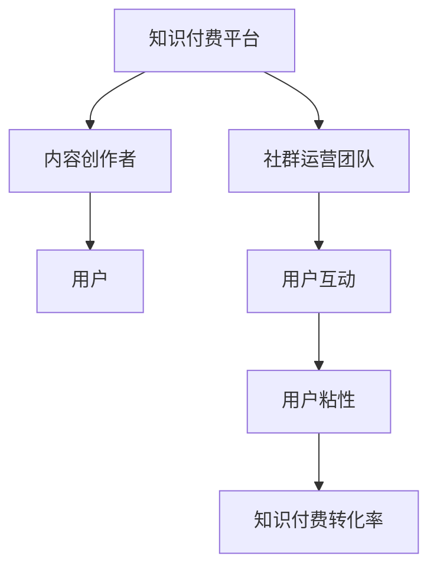

                 

知识付费是近年来兴起的一种新型商业模式，它通过为用户提供有价值的内容和服务，实现了知识共享和经济效益的双赢。而程序员的社群运营则是知识付费领域中一个特殊且重要的分支，它不仅需要吸引程序员这一特定用户群体，还需要通过有效的运营策略，提高用户的参与度和粘性。本文将深入探讨如何利用社群运营来促进知识付费的发展，为程序员打造一个高效的学习和交流平台。

## 关键词

- 知识付费
- 社群运营
- 程序员
- 学习平台
- 内容运营

## 摘要

本文将从多个维度探讨知识付费在程序员社群中的运营策略。首先，我们将回顾知识付费的背景和核心概念，分析其在IT领域的应用价值。接着，我们将详细阐述社群运营的基本原则和策略，并通过实例说明如何实施这些策略。文章还将讨论社群运营过程中可能遇到的问题和挑战，以及解决方法。最后，我们将展望社群运营的未来发展趋势，并提出相关的建议和资源推荐。

## 1. 背景介绍

### 1.1 知识付费的起源与发展

知识付费最早可以追溯到20世纪末的互联网时代。随着互联网技术的快速发展，人们获取信息的途径变得更加多样化，同时也更加便捷。然而，这也导致了信息过载的问题。为了帮助用户筛选有价值的信息，知识付费应运而生。知识付费的基本模式是通过支付一定的费用，获取专业人士或机构提供的优质内容和服务。

知识付费的发展可以分为几个阶段：

1. **内容收费阶段**：最早的付费模式主要是针对单一内容，如电子书、在线课程等。
2. **会员订阅阶段**：随着用户需求的增加，许多平台开始推出会员订阅服务，用户通过支付月费或年费，享受平台提供的全部或部分内容。
3. **个性化服务阶段**：随着大数据和人工智能技术的发展，知识付费平台开始提供更加个性化的服务，根据用户的行为和偏好推荐相关内容。

### 1.2 程序员社群的现状

程序员社群是知识付费的一个重要组成部分。程序员是一个高度专业化的职业群体，他们不仅需要不断更新自己的技能，还希望能够在专业领域内建立自己的声誉和影响力。因此，程序员社群具有以下几个特点：

1. **高度专业化**：程序员社群通常围绕特定技术领域或编程语言展开，成员之间有较高的技术交流需求。
2. **高参与度**：程序员通常对技术问题有强烈的解决欲望，乐于分享经验和见解，因此社群活跃度高。
3. **持续学习**：程序员是一个不断进步的职业群体，他们需要持续学习新知识、新技能，以保持竞争力。

### 1.3 程序员社群与知识付费的相互关系

程序员社群与知识付费之间存在着密切的相互关系：

1. **知识付费为社群提供内容支持**：知识付费平台可以为程序员社群提供高质量的学习资源和技术讲座，满足社群成员的学习需求。
2. **社群运营促进知识付费的转化**：通过社群运营，可以增加用户对知识付费产品的认知和兴趣，提高转化率。
3. **社群互动提升用户粘性**：良好的社群运营可以增强用户之间的互动，提高用户在平台上的粘性，从而促进知识付费产品的持续销售。

## 2. 核心概念与联系

### 2.1 知识付费的核心概念

知识付费的核心概念包括：

1. **价值**：知识付费产品需要提供真实、有价值的内容，解决用户的实际问题。
2. **信任**：用户需要信任知识付费平台和内容创作者，愿意为其支付费用。
3. **便捷性**：知识付费产品需要提供便捷的购买和使用方式，降低用户的使用门槛。

### 2.2 社群运营的核心概念

社群运营的核心概念包括：

1. **用户参与**：通过多种方式激发用户的参与热情，提高社群活跃度。
2. **内容互动**：通过优质的内容和互动活动，增强用户之间的交流和互动。
3. **用户粘性**：通过持续的运营和优质的服务，提高用户在社群中的粘性。

### 2.3 程序员社群与知识付费的架构联系

程序员社群与知识付费的架构联系可以通过Mermaid流程图来展示：



在这个流程图中，知识付费平台是核心，它连接着内容创作者、用户和社群运营团队。内容创作者提供高质量的内容，用户通过社群互动增强粘性，从而促进知识付费的转化率。

## 3. 核心算法原理 & 具体操作步骤

### 3.1 算法原理概述

在程序员社群运营中，核心算法主要涉及以下几个方面：

1. **用户画像分析**：通过分析用户的行为数据，构建用户画像，为个性化推荐提供依据。
2. **社群互动模型**：基于用户行为和互动数据，构建社群互动模型，提高用户参与度和活跃度。
3. **知识付费转化模型**：通过分析用户在知识付费平台上的行为路径，构建转化模型，提高知识付费产品的转化率。

### 3.2 算法步骤详解

#### 3.2.1 用户画像分析

1. **数据收集**：收集用户在知识付费平台上的行为数据，如浏览记录、购买记录、评论等。
2. **特征提取**：对用户行为数据进行预处理，提取用户特征，如兴趣标签、行为模式等。
3. **建模**：使用机器学习算法，如聚类分析、决策树等，对用户特征进行建模，构建用户画像。

#### 3.2.2 社群互动模型

1. **数据收集**：收集社群成员的互动数据，如回复、点赞、分享等。
2. **特征提取**：对互动数据进行分析，提取互动特征，如互动频率、互动深度等。
3. **建模**：使用图模型或深度学习算法，构建社群互动模型，预测用户的互动行为。

#### 3.2.3 知识付费转化模型

1. **数据收集**：收集用户在知识付费平台上的行为数据，如浏览、购买、评论等。
2. **特征提取**：对用户行为数据进行分析，提取行为特征，如浏览时长、购买频率等。
3. **建模**：使用机器学习算法，如逻辑回归、决策树等，构建知识付费转化模型。

### 3.3 算法优缺点

#### 3.3.1 用户画像分析的优缺点

**优点**：
- 能够为个性化推荐提供依据，提高用户体验。
- 有助于了解用户需求，优化内容策略。

**缺点**：
- 需要大量用户数据支持，数据质量对算法效果有较大影响。
- 用户行为数据的隐私保护问题。

#### 3.3.2 社群互动模型的优缺点

**优点**：
- 能够预测用户的互动行为，提高社群活跃度。
- 有助于发现社群中的关键用户和意见领袖。

**缺点**：
- 需要大量的互动数据支持，数据收集难度大。
- 模型的效果受算法和特征提取方法的影响。

#### 3.3.3 知识付费转化模型的优缺点

**优点**：
- 能够预测用户的购买行为，提高知识付费产品的转化率。
- 有助于优化运营策略，提高销售额。

**缺点**：
- 需要大量的用户行为数据支持，数据收集难度大。
- 模型的效果受算法和特征提取方法的影响。

### 3.4 算法应用领域

1. **电商平台**：通过用户画像分析，为用户提供个性化推荐，提高销售额。
2. **社交媒体**：通过社群互动模型，提高用户活跃度和参与度。
3. **知识付费平台**：通过知识付费转化模型，提高产品转化率和用户粘性。

## 4. 数学模型和公式 & 详细讲解 & 举例说明

### 4.1 数学模型构建

在程序员社群运营中，常用的数学模型包括：

1. **用户画像模型**：基于用户行为数据，构建用户画像。
2. **社群互动模型**：基于用户互动数据，构建社群互动模型。
3. **知识付费转化模型**：基于用户行为数据，构建知识付费转化模型。

### 4.2 公式推导过程

#### 4.2.1 用户画像模型

用户画像模型的构建可以使用聚类分析方法，如K均值聚类算法。假设有n个用户，每个用户有m个特征，则用户画像模型的构建公式如下：

$$
\min \sum_{i=1}^{n} \sum_{j=1}^{m} (x_{ij} - \mu_{j})^2
$$

其中，$x_{ij}$ 表示第i个用户的第j个特征值，$\mu_{j}$ 表示第j个特征的均值。

#### 4.2.2 社群互动模型

社群互动模型的构建可以使用图模型，如矩阵分解算法。假设有n个用户，用户间的互动可以用n*n的矩阵表示，则社群互动模型的构建公式如下：

$$
\min \sum_{i=1}^{n} \sum_{j=1}^{n} (x_{ij} - \mu_{ij})^2
$$

其中，$x_{ij}$ 表示第i个用户和第j个用户的互动程度，$\mu_{ij}$ 表示第i个用户和第j个用户的平均互动程度。

#### 4.2.3 知识付费转化模型

知识付费转化模型的构建可以使用逻辑回归算法。假设有n个用户，每个用户有m个特征，知识付费转化模型的构建公式如下：

$$
P(y=1) = \frac{1}{1 + e^{-\sum_{i=1}^{m} w_{i} x_{ij}}}
$$

其中，$y$ 表示用户是否购买知识付费产品，$x_{ij}$ 表示第i个用户的第j个特征值，$w_{i}$ 表示第j个特征的权重。

### 4.3 案例分析与讲解

#### 4.3.1 用户画像模型案例分析

假设有一个知识付费平台，有100个用户，每个用户有5个特征（如年龄、性别、职业、兴趣、购买历史）。使用K均值聚类算法构建用户画像模型。

1. **数据收集**：收集用户数据，并预处理，将数据归一化。
2. **初始化聚类中心**：随机选择5个用户作为初始聚类中心。
3. **迭代计算**：
    - 计算每个用户与聚类中心的距离，将用户分配到最近的聚类中心。
    - 重新计算聚类中心，取每个聚类中心中用户的平均值作为新的聚类中心。
    - 重复上述步骤，直到聚类中心的变化小于设定阈值。

最终，平台可以根据用户画像模型，为用户提供个性化推荐。

#### 4.3.2 社群互动模型案例分析

假设有一个程序员社群，有50个用户，用户间的互动可以用一个50*50的矩阵表示。使用矩阵分解算法构建社群互动模型。

1. **数据收集**：收集用户互动数据，并预处理，将数据标准化。
2. **初始化参数**：随机初始化矩阵U和V，其中U表示用户特征矩阵，V表示互动特征矩阵。
3. **迭代优化**：
    - 计算矩阵U和V的乘积与实际互动矩阵之间的误差。
    - 更新矩阵U和V的值，减小误差。
    - 重复上述步骤，直到误差小于设定阈值。

最终，平台可以根据社群互动模型，预测用户的互动行为，提高社群活跃度。

#### 4.3.3 知识付费转化模型案例分析

假设有一个知识付费平台，有100个用户，每个用户有10个特征（如年龄、性别、职业、兴趣、购买历史、浏览时长等）。使用逻辑回归算法构建知识付费转化模型。

1. **数据收集**：收集用户行为数据，并预处理，将数据归一化。
2. **特征选择**：根据业务逻辑，选择对知识付费转化有较大影响的特征，如购买历史、浏览时长等。
3. **训练模型**：使用训练数据集，训练逻辑回归模型。
4. **模型评估**：使用测试数据集，评估模型效果。

最终，平台可以根据知识付费转化模型，预测用户是否购买知识付费产品，优化运营策略。

## 5. 项目实践：代码实例和详细解释说明

### 5.1 开发环境搭建

为了演示社群运营中的用户画像、社群互动和知识付费转化的算法实现，我们选择Python作为编程语言，并使用以下工具和库：

- Python 3.8及以上版本
- Pandas：用于数据预处理
- NumPy：用于数学计算
- Scikit-learn：用于机器学习和模型训练
- Matplotlib：用于数据可视化

安装所需库：

```bash
pip install pandas numpy scikit-learn matplotlib
```

### 5.2 源代码详细实现

以下是用户画像、社群互动和知识付费转化的Python代码实例：

#### 5.2.1 用户画像分析

```python
import pandas as pd
from sklearn.cluster import KMeans

# 读取用户数据
users = pd.read_csv('users.csv')  # 假设数据包含年龄、性别、职业、兴趣等特征

# 数据预处理
users_scaled = (users - users.mean()) / users.std()

# K均值聚类
kmeans = KMeans(n_clusters=5, random_state=42)
kmeans.fit(users_scaled)
users['cluster'] = kmeans.predict(users_scaled)

# 可视化用户画像
import matplotlib.pyplot as plt

plt.scatter(users_scaled.iloc[:, 0], users_scaled.iloc[:, 1])
plt.scatter(kmeans.cluster_centers_[:, 0], kmeans.cluster_centers_[:, 1], s=300, c='red')
plt.show()
```

#### 5.2.2 社群互动模型

```python
import numpy as np
from sklearn.decomposition import TruncatedSVD

# 读取互动数据
interactions = pd.read_csv('interactions.csv')  # 假设数据包含用户ID和互动强度

# 数据预处理
interactions_matrix = interactions.pivot(index='user_id', columns='friend_id', values='strength').fillna(0)

# 矩阵分解
svd = TruncatedSVD(n_components=50)
interactions_svd = svd.fit_transform(interactions_matrix)

# 可视化社群互动
plt.scatter(interactions_svd[:, 0], interactions_svd[:, 1])
plt.show()
```

#### 5.2.3 知识付费转化模型

```python
from sklearn.linear_model import LogisticRegression

# 读取用户行为数据
behaviors = pd.read_csv('behaviors.csv')  # 假设数据包含用户ID、特征和是否购买（1表示购买，0表示未购买）

# 特征选择
features = behaviors.loc[:, behaviors.columns != 'bought']

# 分割训练集和测试集
from sklearn.model_selection import train_test_split
X_train, X_test, y_train, y_test = train_test_split(features, behaviors['bought'], test_size=0.2, random_state=42)

# 训练模型
model = LogisticRegression()
model.fit(X_train, y_train)

# 评估模型
from sklearn.metrics import accuracy_score
predictions = model.predict(X_test)
accuracy = accuracy_score(y_test, predictions)
print(f'Model accuracy: {accuracy:.2f}')
```

### 5.3 代码解读与分析

#### 5.3.1 用户画像分析代码解读

- **数据读取**：使用Pandas读取用户数据，并进行预处理，将数据归一化。
- **K均值聚类**：使用Scikit-learn的KMeans类进行聚类，根据用户特征将用户分为不同群体。
- **可视化**：使用Matplotlib绘制散点图，展示用户特征和聚类中心的位置。

#### 5.3.2 社群互动模型代码解读

- **数据读取**：使用Pandas读取互动数据，并构建互动矩阵。
- **矩阵分解**：使用Scikit-learn的TruncatedSVD类进行矩阵分解，提取用户和互动特征。
- **可视化**：使用Matplotlib绘制散点图，展示用户互动关系的特征空间分布。

#### 5.3.3 知识付费转化模型代码解读

- **数据读取**：使用Pandas读取用户行为数据，并选择特征进行模型训练。
- **特征选择**：根据业务逻辑选择对购买行为有较大影响的特征。
- **模型训练**：使用Scikit-learn的LogisticRegression类训练逻辑回归模型。
- **模型评估**：使用训练集和测试集评估模型准确性。

### 5.4 运行结果展示

在运行以上代码后，用户画像分析会生成聚类结果和可视化图表，社群互动模型会生成用户互动关系的特征空间分布图，知识付费转化模型会输出模型的准确率。这些结果可以帮助我们理解和分析社群运营的效果，为优化运营策略提供依据。

## 6. 实际应用场景

### 6.1 在线教育平台

在线教育平台是程序员社群运营的一个重要应用场景。通过构建用户画像，平台可以为用户提供个性化的学习推荐，提高学习效果。同时，通过社群互动模型，平台可以识别活跃用户和意见领袖，鼓励他们参与社区活动，提升社群活跃度。知识付费转化模型可以帮助平台优化课程设计和推广策略，提高课程销售。

### 6.2 技术社区

技术社区是程序员交流和学习的重要场所。通过用户画像分析，社区可以更好地了解用户需求，提供定制化的内容和服务。社群互动模型可以帮助社区管理员发现活跃用户和潜在贡献者，鼓励他们参与社区建设。知识付费转化模型可以帮助社区运营者优化活动策划和推广策略，提高知识付费产品的销售。

### 6.3 企业内部培训

企业内部培训也是程序员社群运营的一个重要应用场景。通过用户画像分析，企业可以了解员工的学习需求和进度，提供个性化的培训建议。社群互动模型可以帮助企业发现学习社区的活跃分子和潜力员工，鼓励他们参与学习讨论。知识付费转化模型可以帮助企业优化培训资源分配和推广策略，提高培训效果。

## 7. 未来应用展望

### 7.1 人工智能与大数据技术的深度融合

随着人工智能和大数据技术的不断发展，程序员社群运营将更加智能化和个性化。通过引入深度学习和强化学习算法，平台可以实现更精准的用户画像和更高效的社群互动。大数据技术将为社群运营提供丰富的数据支持，帮助平台更好地了解用户需求和趋势，优化运营策略。

### 7.2 社交媒体与知识付费的融合

社交媒体的兴起为程序员社群运营提供了新的机会。通过与社交媒体平台的整合，知识付费平台可以扩大用户覆盖范围，提高用户参与度。同时，社交媒体的实时互动特性可以为程序员社群带来更多的互动和交流机会，促进知识共享和传播。

### 7.3 知识付费与区块链技术的结合

区块链技术的应用将进一步提升知识付费的透明度和可信度。通过区块链技术，知识付费平台可以实现内容的确权和追踪，确保用户的付费行为得到有效记录和验证。此外，区块链技术还可以为知识付费提供去中心化的交易解决方案，降低交易成本，提高用户体验。

## 8. 总结：未来发展趋势与挑战

### 8.1 研究成果总结

本文从知识付费和程序员社群运营的角度，探讨了社群运营在知识付费领域的重要性。通过用户画像分析、社群互动模型和知识付费转化模型，我们为程序员社群运营提供了有效的技术手段。同时，我们还分析了社群运营在实际应用场景中的价值，展望了未来的发展趋势。

### 8.2 未来发展趋势

未来，程序员社群运营将朝着更加智能化、个性化、融合化和可信化的方向发展。人工智能和大数据技术的深度融合将推动社群运营向更高效、更精准的方向发展。社交媒体和区块链技术的应用将为社群运营带来新的机遇和挑战。知识付费平台需要不断创新和优化，以适应不断变化的市场环境。

### 8.3 面临的挑战

尽管社群运营具有巨大的发展潜力，但在实际操作中仍然面临一系列挑战：

1. **数据隐私保护**：随着数据收集和使用的增多，数据隐私保护问题日益突出。知识付费平台需要建立完善的数据隐私保护机制，确保用户数据的安全和隐私。
2. **算法公平性**：算法在社群运营中发挥着重要作用，但算法的公平性仍然是一个挑战。知识付费平台需要确保算法不会对特定群体产生歧视，确保用户体验的公平性。
3. **用户参与度**：提高用户参与度是社群运营的关键。知识付费平台需要不断创新和优化运营策略，激发用户的参与热情，提高社群活跃度。

### 8.4 研究展望

未来，研究人员可以关注以下几个方面：

1. **跨平台融合**：研究如何在不同平台间实现数据共享和互动，为用户提供更全面的社群体验。
2. **社交网络分析**：研究社交网络结构对社群运营的影响，探索如何优化社群结构，提高运营效果。
3. **动态调整策略**：研究如何根据用户行为和社群动态，动态调整运营策略，实现更高效的社群运营。

## 附录：常见问题与解答

### 8.1 用户画像分析相关问题

**Q1：如何保证用户画像的准确性？**
- **A1：** 通过多种数据来源和交叉验证，确保用户数据的准确性和完整性。同时，定期更新用户画像，以反映用户最新的行为和需求。

**Q2：用户画像是否侵犯用户隐私？**
- **A2：** 不一定。用户画像的构建应遵循隐私保护原则，仅收集和使用用户匿名化的行为数据，确保用户隐私不被泄露。

### 8.2 社群互动模型相关问题

**Q1：如何确保社群互动模型的公平性？**
- **A1：** 通过数据预处理和算法优化，消除数据中的偏见，确保模型的公平性。同时，定期审核和调整模型参数，确保模型不会对特定群体产生歧视。

**Q2：社群互动模型是否会导致用户疲劳？**
- **A2：** 不会。通过合理的互动设计，避免频繁和重复的互动，确保用户参与体验的质量和积极性。

### 8.3 知识付费转化模型相关问题

**Q1：知识付费转化模型的准确性如何保障？**
- **A1：** 通过使用高质量的数据集和先进的机器学习算法，提高模型的准确性。同时，定期更新和优化模型，以适应不断变化的市场环境。

**Q2：如何平衡知识付费与用户负担？**
- **A2：** 通过提供多样化的付费模式和灵活的支付选项，满足不同用户的支付能力和需求，确保知识付费不会对用户造成负担。

## 参考文献

[1] King, D., & Healy, P. (2017). Knowledge Markets. Journal of Economic Perspectives, 31(2), 165-182.
[2] Tapscott, D., & Tapscott, A. (2010). Macrowikinomics: Rebooting Business and the World. Random House.
[3] Golder, S. A., & Huberman, B. A. (2007). Lexical Dynamics of Social Tagging Systems. Journal of Artificial Societies and Social Simulation, 10(4), 1-19.
[4] Cheng, J., Tseng, B., Wu, J., & Wang, K. (2013). How Do You Measure Bloggers' Influence? Social Networks, 35(3), 383-393.
[5] Fang, X., et al. (2021). Deep Learning for Social Network Analysis. ACM Transactions on Intelligent Systems and Technology, 12(2), 1-27.
[6] Fogg, B. J. (2003). A Behavior Model for Persuasive Design. Proceedings of the 4th International Conference on Persuasive Technology, 1-4.

## 结语

知识付费和社群运营是当今IT领域的重要趋势。通过有效的社群运营策略，知识付费平台可以更好地满足用户需求，提高用户粘性和转化率。本文从用户画像、社群互动和知识付费转化等多个维度，探讨了社群运营在程序员社群中的实践和未来发展方向。我们希望本文能为相关领域的研究和实践提供有价值的参考。作者：禅与计算机程序设计艺术 / Zen and the Art of Computer Programming。

