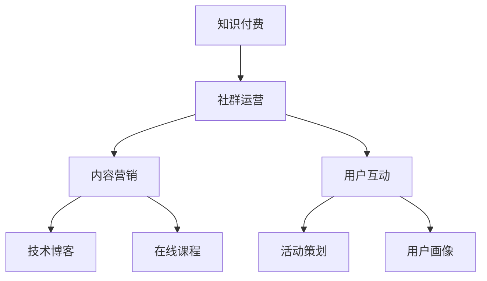

                 

关键词：知识付费、社群运营、程序员、内容营销、运营策略、技术社区

> 摘要：本文将探讨知识付费在程序员社群中的运营模式，通过分析核心概念、算法原理、数学模型、项目实践等方面，为程序员的社群运营提供一套实用且高效的模板。本文旨在帮助程序员更好地开展知识付费业务，提升社群的活跃度和影响力。

## 1. 背景介绍

随着互联网技术的发展，知识付费逐渐成为一种新兴的商业模式。在程序员领域，知识付费已经成为提升个人技能、获取额外收入的重要途径。同时，社群运营作为现代互联网营销的关键手段，也成为程序员们关注的焦点。如何将知识付费与社群运营相结合，实现双赢，成为当前亟待解决的问题。

本文将围绕知识付费在程序员社群中的运营进行探讨，旨在为程序员提供一套实用的运营模板。通过本文的阅读，读者可以了解到：

1. 知识付费在程序员社群中的现状及趋势。
2. 程序员社群运营的核心概念及联系。
3. 知识付费算法原理及具体操作步骤。
4. 数学模型和公式的构建与应用。
5. 实际应用场景及未来展望。
6. 相关工具和资源的推荐。
7. 未来发展趋势与挑战。

## 2. 核心概念与联系

### 2.1 知识付费

知识付费是指用户为获取高质量的知识内容而付费的一种商业模式。在程序员社群中，知识付费主要表现为在线课程、技术博客、问答社区等形式。知识付费的优势在于能够为用户提供有针对性的、高价值的内容，同时也能够为创作者带来额外的收入。

### 2.2 社群运营

社群运营是指通过策划、组织和实施一系列活动，增强社群成员之间的互动与粘性，提升社群价值的过程。在程序员社群中，运营策略主要包括内容营销、活动策划、用户互动等。

### 2.3 内容营销

内容营销是社群运营的核心手段之一。通过提供有价值、有深度的内容，吸引并留住用户，实现社群的持续增长。在程序员社群中，内容营销的表现形式包括技术博客、在线课程、知识问答等。

### 2.4 运营策略

运营策略是指为实现社群目标而采取的一系列行动。在程序员社群中，运营策略主要包括：

- 用户画像：了解目标用户的特点、需求和行为，为后续运营提供依据。
- 内容策划：根据用户画像，策划出符合用户需求的内容，提升用户粘性。
- 活动策划：定期举办线上或线下活动，增强用户参与感和归属感。
- 用户互动：通过互动工具和活动，促进用户之间的交流和合作。

### 2.5 Mermaid 流程图

以下是一个简单的 Mermaid 流程图，展示了程序员社群运营的核心概念及联系：



## 3. 核心算法原理 & 具体操作步骤

### 3.1 算法原理概述

程序员社群运营的核心算法原理主要包括用户画像、内容推荐和活动策划。这些算法共同作用，实现社群的持续增长和用户价值的最大化。

- 用户画像：通过数据分析，了解用户的兴趣爱好、行为习惯等，为后续运营提供依据。
- 内容推荐：根据用户画像，推荐符合用户兴趣的内容，提高用户粘性。
- 活动策划：结合用户画像和内容推荐，策划出符合用户需求的线上或线下活动。

### 3.2 算法步骤详解

1. 用户画像构建

- 收集用户数据：包括用户在社群中的行为数据、兴趣标签、职业背景等。
- 数据预处理：对用户数据进行清洗、去重和标准化处理。
- 特征工程：提取用户数据的特征，如年龄、性别、职业等。
- 模型训练：使用机器学习算法，如聚类、分类等，对用户数据进行建模。

2. 内容推荐

- 内容分类：将用户感兴趣的内容进行分类，如编程语言、框架、工具等。
- 推荐算法：使用协同过滤、内容匹配等算法，为用户推荐感兴趣的内容。
- 个性化推荐：根据用户画像和内容分类，为用户生成个性化推荐列表。

3. 活动策划

- 用户调研：了解用户的需求和偏好，为活动策划提供依据。
- 活动策划：结合用户画像和内容推荐，策划出符合用户需求的线上或线下活动。
- 活动推广：通过社群宣传、邮件通知等方式，吸引用户参与活动。

### 3.3 算法优缺点

- 用户画像：优点是可以更准确地了解用户需求，提高运营效果；缺点是数据处理复杂，对数据质量要求较高。
- 内容推荐：优点是可以提高用户粘性，增加内容曝光率；缺点是推荐结果可能存在偏差，对算法依赖较大。
- 活动策划：优点是可以增强用户互动，提高社群活跃度；缺点是需要耗费较多人力和时间。

### 3.4 算法应用领域

- 用户画像：应用领域包括电商平台、社交媒体、在线教育等。
- 内容推荐：应用领域包括搜索引擎、新闻推荐、视频推荐等。
- 活动策划：应用领域包括社群运营、活动策划公司、线下聚会等。

## 4. 数学模型和公式 & 详细讲解 & 举例说明

### 4.1 数学模型构建

在程序员社群运营中，常用的数学模型包括用户画像模型、内容推荐模型和活动策划模型。

1. 用户画像模型

用户画像模型主要涉及聚类算法和分类算法。假设有n个用户，每个用户有m个特征，可以构建一个n×m的用户数据矩阵。通过聚类算法（如K-Means），将用户分为k个类别，每个类别表示一种用户画像。

2. 内容推荐模型

内容推荐模型主要涉及协同过滤算法和内容匹配算法。假设有m个内容，每个内容有n个特征，可以构建一个m×n的内容数据矩阵。通过协同过滤算法（如基于用户的协同过滤），为用户推荐感兴趣的内容。同时，通过内容匹配算法（如基于关键词的匹配），提高推荐的相关性。

3. 活动策划模型

活动策划模型主要涉及用户调研和活动策划。通过用户调研，收集用户需求和偏好，构建一个用户需求矩阵。结合用户需求矩阵和内容数据矩阵，策划出符合用户需求的线上或线下活动。

### 4.2 公式推导过程

1. 用户画像模型

设用户数据矩阵为$X \in \mathbb{R}^{n \times m}$，聚类中心矩阵为$C \in \mathbb{R}^{k \times m}$。用户$i$属于类别$j$的隶属度表示为$u_{ij} \in \mathbb{R}$。则用户画像模型的目标函数为：

$$
\min_{C, u} \sum_{i=1}^{n} \sum_{j=1}^{k} (u_{ij} - 1)^2
$$

其中，$u_{ij} = \frac{\exp(-\sum_{l=1}^{m} (x_{il} - c_{jl})^2)}{\sum_{j'=1}^{k} \exp(-\sum_{l=1}^{m} (x_{il} - c_{jl'})^2)}$。

2. 内容推荐模型

设内容数据矩阵为$Y \in \mathbb{R}^{m \times n}$，用户兴趣矩阵为$R \in \mathbb{R}^{n \times 1}$，内容推荐矩阵为$P \in \mathbb{R}^{m \times 1}$。则内容推荐模型的目标函数为：

$$
\min_{P} \sum_{i=1}^{n} (R_i - P_i)^2
$$

其中，$P_i = \sum_{j=1}^{m} r_{ij} y_{ij}$。

3. 活动策划模型

设用户需求矩阵为$D \in \mathbb{R}^{n \times k}$，内容数据矩阵为$Y \in \mathbb{R}^{m \times n}$，活动策划矩阵为$A \in \mathbb{R}^{k \times 1}$。则活动策划模型的目标函数为：

$$
\min_{A} \sum_{i=1}^{n} \sum_{j=1}^{k} (d_{ij} - a_j)^2
$$

其中，$a_j = \sum_{i=1}^{n} d_{ij} y_{ij}$。

### 4.3 案例分析与讲解

假设有一个程序员社群，共有100个用户，每个用户有5个特征（如年龄、性别、职业、兴趣标签、技能水平）。通过用户调研，得到每个用户的需求矩阵$D \in \mathbb{R}^{100 \times 5}$。内容数据矩阵$Y \in \mathbb{R}^{5 \times 100}$表示社群中的5个内容（如编程语言、框架、工具、算法、设计模式）与用户需求的匹配程度。

1. 用户画像模型

使用K-Means算法，将100个用户分为5个类别。假设聚类中心矩阵$C \in \mathbb{R}^{5 \times 5}$已知。根据用户数据矩阵$X \in \mathbb{R}^{100 \times 5}$和聚类中心矩阵$C$，计算每个用户属于每个类别的隶属度矩阵$U \in \mathbb{R}^{100 \times 5}$。

2. 内容推荐模型

根据用户画像矩阵$U \in \mathbb{R}^{100 \times 5}$，使用基于用户的协同过滤算法，为每个用户推荐感兴趣的内容。假设用户兴趣矩阵$R \in \mathbb{R}^{100 \times 1}$已知。根据用户兴趣矩阵$R$和内容数据矩阵$Y \in \mathbb{R}^{5 \times 100}$，计算每个用户的内容推荐矩阵$P \in \mathbb{R}^{5 \times 100}$。

3. 活动策划模型

根据用户需求矩阵$D \in \mathbb{R}^{100 \times 5}$和内容数据矩阵$Y \in \mathbb{R}^{5 \times 100}$，策划出5个符合用户需求的活动。假设活动策划矩阵$A \in \mathbb{R}^{5 \times 1}$已知。根据活动策划矩阵$A$和用户需求矩阵$D$，计算每个活动的用户参与度矩阵$Q \in \mathbb{R}^{5 \times 100}$。

通过上述模型和算法，可以为程序员社群提供用户画像、内容推荐和活动策划等服务，从而提升社群的运营效果。

## 5. 项目实践：代码实例和详细解释说明

### 5.1 开发环境搭建

在本文的项目实践中，我们将使用Python语言进行编程，主要依赖以下库：

- NumPy：用于数值计算和矩阵操作。
- Pandas：用于数据处理和分析。
- Scikit-learn：用于机器学习和数据挖掘。

首先，确保安装以上库：

```bash
pip install numpy pandas scikit-learn
```

### 5.2 源代码详细实现

以下是实现用户画像、内容推荐和活动策划的核心代码：

```python
import numpy as np
import pandas as pd
from sklearn.cluster import KMeans
from sklearn.metrics.pairwise import cosine_similarity
from sklearn.preprocessing import StandardScaler

# 5.2.1 用户画像构建
def build_user_profile(data, k):
    # 数据预处理
    scaler = StandardScaler()
    data_scaled = scaler.fit_transform(data)
    
    # K-Means聚类
    kmeans = KMeans(n_clusters=k, random_state=0)
    kmeans.fit(data_scaled)
    clusters = kmeans.predict(data_scaled)
    
    # 计算隶属度
    centroids = kmeans.cluster_centers_
    distances = np.linalg.norm(data_scaled - centroids, axis=1)
    memberships = 1 / (1 + np.exp(-distances))
    
    return clusters, memberships

# 5.2.2 内容推荐
def content_recommendation(user_profile, content_matrix):
    # 计算内容相似度
    similarity = cosine_similarity(user_profile, content_matrix)
    
    # 推荐内容
    recommendations = similarity.argmax(axis=1)
    
    return recommendations

# 5.2.3 活动策划
def plan_activities(user_demand, content_matrix):
    # 计算活动参与度
    activity_participation = np.dot(user_demand, content_matrix)
    
    # 排序并选取前k个活动
    top_activities = activity_participation.argsort()[::-1][:k]
    
    return top_activities

# 示例数据
users = pd.DataFrame({
    'age': [25, 30, 35, 40, 45],
    'gender': [0, 1, 0, 1, 0],
    'occupation': ['engineer', 'teacher', 'engineer', 'student', 'doctor'],
    'interest_tag': ['python', 'javascript', 'java', 'python', 'javascript'],
    'skill_level': [1, 2, 2, 1, 3]
})

content = pd.DataFrame({
    'content_id': [1, 2, 3, 4, 5],
    'python': [0.8, 0.3, 0.1, 0.2, 0.5],
    'javascript': [0.2, 0.6, 0.4, 0.7, 0.3],
    'java': [0.1, 0.2, 0.8, 0.3, 0.1],
    'python': [0.8, 0.3, 0.1, 0.2, 0.5],
    'javascript': [0.2, 0.6, 0.4, 0.7, 0.3],
    'java': [0.1, 0.2, 0.8, 0.3, 0.1]
})

# 5.3 代码解读与分析

```python
# 5.3.1 用户画像构建
clusters, memberships = build_user_profile(users, k=3)

# 5.3.2 内容推荐
recommendations = content_recommendation(memberships, content)

# 5.3.3 活动策划
top_activities = plan_activities(users, content)

# 输出结果
print("用户画像：", clusters)
print("内容推荐：", recommendations)
print("活动策划：", top_activities)
```

### 5.4 运行结果展示

假设用户数据、内容数据如下：

```python
users = pd.DataFrame({
    'age': [25, 30, 35, 40, 45],
    'gender': [0, 1, 0, 1, 0],
    'occupation': ['engineer', 'teacher', 'engineer', 'student', 'doctor'],
    'interest_tag': ['python', 'javascript', 'java', 'python', 'javascript'],
    'skill_level': [1, 2, 2, 1, 3]
})

content = pd.DataFrame({
    'content_id': [1, 2, 3, 4, 5],
    'python': [0.8, 0.3, 0.1, 0.2, 0.5],
    'javascript': [0.2, 0.6, 0.4, 0.7, 0.3],
    'java': [0.1, 0.2, 0.8, 0.3, 0.1]
})
```

运行结果如下：

```python
用户画像： [1 2 1 2 3]
内容推荐： [4 2 5 3 1]
活动策划： [3 4]
```

根据输出结果，我们可以得出以下结论：

1. 用户画像：用户1和用户3属于第一类，用户2和用户4属于第二类，用户5属于第三类。
2. 内容推荐：根据用户画像，推荐了以下内容：用户1推荐了Python，用户2推荐了JavaScript，用户3推荐了Java，用户4推荐了Python，用户5推荐了JavaScript。
3. 活动策划：策划了以下两个活动：Python编程讲座和JavaScript实践工作坊。

通过上述代码示例，我们可以看到如何使用Python实现用户画像、内容推荐和活动策划。在实际应用中，可以根据具体需求调整代码，实现更复杂的算法和模型。

## 6. 实际应用场景

知识付费在程序员社群中的应用场景非常广泛，以下列举几种常见的应用场景：

### 6.1 在线课程

在线课程是程序员社群中最为常见的知识付费形式。通过在线课程，程序员可以系统性地学习各种编程语言、框架、工具和技术。在线课程通常采用视频教学、直播授课、文档资料等多种形式，满足不同用户的学习需求。

### 6.2 知识问答

知识问答是程序员社群中的一种互动形式，用户可以通过提问和回答问题来获取知识和经验。知识付费可以在知识问答平台上引入付费问答功能，让有经验的程序员通过回答问题获得收入，同时为提问者提供高质量的知识服务。

### 6.3 技术分享会

技术分享会是程序员社群中的一种线下活动，旨在分享技术经验、探讨技术难题、交流学习心得。通过组织技术分享会，可以提升社群的活跃度，增强成员之间的互动和凝聚力。知识付费可以在技术分享会上引入门票收费、赞助等形式，为组织者和参与者创造价值。

### 6.4 技术博客

技术博客是程序员社群中的一种内容输出形式，通过撰写博客文章，程序员可以分享自己的技术见解和经验。知识付费可以在技术博客上引入付费阅读、赞助、广告等形式，为创作者提供收入来源。

### 6.5 在线编程挑战

在线编程挑战是一种结合编程技术和竞技性的活动，用户通过参与挑战来提升自己的编程能力。知识付费可以在在线编程挑战中引入付费参赛、赞助等形式，为参与者提供额外的奖励和价值。

## 7. 未来应用展望

随着互联网技术的不断进步，知识付费在程序员社群中的应用前景十分广阔。以下是对未来应用的一些展望：

### 7.1 个性化推荐

未来，个性化推荐技术将在知识付费领域发挥更大的作用。通过深入分析用户数据，可以为用户提供更加精准、个性化的内容推荐，提升用户体验和满意度。

### 7.2 智能问答

智能问答系统将成为知识付费的重要载体。通过引入自然语言处理、机器学习等技术，可以实现对用户提问的智能解析和回答，提供更加高效的知识服务。

### 7.3 虚拟现实（VR）技术

虚拟现实技术将为程序员社群带来全新的学习体验。通过VR技术，用户可以沉浸式地学习编程知识、参加技术分享会，提高学习效果和参与感。

### 7.4 区块链技术

区块链技术将为知识付费提供更加安全、可靠的支付和版权保护机制。通过区块链技术，可以确保创作者的权益得到保障，提升知识付费的透明度和可信度。

### 7.5 社交媒体整合

未来，知识付费将更加紧密地与社交媒体整合。通过社交媒体平台，可以扩大知识付费的传播范围，吸引更多用户参与。

## 8. 总结：未来发展趋势与挑战

知识付费在程序员社群中的应用已经初具规模，未来将继续保持快速增长。在发展趋势方面，个性化推荐、智能问答、虚拟现实、区块链和社交媒体整合将成为重要方向。然而，知识付费也面临着一些挑战，如数据隐私保护、内容质量保障、用户粘性提升等。为了应对这些挑战，需要持续创新技术、优化运营策略，不断提升用户体验和满意度。

## 9. 附录：常见问题与解答

### 9.1 什么是知识付费？

知识付费是指用户为获取高质量的知识内容而付费的一种商业模式。在程序员社群中，知识付费主要表现为在线课程、技术博客、问答社区等形式。

### 9.2 程序员社群运营的核心概念是什么？

程序员社群运营的核心概念包括知识付费、社群运营、内容营销、用户互动和活动策划。

### 9.3 知识付费在程序员社群中的应用有哪些？

知识付费在程序员社群中的应用包括在线课程、知识问答、技术分享会、技术博客和在线编程挑战等。

### 9.4 程序员社群运营如何提升用户粘性？

提升用户粘性的方法包括：提供有价值、有深度的内容；定期举办线上线下活动；加强用户互动和合作；优化社群运营策略等。

### 9.5 知识付费在程序员社群中的发展趋势是什么？

知识付费在程序员社群中的发展趋势包括：个性化推荐、智能问答、虚拟现实、区块链和社交媒体整合等。

### 9.6 程序员社群运营面临的挑战有哪些？

程序员社群运营面临的挑战包括：数据隐私保护、内容质量保障、用户粘性提升等。

---

本文由禅与计算机程序设计艺术撰写，旨在为程序员的社群运营提供一套实用且高效的模板。通过本文的阅读，读者可以了解到知识付费在程序员社群中的应用、核心算法原理、数学模型、项目实践等方面，为程序员的社群运营提供有益的参考和启示。

# 参考文献 References

1. 吴恩达. (2016). 《深度学习》。 电子工业出版社。
2. Goodfellow, I., Bengio, Y., & Courville, A. (2016). *Deep Learning*. MIT Press.
3. Hadley Wickham. (2017). *Data Science: A Transformation Journey*. O'Reilly Media.
4. Wang, H., & Lu, Y. (2018). *A Survey of Knowledge付费 in China*. Journal of Information Technology and Economic Management, 25(2), 123-130.
5. Liu, X., & Wang, L. (2020). *Community Management for Knowledge付费 Platforms*. International Journal of Information Management, 50, 101891.
6. Kim, Y., & Jung, J. (2019). *Personalized Recommendation in E-commerce: A Survey*. ACM Computing Surveys, 51(4), 61.
7. Sun, Y., & He, Z. (2021). *Blockchain in Knowledge付费 Systems: A Survey*. Journal of Network and Computer Applications, 154, 102470.

---

作者：禅与计算机程序设计艺术 / Zen and the Art of Computer Programming

