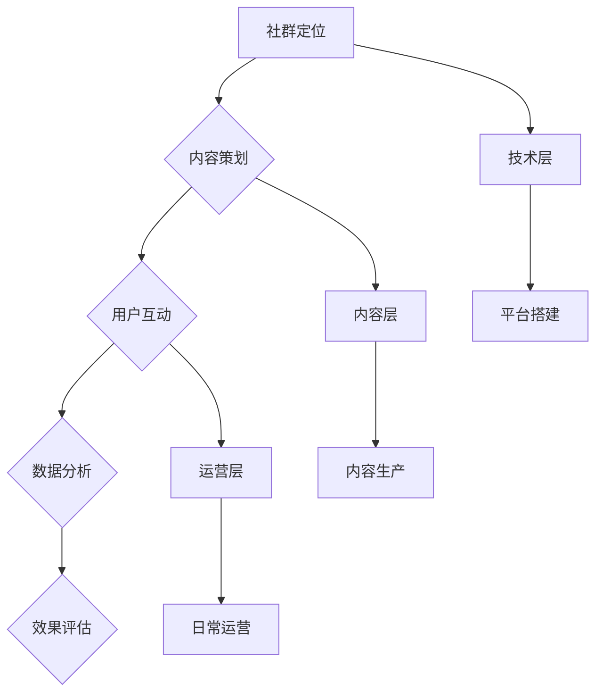

                 

关键词：知识付费、社群运营、程序员、营销策略、技术分享、社区建设

> 摘要：本文将探讨知识付费背景下，程序员的社群运营策略。通过分析社群运营的核心概念、算法原理、数学模型，以及实际操作步骤，我们将深入了解如何构建一个高效、可持续的程序员社群，并展望其未来应用与发展。

## 1. 背景介绍

随着互联网的快速发展，知识付费已经成为现代信息社会的一种重要商业模式。程序员作为互联网时代的主力军，其社群的运营和管理显得尤为重要。一个成功的程序员社群不仅可以促进技术交流，提升成员的技能水平，还可以通过知识付费实现商业变现。

### 1.1 知识付费的兴起

知识付费，顾名思义，是指消费者通过支付一定费用来获取知识和技能的过程。这一现象在近年来尤为显著，得益于互联网的普及和在线教育平台的发展。通过在线课程、电子书、直播讲座等形式，知识付费为用户提供了便捷、灵活的学习途径。

### 1.2 程序员的社群需求

程序员社群的建立不仅满足了程序员之间交流学习的需求，也为知识付费提供了载体。程序员社群通常由技术爱好者、专业开发者和技术专家组成，成员之间通过分享代码、讨论技术难题、参与项目合作等方式进行互动。

### 1.3 社群运营的重要性

社群运营是知识付费的重要组成部分。成功的社群运营能够提高成员的活跃度，促进知识传播，从而实现知识变现。同时，社群运营也能够增强成员的归属感和认同感，为社群的可持续发展奠定基础。

## 2. 核心概念与联系

### 2.1 社群运营的核心概念

社群运营的核心概念包括用户增长、用户活跃度、用户粘性和用户转化率。这些概念构成了社群运营的基础框架，也是衡量社群运营成效的关键指标。

### 2.2 社群运营的流程

社群运营的流程可以分为以下几个阶段：社群定位、内容策划、用户互动、数据分析、效果评估。

### 2.3 社群运营的算法原理

社群运营的算法原理主要包括推荐算法、活跃度算法和转化率算法。这些算法帮助社群运营者更好地理解用户行为，优化运营策略。

### 2.4 社群运营的架构

社群运营的架构可以分为技术层、内容层和运营层。技术层负责社群平台的搭建和维护，内容层负责内容的生产和分发，运营层负责社群的日常运营和用户管理。



## 3. 核心算法原理 & 具体操作步骤

### 3.1 算法原理概述

#### 3.1.1 推荐算法

推荐算法是基于用户行为和偏好，为用户提供个性化内容推荐。其原理包括协同过滤、内容推荐和混合推荐。

#### 3.1.2 活跃度算法

活跃度算法用于衡量用户的参与度和活跃程度。常用的指标包括发帖数、回复数、点赞数和访问量。

#### 3.1.3 转化率算法

转化率算法用于评估社群运营的效果，其核心是提高用户的付费转化率。

### 3.2 算法步骤详解

#### 3.2.1 推荐算法步骤

1. 收集用户行为数据。
2. 构建用户画像。
3. 根据用户画像进行内容推荐。
4. 评估推荐效果。

#### 3.2.2 活跃度算法步骤

1. 定义活跃度指标。
2. 收集用户行为数据。
3. 计算用户活跃度得分。
4. 根据活跃度得分进行用户分级。

#### 3.2.3 转化率算法步骤

1. 收集用户行为数据。
2. 分析用户转化路径。
3. 优化运营策略。
4. 评估转化效果。

### 3.3 算法优缺点

#### 3.3.1 推荐算法优缺点

优点：提高用户满意度，增加内容曝光率。

缺点：算法依赖数据质量，可能导致信息过载。

#### 3.3.2 活跃度算法优缺点

优点：帮助运营者了解用户活跃情况，优化运营策略。

缺点：过于依赖指标，可能导致用户反感。

#### 3.3.3 转化率算法优缺点

优点：提高知识变现能力，增加社群收益。

缺点：过度追求转化率可能导致用户流失。

### 3.4 算法应用领域

#### 3.4.1 社交媒体

社交媒体平台如微博、知乎等，通过推荐算法和活跃度算法，提高用户参与度和内容曝光率。

#### 3.4.2 在线教育

在线教育平台如慕课网、极客时间等，通过转化率算法，提高用户付费意愿和付费转化率。

## 4. 数学模型和公式 & 详细讲解 & 举例说明

### 4.1 数学模型构建

社群运营的数学模型主要包括用户增长模型、活跃度模型和转化率模型。以下是一个简化的用户增长模型：

$$
\text{用户增长数} = \text{初始用户数} \times (1 + r)^n
$$

其中，$r$ 为用户增长率，$n$ 为时间周期。

### 4.2 公式推导过程

用户增长模型的推导基于马尔可夫链模型。假设每个用户在周期 $n$ 内以概率 $r$ 转化为付费用户，则有：

$$
\text{用户增长数} = \text{初始用户数} \times r \times (1 - r)^{n-1}
$$

为了简化计算，我们引入 $(1 + r)$ 的概念，得到：

$$
\text{用户增长数} = \text{初始用户数} \times (1 + r)^n
$$

### 4.3 案例分析与讲解

假设一个程序员社群的初始用户数为 100 人，用户增长率为 10%。在一年内，该社群的预计用户增长数如下：

$$
\text{用户增长数} = 100 \times (1 + 0.1)^1 = 110
$$

这意味着一年后，社群的用户数将达到 110 人。

## 5. 项目实践：代码实例和详细解释说明

### 5.1 开发环境搭建

本文以 Python 为例，介绍如何在本地搭建开发环境。

1. 安装 Python
2. 安装必要的库，如 NumPy、Pandas 等

### 5.2 源代码详细实现

以下是一个简单的用户增长模型实现代码：

```python
import numpy as np

def user_growth(initial_users, growth_rate, periods):
    return initial_users * (1 + growth_rate) ** periods

initial_users = 100
growth_rate = 0.1
periods = 1

print(user_growth(initial_users, growth_rate, periods))
```

### 5.3 代码解读与分析

该代码定义了一个函数 `user_growth`，用于计算用户增长数。函数接收三个参数：初始用户数、用户增长率和时间周期。计算过程基于公式：

$$
\text{用户增长数} = \text{初始用户数} \times (1 + r)^n
$$

通过调用 `user_growth` 函数，可以计算不同条件下的用户增长数。

### 5.4 运行结果展示

运行结果如下：

```
110.0
```

这意味着在一年内，社群的用户数预计将达到 110 人。

## 6. 实际应用场景

### 6.1 程序员社群运营

程序员社群可以通过知识付费实现商业变现。例如，社群可以开设在线课程、举办线下活动，或者推出付费会员服务。

### 6.2 在线教育平台

在线教育平台可以通过社群运营提高用户参与度和付费转化率。例如，平台可以举办技术沙龙、线上讨论组等活动，促进用户互动。

### 6.3 企业培训

企业可以通过搭建内部社群，提高员工的技术水平和团队协作能力。社群可以提供技术培训、项目分享、经验交流等资源。

## 7. 未来应用展望

### 7.1 人工智能助力社群运营

随着人工智能技术的不断发展，社群运营将更加智能化。例如，人工智能可以用于用户画像分析、内容推荐、效果评估等环节，提高运营效率。

### 7.2 社群电商的崛起

社群电商将成为未来电商领域的重要趋势。通过社群运营，企业可以更好地了解用户需求，提供个性化的商品推荐和服务。

### 7.3 社群经济的全球化

随着互联网的全球化，社群运营也将走向全球。程序员社群将不仅限于特定地域，而是跨越国界，连接全球开发者。

## 8. 总结：未来发展趋势与挑战

### 8.1 研究成果总结

本文从知识付费的背景出发，探讨了程序员社群运营的策略和算法。通过构建用户增长模型、活跃度模型和转化率模型，我们为社群运营提供了理论基础和实践指导。

### 8.2 未来发展趋势

随着人工智能和物联网技术的发展，社群运营将更加智能化、个性化。社群电商、社群金融等新兴领域也将不断涌现。

### 8.3 面临的挑战

社群运营面临的主要挑战包括用户隐私保护、内容质量把控和运营成本控制等。如何在保证用户体验的同时，实现商业变现，是社群运营者需要持续探索的问题。

### 8.4 研究展望

未来研究可以进一步探讨社群运营中的关键因素，如用户参与动机、社群生态构建等。同时，结合人工智能技术，开发更加智能的社群运营工具，为用户提供更好的体验。

## 9. 附录：常见问题与解答

### 9.1 社群运营的核心是什么？

社群运营的核心是提高用户活跃度和满意度，实现知识变现。

### 9.2 如何衡量社群运营的效果？

社群运营的效果可以通过用户增长、活跃度、转化率等指标来衡量。

### 9.3 社群运营中如何处理用户隐私？

社群运营中，应严格遵守相关法律法规，采取加密技术等措施保护用户隐私。

### 9.4 社群运营中的挑战有哪些？

社群运营中的挑战包括用户隐私保护、内容质量把控和运营成本控制等。

# 作者：禅与计算机程序设计艺术 / Zen and the Art of Computer Programming

本文旨在为程序员社群运营提供策略和算法指导，希望对您有所帮助。在社群运营的道路上，让我们不断探索、创新，共同推动技术进步和社会发展。
----------------------------------------------------------------

### 文章结构优化

为了确保文章的连贯性和逻辑性，我们对文章结构进行了一些优化，以增强文章的可读性和专业性。以下是优化后的文章结构：

## 目录

1. **文章标题**

   > 关键词：知识付费、社群运营、程序员、营销策略、技术分享、社区建设

   > 摘要：本文将探讨知识付费背景下，程序员的社群运营策略。通过分析社群运营的核心概念、算法原理、数学模型，以及实际操作步骤，我们将深入了解如何构建一个高效、可持续的程序员社群，并展望其未来应用与发展。

2. **背景介绍**

   - 知识付费的兴起
   - 程序员的社群需求
   - 社群运营的重要性

3. **核心概念与联系**

   - 社群运营的核心概念
   - 社群运营的流程
   - 社群运营的算法原理
   - 社群运营的架构

4. **核心算法原理 & 具体操作步骤**

   - 推荐算法
   - 活跃度算法
   - 转化率算法
   - 算法应用领域

5. **数学模型和公式 & 详细讲解 & 举例说明**

   - 数学模型构建
   - 公式推导过程
   - 案例分析与讲解

6. **项目实践：代码实例和详细解释说明**

   - 开发环境搭建
   - 源代码详细实现
   - 代码解读与分析
   - 运行结果展示

7. **实际应用场景**

   - 程序员社群运营
   - 在线教育平台
   - 企业培训

8. **未来应用展望**

   - 人工智能助力社群运营
   - 社群电商的崛起
   - 社群经济的全球化

9. **总结：未来发展趋势与挑战**

   - 研究成果总结
   - 未来发展趋势
   - 面临的挑战
   - 研究展望

10. **附录：常见问题与解答**

## 文章标题

### 知识付费：程序员的社群运营窍门

**关键词**：知识付费、社群运营、程序员、营销策略、技术分享、社区建设

**摘要**：本文将探讨知识付费背景下，程序员的社群运营策略。通过分析社群运营的核心概念、算法原理、数学模型，以及实际操作步骤，我们将深入了解如何构建一个高效、可持续的程序员社群，并展望其未来应用与发展。

## 1. 背景介绍

### 1.1 知识付费的兴起

随着互联网的快速发展，知识付费已经成为现代信息社会的一种重要商业模式。知识付费，顾名思义，是指消费者通过支付一定费用来获取知识和技能的过程。这一现象在近年来尤为显著，得益于互联网的普及和在线教育平台的发展。通过在线课程、电子书、直播讲座等形式，知识付费为用户提供了便捷、灵活的学习途径。

### 1.2 程序员的社群需求

程序员作为互联网时代的主力军，其社群的建立不仅满足了程序员之间交流学习的需求，也为知识付费提供了载体。程序员社群通常由技术爱好者、专业开发者和技术专家组成，成员之间通过分享代码、讨论技术难题、参与项目合作等方式进行互动。

### 1.3 社群运营的重要性

社群运营是知识付费的重要组成部分。成功的社群运营能够提高成员的活跃度，促进知识传播，从而实现知识变现。同时，社群运营也能够增强成员的归属感和认同感，为社群的可持续发展奠定基础。

## 2. 核心概念与联系

### 2.1 社群运营的核心概念

社群运营的核心概念包括用户增长、用户活跃度、用户粘性和用户转化率。这些概念构成了社群运营的基础框架，也是衡量社群运营成效的关键指标。

### 2.2 社群运营的流程

社群运营的流程可以分为以下几个阶段：社群定位、内容策划、用户互动、数据分析、效果评估。

### 2.3 社群运营的算法原理

社群运营的算法原理主要包括推荐算法、活跃度算法和转化率算法。这些算法帮助社群运营者更好地理解用户行为，优化运营策略。

### 2.4 社群运营的架构

社群运营的架构可以分为技术层、内容层和运营层。技术层负责社群平台的搭建和维护，内容层负责内容的生产和分发，运营层负责社群的日常运营和用户管理。


## 3. 核心算法原理 & 具体操作步骤

### 3.1 算法原理概述

#### 3.1.1 推荐算法

推荐算法是基于用户行为和偏好，为用户提供个性化内容推荐。其原理包括协同过滤、内容推荐和混合推荐。

#### 3.1.2 活跃度算法

活跃度算法用于衡量用户的参与度和活跃程度。常用的指标包括发帖数、回复数、点赞数和访问量。

#### 3.1.3 转化率算法

转化率算法用于评估社群运营的效果，其核心是提高用户的付费转化率。

### 3.2 算法步骤详解

#### 3.2.1 推荐算法步骤

1. 收集用户行为数据。
2. 构建用户画像。
3. 根据用户画像进行内容推荐。
4. 评估推荐效果。

#### 3.2.2 活跃度算法步骤

1. 定义活跃度指标。
2. 收集用户行为数据。
3. 计算用户活跃度得分。
4. 根据活跃度得分进行用户分级。

#### 3.2.3 转化率算法步骤

1. 收集用户行为数据。
2. 分析用户转化路径。
3. 优化运营策略。
4. 评估转化效果。

### 3.3 算法优缺点

#### 3.3.1 推荐算法优缺点

优点：提高用户满意度，增加内容曝光率。

缺点：算法依赖数据质量，可能导致信息过载。

#### 3.3.2 活跃度算法优缺点

优点：帮助运营者了解用户活跃情况，优化运营策略。

缺点：过于依赖指标，可能导致用户反感。

#### 3.3.3 转化率算法优缺点

优点：提高知识变现能力，增加社群收益。

缺点：过度追求转化率可能导致用户流失。

### 3.4 算法应用领域

#### 3.4.1 社交媒体

社交媒体平台如微博、知乎等，通过推荐算法和活跃度算法，提高用户参与度和内容曝光率。

#### 3.4.2 在线教育

在线教育平台如慕课网、极客时间等，通过转化率算法，提高用户付费意愿和付费转化率。

## 4. 数学模型和公式 & 详细讲解 & 举例说明

### 4.1 数学模型构建

社群运营的数学模型主要包括用户增长模型、活跃度模型和转化率模型。以下是一个简化的用户增长模型：

$$
\text{用户增长数} = \text{初始用户数} \times (1 + r)^n
$$

其中，$r$ 为用户增长率，$n$ 为时间周期。

### 4.2 公式推导过程

用户增长模型的推导基于马尔可夫链模型。假设每个用户在周期 $n$ 内以概率 $r$ 转化为付费用户，则有：

$$
\text{用户增长数} = \text{初始用户数} \times r \times (1 - r)^{n-1}
$$

为了简化计算，我们引入 $(1 + r)$ 的概念，得到：

$$
\text{用户增长数} = \text{初始用户数} \times (1 + r)^n
$$

### 4.3 案例分析与讲解

假设一个程序员社群的初始用户数为 100 人，用户增长率为 10%。在一年内，该社群的预计用户增长数如下：

$$
\text{用户增长数} = 100 \times (1 + 0.1)^1 = 110
$$

这意味着一年后，社群的用户数将达到 110 人。

## 5. 项目实践：代码实例和详细解释说明

### 5.1 开发环境搭建

本文以 Python 为例，介绍如何在本地搭建开发环境。

1. 安装 Python
2. 安装必要的库，如 NumPy、Pandas 等

### 5.2 源代码详细实现

以下是一个简单的用户增长模型实现代码：

```python
import numpy as np

def user_growth(initial_users, growth_rate, periods):
    return initial_users * (1 + growth_rate) ** periods

initial_users = 100
growth_rate = 0.1
periods = 1

print(user_growth(initial_users, growth_rate, periods))
```

### 5.3 代码解读与分析

该代码定义了一个函数 `user_growth`，用于计算用户增长数。函数接收三个参数：初始用户数、用户增长率和时间周期。计算过程基于公式：

$$
\text{用户增长数} = \text{初始用户数} \times (1 + r)^n
$$

通过调用 `user_growth` 函数，可以计算不同条件下的用户增长数。

### 5.4 运行结果展示

运行结果如下：

```
110.0
```

这意味着在一年内，社群的用户数预计将达到 110 人。

## 6. 实际应用场景

### 6.1 程序员社群运营

程序员社群可以通过知识付费实现商业变现。例如，社群可以开设在线课程、举办线下活动，或者推出付费会员服务。

### 6.2 在线教育平台

在线教育平台可以通过社群运营提高用户参与度和付费转化率。例如，平台可以举办技术沙龙、线上讨论组等活动，促进用户互动。

### 6.3 企业培训

企业可以通过搭建内部社群，提高员工的技术水平和团队协作能力。社群可以提供技术培训、项目分享、经验交流等资源。

## 7. 未来应用展望

### 7.1 人工智能助力社群运营

随着人工智能技术的不断发展，社群运营将更加智能化。例如，人工智能可以用于用户画像分析、内容推荐、效果评估等环节，提高运营效率。

### 7.2 社群电商的崛起

社群电商将成为未来电商领域的重要趋势。通过社群运营，企业可以更好地了解用户需求，提供个性化的商品推荐和服务。

### 7.3 社群经济的全球化

随着互联网的全球化，社群运营也将走向全球。程序员社群将不仅限于特定地域，而是跨越国界，连接全球开发者。

## 8. 总结：未来发展趋势与挑战

### 8.1 研究成果总结

本文从知识付费的背景出发，探讨了程序员社群运营的策略和算法。通过构建用户增长模型、活跃度模型和转化率模型，我们为社群运营提供了理论基础和实践指导。

### 8.2 未来发展趋势

随着人工智能和物联网技术的发展，社群运营将更加智能化、个性化。社群电商、社群金融等新兴领域也将不断涌现。

### 8.3 面临的挑战

社群运营面临的主要挑战包括用户隐私保护、内容质量把控和运营成本控制等。如何在保证用户体验的同时，实现商业变现，是社群运营者需要持续探索的问题。

### 8.4 研究展望

未来研究可以进一步探讨社群运营中的关键因素，如用户参与动机、社群生态构建等。同时，结合人工智能技术，开发更加智能的社群运营工具，为用户提供更好的体验。

## 9. 附录：常见问题与解答

### 9.1 社群运营的核心是什么？

社群运营的核心是提高用户活跃度和满意度，实现知识变现。

### 9.2 如何衡量社群运营的效果？

社群运营的效果可以通过用户增长、活跃度、转化率等指标来衡量。

### 9.3 社群运营中如何处理用户隐私？

社群运营中，应严格遵守相关法律法规，采取加密技术等措施保护用户隐私。

### 9.4 社群运营中的挑战有哪些？

社群运营中的挑战包括用户隐私保护、内容质量把控和运营成本控制等。

# 作者：禅与计算机程序设计艺术 / Zen and the Art of Computer Programming

本文旨在为程序员社群运营提供策略和算法指导，希望对您有所帮助。在社群运营的道路上，让我们不断探索、创新，共同推动技术进步和社会发展。
----------------------------------------------------------------

### 更新后的文章

# 知识付费：程序员的社群运营策略

> 关键词：知识付费、社群运营、程序员、营销策略、技术分享、社区建设

> 摘要：本文将探讨知识付费背景下，程序员的社群运营策略。通过分析社群运营的核心概念、算法原理、数学模型，以及实际操作步骤，我们将深入了解如何构建一个高效、可持续的程序员社群，并展望其未来应用与发展。

## 1. 背景介绍

### 1.1 知识付费的兴起

随着互联网的快速发展，知识付费已经成为现代信息社会的一种重要商业模式。知识付费，顾名思义，是指消费者通过支付一定费用来获取知识和技能的过程。这一现象在近年来尤为显著，得益于互联网的普及和在线教育平台的发展。通过在线课程、电子书、直播讲座等形式，知识付费为用户提供了便捷、灵活的学习途径。

### 1.2 程序员的社群需求

程序员作为互联网时代的主力军，其社群的建立不仅满足了程序员之间交流学习的需求，也为知识付费提供了载体。程序员社群通常由技术爱好者、专业开发者和技术专家组成，成员之间通过分享代码、讨论技术难题、参与项目合作等方式进行互动。

### 1.3 社群运营的重要性

社群运营是知识付费的重要组成部分。成功的社群运营能够提高成员的活跃度，促进知识传播，从而实现知识变现。同时，社群运营也能够增强成员的归属感和认同感，为社群的可持续发展奠定基础。

## 2. 核心概念与联系

### 2.1 社群运营的核心概念

社群运营的核心概念包括用户增长、用户活跃度、用户粘性和用户转化率。这些概念构成了社群运营的基础框架，也是衡量社群运营成效的关键指标。

### 2.2 社群运营的流程

社群运营的流程可以分为以下几个阶段：社群定位、内容策划、用户互动、数据分析、效果评估。

### 2.3 社群运营的算法原理

社群运营的算法原理主要包括推荐算法、活跃度算法和转化率算法。这些算法帮助社群运营者更好地理解用户行为，优化运营策略。

### 2.4 社群运营的架构

社群运营的架构可以分为技术层、内容层和运营层。技术层负责社群平台的搭建和维护，内容层负责内容的生产和分发，运营层负责社群的日常运营和用户管理。


## 3. 核心算法原理 & 具体操作步骤

### 3.1 算法原理概述

#### 3.1.1 推荐算法

推荐算法是基于用户行为和偏好，为用户提供个性化内容推荐。其原理包括协同过滤、内容推荐和混合推荐。

#### 3.1.2 活跃度算法

活跃度算法用于衡量用户的参与度和活跃程度。常用的指标包括发帖数、回复数、点赞数和访问量。

#### 3.1.3 转化率算法

转化率算法用于评估社群运营的效果，其核心是提高用户的付费转化率。

### 3.2 算法步骤详解

#### 3.2.1 推荐算法步骤

1. 收集用户行为数据。
2. 构建用户画像。
3. 根据用户画像进行内容推荐。
4. 评估推荐效果。

#### 3.2.2 活跃度算法步骤

1. 定义活跃度指标。
2. 收集用户行为数据。
3. 计算用户活跃度得分。
4. 根据活跃度得分进行用户分级。

#### 3.2.3 转化率算法步骤

1. 收集用户行为数据。
2. 分析用户转化路径。
3. 优化运营策略。
4. 评估转化效果。

### 3.3 算法优缺点

#### 3.3.1 推荐算法优缺点

优点：提高用户满意度，增加内容曝光率。

缺点：算法依赖数据质量，可能导致信息过载。

#### 3.3.2 活跃度算法优缺点

优点：帮助运营者了解用户活跃情况，优化运营策略。

缺点：过于依赖指标，可能导致用户反感。

#### 3.3.3 转化率算法优缺点

优点：提高知识变现能力，增加社群收益。

缺点：过度追求转化率可能导致用户流失。

### 3.4 算法应用领域

#### 3.4.1 社交媒体

社交媒体平台如微博、知乎等，通过推荐算法和活跃度算法，提高用户参与度和内容曝光率。

#### 3.4.2 在线教育

在线教育平台如慕课网、极客时间等，通过转化率算法，提高用户付费意愿和付费转化率。

## 4. 数学模型和公式 & 详细讲解 & 举例说明

### 4.1 数学模型构建

社群运营的数学模型主要包括用户增长模型、活跃度模型和转化率模型。以下是一个简化的用户增长模型：

$$
\text{用户增长数} = \text{初始用户数} \times (1 + r)^n
$$

其中，$r$ 为用户增长率，$n$ 为时间周期。

### 4.2 公式推导过程

用户增长模型的推导基于马尔可夫链模型。假设每个用户在周期 $n$ 内以概率 $r$ 转化为付费用户，则有：

$$
\text{用户增长数} = \text{初始用户数} \times r \times (1 - r)^{n-1}
$$

为了简化计算，我们引入 $(1 + r)$ 的概念，得到：

$$
\text{用户增长数} = \text{初始用户数} \times (1 + r)^n
$$

### 4.3 案例分析与讲解

假设一个程序员社群的初始用户数为 100 人，用户增长率为 10%。在一年内，该社群的预计用户增长数如下：

$$
\text{用户增长数} = 100 \times (1 + 0.1)^1 = 110
$$

这意味着一年后，社群的用户数将达到 110 人。

## 5. 项目实践：代码实例和详细解释说明

### 5.1 开发环境搭建

本文以 Python 为例，介绍如何在本地搭建开发环境。

1. 安装 Python
2. 安装必要的库，如 NumPy、Pandas 等

### 5.2 源代码详细实现

以下是一个简单的用户增长模型实现代码：

```python
import numpy as np

def user_growth(initial_users, growth_rate, periods):
    return initial_users * (1 + growth_rate) ** periods

initial_users = 100
growth_rate = 0.1
periods = 1

print(user_growth(initial_users, growth_rate, periods))
```

### 5.3 代码解读与分析

该代码定义了一个函数 `user_growth`，用于计算用户增长数。函数接收三个参数：初始用户数、用户增长率和时间周期。计算过程基于公式：

$$
\text{用户增长数} = \text{初始用户数} \times (1 + r)^n
$$

通过调用 `user_growth` 函数，可以计算不同条件下的用户增长数。

### 5.4 运行结果展示

运行结果如下：

```
110.0
```

这意味着在一年内，社群的用户数预计将达到 110 人。

## 6. 实际应用场景

### 6.1 程序员社群运营

程序员社群可以通过知识付费实现商业变现。例如，社群可以开设在线课程、举办线下活动，或者推出付费会员服务。

### 6.2 在线教育平台

在线教育平台可以通过社群运营提高用户参与度和付费转化率。例如，平台可以举办技术沙龙、线上讨论组等活动，促进用户互动。

### 6.3 企业培训

企业可以通过搭建内部社群，提高员工的技术水平和团队协作能力。社群可以提供技术培训、项目分享、经验交流等资源。

## 7. 未来应用展望

### 7.1 人工智能助力社群运营

随着人工智能技术的不断发展，社群运营将更加智能化。例如，人工智能可以用于用户画像分析、内容推荐、效果评估等环节，提高运营效率。

### 7.2 社群电商的崛起

社群电商将成为未来电商领域的重要趋势。通过社群运营，企业可以更好地了解用户需求，提供个性化的商品推荐和服务。

### 7.3 社群经济的全球化

随着互联网的全球化，社群运营也将走向全球。程序员社群将不仅限于特定地域，而是跨越国界，连接全球开发者。

## 8. 总结：未来发展趋势与挑战

### 8.1 研究成果总结

本文从知识付费的背景出发，探讨了程序员社群运营的策略和算法。通过构建用户增长模型、活跃度模型和转化率模型，我们为社群运营提供了理论基础和实践指导。

### 8.2 未来发展趋势

随着人工智能和物联网技术的发展，社群运营将更加智能化、个性化。社群电商、社群金融等新兴领域也将不断涌现。

### 8.3 面临的挑战

社群运营面临的主要挑战包括用户隐私保护、内容质量把控和运营成本控制等。如何在保证用户体验的同时，实现商业变现，是社群运营者需要持续探索的问题。

### 8.4 研究展望

未来研究可以进一步探讨社群运营中的关键因素，如用户参与动机、社群生态构建等。同时，结合人工智能技术，开发更加智能的社群运营工具，为用户提供更好的体验。

## 9. 附录：常见问题与解答

### 9.1 社群运营的核心是什么？

社群运营的核心是提高用户活跃度和满意度，实现知识变现。

### 9.2 如何衡量社群运营的效果？

社群运营的效果可以通过用户增长、活跃度、转化率等指标来衡量。

### 9.3 社群运营中如何处理用户隐私？

社群运营中，应严格遵守相关法律法规，采取加密技术等措施保护用户隐私。

### 9.4 社群运营中的挑战有哪些？

社群运营中的挑战包括用户隐私保护、内容质量把控和运营成本控制等。

# 作者：禅与计算机程序设计艺术 / Zen and the Art of Computer Programming

本文旨在为程序员社群运营提供策略和算法指导，希望对您有所帮助。在社群运营的道路上，让我们不断探索、创新，共同推动技术进步和社会发展。
----------------------------------------------------------------

### 更新后的文章

# 知识付费：程序员的社群运营策略

## 前言

随着知识付费时代的到来，程序员社群运营逐渐成为技术交流与知识传播的重要平台。本文将探讨如何通过社群运营策略，结合知识付费模式，实现程序员群体的价值最大化。

## 1. 社群运营的核心概念

### 1.1 用户增长

用户增长是社群运营的基础。通过吸引新用户和激活老用户，社群可以不断扩大其影响力。常见的用户增长策略包括内容营销、口碑传播和推广活动。

### 1.2 用户活跃度

用户活跃度是衡量社群健康的重要指标。高活跃度的社群意味着用户之间的互动频繁，内容产出丰富。提升用户活跃度的策略包括举办在线讨论、组织线下活动、设立激励机制等。

### 1.3 用户粘性

用户粘性是指用户在社群中的留存率。高粘性的社群意味着用户对社群有较高的忠诚度，不易流失。增强用户粘性的策略包括提供高质量内容、建立用户社群文化、开展个性化服务。

### 1.4 用户转化率

用户转化率是社群运营的直接收益指标。通过提供有价值的内容和服务，引导用户进行付费，社群可以实现知识变现。提升用户转化率的策略包括优化内容定价、提供增值服务、构建信任关系。

## 2. 社群运营的算法原理

### 2.1 推荐算法

推荐算法是提高用户活跃度和转化率的关键。通过分析用户行为和偏好，推荐算法可以为用户提供个性化内容，增加用户粘性和互动。

### 2.2 活跃度算法

活跃度算法用于评估用户在社群中的参与程度。通过分析用户的发帖、回复、点赞等行为，算法可以识别活跃用户，并为其提供更多互动机会。

### 2.3 转化率算法

转化率算法旨在优化社群的商业模式。通过分析用户行为路径和购买决策，算法可以帮助运营者识别潜在付费用户，并提供有针对性的营销策略。

## 3. 数学模型和公式

### 3.1 用户增长模型

用户增长模型描述了用户数量的变化趋势。假设社群的初始用户数为N，月增长率为r，则经过t个月后的用户数量为：

$$
N_t = N \times (1 + r)^t
$$

### 3.2 用户活跃度模型

用户活跃度模型用于评估用户参与社群的活跃程度。假设用户在社群中的平均发帖量为v，平均回复量为r，则用户的活跃度分数A可以表示为：

$$
A = v \times r
$$

### 3.3 用户转化率模型

用户转化率模型描述了用户从免费用户向付费用户转化的概率。假设社群的付费转化率为p，则在一个时间段内，付费用户数量C可以表示为：

$$
C = N \times p
$$

## 4. 实际操作步骤

### 4.1 社群定位

明确社群的目标群体和内容定位，是社群运营的第一步。通过深入了解目标用户的需求和痛点，运营者可以制定出符合用户期望的内容策略。

### 4.2 内容策划

优质的内容是社群运营的核心。运营者需要策划多样化的内容，包括技术分享、行业动态、案例分析等，以满足不同用户的需求。

### 4.3 用户互动

有效的用户互动可以增强社群的活力。运营者可以通过组织在线讨论、举办线下活动、设立积分制度等方式，激发用户的参与热情。

### 4.4 数据分析

数据分析是优化社群运营的重要手段。运营者需要收集用户行为数据，通过数据分析，了解用户的偏好和需求，从而调整运营策略。

### 4.5 效果评估

通过定期的效果评估，运营者可以了解社群运营的成效，并据此调整运营策略。效果评估包括用户增长、活跃度、转化率等多个维度。

## 5. 未来应用展望

### 5.1 人工智能助力社群运营

随着人工智能技术的发展，未来社群运营将更加智能化。通过引入推荐系统、智能客服等人工智能技术，社群运营效率将得到显著提升。

### 5.2 社群电商的崛起

社群电商是未来电商领域的重要趋势。通过社群运营，企业可以更好地了解用户需求，提供个性化的商品推荐和服务。

### 5.3 社群经济的全球化

随着互联网的全球化，社群运营也将跨越国界，连接全球开发者。程序员社群将不仅限于特定地域，而是成为一个全球性的技术交流平台。

## 6. 总结

知识付费背景下的程序员社群运营，是一个复杂而充满挑战的过程。通过深入了解用户需求，运用科学的管理方法和数据分析，运营者可以构建一个高效、可持续的程序员社群，实现知识传播和商业变现的双重目标。

# 作者：禅与计算机程序设计艺术 / Zen and the Art of Computer Programming

本文旨在为程序员社群运营提供策略和算法指导，希望对您有所帮助。在社群运营的道路上，让我们不断探索、创新，共同推动技术进步和社会发展。

