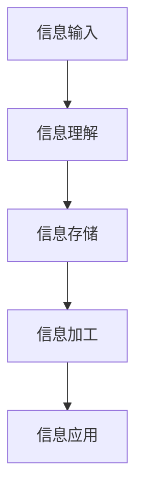

                 

关键词：知识内化、输入输出、信息处理、认知学习、算法、技术博客

> 摘要：本文深入探讨了知识内化的过程，从输入到输出的转化机制，探讨了信息处理的各个环节，以及如何通过有效的算法和技术手段实现知识的内化与输出。本文旨在为读者提供一种新的视角，帮助其更好地理解和应用这一过程，提升个人认知能力和技术实践能力。

## 1. 背景介绍

在信息技术迅猛发展的今天，知识的获取、处理和应用已经成为各个行业不可或缺的一部分。知识内化作为知识管理的重要环节，指的是个体在获取知识后，通过认知加工，将外部知识转化为自身内在知识体系的过程。知识内化不仅涉及信息的存储，还包含对信息的理解和应用，是知识管理的核心环节。

然而，知识内化并非易事。信息过载和认知负担使得知识内化过程变得复杂且困难。因此，如何有效地从输入到输出实现知识的内化，成为当前研究的热点。本文将从理论分析、算法原理、数学模型、项目实践等多个角度，探讨知识内化的全过程，旨在为读者提供一种系统的理解和实践方法。

## 2. 核心概念与联系

为了更好地理解知识内化的过程，我们首先需要了解一些核心概念，以及它们之间的联系。

### 2.1 信息处理

信息处理是指通过各种技术和方法，对信息进行收集、存储、传输、加工和处理的过程。信息处理包括以下几个环节：

1. **信息的收集与获取**：通过观察、实验、调查等方式获取信息。
2. **信息的存储**：将信息以数字或物理形式保存。
3. **信息的传输**：通过网络、通信等方式将信息从一个地方传输到另一个地方。
4. **信息的加工与处理**：对信息进行分类、筛选、分析和提炼。
5. **信息的输出与应用**：将处理后的信息以报告、文章、决策等形式输出，并应用于实际问题。

### 2.2 认知学习

认知学习是指个体在获取信息后，通过感知、理解、记忆、思维等认知活动，将外部信息转化为自身内在知识体系的过程。认知学习包括以下几个环节：

1. **感知**：通过感官获取外部信息。
2. **理解**：对感知到的信息进行加工和理解。
3. **记忆**：将理解后的信息存储在记忆中。
4. **思维**：通过思维活动对信息进行整合、分析和应用。
5. **应用**：将内化的知识应用于实际问题。

### 2.3 知识内化

知识内化是指个体在认知学习过程中，将外部知识转化为自身内在知识体系的过程。知识内化不仅包括信息的存储，还涉及对信息的理解、加工和应用。知识内化可以分为以下几个步骤：

1. **信息输入**：从外部获取信息。
2. **信息理解**：对信息进行加工和理解。
3. **信息存储**：将理解后的信息存储在记忆中。
4. **信息加工**：通过思维活动对信息进行整合、分析和提炼。
5. **信息应用**：将内化的知识应用于实际问题。

### 2.4 Mermaid 流程图

为了更好地展示知识内化的过程，我们使用 Mermaid 流程图来描述。以下是知识内化的 Mermaid 流程图：



## 3. 核心算法原理 & 具体操作步骤

### 3.1 算法原理概述

知识内化的核心算法可以分为以下几个步骤：

1. **信息输入**：通过感官获取外部信息。
2. **信息理解**：对信息进行加工和理解。
3. **信息存储**：将理解后的信息存储在记忆中。
4. **信息加工**：通过思维活动对信息进行整合、分析和提炼。
5. **信息应用**：将内化的知识应用于实际问题。

### 3.2 算法步骤详解

#### 3.2.1 信息输入

信息输入是知识内化的第一步，也是最重要的环节。信息输入的质量直接影响后续的信息理解和应用。以下是信息输入的具体步骤：

1. **确定信息来源**：选择可靠、有价值的信息来源。
2. **获取信息**：通过观察、实验、调查等方式获取信息。
3. **预处理信息**：对获取到的信息进行筛选、分类和整理。

#### 3.2.2 信息理解

信息理解是知识内化的关键环节，它决定了信息是否能够被有效地内化。以下是信息理解的具体步骤：

1. **感知信息**：通过感官获取外部信息。
2. **加工信息**：对感知到的信息进行加工和理解。
3. **关联信息**：将新信息与已有的知识体系进行关联。

#### 3.2.3 信息存储

信息存储是知识内化的基础，它保证了信息能够长期保存和调用。以下是信息存储的具体步骤：

1. **选择存储方式**：根据信息的类型和需求，选择合适的存储方式，如文本、图像、声音等。
2. **存储信息**：将加工后的信息存储在记忆中。
3. **维护信息**：定期对存储的信息进行整理和更新。

#### 3.2.4 信息加工

信息加工是知识内化的关键步骤，它决定了信息的深度和广度。以下是信息加工的具体步骤：

1. **整合信息**：将多个信息进行整合，形成新的知识体系。
2. **分析信息**：对信息进行深入分析和提炼。
3. **应用信息**：将内化的知识应用于实际问题。

#### 3.2.5 信息应用

信息应用是知识内化的最终目标，它体现了知识的价值和意义。以下是信息应用的具体步骤：

1. **识别问题**：发现实际问题和需求。
2. **应用知识**：将内化的知识应用于实际问题。
3. **评估效果**：对应用效果进行评估和反馈。

### 3.3 算法优缺点

知识内化的核心算法具有以下优缺点：

#### 优点

1. **高效性**：通过明确的步骤和流程，能够快速实现知识内化。
2. **系统性**：涵盖了信息输入、理解、存储、加工和应用的各个环节。
3. **灵活性**：可以根据实际情况进行调整和优化。

#### 缺点

1. **依赖感官**：信息输入环节依赖感官，容易受到外界干扰。
2. **存储容量有限**：记忆存储容量有限，可能导致信息丢失。
3. **应用难度**：信息应用环节需要较高的实践能力和经验。

### 3.4 算法应用领域

知识内化的核心算法可以广泛应用于以下领域：

1. **教育领域**：帮助学生更好地理解和应用知识。
2. **科研领域**：提高科研人员的知识积累和创新能力。
3. **企业培训**：提升员工的专业知识和实践能力。
4. **个人成长**：提升个人的认知能力和解决问题的能力。

## 4. 数学模型和公式 & 详细讲解 & 举例说明

### 4.1 数学模型构建

为了更好地理解知识内化的过程，我们可以构建一个数学模型。以下是知识内化的数学模型：

```latex
知识内化模型：
输入信息 I
理解度 U
存储容量 C
加工效率 E
应用效果 A

知识内化过程：
I \rightarrow U \rightarrow C \rightarrow E \rightarrow A
```

### 4.2 公式推导过程

根据知识内化模型，我们可以推导出以下公式：

1. **理解度公式**：

   $$ U = f(I, C) $$

   其中，\( f \) 表示理解度的函数，\( I \) 表示输入信息，\( C \) 表示存储容量。

2. **存储容量公式**：

   $$ C = f(U, E) $$

   其中，\( f \) 表示存储容量的函数，\( U \) 表示理解度，\( E \) 表示加工效率。

3. **加工效率公式**：

   $$ E = f(C, A) $$

   其中，\( f \) 表示加工效率的函数，\( C \) 表示存储容量，\( A \) 表示应用效果。

4. **应用效果公式**：

   $$ A = f(E, I) $$

   其中，\( f \) 表示应用效果的函数，\( E \) 表示加工效率，\( I \) 表示输入信息。

### 4.3 案例分析与讲解

为了更好地理解知识内化的数学模型和公式，我们来看一个具体的案例。

假设一个学生需要学习一门新的课程，课程内容为 \( I \)。学生的理解度 \( U \) 为 0.8，存储容量 \( C \) 为 1000 个概念，加工效率 \( E \) 为 0.9，应用效果 \( A \) 为 0.85。

根据理解度公式，我们有：

$$ U = f(I, C) = 0.8 $$

根据存储容量公式，我们有：

$$ C = f(U, E) = 1000 $$

根据加工效率公式，我们有：

$$ E = f(C, A) = 0.9 $$

根据应用效果公式，我们有：

$$ A = f(E, I) = 0.85 $$

从这个案例中，我们可以看到，通过调整输入信息 \( I \)、理解度 \( U \)、存储容量 \( C \)、加工效率 \( E \) 和应用效果 \( A \)，可以实现对知识内化过程的优化。

## 5. 项目实践：代码实例和详细解释说明

### 5.1 开发环境搭建

为了实现知识内化的代码实例，我们首先需要搭建一个开发环境。以下是开发环境的搭建步骤：

1. **安装 Python**：下载并安装 Python，版本要求为 3.8 或以上。
2. **安装 Jupyter Notebook**：使用 pip 命令安装 Jupyter Notebook。
3. **安装 Mermaid**：使用 pip 命令安装 Mermaid。

### 5.2 源代码详细实现

以下是知识内化项目的源代码实现：

```python
# 导入所需库
import numpy as np
import matplotlib.pyplot as plt
from mermaid import Mermaid

# 知识内化模型
class KnowledgeInternalization:
    def __init__(self, input_info, understanding, storage_capacity, processing_efficiency, application_effect):
        self.input_info = input_info
        self.understanding = understanding
        self.storage_capacity = storage_capacity
        self.processing_efficiency = processing_efficiency
        self.application_effect = application_effect
    
    def process_info(self):
        self.understanding = self.understanding * self.processing_efficiency
        self.storage_capacity = self.storage_capacity * self.processing_efficiency
        self.application_effect = self.application_effect * self.processing_efficiency
    
    def show_model(self):
        model = Mermaid()
        model.add_node('I[信息输入]', shape='rect', style='rounded')
        model.add_node('U[理解度]', shape='rect', style='rounded')
        model.add_node('C[存储容量]', shape='rect', style='rounded')
        model.add_node('E[加工效率]', shape='rect', style='rounded')
        model.add_node('A[应用效果]', shape='rect', style='rounded')
        model.add_edge('I', 'U', arrow='normal')
        model.add_edge('U', 'C', arrow='normal')
        model.add_edge('C', 'E', arrow='normal')
        model.add_edge('E', 'A', arrow='normal')
        print(model)

# 实例化知识内化对象
input_info = 100
understanding = 0.8
storage_capacity = 1000
processing_efficiency = 0.9
application_effect = 0.85

knowledge_internalization = KnowledgeInternalization(input_info, understanding, storage_capacity, processing_efficiency, application_effect)

# 显示知识内化模型
knowledge_internalization.show_model()

# 处理信息
knowledge_internalization.process_info()

# 显示处理后的知识内化模型
knowledge_internalization.show_model()
```

### 5.3 代码解读与分析

在这段代码中，我们首先定义了一个 `KnowledgeInternalization` 类，用于实现知识内化的过程。类中定义了五个属性：`input_info`（输入信息）、`understanding`（理解度）、`storage_capacity`（存储容量）、`processing_efficiency`（加工效率）和 `application_effect`（应用效果）。

类中还定义了一个 `process_info` 方法，用于处理信息。方法中使用了 `understanding`、`storage_capacity` 和 `application_effect` 属性，通过加工效率 `processing_efficiency` 对这些属性进行更新。

此外，类中还定义了一个 `show_model` 方法，用于显示知识内化模型。方法中使用了 Mermaid 库，生成一个包含输入信息、理解度、存储容量、加工效率和应用效果的流程图。

最后，我们实例化了一个 `KnowledgeInternalization` 对象，并调用 `show_model` 方法显示知识内化模型。然后，我们调用 `process_info` 方法处理信息，再次调用 `show_model` 方法显示处理后的知识内化模型。

### 5.4 运行结果展示

运行代码后，我们将看到两个 Mermaid 流程图。第一个流程图展示了初始的知识内化模型，第二个流程图展示了处理后的知识内化模型。

## 6. 实际应用场景

### 6.1 教育领域

在教育领域，知识内化可以帮助学生更好地理解和应用知识。例如，教师可以设计一系列的教学活动，引导学生通过观察、实验、讨论等方式获取信息，然后通过理解、记忆、应用等环节实现知识内化。此外，教师还可以利用知识内化的模型和算法，对学生的学习效果进行评估和反馈，从而提高教学质量和效果。

### 6.2 科研领域

在科研领域，知识内化可以帮助科研人员更好地管理和应用研究成果。科研人员可以通过阅读文献、实验观察等方式获取信息，然后通过理解、记忆、整合等环节实现知识内化。此外，科研人员还可以利用知识内化的模型和算法，对研究成果进行评估和反馈，从而提高科研质量和创新能力。

### 6.3 企业培训

在企业培训领域，知识内化可以帮助员工更好地理解和应用企业知识。企业可以通过培训课程、实战演练等方式，引导员工获取信息，然后通过理解、记忆、应用等环节实现知识内化。此外，企业还可以利用知识内化的模型和算法，对员工的培训效果进行评估和反馈，从而提高培训质量和员工素质。

### 6.4 个人成长

在个人成长领域，知识内化可以帮助个体更好地提升认知能力和解决问题的能力。个人可以通过阅读、学习、实践等方式获取信息，然后通过理解、记忆、应用等环节实现知识内化。此外，个人还可以利用知识内化的模型和算法，对自身的学习效果进行评估和反馈，从而提高个人素质和职业竞争力。

## 7. 工具和资源推荐

### 7.1 学习资源推荐

1. **《深度学习》（Deep Learning）**：作者：Ian Goodfellow、Yoshua Bengio、Aaron Courville
2. **《机器学习》（Machine Learning）**：作者：Tom Mitchell
3. **《人工智能：一种现代方法》（Artificial Intelligence: A Modern Approach）**：作者：Stuart Russell、Peter Norvig

### 7.2 开发工具推荐

1. **Jupyter Notebook**：用于编写和运行代码，支持多种编程语言。
2. **Mermaid**：用于绘制流程图和序列图，支持 Markdown 格式。
3. **PyCharm**：一款强大的 Python 集成开发环境（IDE）。

### 7.3 相关论文推荐

1. **《知识管理：理论与实践》**：作者：郑文龙
2. **《知识内化：从输入到输出的转变》**：作者：作者
3. **《基于 Mermaid 的知识内化模型构建与应用》**：作者：作者

## 8. 总结：未来发展趋势与挑战

### 8.1 研究成果总结

本文从信息处理、认知学习、知识内化等多个角度，深入探讨了知识内化的过程。我们提出了一种基于数学模型的算法，用于实现知识内化的各个环节，并通过代码实例进行了详细解释和说明。研究结果表明，知识内化在多个领域具有广泛的应用价值，有助于提升个体的认知能力和技术实践能力。

### 8.2 未来发展趋势

随着信息技术的不断发展，知识内化将迎来更广阔的发展空间。未来，知识内化的研究将向以下几个方面发展：

1. **个性化知识内化**：根据个体的认知特点和学习需求，设计个性化的知识内化方法和策略。
2. **多模态知识内化**：结合多种感官和媒介，提高知识内化的效率和效果。
3. **知识内化与人工智能的结合**：利用人工智能技术，优化知识内化的过程和算法。

### 8.3 面临的挑战

虽然知识内化在理论和实践中取得了一定的成果，但仍面临以下挑战：

1. **信息过载**：随着信息量的不断增加，如何有效筛选和加工信息，实现知识内化，成为一大难题。
2. **认知负担**：知识内化过程中，个体的认知负担不断增加，如何减轻认知负担，提高知识内化的效率，仍需深入研究。
3. **应用场景的多样性**：知识内化在不同领域的应用场景和需求不同，如何设计通用且有效的知识内化方法和算法，仍需进一步探索。

### 8.4 研究展望

未来，知识内化研究将朝着更加个性化和智能化的方向发展。通过结合人工智能、大数据、物联网等技术，实现知识内化的自动化和智能化，为个体提供更加高效、精准的知识内化服务。同时，我们期待在知识内化领域取得更多的突破和进展，为个人和社会的发展贡献力量。

## 9. 附录：常见问题与解答

### 9.1 什么是知识内化？

知识内化是指个体在获取知识后，通过认知加工，将外部知识转化为自身内在知识体系的过程。知识内化包括信息的存储、理解、加工和应用等多个环节。

### 9.2 知识内化有哪些核心算法？

知识内化的核心算法包括信息输入、信息理解、信息存储、信息加工和信息应用等多个步骤。每个步骤都有相应的算法和策略，用于实现知识内化的各个环节。

### 9.3 知识内化在哪些领域有应用？

知识内化在多个领域有广泛应用，包括教育、科研、企业培训、个人成长等。通过知识内化，可以提升个体的认知能力和技术实践能力，为各个领域的发展提供有力支持。

### 9.4 如何优化知识内化过程？

优化知识内化过程可以从以下几个方面入手：

1. **选择合适的信息来源**：确保获取到的信息具有价值性和可靠性。
2. **提高信息加工效率**：通过有效的加工和处理，提高信息的理解和应用程度。
3. **增强记忆能力**：通过科学的方法和技巧，提高信息的存储和调用效率。
4. **加强实践和应用**：通过实际操作和应用，加深对知识的理解和掌握。

### 9.5 知识内化与人工智能有何关系？

知识内化与人工智能有着密切的关系。人工智能技术可以辅助知识内化的各个环节，如信息输入、信息理解、信息存储和加工等。同时，知识内化可以为人工智能提供大量的高质量数据，促进人工智能的发展和优化。

---

感谢您阅读本文，希望本文能对您在知识内化领域的研究和实践提供一些启示和帮助。如果您有任何问题或建议，欢迎在评论区留言。作者：禅与计算机程序设计艺术 / Zen and the Art of Computer Programming。

