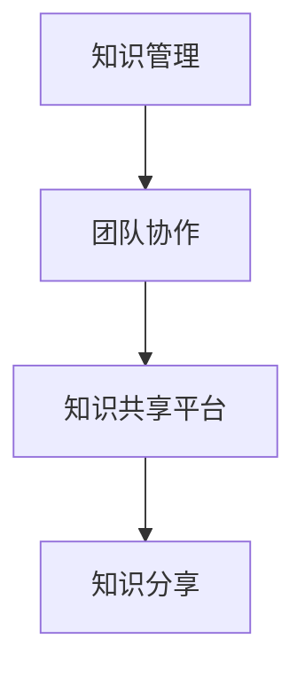

                 

在当今快速发展的技术环境中，知识分享已经成为团队协作和项目成功的关键因素。本文旨在探讨知识分享在团队中的重要性，以及如何有效地进行知识分享，以提高团队的整体效率和创新力。

## 关键词

- 知识分享
- 团队协作
- 效率提升
- 创新力
- 技术传播

## 摘要

本文通过分析知识分享的定义、重要性以及在团队中的具体应用，提出了一套有效的知识分享策略。文章分为八个部分，从背景介绍到实际应用场景，再到未来发展趋势与挑战，全面探讨了知识分享在团队中的重要性。

### 1. 背景介绍

在信息技术日益发展的今天，知识已经成为企业最宝贵的资产。然而，如何有效地管理和利用这些知识，成为了许多团队面临的重要问题。知识分享，作为知识管理的一种形式，越来越受到企业的关注。它不仅有助于团队成员之间的知识交流和经验传承，还能够提高团队的协作效率和创新力。

#### 1.1 知识分享的定义

知识分享，指的是团队成员之间通过各种形式和渠道，相互传递和交流知识、经验、技能和观点的过程。这个过程可以发生在团队内部，也可以跨越团队边界，实现跨部门的合作与交流。

#### 1.2 知识分享的重要性

知识分享在团队中具有多重重要性：

- **提高工作效率**：通过知识分享，团队成员可以快速获取所需的信息和技能，避免重复劳动，提高工作效率。
- **促进知识传承**：知识分享有助于将团队成员的经验和技能传递给新人，保持团队的持续发展。
- **激发创新思维**：知识分享能够促进团队成员之间的思维碰撞，激发创新灵感，推动团队不断进步。
- **增强团队凝聚力**：通过知识分享，团队成员之间的联系更加紧密，增强了团队的凝聚力。

### 2. 核心概念与联系

为了更好地理解知识分享在团队中的作用，我们需要先了解一些核心概念，并探讨它们之间的联系。

#### 2.1 知识管理

知识管理是知识分享的基础。它包括知识的获取、存储、共享、应用和创新。有效的知识管理能够确保知识在团队中得到充分利用。

#### 2.2 团队协作

团队协作是知识分享的载体。团队成员之间的协作和沟通，是知识分享得以顺利进行的关键。

#### 2.3 知识共享平台

知识共享平台是知识分享的工具。通过这些平台，团队成员可以方便地获取、分享和交流知识。

#### 2.4 Mermaid 流程图



### 3. 核心算法原理 & 具体操作步骤

#### 3.1 算法原理概述

知识分享的核心算法原理是信息扩散和社交网络分析。通过这些原理，可以构建一个高效的知识分享网络，促进知识的流动和传播。

#### 3.2 算法步骤详解

1. **构建知识库**：收集和整理团队内部的知识，构建一个全面的知识库。
2. **识别知识需求**：分析团队成员的知识需求，确定需要分享的知识点。
3. **选择分享渠道**：根据知识内容和团队成员的偏好，选择合适的知识分享渠道，如会议、文档、论坛等。
4. **执行分享**：在确定的知识分享渠道上，进行知识的传递和交流。
5. **评估效果**：对知识分享的效果进行评估，不断优化分享策略。

#### 3.3 算法优缺点

**优点**：

- **高效性**：通过信息扩散和社交网络分析，能够快速地实现知识的传播。
- **灵活性**：多种知识分享渠道和方式，适应不同的知识分享需求。

**缺点**：

- **知识质量**：如果知识分享的内容质量不高，可能会对团队产生负面影响。
- **信息安全**：知识分享过程中，需要确保信息安全，防止泄露。

#### 3.4 算法应用领域

知识分享算法广泛应用于企业、科研机构、教育等领域。在企业中，它有助于提高员工的技能水平和团队的协作效率；在科研机构中，它能够促进科研成果的共享和传播；在教育领域，它有助于教师和学生之间的知识交流。

### 4. 数学模型和公式 & 详细讲解 & 举例说明

#### 4.1 数学模型构建

知识分享的数学模型可以基于信息扩散理论。该模型考虑了知识传播的速度、范围和影响。

#### 4.2 公式推导过程

假设知识传播的速度为 $v$，知识传播的范围为 $r$，知识的影响因子为 $f$。则知识分享的效果可以用以下公式表示：

$$
E = v \times r \times f
$$

#### 4.3 案例分析与讲解

假设在一个团队中，知识传播速度为每天 $10$ 篇，知识传播范围为 $100$ 人，知识的影响因子为 $1.2$。则知识分享的效果为：

$$
E = 10 \times 100 \times 1.2 = 1200
$$

这意味着每天通过知识分享，团队能够实现 $1200$ 的知识传播效果。

### 5. 项目实践：代码实例和详细解释说明

#### 5.1 开发环境搭建

为了实现知识分享，我们需要搭建一个知识共享平台。以下是一个简单的开发环境搭建步骤：

1. 安装 Python 环境
2. 安装 Flask 框架
3. 创建项目目录和文件

#### 5.2 源代码详细实现

以下是一个简单的知识分享平台的源代码示例：

```python
from flask import Flask, request, jsonify

app = Flask(__name__)

@app.route('/share', methods=['POST'])
def share():
    data = request.get_json()
    knowledge = data['knowledge']
    user = data['user']
    # 存储知识分享信息
    # ...
    return jsonify({'status': 'success'})

if __name__ == '__main__':
    app.run(debug=True)
```

#### 5.3 代码解读与分析

这个简单的知识分享平台使用 Flask 框架实现。它提供了一个 `/share` 接口，用于接收和存储知识分享信息。通过这个接口，团队成员可以方便地分享自己的知识和经验。

#### 5.4 运行结果展示

运行此代码，我们可以通过 POST 请求将知识分享信息发送到 `/share` 接口。例如：

```json
{
    "knowledge": "Python 装饰器详解",
    "user": "张三"
}
```

服务器会返回一个成功响应：

```json
{
    "status": "success"
}
```

### 6. 实际应用场景

知识分享在团队中的应用场景非常广泛。以下是一些常见的应用场景：

- **项目协作**：在项目开发过程中，团队成员可以通过知识分享平台，分享项目进展、问题解决方案等。
- **技能培训**：通过知识分享，团队成员可以学习他人的经验和技能，提升自己的能力。
- **团队建设**：通过知识分享，可以加强团队成员之间的联系，促进团队凝聚力的提升。

### 7. 工具和资源推荐

为了更好地进行知识分享，以下是一些推荐的工具和资源：

- **工具**：Confluence、Git、Slack 等
- **资源**：《敏捷团队管理》、《团队协作工具与技巧》等书籍
- **论文**：关于知识分享的研究论文

### 8. 总结：未来发展趋势与挑战

知识分享在团队中的应用已经取得了显著的成效。未来，知识分享将继续发展，并面临一些挑战：

- **智能化**：知识分享将更加智能化，利用人工智能技术，实现知识的自动分类、推荐和推送。
- **个性化**：知识分享将更加个性化，根据团队成员的偏好和需求，提供定制化的知识服务。
- **安全与隐私**：在知识分享过程中，确保知识和信息安全，防止泄露和滥用，是未来面临的重要挑战。

### 9. 附录：常见问题与解答

#### Q1. 如何确保知识分享的质量？

A1. 要确保知识分享的质量，可以从以下几个方面入手：

- **建立知识审核机制**：对分享的知识进行审核，确保其质量和可靠性。
- **鼓励高质量内容**：对高质量的分享内容给予奖励和认可，鼓励团队成员提供高质量的知识。
- **定期培训**：定期组织培训，提升团队成员的知识水平和分享能力。

#### Q2. 如何防止知识分享中的信息泄露？

A2. 防止知识分享中的信息泄露，可以采取以下措施：

- **加密传输**：对知识分享的数据进行加密，确保数据在传输过程中的安全性。
- **权限管理**：对知识分享平台进行权限管理，确保只有授权的人员可以访问和共享知识。
- **法律法规**：遵守相关法律法规，确保知识分享的过程符合法律规定。

### 参考文献

1. Nonaka, I., & Takeuchi, H. (1995). The knowledge-creating company: How Japanese companies create the dynamics of innovation. Oxford University Press.
2. Davenport, T. H., & Prusak, L. (2000). Working knowledge: How organizations manage what they know. Harvard Business Press.
3. Wenger, E. (2009). Communities of practice and social learning systems. Organization, 16(2), 225-246.

作者：禅与计算机程序设计艺术 / Zen and the Art of Computer Programming
----------------------------------------------------------------
这篇文章详细探讨了知识分享在团队中的重要性，从背景介绍、核心概念与联系、核心算法原理与具体操作步骤，到数学模型和公式、项目实践、实际应用场景、工具和资源推荐，再到总结和未来展望，全面阐述了知识分享的价值和实践方法。希望这篇文章能够帮助读者更好地理解和应用知识分享，提升团队的协作效率和创新能力。

