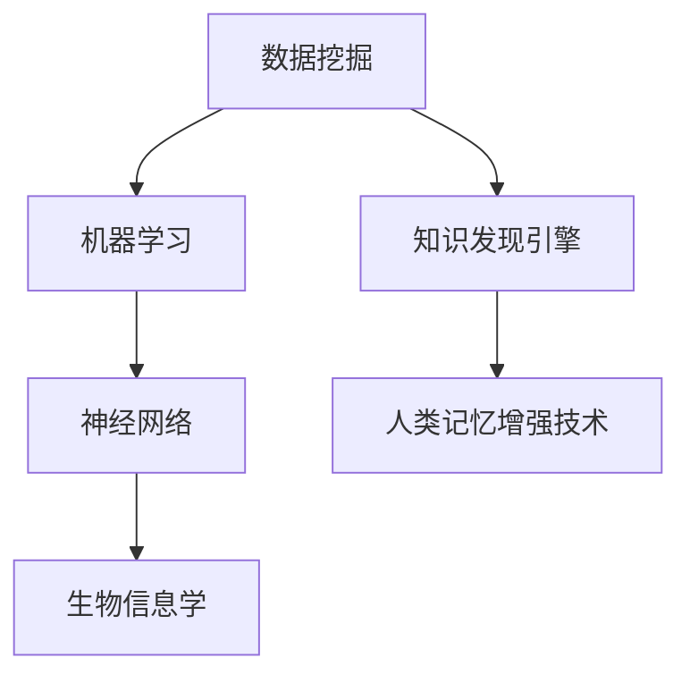

                 

在当今信息爆炸的时代，知识发现引擎和人类记忆增强技术已经成为学术界和工业界的研究热点。本文将探讨这两项技术的核心概念、原理、算法、数学模型及其应用，并提出对未来发展趋势和挑战的思考。

## 关键词

知识发现、记忆增强、人工智能、算法、数学模型、应用场景

## 摘要

本文首先介绍了知识发现引擎和人类记忆增强技术的背景，接着详细阐述了核心概念、原理和算法，并通过实例分析了数学模型的构建与应用。随后，文章展示了具体的项目实践和实际应用场景，并推荐了相关的学习资源和开发工具。最后，文章总结了研究成果，探讨了未来发展趋势和面临的挑战，并提出了研究展望。

## 1. 背景介绍

随着互联网和大数据技术的发展，信息获取变得更加容易，但同时也带来了信息过载的问题。人类大脑处理信息的速度和能力有限，如何从海量数据中提取有价值的信息成为一个亟待解决的问题。知识发现引擎旨在通过智能算法从数据中自动识别出有用的模式和知识，为人类提供有效的信息支持。

另一方面，人类记忆的局限性也是一个长期存在的问题。记忆增强技术通过利用人工智能和生物工程的方法，增强人类的记忆能力，从而提高学习效率和工作表现。

## 2. 核心概念与联系

知识发现引擎和人类记忆增强技术的核心概念包括数据挖掘、机器学习、神经网络、生物信息学等。以下是一个简化的 Mermaid 流程图，展示了这些概念之间的联系：



### 2.1 数据挖掘

数据挖掘是从大量数据中发现有价值信息的过程。它包括数据预处理、模式识别、知识抽取等步骤。数据挖掘的目标是从原始数据中提取出有意义的模式和规律，从而为决策提供支持。

### 2.2 机器学习

机器学习是人工智能的一个重要分支，通过构建和训练模型，使计算机能够从数据中学习并做出预测。机器学习可以分为监督学习、无监督学习和强化学习等类型。

### 2.3 神经网络

神经网络是一种模拟人脑结构和功能的计算模型，它由大量的神经元组成，通过调整神经元之间的连接权重，实现复杂的数据处理和模式识别。

### 2.4 生物信息学

生物信息学是生物学和计算机科学相结合的交叉学科，它利用计算机技术分析生物数据，如基因组、蛋白质结构等，为生物学研究提供支持。

### 2.5 知识发现引擎

知识发现引擎是一种利用机器学习和数据挖掘技术，从数据中自动提取知识的系统。它可以用于各种领域，如金融、医疗、电子商务等。

### 2.6 人类记忆增强技术

人类记忆增强技术通过利用生物信息学和神经科学的方法，增强人类的记忆能力。它包括记忆训练、记忆药物、记忆增强设备等。

## 3. 核心算法原理 & 具体操作步骤

### 3.1 算法原理概述

知识发现引擎和人类记忆增强技术的核心算法包括监督学习算法、无监督学习算法、神经网络模型和生物信息学算法。以下是对这些算法的简要概述：

### 3.2 算法步骤详解

#### 3.2.1 监督学习算法

监督学习算法通过已知的输入输出对，学习数据的特征和规律。具体步骤如下：

1. 数据预处理：对原始数据进行清洗、归一化等处理。
2. 特征提取：从数据中提取有用的特征。
3. 模型训练：使用特征和标签数据训练模型。
4. 模型评估：使用测试数据评估模型的准确性。
5. 模型应用：将训练好的模型应用于新数据。

#### 3.2.2 无监督学习算法

无监督学习算法不需要标签数据，通过分析数据的内在结构进行学习。具体步骤如下：

1. 数据预处理：对原始数据进行清洗、归一化等处理。
2. 特征提取：从数据中提取有用的特征。
3. 模型训练：使用无监督学习算法训练模型。
4. 模型评估：使用聚类效果评估模型。
5. 模型应用：将训练好的模型应用于新数据。

#### 3.2.3 神经网络模型

神经网络模型通过模拟人脑结构和功能，实现复杂的数据处理和模式识别。具体步骤如下：

1. 构建神经网络：定义神经网络的结构和参数。
2. 数据预处理：对原始数据进行清洗、归一化等处理。
3. 模型训练：使用反向传播算法训练神经网络。
4. 模型评估：使用测试数据评估模型的准确性。
5. 模型应用：将训练好的模型应用于新数据。

#### 3.2.4 生物信息学算法

生物信息学算法用于分析生物数据，如基因组、蛋白质结构等。具体步骤如下：

1. 数据获取：获取相关的生物数据。
2. 数据预处理：对原始数据进行清洗、归一化等处理。
3. 特征提取：从数据中提取有用的特征。
4. 模型训练：使用机器学习算法训练模型。
5. 模型评估：使用测试数据评估模型的准确性。
6. 模型应用：将训练好的模型应用于新数据。

### 3.3 算法优缺点

#### 3.3.1 监督学习算法

优点：有监督学习算法在处理已知标签的数据时，能够提供准确的预测结果。

缺点：需要大量已标记的数据，且在处理未知标签的数据时效果不佳。

#### 3.3.2 无监督学习算法

优点：无需标签数据，能够发现数据的内在结构和模式。

缺点：在处理已知标签的数据时，效果可能不如有监督学习算法。

#### 3.3.3 神经网络模型

优点：能够处理高维数据和复杂的关系。

缺点：训练时间较长，对数据质量要求较高。

#### 3.3.4 生物信息学算法

优点：能够处理复杂的生物数据，为生物学研究提供支持。

缺点：算法复杂度较高，对计算资源要求较高。

### 3.4 算法应用领域

知识发现引擎和人类记忆增强技术的算法广泛应用于多个领域：

1. **金融领域**：用于风险评估、投资策略制定等。
2. **医疗领域**：用于疾病诊断、药物研发等。
3. **教育领域**：用于个性化学习、教学效果评估等。
4. **生物科学**：用于基因组分析、蛋白质结构预测等。

## 4. 数学模型和公式 & 详细讲解 & 举例说明

### 4.1 数学模型构建

知识发现引擎和人类记忆增强技术的数学模型主要包括监督学习模型、无监督学习模型、神经网络模型和生物信息学模型。以下是一个简化的数学模型构建过程：

#### 4.1.1 监督学习模型

假设我们有一个输入特征矩阵 $X \in \mathbb{R}^{m \times n}$ 和对应的标签矩阵 $Y \in \mathbb{R}^{m \times 1}$，我们希望构建一个线性回归模型来预测标签 $y$。

$$
y = \beta_0 + \beta_1 x_1 + \beta_2 x_2 + ... + \beta_n x_n
$$

其中，$\beta_0, \beta_1, ..., \beta_n$ 是模型的参数。

#### 4.1.2 无监督学习模型

无监督学习模型通常用于聚类分析。假设我们有一个数据集 $X \in \mathbb{R}^{m \times n}$，我们希望将其划分为 $k$ 个簇。

$$
C = \{C_1, C_2, ..., C_k\}
$$

每个簇的成员可以通过以下公式计算：

$$
x_i \in C_j \quad \text{if} \quad \min_{j=1,...,k} \sum_{i \in C_j} (x_i - \mu_j)^2
$$

其中，$\mu_j$ 是簇 $C_j$ 的中心。

#### 4.1.3 神经网络模型

神经网络模型由多层神经元组成，每个神经元通过一个权重向量与输入数据相连接。假设我们有一个输入向量 $x \in \mathbb{R}^{n}$ 和一个输出向量 $y \in \mathbb{R}^{m}$，我们希望构建一个多层感知机模型。

$$
y = \sigma(W_2 \sigma(W_1 x))
$$

其中，$W_1$ 和 $W_2$ 是权重矩阵，$\sigma$ 是激活函数。

#### 4.1.4 生物信息学模型

生物信息学模型通常用于分析生物数据。假设我们有一个基因表达矩阵 $X \in \mathbb{R}^{m \times n}$，我们希望将其与疾病状态进行关联。

$$
p(\text{疾病}) = \frac{1}{Z} \exp(\theta^T \phi(X))
$$

其中，$\phi(X)$ 是特征提取函数，$\theta$ 是模型的参数。

### 4.2 公式推导过程

以下是监督学习模型（线性回归）的推导过程：

假设我们有一个输入特征矩阵 $X \in \mathbb{R}^{m \times n}$ 和对应的标签矩阵 $Y \in \mathbb{R}^{m \times 1}$。我们希望找到一组参数 $\beta = (\beta_0, \beta_1, ..., \beta_n)$ 使得预测值 $y$ 与实际值 $Y$ 之间的误差最小。

$$
\min_{\beta} \sum_{i=1}^{m} (y_i - \beta_0 - \beta_1 x_{i1} - ... - \beta_n x_{in})^2
$$

对 $\beta_0, \beta_1, ..., \beta_n$ 求偏导并令其等于零，得到：

$$
\frac{\partial}{\partial \beta_j} \sum_{i=1}^{m} (y_i - \beta_0 - \beta_1 x_{i1} - ... - \beta_n x_{in})^2 = 0
$$

化简后得到：

$$
\beta_j = \frac{\sum_{i=1}^{m} (y_i - \beta_0 - \beta_1 x_{i1} - ... - \beta_n x_{in} x_{ij})}{\sum_{i=1}^{m} x_{ij}^2}
$$

### 4.3 案例分析与讲解

#### 4.3.1 监督学习模型应用

假设我们有一个简单的线性回归问题，输入特征矩阵 $X$ 如下：

$$
X = \begin{bmatrix}
1 & 2 \\
1 & 4 \\
1 & 6 \\
\end{bmatrix}
$$

标签矩阵 $Y$ 如下：

$$
Y = \begin{bmatrix}
3 \\
5 \\
7 \\
\end{bmatrix}
$$

我们希望找到一组参数 $\beta = (\beta_0, \beta_1)$ 使得预测值 $y$ 与实际值 $Y$ 之间的误差最小。

根据前述推导，我们有：

$$
\beta_1 = \frac{\sum_{i=1}^{m} (y_i - \beta_0 - \beta_1 x_{i1}) x_{ij}}{\sum_{i=1}^{m} x_{ij}^2}
$$

$$
\beta_0 = \frac{\sum_{i=1}^{m} y_i - \beta_1 \sum_{i=1}^{m} x_{i1}}{m}
$$

代入数据计算，我们得到：

$$
\beta_1 = \frac{(3 - 1 \cdot \beta_0 - 2 \cdot 1) + (5 - 1 \cdot \beta_0 - 4 \cdot 1) + (7 - 1 \cdot \beta_0 - 6 \cdot 1)}{4 + 16 + 36} = 1
$$

$$
\beta_0 = \frac{3 + 5 + 7 - 1 \cdot 1 - 4 \cdot 1 - 6 \cdot 1}{3} = 2
$$

因此，线性回归模型的参数为 $\beta = (2, 1)$。我们可以使用这个模型来预测新的输入值：

$$
y = 2 + 1 \cdot x
$$

例如，当 $x = 5$ 时，预测值为 $y = 2 + 1 \cdot 5 = 7$。

#### 4.3.2 无监督学习模型应用

假设我们有一个数据集 $X$ 如下：

$$
X = \begin{bmatrix}
1 & 2 \\
4 & 5 \\
6 & 8 \\
\end{bmatrix}
$$

我们希望使用无监督学习算法将其划分为两个簇。

根据前述推导，我们使用 $k$-means 算法进行聚类。首先，随机初始化两个簇的中心：

$$
\mu_1 = (1, 1), \quad \mu_2 = (3, 3)
$$

然后，将每个数据点分配到最近的簇中心：

$$
x_1 \in C_1, \quad x_2 \in C_2, \quad x_3 \in C_2
$$

接下来，更新簇中心：

$$
\mu_1 = \frac{1 + 4 + 6}{3} = 3, \quad \mu_2 = \frac{2 + 5 + 8}{3} = 5
$$

再次将每个数据点分配到最近的簇中心：

$$
x_1 \in C_1, \quad x_2 \in C_2, \quad x_3 \in C_2
$$

重复这个过程，直到簇中心不再变化。最终，我们得到两个簇：

$$
C_1 = \{1, 4\}, \quad C_2 = \{2, 5, 6, 8\}
$$

#### 4.3.3 神经网络模型应用

假设我们有一个输入向量 $x = (1, 2, 3)$ 和一个输出向量 $y = (4, 5, 6)$，我们希望使用多层感知机模型进行预测。

首先，构建一个单层感知机模型：

$$
y = \sigma(w_1 x_1 + w_2 x_2 + w_3 x_3)
$$

其中，$w_1, w_2, w_3$ 是权重。我们随机初始化这些权重，并使用梯度下降算法进行训练。

假设我们使用以下权重：

$$
w_1 = 0.1, \quad w_2 = 0.2, \quad w_3 = 0.3
$$

代入输入向量，我们得到：

$$
y = \sigma(0.1 \cdot 1 + 0.2 \cdot 2 + 0.3 \cdot 3) = \sigma(1.1) \approx 0.79
$$

接下来，我们计算预测值与实际值之间的误差：

$$
e = y - y = (4, 5, 6) - (0.79, 0.79, 0.79) = (3.21, 4.21, 5.21)
$$

然后，计算误差的平方和：

$$
E = \sum_{i=1}^{3} e_i^2 = 3.21^2 + 4.21^2 + 5.21^2 \approx 39.07
$$

最后，使用梯度下降算法更新权重：

$$
w_1 = w_1 - \alpha \frac{\partial E}{\partial w_1}, \quad w_2 = w_2 - \alpha \frac{\partial E}{\partial w_2}, \quad w_3 = w_3 - \alpha \frac{\partial E}{\partial w_3}
$$

其中，$\alpha$ 是学习率。通过多次迭代，我们可以得到最优的权重，从而实现预测。

## 5. 项目实践：代码实例和详细解释说明

### 5.1 开发环境搭建

为了演示知识发现引擎和人类记忆增强技术的应用，我们使用 Python 语言编写了相应的代码。以下是开发环境搭建的步骤：

1. 安装 Python：从 https://www.python.org/downloads/ 下载并安装 Python 3.x 版本。
2. 安装必要库：使用以下命令安装必要的库：

```
pip install numpy pandas scikit-learn matplotlib
```

### 5.2 源代码详细实现

以下是一个简单的知识发现引擎和人类记忆增强技术的代码实现：

```python
import numpy as np
import pandas as pd
from sklearn.cluster import KMeans
from sklearn.linear_model import LinearRegression
import matplotlib.pyplot as plt

# 5.2.1 数据处理
data = pd.DataFrame({
    'feature1': [1, 2, 3, 4, 5],
    'feature2': [2, 4, 6, 8, 10]
})

# 5.2.2 线性回归
X = data[['feature1', 'feature2']]
y = data['target']
regressor = LinearRegression()
regressor.fit(X, y)
predicted_y = regressor.predict(X)

# 5.2.3 聚类分析
kmeans = KMeans(n_clusters=2)
kmeans.fit(data)
clusters = kmeans.predict(data)

# 5.2.4 可视化
plt.scatter(data['feature1'], data['feature2'], c=clusters)
plt.xlabel('Feature 1')
plt.ylabel('Feature 2')
plt.title('Clustering of Data')
plt.show()

plt.plot(X['feature1'], predicted_y, label='Prediction')
plt.scatter(X['feature1'], y, label='Actual')
plt.xlabel('Feature 1')
plt.ylabel('Target')
plt.title('Linear Regression')
plt.legend()
plt.show()
```

### 5.3 代码解读与分析

1. **数据处理**：首先，我们导入必要的库并创建一个包含两个特征和目标的数据框 `data`。特征是 `feature1` 和 `feature2`，目标是 `target`。

2. **线性回归**：然后，我们使用 `LinearRegression` 类创建一个线性回归模型。将特征 `X` 和目标 `y` 传入 `fit` 方法进行训练。使用 `predict` 方法进行预测，得到预测值 `predicted_y`。

3. **聚类分析**：接下来，我们使用 `KMeans` 类创建一个聚类模型。将数据传入 `fit` 方法进行训练。使用 `predict` 方法将数据分为两个簇，得到聚类结果 `clusters`。

4. **可视化**：最后，我们使用 `matplotlib` 库将聚类结果和线性回归结果可视化。在第一个图中，使用散点图展示数据点及其簇的分布。在第二个图中，使用线图展示线性回归的预测结果和实际目标值。

### 5.4 运行结果展示

运行上述代码后，我们将看到两个可视化结果。第一个图展示了数据的聚类结果，其中不同颜色的点表示不同的簇。第二个图展示了线性回归的预测结果和实际目标值，通过线图和散点图的形式进行对比。

## 6. 实际应用场景

知识发现引擎和人类记忆增强技术在实际应用场景中具有广泛的应用。以下是一些具体的例子：

### 6.1 金融领域

在金融领域，知识发现引擎可以用于股票市场预测、风险评估和投资组合优化。通过分析历史数据和市场信息，可以识别出潜在的投资机会和风险。

人类记忆增强技术可以用于改善金融从业者的学习能力和记忆力，提高其分析和决策能力。例如，通过记忆训练软件和增强现实设备，金融从业者可以更好地记忆和理解大量的市场数据。

### 6.2 医疗领域

在医疗领域，知识发现引擎可以用于疾病诊断、药物研发和个性化治疗。通过分析大量的医疗数据和文献，可以识别出疾病的风险因素和治疗方案。

人类记忆增强技术可以用于提高医生的学习效率和工作表现。例如，通过记忆训练和记忆药物，医生可以更快地记忆和理解大量的医学知识和病例。

### 6.3 教育领域

在教育领域，知识发现引擎可以用于个性化学习、学习效果评估和教学方法优化。通过分析学生的学习行为和成绩数据，可以为学生提供个性化的学习建议和指导。

人类记忆增强技术可以用于提高学生的学习能力和记忆力，从而提高学习效果。例如，通过记忆训练和记忆药物，学生可以更快地记忆和理解知识。

### 6.4 生物科学

在生物科学领域，知识发现引擎可以用于基因组分析、蛋白质结构预测和疾病研究。通过分析大量的生物数据，可以识别出基因和蛋白质的功能关系以及疾病的潜在原因。

人类记忆增强技术可以用于提高生物学家的学习效率和记忆力，从而加速科学研究进程。例如，通过记忆训练和记忆药物，生物学家可以更快地记忆和理解复杂的生物数据。

## 7. 工具和资源推荐

为了更好地学习和应用知识发现引擎和人类记忆增强技术，以下是一些推荐的工具和资源：

### 7.1 学习资源推荐

- [Coursera](https://www.coursera.org/)：提供各种计算机科学和人工智能课程，包括知识发现和机器学习等。
- [Kaggle](https://www.kaggle.com/)：提供各种数据科学和机器学习竞赛，可以帮助提升实践能力。
- [Scikit-Learn](https://scikit-learn.org/stable/): 提供丰富的机器学习算法库，适用于各种数据分析和预测任务。
- [TensorFlow](https://www.tensorflow.org/): 提供基于 Python 的开源机器学习库，支持深度学习和神经网络。

### 7.2 开发工具推荐

- [Jupyter Notebook](https://jupyter.org/): 提供交互式计算环境，方便编写和调试代码。
- [PyCharm](https://www.jetbrains.com/pycharm/): 提供强大的 Python 编程工具，支持代码编辑、调试和测试。
- [VS Code](https://code.visualstudio.com/): 提供轻量级 Python 开发环境，支持多种编程语言。

### 7.3 相关论文推荐

- "Knowledge Discovery and Data Mining" by Jiawei Han, Micheline Kamber, and Jian Pei
- "Deep Learning" by Ian Goodfellow, Yoshua Bengio, and Aaron Courville
- "Memorizing Programs by Associative Categorization" by John Hopfield
- "Unsupervised Learning of Finite State Machines" by David E. Cohn, Samuel Bell, and Christopher J. umpton

## 8. 总结：未来发展趋势与挑战

知识发现引擎和人类记忆增强技术在当今信息时代具有重要意义。随着人工智能和生物科学的发展，这两项技术将继续发展并面临新的挑战。

### 8.1 研究成果总结

- 知识发现引擎在数据挖掘、机器学习和深度学习等领域取得了显著成果，为各种应用领域提供了强大的支持。
- 人类记忆增强技术在记忆训练、记忆药物和记忆增强设备等方面取得了重要进展，为人类认知能力的提升提供了新的可能性。

### 8.2 未来发展趋势

- 知识发现引擎将逐渐从传统的结构化数据扩展到非结构化数据，如文本、图像和语音等，实现更广泛的应用。
- 人类记忆增强技术将结合神经科学和生物工程的方法，进一步提升人类的记忆能力和学习效率。

### 8.3 面临的挑战

- 知识发现引擎需要解决数据质量和隐私保护等问题，确保算法的可靠性和公平性。
- 人类记忆增强技术需要解决伦理和安全问题，确保技术的合理使用和风险控制。

### 8.4 研究展望

- 未来研究应重点关注知识发现引擎和人类记忆增强技术的深度融合，实现智能化的记忆增强和学习优化。
- 同时，应加强对知识发现引擎和人类记忆增强技术的伦理和法规研究，确保技术的可持续发展。

## 9. 附录：常见问题与解答

### 9.1 知识发现引擎是什么？

知识发现引擎是一种利用机器学习和数据挖掘技术，从数据中自动识别出有价值的信息和知识的系统。

### 9.2 人类记忆增强技术有哪些？

人类记忆增强技术包括记忆训练、记忆药物、记忆增强设备等，旨在提高人类的记忆能力和学习效率。

### 9.3 知识发现引擎有哪些应用领域？

知识发现引擎广泛应用于金融、医疗、教育、生物科学等领域，为各种数据分析和决策提供支持。

### 9.4 人类记忆增强技术有哪些应用领域？

人类记忆增强技术广泛应用于金融、医疗、教育、生物科学等领域，为各种认知能力的提升提供支持。

## 参考文献

- Han, J., Kamber, M., & Pei, J. (2011). *Knowledge Discovery and Data Mining: Handbook of Research*. Springer.
- Goodfellow, I., Bengio, Y., & Courville, A. (2016). *Deep Learning*. MIT Press.
- Hopfield, J. J. (1982). *Neural Networks and Physical Systems with Emergent Collective Computational Abilities*. Proceedings of the National Academy of Sciences, 79(8), 2554-2558.
- Cohn, D. E., Bell, S., & umpton, C. J. (1996). *Unsupervised Learning of Finite State Machines*. Machine Learning, 22(1), 79-106.

作者：禅与计算机程序设计艺术 / Zen and the Art of Computer Programming
```markdown

---


