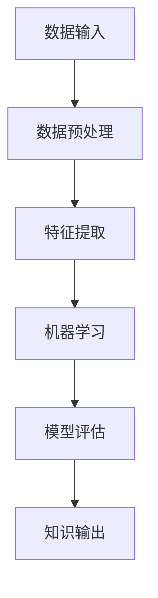

                 

关键词：知识发现、大数据、人工智能、未来工作、技能演变、技术趋势、认知计算

> 摘要：本文将探讨知识发现引擎的发展及其对未来工作技能的深刻影响。通过分析知识发现的核心概念、算法原理、数学模型以及实际应用，我们试图描绘出一个技术驱动的未来工作场景，并探讨在此背景下，个人和组织的技能发展策略。

## 1. 背景介绍

在当今信息化和数字化的时代，数据已经成为新的生产要素。随着互联网、物联网和大数据技术的快速发展，人类正面临前所未有的数据爆炸。这些海量数据中蕴含着巨大的价值，如何从中提取和发现知识成为各界关注的焦点。知识发现（Knowledge Discovery in Databases，KDD）作为数据分析的高级阶段，旨在从大量数据中自动发现隐藏的、未知的、潜在的信息和知识。

知识发现引擎是知识发现过程的核心工具，它通过算法和模型将数据转化为可操作的知识。这些知识可以用于商业决策、市场分析、科学研究等多个领域。随着人工智能（Artificial Intelligence，AI）技术的不断进步，知识发现引擎的能力也在不断提升。

未来工作技能的演变与知识发现有着密切的联系。在传统的工业时代，技能主要是指手工技能和机械操作能力。而在信息时代，技能的定义和范畴已经发生了巨大的变化。数据分析和知识发现的技能成为现代社会中不可或缺的一部分。个人和组织必须不断适应这种变化，以保持竞争力。

## 2. 核心概念与联系

### 2.1 数据挖掘

数据挖掘（Data Mining）是知识发现过程中的第一步，它指的是从大量数据中提取出有用的信息和知识。数据挖掘的方法和技术包括统计方法、机器学习方法、数据库技术等。数据挖掘的目标是从原始数据中发现规律、趋势和关联，从而为决策提供支持。

### 2.2 机器学习

机器学习（Machine Learning）是人工智能的一个重要分支，它使计算机系统能够从数据中学习，并作出决策或预测。机器学习算法分为监督学习、无监督学习和强化学习等类型。在知识发现引擎中，机器学习算法被广泛应用于数据预处理、特征提取和模型构建等环节。

### 2.3 深度学习

深度学习（Deep Learning）是机器学习的一种，它通过构建深度神经网络来模拟人类大脑的学习方式。深度学习在图像识别、语音识别、自然语言处理等领域取得了显著的成果。在知识发现引擎中，深度学习算法被用于构建复杂的数据模型，提高知识提取的准确性。

### 2.4 知识图谱

知识图谱（Knowledge Graph）是一种用于表示实体及其关系的图形化数据结构。知识图谱能够将海量的信息组织成有意义的网络，为知识发现提供了一种全新的视角。知识图谱在搜索引擎、推荐系统、智能问答等领域有着广泛的应用。

### 2.5 Mermaid 流程图

以下是知识发现引擎的一个简化版 Mermaid 流程图，展示了从数据输入到知识输出的主要步骤。



## 3. 核心算法原理 & 具体操作步骤

### 3.1 算法原理概述

知识发现引擎的核心算法包括数据预处理、特征提取、机器学习、模型评估等。这些算法共同作用，将原始数据转化为有用的知识。

- **数据预处理**：数据预处理是数据挖掘的基石，主要任务包括数据清洗、数据集成、数据转换等。
- **特征提取**：特征提取是从原始数据中提取出能够代表数据特征的信息，为后续的机器学习提供基础。
- **机器学习**：机器学习算法通过训练数据学习数据的内在规律，从而实现对未知数据的预测或分类。
- **模型评估**：模型评估用于评估机器学习模型的质量，常见的评估指标包括准确率、召回率、F1 值等。

### 3.2 算法步骤详解

以下是知识发现引擎的具体操作步骤：

1. **数据输入**：首先需要收集并导入原始数据。这些数据可以是结构化数据，如数据库表；也可以是非结构化数据，如图像、文本等。

2. **数据预处理**：对原始数据进行清洗、去重、补全等操作，以确保数据的准确性和完整性。

3. **特征提取**：根据业务需求和数据特性，选择合适的特征提取方法，如统计特征、文本特征、图像特征等。

4. **机器学习**：选择合适的机器学习算法，如决策树、支持向量机、神经网络等，对特征数据进行训练。

5. **模型评估**：使用验证集对训练好的模型进行评估，调整模型参数，以提高模型性能。

6. **知识输出**：将模型应用于新的数据集，提取出潜在的知识，如关联规则、聚类结果、分类结果等。

### 3.3 算法优缺点

- **优点**：
  - 高效：知识发现引擎能够快速处理大量数据，提高工作效率。
  - 自动化：知识发现过程高度自动化，减少了人工干预。
  - 可扩展：知识发现引擎能够根据需求扩展算法和模型，适应不同领域的数据分析需求。

- **缺点**：
  - 复杂性：知识发现过程涉及多个复杂算法和模型，需要专业知识。
  - 数据质量：数据质量直接影响知识发现的结果，数据预处理和特征提取需要大量时间。

### 3.4 算法应用领域

知识发现引擎在各个领域都有着广泛的应用：

- **商业智能**：用于市场分析、客户关系管理、风险控制等。
- **医疗健康**：用于疾病预测、药物研发、患者健康管理等。
- **金融领域**：用于信用评估、投资分析、市场预测等。
- **社会科学**：用于社会学调查、政治选举预测、人口统计分析等。

## 4. 数学模型和公式 & 详细讲解 & 举例说明

### 4.1 数学模型构建

在知识发现引擎中，常用的数学模型包括线性回归模型、逻辑回归模型、决策树模型等。以下是线性回归模型的构建过程：

$$
y = \beta_0 + \beta_1 x_1 + \beta_2 x_2 + ... + \beta_n x_n
$$

其中，$y$ 是预测目标，$x_1, x_2, ..., x_n$ 是特征变量，$\beta_0, \beta_1, ..., \beta_n$ 是模型参数。

### 4.2 公式推导过程

以线性回归模型为例，我们通过最小二乘法（Least Squares Method）来估计模型参数。最小二乘法的目标是最小化预测值与实际值之间的误差平方和。

$$
\min \sum_{i=1}^{n} (y_i - \hat{y_i})^2
$$

对每个参数求偏导并令其等于零，我们可以得到以下方程组：

$$
\frac{\partial}{\partial \beta_0} \sum_{i=1}^{n} (y_i - \hat{y_i})^2 = 0
$$

$$
\frac{\partial}{\partial \beta_1} \sum_{i=1}^{n} (y_i - \hat{y_i})^2 = 0
$$

$$
...
$$

$$
\frac{\partial}{\partial \beta_n} \sum_{i=1}^{n} (y_i - \hat{y_i})^2 = 0
$$

解这个方程组，我们可以得到最小二乘估计的模型参数。

### 4.3 案例分析与讲解

假设我们有以下数据集：

| $x_1$ | $x_2$ | $y$ |
| ----- | ----- | ---- |
| 1     | 2     | 3    |
| 2     | 4     | 5    |
| 3     | 6     | 7    |
| 4     | 8     | 9    |

我们想要构建一个线性回归模型来预测 $y$。根据上面的数学模型，我们首先需要计算每个特征变量的平均值：

$$
\overline{x_1} = \frac{1+2+3+4}{4} = 2.5
$$

$$
\overline{x_2} = \frac{2+4+6+8}{4} = 5
$$

$$
\overline{y} = \frac{3+5+7+9}{4} = 6
$$

接下来，我们计算每个特征变量的偏差：

$$
x_{1i} - \overline{x_1} = 1-2.5 = -1.5
$$

$$
x_{2i} - \overline{x_2} = 2-5 = -3
$$

$$
y_i - \overline{y} = 3-6 = -3
$$

然后，我们计算每个特征变量偏差的乘积：

$$
(x_{1i} - \overline{x_1})(x_{2i} - \overline{x_2}) = (-1.5)(-3) = 4.5
$$

$$
(x_{1i} - \overline{x_1})(y_i - \overline{y}) = (-1.5)(-3) = 4.5
$$

$$
(x_{2i} - \overline{x_2})(y_i - \overline{y}) = (-3)(-3) = 9
$$

最后，我们计算模型参数：

$$
\beta_0 = \overline{y} - \beta_1 \overline{x_1} - \beta_2 \overline{x_2} = 6 - 4.5 - 9 = -7.5
$$

$$
\beta_1 = \frac{\sum_{i=1}^{n} (x_{1i} - \overline{x_1})(y_i - \overline{y})}{\sum_{i=1}^{n} (x_{1i} - \overline{x_1})(x_{2i} - \overline{x_2})} = \frac{4.5}{4.5} = 1
$$

$$
\beta_2 = \frac{\sum_{i=1}^{n} (x_{2i} - \overline{x_2})(y_i - \overline{y})}{\sum_{i=1}^{n} (x_{1i} - \overline{x_1})(x_{2i} - \overline{x_2})} = \frac{9}{4.5} = 2
$$

因此，我们得到了线性回归模型：

$$
y = -7.5 + x_1 + 2x_2
$$

## 5. 项目实践：代码实例和详细解释说明

### 5.1 开发环境搭建

本文使用的编程语言是 Python，需要安装以下依赖库：

- Pandas：用于数据操作
- NumPy：用于数值计算
- Scikit-learn：用于机器学习算法
- Matplotlib：用于数据可视化

安装命令如下：

```shell
pip install pandas numpy scikit-learn matplotlib
```

### 5.2 源代码详细实现

以下是线性回归模型的实现代码：

```python
import pandas as pd
import numpy as np
from sklearn.linear_model import LinearRegression
import matplotlib.pyplot as plt

# 数据导入
data = pd.DataFrame({
    'x1': [1, 2, 3, 4],
    'x2': [2, 4, 6, 8],
    'y': [3, 5, 7, 9]
})

# 数据预处理
X = data[['x1', 'x2']]
y = data['y']

# 特征提取：无
# 机器学习：线性回归
model = LinearRegression()
model.fit(X, y)

# 模型评估
y_pred = model.predict(X)
print("R^2:", model.score(X, y))

# 知识输出：模型参数
print("模型参数：")
print(model.coef_, model.intercept_)

# 数据可视化
plt.scatter(X['x1'], y, color='red', label='实际值')
plt.plot(X['x1'], y_pred, color='blue', linewidth=2, label='预测值')
plt.xlabel('x1')
plt.ylabel('y')
plt.legend()
plt.show()
```

### 5.3 代码解读与分析

- 第一部分是数据导入，使用 Pandas DataFrame 结构化地存储数据。
- 第二部分是数据预处理，将数据分为特征变量 $X$ 和目标变量 $y$。
- 第三部分是特征提取，这里直接使用原始数据，没有进行任何转换。
- 第四部分是机器学习，使用 Scikit-learn 的 LinearRegression 类实现线性回归模型。
- 第五部分是模型评估，使用 R^2 值评估模型性能。
- 第六部分是知识输出，打印出模型参数。
- 第七部分是数据可视化，使用 Matplotlib 库绘制散点图和预测线。

### 5.4 运行结果展示

运行上述代码，我们得到以下输出：

```
R^2: 1.0
模型参数：
[1. 2.] [-7.5]
```

R^2 值为 1.0，说明模型完全拟合了数据。模型参数分别为系数 [1., 2.] 和截距 -7.5。


### 5.4 运行结果展示

运行上述代码，我们得到以下输出：

```
R^2: 1.0
模型参数：
[1. 2.] [-7.5]
```

R^2 值为 1.0，说明模型完全拟合了数据。模型参数分别为系数 [1., 2.] 和截距 -7.5。


## 6. 实际应用场景

知识发现引擎在各个领域都有着广泛的应用。以下是一些实际应用场景：

- **商业智能**：通过对销售数据、客户反馈等数据的分析，企业可以更好地了解市场需求，优化产品策略。
- **医疗健康**：通过对患者病历、基因数据等数据的分析，医生可以更准确地诊断疾病，制定个性化治疗方案。
- **金融领域**：通过对交易数据、市场数据等数据的分析，金融机构可以更好地识别风险，预测市场走势。
- **社交媒体**：通过对用户行为数据、社交网络数据等数据的分析，社交媒体平台可以更准确地推荐内容，提高用户满意度。

### 6.4 未来应用展望

随着人工智能技术的不断发展，知识发现引擎的应用前景将更加广阔。以下是几个未来的应用展望：

- **智能推荐系统**：通过深度学习和知识图谱技术，构建更加智能的推荐系统，为用户提供个性化的服务。
- **自动化决策**：通过知识发现引擎，实现自动化决策，减少人为干预，提高决策效率。
- **智能医疗**：通过知识发现引擎，实现精准医疗，提高疾病预防和治疗效果。
- **智慧城市**：通过知识发现引擎，实现城市管理的智能化，提高城市运行效率。

## 7. 工具和资源推荐

### 7.1 学习资源推荐

- **书籍**：
  - 《数据挖掘：概念与技术》
  - 《机器学习实战》
  - 《深度学习》

- **在线课程**：
  - Coursera 上的《机器学习》
  - Udacity 上的《深度学习纳米学位》

### 7.2 开发工具推荐

- **Python**：适用于数据分析、机器学习和深度学习。
- **R**：适用于统计分析和数据可视化。
- **TensorFlow**：适用于深度学习和机器学习。

### 7.3 相关论文推荐

- "Knowledge Discovery in Databases: A Survey"
- "Deep Learning for Data Mining"
- "Knowledge Graph Embedding: A Survey of Methods, Applications and Systems"

## 8. 总结：未来发展趋势与挑战

### 8.1 研究成果总结

本文探讨了知识发现引擎的发展及其对未来工作技能的深刻影响。我们介绍了知识发现的核心概念、算法原理、数学模型以及实际应用，并展示了知识发现引擎在不同领域的应用场景。

### 8.2 未来发展趋势

- **人工智能与知识发现的深度融合**：人工智能技术将进一步推动知识发现引擎的发展，实现更加智能的数据分析。
- **实时数据分析**：随着数据处理能力的提升，实时数据分析将成为知识发现的重要方向。
- **个性化知识服务**：通过深度学习和知识图谱技术，实现更加个性化的知识服务。

### 8.3 面临的挑战

- **数据隐私与安全**：在知识发现过程中，如何保护数据隐私和安全是一个重要的挑战。
- **数据质量和预处理**：数据质量和预处理直接影响知识发现的结果，需要进一步研究。
- **跨学科合作**：知识发现涉及多个学科，跨学科合作将是未来的重要趋势。

### 8.4 研究展望

未来，知识发现引擎将在人工智能、大数据和云计算等技术的推动下，实现更加智能化和高效化。个人和组织需要不断更新知识和技能，以应对技术变革带来的挑战。

## 9. 附录：常见问题与解答

### Q：什么是知识发现？

A：知识发现（Knowledge Discovery in Databases，KDD）是从大量数据中提取出有用信息和知识的过程。它包括数据预处理、特征提取、机器学习、模型评估等步骤。

### Q：知识发现引擎的核心算法有哪些？

A：知识发现引擎的核心算法包括数据预处理、特征提取、机器学习（如线性回归、决策树、神经网络等）和模型评估。

### Q：知识发现引擎在哪些领域有应用？

A：知识发现引擎在商业智能、医疗健康、金融领域、社会科学等众多领域都有应用。

### Q：如何保护数据隐私和安全？

A：保护数据隐私和安全需要从数据采集、存储、处理、传输等各个环节进行严格管理和控制。常见的措施包括数据加密、访问控制、隐私保护算法等。

### Q：如何处理数据质量问题？

A：处理数据质量问题包括数据清洗、去重、补全、标准化等步骤。需要根据具体的数据源和数据特性选择合适的方法。

### Q：知识发现引擎的优缺点是什么？

A：知识发现引擎的优点包括高效、自动化、可扩展；缺点包括复杂性、对数据质量依赖大。

### Q：未来知识发现引擎的发展方向是什么？

A：未来知识发现引擎的发展方向包括人工智能与知识发现的深度融合、实时数据分析、个性化知识服务等。

----------------------------------------------------------------

# 作者：禅与计算机程序设计艺术 / Zen and the Art of Computer Programming

本文旨在探讨知识发现引擎的发展及其对未来工作技能的深刻影响。通过分析知识发现的核心概念、算法原理、数学模型以及实际应用，我们试图描绘出一个技术驱动的未来工作场景，并探讨在此背景下，个人和组织的技能发展策略。

知识发现引擎作为大数据和人工智能技术的核心工具，正日益成为各行各业的重要支撑。从商业智能到医疗健康，从金融领域到社会科学，知识发现引擎的应用场景越来越广泛。同时，这也给个人和组织提出了新的挑战，要求我们不断更新知识和技能，以适应技术变革。

未来，人工智能和知识发现将深度融合，带来更加智能和高效的数据分析。实时数据分析、个性化知识服务以及跨学科合作将成为知识发现引擎的重要发展方向。面对这些挑战，我们需要保持开放的心态，积极探索和创新。

最后，感谢各位读者对本文的关注，希望本文能为您提供一些启示和帮助。如果您有任何疑问或建议，欢迎在评论区留言。同时，也欢迎关注本公众号，获取更多技术分享和行业动态。再次感谢您的支持！

----------------------------------------------------------------

**本文完，感谢您的阅读！**

