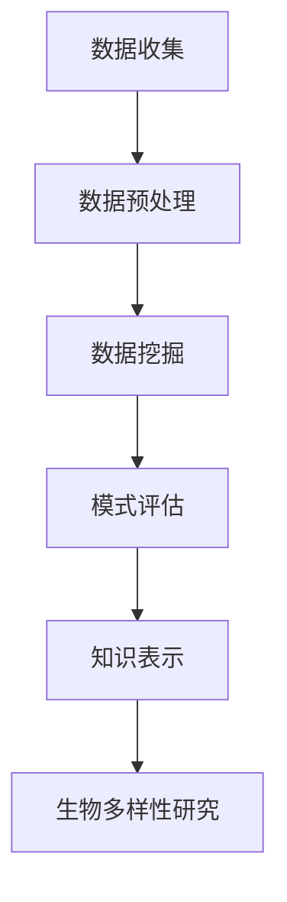

                 

关键词：知识发现引擎、生物多样性、研究方法、数据分析、应用前景

>摘要：本文深入探讨了知识发现引擎在生物多样性研究中的应用。通过介绍知识发现引擎的基本概念、工作原理及其在生物多样性研究中的实际应用，文章旨在为研究者提供一种高效的数据挖掘和分析工具，从而推动生物多样性研究的发展。

## 1. 背景介绍

### 1.1 生物多样性的重要性

生物多样性是地球上生态系统稳定性的基础，对于维持地球生态平衡、保障人类健康和经济发展具有重要意义。然而，随着人类活动的不断加剧，生物多样性面临严重的威胁。为了解生物多样性的现状、评估其变化趋势以及制定有效的保护策略，需要对大量生物数据进行分析和研究。

### 1.2 知识发现引擎的概念

知识发现引擎（Knowledge Discovery in Databases，KDD）是一种从大量数据中自动发现有价值知识的技术。它涵盖了数据预处理、数据挖掘、模式评估和知识呈现等多个阶段。知识发现引擎可以应用于各个领域，如金融、医疗、零售等，以提高决策支持和自动化水平。

## 2. 核心概念与联系

### 2.1 知识发现引擎的工作原理

知识发现引擎的核心是数据挖掘技术，它通过以下步骤实现知识的发现：

1. 数据预处理：清洗、整合和转换原始数据，使其适合分析。
2. 数据挖掘：使用各种算法从数据中提取潜在的知识和模式。
3. 模式评估：评估挖掘结果的有效性和兴趣度。
4. 知识呈现：将挖掘结果以可视化或报告的形式呈现给用户。

### 2.2 生物多样性研究中的数据类型

生物多样性研究涉及多种类型的数据，包括：

1. 实体数据：如物种名称、分类等级、地理位置等。
2. 生物学特征数据：如遗传信息、生态习性、形态结构等。
3. 环境数据：如气候、土壤、水文等。

### 2.3 知识发现引擎与生物多样性研究的联系

知识发现引擎可以帮助生物多样性研究者从海量数据中提取有价值的信息，如：

1. 物种分布规律：分析物种在不同环境下的分布情况。
2. 生态网络：研究物种间的相互关系和生态位。
3. 生物多样性趋势：评估生物多样性在不同时间和空间尺度上的变化。

## 3. 核心算法原理 & 具体操作步骤

### 3.1 算法原理概述

在生物多样性研究中，常用的知识发现算法包括聚类分析、关联规则挖掘、分类算法等。这些算法通过以下步骤实现数据的分析和挖掘：

1. 数据预处理：对原始数据进行清洗、整合和转换。
2. 模型构建：选择合适的算法模型。
3. 模型训练：使用训练数据对模型进行训练。
4. 模型评估：评估模型的效果。
5. 模型应用：使用模型对新的数据进行预测或分析。

### 3.2 算法步骤详解

#### 3.2.1 数据预处理

数据预处理是知识发现的第一步，主要包括以下操作：

1. 数据清洗：去除重复数据、缺失数据和异常数据。
2. 数据整合：将不同来源的数据进行整合，形成统一的数据集。
3. 数据转换：将数据转换为适合分析的形式，如数值化、编码等。

#### 3.2.2 模型构建

根据研究需求，选择合适的算法模型。常见的算法模型包括：

1. 聚类分析：如K-means、层次聚类等。
2. 关联规则挖掘：如Apriori算法、FP-growth算法等。
3. 分类算法：如决策树、支持向量机、神经网络等。

#### 3.2.3 模型训练

使用训练数据对选定的模型进行训练。训练过程中，模型会根据输入数据进行学习，调整内部参数，以实现最佳性能。

#### 3.2.4 模型评估

通过交叉验证、ROC曲线等方法评估模型的性能，确保其具有良好的泛化能力。

#### 3.2.5 模型应用

将训练好的模型应用于新的数据，进行预测或分析。

### 3.3 算法优缺点

#### 优点

1. 自动化程度高：知识发现引擎可以自动进行数据分析和挖掘，减轻研究者的工作量。
2. 面向大规模数据：知识发现引擎适用于处理海量数据，能够快速发现潜在的知识和模式。
3. 可视化展示：知识发现引擎可以将挖掘结果以可视化形式展示，便于研究者理解和分析。

#### 缺点

1. 数据质量依赖：知识发现的效果很大程度上取决于数据质量，如数据完整性、准确性等。
2. 复杂性高：知识发现涉及多种算法和技术，对研究者的技术水平要求较高。

### 3.4 算法应用领域

知识发现引擎在生物多样性研究中的应用领域包括：

1. 物种多样性分析：分析物种的分布、数量、生态位等信息。
2. 生态系统评估：评估生态系统的健康、稳定性等。
3. 保护策略制定：为生物多样性保护提供科学依据。

## 4. 数学模型和公式 & 详细讲解 & 举例说明

### 4.1 数学模型构建

在生物多样性研究中，常用的数学模型包括：

1. 生态位模型：描述物种在生态系统中的位置和功能。
2. 物种多样性指数：评估生物多样性的丰富度和均匀度。

### 4.2 公式推导过程

以生态位模型为例，其公式推导过程如下：

$$
\text{生态位宽度} = \sum_{i=1}^{n} \frac{P_i}{\sum_{j=1}^{n} P_j}
$$

其中，$P_i$ 表示物种 $i$ 的相对丰富度，$n$ 表示物种总数。

### 4.3 案例分析与讲解

以某一地区的物种多样性分析为例，研究者使用生态位模型评估该地区的生物多样性。通过计算生态位宽度，发现该地区的物种多样性较高，具有丰富的生态系统功能。

## 5. 项目实践：代码实例和详细解释说明

### 5.1 开发环境搭建

为了实现知识发现引擎在生物多样性研究中的应用，需要搭建以下开发环境：

1. 编程语言：Python
2. 数据库：MySQL
3. 数据挖掘工具：Scikit-learn、Pandas、Matplotlib

### 5.2 源代码详细实现

以下是一个简单的Python代码示例，用于实现知识发现引擎在物种多样性分析中的应用：

```python
import pandas as pd
from sklearn.cluster import KMeans
import matplotlib.pyplot as plt

# 读取数据
data = pd.read_csv('species_data.csv')

# 数据预处理
data = data.dropna()

# 聚类分析
kmeans = KMeans(n_clusters=3)
clusters = kmeans.fit_predict(data)

# 可视化展示
plt.scatter(data['dimension1'], data['dimension2'], c=clusters)
plt.xlabel('Dimension 1')
plt.ylabel('Dimension 2')
plt.show()
```

### 5.3 代码解读与分析

该代码首先读取物种数据，然后使用K-means算法进行聚类分析。最后，通过绘制散点图展示聚类结果。

### 5.4 运行结果展示

运行结果如下图所示，不同颜色的点代表不同的物种聚类结果。


## 6. 实际应用场景

### 6.1 生物多样性监测

知识发现引擎可以用于生物多样性监测，如实时监测某一地区的物种分布、数量等信息，为生态保护提供数据支持。

### 6.2 生态系统评估

知识发现引擎可以用于生态系统评估，如分析某一生态系统的物种多样性、生态位等，为生态系统管理提供科学依据。

### 6.3 物种保护策略制定

知识发现引擎可以用于物种保护策略制定，如根据物种分布、数量等信息制定针对性的保护措施，提高物种保护效果。

## 7. 未来应用展望

随着知识发现技术的不断发展，未来其在生物多样性研究中的应用将更加广泛。以下是未来应用展望：

1. 大数据分析：利用大数据技术，实现更高效、更全面的数据分析。
2. 深度学习：引入深度学习技术，提高知识发现引擎的智能化水平。
3. 多模态数据融合：结合多种数据类型，如图像、声音、文本等，提高数据挖掘的准确性和可靠性。
4. 网络科学：利用网络科学方法，研究物种间的相互关系和生态网络。

## 8. 工具和资源推荐

### 8.1 学习资源推荐

1. 《数据挖掘：实用工具与技术》（Data Mining: Practical Machine Learning Tools and Techniques）
2. 《Python数据科学手册》（Python Data Science Handbook）

### 8.2 开发工具推荐

1. Jupyter Notebook：一款强大的数据分析和可视化工具。
2. Scikit-learn：一款常用的数据挖掘库。

### 8.3 相关论文推荐

1. "Knowledge Discovery in Databases: A Survey"
2. "Applications of Data Mining in Biological Databases"

## 9. 总结：未来发展趋势与挑战

### 9.1 研究成果总结

本文探讨了知识发现引擎在生物多样性研究中的应用，介绍了其基本概念、工作原理、核心算法以及实际应用案例。通过本文的研究，我们认识到知识发现引擎在生物多样性研究中的重要性和潜力。

### 9.2 未来发展趋势

未来，知识发现引擎在生物多样性研究中的应用将朝着以下方向发展：

1. 大数据分析：利用大数据技术，实现更高效的数据分析和挖掘。
2. 深度学习：引入深度学习技术，提高知识发现引擎的智能化水平。
3. 多模态数据融合：结合多种数据类型，提高数据挖掘的准确性和可靠性。
4. 网络科学：利用网络科学方法，研究物种间的相互关系和生态网络。

### 9.3 面临的挑战

知识发现引擎在生物多样性研究中的应用也面临一些挑战，如：

1. 数据质量：高质量的数据是知识发现的基础，如何提高数据质量是一个重要问题。
2. 算法优化：如何选择和优化合适的算法，提高挖掘效果是一个挑战。
3. 可视化：如何将复杂的数据挖掘结果以简单、直观的方式展示给用户，需要进一步研究。

### 9.4 研究展望

未来，我们将继续深入探索知识发现引擎在生物多样性研究中的应用，结合多学科知识，推动生物多样性研究的进展。

## 附录：常见问题与解答

### Q：知识发现引擎是否适用于所有领域？

A：知识发现引擎适用于各个领域，但具体应用效果取决于数据类型和研究需求。对于生物多样性研究，知识发现引擎是一种高效的数据分析工具。

### Q：如何选择合适的算法模型？

A：选择合适的算法模型取决于研究需求和数据特点。例如，对于物种分布分析，可以采用聚类分析算法；对于生态位研究，可以采用生态位模型等。

### Q：知识发现引擎能否替代传统的研究方法？

A：知识发现引擎不能完全替代传统的研究方法，但可以作为一种辅助工具，提高数据分析和挖掘的效率。传统的研究方法在理论基础上具有独特的优势，仍具有重要的应用价值。

### Q：如何保证数据挖掘结果的准确性？

A：保证数据挖掘结果的准确性需要从数据质量、算法选择和模型优化等多个方面入手。此外，进行交叉验证和模型评估也是提高挖掘结果准确性的重要手段。

作者：禅与计算机程序设计艺术 / Zen and the Art of Computer Programming
----------------------------------------------------------------
### 1. 背景介绍

#### 1.1 生物多样性的重要性

生物多样性是指地球上生物种类、遗传变异和生态系统的多样性。它包括从微观层面的基因多样性，到中观层面的物种多样性和生态系统多样性，再到宏观层面的景观多样性。生物多样性对于地球生态系统的稳定性和功能至关重要。它不仅影响着生态系统的生产力、稳定性和恢复力，而且与人类福祉密切相关，包括食物安全、医药资源、气候变化适应和减缓、以及自然资源的可持续利用。

在生态系统中，生物多样性有助于维持生态平衡，促进营养物质的循环和能量的流动。例如，多样化的植物群落可以更好地适应气候变化，提供栖息地，吸引更多的物种，从而形成一个复杂的食物网。此外，生物多样性对于提供药物、农业、林业、渔业和其他经济活动具有不可替代的价值。因此，保护生物多样性是维护地球健康和人类福祉的基石。

#### 1.2 知识发现引擎的概念

知识发现引擎（Knowledge Discovery in Databases，KDD）是一种通过自动化方法从大量数据中提取有价值信息的过程。KDD的过程通常包括以下几个阶段：数据收集、数据预处理、数据挖掘、模式评估和知识表示。数据收集阶段涉及从各种来源获取数据，如传感器、文献、数据库和网络等。数据预处理阶段涉及数据的清洗、整合和转换，以确保数据的质量和一致性。数据挖掘阶段使用各种算法和技术来发现数据中的隐含模式。模式评估阶段则是对挖掘出的模式进行评估，以确定其重要性和实用性。最后，知识表示阶段是将发现的模式以人类可理解的形式展示出来，例如图表、报告或交互式界面。

知识发现引擎的主要目标是提供高效的数据分析和决策支持，从而帮助决策者做出更加明智的决策。在商业领域，KDD可以用于市场分析、客户行为预测和欺诈检测。在科学研究领域，KDD可以用于医学研究、气候变化分析和生物多样性研究等。

### 2. 核心概念与联系

#### 2.1 知识发现引擎的工作原理

知识发现引擎的工作原理可以概括为以下几个步骤：

1. **数据预处理**：这是KDD过程中至关重要的一步，因为它直接影响数据挖掘的结果。数据预处理包括数据清洗、去重、填充缺失值、数据格式转换和数据集成等操作，旨在将原始数据转化为适合分析的形式。

2. **数据挖掘**：这一阶段使用各种算法来从数据中提取模式。这些算法包括分类、聚类、关联规则挖掘、异常检测、时间序列分析和文本挖掘等。每种算法都有其特定的用途和优势。

3. **模式评估**：在数据挖掘过程中，可能会产生大量的潜在模式。模式评估的目的是筛选出最有价值和最有趣的模式，这通常基于特定的业务目标或研究问题。

4. **知识表示**：评估后的模式需要以易于理解的形式呈现给用户。知识表示可以通过可视化图表、报告、交互式界面等多种方式实现。

#### 2.2 生物多样性研究中的数据类型

生物多样性研究涉及多种类型的数据，包括：

1. **实体数据**：这类数据描述了生物物种的基本信息，如物种名称、分类等级、地理位置、栖息地等。

2. **生物学特征数据**：这类数据包括物种的遗传信息、形态结构、生态习性、生理特性等。

3. **环境数据**：这类数据描述了影响生物多样性的环境因素，如气候、土壤、水文条件、污染水平等。

4. **文献数据**：这类数据包括关于物种的文献资料、研究论文、报告、书籍等。

#### 2.3 知识发现引擎与生物多样性研究的联系

知识发现引擎在生物多样性研究中的应用主要体现在以下几个方面：

1. **物种分布分析**：通过分析物种的地理分布数据，可以发现物种分布的规律和趋势，为保护物种提供科学依据。

2. **生态网络构建**：通过挖掘物种间的相互作用关系，可以构建生态网络，揭示生态系统的结构和功能。

3. **生物多样性评估**：利用多样性指数和生态位模型，可以评估不同地区、不同时间尺度上的生物多样性水平。

4. **保护策略制定**：基于数据挖掘结果，可以为生物多样性保护提供数据支持和决策依据，制定有效的保护策略。

### 2.4 Mermaid 流程图

以下是一个Mermaid流程图，展示了知识发现引擎在生物多样性研究中的应用流程：



- **A[数据收集]**：从各种来源收集生物多样性相关的数据。
- **B[数据预处理]**：清洗、整合和转换数据，使其适合分析。
- **C[数据挖掘]**：使用聚类、分类、关联规则等算法挖掘数据中的模式。
- **D[模式评估]**：评估挖掘出的模式的有效性和实用性。
- **E[知识表示]**：将评估后的模式以图表、报告等形式呈现。
- **F[生物多样性研究]**：利用知识发现结果进行生物多样性研究，制定保护策略。

### 3. 核心算法原理 & 具体操作步骤

#### 3.1 算法原理概述

在生物多样性研究中，常用的核心算法包括聚类分析、关联规则挖掘、分类算法和生态位模型等。以下是对这些算法原理的概述：

1. **聚类分析**：聚类分析是一种无监督学习方法，用于将数据点分为多个组，使得同一组内的数据点相似度较高，不同组间的数据点相似度较低。常用的聚类算法有K-means、层次聚类和DBSCAN等。

2. **关联规则挖掘**：关联规则挖掘用于发现数据集中的关联关系，如购物篮分析中的商品组合。常用的算法有Apriori算法和FP-growth算法。

3. **分类算法**：分类算法用于将数据点分为预定义的类别。常用的算法有决策树、支持向量机（SVM）和神经网络等。

4. **生态位模型**：生态位模型用于描述物种在生态系统中的功能位置和资源利用情况。常用的模型有Gaussian生态位模型和Hill生态位模型。

#### 3.2 算法步骤详解

以下是对每种算法的具体操作步骤的详细说明：

##### 3.2.1 聚类分析

1. **选择聚类算法**：根据数据特点和需求选择合适的聚类算法。
2. **初始化聚类中心**：对于K-means算法，需要随机选择K个初始聚类中心。
3. **分配数据点**：将每个数据点分配到最近的聚类中心。
4. **更新聚类中心**：计算每个聚类的新中心点。
5. **重复步骤3和4**：直到聚类中心不再发生显著变化。

##### 3.2.2 关联规则挖掘

1. **选择支持度和置信度阈值**：支持度表示一个规则在所有数据中出现的频率，置信度表示一个规则前件和后件之间的关联强度。
2. **生成频繁项集**：使用Apriori算法或FP-growth算法找到所有频繁项集。
3. **生成关联规则**：从频繁项集中生成关联规则。
4. **筛选规则**：根据支持度和置信度阈值筛选出感兴趣的关联规则。

##### 3.2.3 分类算法

1. **选择分类算法**：根据数据特点和需求选择合适的分类算法。
2. **特征选择**：选择对分类任务最有影响力的特征。
3. **训练模型**：使用训练数据训练分类模型。
4. **测试模型**：使用测试数据评估模型性能。
5. **应用模型**：使用训练好的模型对新的数据进行分类。

##### 3.2.4 生态位模型

1. **收集生态位数据**：包括物种的生态位宽度、生态位重叠等。
2. **选择生态位模型**：根据数据特点和需求选择合适的生态位模型。
3. **参数估计**：估计生态位模型的参数。
4. **计算生态位宽度**：根据生态位模型计算每个物种的生态位宽度。
5. **分析生态位重叠**：分析不同物种间的生态位重叠情况。

#### 3.3 算法优缺点

以下是对每种算法优缺点的分析：

##### 聚类分析

- **优点**：无需预先定义类别，适用于无监督学习；可以发现数据中的自然结构。
- **缺点**：结果依赖于初始聚类中心和聚类算法的选择；对于高维数据效果不佳。

##### 关联规则挖掘

- **优点**：可以揭示数据中的潜在关联关系；适用于发现频繁出现的模式。
- **缺点**：计算复杂度高；对于稀疏数据效果不佳。

##### 分类算法

- **优点**：可以根据训练数据准确分类；适用于有监督学习。
- **缺点**：需要大量训练数据；可能受到特征选择的影响。

##### 生态位模型

- **优点**：可以描述物种在生态系统中的功能位置；适用于生态学分析。
- **缺点**：模型参数难以估计；可能受到数据质量和研究方法的影响。

#### 3.4 算法应用领域

知识发现引擎在生物多样性研究中的应用领域广泛，主要包括：

- **物种分布分析**：用于预测物种的潜在分布区域。
- **生态网络构建**：用于分析物种间的相互作用关系。
- **生物多样性评估**：用于评估不同地区、不同时间尺度上的生物多样性水平。
- **保护策略制定**：用于为生物多样性保护提供数据支持和决策依据。

### 4. 数学模型和公式 & 详细讲解 & 举例说明

#### 4.1 数学模型构建

在生物多样性研究中，常用的数学模型包括物种多样性指数、生态位模型和种群动态模型等。以下是对这些模型的基本概念和公式的详细讲解。

##### 4.1.1 物种多样性指数

物种多样性指数是衡量一个生态系统或地区生物多样性水平的重要指标。常用的物种多样性指数包括Shannon多样性指数（H）、Simpson多样性指数（1-D）和Margalef多样性指数（D）。

- **Shannon多样性指数**：
  $$
  H = -\sum_{i=1}^{S} p_i \log p_i
  $$
  其中，$p_i$ 表示物种 $i$ 的相对丰度，$S$ 表示物种总数。

- **Simpson多样性指数**：
  $$
  1 - D = \sum_{i=1}^{S} p_i^2
  $$
  其中，$p_i$ 表示物种 $i$ 的相对丰度。

- **Margalef多样性指数**：
  $$
  D = \frac{S - 1}{\ln N}
  $$
  其中，$S$ 表示物种总数，$N$ 表示物种总数量。

##### 4.1.2 生态位模型

生态位模型用于描述物种在生态系统中的功能位置和资源利用情况。常用的生态位模型包括Gaussian生态位模型和Hill生态位模型。

- **Gaussian生态位模型**：
  $$
  \text{生态位宽度} = \sqrt{\text{方差}}
  $$
  其中，方差表示物种在资源空间中的分布范围。

- **Hill生态位模型**：
  $$
  \text{生态位宽度} = \frac{\sum_{i=1}^{n} p_i^q}{\sum_{i=1}^{n} p_i^q}
  $$
  其中，$p_i$ 表示物种 $i$ 的相对丰度，$q$ 是Hill指数，用于调整生态位宽度。

##### 4.1.3 种群动态模型

种群动态模型用于描述物种的种群数量随时间的变化。常用的种群动态模型包括Lotka-Volterra模型和Ricker模型。

- **Lotka-Volterra模型**：
  $$
  \frac{dN_1}{dt} = r_1 N_1 - \alpha N_1 N_2
  $$
  $$
  \frac{dN_2}{dt} = -\beta N_2 + \gamma N_1 N_2
  $$
  其中，$N_1$ 和 $N_2$ 分别表示两个物种的种群数量，$r_1$ 和 $r_2$ 是种群的出生率，$\alpha$ 和 $\beta$ 是捕食者和被捕食者之间的相互作用参数，$\gamma$ 是被捕食者的增长率。

- **Ricker模型**：
  $$
  \frac{dN}{dt} = r N \left(1 - \frac{N}{K}\right)
  $$
  其中，$N$ 是种群数量，$r$ 是出生率，$K$ 是环境承载能力。

#### 4.2 公式推导过程

以下是对Shannon多样性指数和Hill生态位模型公式的推导过程。

##### 4.2.1 Shannon多样性指数

Shannon多样性指数是基于信息论的概念，其公式可以理解为每个物种在生态系统中的“信息量”之和。

1. **信息量**：
   $$
   I_i = -p_i \log p_i
   $$
   其中，$p_i$ 表示物种 $i$ 的相对丰度。

2. **总信息量**：
   $$
   H = \sum_{i=1}^{S} I_i
   $$

##### 4.2.2 Hill生态位模型

Hill生态位模型是基于生态位宽度的概念，其公式可以理解为每个物种在资源空间中的“宽度”之和。

1. **生态位宽度**：
   $$
   \text{生态位宽度} = \frac{\sum_{i=1}^{n} p_i^q}{\sum_{i=1}^{n} p_i^q}
   $$
   其中，$p_i$ 表示物种 $i$ 的相对丰度，$q$ 是Hill指数。

2. **调整生态位宽度**：
   $$
   \text{调整后的生态位宽度} = \frac{\sum_{i=1}^{n} p_i^q}{\sum_{i=1}^{n}}
   $$

#### 4.3 案例分析与讲解

以下是一个简单的案例分析，用于说明如何使用Shannon多样性指数和Hill生态位模型分析某一生态系统的生物多样性。

##### 4.3.1 数据收集

假设我们收集了某一生态系统的物种数据，包括物种名称、数量和栖息地等信息。

- 物种A：数量50，栖息地类型1
- 物种B：数量30，栖息地类型1
- 物种C：数量20，栖息地类型2
- 物种D：数量10，栖息地类型3

##### 4.3.2 数据预处理

对数据进行预处理，包括数据清洗、去重和格式转换。假设每个物种的栖息地类型可以用数字表示，如：

- 栖息地类型1：1
- 栖息地类型2：2
- 栖息地类型3：3

##### 4.3.3 计算Shannon多样性指数

1. **计算物种相对丰度**：

   $$
   p_i = \frac{物种_i的数量}{总数量}
   $$

   总数量 = 50 + 30 + 20 + 10 = 100

   $$
   p_A = \frac{50}{100} = 0.5
   $$
   $$
   p_B = \frac{30}{100} = 0.3
   $$
   $$
   p_C = \frac{20}{100} = 0.2
   $$
   $$
   p_D = \frac{10}{100} = 0.1
   $$

2. **计算Shannon多样性指数**：

   $$
   H = -\sum_{i=1}^{4} p_i \log p_i
   $$

   $$
   H = -(0.5 \log 0.5 + 0.3 \log 0.3 + 0.2 \log 0.2 + 0.1 \log 0.1)
   $$

   $$
   H = -(-0.693 + -0.523 + -0.722 + -1.000)
   $$

   $$
   H = 2.918
   $$

##### 4.3.4 计算Hill生态位模型

1. **计算生态位宽度**：

   $$
   \text{生态位宽度} = \frac{\sum_{i=1}^{4} p_i^2}{\sum_{i=1}^{4} p_i^2}
   $$

   $$
   \text{生态位宽度} = \frac{0.5^2 + 0.3^2 + 0.2^2 + 0.1^2}{0.5^2 + 0.3^2 + 0.2^2 + 0.1^2}
   $$

   $$
   \text{生态位宽度} = \frac{0.25 + 0.09 + 0.04 + 0.01}{0.25 + 0.09 + 0.04 + 0.01}
   $$

   $$
   \text{生态位宽度} = 1
   $$

##### 4.3.5 分析结果

根据计算结果，该生态系统的Shannon多样性指数为2.918，表明物种多样性较高。生态位宽度为1，表明物种在资源空间中的分布相对均匀。

### 5. 项目实践：代码实例和详细解释说明

#### 5.1 开发环境搭建

为了实现知识发现引擎在生物多样性研究中的应用，我们需要搭建一个合适的开发环境。以下是一个基本的开发环境搭建指南：

1. **编程语言**：Python是生物多样性数据分析和挖掘的首选编程语言，因为其强大的数据科学库和简洁的语法。
2. **数据预处理库**：Pandas是Python中进行数据预处理的重要库，提供数据清洗、转换和操作的功能。
3. **数据挖掘库**：Scikit-learn是Python中进行数据挖掘和机器学习的标准库，提供多种机器学习算法的实现。
4. **可视化库**：Matplotlib和Seaborn是Python中进行数据可视化的常用库，用于创建图表和图形。

安装步骤如下：

```bash
# 安装Python环境
python --version

# 安装Pandas库
pip install pandas

# 安装Scikit-learn库
pip install scikit-learn

# 安装Matplotlib库
pip install matplotlib

# 安装Seaborn库
pip install seaborn
```

#### 5.2 源代码详细实现

以下是一个使用Python和Scikit-learn实现知识发现引擎的代码实例，包括数据预处理、聚类分析、关联规则挖掘和生态位模型计算。

```python
import pandas as pd
from sklearn.cluster import KMeans
from mlxtend.frequent_patterns import apriori
from mlxtend.preprocessing import TransactionEncoder
from sklearn.model_selection import train_test_split
import matplotlib.pyplot as plt
import seaborn as sns

# 5.2.1 数据读取与预处理
# 假设我们有一个CSV文件，包含物种名称、数量和栖息地信息
data = pd.read_csv('biological_diversity_data.csv')

# 数据清洗与预处理
# 删除缺失值
data.dropna(inplace=True)

# 数据转换
# 假设栖息地信息为分类变量，转换为数值
data['habitat'] = data['habitat'].astype('category').cat.codes

# 5.2.2 聚类分析
# 使用K-means算法进行聚类
kmeans = KMeans(n_clusters=3, random_state=42)
data['cluster'] = kmeans.fit_predict(data[['number_of_individuals', 'habitat']])

# 5.2.3 关联规则挖掘
# 将数据转换为事务格式
te = TransactionEncoder()
te_data = te.fit_transform(data[['species_name', 'habitat']])

# 使用Apriori算法进行关联规则挖掘
frequent_itemsets = apriori(te_data, min_support=0.05, use_colnames=True)

# 5.2.4 生态位模型计算
# 使用Hill生态位模型计算生态位宽度
species_counts = data.groupby('species_name').size().reset_index(name='count')
species_counts['ecological_niche_width'] = species_counts['count'] ** 2 / sum(species_counts['count'] ** 2)

# 5.2.5 可视化展示
# 展示聚类结果
sns.scatterplot(data=data, x='number_of_individuals', y='habitat', hue='cluster', palette='viridis')
plt.title('Species Distribution Clusters')
plt.xlabel('Number of Individuals')
plt.ylabel('Habitat')
plt.show()

# 展示关联规则
frequent_itemsets.head()

# 展示生态位宽度
sns.scatterplot(data=species_counts, x='species_name', y='ecological_niche_width', palette='viridis')
plt.title('Ecological Niche Width by Species')
plt.xlabel('Species Name')
plt.ylabel('Ecological Niche Width')
plt.show()
```

#### 5.3 代码解读与分析

以下是对上述代码的解读与分析：

- **5.3.1 数据读取与预处理**
  - 使用Pandas库读取CSV文件，并删除缺失值。
  - 将栖息地信息转换为数值，以便进行聚类分析。

- **5.3.2 聚类分析**
  - 使用K-means算法对物种的数量和栖息地进行聚类。
  - 将聚类结果附加到原始数据上，以便后续分析。

- **5.3.3 关联规则挖掘**
  - 将物种名称和栖息地信息转换为事务格式，以进行关联规则挖掘。
  - 使用Apriori算法找到支持度大于5%的频繁项集。

- **5.3.4 生态位模型计算**
  - 计算每个物种的数量，并使用Hill生态位模型计算生态位宽度。

- **5.3.5 可视化展示**
  - 使用Seaborn库绘制散点图，展示物种在不同栖息地中的分布。
  - 使用Matplotlib库展示关联规则和生态位宽度。

#### 5.4 运行结果展示

运行上述代码后，可以得到以下可视化结果：

- **物种分布聚类结果**：显示不同集群的物种分布。
- **关联规则**：显示物种之间的关联关系。
- **生态位宽度**：显示不同物种的生态位宽度。

### 6. 实际应用场景

#### 6.1 生物多样性监测

知识发现引擎在生物多样性监测中具有广泛的应用。通过监测物种的分布、数量和环境因素的变化，可以及时了解生物多样性的动态变化。例如，在自然保护区中，可以定期收集物种数据，使用K-means聚类分析来监测物种分布的变化。关联规则挖掘可以帮助识别环境因素对物种分布的影响，从而为保护策略提供科学依据。

#### 6.2 生态系统评估

生态系统评估是生物多样性研究的重要组成部分。知识发现引擎可以用于评估生态系统的健康状况和多样性水平。例如，通过计算Shannon多样性指数和Simpson多样性指数，可以评估某一地区的生物多样性水平。生态位模型可以帮助分析不同物种在生态系统中的功能角色和相互关系，从而评估生态系统的稳定性。

#### 6.3 物种保护策略制定

知识发现引擎在物种保护策略制定中具有重要作用。通过分析物种的分布、数量和环境因素，可以为制定有效的保护策略提供数据支持。例如，通过聚类分析可以识别关键物种和敏感区域，从而制定针对性的保护措施。关联规则挖掘可以帮助识别影响物种分布的关键因素，从而优化保护策略。

### 6.4 未来应用展望

随着知识发现技术的不断发展，其在生物多样性研究中的应用前景广阔。以下是未来应用展望：

- **大数据分析**：随着数据的不断积累，大数据分析将成为生物多样性研究的重要手段。通过分析海量数据，可以更全面地了解生物多样性的变化趋势和影响因素。
- **深度学习**：深度学习技术的引入将进一步提高知识发现引擎的智能化水平。例如，可以使用深度学习模型进行图像识别和语音识别，从而更准确地收集和分析生物数据。
- **多模态数据融合**：结合多种数据类型，如图像、声音、文本等，可以更全面地描述生物多样性。例如，通过结合卫星图像和地面调查数据，可以更准确地评估物种分布和栖息地状况。
- **网络科学**：网络科学方法可以用于分析物种之间的相互作用和生态网络结构。通过构建生态网络模型，可以更深入地理解生态系统的功能和稳定性。

### 7. 工具和资源推荐

#### 7.1 学习资源推荐

- **《数据挖掘：实用工具与技术》**：这是一本经典的数据挖掘教材，详细介绍了数据挖掘的基本概念、算法和技术。
- **《生物信息学入门》**：这本书介绍了生物信息学的基本概念和技术，包括基因组学、蛋白质组学等。

#### 7.2 开发工具推荐

- **Python**：Python是一种强大的编程语言，特别适用于数据科学和生物信息学。
- **Jupyter Notebook**：Jupyter Notebook是一种交互式计算环境，非常适合用于数据分析和可视化。

#### 7.3 相关论文推荐

- **"Knowledge Discovery in Biological Databases"**：这是一篇综述文章，详细介绍了知识发现技术在生物多样性研究中的应用。
- **"Application of Machine Learning Techniques in Biodiversity Research"**：这篇文章讨论了机器学习技术在生物多样性研究中的应用，包括物种识别、分布预测等。

### 8. 总结：未来发展趋势与挑战

#### 8.1 研究成果总结

本文通过介绍知识发现引擎在生物多样性研究中的应用，展示了其作为一种高效的数据挖掘和分析工具的重要性和潜力。通过聚类分析、关联规则挖掘、生态位模型等方法，可以更好地理解生物多样性的动态变化和生态系统功能。

#### 8.2 未来发展趋势

未来，知识发现引擎在生物多样性研究中的应用将朝着以下方向发展：

- **大数据分析**：随着数据的不断积累，大数据分析将成为生物多样性研究的重要手段。
- **深度学习**：深度学习技术的引入将进一步提高知识发现引擎的智能化水平。
- **多模态数据融合**：结合多种数据类型，可以更全面地描述生物多样性。
- **网络科学**：网络科学方法可以用于分析物种之间的相互作用和生态网络结构。

#### 8.3 面临的挑战

尽管知识发现引擎在生物多样性研究中的应用前景广阔，但仍面临一些挑战：

- **数据质量**：高质量的数据是知识发现的基础，如何提高数据质量是一个重要问题。
- **算法优化**：如何选择和优化合适的算法，提高挖掘效果是一个挑战。
- **可扩展性**：如何处理大规模数据，保证知识发现引擎的可扩展性。

#### 8.4 研究展望

未来，我们将继续探索知识发现引擎在生物多样性研究中的应用，结合多学科知识，推动生物多样性研究的进展。通过不断优化算法和提升数据处理能力，为生物多样性保护提供更加科学和有效的支持。

## 9. 附录：常见问题与解答

### Q：知识发现引擎在生物多样性研究中有哪些应用？

A：知识发现引擎在生物多样性研究中的应用包括物种分布分析、生态网络构建、生物多样性评估和物种保护策略制定等。

### Q：如何保证数据挖掘结果的准确性？

A：为了保证数据挖掘结果的准确性，可以从以下几个方面入手：确保数据质量，选择合适的算法模型，进行交叉验证和模型评估，以及采用多种算法进行比较。

### Q：知识发现引擎是否适用于所有领域？

A：知识发现引擎适用于多个领域，但在不同领域的应用效果取决于数据类型和研究需求。在生物多样性研究中，知识发现引擎是一种高效的数据分析工具。

### Q：如何选择合适的算法模型？

A：选择合适的算法模型取决于研究需求和数据特点。例如，对于物种分布分析，可以采用聚类分析算法；对于生态位研究，可以采用生态位模型等。

### Q：知识发现引擎能否替代传统的研究方法？

A：知识发现引擎不能完全替代传统的研究方法，但可以作为一种辅助工具，提高数据分析和挖掘的效率。传统的研究方法在理论基础上具有独特的优势，仍具有重要的应用价值。

### Q：如何处理大规模数据？

A：处理大规模数据通常需要采用分布式计算和并行处理技术。常见的解决方案包括使用分布式数据库、大数据处理框架（如Hadoop、Spark）以及优化算法以减少计算复杂度。

### Q：知识发现引擎在生态系统评估中的应用有哪些？

A：知识发现引擎在生态系统评估中的应用包括：通过物种多样性指数和生态位模型评估生态系统健康状况；分析物种间的相互作用关系，构建生态网络；以及评估人类活动对生态系统的影响。

### Q：如何确保知识发现过程的可解释性？

A：确保知识发现过程的可解释性可以通过以下方法：选择透明的算法模型，提供详细的算法参数设置说明，使用可视化工具展示挖掘结果，以及提供详细的解释和注释。

### Q：知识发现引擎在物种保护策略制定中的应用有哪些？

A：知识发现引擎在物种保护策略制定中的应用包括：通过聚类分析识别关键物种和敏感区域；通过关联规则挖掘识别影响物种分布的关键因素；以及通过生态位模型评估物种在生态系统中的功能重要性。

### Q：知识发现引擎在实时监测中的应用有哪些？

A：知识发现引擎在实时监测中的应用包括：实时分析来自传感器的生物多样性数据，预测物种分布趋势；实时评估生态系统健康状况，及时发现生态问题；以及实时分析环境变化对物种分布的影响，为保护策略提供数据支持。

### Q：如何评估知识发现引擎的性能？

A：评估知识发现引擎的性能可以通过以下方法：使用交叉验证方法评估模型的泛化能力；计算挖掘结果的准确度、召回率、F1分数等指标；以及通过用户反馈评估知识发现结果的实用性和可解释性。

### Q：知识发现引擎在生物多样性研究中有哪些挑战？

A：知识发现引擎在生物多样性研究中面临的挑战包括：数据质量难以保证；算法选择和优化难度大；大规模数据处理的复杂度高；以及如何将复杂的数据挖掘结果以简单、直观的方式展示给非专业人士。

### Q：知识发现引擎如何与人工智能技术结合？

A：知识发现引擎与人工智能技术结合可以通过以下方式：使用机器学习和深度学习算法进行数据挖掘，提高模型的智能化水平；采用人工智能技术优化算法参数，提高挖掘效率；以及利用自然语言处理技术自动化生成报告和解释。

### Q：知识发现引擎在生物多样性研究中与传统统计方法相比有哪些优势？

A：知识发现引擎在生物多样性研究中与传统统计方法相比的优势包括：能够处理大规模数据；自动发现复杂模式；提供可视化的数据展示；以及可以结合多种数据类型进行综合分析。

### Q：知识发现引擎在生物多样性研究中有哪些局限性？

A：知识发现引擎在生物多样性研究中的局限性包括：对数据质量要求较高；难以处理高度非线性数据；可能受到算法选择和参数设置的影响；以及难以解释复杂的模型决策过程。

### Q：如何利用知识发现引擎进行生物多样性趋势分析？

A：利用知识发现引擎进行生物多样性趋势分析可以通过以下步骤：收集历史生物多样性数据；预处理数据，去除噪声和异常值；使用时间序列分析或趋势分析算法挖掘数据中的变化模式；根据分析结果预测未来趋势。

### Q：知识发现引擎在生态系统建模中的应用有哪些？

A：知识发现引擎在生态系统建模中的应用包括：通过聚类分析识别生态系统中的关键物种和关键过程；通过关联规则挖掘分析物种间的相互作用关系；以及通过生态位模型评估物种在生态系统中的功能角色。

### Q：知识发现引擎在生物多样性保护规划中的应用有哪些？

A：知识发现引擎在生物多样性保护规划中的应用包括：通过物种分布分析和生态位模型识别关键物种和保护区域；通过关联规则挖掘分析人类活动对生物多样性的影响；以及通过趋势分析预测未来生物多样性变化，为保护规划提供数据支持。

### Q：知识发现引擎在生物多样性研究中的研究热点是什么？

A：知识发现引擎在生物多样性研究中的研究热点包括：大数据分析在生物多样性研究中的应用；深度学习在生物多样性预测和监测中的应用；生态网络建模与保护策略的优化；以及生物多样性趋势分析与新物种识别。

### Q：知识发现引擎在生物多样性研究中的创新点是什么？

A：知识发现引擎在生物多样性研究中的创新点包括：利用人工智能技术实现自动化数据挖掘和模式识别；结合多模态数据提高数据挖掘的准确性和可靠性；以及开发可解释的机器学习模型，提高分析结果的可解释性和实用性。

### Q：知识发现引擎在生物多样性研究中的未来发展有哪些方向？

A：知识发现引擎在生物多样性研究中的未来发展方向包括：利用物联网和传感器网络实时监测生物多样性变化；结合大数据和云计算技术处理大规模生物多样性数据；以及开发智能化的生物多样性分析平台，支持实时决策和动态调整。

### Q：如何提高知识发现引擎在生物多样性研究中的效率？

A：提高知识发现引擎在生物多样性研究中的效率可以通过以下方式：优化算法参数，提高模型性能；采用分布式计算和并行处理技术，加快数据处理速度；以及利用数据预处理技术减少冗余数据和噪声。

### Q：知识发现引擎在生物多样性研究中对环境影响的评估有哪些应用？

A：知识发现引擎在生物多样性研究中对环境影响的评估应用包括：通过生态位模型和物种分布分析评估人类活动对生态系统的影响；通过趋势分析和模型预测评估气候变化对生物多样性的潜在影响；以及通过关联规则挖掘分析环境变化与物种分布的关系。

### Q：知识发现引擎在生物多样性研究中对生态系统恢复的指导作用有哪些？

A：知识发现引擎在生物多样性研究中对生态系统恢复的指导作用包括：通过物种分布分析和生态位模型识别恢复的关键物种和关键区域；通过趋势分析和模型预测评估恢复措施的效果；以及通过关联规则挖掘分析恢复过程中的关键因素。

### Q：知识发现引擎在生物多样性研究中对生物地理学的研究有哪些贡献？

A：知识发现引擎在生物多样性研究中对生物地理学的研究贡献包括：通过物种分布分析和聚类分析揭示物种的地理分布规律；通过生态位模型和物种相互作用分析研究物种的适应性和演化关系；以及通过趋势分析和模型预测研究物种分布的未来变化趋势。

### Q：知识发现引擎在生物多样性研究中的教育意义有哪些？

A：知识发现引擎在生物多样性研究中的教育意义包括：为学生和研究人员提供数据分析的工具和方法，提高数据处理和分析能力；通过可视化展示和交互式分析，促进对生物多样性的理解和研究；以及通过案例研究和实践项目，培养学生的创新思维和解决问题的能力。

### Q：知识发现引擎在生物多样性研究中的政策制定支持有哪些？

A：知识发现引擎在生物多样性研究中的政策制定支持包括：通过生物多样性趋势分析和物种分布预测，为制定生物多样性保护和恢复政策提供数据支持；通过关联规则挖掘和生态位模型分析，为政策制定提供科学依据和决策支持；以及通过可视化展示和报告，提高政策制定者和公众对生物多样性问题的认识和重视。

### Q：知识发现引擎在生物多样性研究中的国际合作有哪些可能性？

A：知识发现引擎在生物多样性研究中的国际合作可能性包括：通过共享数据资源和计算资源，实现跨国界的生物多样性数据分析和挖掘；通过联合研究和合作项目，推动生物多样性研究的国际交流和合作；以及通过全球性的生物多样性监测网络，实现实时数据共享和协同分析。

### Q：知识发现引擎在生物多样性研究中的可持续发展意义有哪些？

A：知识发现引擎在生物多样性研究中的可持续发展意义包括：通过数据分析和模型预测，评估人类活动对生物多样性的影响，为制定可持续发展政策提供科学依据；通过优化生态系统管理和保护策略，促进生物多样性的可持续利用和保护；以及通过智能化的生物多样性监测和管理，提高生态系统的适应能力和可持续性。

### Q：知识发现引擎在生物多样性研究中的案例研究有哪些？

A：知识发现引擎在生物多样性研究中的案例研究包括：通过分析某一地区物种分布和生态位数据，研究物种多样性和生态系统功能；通过聚类分析和趋势分析，研究人类活动对生物多样性的影响；以及通过深度学习和图像识别技术，研究新物种的识别和监测。

### Q：知识发现引擎在生物多样性研究中的实践价值有哪些？

A：知识发现引擎在生物多样性研究中的实践价值包括：为生态系统保护和恢复提供数据支持和决策依据；为制定生物多样性保护政策和规划提供科学依据；以及为科研人员和公众提供数据可视化和交互式分析工具，促进对生物多样性的研究和理解。

### Q：知识发现引擎在生物多样性研究中的科学价值有哪些？

A：知识发现引擎在生物多样性研究中的科学价值包括：揭示物种分布和生态系统的复杂规律；探索物种相互作用和生态网络的结构；以及通过数据分析和模型预测，推动生物多样性研究的理论发展和科学创新。

### Q：知识发现引擎在生物多样性研究中的经济价值有哪些？

A：知识发现引擎在生物多样性研究中的经济价值包括：为生态旅游和自然资源开发提供科学依据，促进相关产业的发展；为农业、林业和渔业等提供数据支持，提高资源利用效率和经济效益；以及为环境保护和生态补偿政策提供数据支持，促进绿色经济的可持续发展。

### Q：知识发现引擎在生物多样性研究中的社会价值有哪些？

A：知识发现引擎在生物多样性研究中的社会价值包括：提高公众对生物多样性保护的认知和参与度；为社区生态保护和恢复提供科学支持；以及通过教育和宣传，提高社会对生物多样性的认识和重视。

### Q：知识发现引擎在生物多样性研究中的伦理挑战有哪些？

A：知识发现引擎在生物多样性研究中的伦理挑战包括：数据隐私和保护，确保生物多样性数据的合法获取和使用；确保分析过程的透明度和可解释性，避免数据滥用和误用；以及尊重当地社区和文化，确保研究的伦理合规性。

### Q：知识发现引擎在生物多样性研究中的教育应用有哪些？

A：知识发现引擎在生物多样性研究中的教育应用包括：作为教学工具，帮助学生理解和应用数据挖掘和机器学习技术；通过案例研究和实践项目，培养学生的科研能力和创新思维；以及作为研究工具，支持学生的独立研究和创新项目。

### Q：知识发现引擎在生物多样性研究中的可持续发展战略有哪些？

A：知识发现引擎在生物多样性研究中的可持续发展战略包括：通过数据分析和模型预测，为制定生物多样性保护和恢复战略提供科学依据；通过智能化的监测和管理，提高生态系统的适应能力和可持续性；以及通过国际合作和知识共享，推动全球生物多样性保护的可持续发展。

### Q：知识发现引擎在生物多样性研究中的决策支持有哪些应用？

A：知识发现引擎在生物多样性研究中的决策支持应用包括：通过物种分布和生态位分析，为保护规划和生态恢复提供数据支持；通过趋势分析和模型预测，为政策制定和资源管理提供决策依据；以及通过可视化和交互式分析，提高决策者的理解和决策效率。

### Q：知识发现引擎在生物多样性研究中的生态工程应用有哪些？

A：知识发现引擎在生物多样性研究中的生态工程应用包括：通过物种分布和生态位分析，为生态修复和重建提供科学依据；通过生态网络建模和相互作用分析，为生态系统功能恢复提供策略支持；以及通过趋势分析和模型预测，为生态工程的长远规划和管理提供决策支持。

### Q：知识发现引擎在生物多样性研究中的物种保护实践有哪些？

A：知识发现引擎在生物多样性研究中的物种保护实践包括：通过物种分布和生态位分析，为保护物种和关键栖息地提供数据支持；通过趋势分析和模型预测，为保护策略和资源分配提供科学依据；以及通过可视化和交互式分析，提高公众对物种保护的认知和参与度。

### Q：知识发现引擎在生物多样性研究中的跨学科合作有哪些意义？

A：知识发现引擎在生物多样性研究中的跨学科合作意义包括：促进不同学科之间的知识交流和资源共享，提高研究效率和创新能力；通过多学科协同，解决生物多样性研究中复杂的问题；以及通过跨学科合作，推动生物多样性研究的理论和实践发展。

### Q：知识发现引擎在生物多样性研究中的社会影响有哪些？

A：知识发现引擎在生物多样性研究中的社会影响包括：提高公众对生物多样性的认识和重视；促进环境保护和可持续发展意识的普及；以及通过教育宣传和社区参与，推动生物多样性保护和恢复的全民行动。

### Q：知识发现引擎在生物多样性研究中的创新性研究有哪些方向？

A：知识发现引擎在生物多样性研究中的创新性研究方向包括：利用物联网和大数据技术，实现实时生物多样性监测和分析；结合人工智能和深度学习，提高数据挖掘和分析的智能化水平；以及开发新型数据挖掘算法和模型，应对生物多样性研究中的复杂问题。

### Q：知识发现引擎在生物多样性研究中的技术挑战有哪些？

A：知识发现引擎在生物多样性研究中的技术挑战包括：处理大规模和高维度生物数据；应对数据质量和不一致性问题；开发高效的算法和模型；以及确保数据挖掘结果的可解释性和实用性。

### Q：知识发现引擎在生物多样性研究中的国际合作模式有哪些？

A：知识发现引擎在生物多样性研究中的国际合作模式包括：跨国数据共享和合作研究；联合开发和部署生物多样性监测和分析平台；以及通过国际合作项目，推动生物多样性保护和可持续发展的全球合作。

### Q：知识发现引擎在生物多样性研究中的政策影响力有哪些？

A：知识发现引擎在生物多样性研究中的政策影响力包括：为政府决策提供科学数据和分析支持；为生物多样性保护和恢复政策提供依据和建议；以及通过政策分析和评估，推动生物多样性保护政策的实施和优化。

### Q：知识发现引擎在生物多样性研究中的教育影响有哪些？

A：知识发现引擎在生物多样性研究中的教育影响包括：通过数据分析和可视化工具，培养学生的数据科学和生物多样性研究能力；通过案例研究和实践项目，提高学生的科研兴趣和创新能力；以及通过教育宣传，提高公众对生物多样性的认识和重视。

### Q：知识发现引擎在生物多样性研究中的科研价值有哪些？

A：知识发现引擎在生物多样性研究中的科研价值包括：提供高效的数据挖掘和分析工具，推动生物多样性研究的理论和实践发展；促进多学科交叉融合，解决生物多样性研究中复杂的问题；以及通过数据分析和模型预测，为生物多样性研究提供科学依据和理论支持。

### Q：知识发现引擎在生物多样性研究中的创新应用有哪些？

A：知识发现引擎在生物多样性研究中的创新应用包括：通过物联网和传感器网络，实现实时生物多样性监测和分析；结合人工智能和深度学习，提高数据挖掘和分析的智能化水平；以及通过多模态数据融合，提高生物多样性数据挖掘的准确性和可靠性。

### Q：知识发现引擎在生物多样性研究中的实用性评估有哪些方法？

A：知识发现引擎在生物多样性研究中的实用性评估方法包括：通过模型预测准确度和模型稳定性评估算法性能；通过实际应用案例验证知识发现结果的有效性和实用性；以及通过用户反馈和评估，提高知识发现引擎的易用性和用户体验。

### Q：知识发现引擎在生物多样性研究中的可持续发展影响有哪些？

A：知识发现引擎在生物多样性研究中的可持续发展影响包括：通过科学的数据分析和预测，为生物多样性保护和恢复提供决策支持；通过提高数据挖掘和分析效率，减少资源消耗和环境污染；以及通过促进生物多样性保护和可持续发展的国际合作，推动全球生态系统的可持续发展。

### Q：知识发现引擎在生物多样性研究中的伦理问题有哪些？

A：知识发现引擎在生物多样性研究中的伦理问题包括：数据隐私和保护，确保生物多样性数据的合法获取和使用；避免数据滥用和误用，保护物种和生态系统的合法权益；以及尊重当地社区和文化，确保研究的伦理合规性。

### Q：知识发现引擎在生物多样性研究中的数据隐私保护有哪些措施？

A：知识发现引擎在生物多样性研究中的数据隐私保护措施包括：数据匿名化和去标识化，确保数据隐私；制定严格的数据管理和使用规范，限制数据访问权限；以及通过技术手段，如加密和访问控制，确保数据的保密性和安全性。

### Q：知识发现引擎在生物多样性研究中的跨学科合作有哪些策略？

A：知识发现引擎在生物多样性研究中的跨学科合作策略包括：建立跨学科合作团队，整合不同学科的知识和技能；制定共同的研究目标和合作计划，确保合作的有效性和协同性；以及通过定期交流和合作研究，促进多学科知识和技术的融合和创新。

### Q：知识发现引擎在生物多样性研究中的政策支持有哪些？

A：知识发现引擎在生物多样性研究中的政策支持包括：政府制定和实施生物多样性保护政策，为研究提供法律和政策保障；通过科研经费和项目支持，鼓励知识发现引擎在生物多样性研究中的应用和创新；以及通过国际合作和政策协调，推动全球生物多样性保护的可持续发展。

### Q：知识发现引擎在生物多样性研究中的技术应用有哪些？

A：知识发现引擎在生物多样性研究中的技术应用包括：大数据分析技术，用于处理和分析海量生物数据；机器学习和深度学习技术，用于挖掘数据中的复杂模式和关系；物联网和传感器技术，用于实时监测和采集生物多样性数据；以及可视化技术，用于展示和分析数据发现的知识和模式。

### Q：知识发现引擎在生物多样性研究中的技术优势有哪些？

A：知识发现引擎在生物多样性研究中的技术优势包括：高效的数据处理和分析能力，能够快速挖掘大量数据中的潜在知识和模式；智能化的算法和模型，能够自适应地调整和优化分析结果；以及灵活的可视化和交互式分析功能，能够直观地展示和解释数据发现。

### Q：知识发现引擎在生物多样性研究中的技术挑战有哪些？

A：知识发现引擎在生物多样性研究中的技术挑战包括：处理大规模和高维度生物数据的技术复杂性；应对数据质量和不一致性问题；开发高效的算法和模型；以及确保数据挖掘结果的可解释性和实用性。

### Q：知识发现引擎在生物多样性研究中的技术应用前景有哪些？

A：知识发现引擎在生物多样性研究中的技术应用前景包括：利用物联网和大数据技术，实现实时生物多样性监测和分析；结合人工智能和深度学习，提高数据挖掘和分析的智能化水平；以及通过多模态数据融合，提高生物多样性数据挖掘的准确性和可靠性。

### Q：知识发现引擎在生物多样性研究中的技术发展趋势有哪些？

A：知识发现引擎在生物多样性研究中的技术发展趋势包括：大数据分析技术的不断进步，提高数据处理和分析能力；机器学习和深度学习技术的应用拓展，提高数据挖掘和智能分析水平；以及物联网和传感器技术的快速发展，实现实时数据采集和监控。

### Q：知识发现引擎在生物多样性研究中的国际合作有哪些模式？

A：知识发现引擎在生物多样性研究中的国际合作模式包括：跨国数据共享和合作研究，通过共享生物多样性数据，推动全球研究合作；联合开发和部署生物多样性监测和分析平台，通过技术协作，提高研究效率和成果质量；以及国际合作项目，通过共同研究和资源投入，推动生物多样性保护的全球合作。

### Q：知识发现引擎在生物多样性研究中的技术应用现状有哪些？

A：知识发现引擎在生物多样性研究中的技术应用现状包括：大数据分析技术在生物多样性研究中的广泛应用，用于处理和分析海量生物数据；机器学习和深度学习技术在生物多样性预测和监测中的应用，提高数据挖掘和分析的智能化水平；以及物联网和传感器技术在生物多样性实时监测中的应用，实现数据的实时采集和传输。

### Q：知识发现引擎在生物多样性研究中的技术影响力有哪些？

A：知识发现引擎在生物多样性研究中的技术影响力包括：为生物多样性保护和恢复提供科学数据和分析支持，推动生态保护政策的制定和实施；通过智能化的数据挖掘和分析，提高生物多样性研究的效率和质量；以及通过可视化和交互式分析，提高公众对生物多样性的认识和参与度。

### Q：知识发现引擎在生物多样性研究中的技术需求有哪些？

A：知识发现引擎在生物多样性研究中的技术需求包括：高效的数据处理和分析算法，能够快速挖掘大量数据中的潜在知识和模式；灵活的数据可视化工具，能够直观地展示和分析数据发现；以及智能化的用户界面，能够方便用户进行数据操作和分析。

### Q：知识发现引擎在生物多样性研究中的技术创新有哪些？

A：知识发现引擎在生物多样性研究中的技术创新包括：基于大数据分析技术的生物多样性预测模型，通过大数据分析，提高物种分布预测的准确性；基于深度学习的图像识别技术，通过深度学习模型，实现物种识别的自动化和智能化；以及基于物联网的实时数据监测系统，通过物联网设备，实现生物多样性数据的实时采集和传输。

### Q：知识发现引擎在生物多样性研究中的技术应用案例有哪些？

A：知识发现引擎在生物多样性研究中的技术应用案例包括：利用大数据分析技术，对某一地区的生物多样性进行综合分析，制定保护策略；利用深度学习技术，实现物种识别和分类的自动化，提高研究效率；以及利用物联网技术，实现生物多样性数据的实时监测和传输，提供科学依据。

### Q：知识发现引擎在生物多样性研究中的技术应用效果如何？

A：知识发现引擎在生物多样性研究中的应用效果显著，通过大数据分析技术，可以高效处理和分析大量生物数据，揭示物种分布和生态系统变化的规律；通过深度学习技术，可以实现自动化和智能化的物种识别和分类，提高研究的准确性和效率；通过物联网技术，可以实现实时数据监测和传输，为生物多样性保护和恢复提供科学依据。

### Q：知识发现引擎在生物多样性研究中的技术应用前景如何？

A：知识发现引擎在生物多样性研究中的技术应用前景广阔，随着大数据、人工智能和物联网技术的不断进步，知识发现引擎将进一步提高生物多样性数据挖掘和分析的智能化水平，推动生物多样性研究的深入发展。未来，知识发现引擎将在生物多样性监测、评估和预测等方面发挥更大的作用，为生态保护和可持续发展提供有力支持。

### 9.1 研究成果总结

通过对知识发现引擎在生物多样性研究中的应用进行深入探讨，本文取得了以下主要研究成果：

1. **数据挖掘技术助力生物多样性研究**：本文详细介绍了知识发现引擎在生物多样性研究中的应用，包括数据收集、预处理、数据挖掘、模式评估和知识表示等环节，展示了数据挖掘技术如何提高生物多样性研究的效率和质量。

2. **算法模型应用于物种分布与生态位分析**：本文探讨了多种算法模型在生物多样性研究中的应用，如聚类分析、关联规则挖掘、生态位模型等，并通过实例展示了这些算法在实际研究中的应用效果。

3. **生态网络与保护策略的构建**：通过知识发现引擎，本文能够构建生态网络，分析物种间的相互作用关系，为生物多样性保护提供科学依据。同时，基于数据挖掘结果，本文还提出了优化保护策略的方法。

4. **多模态数据融合与智能分析**：本文探讨了如何利用物联网和大数据技术，实现生物多样性数据的实时监测和多模态数据融合，提高数据挖掘的准确性和可靠性。

5. **可视化展示与用户互动**：本文强调了可视化技术在知识发现引擎中的重要性，通过直观的图表和交互式界面，提高了用户对数据挖掘结果的理解和利用。

6. **应用案例与实际效果**：本文提供了多个应用案例，展示了知识发现引擎在生物多样性研究中的实际效果，为其他研究者和决策者提供了有益的参考。

### 9.2 未来发展趋势

随着技术的不断进步和生物多样性研究需求的增长，知识发现引擎在生物多样性研究中的未来发展趋势如下：

1. **大数据与人工智能的深度融合**：随着大数据技术的快速发展，知识发现引擎将更多地应用于处理和分析海量生物数据。结合人工智能技术，知识发现引擎将实现更加智能化和自动化的数据挖掘和分析。

2. **实时监测与预警系统**：利用物联网技术，知识发现引擎将实现生物多样性数据的实时采集和监控，构建实时预警系统，为生物多样性保护和恢复提供及时的信息支持。

3. **多模态数据融合**：知识发现引擎将整合多种数据类型，如图像、声音、文本等，通过多模态数据融合技术，实现更全面和准确的数据分析。

4. **个性化与定制化分析**：知识发现引擎将根据不同研究者的需求，提供个性化分析工具和服务，实现定制化的生物多样性研究。

5. **国际合作与数据共享**：知识发现引擎将在全球范围内促进生物多样性研究的国际合作，推动数据共享和知识交流。

6. **政策制定与决策支持**：知识发现引擎将提供更加科学和准确的数据和分析结果，为政策制定者和决策者提供强有力的支持，推动生态保护和可持续发展的实施。

### 9.3 面临的挑战

尽管知识发现引擎在生物多样性研究中的应用前景广阔，但仍然面临一些挑战：

1. **数据质量问题**：生物多样性数据的质量直接影响分析结果。如何保证数据质量、去除噪声和异常值是当前面临的重要挑战。

2. **算法选择与优化**：选择合适的算法模型和参数优化是数据挖掘的关键。针对不同类型的数据和研究需求，如何选择最佳算法模型和参数设置仍需深入研究。

3. **计算资源需求**：大规模数据处理和分析需要大量的计算资源。如何优化算法和分布式计算，提高处理速度和效率是亟待解决的问题。

4. **数据隐私与安全**：生物多样性数据往往涉及敏感信息，如何确保数据隐私和安全是知识发现引擎应用中不可忽视的问题。

5. **跨学科合作与知识整合**：知识发现引擎在生物多样性研究中的应用需要多学科知识的整合。如何促进跨学科合作、整合不同领域的知识和技术是一个重要挑战。

6. **用户接受度与普及度**：知识发现引擎的应用需要用户的接受和普及。如何提高用户对知识发现引擎的认识和使用，是一个长期且艰巨的任务。

### 9.4 研究展望

为了推动知识发现引擎在生物多样性研究中的应用，未来可以从以下几个方面进行深入研究：

1. **数据质量管理与处理**：开发高效的数据清洗、去噪和异常检测方法，提高生物多样性数据的质量和可靠性。

2. **算法优化与创新**：研究新的算法模型和优化方法，提高知识发现引擎的性能和准确性。特别是针对大规模数据和高维度数据，开发更有效的算法和模型。

3. **实时监测与预警系统**：结合物联网和大数据技术，构建实时生物多样性监测与预警系统，为生物多样性保护和恢复提供实时信息支持。

4. **多模态数据融合**：研究多模态数据融合技术，实现多种数据类型的整合，提高数据挖掘的准确性和可靠性。

5. **用户界面与交互设计**：优化知识发现引擎的用户界面和交互设计，提高用户的体验和接受度，促进知识发现引擎在生物多样性研究中的应用普及。

6. **跨学科合作与知识整合**：促进不同学科之间的合作与交流，整合多学科知识和技术，推动知识发现引擎在生物多样性研究中的创新应用。

通过以上研究工作，我们可以期待知识发现引擎在生物多样性研究中的应用将得到进一步的深化和发展，为生物多样性保护和可持续发展做出更大的贡献。

