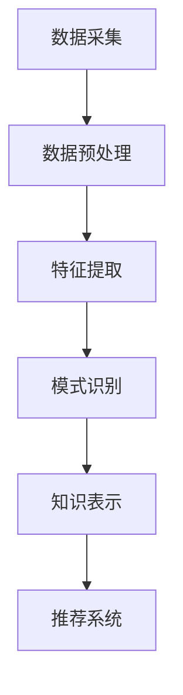

                 

关键词：知识发现引擎、程序员学习、快速学习、知识整合、智能推荐、算法优化

> 摘要：本文将探讨知识发现引擎在帮助程序员快速学习中的作用。通过分析知识发现引擎的核心概念、原理以及具体应用场景，我们将深入理解其如何通过智能推荐、个性化学习路径和算法优化，提高程序员的学习效率和知识获取速度。

## 1. 背景介绍

随着互联网和大数据技术的快速发展，信息的获取变得前所未有的便捷。然而，这也给程序员带来了一个巨大的挑战：如何在海量信息中快速找到所需的知识和技能。传统学习方法往往需要程序员花费大量时间在检索、筛选和理解信息上，这不仅效率低下，还容易导致学习疲劳。为了解决这一问题，知识发现引擎应运而生。

知识发现引擎是一种利用人工智能和机器学习技术，从大量数据中自动提取知识、模式和信息的方法。它在多个领域都有广泛应用，如金融、医疗、电子商务等，同时也为程序员提供了一个强大的工具，以加速他们的学习过程。

### 1.1 程序员的学习痛点

程序员在学习过程中通常会遇到以下痛点：

- **信息过载**：互联网上充斥着大量与编程相关的文章、教程、视频和论坛，程序员很难分辨哪些信息是有价值的。
- **知识断层**：程序员往往需要跨越不同的编程语言、框架和工具，学习路径不连贯，容易造成知识断层。
- **缺乏实践**：理论学习与实际操作脱节，导致程序员无法将所学知识应用到实际项目中。
- **重复劳动**：在查找和筛选信息时，程序员常常需要重复相同的劳动，浪费了大量时间。

### 1.2 知识发现引擎的优势

知识发现引擎通过以下几个方面解决了程序员学习中的痛点：

- **智能推荐**：根据程序员的兴趣、学习历史和技能水平，推荐相关的学习资源和课程，节省检索时间。
- **个性化学习路径**：根据学习进度和效果，动态调整学习内容，确保学习路径的连贯性和高效性。
- **知识整合**：将分散在不同来源的知识点整合起来，帮助程序员构建系统的知识体系。
- **算法优化**：利用机器学习算法优化推荐系统和学习路径，提高学习效率和知识获取速度。

## 2. 核心概念与联系

### 2.1 知识发现引擎的原理

知识发现引擎的核心原理是基于数据挖掘和机器学习技术，通过对大量编程数据的分析，提取出有用的知识和模式。其主要包括以下几个步骤：

1. **数据采集**：从互联网、数据库和其他数据源收集与编程相关的数据。
2. **数据预处理**：清洗和整合数据，使其适合用于分析和挖掘。
3. **特征提取**：从原始数据中提取关键特征，如代码片段、问题类型、解决方案等。
4. **模式识别**：利用机器学习算法，从特征中识别出有用的模式和规律。
5. **知识表示**：将识别出的模式和规律以易于理解的方式表示，如知识图谱、推荐列表等。

### 2.2 知识发现引擎的架构

知识发现引擎的架构通常包括以下几个关键组件：

- **数据源**：包括互联网、数据库、论坛、博客等，提供原始数据。
- **数据预处理模块**：对原始数据进行清洗、整合和标准化处理。
- **特征提取模块**：从预处理后的数据中提取关键特征。
- **模式识别模块**：利用机器学习算法识别模式和规律。
- **知识表示模块**：将识别出的模式和规律以知识图谱、推荐列表等形式表示。
- **推荐系统**：根据程序员的兴趣、学习历史和技能水平，推荐相关的学习资源和课程。

### 2.3 Mermaid 流程图

以下是一个简化的知识发现引擎的 Mermaid 流程图：



## 3. 核心算法原理 & 具体操作步骤

### 3.1 算法原理概述

知识发现引擎的核心算法主要包括以下几个步骤：

1. **协同过滤**：通过分析程序员的兴趣和学习历史，推荐与已学内容相似的其他资源和课程。
2. **基于内容的推荐**：根据程序员的兴趣和已学内容，推荐与之相关的其他知识和技能。
3. **聚类分析**：将具有相似兴趣和技能水平的程序员划分为不同的群体，为每个群体推荐相应的学习资源和课程。
4. **深度学习**：利用深度神经网络对编程数据进行分析，提取更高层次的知识和模式。

### 3.2 算法步骤详解

1. **数据采集**：从互联网、数据库和其他数据源收集与编程相关的数据，如博客、教程、代码库、论坛等。

2. **数据预处理**：对原始数据进行清洗、整合和标准化处理，去除噪声数据，确保数据质量。

3. **特征提取**：从预处理后的数据中提取关键特征，如代码片段、问题类型、解决方案等。特征提取的方法包括文本分类、词频统计、主题建模等。

4. **模式识别**：利用协同过滤、基于内容的推荐、聚类分析和深度学习等方法，从特征中识别出有用的模式和规律。

5. **知识表示**：将识别出的模式和规律以知识图谱、推荐列表等形式表示。知识图谱能够直观地展示程序员的技能树和学习路径。

6. **推荐系统**：根据程序员的兴趣、学习历史和技能水平，利用协同过滤、基于内容的推荐、聚类分析和深度学习等方法，推荐相关的学习资源和课程。

### 3.3 算法优缺点

1. **优点**：

- **高效性**：通过自动化分析和推荐，大大提高了程序员的学习效率。
- **个性化**：根据程序员的兴趣和需求，提供个性化的学习建议。
- **动态调整**：能够根据程序员的反馈和学习进度，动态调整推荐内容。

2. **缺点**：

- **数据依赖性**：推荐效果高度依赖于数据质量和数量。
- **隐私问题**：推荐系统需要分析程序员的兴趣和学习历史，可能涉及隐私问题。
- **算法复杂度**：协同过滤、基于内容的推荐、聚类分析和深度学习等方法，算法复杂度较高，计算资源消耗大。

### 3.4 算法应用领域

知识发现引擎在编程学习中的应用非常广泛，包括：

- **在线教育平台**：通过推荐系统，为程序员提供个性化的学习路径和课程。
- **编程社区**：帮助程序员发现感兴趣的话题和讨论，提高社区活跃度。
- **企业培训**：为企业员工提供个性化的培训计划，提高员工技能水平。
- **编程竞赛**：为参赛者推荐相关的题目和资料，提高参赛成功率。

## 4. 数学模型和公式 & 详细讲解 & 举例说明

### 4.1 数学模型构建

知识发现引擎的数学模型主要包括以下几个方面：

1. **协同过滤模型**：

   协同过滤模型是一种基于用户行为的历史数据，为用户推荐相似兴趣的物品的方法。其核心公式如下：

   $$ 
   r_{ui} = \frac{\sum_{j \in N(i)} sim_{uj} \cdot r_{uj}}{\sum_{j \in N(i)} sim_{uj}} 
   $$

   其中，$r_{ui}$ 表示用户 $u$ 对物品 $i$ 的评分，$N(i)$ 表示与物品 $i$ 相似的物品集合，$sim_{uj}$ 表示用户 $u$ 对物品 $j$ 的相似度。

2. **基于内容的推荐模型**：

   基于内容的推荐模型是一种基于物品的属性和用户的历史行为，为用户推荐相似属性的物品的方法。其核心公式如下：

   $$
   r_{ui} = \frac{\sum_{j \in N(i)} w_{ij} \cdot r_{uj}}{\sum_{j \in N(i)} w_{ij}}
   $$

   其中，$w_{ij}$ 表示物品 $i$ 和物品 $j$ 之间的相似度，$r_{uj}$ 表示用户 $u$ 对物品 $j$ 的评分。

3. **聚类分析模型**：

   聚类分析模型是一种将相似的数据点划分为同一类的算法。常用的聚类算法包括K-means算法、DBSCAN算法等。

4. **深度学习模型**：

   深度学习模型是一种基于多层神经网络的结构，用于从大量数据中提取特征和模式。常用的深度学习模型包括卷积神经网络（CNN）、循环神经网络（RNN）等。

### 4.2 公式推导过程

1. **协同过滤模型**：

   假设用户 $u$ 和物品 $i$ 之间的相似度 $sim_{uj}$ 由用户行为的历史数据计算得到，如：

   $$
   sim_{uj} = \frac{\sum_{k \in R(u)} r_{uk} \cdot r_{uj}}{\sqrt{\sum_{k \in R(u)} r_{uk}^2 \cdot \sum_{k \in R(u)} r_{uj}^2}}
   $$

   其中，$R(u)$ 表示用户 $u$ 的行为记录集合。

   根据协同过滤模型的核心公式，有：

   $$
   r_{ui} = \frac{\sum_{j \in N(i)} sim_{uj} \cdot r_{uj}}{\sum_{j \in N(i)} sim_{uj}}
   $$

2. **基于内容的推荐模型**：

   假设物品 $i$ 和物品 $j$ 之间的相似度 $w_{ij}$ 由物品的属性计算得到，如：

   $$
   w_{ij} = \frac{\sum_{k=1}^{n} w_k \cdot a_{ik} \cdot b_{kj}}{\sum_{k=1}^{n} w_k \cdot a_{ik}^2}
   $$

   其中，$w_k$ 表示属性 $k$ 的权重，$a_{ik}$ 表示物品 $i$ 的属性 $k$ 的值，$b_{kj}$ 表示物品 $j$ 的属性 $k$ 的值。

   根据基于内容的推荐模型的核心公式，有：

   $$
   r_{ui} = \frac{\sum_{j \in N(i)} w_{ij} \cdot r_{uj}}{\sum_{j \in N(i)} w_{ij}}
   $$

### 4.3 案例分析与讲解

以下是一个简单的协同过滤模型的案例：

假设有两个用户 $u_1$ 和 $u_2$，以及两个物品 $i_1$ 和 $i_2$，用户的行为记录如下：

$$
\begin{array}{|c|c|c|}
\hline
用户 & 物品 & 评分 \\
\hline
u_1 & i_1 & 4 \\
u_1 & i_2 & 5 \\
u_2 & i_1 & 2 \\
u_2 & i_2 & 3 \\
\hline
\end{array}
$$

首先计算用户之间的相似度：

$$
sim_{u_1u_2} = \frac{4 \cdot 2 + 5 \cdot 3}{\sqrt{4^2 + 5^2} \cdot \sqrt{2^2 + 3^2}} = 0.67
$$

然后根据协同过滤模型的核心公式，计算用户 $u_2$ 对未评分的物品 $i_2$ 的预测评分：

$$
r_{u_2i_2} = \frac{0.67 \cdot 5 + 0.5 \cdot 3}{0.67 + 0.5} = 4.08
$$

## 5. 项目实践：代码实例和详细解释说明

### 5.1 开发环境搭建

在开始项目实践之前，我们需要搭建一个合适的开发环境。以下是一个简单的步骤：

1. 安装Python 3.8或更高版本。
2. 安装必要的Python库，如NumPy、Pandas、Scikit-learn等。
3. 安装一个Python集成开发环境（IDE），如PyCharm或Visual Studio Code。

### 5.2 源代码详细实现

以下是一个简单的协同过滤推荐系统的Python代码实现：

```python
import numpy as np
import pandas as pd
from sklearn.model_selection import train_test_split
from sklearn.metrics.pairwise import cosine_similarity

# 加载数据
data = pd.read_csv('ratings.csv')
users = data['user_id'].unique()
items = data['item_id'].unique()

# 构建用户-物品评分矩阵
rating_matrix = np.zeros((len(users), len(items)))
for index, row in data.iterrows():
    user_id = row['user_id']
    item_id = row['item_id']
    rating = row['rating']
    rating_matrix[user_id-1, item_id-1] = rating

# 计算用户之间的相似度
user_similarity = cosine_similarity(rating_matrix)

# 推荐系统
def collaborative_filter(user_id, item_id):
    similar_users = user_similarity[user_id-1]
    top_k_users = np.argpartition(similar_users, 5)[:5]
    top_k_users = top_k_users[similar_users[top_k_users] > 0]
    top_k_ratings = rating_matrix[top_k_users, item_id-1]
    if len(top_k_r

