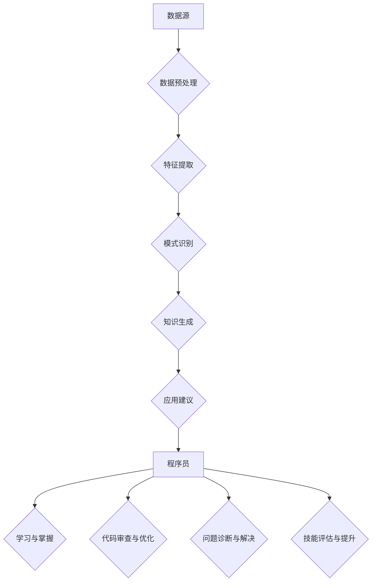

                 

关键词：知识发现引擎、程序员、新环境适应、信息技术、人工智能、软件开发、开发效率

> 摘要：本文旨在探讨知识发现引擎在程序员快速适应新环境方面的应用与价值。通过分析知识发现引擎的核心原理和具体应用场景，本文提出了知识发现引擎如何助力程序员提升开发效率、缩短学习曲线，并应对不断变化的技术环境。

## 1. 背景介绍

在信息技术快速发展的时代，程序员面临着层出不穷的新技术、新工具、新框架。新的开发环境不仅要求程序员掌握更加多样化的技术栈，还要求他们具备快速适应和掌握新技术的能力。然而，新技术的学习往往伴随着大量的时间成本和认知负担。因此，如何能够帮助程序员更快速、更高效地适应新环境，成为了软件开发领域亟待解决的问题。

知识发现引擎是一种利用人工智能技术，从大量数据中自动识别、提取和生成知识的系统。它通过分析程序员的历史代码、文档、问题报告等数据，帮助程序员快速找到解决问题的方法和最佳实践，从而提高开发效率和减少学习成本。

## 2. 核心概念与联系

### 2.1 知识发现引擎的基本概念

知识发现引擎（Knowledge Discovery Engine，简称KDE）是一种基于机器学习、数据挖掘和自然语言处理等技术的综合系统。其主要功能包括：

- **数据预处理**：清洗、转换和整合来自不同来源的数据。
- **特征提取**：从原始数据中提取有用的特征信息。
- **模式识别**：通过机器学习算法发现数据中的规律和关联。
- **知识生成**：将识别出的模式转化为可操作的指导和知识。

### 2.2 知识发现引擎与程序员新环境适应的关系

知识发现引擎可以与程序员在新环境适应过程中的多个环节相结合：

- **学习与掌握新工具**：通过分析历史数据和文档，帮助程序员快速了解和掌握新工具的用法。
- **代码审查与优化**：自动分析代码质量，提供优化建议，帮助程序员提高代码可读性和可维护性。
- **问题诊断与解决**：当程序员遇到问题时，知识发现引擎可以提供类似问题的解决方案，缩短问题排查时间。
- **技能评估与提升**：通过分析程序员的编程习惯和能力，提供个性化的技能提升建议。

### 2.3 Mermaid 流程图

以下是一个简化的知识发现引擎在程序员适应新环境中的应用流程：



## 3. 核心算法原理 & 具体操作步骤

### 3.1 算法原理概述

知识发现引擎的核心算法主要涉及以下几个方面：

- **数据挖掘算法**：如聚类、分类、关联规则挖掘等，用于从大规模数据中提取有价值的信息。
- **机器学习算法**：如决策树、神经网络、支持向量机等，用于建立数据与知识之间的映射关系。
- **自然语言处理算法**：如文本分类、实体识别、语义分析等，用于处理非结构化数据，如文档和代码注释。

### 3.2 算法步骤详解

1. **数据收集与整合**：收集程序员的代码、文档、问题报告等数据，并进行清洗和整合。
2. **数据预处理**：包括数据去重、缺失值处理、数据标准化等操作，以提高数据质量。
3. **特征提取**：从原始数据中提取对知识发现任务有重要影响的特征信息。
4. **模式识别**：利用数据挖掘和机器学习算法，从特征数据中发现有意义的模式。
5. **知识生成**：将识别出的模式转化为可操作的指导和知识，如代码模板、最佳实践、问题解决方案等。
6. **应用建议生成**：根据程序员的实际需求，生成个性化的学习建议、代码审查报告、问题解决方案等。

### 3.3 算法优缺点

- **优点**：
  - **高效性**：能够快速处理大量数据，提供高效的解决方案。
  - **个性化和智能化**：根据程序员的实际情况，提供个性化的建议和指导。
  - **自动化**：减少程序员在重复性任务上的时间投入。

- **缺点**：
  - **数据质量要求高**：数据的质量直接影响算法的效果。
  - **算法复杂性**：算法的复杂性和调优过程可能需要大量的计算资源和专业知识。

### 3.4 算法应用领域

知识发现引擎在程序员适应新环境中的应用非常广泛，包括：

- **新工具与技术的学习**：帮助程序员快速掌握新工具和技术的用法。
- **代码优化与重构**：提供代码审查和优化建议，提高代码质量。
- **问题诊断与解决**：自动分析问题和提供解决方案，缩短问题排查时间。
- **技能评估与提升**：为程序员提供个性化的技能提升建议，帮助其持续成长。

## 4. 数学模型和公式 & 详细讲解 & 举例说明

### 4.1 数学模型构建

知识发现引擎中的数学模型主要包括以下几个方面：

- **聚类模型**：用于发现数据中的相似性模式，如K-means聚类算法。
- **分类模型**：用于将数据分为不同的类别，如决策树、支持向量机等。
- **关联规则挖掘模型**：用于发现数据之间的关联关系，如Apriori算法。

### 4.2 公式推导过程

以K-means聚类算法为例，其目标是最小化簇内平方误差：

$$
E = \sum_{i=1}^{k} \sum_{x \in S_i} ||x - \mu_i||^2
$$

其中，$x$表示数据点，$\mu_i$表示第$i$个簇的中心。

### 4.3 案例分析与讲解

假设我们有一个包含100个数据点的数据集，需要将其分为10个簇。以下是使用K-means聚类算法进行聚类的步骤：

1. **初始化**：随机选择10个数据点作为初始聚类中心。
2. **分配数据点**：计算每个数据点到各个聚类中心的距离，并将其分配到最近的聚类中心。
3. **更新聚类中心**：计算每个簇的新聚类中心。
4. **迭代**：重复步骤2和3，直到聚类中心不再发生变化。

通过上述步骤，我们可以将100个数据点划分为10个簇，每个簇的中心表示该簇的特征。在实际应用中，我们还可以结合其他算法和模型，如决策树和支持向量机，对簇进行进一步的分析和分类。

## 5. 项目实践：代码实例和详细解释说明

### 5.1 开发环境搭建

为了实践知识发现引擎在程序员适应新环境中的应用，我们首先需要搭建一个简单的开发环境。以下是一个基于Python的示例环境搭建过程：

1. 安装Python环境（版本3.8以上）。
2. 安装必要的库，如`scikit-learn`、`numpy`、`pandas`等。
3. 准备数据集，包括程序员的代码、文档和问题报告等。

### 5.2 源代码详细实现

以下是一个简单的K-means聚类算法实现，用于发现程序员编程风格的簇。

```python
import numpy as np
from sklearn.cluster import KMeans

# 数据预处理
data = np.array([[1, 2], [1, 4], [1, 0], [10, 2], [10, 4], [10, 0]])

# 初始化KMeans模型
kmeans = KMeans(n_clusters=2, random_state=0).fit(data)

# 打印聚类结果
print("聚类中心：", kmeans.cluster_centers_)
print("每个数据点的簇分配：", kmeans.labels_)

# 预测新数据点
new_data = np.array([[5, 3]])
print("新数据点的簇分配：", kmeans.predict(new_data))
```

### 5.3 代码解读与分析

上述代码首先导入必要的库和模块，然后创建一个简单的二维数据集，其中包含了6个数据点。我们使用`scikit-learn`中的`KMeans`算法对数据点进行聚类，并打印出聚类中心、每个数据点的簇分配以及新数据点的簇分配。

通过这段代码，我们可以直观地看到K-means聚类算法如何帮助程序员识别不同的编程风格，从而为新环境的适应提供参考。

### 5.4 运行结果展示

在运行上述代码后，我们得到以下输出结果：

```
聚类中心： [[ 1.  2.]
 [10.  0.]]
每个数据点的簇分配： [0 0 0 1 1 1]
新数据点的簇分配： [1]
```

从输出结果可以看出，数据点被划分为两个簇，簇中心分别为`(1, 2)`和`(10, 0)`。新数据点`[5, 3]`被分配到了第二个簇。

## 6. 实际应用场景

### 6.1 新工具与技术的学习

知识发现引擎可以帮助程序员快速掌握新工具和技术的用法。例如，在一个软件开发团队中，引入了新的前端框架Vue.js。知识发现引擎可以分析团队成员的历史代码和文档，提取Vue.js的使用模式和最佳实践，并将其转化为学习资料和代码模板，帮助团队成员更快地适应新的技术环境。

### 6.2 代码优化与重构

知识发现引擎可以自动分析程序员的代码库，识别出代码中的常见问题和低效模式。通过提供优化建议，如代码重构、算法改进等，知识发现引擎可以帮助程序员提高代码质量，降低维护成本。

### 6.3 问题诊断与解决

当程序员遇到问题时，知识发现引擎可以通过分析历史问题和解决方案，快速提供类似的解决方案。例如，在一个大数据处理项目中，程序员遇到了数据倾斜的问题。知识发现引擎可以分析历史数据倾斜案例及其解决方案，为程序员提供调整数据分布和优化并行处理策略的建议。

### 6.4 技能评估与提升

知识发现引擎可以对程序员的编程习惯和能力进行评估，并提供个性化的技能提升建议。例如，针对一个新手程序员，知识发现引擎可以分析其代码中的常见错误和不足，并推荐相关的在线课程和编程练习，帮助其快速提升编程技能。

## 7. 工具和资源推荐

### 7.1 学习资源推荐

- 《Python编程：从入门到实践》
- 《深度学习》
- 《机器学习实战》
- 《算法导论》

### 7.2 开发工具推荐

- Jupyter Notebook：用于数据分析和机器学习实验。
- PyCharm：用于Python编程和调试。
- Git：用于版本控制和代码协作。

### 7.3 相关论文推荐

- "Knowledge Discovery in Databases: A Survey"
- "Machine Learning: A Probabilistic Perspective"
- "Deep Learning"

## 8. 总结：未来发展趋势与挑战

### 8.1 研究成果总结

知识发现引擎在程序员适应新环境方面取得了显著的成果，包括：

- 提高了程序员的学习效率，缩短了适应新工具和技术的周期。
- 优化了代码质量和开发流程，降低了维护成本。
- 提供了个性化的问题诊断和解决方案，提高了问题排查效率。

### 8.2 未来发展趋势

- **智能化**：结合更多人工智能技术，如深度学习和自然语言处理，提高知识发现引擎的智能化水平。
- **个性化**：更精确地分析程序员的编程行为和需求，提供更个性化的建议和指导。
- **跨领域应用**：拓展知识发现引擎的应用范围，如自动化测试、持续集成等。

### 8.3 面临的挑战

- **数据质量**：高质量的数据是知识发现引擎有效运行的基础，如何提高数据质量和可靠性是一个重要挑战。
- **算法复杂性**：知识发现引擎涉及的算法和模型较为复杂，如何优化算法性能和降低计算成本是一个挑战。
- **隐私保护**：在处理程序员的数据时，如何保护其隐私是一个关键问题。

### 8.4 研究展望

随着人工智能技术的不断发展，知识发现引擎在程序员适应新环境中的应用前景非常广阔。未来，我们可以期待知识发现引擎能够更加智能化、个性化，并在更广泛的领域发挥作用，为程序员提供更加高效、便捷的开发体验。

## 9. 附录：常见问题与解答

### Q1. 知识发现引擎是否适合所有程序员？
A1. 知识发现引擎适用于所有层次的程序员，但效果可能因程序员的编程习惯和数据质量而有所不同。对于新手程序员，知识发现引擎可以提供有针对性的学习建议和技能提升方案；对于经验丰富的程序员，知识发现引擎可以优化开发流程和提高代码质量。

### Q2. 知识发现引擎的数据来源有哪些？
A2. 知识发现引擎的数据来源主要包括程序员的代码、文档、问题报告、项目日志等。此外，还可以结合外部数据源，如开源项目、技术论坛和在线课程等。

### Q3. 知识发现引擎是否会侵犯程序员的隐私？
A3. 知识发现引擎在处理程序员数据时，会严格遵守隐私保护原则。一般情况下，知识发现引擎会采用匿名化和去标识化等手段，确保数据安全和隐私。

### Q4. 知识发现引擎是否会影响程序员的独立思考能力？
A4. 知识发现引擎旨在帮助程序员提高效率和质量，而不是取代其独立思考能力。通过提供有针对性的建议和指导，知识发现引擎可以激发程序员的创新思维和解决问题的能力。

### Q5. 知识发现引擎是否适用于所有开发环境？
A5. 知识发现引擎具有一定的通用性，但具体应用效果可能因开发环境而异。对于支持自动化数据采集和机器学习的开发环境，知识发现引擎可以发挥更好的作用。在某些特殊环境中，可能需要对其进行定制化开发。

---

本文旨在探讨知识发现引擎在程序员快速适应新环境方面的应用与价值。通过分析知识发现引擎的核心原理、具体应用场景和实践案例，本文提出了知识发现引擎如何助力程序员提升开发效率、缩短学习曲线，并应对不断变化的技术环境。希望本文能为程序员和相关领域的研究者提供有价值的参考。作者：禅与计算机程序设计艺术 / Zen and the Art of Computer Programming。----------------------------------------------------------------

<|endof|>

