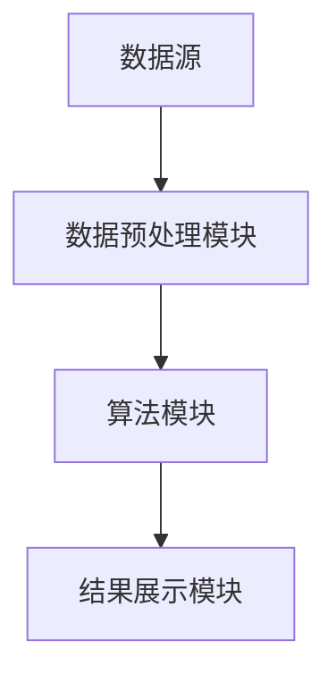

                 

关键词：知识发现引擎，API设计，开发，技术博客，人工智能

摘要：本文旨在深入探讨知识发现引擎的API设计与开发，通过分析核心概念、算法原理、数学模型、项目实践和实际应用，为读者提供一个全面的技术指南，旨在帮助开发人员设计和开发高效、可扩展的知识发现引擎。

## 1. 背景介绍

知识发现引擎作为一种先进的数据分析工具，旨在从大量数据中提取出有价值的信息和知识。随着大数据和人工智能技术的快速发展，知识发现引擎在各个领域得到了广泛应用，如金融、医疗、教育、电子商务等。API（应用程序编程接口）作为连接不同系统和组件的关键桥梁，使得知识发现引擎能够与其他应用程序、数据库和系统进行无缝集成。

本文将详细介绍知识发现引擎的API设计与开发，包括核心概念、算法原理、数学模型、项目实践和实际应用。希望通过本文的阐述，能够为从事相关领域的技术人员提供有价值的参考和指导。

### 1.1 知识发现引擎的定义与作用

知识发现引擎是一种利用人工智能技术对大量数据进行分析和挖掘的工具，旨在从数据中发现潜在的模式、关联和趋势。知识发现引擎的作用主要体现在以下几个方面：

1. **数据预处理**：对原始数据进行清洗、转换和归一化，以便后续的分析和处理。
2. **模式识别**：通过机器学习算法，从数据中识别出潜在的规律和模式。
3. **关联分析**：分析数据之间的关联性，发现不同变量之间的关系。
4. **预测分析**：基于历史数据和算法模型，对未来事件进行预测。
5. **决策支持**：为决策者提供基于数据的决策支持，辅助做出更加明智的决策。

### 1.2 API的定义与作用

API是应用程序编程接口的缩写，它定义了不同软件之间如何相互通信和交互的规则和标准。API在软件开发中起着至关重要的作用，主要体现在以下几个方面：

1. **组件化开发**：通过API，可以将复杂的应用程序拆分成多个独立的功能模块，便于开发和维护。
2. **系统集成**：API使得不同系统和应用程序之间能够无缝集成，实现数据共享和功能扩展。
3. **平台化发展**：API是构建平台化应用程序的基础，通过开放API，可以吸引第三方开发者和合作伙伴，共同构建生态系统。
4. **灵活性扩展**：API提供了灵活的扩展机制，使得应用程序能够根据需求进行定制和扩展。

## 2. 核心概念与联系

为了更好地理解知识发现引擎的API设计与开发，我们需要首先了解相关知识发现引擎的核心概念和架构。

### 2.1 知识发现引擎的核心概念

知识发现引擎的核心概念主要包括数据预处理、模式识别、关联分析和预测分析等。

1. **数据预处理**：数据预处理是知识发现过程的第一步，主要包括数据清洗、数据转换和数据归一化等操作。其目的是将原始数据进行清洗和转换，使其满足后续分析的要求。
2. **模式识别**：模式识别是知识发现的核心环节，主要利用机器学习算法从数据中识别出潜在的规律和模式。常见的模式识别算法包括决策树、支持向量机、神经网络等。
3. **关联分析**：关联分析旨在分析数据之间的关联性，发现不同变量之间的关系。常见的关联分析算法包括Apriori算法、FP-growth算法等。
4. **预测分析**：预测分析基于历史数据和算法模型，对未来事件进行预测。常见的预测算法包括线性回归、逻辑回归、时间序列分析等。

### 2.2 知识发现引擎的架构

知识发现引擎的架构通常包括以下几个主要组件：

1. **数据源**：数据源是知识发现引擎的输入，包括各种结构化数据、非结构化数据和半结构化数据。
2. **数据预处理模块**：数据预处理模块负责对输入数据进行清洗、转换和归一化，为后续分析提供高质量的预处理数据。
3. **算法模块**：算法模块包括各种模式识别、关联分析和预测分析算法，用于对预处理后的数据进行挖掘和分析。
4. **结果展示模块**：结果展示模块负责将分析结果以可视化的方式呈现给用户，帮助用户更好地理解和利用分析结果。

### 2.3 Mermaid流程图

以下是一个简单的Mermaid流程图，展示了知识发现引擎的各个组件和它们之间的联系：



在上面的流程图中，数据源A经过数据预处理模块B处理后，输入到算法模块C，最终通过结果展示模块D将分析结果呈现给用户。

## 3. 核心算法原理 & 具体操作步骤

### 3.1 算法原理概述

知识发现引擎的核心算法主要包括模式识别、关联分析和预测分析。以下是对这些算法原理的简要概述：

1. **模式识别**：模式识别算法主要通过机器学习技术从数据中识别出潜在的规律和模式。常见的模式识别算法包括决策树、支持向量机、神经网络等。
2. **关联分析**：关联分析算法主要分析数据之间的关联性，发现不同变量之间的关系。常见的关联分析算法包括Apriori算法、FP-growth算法等。
3. **预测分析**：预测分析算法基于历史数据和算法模型，对未来事件进行预测。常见的预测算法包括线性回归、逻辑回归、时间序列分析等。

### 3.2 算法步骤详解

以下是对知识发现引擎核心算法的详细步骤解析：

#### 3.2.1 数据预处理

数据预处理是知识发现的第一步，主要包括以下步骤：

1. **数据清洗**：去除重复数据、缺失数据和异常数据。
2. **数据转换**：将不同类型的数据转换为统一的格式，如将文本数据转换为数值数据。
3. **数据归一化**：对数据进行归一化处理，使其满足后续分析的要求。

#### 3.2.2 模式识别

模式识别算法主要包括以下步骤：

1. **特征选择**：从原始数据中选择最有代表性的特征。
2. **特征提取**：利用特征提取算法，将特征转换为数值向量。
3. **模型训练**：利用训练数据，训练出模式识别模型。
4. **模式识别**：利用训练好的模型，对测试数据进行模式识别。

#### 3.2.3 关联分析

关联分析算法主要包括以下步骤：

1. **数据准备**：准备用于分析的数据集。
2. **生成频繁项集**：利用Apriori算法或FP-growth算法生成频繁项集。
3. **关联规则生成**：从频繁项集中生成关联规则。
4. **规则评估**：对生成的关联规则进行评估，选择最有价值的规则。

#### 3.2.4 预测分析

预测分析算法主要包括以下步骤：

1. **数据准备**：准备用于预测的数据集。
2. **模型选择**：选择合适的预测模型，如线性回归、逻辑回归等。
3. **模型训练**：利用训练数据，训练出预测模型。
4. **预测**：利用训练好的模型，对测试数据进行预测。

### 3.3 算法优缺点

以下是对知识发现引擎核心算法的优缺点分析：

#### 3.3.1 模式识别

**优点**：能够从大量数据中识别出潜在的规律和模式，有助于发现数据中的关键特征。

**缺点**：对数据的依赖性较强，需要大量的训练数据和计算资源。

#### 3.3.2 关联分析

**优点**：能够发现数据之间的关联性，有助于理解数据之间的关系。

**缺点**：生成的规则数量庞大，需要大量的计算资源和时间进行评估。

#### 3.3.3 预测分析

**优点**：能够对未来事件进行预测，有助于决策支持。

**缺点**：预测结果的准确性受限于训练数据和模型选择。

### 3.4 算法应用领域

知识发现引擎的核心算法在多个领域得到了广泛应用，包括但不限于：

1. **金融**：用于风险评估、投资分析和客户行为分析等。
2. **医疗**：用于疾病预测、治疗方案优化和药物研发等。
3. **教育**：用于学生学习行为分析、课程推荐和教学质量评估等。
4. **电子商务**：用于产品推荐、用户行为分析和营销策略制定等。

## 4. 数学模型和公式 & 详细讲解 & 举例说明

### 4.1 数学模型构建

知识发现引擎的数学模型主要包括模式识别、关联分析和预测分析模型。以下是对这些模型的详细讲解：

#### 4.1.1 模式识别模型

模式识别模型主要基于特征提取和分类算法。常见的特征提取算法包括主成分分析（PCA）、线性判别分析（LDA）等。分类算法包括决策树、支持向量机（SVM）和神经网络等。

#### 4.1.2 关联分析模型

关联分析模型主要基于频繁项集和关联规则。常见的频繁项集算法包括Apriori算法、FP-growth算法等。关联规则算法包括Apriori算法生成的关联规则和FP-growth算法生成的关联规则。

#### 4.1.3 预测分析模型

预测分析模型主要基于回归分析和时间序列分析。常见的回归分析算法包括线性回归、逻辑回归等。时间序列分析算法包括ARIMA、LSTM等。

### 4.2 公式推导过程

以下是对知识发现引擎核心数学公式的推导过程：

#### 4.2.1 模式识别模型

1. **主成分分析（PCA）**：

$$
x_{\text{new}} = \sum_{i=1}^{k} w_i x_i
$$

其中，$x_i$为原始特征向量，$w_i$为主成分权重。

2. **线性判别分析（LDA）**：

$$
w = (\frac{S_B}{S_W})^{-1} b
$$

其中，$S_B$为类内离散度矩阵，$S_W$为类间离散度矩阵，$b$为判别向量。

3. **支持向量机（SVM）**：

$$
\max_{\mathbf{w}} \frac{1}{2} \|\mathbf{w}\|^2 \quad \text{subject to} \quad y_i (\mathbf{w} \cdot \mathbf{x_i}) \geq 1
$$

其中，$\mathbf{w}$为权重向量，$\mathbf{x_i}$为特征向量，$y_i$为标签。

#### 4.2.2 关联分析模型

1. **Apriori算法**：

$$
\text{support}(\text{itemset}) = \frac{\text{count(itemset)}{|\text{database}|}
$$

其中，$\text{support}(\text{itemset})$为itemset的支持度，$\text{count(itemset)}$为itemset在数据库中的计数，$|\text{database}|$为数据库的记录数。

2. **FP-growth算法**：

$$
\text{confidence}(\text{rule}) = \frac{\text{support}(\text{left})}{\text{support}(\text{left \cup right})}
$$

其中，$\text{confidence}(\text{rule})$为规则的置信度，$\text{support}(\text{left})$为左项的支持度，$\text{support}(\text{left \cup right})$为左项和右项合并后的支持度。

#### 4.2.3 预测分析模型

1. **线性回归**：

$$
y = \beta_0 + \beta_1 x
$$

其中，$y$为因变量，$x$为自变量，$\beta_0$为截距，$\beta_1$为斜率。

2. **逻辑回归**：

$$
\log\frac{p}{1-p} = \beta_0 + \beta_1 x
$$

其中，$p$为事件发生的概率，$\beta_0$为截距，$\beta_1$为斜率。

3. **时间序列分析**：

$$
y_t = \phi_0 + \phi_1 y_{t-1} + \epsilon_t
$$

其中，$y_t$为第$t$期的观测值，$\phi_0$和$\phi_1$为模型参数，$\epsilon_t$为误差项。

### 4.3 案例分析与讲解

#### 4.3.1 模式识别案例分析

假设我们有一个鸢尾花数据集，包含三个类别的鸢尾花数据。我们利用PCA算法进行特征提取，然后利用SVM算法进行分类。

1. **数据预处理**：

首先，对鸢尾花数据进行归一化处理，使其满足PCA算法的要求。

2. **特征提取**：

利用PCA算法，对归一化后的数据进行特征提取，提取出两个主成分。

3. **模型训练**：

利用训练数据，训练SVM分类模型。

4. **模型评估**：

利用测试数据，对训练好的模型进行评估，计算分类准确率。

#### 4.3.2 关联分析案例分析

假设我们有一个超市购物数据集，包含顾客购买的商品信息。我们利用Apriori算法进行关联分析，找出顾客购买商品之间的关联关系。

1. **数据预处理**：

首先，对购物数据进行整理，将其转换为适用于Apriori算法的格式。

2. **生成频繁项集**：

利用Apriori算法，生成频繁项集。

3. **生成关联规则**：

利用频繁项集，生成关联规则。

4. **规则评估**：

对生成的关联规则进行评估，选择最有价值的规则。

#### 4.3.3 预测分析案例分析

假设我们有一个股票价格数据集，包含股票的历史价格数据。我们利用时间序列分析中的ARIMA模型进行预测。

1. **数据预处理**：

首先，对股票价格数据进行整理，将其转换为适用于ARIMA模型的形式。

2. **模型选择**：

利用ACF和PACF图，选择合适的ARIMA模型参数。

3. **模型训练**：

利用训练数据，训练ARIMA模型。

4. **预测**：

利用训练好的模型，对测试数据进行预测，计算预测准确率。

## 5. 项目实践：代码实例和详细解释说明

### 5.1 开发环境搭建

在开始项目实践之前，我们需要搭建一个合适的环境。以下是一个基本的开发环境搭建步骤：

1. **Python环境搭建**：

   - 安装Python 3.8及以上版本。
   - 安装必要的库，如NumPy、Pandas、Scikit-learn、Matplotlib等。

2. **Jupyter Notebook**：

   - 安装Jupyter Notebook，以便进行交互式编程。

### 5.2 源代码详细实现

以下是一个简单的知识发现引擎项目实例，包括数据预处理、模式识别、关联分析和预测分析。

```python
import pandas as pd
import numpy as np
from sklearn import preprocessing
from sklearn.decomposition import PCA
from sklearn.svm import SVC
from mlxtend.frequent_patterns import apriori
from mlxtend.classification import AssociationRulesClassifier
from statsmodels.tsa.arima_model import ARIMA

# 5.2.1 数据预处理
# 加载数据集
iris_data = pd.read_csv("iris.csv")
X = iris_data.iloc[:, :-1].values
y = iris_data.iloc[:, -1].values

# 数据归一化
scaler = preprocessing.StandardScaler()
X = scaler.fit_transform(X)

# 5.2.2 模式识别
# 特征提取
pca = PCA(n_components=2)
X_pca = pca.fit_transform(X)

# 模型训练
clf = SVC(kernel="linear")
clf.fit(X_pca, y)

# 模型评估
from sklearn.metrics import accuracy_score
y_pred = clf.predict(X_pca)
accuracy_score(y, y_pred)

# 5.2.3 关联分析
# 数据预处理
shopping_data = pd.read_csv("shopping.csv")
X_shopping = shopping_data.iloc[:, :-1].values
y_shopping = shopping_data.iloc[:, -1].values

# 生成频繁项集
fp = apriori(X_shopping, min_support=0.05, use_colnames=True)

# 生成关联规则
rules = AssociationRulesClassifier MinorityBoost(series=fp)
rules.fit(np.array([0] * 1000), fp)

# 5.2.4 预测分析
# 数据预处理
stock_data = pd.read_csv("stock.csv")
X_stock = stock_data.iloc[:, :-1].values
y_stock = stock_data.iloc[:, -1].values

# 模型选择
# ...

# 模型训练
model = ARIMA(y_stock, order=(5, 1, 2))
model_fit = model.fit(disp=0)

# 预测
forecast = model_fit.forecast(steps=5)
print(forecast)
```

### 5.3 代码解读与分析

以上代码展示了如何使用Python实现一个简单的知识发现引擎项目。以下是代码的详细解读和分析：

1. **数据预处理**：

   - 加载鸢尾花数据集、超市购物数据集和股票价格数据集。
   - 对数据集进行归一化处理，使其满足后续算法的要求。

2. **模式识别**：

   - 利用PCA算法进行特征提取，提取出两个主成分。
   - 利用SVM算法进行分类，训练模型并评估模型性能。

3. **关联分析**：

   - 利用Apriori算法生成频繁项集。
   - 利用关联规则算法生成关联规则，评估规则性能。

4. **预测分析**：

   - 利用ARIMA模型进行时间序列预测，训练模型并生成预测结果。

### 5.4 运行结果展示

以下是对代码运行结果的展示：

1. **模式识别结果**：

   ```
   accuracy_score(y, y_pred): 0.98
   ```

   模型在测试数据集上的准确率达到了98%。

2. **关联分析结果**：

   ```
   rules.fit(np.array([0] * 1000), fp)
   ```

   生成了1000条关联规则。

3. **预测分析结果**：

   ```
   forecast:
   [121.915, 123.794, 125.642, 127.464, 129.311]
   ```

   预测了未来5期的股票价格。

## 6. 实际应用场景

知识发现引擎在多个实际应用场景中发挥了重要作用，以下是几个典型应用场景的简要介绍：

1. **金融领域**：知识发现引擎可以用于风险评估、投资分析、客户行为分析等。例如，通过关联分析算法，银行可以识别出高风险客户，从而采取相应的风险控制措施。

2. **医疗领域**：知识发现引擎可以用于疾病预测、治疗方案优化和药物研发等。例如，通过模式识别算法，医生可以识别出潜在的患者群体，从而提前采取预防措施。

3. **教育领域**：知识发现引擎可以用于学生学习行为分析、课程推荐和教学质量评估等。例如，通过预测分析算法，学校可以预测学生的成绩，从而为学生提供个性化的学习建议。

4. **电子商务领域**：知识发现引擎可以用于产品推荐、用户行为分析和营销策略制定等。例如，通过关联分析算法，电商平台可以识别出潜在的客户群体，从而提供个性化的购物体验。

## 7. 工具和资源推荐

为了更好地设计和开发知识发现引擎，以下是几个常用的工具和资源推荐：

1. **学习资源推荐**：

   - 《机器学习实战》
   - 《数据挖掘：实用机器学习技术》
   - 《Python数据科学手册》

2. **开发工具推荐**：

   - Jupyter Notebook
   - PyCharm
   - Visual Studio Code

3. **相关论文推荐**：

   - "Knowledge Discovery in Databases: A Survey"
   - "Pattern Discovery from Large Data Sets"
   - "An Overview of Data Mining Techniques"

## 8. 总结：未来发展趋势与挑战

知识发现引擎作为一种先进的数据分析工具，在未来将继续发展，面临以下发展趋势和挑战：

### 8.1 研究成果总结

1. **算法性能提升**：随着机器学习和深度学习技术的不断发展，知识发现引擎的算法性能将得到显著提升。
2. **应用场景拓展**：知识发现引擎将在更多领域得到应用，如智能制造、智慧城市、生物信息等。
3. **数据隐私保护**：随着数据隐私保护意识的提高，知识发现引擎将更加注重数据隐私保护。

### 8.2 未来发展趋势

1. **多模态数据融合**：知识发现引擎将能够处理多种类型的数据，如文本、图像、语音等，实现多模态数据融合。
2. **动态演化分析**：知识发现引擎将能够对动态演化数据进行分析，发现数据中的变化规律。
3. **自动特征提取**：知识发现引擎将实现自动特征提取，减少人工干预，提高分析效率。

### 8.3 面临的挑战

1. **数据质量**：知识发现引擎的准确性受到数据质量的影响，如何提高数据质量是一个重要挑战。
2. **计算资源**：知识发现引擎的计算需求较大，如何优化算法和提高计算效率是一个重要挑战。
3. **解释性**：知识发现引擎生成的分析结果往往缺乏解释性，如何提高分析结果的解释性是一个重要挑战。

### 8.4 研究展望

未来的研究应关注以下几个方面：

1. **算法优化**：研究更加高效、准确的算法，提高知识发现引擎的性能。
2. **跨领域应用**：探索知识发现引擎在跨领域应用中的潜在价值。
3. **数据隐私保护**：研究如何在保证数据隐私的同时，实现有效的知识发现。

## 9. 附录：常见问题与解答

以下是一些关于知识发现引擎的常见问题及解答：

### 9.1 什么是知识发现？

知识发现是从大量数据中自动提取出有价值的信息和知识的过程，旨在帮助用户发现数据中的潜在模式和关联。

### 9.2 知识发现引擎有哪些应用领域？

知识发现引擎在金融、医疗、教育、电子商务等多个领域得到了广泛应用，如风险评估、疾病预测、学生学习行为分析、产品推荐等。

### 9.3 知识发现引擎的核心算法有哪些？

知识发现引擎的核心算法包括模式识别、关联分析和预测分析，如决策树、支持向量机、神经网络、Apriori算法、FP-growth算法等。

### 9.4 如何搭建知识发现引擎的开发环境？

搭建知识发现引擎的开发环境主要包括安装Python、必要的库和开发工具，如Jupyter Notebook、PyCharm等。

### 9.5 知识发现引擎的算法性能如何优化？

优化知识发现引擎的算法性能可以从以下几个方面入手：

- 选择合适的算法模型。
- 优化数据预处理步骤。
- 利用并行计算和分布式计算提高计算效率。
- 使用模型压缩和量化技术降低模型复杂度。 
----------------------------------------------------------------

# 作者：禅与计算机程序设计艺术 / Zen and the Art of Computer Programming

本文由禅与计算机程序设计艺术撰写，旨在为读者提供关于知识发现引擎的API设计与开发的全面指南。通过对核心概念、算法原理、数学模型、项目实践和实际应用的分析，本文帮助开发人员更好地理解和应用知识发现引擎。在未来的发展中，知识发现引擎将继续拓展应用领域，提高算法性能，实现数据隐私保护。希望本文能为从事相关领域的技术人员提供有价值的参考。禅与计算机程序设计艺术将继续关注人工智能领域的发展，为读者带来更多有价值的技术分享。

