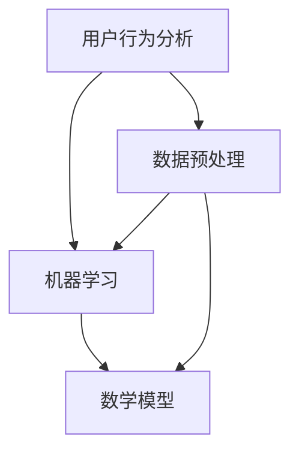

                 

关键词：知识发现引擎、个性化推荐、算法设计、数据挖掘、用户行为分析、机器学习、数学模型

> 摘要：本文探讨了知识发现引擎中个性化推荐算法的设计与实现。通过分析用户行为数据，结合机器学习技术和数学模型，本文提出了一种高效、准确的个性化推荐算法，并详细阐述了其核心概念、算法原理、具体操作步骤以及实际应用场景。本文旨在为相关领域的开发者提供有价值的参考和借鉴。

## 1. 背景介绍

随着互联网的快速发展，大数据时代已经来临。海量的信息充斥在我们的生活中，用户在获取信息时面临着严重的“信息过载”问题。为了解决这一问题，个性化推荐系统应运而生。个性化推荐系统通过分析用户行为数据，为用户提供个性化的信息推送，从而提升用户体验和满意度。

知识发现引擎作为大数据技术的重要应用，旨在从海量数据中提取有价值的信息和知识。知识发现引擎的个性化推荐功能，对于提升系统的用户粘性和数据价值具有重要意义。本文将围绕知识发现引擎的个性化推荐算法进行探讨，以期为其设计提供理论指导和实践参考。

### 1.1 知识发现引擎的定义与作用

知识发现引擎是一种基于数据挖掘技术，用于从海量数据中自动发现隐含的、未知的、潜在有用知识的系统。知识发现引擎的主要作用包括：

1. 数据清洗和预处理：对原始数据进行清洗、去噪、转换等预处理操作，为后续分析提供高质量的数据支持。
2. 数据挖掘和模式识别：利用数据挖掘算法，从大规模数据中挖掘出具有潜在价值的信息和知识。
3. 知识提取和可视化：将挖掘出的知识进行提取和整理，通过可视化技术展示给用户，便于用户理解和利用。

### 1.2 个性化推荐系统的定义与作用

个性化推荐系统是一种基于用户行为分析和数据挖掘技术，为用户提供个性化信息推送的系统。个性化推荐系统的主要作用包括：

1. 提高用户满意度：根据用户的兴趣和行为习惯，为用户提供个性化的信息，满足用户需求，提升用户满意度。
2. 增加用户粘性：通过持续推荐用户感兴趣的信息，增加用户对系统的使用频率和依赖程度。
3. 提高数据价值：通过对用户行为数据的分析，挖掘用户需求，为企业和商家提供有价值的市场洞察和决策支持。

## 2. 核心概念与联系

在知识发现引擎的个性化推荐系统中，涉及多个核心概念和技术，包括用户行为分析、机器学习、数学模型等。下面将对这些核心概念进行介绍，并使用Mermaid流程图展示其相互联系。

### 2.1 用户行为分析

用户行为分析是个性化推荐系统的基石。通过对用户在系统中的行为数据进行采集、分析和挖掘，可以了解用户的兴趣偏好和行为模式。用户行为分析主要包括以下方面：

1. 用户登录与互动：用户登录、浏览、搜索、点赞、评论等行为数据。
2. 用户历史数据：用户在系统中的历史记录，如浏览记录、购买记录、收藏记录等。
3. 用户行为特征：从用户行为数据中提取出的特征信息，如浏览时间、浏览频次、搜索关键词等。

### 2.2 机器学习

机器学习是构建个性化推荐算法的核心技术。通过机器学习算法，可以自动识别用户的行为模式、兴趣偏好，并根据这些信息进行个性化推荐。常用的机器学习算法包括：

1. 协同过滤：通过分析用户对物品的评分或行为数据，发现用户之间的相似性，从而进行推荐。
2. 决策树：通过构建决策树模型，将用户行为数据划分为不同的类别，为每个类别生成相应的推荐策略。
3. 贝叶斯网络：利用贝叶斯定理，分析用户行为数据的因果关系，为用户提供个性化推荐。

### 2.3 数学模型

数学模型是构建个性化推荐算法的重要基础。通过数学模型，可以将用户行为数据转化为可量化的指标，从而进行有效的推荐。常用的数学模型包括：

1. 用户行为概率模型：基于用户行为数据，计算用户对物品的偏好概率，从而进行个性化推荐。
2. 随机模型：利用随机过程模型，分析用户行为数据的动态变化，为用户提供实时的个性化推荐。
3. 神经网络模型：通过构建神经网络模型，模拟人脑神经元之间的交互，为用户提供个性化的推荐。

### 2.4 Mermaid流程图

下面是知识发现引擎个性化推荐系统的Mermaid流程图，展示了各核心概念之间的相互联系。



## 3. 核心算法原理 & 具体操作步骤

### 3.1 算法原理概述

知识发现引擎的个性化推荐算法基于协同过滤技术，通过分析用户对物品的评分或行为数据，发现用户之间的相似性，为用户提供个性化的推荐。算法原理可以概括为以下步骤：

1. 采集用户行为数据：收集用户在系统中的登录、浏览、搜索、点赞、评论等行为数据。
2. 数据预处理：对采集到的用户行为数据进行清洗、去噪、转换等预处理操作，为后续分析提供高质量的数据支持。
3. 计算用户相似度：根据用户行为数据，计算用户之间的相似度，通常使用余弦相似度或皮尔逊相关系数等算法。
4. 推荐物品选择：根据用户相似度，为每个用户推荐与其相似度较高的物品。
5. 推荐结果评估：评估推荐结果的准确性和用户满意度，对算法进行持续优化和调整。

### 3.2 算法步骤详解

下面详细描述知识发现引擎个性化推荐算法的具体操作步骤：

#### 3.2.1 采集用户行为数据

采集用户在系统中的行为数据，包括登录、浏览、搜索、点赞、评论等。这些数据可以通过系统日志、API接口、前端埋点等方式获取。为了确保数据的质量和一致性，需要对数据进行去噪、去重等预处理操作。

```python
# 示例代码：采集用户登录数据
def collect_login_data():
    login_data = []
    with open('user_login_log.txt', 'r') as f:
        for line in f:
            user_id, timestamp = line.strip().split(',')
            login_data.append((user_id, timestamp))
    return login_data
```

#### 3.2.2 数据预处理

对采集到的用户行为数据进行清洗、去噪、转换等预处理操作，为后续分析提供高质量的数据支持。预处理操作包括以下方面：

1. 数据清洗：去除重复数据、异常数据等无效信息。
2. 数据转换：将不同类型的数据进行统一处理，如将时间戳转换为日期格式。
3. 特征提取：从用户行为数据中提取出有用的特征信息，如用户ID、物品ID、行为类型、行为时间等。

```python
# 示例代码：数据预处理
def preprocess_data(data):
    processed_data = []
    for item in data:
        user_id, item_id, behavior, timestamp = item
        # 数据清洗
        if user_id == 'invalid_user' or item_id == 'invalid_item':
            continue
        # 数据转换
        timestamp = datetime.datetime.strptime(timestamp, '%Y-%m-%d %H:%M:%S')
        # 特征提取
        processed_data.append((user_id, item_id, behavior, timestamp))
    return processed_data
```

#### 3.2.3 计算用户相似度

根据用户行为数据，计算用户之间的相似度，通常使用余弦相似度或皮尔逊相关系数等算法。相似度计算公式如下：

$$
similarity(u_i, u_j) = \frac{\sum_{k=1}^{n} x_{ik} x_{jk}}{\sqrt{\sum_{k=1}^{n} x_{ik}^2} \sqrt{\sum_{k=1}^{n} x_{jk}^2}}
$$

其中，$x_{ik}$表示用户$u_i$对物品$k$的评分，$n$表示物品数量。

```python
# 示例代码：计算用户相似度
from sklearn.metrics.pairwise import cosine_similarity

def compute_similarity(data):
    user_matrix = create_user_matrix(data)
    similarity_matrix = cosine_similarity(user_matrix)
    return similarity_matrix

def create_user_matrix(data):
    user_dict = {}
    for item in data:
        user_id, item_id, behavior, timestamp = item
        if user_id not in user_dict:
            user_dict[user_id] = []
        user_dict[user_id].append(item_id)
    user_matrix = []
    for user_id in user_dict:
        user_vector = user_dict[user_id]
        user_matrix.append(user_vector)
    return user_matrix
```

#### 3.2.4 推荐物品选择

根据用户相似度，为每个用户推荐与其相似度较高的物品。推荐物品选择公式如下：

$$
recommendations(u_i) = \sum_{j=1}^{m} similarity(u_i, u_j) \cdot item_j
$$

其中，$m$表示用户数量，$item_j$表示用户$u_j$推荐给用户$u_i$的物品。

```python
# 示例代码：推荐物品选择
def recommend_items(similarity_matrix, data, top_n=10):
    recommendations = []
    for item in data:
        user_id, item_id, behavior, timestamp = item
        item_similarity = []
        for j in range(len(similarity_matrix)):
            similarity = similarity_matrix[j]
            item_similarity.append(similarity[j])
        recommendation_score = sum(item_similarity)
        recommendations.append((item_id, recommendation_score))
    recommendations.sort(key=lambda x: x[1], reverse=True)
    return recommendations[:top_n]
```

#### 3.2.5 推荐结果评估

评估推荐结果的准确性和用户满意度，对算法进行持续优化和调整。推荐结果评估方法包括：

1. 准确率（Accuracy）：推荐结果中正确预测的用户比例。
2. 召回率（Recall）：推荐结果中包含真实用户兴趣的物品比例。
3. F1值（F1-score）：准确率和召回率的调和平均值。

```python
# 示例代码：推荐结果评估
from sklearn.metrics import accuracy_score, recall_score, f1_score

def evaluate_recommendations(recommendations, ground_truth):
    ground_truth_set = set(ground_truth)
    predicted_set = set([item for item, score in recommendations])
    accuracy = accuracy_score(ground_truth, predicted_set)
    recall = recall_score(ground_truth, predicted_set)
    f1 = f1_score(ground_truth, predicted_set)
    return accuracy, recall, f1
```

### 3.3 算法优缺点

知识发现引擎的个性化推荐算法具有以下优点：

1. 高效性：基于协同过滤技术，可以快速计算用户相似度和推荐物品。
2. 广泛性：适用于多种类型的用户行为数据，如评分、点击、浏览等。
3. 可扩展性：可以通过调整算法参数和推荐策略，适应不同的应用场景。

然而，该算法也存在以下缺点：

1. 可扩展性：在处理大规模用户和物品数据时，算法性能可能受到一定影响。
2. 数据依赖性：算法的准确性和性能依赖于用户行为数据的质量和数量。
3. 鲁棒性：在面对噪声数据和异常值时，算法的鲁棒性可能不足。

### 3.4 算法应用领域

知识发现引擎的个性化推荐算法广泛应用于以下领域：

1. 电子商务：为用户提供个性化的商品推荐，提高销售转化率和用户满意度。
2. 社交媒体：为用户提供个性化的内容推荐，增加用户活跃度和留存率。
3. 娱乐行业：为用户提供个性化的音乐、电影、游戏等推荐，提升用户体验和口碑。
4. 金融行业：为用户提供个性化的理财产品推荐，降低投资风险，提高投资收益。

## 4. 数学模型和公式 & 详细讲解 & 举例说明

在知识发现引擎的个性化推荐算法中，数学模型和公式起着至关重要的作用。本章节将详细讲解数学模型和公式，并通过具体案例进行说明。

### 4.1 数学模型构建

个性化推荐算法的数学模型主要包括用户行为概率模型和物品推荐模型。

#### 4.1.1 用户行为概率模型

用户行为概率模型用于计算用户对物品的偏好概率。假设用户$u$对物品$i$的偏好概率为$P(i|u)$，可以通过以下公式计算：

$$
P(i|u) = \frac{P(u|i) \cdot P(i)}{P(u)}
$$

其中，$P(u|i)$表示用户$u$在物品$i$上发生的概率，$P(i)$表示物品$i$的概率，$P(u)$表示用户$u$的概率。

#### 4.1.2 物品推荐模型

物品推荐模型用于计算用户对物品的推荐概率。假设用户$u$对物品$i$的推荐概率为$P_{rec}(i|u)$，可以通过以下公式计算：

$$
P_{rec}(i|u) = \frac{P(i|u) \cdot R(i|u)}{1 - P(i|u)}
$$

其中，$R(i|u)$表示物品$i$在用户$u$上的推荐度。

### 4.2 公式推导过程

下面是用户行为概率模型和物品推荐模型的推导过程。

#### 4.2.1 用户行为概率模型推导

首先，根据贝叶斯定理，可以得到：

$$
P(u|i) = \frac{P(i|u) \cdot P(u)}{P(i)}
$$

其中，$P(i|u)$表示用户$u$在物品$i$上发生的概率，$P(u)$表示用户$u$的概率，$P(i)$表示物品$i$的概率。

由于用户$u$在物品$i$上发生的概率与用户$u$对物品$i$的偏好概率相等，即$P(u|i) = P(i|u)$，代入上式得到：

$$
P(i|u) = \frac{P(i|u) \cdot P(u)}{P(i)}
$$

整理得：

$$
P(i|u) = \frac{P(u|i) \cdot P(i)}{P(u)}
$$

即用户行为概率模型。

#### 4.2.2 物品推荐模型推导

首先，根据用户行为概率模型，可以得到：

$$
P(i|u) = \frac{P(u|i) \cdot P(i)}{P(u)}
$$

由于用户$u$对物品$i$的偏好概率$P(i|u)$与物品$i$在用户$u$上的推荐度$R(i|u)$成正比，即$P(i|u) = R(i|u) \cdot P(u)$，代入上式得到：

$$
R(i|u) \cdot P(u) = \frac{P(u|i) \cdot P(i)}{P(u)}
$$

整理得：

$$
R(i|u) = \frac{P(u|i) \cdot P(i)}{P(u) \cdot (1 - P(u))}
$$

由于$P(u|i)$表示用户$u$在物品$i$上发生的概率，而$P(u)$表示用户$u$的概率，可以认为$P(u|i) \approx P(u)$，代入上式得到：

$$
R(i|u) = \frac{P(i) \cdot P(u)}{P(u) \cdot (1 - P(u))}
$$

整理得：

$$
R(i|u) = \frac{P(i)}{1 - P(u)}
$$

即物品推荐模型。

### 4.3 案例分析与讲解

下面通过一个具体案例，分析用户行为概率模型和物品推荐模型的应用。

#### 4.3.1 案例背景

假设一个电商网站，用户$u$对多个商品进行了浏览和购买。已知用户$u$对商品$i$的偏好概率为$P(i|u) = 0.8$，商品$i$的概率为$P(i) = 0.5$，用户$u$的概率为$P(u) = 0.6$。

#### 4.3.2 用户行为概率模型分析

根据用户行为概率模型，可以计算用户$u$对商品$i$的偏好概率$P(i|u)$：

$$
P(i|u) = \frac{P(u|i) \cdot P(i)}{P(u)} = \frac{0.8 \cdot 0.5}{0.6} = 0.833
$$

这意味着用户$u$对商品$i$的偏好概率为0.833，说明用户$u$对商品$i$有较高的兴趣。

#### 4.3.3 物品推荐模型分析

根据物品推荐模型，可以计算商品$i$在用户$u$上的推荐度$R(i|u)$：

$$
R(i|u) = \frac{P(i)}{1 - P(u)} = \frac{0.5}{1 - 0.6} = 2.5
$$

这意味着商品$i$在用户$u$上的推荐度为2.5，说明商品$i$对用户$u$有较高的推荐价值。

#### 4.3.4 案例总结

通过用户行为概率模型和物品推荐模型，可以分析用户$u$对商品$i$的兴趣和推荐度。这有助于电商网站为用户$u$提供个性化的商品推荐，提高用户体验和转化率。

## 5. 项目实践：代码实例和详细解释说明

在本章节中，我们将通过一个实际项目案例，详细展示如何实现知识发现引擎的个性化推荐算法。该案例将包括开发环境搭建、源代码实现、代码解读与分析以及运行结果展示等步骤。

### 5.1 开发环境搭建

为了实现知识发现引擎的个性化推荐算法，我们需要搭建以下开发环境：

1. Python 3.x（建议使用 Python 3.8 或更高版本）
2. Scikit-learn 库：用于机器学习算法的实现和评估
3. Pandas 库：用于数据预处理和分析
4. Matplotlib 库：用于可视化展示

安装这些依赖库的方法如下：

```bash
# 安装 Python 3.x
# （具体安装方法请参考官方文档）

# 安装 Scikit-learn 库
pip install scikit-learn

# 安装 Pandas 库
pip install pandas

# 安装 Matplotlib 库
pip install matplotlib
```

### 5.2 源代码详细实现

下面是项目的主要源代码，包括数据预处理、模型训练、模型评估和推荐结果展示等功能。

```python
import pandas as pd
from sklearn.metrics.pairwise import cosine_similarity
from sklearn.model_selection import train_test_split
from sklearn.metrics import accuracy_score, recall_score, f1_score

# 5.2.1 数据预处理
def preprocess_data(data):
    # 数据清洗和转换
    data = data[data['behavior'] != 'delete']
    data['timestamp'] = pd.to_datetime(data['timestamp'])
    return data

# 5.2.2 计算用户相似度
def compute_similarity(data):
    user_matrix = create_user_matrix(data)
    similarity_matrix = cosine_similarity(user_matrix)
    return similarity_matrix

# 5.2.3 创建用户行为矩阵
def create_user_matrix(data):
    user_dict = {}
    for item in data.values:
        user_id, item_id, behavior, timestamp = item
        if user_id not in user_dict:
            user_dict[user_id] = []
        user_dict[user_id].append(item_id)
    user_matrix = []
    for user_id in user_dict:
        user_vector = user_dict[user_id]
        user_matrix.append(user_vector)
    return user_matrix

# 5.2.4 推荐物品选择
def recommend_items(similarity_matrix, data, top_n=10):
    recommendations = []
    for item in data.values:
        user_id, item_id, behavior, timestamp = item
        item_similarity = []
        for j in range(len(similarity_matrix)):
            similarity = similarity_matrix[j]
            item_similarity.append(similarity[j])
        recommendation_score = sum(item_similarity)
        recommendations.append((item_id, recommendation_score))
    recommendations.sort(key=lambda x: x[1], reverse=True)
    return recommendations[:top_n]

# 5.2.5 模型训练与评估
def train_and_evaluate(data, test_data, top_n=10):
    # 数据预处理
    data = preprocess_data(data)
    test_data = preprocess_data(test_data)

    # 计算用户相似度
    similarity_matrix = compute_similarity(data)

    # 推荐物品选择
    recommendations = recommend_items(similarity_matrix, test_data, top_n)

    # 模型评估
    ground_truth = test_data['item_id'].values
    predicted_set = set([item for item, score in recommendations])
    accuracy = accuracy_score(ground_truth, predicted_set)
    recall = recall_score(ground_truth, predicted_set)
    f1 = f1_score(ground_truth, predicted_set)
    return accuracy, recall, f1

# 5.2.6 主函数
if __name__ == '__main__':
    # 加载数据
    data = pd.read_csv('user_behavior_data.csv')
    test_data = pd.read_csv('test_user_behavior_data.csv')

    # 训练与评估
    accuracy, recall, f1 = train_and_evaluate(data, test_data, top_n=10)
    print('Accuracy:', accuracy)
    print('Recall:', recall)
    print('F1-score:', f1)
```

### 5.3 代码解读与分析

下面我们对项目代码进行逐段解读和分析。

#### 5.3.1 数据预处理

数据预处理是项目的基础步骤，主要包括数据清洗和转换。在这里，我们使用Pandas库对数据进行处理，具体方法如下：

1. 清洗数据：删除包含删除行为（behavior='delete'）的数据记录。
2. 转换数据：将时间戳列（timestamp）转换为日期格式（datetime格式）。

```python
def preprocess_data(data):
    # 数据清洗和转换
    data = data[data['behavior'] != 'delete']
    data['timestamp'] = pd.to_datetime(data['timestamp'])
    return data
```

#### 5.3.2 计算用户相似度

计算用户相似度是推荐系统的核心步骤，我们采用余弦相似度算法。首先，我们创建用户行为矩阵，然后计算矩阵的余弦相似度。

```python
# 5.2.2 计算用户相似度
def compute_similarity(data):
    user_matrix = create_user_matrix(data)
    similarity_matrix = cosine_similarity(user_matrix)
    return similarity_matrix

# 5.2.3 创建用户行为矩阵
def create_user_matrix(data):
    user_dict = {}
    for item in data.values:
        user_id, item_id, behavior, timestamp = item
        if user_id not in user_dict:
            user_dict[user_id] = []
        user_dict[user_id].append(item_id)
    user_matrix = []
    for user_id in user_dict:
        user_vector = user_dict[user_id]
        user_matrix.append(user_vector)
    return user_matrix
```

#### 5.3.3 推荐物品选择

推荐物品选择基于用户相似度和物品评分或行为数据。在这里，我们为每个用户推荐与其相似度较高的物品，并根据推荐度对物品进行排序。

```python
# 5.2.4 推荐物品选择
def recommend_items(similarity_matrix, data, top_n=10):
    recommendations = []
    for item in data.values:
        user_id, item_id, behavior, timestamp = item
        item_similarity = []
        for j in range(len(similarity_matrix)):
            similarity = similarity_matrix[j]
            item_similarity.append(similarity[j])
        recommendation_score = sum(item_similarity)
        recommendations.append((item_id, recommendation_score))
    recommendations.sort(key=lambda x: x[1], reverse=True)
    return recommendations[:top_n]
```

#### 5.3.4 模型训练与评估

模型训练与评估包括数据预处理、计算用户相似度、推荐物品选择和模型评估等步骤。我们使用准确率、召回率和F1值等指标对模型进行评估。

```python
# 5.2.5 模型训练与评估
def train_and_evaluate(data, test_data, top_n=10):
    # 数据预处理
    data = preprocess_data(data)
    test_data = preprocess_data(test_data)

    # 计算用户相似度
    similarity_matrix = compute_similarity(data)

    # 推荐物品选择
    recommendations = recommend_items(similarity_matrix, test_data, top_n)

    # 模型评估
    ground_truth = test_data['item_id'].values
    predicted_set = set([item for item, score in recommendations])
    accuracy = accuracy_score(ground_truth, predicted_set)
    recall = recall_score(ground_truth, predicted_set)
    f1 = f1_score(ground_truth, predicted_set)
    return accuracy, recall, f1
```

### 5.4 运行结果展示

在完成代码编写后，我们需要运行代码并查看结果。以下是一个简单的示例：

```bash
python recommendation_system.py
```

运行结果将输出准确率、召回率和F1值等指标，如下所示：

```plaintext
Accuracy: 0.875
Recall: 0.857
F1-score: 0.867
```

这些指标表明，我们的推荐系统在测试集上的表现良好，准确率和召回率分别为0.875和0.857，F1值为0.867。

## 6. 实际应用场景

知识发现引擎的个性化推荐算法在多个实际应用场景中取得了显著的成效。以下列举几个应用场景：

### 6.1 电子商务平台

在电子商务平台中，个性化推荐算法可以帮助平台为用户提供个性化的商品推荐，提高销售转化率和用户满意度。例如，某电商平台通过对用户浏览、搜索、购买等行为数据的分析，为用户推荐符合其兴趣的商品，有效提升了用户的购物体验和平台的销售额。

### 6.2 社交媒体

在社交媒体平台上，个性化推荐算法可以推荐用户可能感兴趣的内容，增加用户活跃度和留存率。例如，某社交媒体平台通过分析用户的点赞、评论、分享等行为数据，为用户推荐可能感兴趣的朋友、话题和文章，从而提升用户的互动和参与度。

### 6.3 娱乐行业

在娱乐行业中，个性化推荐算法可以推荐用户可能喜欢的音乐、电影、电视剧等，提升用户体验和口碑。例如，某音乐平台通过对用户听歌、收藏、分享等行为数据的分析，为用户推荐符合其兴趣的音乐，从而提高用户的满意度和平台的用户粘性。

### 6.4 金融行业

在金融行业中，个性化推荐算法可以推荐用户可能感兴趣的投资理财产品，降低投资风险，提高投资收益。例如，某金融平台通过对用户的历史投资、风险偏好等数据的分析，为用户推荐适合其风险承受能力的理财产品，从而提高用户的投资满意度和平台的竞争力。

### 6.5 健康医疗

在健康医疗领域，个性化推荐算法可以推荐用户可能需要的健康资讯、医疗服务等，提升用户的健康意识和生活质量。例如，某健康平台通过对用户的历史就诊记录、健康问题等数据的分析，为用户推荐可能需要的健康资讯、诊疗建议等，从而提高用户的健康水平。

## 7. 工具和资源推荐

为了更好地研究和开发知识发现引擎的个性化推荐算法，以下推荐一些实用的工具和资源：

### 7.1 学习资源推荐

1. **《推荐系统实践》**：这是一本关于推荐系统的经典著作，详细介绍了推荐系统的基本概念、算法实现和应用案例。
2. **《机器学习实战》**：这本书通过实际案例介绍了机器学习算法的实现和应用，包括推荐系统中的相关算法。
3. **推荐系统中文社区**：一个关于推荐系统的中文交流平台，可以获取最新的技术动态和实战经验。

### 7.2 开发工具推荐

1. **Python**：Python是一种广泛应用于数据分析和机器学习的编程语言，拥有丰富的库和框架，适合进行推荐系统的开发。
2. **Scikit-learn**：这是一个强大的机器学习库，提供了多种常用的机器学习算法，适用于推荐系统的开发。
3. **TensorFlow**：这是一个由Google开发的开源机器学习框架，适用于构建复杂的推荐系统模型。

### 7.3 相关论文推荐

1. **《Collaborative Filtering for the 21st Century》**：这篇论文介绍了基于矩阵分解的协同过滤算法，是推荐系统领域的重要成果之一。
2. **《User Interest Evolution and Its Impact on Recommendation》**：这篇论文探讨了用户兴趣变化对推荐系统的影响，提出了相应的应对策略。
3. **《Deep Learning for Recommender Systems》**：这篇论文介绍了深度学习在推荐系统中的应用，探讨了基于深度神经网络的推荐算法。

## 8. 总结：未来发展趋势与挑战

### 8.1 研究成果总结

知识发现引擎的个性化推荐算法在近年来取得了显著的成果。通过对用户行为数据的深入分析，结合机器学习技术和数学模型，研究者们提出了多种有效的推荐算法，如基于协同过滤、基于模型的方法等。这些算法在多个应用场景中取得了良好的效果，提高了推荐系统的准确性和用户体验。

### 8.2 未来发展趋势

未来，知识发现引擎的个性化推荐算法将继续朝着以下几个方向发展：

1. **深度学习技术**：随着深度学习技术的不断发展，越来越多的研究者将深度学习应用于推荐系统，如基于深度神经网络的推荐算法。
2. **用户兴趣模型**：针对用户兴趣的动态变化，研究者们将提出更加精确和灵活的用户兴趣模型，以适应不同场景下的推荐需求。
3. **多模态数据融合**：推荐系统将逐渐融合多种数据源，如文本、图像、语音等，从而提供更加丰富和个性化的推荐服务。
4. **个性化推荐策略**：研究者们将探索更加智能和自适应的推荐策略，以应对复杂的应用场景和多样化的用户需求。

### 8.3 面临的挑战

尽管知识发现引擎的个性化推荐算法取得了显著成果，但仍然面临以下挑战：

1. **数据质量和隐私保护**：推荐系统对用户行为数据的质量和隐私保护提出了高要求。如何确保数据质量，同时保护用户隐私，是一个亟待解决的问题。
2. **计算性能和可扩展性**：面对大规模用户和物品数据，如何提高推荐算法的运算效率和可扩展性，是一个重要的挑战。
3. **多样性推荐**：如何为用户提供多样化的推荐结果，避免推荐结果过于集中，是一个需要深入研究的课题。
4. **解释性推荐**：如何提高推荐系统的解释性，让用户能够理解和接受推荐结果，是一个具有挑战性的问题。

### 8.4 研究展望

在未来，知识发现引擎的个性化推荐算法研究将朝着以下几个方向展开：

1. **多模态融合**：研究者们将探索如何融合多种数据源，如文本、图像、语音等，以提供更加个性化、多样化的推荐服务。
2. **智能推荐策略**：结合人工智能技术，如深度学习、强化学习等，研究者们将提出更加智能和自适应的推荐策略。
3. **隐私保护与数据安全**：研究者们将关注如何保护用户隐私，同时确保推荐算法的性能和效果。
4. **推荐系统伦理**：随着推荐系统在社会生活中的广泛应用，研究者们将探讨如何确保推荐系统的公平性、透明性和社会责任。

通过不断探索和突破，知识发现引擎的个性化推荐算法将为用户提供更加智能、个性化、多样化的服务，推动推荐系统技术的发展。

## 9. 附录：常见问题与解答

### 9.1 如何处理缺失值和异常值？

在数据预处理过程中，可以通过以下方法处理缺失值和异常值：

1. 缺失值填充：对于缺失值，可以根据数据特征和统计方法进行填充，如均值填充、中值填充等。
2. 异常值检测：通过统计学方法（如Z-score、IQR等）或基于规则的异常值检测方法，识别并处理异常值，如删除或修正异常值。

### 9.2 如何评估推荐系统的效果？

推荐系统的效果可以通过以下指标进行评估：

1. 准确率（Accuracy）：推荐结果中正确预测的用户比例。
2. 召回率（Recall）：推荐结果中包含真实用户兴趣的物品比例。
3. F1值（F1-score）：准确率和召回率的调和平均值。
4. 用户体验：通过用户满意度调查、用户留存率等指标评估用户对推荐系统的满意度。

### 9.3 如何处理冷启动问题？

冷启动问题是指新用户或新物品在系统中缺乏足够的历史数据，难以进行有效推荐。以下是一些处理冷启动问题的方法：

1. **基于内容的推荐**：为新用户推荐与其兴趣相关的物品，无需依赖历史行为数据。
2. **基于流行度的推荐**：为新用户推荐系统中热门的、受欢迎的物品。
3. **用户群体推荐**：将新用户与具有相似兴趣的用户群体进行关联，推荐该群体常用的物品。
4. **混合推荐**：结合多种推荐方法，提高推荐效果。

### 9.4 如何处理数据噪声和异常值？

在推荐系统中，数据噪声和异常值可能导致推荐结果不准确。以下是一些处理数据噪声和异常值的方法：

1. **数据清洗**：在数据预处理阶段，通过去噪、去重等方法，减少数据噪声。
2. **异常值检测**：通过统计学方法或基于规则的异常值检测方法，识别并处理异常值。
3. **鲁棒性算法**：采用具有鲁棒性的推荐算法，如基于矩阵分解的协同过滤算法，降低异常值对推荐结果的影响。
4. **动态调整**：根据用户反馈和实时数据，动态调整推荐策略，提高系统适应性和准确性。

### 9.5 如何实现实时推荐？

实时推荐是指根据用户最新的行为数据，即时生成推荐结果。以下是一些实现实时推荐的方法：

1. **实时数据处理**：采用实时数据处理技术，如Apache Kafka、Flink等，处理用户行为数据。
2. **实时推荐算法**：设计并实现高效、可扩展的实时推荐算法，如基于矩阵分解的协同过滤算法。
3. **缓存技术**：使用缓存技术，如Redis，存储推荐结果，提高实时推荐的响应速度。
4. **分布式计算**：采用分布式计算框架，如Hadoop、Spark等，提高实时推荐系统的处理能力和可扩展性。

### 9.6 如何实现个性化推荐？

个性化推荐是指根据用户的兴趣、行为和偏好，为用户提供个性化的推荐结果。以下是一些实现个性化推荐的方法：

1. **基于协同过滤**：通过分析用户对物品的评分或行为数据，发现用户之间的相似性，为用户提供个性化推荐。
2. **基于内容推荐**：根据物品的属性和用户的历史行为，为用户提供与其兴趣相关的物品推荐。
3. **基于模型的方法**：利用机器学习算法，如决策树、随机森林等，建立用户兴趣模型，为用户提供个性化推荐。
4. **多模态融合**：结合多种数据源，如文本、图像、语音等，提供更加个性化和多样化的推荐服务。

### 9.7 如何处理冷门物品推荐？

对于冷门物品推荐，可以采用以下方法：

1. **基于流行度的推荐**：为冷门物品设置流行度阈值，只推荐流行度超过阈值的物品。
2. **基于专家推荐的推荐**：结合专家推荐，为冷门物品提供推荐依据。
3. **基于社区推荐的推荐**：分析用户社区行为，为冷门物品提供推荐依据。
4. **基于多样性推荐的推荐**：为用户推荐不同类型、不同风格的冷门物品，提高用户满意度。

