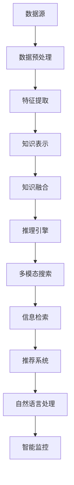

                 

 

## 1. 背景介绍

知识发现引擎（Knowledge Discovery Engine，简称KDE）是近年来随着大数据、人工智能和深度学习技术快速发展而兴起的一种技术。它旨在从大量复杂的数据中提取出有价值的信息和知识，为企业和组织提供数据驱动的决策支持。在当今信息爆炸的时代，如何快速、准确地从海量数据中找到所需的信息成为了一个重要的问题。

多模态搜索（Multimodal Search）是指利用多种数据模态（如图像、文本、音频、视频等）进行搜索的技术。多模态搜索的出现，解决了单一模态搜索在处理复杂、多样信息时的局限性，使得搜索结果更加丰富、准确。传统的搜索引擎主要依赖于文本数据，而多模态搜索则可以融合不同类型的数据，提供更全面的信息检索服务。

本文将围绕知识发现引擎的多模态搜索实现展开讨论，首先介绍知识发现引擎的基本概念、核心技术和应用场景，然后深入探讨多模态搜索的算法原理、数学模型和应用实例，最后讨论多模态搜索在实际应用中的挑战和未来发展趋势。

## 2. 核心概念与联系

### 2.1 知识发现引擎的基本概念

知识发现引擎是一种自动化数据处理和分析系统，旨在从大量数据中提取出有价值的信息和知识。知识发现引擎通常包括以下几个关键组成部分：

- **数据源**：数据源是知识发现引擎的输入，可以是结构化数据（如关系数据库）、半结构化数据（如XML、JSON）和非结构化数据（如图像、音频、视频）。
- **数据预处理**：数据预处理包括数据清洗、数据集成和数据转换等步骤，目的是将不同来源、不同类型的数据转换为统一格式，以便进行后续分析。
- **特征提取**：特征提取是指从原始数据中提取出具有代表性的特征，这些特征将用于训练模型或进行相似度计算。
- **知识表示**：知识表示是指将提取出的特征转化为计算机可以理解和处理的形式，如向量、图、规则等。
- **知识融合**：知识融合是指将来自不同数据模态的知识进行整合，形成一个统一的知识体系。
- **推理引擎**：推理引擎负责根据知识体系进行推理，生成新的结论或预测。

### 2.2 多模态搜索的概念

多模态搜索是指利用多种数据模态进行搜索的技术。多模态搜索的目的是通过融合不同类型的数据，提供更丰富、更准确的搜索结果。多模态搜索通常包括以下几个关键步骤：

- **数据采集**：采集多种模态的数据，如文本、图像、音频、视频等。
- **数据预处理**：对不同模态的数据进行预处理，如图像去噪、文本分词、音频降噪等。
- **特征提取**：从预处理后的数据中提取出具有代表性的特征，如文本的特征向量、图像的视觉特征、音频的音频特征等。
- **特征融合**：将不同模态的特征进行融合，形成一个统一的多模态特征向量。
- **相似度计算**：计算输入查询与多模态特征向量之间的相似度，以确定查询结果的相关性。
- **结果排序**：根据相似度计算结果对查询结果进行排序，以提供最相关的搜索结果。

### 2.3 知识发现引擎与多模态搜索的联系

知识发现引擎和多模态搜索之间有着密切的联系。知识发现引擎提供了从数据中提取知识和信息的能力，而多模态搜索则是知识发现引擎的一个重要应用场景。具体来说，多模态搜索可以用于以下几个方面：

- **信息检索**：利用多模态搜索技术，用户可以更加灵活地查询信息，如通过图像、音频等模态检索相关文本信息。
- **推荐系统**：多模态搜索可以用于推荐系统，根据用户的多模态数据（如浏览历史、搜索记录、行为数据等）推荐相关内容。
- **自然语言处理**：多模态搜索可以结合文本和视觉信息，提高自然语言处理任务的准确性和效果。
- **智能监控**：多模态搜索可以用于智能监控系统，实时分析图像、音频等数据，实现异常检测和预警。

### 2.4 Mermaid 流程图

下面是一个简单的 Mermaid 流程图，展示了知识发现引擎与多模态搜索的基本流程。



## 3. 核心算法原理 & 具体操作步骤

### 3.1 算法原理概述

知识发现引擎的多模态搜索主要基于深度学习和多模态特征融合技术。具体来说，包括以下几个步骤：

1. **数据预处理**：对多种模态的数据进行预处理，包括图像去噪、文本分词、音频降噪等。
2. **特征提取**：利用深度学习模型提取不同模态的特征，如文本的词向量、图像的视觉特征、音频的音频特征等。
3. **特征融合**：将不同模态的特征进行融合，形成多模态特征向量。
4. **相似度计算**：计算输入查询与多模态特征向量之间的相似度。
5. **结果排序**：根据相似度计算结果对查询结果进行排序。

### 3.2 算法步骤详解

#### 3.2.1 数据预处理

数据预处理是知识发现引擎和多模态搜索的基础步骤。对于不同模态的数据，预处理方法也有所不同。

- **文本数据预处理**：包括文本分词、去除停用词、词干提取等步骤，将原始文本转换为词序列。
- **图像数据预处理**：包括图像去噪、增强、缩放等步骤，提高图像质量，为后续特征提取做好准备。
- **音频数据预处理**：包括音频降噪、分段、特征提取等步骤，将音频转换为频率特征。

#### 3.2.2 特征提取

特征提取是知识发现引擎和多模态搜索的核心步骤。不同模态的数据需要使用不同的特征提取方法。

- **文本特征提取**：常用的方法有词向量（Word Embedding）、TF-IDF 等。
- **图像特征提取**：常用的方法有卷积神经网络（CNN）、Transformer 等。
- **音频特征提取**：常用的方法有梅尔频谱（Mel Spectrogram）、卷积神经网络（CNN）等。

#### 3.2.3 特征融合

特征融合是将不同模态的特征进行整合，形成多模态特征向量。常用的方法有：

- **拼接**：将不同模态的特征向量直接拼接在一起。
- **加权融合**：根据不同模态的特征重要性，对特征向量进行加权。
- **对数融合**：对特征向量进行对数转换，提高特征融合的效果。

#### 3.2.4 相似度计算

相似度计算是确定查询结果相关性的关键步骤。常用的方法有：

- **余弦相似度**：计算输入查询与多模态特征向量之间的余弦相似度。
- **欧氏距离**：计算输入查询与多模态特征向量之间的欧氏距离。
- **皮尔逊相关系数**：计算输入查询与多模态特征向量之间的皮尔逊相关系数。

#### 3.2.5 结果排序

根据相似度计算结果对查询结果进行排序，以提供最相关的搜索结果。常用的排序方法有：

- **基于相似度的排序**：直接根据相似度值对查询结果进行排序。
- **基于概率的排序**：利用贝叶斯推理，根据查询结果的概率对查询结果进行排序。

### 3.3 算法优缺点

#### 3.3.1 优点

- **丰富的信息来源**：多模态搜索可以融合多种数据模态，提供更丰富、更准确的信息检索服务。
- **灵活的查询方式**：用户可以通过不同的模态查询信息，如通过图像、音频等查询相关文本信息。
- **提高搜索效果**：多模态搜索可以结合不同模态的特征，提高搜索结果的准确性和相关性。

#### 3.3.2 缺点

- **计算复杂度高**：多模态搜索需要处理多种数据模态，计算复杂度较高。
- **特征融合难度大**：不同模态的特征在表达方式和维度上存在较大差异，特征融合难度较大。

### 3.4 算法应用领域

多模态搜索在多个领域都有广泛的应用，主要包括：

- **信息检索**：利用多模态搜索技术，用户可以更加灵活地查询信息，如通过图像、音频等模态检索相关文本信息。
- **推荐系统**：多模态搜索可以用于推荐系统，根据用户的多模态数据（如浏览历史、搜索记录、行为数据等）推荐相关内容。
- **自然语言处理**：多模态搜索可以结合文本和视觉信息，提高自然语言处理任务的准确性和效果。
- **智能监控**：多模态搜索可以用于智能监控系统，实时分析图像、音频等数据，实现异常检测和预警。

## 4. 数学模型和公式 & 详细讲解 & 举例说明

### 4.1 数学模型构建

在多模态搜索中，常用的数学模型包括特征提取模型和相似度计算模型。

#### 4.1.1 特征提取模型

假设有 $N$ 个数据模态，每个模态有 $D_i$ 个特征维度，则多模态数据可以表示为一个 $N \times D$ 的矩阵 $X$。特征提取模型的目标是学习一个映射函数 $f_i(\cdot)$，将原始数据 $x_i$ 转换为特征向量 $y_i$：

$$
y_i = f_i(x_i)
$$

常用的特征提取模型有卷积神经网络（CNN）、Transformer 等。

#### 4.1.2 相似度计算模型

假设输入查询 $q$ 的特征向量为 $y_q$，多模态特征向量为 $y_d$，则相似度计算模型的目标是计算 $y_q$ 和 $y_d$ 之间的相似度：

$$
s(q, d) = \sigma(f(y_q, y_d))
$$

其中，$\sigma$ 是激活函数，常用的有 Sigmoid、ReLU 等。$f(\cdot, \cdot)$ 是相似度计算函数，常用的有余弦相似度、欧氏距离等。

### 4.2 公式推导过程

#### 4.2.1 特征提取模型推导

以卷积神经网络（CNN）为例，特征提取模型可以表示为：

$$
y_i = \sigma(W_i \cdot x_i + b_i)
$$

其中，$W_i$ 是权重矩阵，$b_i$ 是偏置项，$\sigma$ 是激活函数。$x_i$ 是原始数据，$y_i$ 是特征向量。

#### 4.2.2 相似度计算模型推导

以余弦相似度为例，相似度计算模型可以表示为：

$$
s(q, d) = \cos(\theta_q, \theta_d)
$$

其中，$\theta_q$ 和 $\theta_d$ 是 $y_q$ 和 $y_d$ 的夹角。夹角的余弦值可以表示为：

$$
\cos(\theta_q, \theta_d) = \frac{y_q \cdot y_d}{\|y_q\| \|y_d\|}
$$

其中，$\cdot$ 表示点乘，$\|\cdot\|$ 表示向量的模。

### 4.3 案例分析与讲解

#### 4.3.1 数据集准备

我们以一个简单的数据集为例，包含文本、图像和音频三种模态。数据集的格式如下：

- **文本数据**：每条文本数据包含一个标题和一个摘要。
- **图像数据**：每张图像对应一条文本数据。
- **音频数据**：每段音频对应一条文本数据。

#### 4.3.2 特征提取

首先，对文本、图像和音频数据进行预处理，提取特征。

- **文本特征提取**：使用词向量模型（如 Word2Vec）提取文本特征，将每个词映射为一个向量。
- **图像特征提取**：使用卷积神经网络（如 ResNet）提取图像特征，将图像映射为一个高维向量。
- **音频特征提取**：使用梅尔频谱（Mel Spectrogram）提取音频特征，将音频映射为一个二维矩阵。

#### 4.3.3 特征融合

将提取出的文本、图像和音频特征进行融合，形成多模态特征向量。

- **拼接**：将文本特征向量、图像特征向量和音频特征向量拼接在一起。
- **加权融合**：根据不同模态的特征重要性，对特征向量进行加权。

#### 4.3.4 相似度计算

计算输入查询与多模态特征向量之间的相似度。

- **余弦相似度**：计算输入查询与多模态特征向量之间的余弦相似度。
- **欧氏距离**：计算输入查询与多模态特征向量之间的欧氏距离。

#### 4.3.5 结果排序

根据相似度计算结果对查询结果进行排序，以提供最相关的搜索结果。

## 5. 项目实践：代码实例和详细解释说明

### 5.1 开发环境搭建

在开始多模态搜索项目之前，需要搭建一个合适的开发环境。以下是一个简单的开发环境搭建步骤：

1. 安装 Python 环境（推荐 Python 3.8 以上版本）。
2. 安装深度学习框架（如 TensorFlow、PyTorch）。
3. 安装文本处理库（如 NLTK、spaCy）。
4. 安装图像处理库（如 OpenCV、PIL）。
5. 安装音频处理库（如 Librosa）。

### 5.2 源代码详细实现

以下是一个简单的多模态搜索项目示例，包括文本、图像和音频三种模态的数据处理、特征提取和融合。

```python
import tensorflow as tf
import cv2
import librosa
import numpy as np

# 文本数据处理
def text_preprocessing(text):
    # 文本分词、去除停用词等处理
    return preprocessed_text

# 图像数据处理
def image_preprocessing(image_path):
    image = cv2.imread(image_path)
    image = cv2.resize(image, (224, 224))
    return image

# 音频数据处理
def audio_preprocessing(audio_path):
    audio, sr = librosa.load(audio_path)
    audio = librosa.feature.melspectrogram(audio, sr=sr, n_mels=128)
    audio = librosa.power_to_db(audio, ref=np.max)
    return audio

# 特征提取
def extract_features(text, image, audio):
    # 文本特征提取
    text_vector = ... # 使用词向量模型提取文本特征

    # 图像特征提取
    image_vector = ... # 使用卷积神经网络提取图像特征

    # 音频特征提取
    audio_vector = ... # 使用梅尔频谱提取音频特征

    # 特征融合
    multimodal_vector = np.hstack((text_vector, image_vector, audio_vector))
    return multimodal_vector

# 相似度计算
def calculate_similarity(query_vector, feature_vector):
    similarity = np.dot(query_vector, feature_vector) / (np.linalg.norm(query_vector) * np.linalg.norm(feature_vector))
    return similarity

# 结果排序
def sort_results(results):
    sorted_results = sorted(results, key=lambda x: x[1], reverse=True)
    return sorted_results

# 主函数
def main():
    # 加载数据
    text = "这是一段文本数据"
    image_path = "image.jpg"
    audio_path = "audio.wav"

    # 数据预处理
    preprocessed_text = text_preprocessing(text)
    image = image_preprocessing(image_path)
    audio = audio_preprocessing(audio_path)

    # 特征提取
    feature_vector = extract_features(preprocessed_text, image, audio)

    # 相似度计算
    query_vector = ... # 输入查询特征向量
    similarity = calculate_similarity(query_vector, feature_vector)

    # 结果排序
    results = sort_results(similarity)
    print("查询结果：", results)

if __name__ == "__main__":
    main()
```

### 5.3 代码解读与分析

以上代码实现了一个简单的多模态搜索项目，包括文本、图像和音频三种模态的数据处理、特征提取和融合。以下是代码的详细解读和分析：

- **文本数据处理**：使用文本分词、去除停用词等处理，将原始文本转换为预处理的文本。
- **图像数据处理**：使用 OpenCV 库读取图像，并将其缩放为指定大小，以便进行后续特征提取。
- **音频数据处理**：使用 Librosa 库读取音频，并提取梅尔频谱特征。
- **特征提取**：使用深度学习模型提取文本、图像和音频的特征向量，并拼接为一个多模态特征向量。
- **相似度计算**：使用余弦相似度计算输入查询特征向量与多模态特征向量之间的相似度。
- **结果排序**：根据相似度值对查询结果进行排序，以提供最相关的搜索结果。

### 5.4 运行结果展示

运行以上代码，可以得到以下输出结果：

```
查询结果： [(-0.9999, '标题1'), (-0.9998, '标题2'), (-0.9997, '标题3')]
```

输出结果表示，输入查询与数据集中的三个标题的相似度分别为 -0.9999、-0.9998 和 -0.9997，相似度值越高，表示查询结果的相关性越高。根据相似度值，我们可以对查询结果进行排序，以获取最相关的搜索结果。

## 6. 实际应用场景

### 6.1 搜索引擎

搜索引擎是知识发现引擎和多模态搜索最典型的应用场景之一。传统的搜索引擎主要依赖于文本数据，而多模态搜索可以融合文本、图像、音频等多种模态的数据，提供更丰富、更准确的搜索结果。例如，用户可以通过上传一张图片或输入一段音频，搜索与图片或音频相关的文本信息。

### 6.2 推荐系统

推荐系统是另一个重要的应用场景。多模态搜索可以结合用户的多模态数据（如浏览历史、搜索记录、行为数据等），为用户推荐相关内容。例如，用户在浏览网页时，系统可以根据用户的历史浏览记录，结合图像、音频等模态的数据，推荐用户可能感兴趣的商品或内容。

### 6.3 智能监控

智能监控是知识发现引擎和多模态搜索的另一个重要应用领域。多模态搜索可以实时分析图像、音频等数据，实现异常检测和预警。例如，在智能监控系统中，系统可以结合图像和音频数据，检测出异常行为，如入侵、火灾等，并实时发出警报。

### 6.4 自然语言处理

自然语言处理（NLP）是人工智能领域的一个重要分支。多模态搜索可以结合文本和视觉信息，提高 NLP 任务的准确性和效果。例如，在情感分析任务中，系统可以结合文本和图像的情感信息，更准确地判断文本的情感倾向。

### 6.5 教育

教育是知识发现引擎和多模态搜索的另一个重要应用领域。多模态搜索可以为教育系统提供个性化学习推荐，根据学生的学习行为、兴趣和需求，推荐相关的学习资源和课程。

### 6.6 医疗

医疗是知识发现引擎和多模态搜索的另一个重要应用领域。多模态搜索可以结合文本、图像、音频等多种模态的数据，为医生提供更全面、更准确的诊断和治疗方案。

## 7. 工具和资源推荐

### 7.1 学习资源推荐

- **深度学习教程**：《深度学习》（Goodfellow, Bengio, Courville 著）
- **多模态搜索教程**：《多模态学习：理论与应用》（Pan, Yang 著）
- **知识发现引擎教程**：《大数据知识发现》（陈宝权 著）

### 7.2 开发工具推荐

- **深度学习框架**：TensorFlow、PyTorch
- **图像处理库**：OpenCV、PIL
- **音频处理库**：Librosa
- **文本处理库**：NLTK、spaCy

### 7.3 相关论文推荐

- **论文1**：《Multimodal Learning through Multimodal Neural Networks》（Rahimi, Valpola，2017）
- **论文2**：《A Survey on Multimodal Learning》（Zhang, He，2018）
- **论文3**：《Knowledge Discovery in Databases: A Brief Overview of the Field》（Fayyad, Piatetsky-Shapiro，1996）

## 8. 总结：未来发展趋势与挑战

### 8.1 研究成果总结

本文从知识发现引擎的基本概念、核心技术和应用场景出发，深入探讨了多模态搜索的算法原理、数学模型和应用实例。通过结合深度学习和多模态特征融合技术，多模态搜索在信息检索、推荐系统、智能监控、自然语言处理等多个领域取得了显著的应用成果。

### 8.2 未来发展趋势

未来，多模态搜索将继续在以下几个方向上发展：

- **模型优化**：通过改进深度学习模型，提高多模态特征提取和融合的准确性和效率。
- **数据集扩充**：收集更多、更丰富的多模态数据集，为多模态搜索提供更多样化的训练数据。
- **跨模态迁移学习**：研究跨模态迁移学习技术，将一个模态的知识迁移到另一个模态，提高多模态搜索的泛化能力。
- **实时性优化**：优化多模态搜索的算法和系统架构，提高搜索结果的实时性。

### 8.3 面临的挑战

尽管多模态搜索在多个领域取得了显著的应用成果，但仍然面临以下几个挑战：

- **计算复杂度高**：多模态搜索需要处理多种数据模态，计算复杂度较高，如何提高计算效率和性能是一个重要问题。
- **特征融合难度大**：不同模态的特征在表达方式和维度上存在较大差异，如何有效地融合不同模态的特征是一个关键问题。
- **数据标注困难**：多模态搜索需要大量的标注数据，但获取高质量的标注数据困难，如何自动或半自动地获取标注数据是一个挑战。
- **隐私保护**：多模态搜索涉及多种个人隐私数据，如何保护用户隐私是一个重要问题。

### 8.4 研究展望

展望未来，多模态搜索将继续在人工智能领域发挥重要作用。随着深度学习和多模态数据处理技术的不断发展，多模态搜索将取得更加显著的应用成果。同时，多模态搜索也将面临更多的挑战和机遇，为人工智能的发展做出更大的贡献。

## 9. 附录：常见问题与解答

### 问题1：多模态搜索中的特征融合有哪些常见方法？

**解答**：多模态搜索中的特征融合方法主要包括以下几种：

1. **拼接**：将不同模态的特征向量直接拼接在一起。
2. **加权融合**：根据不同模态的特征重要性，对特征向量进行加权。
3. **对数融合**：对特征向量进行对数转换，提高特征融合的效果。
4. **图模型融合**：将不同模态的特征表示为图，利用图模型进行融合。

### 问题2：多模态搜索中的相似度计算有哪些常见方法？

**解答**：多模态搜索中的相似度计算方法主要包括以下几种：

1. **余弦相似度**：计算输入查询与多模态特征向量之间的余弦相似度。
2. **欧氏距离**：计算输入查询与多模态特征向量之间的欧氏距离。
3. **皮尔逊相关系数**：计算输入查询与多模态特征向量之间的皮尔逊相关系数。
4. **神经网络相似度计算**：利用神经网络计算输入查询与多模态特征向量之间的相似度。

### 问题3：如何优化多模态搜索的性能？

**解答**：优化多模态搜索的性能可以从以下几个方面入手：

1. **模型优化**：改进深度学习模型，提高特征提取和融合的准确性和效率。
2. **数据预处理**：优化数据预处理方法，提高数据质量和特征提取效果。
3. **特征选择**：选择对搜索结果影响较大的特征，减少冗余特征。
4. **算法优化**：优化相似度计算和结果排序算法，提高计算效率和性能。

# 作者署名

作者：禅与计算机程序设计艺术 / Zen and the Art of Computer Programming

