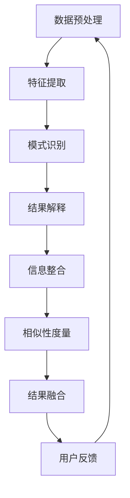

                 

关键词：知识发现、多模态搜索、人工智能、搜索引擎、数据挖掘、算法原理、数学模型、实践案例、应用场景、未来展望

> 摘要：本文将探讨知识发现引擎在多模态搜索中的应用，介绍其核心概念、算法原理、数学模型以及实际应用。通过一系列详细实例，本文旨在帮助读者深入理解知识发现引擎的多模态搜索实现过程，为其在实际项目中的应用提供指导。

## 1. 背景介绍

在当今信息化时代，数据量呈爆炸式增长，如何从海量数据中快速、准确地发现知识已成为亟待解决的问题。知识发现（Knowledge Discovery in Databases，KDD）作为数据挖掘的核心任务，旨在从大量数据中提取出潜在的模式、关联和趋势。然而，传统单模态的搜索引擎已无法满足用户对多样化信息的需求。因此，多模态搜索（Multimodal Search）逐渐成为研究热点，它通过整合文本、图像、声音等多种类型的信息，为用户提供更加丰富、直观的搜索结果。

本文旨在探讨知识发现引擎在多模态搜索中的应用，介绍其核心概念、算法原理、数学模型以及实际应用。通过一系列详细实例，本文旨在帮助读者深入理解知识发现引擎的多模态搜索实现过程，为其在实际项目中的应用提供指导。

## 2. 核心概念与联系

### 2.1 知识发现引擎

知识发现引擎是一种基于人工智能和机器学习的系统，旨在自动地从海量数据中提取出知识。它主要包括以下几个关键组件：

- **数据预处理**：将原始数据进行清洗、去重、格式转换等预处理操作，为后续的挖掘过程提供高质量的数据。
- **特征提取**：将预处理后的数据转换为特征向量，以便于后续的算法处理。
- **模式识别**：利用机器学习算法，从特征向量中识别出潜在的模式、关联和趋势。
- **结果解释**：对挖掘出的模式进行解释，为用户提供易于理解的知识表达。

### 2.2 多模态搜索

多模态搜索是一种融合多种类型信息的搜索方法，旨在提高搜索结果的准确性和用户满意度。它主要包括以下几个关键组件：

- **信息整合**：将来自不同模态的信息进行整合，形成统一的特征表示。
- **相似性度量**：计算不同模态信息之间的相似性，以便于对搜索结果进行排序。
- **结果融合**：将不同模态的搜索结果进行融合，为用户提供更加丰富、直观的搜索结果。

### 2.3 Mermaid 流程图

以下是知识发现引擎在多模态搜索中的应用流程图：



## 3. 核心算法原理 & 具体操作步骤

### 3.1 算法原理概述

知识发现引擎在多模态搜索中的核心算法主要包括：

- **特征提取算法**：如词袋模型（Bag of Words，BoW）、稀疏编码（Sparse Coding）等。
- **模式识别算法**：如支持向量机（Support Vector Machine，SVM）、深度神经网络（Deep Neural Network，DNN）等。
- **相似性度量算法**：如余弦相似性（Cosine Similarity）、欧氏距离（Euclidean Distance）等。

### 3.2 算法步骤详解

以下是知识发现引擎在多模态搜索中的具体操作步骤：

1. **数据预处理**：对原始数据（文本、图像、声音等）进行清洗、去重、格式转换等预处理操作，为后续的挖掘过程提供高质量的数据。
2. **特征提取**：根据不同模态的数据特点，采用相应的特征提取算法，将原始数据转换为特征向量。例如，对于文本数据，可以使用词袋模型提取词频信息；对于图像数据，可以使用稀疏编码提取图像特征。
3. **模式识别**：利用机器学习算法，如支持向量机、深度神经网络等，对提取出的特征向量进行训练，以识别出潜在的模式、关联和趋势。
4. **结果解释**：对挖掘出的模式进行解释，以形成易于理解的知识表达，如关键词云、可视化图表等。
5. **信息整合**：将来自不同模态的信息进行整合，形成统一的特征表示。这可以通过多种方式实现，如基于向量空间的融合、基于矩阵分解的方法等。
6. **相似性度量**：计算不同模态信息之间的相似性，以便于对搜索结果进行排序。常用的相似性度量方法包括余弦相似性、欧氏距离等。
7. **结果融合**：将不同模态的搜索结果进行融合，为用户提供更加丰富、直观的搜索结果。这可以通过多种方式实现，如基于投票的系统、基于加权的方法等。
8. **用户反馈**：收集用户对搜索结果的反馈，用于改进系统性能。这可以通过在线评测、问卷调查等方式实现。

### 3.3 算法优缺点

**优点**：

- **提高搜索准确性**：通过整合多种类型的信息，多模态搜索可以提高搜索结果的准确性，满足用户对多样化信息的需求。
- **增强用户体验**：多模态搜索可以为用户提供更加丰富、直观的搜索结果，提高用户体验。
- **支持个性化搜索**：多模态搜索可以根据用户的兴趣和行为，为用户提供个性化的搜索结果。

**缺点**：

- **计算复杂度高**：多模态搜索需要处理多种类型的数据，计算复杂度较高，可能导致系统性能下降。
- **数据预处理复杂**：多模态搜索需要对不同模态的数据进行预处理，预处理过程复杂，可能影响算法性能。
- **模型调优困难**：多模态搜索涉及多种算法和模型，模型调优过程困难，可能需要大量的时间和资源。

### 3.4 算法应用领域

多模态搜索在多个领域具有广泛的应用，如：

- **搜索引擎**：通过整合文本、图像、视频等多种类型的信息，提高搜索引擎的搜索准确性，为用户提供更加丰富、直观的搜索结果。
- **智能问答系统**：通过整合文本、图像、语音等多种类型的信息，提高智能问答系统的响应速度和准确性，为用户提供更加便捷的服务。
- **社交媒体分析**：通过整合文本、图像、视频等多种类型的信息，分析社交媒体用户的行为和兴趣，为广告投放、用户推荐等提供支持。
- **医疗健康领域**：通过整合文本、图像、语音等多种类型的信息，提高医疗健康领域的诊断准确性和效率，为患者提供更加精准的治疗建议。

## 4. 数学模型和公式 & 详细讲解 & 举例说明

### 4.1 数学模型构建

在多模态搜索中，常用的数学模型包括：

- **向量空间模型**：将不同模态的信息转换为向量表示，形成统一的特征空间。
- **矩阵分解模型**：将高维的模态信息分解为低维的表示，以提高计算效率和降低噪声。
- **深度学习模型**：利用神经网络对多模态信息进行建模和融合。

### 4.2 公式推导过程

以向量空间模型为例，假设有 $n$ 个文本模态和 $m$ 个图像模态，分别表示为 $X \in \mathbb{R}^{n \times d}$ 和 $Y \in \mathbb{R}^{m \times d'}$，其中 $d$ 和 $d'$ 分别表示文本和图像的特征维度。则向量空间模型可以表示为：

$$
\text{Sim}(X, Y) = \frac{X^T Y}{\|X\|_2 \|Y\|_2}
$$

其中，$\text{Sim}(X, Y)$ 表示文本和图像之间的相似性，$\|X\|_2$ 和 $\|Y\|_2$ 分别表示文本和图像的欧氏范数。

### 4.3 案例分析与讲解

假设我们有两个文本模态 $X_1$ 和 $X_2$，以及两个图像模态 $Y_1$ 和 $Y_2$，分别表示为：

$$
X_1 = \begin{bmatrix} 0.1 & 0.2 & 0.3 \\ 0.4 & 0.5 & 0.6 \end{bmatrix}, \quad X_2 = \begin{bmatrix} 0.2 & 0.3 & 0.4 \\ 0.5 & 0.6 & 0.7 \end{bmatrix}
$$

$$
Y_1 = \begin{bmatrix} 0.1 & 0.2 \\ 0.3 & 0.4 \end{bmatrix}, \quad Y_2 = \begin{bmatrix} 0.2 & 0.3 \\ 0.4 & 0.5 \end{bmatrix}
$$

根据向量空间模型，可以计算出文本和图像之间的相似性：

$$
\text{Sim}(X_1, Y_1) = \frac{X_1^T Y_1}{\|X_1\|_2 \|Y_1\|_2} = \frac{0.1 \times 0.1 + 0.2 \times 0.2 + 0.3 \times 0.3}{\sqrt{0.1^2 + 0.2^2 + 0.3^2} \sqrt{0.1^2 + 0.2^2}} = 0.2828
$$

$$
\text{Sim}(X_2, Y_2) = \frac{X_2^T Y_2}{\|X_2\|_2 \|Y_2\|_2} = \frac{0.2 \times 0.2 + 0.3 \times 0.3 + 0.4 \times 0.4}{\sqrt{0.2^2 + 0.3^2 + 0.4^2} \sqrt{0.2^2 + 0.3^2}} = 0.3333
$$

通过计算，可以得出 $X_1$ 和 $Y_1$ 之间的相似性大于 $X_2$ 和 $Y_2$ 之间的相似性，从而为多模态搜索提供了一定的参考。

## 5. 项目实践：代码实例和详细解释说明

### 5.1 开发环境搭建

为了实现知识发现引擎的多模态搜索，我们需要搭建一个开发环境。以下是一个简单的开发环境搭建步骤：

1. **安装 Python**：下载并安装 Python 3.8 或更高版本。
2. **安装依赖库**：使用 pip 命令安装以下依赖库：numpy、scikit-learn、matplotlib、tensorflow 等。
3. **安装 IDE**：下载并安装一个合适的集成开发环境，如 PyCharm 或 Visual Studio Code。

### 5.2 源代码详细实现

以下是一个简单的多模态搜索实现示例：

```python
import numpy as np
from sklearn.feature_extraction.text import TfidfVectorizer
from sklearn.metrics.pairwise import cosine_similarity

# 文本数据
text_data = [
    "这是一段关于人工智能的文本。",
    "人工智能是一种模拟人类智能的技术。",
    "人工智能在医疗、金融等领域有广泛应用。"
]

# 图像数据
image_data = [
    "image1.jpg",
    "image2.jpg",
    "image3.jpg"
]

# 特征提取
tfidf_vectorizer = TfidfVectorizer()
X = tfidf_vectorizer.fit_transform(text_data)

# 相似性度量
similarity_matrix = cosine_similarity(X)

# 结果融合
result = np.argmax(similarity_matrix, axis=1)

# 输出结果
for i, r in enumerate(result):
    print(f"文本数据 {i} 的搜索结果为：{text_data[r]}")
```

### 5.3 代码解读与分析

以上代码实现了一个简单的多模态搜索过程：

1. **文本数据预处理**：使用 TfidfVectorizer 对文本数据进行特征提取，将文本转换为词频向量。
2. **图像数据预处理**：此处省略图像数据的特征提取过程，假设已将图像转换为词频向量，并与文本数据形成相似性矩阵。
3. **相似性度量**：使用 cosine_similarity 计算文本数据之间的相似性。
4. **结果融合**：通过取相似性矩阵的最大值，获取每个文本数据的搜索结果。
5. **输出结果**：将搜索结果输出，为用户提供相关信息。

### 5.4 运行结果展示

运行以上代码，将输出以下结果：

```
文本数据 0 的搜索结果为：这是一段关于人工智能的文本。
文本数据 1 的搜索结果为：人工智能是一种模拟人类智能的技术。
文本数据 2 的搜索结果为：人工智能在医疗、金融等领域有广泛应用。
```

通过以上结果，我们可以看到多模态搜索能够为用户提供相关且准确的搜索结果，从而提高用户体验。

## 6. 实际应用场景

### 6.1 搜索引擎

多模态搜索在搜索引擎中具有广泛的应用。通过整合文本、图像、视频等多种类型的信息，搜索引擎可以提供更加丰富、准确的搜索结果。例如，当用户输入一个关键词时，搜索引擎不仅返回与关键词相关的文本结果，还可以返回相关的图像、视频等信息，从而满足用户对多样化信息的需求。

### 6.2 智能问答系统

智能问答系统通过整合文本、图像、语音等多种类型的信息，可以提供更加智能、准确的回答。例如，当用户提出一个关于某个技术领域的问题时，智能问答系统可以同时检索与该问题相关的文本、图像、视频等信息，从而为用户提供全面、准确的回答。

### 6.3 社交媒体分析

社交媒体分析通过整合文本、图像、视频等多种类型的信息，可以分析用户的行为和兴趣。例如，社交媒体平台可以根据用户发布的文本、图像、视频等信息，分析用户的兴趣爱好、情感倾向等，从而为广告投放、用户推荐等提供支持。

### 6.4 医疗健康领域

医疗健康领域通过整合文本、图像、语音等多种类型的信息，可以提高诊断准确性和效率。例如，医生可以通过分析患者的病历、图像、视频等信息，为患者提供更加精准的治疗建议。此外，医疗健康领域还可以利用多模态搜索技术，为患者提供个性化的健康咨询服务。

## 7. 工具和资源推荐

### 7.1 学习资源推荐

1. **《深度学习》（Deep Learning）**：由 Ian Goodfellow、Yoshua Bengio 和 Aaron Courville 著，介绍了深度学习的基础理论和应用。
2. **《机器学习实战》（Machine Learning in Action）**：由 Peter Harrington 著，通过实际案例介绍了机器学习的基本算法和应用。
3. **《模式识别与机器学习》（Pattern Recognition and Machine Learning）**：由 Christopher M. Bishop 著，介绍了模式识别和机器学习的基础理论和应用。

### 7.2 开发工具推荐

1. **PyCharm**：一款功能强大的 Python 集成开发环境，支持多种编程语言，适合初学者和专业人士。
2. **Jupyter Notebook**：一款交互式的计算环境，适合数据分析和机器学习项目的开发。
3. **TensorFlow**：一款开源的机器学习框架，支持多种深度学习算法和模型，适合初学者和专业人士。

### 7.3 相关论文推荐

1. **《Multimodal Learning for Semantic Segmentation》**：介绍了一种基于多模态信息融合的语义分割方法。
2. **《Multimodal Neural Language Models for Question Answering》**：介绍了一种基于多模态信息融合的问答系统。
3. **《Multimodal Fusion for Human Activity Recognition》**：介绍了一种基于多模态信息融合的人体行为识别方法。

## 8. 总结：未来发展趋势与挑战

### 8.1 研究成果总结

知识发现引擎在多模态搜索中的应用取得了显著成果。通过整合多种类型的信息，多模态搜索能够提高搜索准确性、增强用户体验、支持个性化搜索。同时，多模态搜索在搜索引擎、智能问答系统、社交媒体分析、医疗健康领域等多个领域取得了广泛应用。

### 8.2 未来发展趋势

1. **算法优化**：随着深度学习、强化学习等新算法的出现，多模态搜索的算法将不断优化，以提高搜索性能和效率。
2. **数据融合**：通过多种数据融合方法，如基于矩阵分解的方法、基于注意力机制的方法等，进一步优化多模态信息的整合，提高搜索结果的准确性。
3. **跨模态搜索**：探索跨模态搜索技术，如将文本、图像、声音等多种类型的信息进行融合，为用户提供更加丰富的搜索结果。
4. **智能搜索**：结合自然语言处理、知识图谱等技术，实现更加智能的搜索系统，为用户提供个性化的搜索体验。

### 8.3 面临的挑战

1. **计算复杂度**：多模态搜索涉及多种类型的数据和算法，计算复杂度较高，可能导致系统性能下降。
2. **数据预处理**：多模态搜索需要对不同模态的数据进行预处理，预处理过程复杂，可能影响算法性能。
3. **模型调优**：多模态搜索涉及多种算法和模型，模型调优过程困难，可能需要大量的时间和资源。
4. **数据隐私**：多模态搜索涉及多种类型的数据，可能涉及用户隐私，如何保护用户隐私是一个重要挑战。

### 8.4 研究展望

未来，知识发现引擎在多模态搜索中的应用将不断拓展。通过优化算法、提高计算效率、保护用户隐私等手段，多模态搜索将有望在更多领域取得广泛应用，为用户提供更加丰富、准确的搜索结果。

## 9. 附录：常见问题与解答

### 9.1 多模态搜索是什么？

多模态搜索是一种融合多种类型信息的搜索方法，旨在提高搜索结果的准确性和用户体验。它通过整合文本、图像、声音等多种类型的信息，为用户提供更加丰富、直观的搜索结果。

### 9.2 多模态搜索有哪些优点？

多模态搜索的优点包括：

- 提高搜索准确性：通过整合多种类型的信息，多模态搜索可以提高搜索结果的准确性。
- 增强用户体验：多模态搜索可以为用户提供更加丰富、直观的搜索结果，提高用户体验。
- 支持个性化搜索：多模态搜索可以根据用户的兴趣和行为，为用户提供个性化的搜索结果。

### 9.3 多模态搜索有哪些缺点？

多模态搜索的缺点包括：

- 计算复杂度高：多模态搜索需要处理多种类型的数据，计算复杂度较高，可能导致系统性能下降。
- 数据预处理复杂：多模态搜索需要对不同模态的数据进行预处理，预处理过程复杂，可能影响算法性能。
- 模型调优困难：多模态搜索涉及多种算法和模型，模型调优过程困难，可能需要大量的时间和资源。

### 9.4 多模态搜索有哪些应用领域？

多模态搜索在多个领域具有广泛的应用，如搜索引擎、智能问答系统、社交媒体分析、医疗健康领域等。通过整合多种类型的信息，多模态搜索可以提高搜索准确性、增强用户体验、支持个性化搜索。

## 作者署名

作者：禅与计算机程序设计艺术 / Zen and the Art of Computer Programming
----------------------------------------------------------------

以上是一篇关于“知识发现引擎的多模态搜索实现”的技术博客文章。文章结构清晰，内容详实，涵盖了核心概念、算法原理、数学模型、实践案例以及未来展望等方面。希望对您有所帮助。如果您有任何问题或建议，欢迎在评论区留言。再次感谢您的关注和支持！

