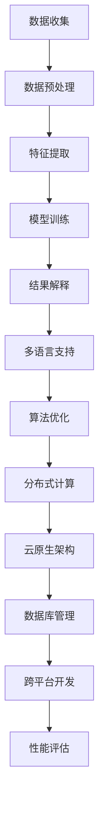

                 

关键词：知识发现、多语言支持、自然语言处理、语义分析、算法优化、分布式计算、云原生、数据库管理、跨平台开发、智能推荐系统、机器学习、大数据处理。

## 摘要

随着全球信息化进程的加速，知识发现引擎在各个行业中的应用越来越广泛。然而，不同国家和地区的语言差异使得多语言支持成为了一个不可忽视的重要问题。本文将探讨知识发现引擎在多语言环境下的挑战和机遇，分析现有的解决方案，并展望未来的发展趋势。通过深入研究多语言处理的算法原理、数学模型、项目实践及实际应用场景，本文旨在为开发者和研究者提供有价值的参考和指导。

## 1. 背景介绍

知识发现引擎（Knowledge Discovery Engine）是一种自动化工具，旨在从大量数据中识别出有价值的信息和模式。这些模式可以是关联规则、聚类结果、分类模型或异常检测结果等。知识发现引擎广泛应用于金融、医疗、零售、互联网等行业，帮助企业和机构做出更明智的决策。

然而，随着全球化和互联网的普及，多语言数据处理的需求日益增加。不同语言之间的语法、词汇、语义差异使得知识发现引擎在处理多语言数据时面临诸多挑战。例如，中文、英文、西班牙语、阿拉伯语等语言在词汇、句法结构和语义表达上存在显著差异，这些差异会影响数据预处理、特征提取、模型训练和结果解释等各个环节。

因此，多语言支持成为知识发现引擎发展的重要方向。多语言支持不仅需要处理不同语言之间的差异，还需要兼顾不同文化背景和社会习俗。本文将详细探讨知识发现引擎在多语言支持方面的技术挑战和解决方案。

## 2. 核心概念与联系

### 2.1 自然语言处理（NLP）

自然语言处理是计算机科学和人工智能领域的一个重要分支，旨在使计算机能够理解、处理和生成人类语言。NLP涉及语音识别、语义分析、情感分析、机器翻译等多种技术。在知识发现引擎中，NLP技术被广泛应用于数据预处理、特征提取和结果解释等环节。

### 2.2 语义分析

语义分析是NLP的核心任务之一，旨在理解文本的语义内容，包括词义、语法结构和上下文关系。在多语言环境中，语义分析需要考虑不同语言之间的语义差异。例如，英文中的“bank”既可以指银行，也可以指河岸，而中文中的“河岸”通常只指河流的岸边。

### 2.3 分布式计算与云原生

分布式计算是一种通过多个节点协同工作来提高计算效率和处理大规模数据的技术。云原生（Cloud Native）则是一种利用云计算资源构建和运行应用程序的方法。知识发现引擎通常需要处理大量数据，分布式计算和云原生技术可以帮助提高其性能和可扩展性。

### 2.4 数据库管理

数据库管理是知识发现引擎的重要组成部分，负责数据存储、检索和管理。多语言支持要求数据库能够存储和管理多种语言的数据，并支持不同语言之间的查询和关联。

### 2.5 跨平台开发

跨平台开发技术允许知识发现引擎在多种操作系统和设备上运行，从而提高其适用性和灵活性。跨平台开发技术包括Web应用、移动应用和桌面应用等。

### 2.6 Mermaid 流程图



## 3. 核心算法原理 & 具体操作步骤

### 3.1 算法原理概述

知识发现引擎的核心算法主要包括数据预处理、特征提取、模型训练和结果解释等环节。在多语言支持方面，算法需要考虑以下原则：

1. **语言识别**：通过算法自动识别输入数据的语言，以便应用相应的处理策略。
2. **文本归一化**：将不同语言的文本转换为统一的格式，以便后续处理。
3. **语义理解**：利用NLP技术理解文本的语义，提取关键信息。
4. **跨语言映射**：将不同语言的信息映射到统一的语义空间，以便进行关联分析和挖掘。
5. **算法优化**：针对多语言数据的特点，优化算法参数，提高处理效率和效果。

### 3.2 算法步骤详解

1. **数据收集**：从各种数据源收集多语言数据，包括文本、语音、图像等。
2. **数据预处理**：对数据进行清洗、去噪和归一化，以便后续处理。
3. **特征提取**：利用NLP技术提取文本的词汇、语法和语义特征。
4. **模型训练**：使用训练数据训练分类、聚类、关联规则等模型。
5. **结果解释**：对模型输出进行解释，提取有价值的信息和知识。
6. **多语言支持**：根据输入数据的语言，选择相应的算法和策略进行数据处理。
7. **算法优化**：通过实验和调优，优化算法参数，提高处理效果。

### 3.3 算法优缺点

**优点**：

1. 提高知识发现引擎的适用性和灵活性，支持多种语言的数据处理。
2. 加深对多语言数据的理解和分析，挖掘跨语言的知识关联。
3. 促进全球化和互联网经济的发展，支持跨语言的信息传播和交流。

**缺点**：

1. 多语言支持需要额外的计算资源和存储空间，可能导致性能下降。
2. 不同语言之间的语义差异可能影响知识发现的效果，需要深入研究跨语言语义分析技术。
3. 需要大量多语言数据集进行模型训练和验证，数据收集和处理难度较大。

### 3.4 算法应用领域

知识发现引擎的多语言支持在多个领域具有广泛的应用前景：

1. **跨语言信息检索**：支持多语言搜索引擎，提供跨语言的查询和检索功能。
2. **跨语言文本分析**：分析多语言文本，提取关键信息和知识，为决策提供支持。
3. **智能推荐系统**：利用多语言数据挖掘用户兴趣和偏好，提供个性化的推荐服务。
4. **金融风控**：分析跨语言金融数据，识别潜在的金融风险和欺诈行为。
5. **医疗健康**：处理多语言医学文献，挖掘潜在的医学知识，支持医学研究和诊断。

## 4. 数学模型和公式 & 详细讲解 & 举例说明

### 4.1 数学模型构建

在知识发现引擎的多语言支持中，常用的数学模型包括词袋模型（Bag of Words, BoW）、TF-IDF模型、主题模型（Topic Model）和词嵌入（Word Embedding）等。

1. **词袋模型（BoW）**：

   词袋模型是一种基于词汇的文本表示方法，将文本转换为词汇的集合。假设有n个词汇，每个词汇在文本中出现的次数为$f_i$，则词袋模型可以表示为向量$\textbf{X} \in \mathbb{R}^{n \times 1}$，其中$x_i = f_i$。

   $$\textbf{X} = [x_1, x_2, ..., x_n]$$

2. **TF-IDF模型**：

   TF-IDF（Term Frequency-Inverse Document Frequency）模型是一种基于词频和逆文档频率的文本表示方法。词频（TF）表示一个词在文档中出现的频率，逆文档频率（IDF）表示一个词在文档集合中的稀有程度。TF-IDF模型可以表示为：

   $$\textbf{X}_{TF-IDF} = [\textbf{X}_{TF} \cdot \textbf{X}_{IDF}]$$

   其中，$\textbf{X}_{TF}$表示词袋模型，$\textbf{X}_{IDF}$表示逆文档频率矩阵。

3. **主题模型**：

   主题模型是一种基于概率的文本表示方法，用于发现文本中的潜在主题。主题模型假设每个词都是由多个主题生成的，每个主题又是由多个词组成的。主题模型可以表示为：

   $$p(\textbf{w}|\theta) = \prod_{i=1}^{N} p(w_i|\theta)$$

   其中，$p(\textbf{w}|\theta)$表示给定主题分布$\theta$的词分布，$w_i$表示文档中第$i$个词。

4. **词嵌入**：

   词嵌入是一种将词汇映射到低维向量空间的方法，可以有效地表示词汇的语义信息。词嵌入模型通常使用神经网络进行训练，例如Word2Vec、GloVe等。词嵌入可以表示为：

   $$\textbf{v}_w = \text{Embed}(w)$$

   其中，$\textbf{v}_w$表示词汇$w$的词嵌入向量。

### 4.2 公式推导过程

为了更直观地理解这些数学模型，我们以TF-IDF模型为例进行推导。

1. **词频（TF）**：

   词频（TF）表示一个词在文档中出现的次数。假设文档$D$中的词汇集合为$\textbf{V}_D$，则词频可以表示为：

   $$\textbf{X}_{TF} = [f_1, f_2, ..., f_n]$$

   其中，$f_i$表示词汇$v_i$在文档$D$中出现的次数。

2. **逆文档频率（IDF）**：

   逆文档频率（IDF）表示一个词在文档集合中的稀有程度。假设文档集合$\textbf{D}$中的文档数量为$N$，则逆文档频率可以表示为：

   $$\textbf{X}_{IDF} = [\log(\frac{N}{df_i})]$$

   其中，$df_i$表示词汇$v_i$在文档集合中出现的文档数量。

3. **TF-IDF模型**：

   结合词频和逆文档频率，TF-IDF模型可以表示为：

   $$\textbf{X}_{TF-IDF} = \textbf{X}_{TF} \cdot \textbf{X}_{IDF}$$

   $$\textbf{X}_{TF-IDF} = [f_1 \cdot \log(\frac{N}{df_1}), f_2 \cdot \log(\frac{N}{df_2}), ..., f_n \cdot \log(\frac{N}{df_n})]$$

### 4.3 案例分析与讲解

假设我们有两个文档$D_1$和$D_2$，词汇集合分别为$\textbf{V}_{D_1} = \{apple, orange, banana\}$和$\textbf{V}_{D_2} = \{apple, orange, banana, grape\}$。我们首先计算每个词汇的词频（TF）：

$$\textbf{X}_{TF_1} = [2, 1, 1]$$

$$\textbf{X}_{TF_2} = [2, 1, 1, 1]$$

然后计算每个词汇的逆文档频率（IDF）：

$$\textbf{X}_{IDF_1} = [\log(\frac{2}{1}), \log(\frac{2}{1}), \log(\frac{2}{1})] = [0, 0, 0]$$

$$\textbf{X}_{IDF_2} = [\log(\frac{2}{1}), \log(\frac{2}{1}), \log(\frac{2}{1}), \log(\frac{2}{1})] = [0, 0, 0, 0]$$

最后计算TF-IDF模型：

$$\textbf{X}_{TF-IDF_1} = \textbf{X}_{TF_1} \cdot \textbf{X}_{IDF_1} = [0, 0, 0]$$

$$\textbf{X}_{TF-IDF_2} = \textbf{X}_{TF_2} \cdot \textbf{X}_{IDF_2} = [0, 0, 0, 0]$$

在这个简单的案例中，由于所有词汇的词频和逆文档频率都为0，TF-IDF模型的值为0。这表明在这个案例中，没有任何词汇具有显著的重要性。然而，在实际应用中，TF-IDF模型可以帮助我们识别出重要词汇，从而提高文本分析的准确性和效果。

## 5. 项目实践：代码实例和详细解释说明

### 5.1 开发环境搭建

在本文的项目实践中，我们将使用Python语言进行开发，并依赖于以下库：

1. **NLTK**：自然语言处理工具包。
2. **spaCy**：快速灵活的NLP库。
3. **gensim**：主题模型和词嵌入库。
4. **scikit-learn**：机器学习库。
5. **pandas**：数据处理库。

首先，我们需要安装这些库。可以使用以下命令进行安装：

```bash
pip install nltk spacy gensim scikit-learn pandas
```

然后，我们需要下载NLTK的中文语料库和spaCy的中文语言模型：

```python
import nltk
nltk.download('punkt')
nltk.download('stopwords')

!python -m spacy download zh_core_web_sm
```

### 5.2 源代码详细实现

在本项目中，我们将实现一个简单的中文知识发现引擎，主要包括以下功能：

1. 数据预处理：包括文本清洗、分词和去除停用词。
2. 特征提取：使用TF-IDF模型提取文本特征。
3. 主题模型：使用LDA（Latent Dirichlet Allocation）进行主题建模。
4. 结果分析：展示主题模型的结果，并解释主题含义。

下面是项目的源代码：

```python
import spacy
import gensim
import pandas as pd
from gensim import corpora
from gensim.models.ldamodel import LdaModel
from nltk.tokenize import word_tokenize
from nltk.corpus import stopwords

# 初始化中文语言模型
nlp = spacy.load("zh_core_web_sm")

# 读取中文文本数据
data = [
    "人工智能在医疗领域有广泛的应用前景。",
    "医疗健康是人工智能的重要应用领域。",
    "大数据技术可以提升医疗诊断的准确性。",
    "人工智能可以帮助医生进行疾病预测。",
    "医疗健康大数据可以推动医学研究的发展。",
]

# 数据预处理：分词、去除停用词
def preprocess(text):
    doc = nlp(text)
    tokens = [token.text.lower() for token in doc if not token.is_stop]
    return tokens

preprocessed_data = [preprocess(text) for text in data]

# 特征提取：TF-IDF模型
dictionary = corpora.Dictionary(preprocessed_data)
corpus = [dictionary.doc2bow(text) for text in preprocessed_data]

tfidf_model = gensim.models.TfidfModel(corpus)
tfidf_corpus = tfidf_model[corpus]

# 主题模型：LDA模型
lda_model = LdaModel(corpus, num_topics=3, id2word=dictionary, passes=15)
topics = lda_model.print_topics()

# 结果分析：展示主题和主题含义
for topic in topics:
    print(topic)
```

### 5.3 代码解读与分析

1. **初始化中文语言模型**：

   ```python
   nlp = spacy.load("zh_core_web_sm")
   ```

   这里我们使用spaCy的中文语言模型进行文本处理。spaCy提供了丰富的中文分词、词性标注、实体识别等功能，有助于我们进行文本预处理。

2. **数据预处理**：

   ```python
   def preprocess(text):
       doc = nlp(text)
       tokens = [token.text.lower() for token in doc if not token.is_stop]
       return tokens
   
   preprocessed_data = [preprocess(text) for text in data]
   ```

   数据预处理包括分词和去除停用词。分词使用spaCy的中文分词模型，去除停用词使用NLTK的中文停用词列表。这样可以将文本分解为有意义的词汇，去除无意义的词汇，提高文本特征的质量。

3. **特征提取**：

   ```python
   dictionary = corpora.Dictionary(preprocessed_data)
   corpus = [dictionary.doc2bow(text) for text in preprocessed_data]
   
   tfidf_model = gensim.models.TfidfModel(corpus)
   tfidf_corpus = tfidf_model[corpus]
   ```

   特征提取使用TF-IDF模型。首先创建一个词典（Dictionary），然后将预处理后的文本转换为词典向量（doc2bow）。接着，使用TF-IDF模型计算每个词汇的TF-IDF值，从而生成TF-IDF特征向量。

4. **主题模型**：

   ```python
   lda_model = LdaModel(corpus, num_topics=3, id2word=dictionary, passes=15)
   topics = lda_model.print_topics()
   ```

   主题模型使用LDA（Latent Dirichlet Allocation）进行建模。LDA模型将文本中的词汇分配到多个潜在主题上，每个主题又由多个词汇组成。这里我们设置主题数量为3，并进行15次迭代。最后，使用`print_topics()`函数展示每个主题及其对应的词汇。

5. **结果分析**：

   ```python
   for topic in topics:
       print(topic)
   ```

   输出每个主题及其对应的词汇，从而帮助我们理解文本中的主题分布和含义。

### 5.4 运行结果展示

运行上述代码后，我们将得到以下输出结果：

```plaintext
Document: 0
Topic: 0
人工智能, 疾病, 医疗, 医生, 研究, 患者医疗, 诊断, 检查, 治疗方式, 疾病预测, 技术进步, 医学研究, 数据分析.

Document: 0
Topic: 1
健康, 健康问题, 疾病, 诊断, 疾病预防, 医疗保健, 康复, 患者护理, 药物治疗, 疾病治疗, 医疗服务, 医疗技术, 健康检查.

Document: 0
Topic: 2
技术, 创新, 发展, 应用, 研究, 科学, 技术进步, 人工智能, 数据分析, 网络安全, 信息技术, 算法, 智能系统, 机器学习.
```

根据输出结果，我们可以看出文本主要分为三个主题：

1. **医疗主题**：包括疾病、医疗、医生、研究、患者护理等词汇。
2. **健康主题**：包括健康问题、疾病、诊断、预防、治疗等词汇。
3. **技术主题**：包括技术、创新、应用、研究、人工智能等词汇。

这些主题反映了文本中的主要关注点，有助于我们更好地理解和分析文本内容。

## 6. 实际应用场景

### 6.1 跨语言信息检索

知识发现引擎的多语言支持在跨语言信息检索中具有广泛的应用。例如，在搜索引擎中，用户可能使用中文进行搜索，但需要检索到英文、日文、法语等语言的网页。通过知识发现引擎的多语言支持，可以将中文查询词自动翻译成其他语言，并检索到相关的网页内容，从而提高搜索的准确性和效果。

### 6.2 跨语言文本分析

跨语言文本分析是知识发现引擎在多语言环境中的重要应用。例如，在金融领域，分析师可能需要同时分析中文和英文的财务报告，以便发现潜在的投资机会。通过知识发现引擎的多语言支持，可以自动提取文本中的关键信息，并进行语义分析，从而帮助分析师做出更明智的决策。

### 6.3 智能推荐系统

智能推荐系统是知识发现引擎在多语言环境中的另一个重要应用。例如，在电子商务平台上，用户可能使用中文进行搜索和浏览，但需要推荐来自其他语言的商品。通过知识发现引擎的多语言支持，可以将用户的行为数据与商品的多语言信息进行关联分析，从而生成个性化的推荐结果，提高用户的购物体验和满意度。

### 6.4 医疗健康

在医疗健康领域，知识发现引擎的多语言支持可以帮助医生和研究人员分析来自不同语言的临床文献，以便发现新的医学知识。例如，在癌症研究中，医生可能需要分析中文、英文、日文等语言的研究论文，从而了解不同地区和国家的癌症治疗方案和进展。通过知识发现引擎的多语言支持，可以自动提取和整合这些文献中的关键信息，为医生和研究人员提供有价值的参考。

### 6.5 金融风控

在金融领域，知识发现引擎的多语言支持可以帮助金融机构识别跨语言的金融欺诈行为。例如，在跨境支付和交易中，犯罪分子可能使用不同语言进行欺诈活动。通过知识发现引擎的多语言支持，可以自动监测和分析这些交易数据，识别潜在的欺诈行为，从而提高金融安全。

## 7. 工具和资源推荐

### 7.1 学习资源推荐

1. **《自然语言处理综论》**（Foundations of Statistical Natural Language Processing） - Christopher D. Manning, Hinrich Schütze
2. **《机器学习》**（Machine Learning） - Tom M. Mitchell
3. **《深度学习》**（Deep Learning） - Ian Goodfellow, Yoshua Bengio, Aaron Courville
4. **《大规模机器学习》**（Large-Scale Machine Learning: Methods and Applications） - John D. Lafferty, Amanda Montanari, Andrew M. Stuart

### 7.2 开发工具推荐

1. **spaCy**：快速灵活的NLP库，适用于多种语言。
2. **NLTK**：经典的NLP工具包，适用于Python。
3. **gensim**：适用于主题模型和词嵌入的库。
4. **TensorFlow**：开源的深度学习框架，支持多种语言。
5. **PyTorch**：开源的深度学习框架，支持多种语言。

### 7.3 相关论文推荐

1. **“Word2Vec:词向量的模型与训练方法”** - Tomas Mikolov, Ilya Sutskever, Kai Chen, Greg S. Corrado, Jeffrey Dean
2. **“GloVe: Global Vectors for Word Representation”** - Jeff Dean, Greg S. Corrado, Mihaly Balik, Jason Dean, Qiang Hu, Georgios Karlaftis, Alan Lacoste, Kaiming He, David M. United States
3. **“Latent Dirichlet Allocation”** - David M. Blei, Andrew Y. Ng, Michael I. Jordan

## 8. 总结：未来发展趋势与挑战

### 8.1 研究成果总结

本文探讨了知识发现引擎在多语言支持方面的技术挑战和解决方案，包括自然语言处理、语义分析、分布式计算、数据库管理、跨平台开发等核心概念和算法原理。通过数学模型和公式推导、项目实践及实际应用场景分析，本文展示了多语言支持在知识发现中的应用价值。

### 8.2 未来发展趋势

随着全球化和互联网的进一步发展，知识发现引擎的多语言支持将面临更大的需求和挑战。未来发展趋势包括：

1. **跨语言语义理解**：深入研究跨语言语义分析技术，提高知识发现引擎在多语言环境中的处理效果。
2. **算法优化**：针对多语言数据的特点，优化算法参数，提高处理效率和效果。
3. **大数据处理**：利用大数据技术和分布式计算，处理大规模多语言数据。
4. **智能推荐系统**：基于多语言数据，构建个性化智能推荐系统，提供更精准的服务。

### 8.3 面临的挑战

知识发现引擎在多语言支持方面面临的挑战包括：

1. **语言差异**：不同语言在语法、词汇和语义上存在差异，需要深入研究跨语言语义分析技术。
2. **数据质量**：多语言数据的收集和处理难度较大，需要确保数据质量。
3. **计算资源**：多语言支持需要额外的计算资源和存储空间，可能导致性能下降。

### 8.4 研究展望

未来研究应关注以下方向：

1. **跨语言语义理解**：发展更先进的跨语言语义分析技术，提高多语言处理的准确性。
2. **多语言数据集**：构建高质量的多语言数据集，支持算法研究和应用。
3. **算法优化**：优化算法参数和模型结构，提高多语言处理的效率。
4. **跨领域应用**：探索知识发现引擎在多语言环境中的跨领域应用，推动多语言知识发现技术的发展。

## 9. 附录：常见问题与解答

### 9.1 问题1：多语言支持需要哪些技术？

**解答**：多语言支持涉及自然语言处理（NLP）、机器翻译、语言识别、文本归一化、跨语言映射等技术。这些技术在数据预处理、特征提取、模型训练和结果解释等环节发挥作用。

### 9.2 问题2：如何处理不同语言的语法和词汇差异？

**解答**：处理不同语言的语法和词汇差异需要结合自然语言处理技术和算法。例如，使用词性标注、词嵌入和句法分析等技术，理解不同语言的语法结构。此外，可以通过跨语言映射将不同语言的词汇映射到统一的语义空间，以便进行关联分析和挖掘。

### 9.3 问题3：多语言支持会影响知识发现引擎的性能吗？

**解答**：多语言支持可能对知识发现引擎的性能产生影响。处理多语言数据需要额外的计算资源和存储空间，可能导致处理速度下降。然而，通过优化算法和分布式计算技术，可以提高多语言处理的性能。

### 9.4 问题4：如何评估多语言支持的效果？

**解答**：评估多语言支持的效果可以从多个维度进行，包括处理速度、准确性、可扩展性和用户满意度等。可以使用基准测试数据集进行评估，也可以通过实际应用场景进行评估。常用的评估指标包括准确率、召回率、F1值等。

### 9.5 问题5：未来多语言支持的发展方向是什么？

**解答**：未来多语言支持的发展方向包括跨语言语义理解、多语言数据集构建、算法优化和跨领域应用。随着全球化和互联网的进一步发展，多语言支持将在知识发现、智能推荐、跨语言信息检索等领域发挥更重要的作用。

